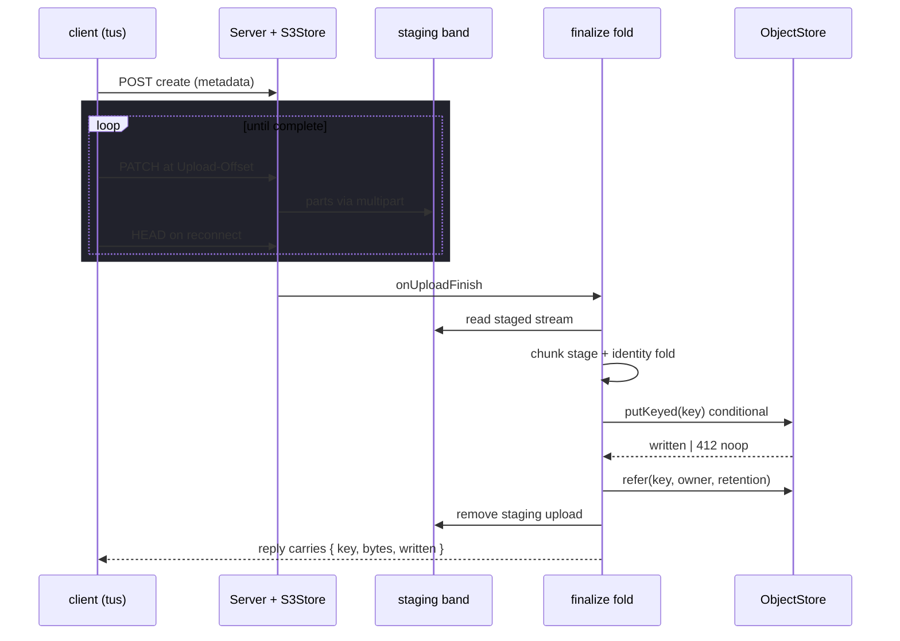

# [DATA_STREAM]

ONE resumable content-addressed rail moves bounded chunks, resumes at verified offsets, and proves one identity from first byte to durable key. Pull-based Web Streams enter BYOB; FastCDC mints chunk sub-keys under the core digest; an incremental digest fold bounds memory. Tus maps offsets onto staged S3 parts, and finalize re-homes bytes through conditional object legs where 412 is dedup success. Ranged reads remain stable because content keys cannot change.

## [01]-[INDEX]

- [02]-[BYTE_INGRESS]: BYOB lift, bounded form-data seam, backpressure law.
- [03]-[CHUNK_STAGE]: owned FastCDC wasm surface, chunk receipts, sub-key identity.
- [04]-[IDENTITY_FOLD]: incremental digest session, one-identity law, checkpointed resume state.
- [05]-[RESUME_RAIL]: tus server over the S3 staging store, hooks, finalize re-home, receipt route, protocol growth.
- [06]-[RANGE_READS]: ranged resumable reads over content and staging bands.

## [02]-[BYTE_INGRESS]

- Owner: the ingress lifts — `Rail.bytes` over any `ReadableStream<Uint8Array>` through the BYOB reader, and `Rail.form(schema)` — the typed and bounded multipart seam for direct HTTP ingest — one pull geometry whose demand propagates upstream so a fast producer throttles to the slow consumer with order and completeness preserved.
- Packages: `effect` (`Stream.fromReadableStreamByob`, `Stream.fromReadableStream`); `@effect/platform` (`Multipart` — `schemaPersisted`, `withLimits`, `toPersisted`, `HttpApiSchema.Multipart` typed endpoints).
- Entry: every byte source in the unit enters here — a fetch body, a staged tus read lifted from its `Readable` through the platform interop, a filesystem stream from `object/file.md` — and leaves as one `Stream<Uint8Array>` the chunk stage consumes; no consumer meets a raw reader.
- Growth: a new byte source is one lift call; the allocation size and the form bounds are policy values, never per-site literals.
- Law: ingress is pull — the BYOB reader drives `pull()` by `desiredSize`, and the Effect stream carries backpressure, typed errors, and `Scope` release; eager body materialization is a memory defect.
- Law: form-data ingest is typed AND bounded before any byte materializes — `Multipart.schemaPersisted(schema)` proves the whole form as one decoded struct and `Multipart.withLimitsStream` composes the bounds onto the part stream as a value at the seam (never ambient fiber-ref mutation at call sites); `maxParts`, `maxFileSize`, and `maxTotalSize` are `Option`-shaped by the fiber-ref contract, so an unbounded axis is a spelled `Option.none()`, never an omission; file parts hand into this same lift.
- Law: `_FORM` decides every SPAN axis the seam carries and the platform keeps the field mime roster — `Shape.Ingress.bytes` projects into both the per-file and the aggregate ceiling while `frames` projects into the part count, because the three references default to absent, absent, and absent respectively and an omitted aggregate admits the part count multiplied by the file span; the mime roster stays the platform's own gate, since widening it decodes octet payloads as in-memory FIELDS beside the streaming lift this rail exists to hold.

```typescript signature
import { Effect, Option, Schema, Stream } from "effect"
import { Multipart } from "@effect/platform"
import { Shape } from "@rasm/core"
import { ObjectFault } from "./store.ts"

const _INGRESS = {
  allocBytes: 256 * 1024,
  ceiling: Schema.decodeSync(Shape.Ingress.Schema)({
    ...Shape.Ingress.floor,
    bytes: 512 * 1024 * 1024,
    frames: 32,
  }),
} as const

const _FORM = {
  maxFileSize: Option.some(_INGRESS.ceiling.bytes),
  maxParts: Option.some(_INGRESS.ceiling.frames),
  maxFieldSize: Math.min(64 * 1024, _INGRESS.ceiling.bytes),
  // `maxTotalSize` is the one axis reaching the whole-body ceiling, and that reference defaults to absent: bounds on
  // part count and per-file span still admit their PRODUCT, so the aggregate reads the same ingress byte ceiling one
  // file may spend and a form cannot buy span by splitting itself across parts.
  maxTotalSize: Option.some(_INGRESS.ceiling.bytes),
} satisfies Multipart.withLimits.Options

const _bytes = (body: ReadableStream<Uint8Array>): Stream.Stream<Uint8Array, ObjectFault> =>
  Stream.fromReadableStreamByob(
    () => body,
    (caught) => new ObjectFault({ case: { reason: "io", key: "<ingress>", detail: String(caught) } }),
    _INGRESS.allocBytes,
  )

const _form = <A, I extends Partial<Multipart.Persisted>>(shape: Schema.Schema<A, I>) =>
  (parts: Stream.Stream<Multipart.Part, Multipart.MultipartError>) =>
    Effect.flatMap(
      Multipart.toPersisted(Multipart.withLimitsStream(parts, _FORM)),
      Multipart.schemaPersisted(shape),
    )
```

## [03]-[CHUNK_STAGE]

- Owner: the content-defined chunk stage — `Rail.chunked`, a stream transform re-cutting the byte flow at Gear-hash boundaries so an insert or delete re-aligns cut points and versioned payloads dedup maximally — and the `ChunkMark` receipt carrying each chunk's span and sub-key.
- Packages: the owned FastCDC wasm surface (a `wasm-pack` build of the maintained Rust `fastcdc` crate, normalized-chunking v2020, held as a folder-owned artifact behind a capability Tag per the wasm boundary law — every published JS/wasm npm binding is years stale and refused); `@rasm/core` (`Digest` — the sub-key mint); `effect` (`Stream`, `Chunk`).
- Entry: `Rail.chunked(bytes, policy)` between ingress and the identity fold; the policy row carries `{ min, avg, max }` cut bounds; consumers that need whole-payload identity only skip the stage — chunking earns its cost where dedup or chunk-level proofs are real.
- Receipt: `ChunkMark` — `{ seq, offset, bytes, sub }` — the sub-key is `Digest.mint("content", chunkBytes)`, the SAME algebra as the object key at finer grain, so chunk identity and object identity share one mint and a second hashing vocabulary is unspellable.
- Law: the Merkle proof tree is one fold over the chunk receipts — `Rail.prove(marks)` folds the proven-non-empty mark set through the core digest's `proof` row (`createBLAKE3(256)`, the `ProofKey` brand): each leaf mints over its sub-key's decoded bytes under the leaf framing byte, pairs join under the node byte, an odd node promotes, and the receipt carries `{ root, leaves, depth, paths }`; every path is the ordered sibling-key and side sequence for its `ChunkMark.seq`, so a range consumer verifies any admitted leaf in `O(log n)` without rebuilding the tree.
- Law: the leaf census has ONE source and it is the mark set — `_fold` answers the root, the height, and the paths a level determines and returns no `leaves` at all, while `_prove` supplies `marks.length` once at the mint; a count re-derived per level is both an O(n) walk the tree does not need and a second authority the mint overwrites anyway.
- Law: proof decoding stays on the object integrity rail — a malformed branded key or an impossible empty reduction is `ObjectFault { reason: "integrity" }`, never `die`, `orDie`, or an unchecked assertion hidden beneath the proof surface.
- Law: the wasm module is capability, not code — instantiation is a scoped acquisition behind the Tag, cuts run through the marked kernel, and no linear-memory view escapes; the stage is a pure `Stream` transform above that seam.
- Law: cut bounds are policy data — the row travels with the payload class (artifact, snapshot, media), and re-cutting with different bounds mints different sub-keys by construction, so the policy row is part of the dedup contract and never drifts silently.

```typescript signature
import { Array, Context } from "effect"
import { Digest } from "@rasm/core"

declare namespace Rail {
  type CutPolicy = { readonly min: number; readonly avg: number; readonly max: number }
  type ChunkMark = { readonly seq: number; readonly offset: number; readonly bytes: number; readonly sub: Digest.Key<"content"> }
  type ProofStep = { readonly side: "left" | "right"; readonly sibling: Digest.Key<"proof"> }
  type ProofPath = { readonly seq: number; readonly leaf: Digest.Key<"proof">; readonly steps: ReadonlyArray<ProofStep> }
  type Proof = { readonly root: Digest.Key<"proof">; readonly leaves: number; readonly depth: number; readonly paths: ReadonlyArray<ProofPath> }
}

class Cutter extends Context.Tag("data/Cutter")<Cutter, {
  readonly cut: (policy: Rail.CutPolicy) => (bytes: Stream.Stream<Uint8Array, ObjectFault>) => Stream.Stream<Uint8Array, ObjectFault>
}>() {}

const _CUT = { min: 256 * 1024, avg: 1024 * 1024, max: 4 * 1024 * 1024 } as const satisfies Rail.CutPolicy

// `R` rides through: the cutter itself lands there, and a byte source carries its own capability — a filesystem, a
// staging store, a relational slice — so a pinned `never` fixes the fold to sources needing nothing and leaves
// every other caller re-implementing it.
const _chunked = <R>(bytes: Stream.Stream<Uint8Array, ObjectFault, R>, policy: Rail.CutPolicy) =>
  Stream.unwrap(
    Effect.map(Cutter, (cutter) =>
      cutter.cut(policy)(bytes).pipe(
        Stream.mapAccumEffect({ seq: 0, offset: 0 }, (state, chunk) =>
          Effect.map(Digest.mint("content", chunk), (sub) =>
            [
              { seq: state.seq + 1, offset: state.offset + chunk.byteLength },
              { chunk, mark: { seq: state.seq, offset: state.offset, bytes: chunk.byteLength, sub } satisfies Rail.ChunkMark },
            ] as const),
        ),
      )),
  )

const _DOMAIN = { leaf: Uint8Array.of(0), node: Uint8Array.of(1) } as const // Framing byte is this page's domain separation and the core proof row's consumer obligation.

type _ProofNode = { readonly hash: Digest.Key<"proof">; readonly paths: ReadonlyArray<Rail.ProofPath> }

const _proofFault = (key: string) => (fault: unknown): ObjectFault =>
  new ObjectFault({ case: { reason: "integrity", key, detail: String(fault) } })

const _joinedWith = (left: _ProofNode, pair: Array.NonEmptyReadonlyArray<_ProofNode>): Effect.Effect<_ProofNode, ObjectFault> =>
  Option.match(Array.get(pair, 1), {
    onNone: () => Effect.succeed(left),
    onSome: (right) =>
      Effect.map(
        Effect.flatMap(
          Effect.all([
            Effect.mapError(Schema.encode(Digest.codecs.proof.bytes)(left.hash), _proofFault(left.hash)),
            Effect.mapError(Schema.encode(Digest.codecs.proof.bytes)(right.hash), _proofFault(right.hash)),
          ]),
          ([leftBytes, rightBytes]) => Digest.mint("proof", [_DOMAIN.node, leftBytes, rightBytes]),
        ),
        (hash): _ProofNode => ({
          hash,
          paths: [
            ...Array.map(left.paths, (path) => ({ ...path, steps: Array.append(path.steps, { side: "right", sibling: right.hash }) })),
            ...Array.map(right.paths, (path) => ({ ...path, steps: Array.append(path.steps, { side: "left", sibling: left.hash }) })),
          ],
        }),
      ),
  })

const _joined = (pair: Array.NonEmptyReadonlyArray<_ProofNode>): Effect.Effect<_ProofNode, ObjectFault> =>
  _joinedWith(Array.headNonEmpty(pair), pair)

// Folding answers the three facts a LEVEL determines — surviving root, climbed height, threaded paths — and never the
// leaf census, which is a fact of the mark set the caller already holds; carrying it here bought one O(n) walk per
// level whose every result the mint overwrote.
const _fold = (
  nodes: Array.NonEmptyReadonlyArray<_ProofNode>,
  depth: number,
): Effect.Effect<Omit<Rail.Proof, "leaves">, ObjectFault> =>
  nodes.length === 1
    ? Effect.succeed({ root: Array.headNonEmpty(nodes).hash, depth, paths: Array.headNonEmpty(nodes).paths })
    : Effect.flatMap(Effect.forEach(Array.chunksOf(nodes, 2), _joined), (level) =>
        Array.isNonEmptyReadonlyArray(level)
          ? _fold(level, depth + 1)
          : Effect.fail(new ObjectFault({ case: { reason: "integrity", key: "<proof>", detail: "<empty-level>" } })))

const _prove = (marks: Array.NonEmptyReadonlyArray<Rail.ChunkMark>): Effect.Effect<Rail.Proof, ObjectFault> =>
  Effect.flatMap(
    Effect.forEach(marks, (mark) =>
      Effect.map(
        Effect.flatMap(
          Effect.mapError(Schema.encode(Digest.codecs.content.bytes)(mark.sub), _proofFault(mark.sub)),
          (bytes) => Digest.mint("proof", [_DOMAIN.leaf, bytes]),
        ),
        (leaf): _ProofNode => ({ hash: leaf, paths: [{ seq: mark.seq, leaf, steps: [] }] }),
      )),
    (leaves) =>
      Array.isNonEmptyReadonlyArray(leaves)
        ? Effect.map(_fold(leaves, 0), (proof) => ({ ...proof, leaves: marks.length }))
        : Effect.fail(new ObjectFault({ case: { reason: "integrity", key: "<proof>", detail: "<empty-leaves>" } })),
  )
```

## [04]-[IDENTITY_FOLD]

- Owner: `Rail.identity` folds chunks to `Digest.Key<"content">`; its serializable actor carries a sealed checkpoint at the verified offset.
- Packages: core `Digest.Session`; `@effect/experimental` serializable machines; `effect` streams, effects, and schemas.
- Entry: the finalize fold runs `Rail.identity` over the staged read; a client-side leg runs the same fold in the browser (the core digest is isomorphic across runtimes) so the announced key and the server-verified key are one mint by construction.
- Receipt: `{ key, bytes, chunks, checkpoint, frozen }` — the object key, total span, chunk census, live checkpoint, and schema-encoded machine snapshot; transport-level `x-amz-checksum` verification rides the object client's checksum policy in parallel, and the two proofs answer different questions: the trailer proves the wire, the mint proves identity.
- Growth: a windowed rolling digest for chunk-run verification is a consumer fold over `absorb`/`finish` — the session algebra already carries it.
- Law: one identity end to end — client-computed address, store-verified checksum, and core key converge on the same digest value; a second hashing or chunking vocabulary anywhere on the rail is the named cross-language drift defect the core key page seals.
- Law: the resume checkpoint is `{ offset, chunks, session }` — `Absorb` advances bytes, chunk census, and digest state atomically on the machine's serialized request plane; `IdentityActor.changes` exposes each acknowledged checkpoint for the durable subscriber to `freeze`, the terminal fold always snapshots its final state, and `Machine.restore` re-admits persisted state through the checkpoint schema before another byte can enter.
- Law: `Schema.Redacted` seals saved hasher state; `Digest.Session.open` validates it against the content algorithm before any absorb or finish.

```typescript signature
import { Machine } from "@effect/experimental"
import { Schema } from "effect"

const _Checkpoint = Schema.Struct({
  offset: Schema.Int.pipe(Schema.nonNegative()),
  chunks: Schema.Int.pipe(Schema.nonNegative()),
  session: Schema.Redacted(Schema.Uint8ArrayFromSelf),
})

declare namespace Rail {
  type Checkpoint = typeof _Checkpoint.Type
  type FrozenIdentity = readonly [input: unknown, state: unknown]
  type IdentityActor = {
    readonly absorb: (chunk: Uint8Array) => Effect.Effect<Checkpoint>
    readonly checkpoint: Effect.Effect<Checkpoint>
    readonly changes: Stream.Stream<Checkpoint>
    readonly freeze: Effect.Effect<FrozenIdentity, ObjectFault>
  }
}

class _Absorb extends Schema.TaggedRequest<_Absorb>()("Absorb", {
  failure: Schema.Never,
  success: _Checkpoint,
  payload: { chunk: Schema.Uint8ArrayFromSelf },
}) {}

const _identityMachine = Machine.makeSerializable({ state: _Checkpoint, input: _Checkpoint }, (origin, previous) =>
  Machine.serializable.make(previous ?? origin).pipe(
    Machine.serializable.add(_Absorb, ({ request, state }) =>
      Effect.flatMap(Digest.Session.open("content", state.session), (session) =>
        Effect.map(Digest.Session.absorb(session, request.chunk), (advanced) => {
          const next = {
            offset: state.offset + request.chunk.byteLength,
            chunks: state.chunks + 1,
            session: Digest.Session.checkpoint(advanced),
          }
          return [next, next] as const
        }))),
  ))

const _identitySurface = (actor: Machine.SerializableActor<typeof _identityMachine>): Rail.IdentityActor => ({
  absorb: (chunk) => actor.send(new _Absorb({ chunk })),
  checkpoint: actor.get,
  changes: actor.changes, // the actor is Subscribable, never itself the stream: `get` and `changes` are its two reads
  freeze: Effect.mapError(Machine.snapshot(actor), _proofFault("<identity-snapshot>")),
})

const _identityActor = (checkpoint?: Rail.Checkpoint) =>
  Effect.flatMap(
    checkpoint === undefined
      ? Effect.map(Digest.Session.open("content"), (session): Rail.Checkpoint => ({
          offset: 0,
          chunks: 0,
          session: Digest.Session.checkpoint(session),
        }))
      : Effect.succeed(checkpoint),
    (origin) => Effect.map(Machine.boot(_identityMachine, origin), _identitySurface),
  )

const _restoreIdentity = (frozen: Rail.FrozenIdentity) =>
  Effect.map(
    Effect.mapError(Machine.restore(_identityMachine, frozen), _proofFault("<identity-restore>")),
    _identitySurface,
  )

const _identity = <R>(
  flow: Stream.Stream<{ readonly chunk: Uint8Array; readonly mark: Rail.ChunkMark }, ObjectFault, R>,
  checkpoint?: Rail.Checkpoint,
) =>
  Effect.scoped(Effect.gen(function* () {
    const actor = yield* _identityActor(checkpoint)
    yield* Stream.runForEach(flow, (piece) => actor.absorb(piece.chunk))
    const held = yield* actor.checkpoint
    const session = yield* Digest.Session.open("content", held.session)
    const key = yield* Digest.Session.finish(session)
    const frozen = yield* actor.freeze
    return { key, bytes: held.offset, chunks: held.chunks, checkpoint: held, frozen }
  }))
```

## [05]-[RESUME_RAIL]

- Owner: the tus assembly — staged `S3Store`, hook-armed `Server`, PATCH-exclusive `MemoryLocker`, finalize re-home, staging groom, and the protocol row that swaps to the IETF form without store or hook edits; beneath it the shared custody landing every byte source on this page spends, and `Rail.preserve`, the `journal/retain.md` `Preserve` port it satisfies.
- Packages: `@tus/server` (`Server`, `Upload`, `EVENTS`, `MemoryLocker`, `RouteHandler`, `server.get`, `ServerOptions` — `onUploadCreate`/`onIncomingRequest`/`onResponseError`/`lockDrainTimeout`/`postReceiveInterval`/`namingFunction`/`getFileIdFromRequest`); `@tus/s3-store` (`S3Store` — `partSize`/`minPartSize`/`maxConcurrentPartUploads`/`useTags`/`cache`, the `DataStore` `getUpload`/`read`/`remove` members); `@aws-sdk/lib-storage` (through `object/store.md`'s `putKeyed` — the streaming conditional re-home); `effect` (`Effect`, `Exit`, `Layer`, `Metric`, `Runtime`, `Schedule`); `@rasm/core` (`Convention` — the throughput instrument row; `Fault.Class` — the status projection's lattice); `journal/append.md` (`Hook` — the `objectAdmit` veto and observe taps); `journal/retain.md` (`SubjectKey`, `Retain.slice` — the preservation port's subject and its collection rendering).
- Entry: the serving plane mounts `rail.node` (node req/res) or `rail.web` (fetch Request→Response) under its route; the browser leg is `tus-js-client` driving POST/PATCH/HEAD against this mount and the receipt GET beside it — a ui-branch consumer of the wire protocol, never of this module.
- Receipt: `onUploadFinish` returns the finalize receipt onto the reply — `{ key, bytes, written }` — so the client learns its content key in the completing response; the 412 case reads `written: false`, the dedup success; `${route}/receipt?upload=<id>` answers the SAME receipt for a staged id, which is the only road a resumed leg has to it.
- Growth: a per-caller quota is the `maxSize` function reading the caller's admission; a second staging band (media versus artifact) is a second `Rail.of` with its own cut policy and retention row; RUFH lands as the protocol row swap.
- Law: staging and content never share keys — tus ids are random staging identity, `namingFunction` prefixes the staging band, and identity exists only after the finalize fold; a staging key leaking as a content coordinate is the named defect.
- Law: the band prefix binds mint to extraction as ONE pair — the mount route publishes only the id's last segment, so `namingFunction` and `getFileIdFromRequest` are written together and a band prefix landed without its extractor resolves every resume against a key the store never held; a custom extractor also OWNS the traversal refusal, since the built-in check it replaces is what otherwise rejects a `/`, a `\`, or a NUL reaching the store as a key.
- Law: the `Rail.Spec` row answers the whole descriptor a mount selects on, and the staging band's coordinates differ from the content plane's in exactly the way that matters — `route` with `cut` names what a band FITS, the tus create/PATCH handshake is its ADMISSION, TENANCY rides the resolved `owner` stamped into upload metadata at create and carried into the reference row at finalize (so a band is multi-tenant by that value, never by a second staging bucket), LIFETIME is the `expirationPeriodInMilliseconds` window the groom enforces and the band ENDS ITSELF, which is the coordinate the content plane cannot answer since a content object's life is refcount-and-sweep; DEGRADE is that a staging body is disposable by construction — an abandoned upload buys nothing back, a client resuming past the expiry window restarts from byte zero, and no chunk staged here is addressable until the finalize fold mints its key.
- Law: the staging expiry never exceeds the object plane's reap floor — the multipart reap and the engine's abort rule close abandoned uploads at that floor blind to bands, so a window past it promises a resume the reap has already aborted; `_STAGE.expiry` sits at the floor, and the groom, the reap, and the engine rule close one window.
- Law: the hook seams are the admission and gate rows — `onUploadCreate` stamps the staging owner into the upload metadata before creation, `onIncomingRequest` runs the spec's `gate` (the serving plane's admission handoff) per request, `onResponseError` folds every error reply into one structured log, and `postReceiveInterval` paces the progress events the `EVENTS` taps observe — every seam a `Rail.Spec` value, never a fork of the handler classes.
- Law: the create seam IS the `rasm.data.object.admit` veto point — after the spec's `admit` enriches metadata, `Hook.gated("objectAdmit", ...)` runs the app-armed veto with the staging id, resolved owner, and declared length (`Option`-carried because a deferred-length upload declares none), and a refusal reaches the client through `_bridged` as its own class-derived status; the finalize fold fans the same point's observe taps with the landed content key AFTER the conditional re-home and reference row commit, so no subscriber sees a key that is not yet durable.
- Law: `_bridged` is the ONE hook bridge and `_STATUS` its one projection — the fiber's `Exit` folds through `Fault.Class.of`, which reads typed failures by their `class` and defects onto the `defect` rung, so both channels answer one status roster and neither escapes unclassified; `Runtime.runPromise` rejects with a `FiberFailure` carrying no `class`, so a hook rejecting straight through collapses every refusal — the admission veto, the absent staged body, the integrity failure — onto one opaque server fault a resumable client cannot tell from a transient one, and the veto's 403 and the exhausted rung's 429 exist only because the projection runs before the rejection leaves the fiber.
- Law: `_finalized` is ONE fold TWO seams enter — `onUploadFinish` on the completing PATCH, and the `${route}/receipt` GET for a staged id — because the handler commits the written offset to the store BEFORE the finish hook and rethrows the hook's refusal, so a failed finalize leaves a staged upload sitting at `offset === size`; a resuming client HEADs that upload, reads a complete offset, and emits SUCCESS off a reply carrying no receipt at all, which reports a landed content object where none exists. Re-entry costs nothing because the fold is already idempotent, and an incomplete staged body refuses on the `missing` reason rather than hashing a partial payload into a wrong key.
- Law: `server.get` registers an EXACT pathname and never a pattern, so the staged id rides the query string — a path segment falls through to the GET handler's own staged-byte serve, which streams a completed staging body to any id the gate admits.
- Law: `_STATUS` binds the browser leg, whose default predicate retries every non-4xx reply and, among 4xx, only 409 and 423, abandoning the rest — `conflicted` 409 self-heals through the HEAD that re-reads the offset, `unavailable` 503 backs off, `absent` 404 and `expired` 410 clear the stored url and restart from byte zero ONLY where that leg carries `endpoint` beside its upload url, and `exhausted` 429 — the one rung whose whole meaning is retry-later — abandons unless the leg widens the carve through `onShouldRetry`; retry attempts also RESET whenever the offset advanced since the last one, so a 5xx arriving after accepted bytes retries unboundedly, which is what `unavailable` wants and what `defect` must never ride.
- Law: the ui leg therefore states three things this page cannot: `endpoint` beside the upload url, the 429 widening on `onShouldRetry`, and a receipt read that falls to `${route}/receipt` whenever success arrives off a HEAD carrying no body.
- Law: `onResponseError` OBSERVES and never re-projects a shaped arrival — its parameter union is the discriminant tus supplies, so the bridge's own `{ status_code, body }` passes through and only a bare internal `Error` classifies; a second projection over an already-shaped refusal reads a value no longer carrying the fault and overwrites the status the bridge decided.
- Law: resumable-upload throughput projects from the finalize receipt — the landed span increments `streamSize` once per completed upload, so the rate is throughput; a per-PATCH meter double-counts retries.
- Law: finalize is fold-then-conditional — read the staged object as a stream, run the chunk stage and the identity fold, re-home through the streaming conditional put (`putKeyed` carrying the proven span), record the reference row through `store.refer` (the derived retention tag lands with it), remove the staging upload; the whole fold is idempotent because the re-home lands 412 on replay, the reference upsert re-arms, and the staging removal is the only destructive step, ordered last and best-effort — once `store.refer` commits, the receipt is settled truth, a failed staging delete logs as cleanup debt, and groom's `deleteExpired` retires the orphan, so no delete failure can fail `onUploadFinish` after durability.
- Law: finalize is TWO bounded staging reads by the same law that governs disk intake — the content key cannot exist before the last byte is hashed, so the identity pass precedes the re-home pass and memory stays constant at any size; a buffering tee that halves staging egress buys bytes with unbounded memory and is the rejected trade. Both byte sources on this page spend ONE landing across those two passes, taking a re-runnable slice and its cut policy, so the tus finalize and the preservation port can never disagree on identity, span, or reference ordering.
- Law: the owner is INGRESS at BOTH tus seams — the create hook admits the client's declared metadata through `ObjectStore.admit` and the finalize fold re-admits the stamped value, because that value crossed the staging store as text and a resumed leg witnessed no create-seam verdict; an undeclared owner takes the band's own mint, and the minted-below prefixes refuse, so an upload can neither stamp itself into a subject's DSAR export nor join a hold it never earned.
- Law: `Rail.preserve` is the object-plane end of the hold's preservation contract — it decodes the subject's custody owner at this boundary, folds the handed slice through the same identity pass, and lands the reference row whose retag reads the live hold; the class rides the declaration's own choice rather than a literal here, because the journal owns what evidence a matter is worth.
- Law: every provider promise on the resume rail converts through `Effect.tryPromise` into `ObjectFault` — the staged read, the re-home, the staging removal, the dispatch members, and the groom alike — so a failed staging read or removal is a typed rail outcome, never a bare rejection; `Effect.promise` is unspellable on this page because no tus or store promise is rejection-free.
- Law: the groom never sleeps — `cleanUpExpiredUploads` and store `deleteExpired` ride the maintenance cadence, so abandoned uploads cost one expiration window.
- Boundary: the tus construction is the page's platform-forced kernel — the `Server`/`S3Store` mints, the hook callbacks bridged through `_bridged` (the Exit projection whose throw IS the tus-conformant error reply), the `Readable.toWeb` node-web interop whose element type the node declarations erase (the `as ReadableStream<Uint8Array>` re-pin), and the `crypto.randomUUID` staging-id mint all live inside this one seam; above it the rail is typed end to end.
- Growth: a durable snapshot store subscribes to `IdentityActor.changes` and persists `freeze` after acknowledged offsets; cluster placement and replay remain runtime-plane policies over this serializable actor, never a second digest machine.


```mermaid conceptual
sequenceDiagram
  accTitle: Resumable upload finalization
  accDescr: The client uploads resumable parts into staging, and the finalize fold proves identity, conditionally lands the content object, records retention, and removes staging last.
  participant C as client (tus)
  participant S as Server + S3Store
  participant G as staging band
  participant F as finalize fold
  participant O as ObjectStore
  C->>S: POST create (metadata)
  rect rgb(33, 34, 44)
    loop until complete
      C->>S: PATCH at Upload-Offset
      S->>G: parts via multipart
      C->>S: HEAD on reconnect
    end
  end
  S->>F: onUploadFinish
  F->>G: read staged stream
  F->>F: chunk stage + identity fold
  F->>O: putKeyed(key) conditional
  O-->>F: written | 412 noop
  F->>O: refer(key, owner, retention)
  F->>G: remove staging upload
  F-->>C: reply carries { key, bytes, written }
```

```typescript signature
import { Duration, Exit, Metric, Redacted, Runtime } from "effect"
import { EVENTS, MemoryLocker, Server, type Upload } from "@tus/server"
import { S3Store } from "@tus/s3-store"
import { Readable } from "node:stream"
import type http from "node:http"
import { Convention, Fault } from "@rasm/core"
import { Hook } from "../journal/append.ts"
import { ObjectStore } from "./store.ts"
import { Retain, SubjectKey } from "../journal/retain.ts"

const _streamed = Convention.mount(Convention.metric.streamSize)

declare namespace Rail {
  type Admission = { readonly id: string; readonly metadata: Readonly<Record<string, string | null>> }
  type Spec = {
    readonly route: string
    readonly staging: string
    readonly cut: CutPolicy
    readonly maxBytes: number
    readonly retention: Retain.Class
    readonly admit?: (req: Request, upload: Admission) => Effect.Effect<Readonly<Record<string, string | null>>, ObjectFault>
    readonly gate?: (req: Request, uploadId: string) => Effect.Effect<void, ObjectFault>
  }
}

const _STAGE = {
  expiry: Duration.hours(24), // at the object plane's reap floor, never past it: the multipart reap and the engine's abort rule close any older upload band-blind, so a wider window promises a resume the reap already aborted
  lockDrain: Duration.seconds(10),
  pulse: Duration.seconds(5),
} as const

const _staged = (staging: S3Store, id: string) =>
  Effect.tryPromise({
    try: () => staging.read(id),
    catch: (caught) => new ObjectFault({ case: { reason: "io", key: id, detail: String(caught) } }),
  })

// One row per fault class, total over the core lattice, so a widened rung fails at this declaration rather than
// collapsing into the store's own opaque fallback. Refusals partition by BLAME the class already carries: caller-blamed
// rungs answer their own 4xx and system-blamed rungs answer a retryable 5xx, which is what a resumable client needs to
// decide between re-issuing the request and abandoning the upload.
const _STATUS: { readonly [K in Fault.Class.Kind]: number } = {
  absent: 404,
  conflicted: 409,
  invalid: 422,
  malformed: 400,
  denied: 403,
  expired: 410,
  exhausted: 429,
  unavailable: 503,
  breached: 422,
  defect: 500,
}

// `Fault.Class.of` reads a `Cause` and folds BOTH channels through one lattice — typed failures by their own `class`,
// defects onto the `defect` rung — so a bridge that dies never escapes as an unclassified rejection.
const _replied = (cause: unknown): { readonly status_code: number; readonly body: string } =>
  ((kind) => ({ status_code: _STATUS[kind], body: `${kind}\n` }))(Fault.Class.of(cause))

// EVERY tus hook rides this one bridge. `Runtime.runPromise`'s own rejection carries a FiberFailure holding no `class`,
// so a hook that merely rejected would classify every refusal `defect` and answer 500 to all of them; projecting the
// Exit here and THROWING the shaped value takes the seam's documented path, where a thrown `{ status_code, body }`
// becomes the reply verbatim.
const _bridged = <A, E>(runtime: Runtime.Runtime<never>, work: Effect.Effect<A, E>): Promise<A> =>
  Runtime.runPromise(runtime)(Effect.exit(work)).then(
    Exit.match({
      onFailure: (cause) => { throw _replied(cause) },
      onSuccess: (value) => value,
    }),
  )

// Same Exit projection as the bridge, answering a REPLY rather than throwing one: the receipt route is an ordinary GET
// no tus error path reads, so its status has to land on the response itself.
const _served = <A>(runtime: Runtime.Runtime<never>, work: Effect.Effect<A, ObjectFault>): Promise<Response> =>
  Runtime.runPromise(runtime)(Effect.exit(work)).then(
    Exit.match({
      onFailure: (cause) => ((reply) => new Response(reply.body, { status: reply.status_code }))(_replied(cause)),
      onSuccess: (value) => new Response(JSON.stringify(value), { status: 200 }),
    }),
  )

// ONE custody landing, and the whole reason the finalize fold and the hold's preservation port cannot drift: two
// bounded passes over a RE-RUNNABLE slice — the identity pass proves the key before any byte is addressed, the
// streaming conditional lands it under the proven span, and the reference row commits before anything disposable is
// touched. The slice re-runs its own source per consumption, which is what buys constant memory at any size.
const _landed = <R>(
  store: ObjectStore,
  owner: ObjectStore.Owner,
  retention: Retain.Class,
  cut: Rail.CutPolicy,
  slice: Stream.Stream<Uint8Array, ObjectFault, R>, // every byte source folds its own fault family onto ObjectFault BEFORE the landing: a wider channel here is a knob no caller can spend, since the chunk stage admits exactly this one
) =>
  Effect.gen(function* () {
    // `store` arrives as a HANDLE rather than off the Tag: the tus kernel below runs its hooks on a `never`-
    // requirement runtime, so a landing acquiring its own service is unreachable from that bridge
    const identity = yield* _identity(_chunked(slice, cut))
    const landed = yield* store.putKeyed(
      identity.key,
      yield* Stream.toReadableStreamEffect(slice),
      identity.bytes,
    )
    yield* store.refer(landed.key, owner, retention)
    return { key: identity.key, bytes: identity.bytes, written: landed.written }
  })

// `journal/retain`'s `Preserve` port, satisfied HERE because this page already owns the identity fold and the
// conditional re-home the landing needs. The subject owner crosses up a stratum as text and admits at the object
// boundary like any other string, and the reference row's own retag reads the hold the declaration just committed,
// so the custody object takes the `held` posture with no second write on this road.
const _preserved = (subject: SubjectKey, retention: Retain.Class) =>
  Effect.gen(function* () {
    const store = yield* ObjectStore
    const owner = yield* Effect.mapError(
      Schema.decodeUnknown(ObjectStore.Owner)(subject.owner),
      () => new ObjectFault({ case: { reason: "owner", key: subject.subject, detail: "<preserve:owner>" } }),
    )
    yield* _landed(
      store,
      owner,
      retention,
      _CUT,
      Stream.mapError(
        Retain.slice(subject),
        (fault) => new ObjectFault({ case: { reason: "io", key: subject.subject, detail: String(fault) } }),
      ),
    )
  })

// ONE finalize fold, entered by the finish hook and by the receipt route alike. Handler code commits the written offset
// to the store BEFORE this runs and rethrows whatever it refuses with, so a refusal leaves a staged upload at
// `offset === size` that a resuming client reads as complete; idempotence makes the second entry free — the re-home
// lands 412 on replay, the reference upsert re-arms, and staging removal stays last and best-effort.
const _finalized = (spec: Rail.Spec, store: ObjectStore, staging: S3Store, upload: Upload) =>
  Effect.gen(function* () {
    // `upload.metadata` crossed the staging store as text, so it re-admits here rather than riding a create-seam
    // verdict a resumed leg never witnessed; the band's own row mints the fallback
    const owner = yield* Option.match(Option.fromNullable(upload.metadata?.owner), {
      onNone: () => Effect.succeed(ObjectStore.owner("tus", spec.staging)),
      onSome: ObjectStore.admit(upload.id),
    })
    const receipt = yield* _landed(
      store,
      owner,
      spec.retention,
      spec.cut,
      Stream.unwrap(Effect.map(_staged(staging, upload.id), (staged) =>
        _bytes(Readable.toWeb(staged) as ReadableStream<Uint8Array>))),
    )
    yield* Effect.tryPromise({
      try: () => staging.remove(upload.id),
      catch: (caught) => new ObjectFault({ case: { reason: "io", key: upload.id, detail: String(caught) } }),
    }).pipe(Effect.ignoreLogged) // staging cleanup is debt, never receipt truth: the durable object and its reference are committed, a failed delete logs, and groom's deleteExpired retires the orphaned staging body
    yield* Effect.ignore(Metric.incrementBy(_streamed, receipt.bytes)) // signal refusal cannot reopen an irreversible completion
    yield* Effect.ignore(
      Hook.tapped("objectAdmit", { key: receipt.key, owner, bytes: Option.some(receipt.bytes) }),
    ) // observe fan remains best-effort after the durable receipt is settled
    return receipt // Reply projects the receipt only; staging owns checkpoints and frozen hash state.
  })

const _rail = (spec: Rail.Spec) =>
  Effect.gen(function* () {
    const store = yield* ObjectStore
    const staging = new S3Store({
      s3ClientConfig: {
        bucket: store.bucket,
        endpoint: store.provider.endpoint,
        region: store.provider.region,
        forcePathStyle: store.provider.forcePathStyle,
        credentials: {
          accessKeyId: Redacted.value(store.provider.accessKeyId),
          secretAccessKey: Redacted.value(store.provider.secretAccessKey),
        },
      },
      partSize: store.partBytes,
      maxConcurrentPartUploads: store.partFlight,
      useTags: true,
      expirationPeriodInMilliseconds: Duration.toMillis(_STAGE.expiry),
    })
    const runtime = yield* Effect.runtime<never>()
    const server = new Server({
      datastore: staging,
      path: spec.route,
      maxSize: spec.maxBytes,
      locker: new MemoryLocker(),
      lockDrainTimeout: Duration.toMillis(_STAGE.lockDrain),
      postReceiveInterval: Duration.toMillis(_STAGE.pulse),
      // Band prefixing makes the id slash-bearing while the mount route publishes only its last segment, so mint and
      // extraction are ONE pair: the extractor re-attaches the band and owes the traversal refusal the built-in makes.
      namingFunction: () => `${spec.staging}/${crypto.randomUUID()}`,
      getFileIdFromRequest: (_req, lastPath) =>
        lastPath === undefined || lastPath.includes("/") || lastPath.includes("\\") || lastPath.includes("\0")
          ? undefined
          : `${spec.staging}/${lastPath}`,
      onUploadCreate: async (req, upload) =>
        _bridged(runtime, Effect.gen(function* () {
          const supplied = upload.metadata ?? {}
          const admitted = spec.admit === undefined
            ? {}
            : yield* spec.admit(req, { id: upload.id, metadata: supplied })
          // Client metadata is UNTRUSTED here: a declared owner decodes through the namespace and the minted-below
          // prefixes refuse, so an upload cannot stamp itself into a subject's DSAR export or hold join; an
          // undeclared one takes the band's own row rather than a hand-built string.
          const owner = yield* Option.match(Option.fromNullable(admitted.owner ?? supplied.owner), {
            onNone: () => Effect.succeed(ObjectStore.owner("tus", spec.staging)),
            onSome: ObjectStore.admit(upload.id),
          })
          // App-armed veto: its refusal carries a `denied` class the bridge answers 403, never the store's blanket 500.
          yield* Hook.gated("objectAdmit", { key: upload.id, owner, bytes: Option.fromNullable(upload.size) })
          return { metadata: { ...supplied, ...admitted, owner } }
        })),
      onIncomingRequest: async (req, uploadId) =>
        _bridged(runtime, spec.gate === undefined ? Effect.void : spec.gate(req, uploadId)),
      // tus hands this seam EITHER the bridge's own already-shaped refusal OR a bare Error from its internals, and the
      // parameter union is that discriminant: a shaped arrival passes through untouched, since re-projecting it reads
      // a value no longer carrying the fault and overwrites the status the bridge already decided.
      onResponseError: (_req, error) => "status_code" in error ? error : _replied(error),
      onUploadFinish: async (_req, upload) => ({
        status_code: 201,
        body: JSON.stringify(await _bridged(runtime, _finalized(spec, store, staging, upload))),
      }),
    })
    // `server.get` registers an EXACT pathname, so the staged id rides the query string: a path segment falls through
    // to the GET handler's own staged-byte serve. A removed staging id answers `missing`, which is itself durability
    // evidence — removal orders after `store.refer` — and the client already holds its own minted key from the
    // isomorphic browser-side fold, so it probes the object plane rather than this route once staging is gone.
    server.get(`${spec.route}/receipt`, (req) =>
      _served(
        runtime,
        Effect.flatMap(
          Option.match(Option.fromNullable(new URL(req.url).searchParams.get("upload")), {
            onNone: () => Effect.fail(new ObjectFault({ case: { reason: "missing", key: spec.staging, detail: "<receipt:upload>" } })),
            onSome: (id) =>
              Effect.tryPromise({
                try: () => staging.getUpload(id),
                catch: (caught) => new ObjectFault({ case: { reason: "missing", key: id, detail: String(caught) } }),
              }),
          }),
          (upload) =>
            upload.offset === upload.size
              ? _finalized(spec, store, staging, upload)
              : Effect.fail(new ObjectFault({ case: { reason: "missing", key: upload.id, detail: "<receipt:incomplete>" } })),
        ),
      ))
    server.on(EVENTS.POST_TERMINATE, (_req, _res, id) => {
      void Runtime.runPromise(runtime)(Effect.annotateLogs(Effect.logInfo("tus upload terminated"), { id }))
    })
    const fold = (key: string) => (caught: unknown): ObjectFault => new ObjectFault({ case: { reason: "io", key, detail: String(caught) } })
    return {
      node: (req: http.IncomingMessage, res: http.ServerResponse) =>
        Effect.tryPromise({ try: () => server.handle(req, res), catch: fold(spec.route) }),
      web: (req: Request) => Effect.tryPromise({ try: () => server.handleWeb(req), catch: fold(spec.route) }),
      groom: Effect.zipRight(
        Effect.tryPromise({ try: () => server.cleanUpExpiredUploads(), catch: fold(spec.staging) }),
        Effect.tryPromise({ try: () => staging.deleteExpired(), catch: fold(spec.staging) }),
      ),
    }
  })
```

## [06]-[RANGE_READS]

- Owner: the resumable read family — `Rail.range(key, span)` streaming a byte window of a content object, and the staging-band probe pair that resumes an interrupted serve.
- Packages: `@aws-sdk/client-s3` (`GetObjectCommand` `Range`/`PartNumber`, `HeadObjectCommand`); `effect` (`Stream`).
- Entry: the serving plane's byte egress and the browser's range-fetching consumers ride this read; a resumed download issues `Range: bytes=<offset>-` and receives the 206 remainder.
- Growth: part-aligned reads (`PartNumber`) land as a span variant when a consumer aligns to upload parts; the verified-streaming read verifies ranged chunks against `Rail.prove`'s root through their inclusion paths — the projection `[3]`'s growth row names.
- Law: content-band resume is structurally stale-proof — the key is the bytes, mutation is unrepresentable, so a resumed range needs no conditional and mid-transfer object change is impossible by identity; the staleness-guard conditional (`IfMatch` on the probed ETag) rides only staging-band reads, where bytes move under a stable id.
- Law: a range read is a stream, never a buffer — the response body lifts through the same `[2]` geometry, and a consumer that needs the whole object states no range and folds the stream.
- Boundary: `transformToWebStream` is the one SDK interop seam — the reply body's erased element type re-pins to `Uint8Array` at the lift and nowhere else.

```typescript signature
import { GetObjectCommand } from "@aws-sdk/client-s3"

const _range = (key: Digest.Key<"content">, span?: { readonly from: number; readonly to?: number }) =>
  Stream.unwrap(
    Effect.flatMap(ObjectStore, (store) =>
      Effect.map(
        Effect.tryPromise({
          try: (signal) =>
            store.client.send(new GetObjectCommand({
              Bucket: store.bucket, Key: key,
              ...(span !== undefined && { Range: `bytes=${span.from}-${span.to ?? ""}` }),
            }), { abortSignal: signal }),
          catch: store.folded(key),
        }),
        (reply) =>
          reply.Body === undefined
            ? Stream.fail(new ObjectFault({ case: { reason: "missing", key, detail: "<empty>" } }))
            : _bytes(reply.Body.transformToWebStream() as ReadableStream<Uint8Array>),
      )),
  )

const Rail = {
  cut: _CUT,
  bytes: _bytes,
  form: _form,
  chunked: _chunked,
  identity: _identity,
  identityActor: _identityActor,
  restoreIdentity: _restoreIdentity,
  prove: _prove,
  of: _rail,
  preserve: _preserved, // `journal/retain`'s Preserve port: the hold declaration's custody landing
  range: _range,
} as const

// --- [EXPORTS] --------------------------------------------------------------------------

export { Cutter, Rail }
```

## [07]-[RESEARCH]

(none)
