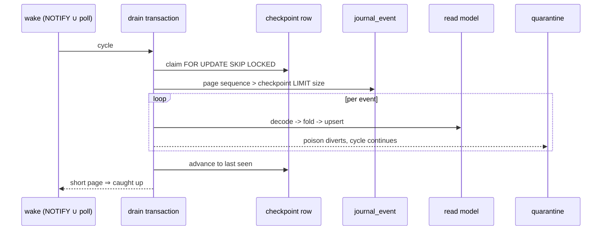

# [DATA_FOLD]

The projection plane: the durable altitude of the core fold contract. A lane binds one `Fold.Plan` to one keyed relation, and the same binding runs at three staleness budgets — the inline slot executing inside the publish transaction (budget zero, read-your-writes structural), the checkpointed drain daemon woken by LISTEN/NOTIFY and claimed under SKIP LOCKED (budget seconds, replicas cooperate with zero coordination), and the maintenance plane where the database itself owns the fold (`pg_ivm` views, `pg_incremental` exactly-once batch pipelines, `pg_cron` grooming) or a shadow-table replay repairs a drifted model under a session advisory lock. Poison never wedges a lane: a failing event diverts to a typed quarantine and the checkpoint advances past it. This page also mints `AsOf` — journal position plus event stamp — so every windowed and time-travel read upstream coordinates against real durable positions.

## [1]-[CLUSTERS]

| [INDEX] | [CLUSTER]      | [OWNS]                                                                             |
| :-----: | :------------- | :------------------------------------------------------------------------------------ |
|  [01]   | `LANE_SPEC`    | the plan-bound lane value, the keyed read-model relation, the `AsOf` mint               |
|  [02]   | `INLINE_SLOT`  | the zero-staleness lane — the slot the publish transaction executes                     |
|  [03]   | `DRAIN_DAEMON` | checkpoint ledger, SKIP-LOCKED claim, wake merge, quarantine, the daemon Layer          |
|  [04]   | `MAINTENANCE`  | cron/ivm/incremental rows and the shadow-table rebuild with atomic swap                 |

## [2]-[LANE_SPEC]

- Owner: `Lane.Spec` — one value binding a core `Fold.Plan<A, K, S>` to durability: the plan, the state schema, the target relation, the cell spelling of the plan's key, and the batch policy; `Lane.ddl` derives the relation's ensure row and `Lane.asOf` mints the time coordinate from a journal position.
- Packages: `@rasm/ts/core` (`Fold`, `AsOf`, `Hlc`); `effect` (`Schema`); `@effect/sql` (`SqlClient`); `lane/capability.md` (`Capability.Ensure` — the shape), `journal/evolve.md` (`Upcast.Plan` — the decode road every lane shares).
- Entry: an app declares lanes beside its journal binding — `Lane.of({ name, plan, state, table, cell, batch })` — and hands the inline projection to `publish` as a slot value while the daemon registers at the root; the plan arrives as a value from the core fold page and this page never re-declares fold algebra.
- Receipt: the persisted row is `{ cell, state, version, folded_at }` — the folded state under the plan's merge, the stream version it reflects, and the write stamp; a reader distinguishing staleness reads `version` against the journal head, both decoded loads.
- Growth: a new read model is one `Lane.of`; a new state field is the plan's business (the merge instance widens, the state schema follows); a lane never grows a second table.
- Law: the keyed upsert realizes the plan's fold durably — insert (`none -> lift`) and update (`some -> combine`) are the two arms of `ON CONFLICT (cell) DO UPDATE`, exactly the `HashMap.modifyAt` shape the core contract states, so the durable altitude and the memory altitude cannot disagree on merge semantics.
- Law: `cell` is the plan key's one string spelling — the lane's `cell` member projects `K` to the relation key and the invalidation coordinate alike, so the fold table, the reactive keys, and the quarantine rows address one vocabulary.
- Law: `Lane.asOf(sequence, stamp)` is the folder's `AsOf` mint — ordinal from the journal's global `sequence`, stamp from the event's `Hlc` — the coordinate the core versioned lanes, window reads, and resume tokens consume; a bare position tuple leaving this page is the defect the mint exists to prevent.

```typescript
import { Duration, Schema } from "effect"
import { AsOf, Fold, Hlc, Refined } from "@rasm/ts/core"
import { SqlClient } from "@effect/sql"
import type { Capability } from "../lane/capability.ts"
import { Journal, type StreamKey } from "../journal/append.ts"
import type { Upcast } from "../journal/evolve.ts"

declare namespace Lane {
  type Spec<A extends Journal.Event, K, S, I> = {
    readonly name: string
    readonly plan: Fold.Plan<A, K, S>
    readonly state: Schema.Schema<S, I>
    readonly table: string
    readonly cell: (key: K) => string
    readonly decode: Upcast.Plan<A>
    readonly batch: { readonly size: number; readonly patience: Duration.DurationInput }
  }
}

const _ddl = (table: string): Capability.Ensure => ({
  relation: table,
  pg: `CREATE TABLE IF NOT EXISTS ${table} (
    cell TEXT PRIMARY KEY,
    state JSONB NOT NULL,
    version BIGINT NOT NULL,
    folded_at TIMESTAMPTZ NOT NULL DEFAULT now());`,
  sqlite: `CREATE TABLE IF NOT EXISTS ${table} (
    cell TEXT PRIMARY KEY,
    state TEXT NOT NULL,
    version INTEGER NOT NULL,
    folded_at TEXT NOT NULL DEFAULT (strftime('%Y-%m-%dT%H:%M:%fZ','now')));`,
})

const _asOf = (sequence: number, stamp: Hlc): AsOf =>
  new AsOf({ stamp, ordinal: Schema.decodeSync(Refined.OrdinalKey)(sequence) })
```

## [3]-[INLINE_SLOT]

- Owner: `Lane.inline(spec)` — the projection of a lane into the `Journal.Slot` shape the publish transaction executes: current-rows-first keyed fold, one upsert statement per touched cell, and the invalidation keys stamped from the touched cells.
- Packages: `effect` (`Effect`, `Array`, `HashMap`, `Option`, `Schema`); `@effect/sql` (`sql.insert`, `sql.onDialectOrElse`); `journal/append.md` (`Journal.Slot` — the contract, `Journal.now`); `read/live.md` (`Live.cells` — the coordinate mint).
- Entry: the app passes `Lane.inline(spec)` in `Journal.Intent.slots` — the slot never imports the publish machinery and the publish machinery never imports the lane; the slot SHAPE is the whole contract, and an inline failure rolls the whole publish back.
- Growth: a new inline model is one more slot value in the intent; the slot roster per publish stays small by design pressure — the staleness-zero budget is earned by folds cheap enough to ride the write.
- Law: the fold is current-rows-first — the touched cells' held states load under `FOR UPDATE` on the spine (bare reads on the single-writer profiles), seed the in-memory fold table, absorb the batch through `Fold.step`, and the touched cells upsert — so the inline lane is incremental over the stream without replay, and a torn or reordered apply is unspellable inside the one transaction.
- Law: the slot stamps its whole band — `keys` settles before the fold runs (the slot contract computes coordinates from the stream alone), so the inline slot names `Live.band(name)` and member readers wake through band overlap; over-invalidation is the honest degradation `read/live.md` already legislates, and member-precise stamping is the drain daemon's, whose `Live.mutation` wrap knows its touched cells.
- Law: state persists through the lane's schema — `Schema.parseJson(spec.state)` encodes at write and every read decodes the same road, so a stale-schema row surfaces as `ParseError` and the repair is `[5]`'s rebuild, never an in-place patch.

```typescript
import { Array, Effect, HashMap, Option } from "effect"
import { Live } from "./live.ts"

const _held = <S, I>(sql: SqlClient.SqlClient, table: string, state: Schema.Schema<S, I>, cells: ReadonlyArray<string>) =>
  Effect.flatMap(
    sql.onDialectOrElse({
      orElse: () => sql`SELECT cell, state FROM ${sql(table)} WHERE ${sql.in("cell", cells)}`,
      pg: () => sql`SELECT cell, state FROM ${sql(table)} WHERE ${sql.in("cell", cells)} FOR UPDATE`,
    }),
    (rows) =>
      Effect.map(
        Effect.forEach(rows, (row) =>
          Effect.map(Schema.decodeUnknown(state)(Upcast.body(row["state"])), (held) =>
            [String(row["cell"]), held] as const)),
        HashMap.fromIterable,
      ),
  )

const _apply = <A extends Journal.Event, K, S, I>(spec: Lane.Spec<A, K, S, I>) =>
  (events: ReadonlyArray<A>, version: number) =>
    Effect.gen(function* () {
      const sql = yield* SqlClient.SqlClient
      const touched = Array.dedupe(Array.map(events, (event) => spec.cell(spec.plan.key(event))))
      const held = yield* _held(sql, spec.table, spec.state, touched)
      const seeded = Array.reduce(events, HashMap.empty<K, S>(), (table, event) =>
        Option.match(HashMap.get(held, spec.cell(spec.plan.key(event))), {
          onNone: () => table,
          onSome: (state) => HashMap.set(table, spec.plan.key(event), state),
        }))
      const step = Fold.step(spec.plan)
      const merged = Array.reduce(events, seeded, (table, event) => step(table, event)[0])
      const rows = yield* Effect.forEach(HashMap.toEntries(merged), ([key, state]) =>
        Effect.map(Schema.encode(Schema.parseJson(spec.state))(state), (encoded) => ({
          cell: spec.cell(key),
          state: encoded,
          version,
        })))
      yield* sql`INSERT INTO ${sql(spec.table)} ${sql.insert(rows)}
        ON CONFLICT (cell) DO UPDATE
        SET state = excluded.state, version = excluded.version, folded_at = ${Journal.now(sql)}`
      return touched
    })

const _inline = <A extends Journal.Event, K, S, I>(spec: Lane.Spec<A, K, S, I>): Journal.Slot<A> => ({
  keys: () => Live.band(spec.name),
  project: (_stream, events, receipt) => Effect.asVoid(_apply(spec)(events, receipt.version)),
})
```

## [4]-[DRAIN_DAEMON]

- Owner: the checkpoint and quarantine ensure rows, the SKIP-LOCKED claim, the wake merge, the bounded drain cycle, `Lane.daemon(spec)` as a `Layer<never>` registration node, and `Lane.replay(name, sequence)` as the quarantine re-entry.
- Packages: `effect` (`Effect`, `Stream`, `Schedule`, `Layer`, `Either`, `Option`, `Chunk`); `@effect/sql` (`SqlSchema` — the decoded checkpoint and page reads); `@effect/sql-pg` (`PgClient.listen` — read as an optional service); `journal/append.md` (`Journal.channel`), `journal/evolve.md` (`Snapshot.due`/`Snapshot.hydrate` — the cadence the lane composes after applies).
- Entry: the app composes `Lane.daemon(spec)` into its root — lifetime is the Layer's, the scope closing is stop; the drain applies through `Lane.inline`'s same upsert shape outside the publish transaction, wrapped in `Live.mutation` so drained folds wake readers.
- Receipt: `Option<Lane.Mark>` — `{ lane, checkpoint, drained }` per won cycle, `none` when the claim was held by a sibling replica (the skip is a value, never a sentinel coordinate); lag is `journal head − checkpoint`, both decoded reads, metered by the observability plane.
- Growth: a new wake source is one more stream merged into the wake; a batch axis is a `spec.batch` field; a second replica of a lane is deployment, not declaration — the claim already arbitrates.
- Law: the claim is the coordination — one checkpoint row per lane, `FOR UPDATE SKIP LOCKED` inside the drain transaction; a replica that misses the claim skips the cycle instead of blocking, the sqlite profiles serialize on the single writer through the dialect arm, and checkpoint advance commits atomically with the batch's upserts so a crash replays from the checkpoint into idempotent upserts.
- Law: the wake merges LISTEN with a spaced poll under the both-halt strategy — the pg arm streams `Journal.channel` notifications through the optional `PgClient` read, the profiles without a channel ride the poll alone, and a lost notification costs one patience window, never correctness; a dropped LISTEN connection re-registers through `Stream.retry` on the lane's cadence.
- Law: per-event apply is the quarantine boundary — a `ParseError` (decode or state-schema failure) diverts THAT sequence as `{ lane, sequence, envelope, fault }` through `catchTag` and the cycle continues; a `SqlError` propagates whole and retries the cycle under the jittered bounded schedule, because infrastructure faults are transient where poison is not — routing infra faults into quarantine would bury a dead database as fake poison; `replay` clears `replayed_at` rows back through the same apply after repair.
- Law: checkpoint reads decode — the claim, the page, and the head probe are `SqlSchema` accessors, so the daemon holds no untyped row anywhere on its hot path.



```typescript
import { Cause, Either, Layer, Number, Schedule, Stream } from "effect"
import { PgClient } from "@effect/sql-pg"
import { SqlSchema } from "@effect/sql"
import { AppIdentity } from "@rasm/ts/core"
import { Upcast } from "../journal/evolve.ts"

declare namespace Lane {
  type Mark = { readonly lane: string; readonly checkpoint: number; readonly drained: number }
}

const _checkpointDdl: Capability.Ensure = {
  relation: "projection_checkpoint",
  pg: `CREATE TABLE IF NOT EXISTS projection_checkpoint (
    lane TEXT PRIMARY KEY,
    checkpoint BIGINT NOT NULL DEFAULT 0,
    claimed_at TIMESTAMPTZ);`,
  sqlite: `CREATE TABLE IF NOT EXISTS projection_checkpoint (
    lane TEXT PRIMARY KEY,
    checkpoint INTEGER NOT NULL DEFAULT 0,
    claimed_at TEXT);`,
}

const _quarantineDdl: Capability.Ensure = {
  relation: "projection_quarantine",
  pg: `CREATE TABLE IF NOT EXISTS projection_quarantine (
    lane TEXT NOT NULL, sequence BIGINT NOT NULL,
    envelope JSONB NOT NULL, fault TEXT NOT NULL,
    diverted_at TIMESTAMPTZ NOT NULL DEFAULT now(),
    replayed_at TIMESTAMPTZ,
    PRIMARY KEY (lane, sequence));`,
  sqlite: `CREATE TABLE IF NOT EXISTS projection_quarantine (
    lane TEXT NOT NULL, sequence INTEGER NOT NULL,
    envelope TEXT NOT NULL, fault TEXT NOT NULL,
    diverted_at TEXT NOT NULL DEFAULT (strftime('%Y-%m-%dT%H:%M:%fZ','now')),
    replayed_at TEXT,
    PRIMARY KEY (lane, sequence));`,
}

const _RETRY = Schedule.exponential("200 millis").pipe(Schedule.jittered, Schedule.intersect(Schedule.recurs(6)))

const _Checkpoint = Schema.Struct({ checkpoint: Schema.Number })

const _claim = (sql: SqlClient.SqlClient) =>
  SqlSchema.findOne({
    Request: Schema.String,
    Result: _Checkpoint,
    execute: (lane) =>
      sql.onDialectOrElse({
        orElse: () => sql`SELECT checkpoint FROM projection_checkpoint WHERE lane = ${lane}`,
        pg: () => sql`SELECT checkpoint FROM projection_checkpoint WHERE lane = ${lane} FOR UPDATE SKIP LOCKED`,
      }),
  })

const _cycle = <A extends Journal.Event, K, S, I>(
  sql: SqlClient.SqlClient,
  claim: ReturnType<typeof _claim>,
  spec: Lane.Spec<A, K, S, I>,
  app: AppIdentity.Key,
) =>
  sql.withTransaction(
    Effect.gen(function* () {
      yield* sql`INSERT INTO projection_checkpoint ${sql.insert([{ lane: spec.name, checkpoint: 0 }])}
        ON CONFLICT (lane) DO NOTHING`
      const held = yield* claim(spec.name)
      return yield* Effect.transposeOption(Option.map(held, ({ checkpoint }) =>
        Effect.gen(function* () {
          const page = yield* sql`SELECT sequence, tag, event_version, payload FROM journal_event
            WHERE app = ${app} AND sequence > ${checkpoint}
            ORDER BY sequence LIMIT ${spec.batch.size}`
          const applied = yield* Effect.forEach(page, (row) =>
            spec.decode.decode({
              tag: String(row["tag"]),
              version: globalThis.Number(row["event_version"]),
              payload: Upcast.body(row["payload"]),
            }).pipe(
              Effect.flatMap((event) =>
                Live.mutation(
                  Live.cells(spec.name, [spec.cell(spec.plan.key(event))]),
                  _apply(spec)([event], globalThis.Number(row["sequence"])),
                )),
              Effect.as(Either.right(globalThis.Number(row["sequence"]))),
              Effect.catchTag("ParseError", (fault) =>
                Effect.as(
                  sql`INSERT INTO projection_quarantine ${sql.insert([{
                    lane: spec.name,
                    sequence: globalThis.Number(row["sequence"]),
                    envelope: typeof row["payload"] === "string" ? row["payload"] : JSON.stringify(row["payload"]),
                    fault: String(fault),
                  }])} ON CONFLICT (lane, sequence) DO NOTHING`,
                  Either.left(globalThis.Number(row["sequence"])),
                )),
            ))
          const last = Array.reduce(applied, checkpoint, (top, verdict) => Number.max(top, Either.merge(verdict)))
          yield* sql`UPDATE projection_checkpoint SET checkpoint = ${last}, claimed_at = ${Journal.now(sql)} WHERE lane = ${spec.name}`
          return { lane: spec.name, checkpoint: last, drained: applied.length } satisfies Lane.Mark
        })))
    }))

const _wake = <A extends Journal.Event, K, S, I>(spec: Lane.Spec<A, K, S, I>, app: AppIdentity.Key) =>
  Stream.merge(
    Stream.unwrap(
      Effect.map(Effect.serviceOption(PgClient.PgClient), Option.match({
        onNone: () => Stream.empty,
        onSome: (pg) => Stream.retry(pg.listen(Journal.channel(app)), Schedule.spaced(spec.batch.patience)),
      })),
    ),
    Stream.repeatEffectWithSchedule(Effect.succeed("<poll>"), Schedule.spaced(spec.batch.patience)),
    { haltStrategy: "both" },
  )

const _replay = (name: string, sequence: number) =>
  Effect.flatMap(SqlClient.SqlClient, (sql) =>
    sql`UPDATE projection_quarantine SET replayed_at = ${Journal.now(sql)}
        WHERE lane = ${name} AND sequence = ${sequence} AND replayed_at IS NULL`)

const _daemon = <A extends Journal.Event, K, S, I>(spec: Lane.Spec<A, K, S, I>, app: AppIdentity.Key): Layer.Layer<never, never, SqlClient.SqlClient> =>
  Layer.scopedDiscard(
    Effect.gen(function* () {
      const sql = yield* SqlClient.SqlClient
      const claim = _claim(sql)
      yield* Effect.forkScoped(
        Stream.runForEach(_wake(spec, app), () =>
          _cycle(sql, claim, spec, app).pipe(
            Effect.retry(_RETRY),
            Effect.repeat({
              until: (mark: Option.Option<Lane.Mark>) =>
                Option.match(mark, { onNone: () => true, onSome: (held) => held.drained < spec.batch.size }),
            }),
            Effect.catchAllCause((cause) =>
              Effect.logError("lane cycle refused").pipe(Effect.annotateLogs({ lane: spec.name, cause: Cause.pretty(cause) }))),
          )))
    }),
  ).pipe(Layer.withSpan("data.lane", { attributes: { lane: spec.name } }))
```

## [5]-[MAINTENANCE]

- Owner: the in-database maintenance rows — cron jobs, IVM views, incremental pipelines — each grant-gated through the capability rail, plus `Lane.rebuild` — the shadow-table replay with atomic swap under a session advisory lock.
- Packages: `lane/capability.md` (`Capability.require`/`when`); `journal/retain.md` (`Retain.Policy` — every grooming window); `@effect/sql` (`sql.reserve`, `sql.unsafe` over closed-vocabulary literals).
- Entry: `Lane.schedule(jobs)` and `Lane.immv(views)` run at scope construction where their grants hold; `Lane.rebuild(spec)` is the operator verb after an evolve-chain fix or a quarantine drain, followed by `Live.invalidate(Live.band(spec.name))` so every reader re-runs against the swapped table.
- Growth: a maintenance job is one row whose statement is the job; an incremental pipeline is one row where the fold is SQL-expressible; degradation is automatic — a refused grant leaves the app-side daemon owning the fold, selected by the same grant read.
- Law: grooming windows are `Retain.Policy` projections — ledger, outbox, quarantine, and checkpoint grooming read the one retention vocabulary, never literals in cron text; a refused `cron` grant routes the job to the host scheduler through the runtime branch's port.
- Law: IVM is an accelerator, never truth — an `immv` derives from journal rows, registers presence-checked where the `ivm` grant holds, and is always droppable; nothing writes to it.
- Law: the `incremental` grant aligns the exactly-once batch fold — where it holds, an SQL-expressible checkpointed fold rides the extension's same-transaction progress bookkeeping instead of the `[4]` daemon, under the extension's own hard `cron` requirement (the matrix row's `requiresCron` flag); the daemon remains the general lane for folds SQL cannot express. RESEARCH: the pipeline-registration statement spelling (the extension's create-pipeline function signature) is catalogued before this row's fence settles; until then the row registers through the same grant-gated `sql.unsafe` road as the cron jobs.
- Law: the rebuild is singleton by session lock — the lock statement executes ON the reserved connection (`held.executeUnprepared`) because a pooled statement could land on a different session and hold nothing; the paired `pg_advisory_unlock` runs on the same connection as the bracket's release, because a pooled connection returns to the pool holding its session state and an unreleased session lock would poison every later lease of that connection — so the lock spans the multi-transaction replay (a transaction lock cannot) and the sqlite profiles serialize on the single writer; the swap is one transaction of renames so readers see old rows or new rows, never a mix.

```typescript
const _days = (window: Duration.Duration): number => Math.trunc(Duration.toDays(window))

const _jobs = (policy: typeof Retain.Policy): ReadonlyArray<{ readonly name: string; readonly spec: string; readonly statement: string }> => [
  { name: "groom_ledger", spec: "0 4 * * *", statement: `DELETE FROM idempotency_ledger WHERE touched_at < now() - interval '${_days(policy.operational.window)} days'` },
  { name: "groom_outbox", spec: "30 4 * * *", statement: `DELETE FROM outbox WHERE delivered_at IS NOT NULL AND delivered_at < now() - interval '${_days(policy.ephemeral.window)} days'` },
  { name: "groom_quarantine", spec: "45 4 * * *", statement: `DELETE FROM projection_quarantine WHERE replayed_at IS NOT NULL AND replayed_at < now() - interval '${_days(policy.operational.window)} days'` },
]

const _rebuild = <A extends Journal.Event, K, S, I>(spec: Lane.Spec<A, K, S, I>, drain: (into: string) => Effect.Effect<number, SqlError.SqlError | ParseResult.ParseError, SqlClient.SqlClient>) =>
  Effect.flatMap(SqlClient.SqlClient, (sql) =>
    Effect.scoped(
      Effect.gen(function* () {
        const held = yield* sql.reserve
        yield* Effect.acquireRelease(
          sql.onDialectOrElse({
            orElse: () => Effect.void,
            pg: () => held.executeUnprepared("SELECT pg_advisory_lock(hashtextextended($1, 0))", [spec.name]),
          }),
          () =>
            Effect.ignore(sql.onDialectOrElse({
              orElse: () => Effect.void,
              pg: () => held.executeUnprepared("SELECT pg_advisory_unlock(hashtextextended($1, 0))", [spec.name]),
            })),
        )
        const shadow = `${spec.table}_shadow`
        yield* sql.onDialectOrElse({
          orElse: () => sql`CREATE TABLE IF NOT EXISTS ${sql(shadow)} AS SELECT * FROM ${sql(spec.table)} WHERE 0`,
          pg: () => sql`CREATE TABLE IF NOT EXISTS ${sql(shadow)} (LIKE ${sql(spec.table)} INCLUDING ALL)`,
        })
        const folded = yield* drain(shadow)
        yield* sql.withTransaction(
          Effect.gen(function* () {
            yield* sql`ALTER TABLE ${sql(spec.table)} RENAME TO ${sql(`${spec.table}_retired`)}`
            yield* sql`ALTER TABLE ${sql(shadow)} RENAME TO ${sql(spec.table)}`
            yield* sql`DROP TABLE ${sql(`${spec.table}_retired`)}`
          }),
        )
        yield* Live.invalidate(Live.band(spec.name))
        return folded
      }),
    ))

const Lane = {
  of: <A extends Journal.Event, K, S, I>(spec: Lane.Spec<A, K, S, I>) => spec,
  ddl: _ddl,
  ledger: [_checkpointDdl, _quarantineDdl],
  asOf: _asOf,
  inline: _inline,
  daemon: _daemon,
  cycle: _cycle,
  replay: _replay,
  rebuild: _rebuild,
  jobs: _jobs,
} as const

// --- [EXPORTS] --------------------------------------------------------------------------

export { Lane }
```
