# [DATA_FOLD]

The projection plane: the durable altitude of the core fold contract. A lane binds one `Fold.Plan` to one keyed relation, and the same binding runs at three staleness budgets — the inline slot executing inside the publish transaction (budget zero, read-your-writes structural), the checkpointed drain actor woken by LISTEN/NOTIFY and claimed under SKIP LOCKED (budget seconds, replicas cooperate with zero coordination), and the maintenance plane where the database itself owns the fold (`pg_ivm` views, `pg_incremental` exactly-once batch pipelines, `pg_cron` grooming) or a shadow-table replay repairs a drifted model under a session advisory lock. Poison never wedges a lane: a failing event diverts to a typed quarantine and the checkpoint advances past it. Every persisted row carries its full time coordinate — the event's `Hlc` halves beside the journal's global sequence — and leaves this folder only as the core-owned `AsOf` minted through `AsOf.at`, so windowed reads, time-travel reads, and resume tokens upstream coordinate against real durable positions and a bare position tuple is unspellable.

## [01]-[CLUSTERS]

| [INDEX] | [CLUSTER]      | [OWNS]                                                                          |
| :-----: | :------------- | :------------------------------------------------------------------------------ |
|  [01]   | `LANE_SPEC`    | the plan-bound lane value, the keyed relation, the realized `AsOf` coordinate   |
|  [02]   | `INLINE_SLOT`  | the zero-staleness lane — the slot the publish transaction executes             |
|  [03]   | `DRAIN_ACTOR`  | checkpoint ledger, SKIP-LOCKED claim, wake merge, quarantine, the machine Layer |
|  [04]   | `MAINTENANCE`  | cron/ivm/incremental rows and the shadow-table rebuild with atomic swap         |

## [02]-[LANE_SPEC]

- Owner: `Lane.Spec` — one value binding a core `Fold.Plan<A, K, S>` to durability: the plan, the state schema, the brand-proven target relation, the cell and stamp projections of the plan's key and the family's event time, and the batch policy; `Lane.ddl` derives the relation's ensure row and effectful `Lane.at` binds the coordinate reader once before minting core `AsOf` values from persisted positions.
- Packages: `@rasm/ts/core` (`Fold`, `AsOf`, `Hlc`); `effect` (`Schema`); `@effect/sql` (`SqlClient`, `SqlSchema`); `read/query.md` (`Query.Relation` — identifier, span, and timing identity), `read/live.md` (`Live.Keys` — the coordinate owner), `read/batch.md` (`Batch.Engine` — bounded window policy), `lane/capability.md` (`Capability.Ensure` — the shape), `journal/evolve.md` (`Upcast.Plan` — the decode road every lane shares).
- Entry: an app settles `const bound = yield* Lane.of({ name, plan, state, relation, cell, stamp, decode, batch })` beside its journal binding, hands `bound.inline` to `publish`, and registers `Lane.daemon(bound.spec, app)` at the root; the plan arrives as a value from the core fold page and this page never re-declares fold algebra.
- Receipt: the persisted row is `{ cell, state, sequence, stamp_physical, stamp_logical, folded_at }` — the folded state under the plan's merge, the global journal sequence the row reflects, the event stamp's two `Hlc` halves, and the write stamp; a reader distinguishing staleness compares the row's `sequence` against the journal head, both decoded bigint reads.
- Growth: a new read model is one `Lane.of`; a new state field is the plan's business (the merge instance widens, the state schema follows); a lane never grows a second table.
- Law: the keyed upsert realizes the plan's fold durably — insert (`none -> lift`) and update (`some -> combine`) are the two arms of `ON CONFLICT (cell) DO UPDATE`, exactly the `HashMap.modifyAt` shape the core contract states, so the durable altitude and the memory altitude cannot disagree on merge semantics.
- Law: coordinates are owned values at every position — `relation` is `Query.Relation`, so identifier-breaking text cannot form a lane specification and every DDL and fragment interpolation derives from the same admitted identity; `name` and `cell` are field types embedded by `Live.Keys`, so the fold table, reactive keys, and quarantine rows address one minted vocabulary and the lane cannot be declared without its coordinate evidence.
- Law: the time coordinate is realized, never described — `stamp: (event) => Hlc` projects the family's event time, the apply persists the batch commit point (max landed `sequence` plus its event's stamp halves), and effectful construction of `Lane.at(spec)` mints one decoded accessor whose calls map `{ sequence, stamp_physical, stamp_logical }` into `AsOf.at(stamp, sequence)`; the core versioned lanes, window reads, and resume tokens consume that value, and a bare position tuple leaving this folder is the defect the mint exists to prevent.

```typescript signature
import { Array, Duration, Effect, Option, type ParseResult, Schema } from "effect"
import { AsOf, Fold, Hlc } from "@rasm/ts/core"
import { SqlClient, SqlSchema, type SqlError } from "@effect/sql"
import type { Capability } from "../lane/capability.ts"
import { Journal } from "../journal/append.ts"
import type { Upcast } from "../journal/evolve.ts"
import { Batch } from "./batch.ts"
import { Live } from "./live.ts"
import { Query } from "./query.ts"

declare namespace Lane {
  type Spec<A extends Journal.Event, K, S, I> = {
    readonly name: Live.Band
    readonly plan: Fold.Plan<A, K, S>
    readonly state: Schema.Schema<S, I>
    readonly relation: Query.Relation
    readonly cell: (key: K) => Live.Cell
    readonly stamp: (event: A) => Hlc
    readonly decode: Upcast.Plan<A>
    readonly batch: Batch.Engine
  }
  type At = _At
  type Apply<A extends Journal.Event> = (
    events: Array.NonEmptyReadonlyArray<A>,
    at: At,
  ) => Effect.Effect<ReadonlyArray<Live.Cell>, SqlError.SqlError | ParseResult.ParseError>
}

class _At extends Schema.Class<_At>("Lane.At")({
  sequence: Journal.Sequence,
  stamp: Hlc,
}) {}

const _ddl = (relation: Query.Relation): Capability.Ensure => ({
  relation: relation.table,
  pg: `CREATE TABLE IF NOT EXISTS ${relation.table} (
    cell TEXT PRIMARY KEY,
    state JSONB NOT NULL,
    sequence BIGINT NOT NULL,
    stamp_physical BIGINT NOT NULL,
    stamp_logical BIGINT NOT NULL,
    folded_at TIMESTAMPTZ NOT NULL DEFAULT now());`,
  sqlite: `CREATE TABLE IF NOT EXISTS ${relation.table} (
    cell TEXT PRIMARY KEY,
    state TEXT NOT NULL,
    sequence INTEGER NOT NULL,
    stamp_physical INTEGER NOT NULL,
    stamp_logical INTEGER NOT NULL,
    folded_at TEXT NOT NULL DEFAULT (strftime('%Y-%m-%dT%H:%M:%fZ','now')));`,
})

const _Position = Schema.Struct({
  // driver posture folds to bigint, then the Hlc field brands re-prove: written by encode, total by construction
  sequence: Journal.Sequence,
  stamp_physical: Schema.compose(Journal.Sequence, Hlc.fields.physical, { strict: false }),
  stamp_logical: Schema.compose(Journal.Sequence, Hlc.fields.logical, { strict: false }),
})

const _at = <A extends Journal.Event, K, S, I>(spec: Lane.Spec<A, K, S, I>) =>
  Effect.map(SqlClient.SqlClient, (sql) => {
    const found = SqlSchema.findOne({
      Request: Live.Keys.Cell,
      Result: _Position,
      execute: (key) => sql`SELECT sequence, stamp_physical, stamp_logical FROM ${sql(spec.relation.table)} WHERE cell = ${key}`,
    })
    return (cell: Live.Cell) =>
      Effect.map(
        found(cell),
        Option.map((row) => AsOf.at(new Hlc({ physical: row.stamp_physical, logical: row.stamp_logical }), row.sequence)),
      )
  })
```

## [03]-[INLINE_SLOT]

- Owner: effectful `Lane.inline(spec)` — the construction-time projection of a lane into the `Journal.Slot` shape the publish transaction executes: one bound held-state reader, current-rows-first keyed fold, one upsert statement per touched cell, and invalidation keys stamped from the lane band.
- Packages: `effect` (`Effect`, `Array`, `HashMap`, `Option`, `Schema`); `@effect/sql` (`sql.insert`, `sql.onDialectOrElse`); `journal/append.md` (`Journal.Slot` — the contract, `Journal.now`); `read/live.md` (`Live.band` — the coordinate mint).
- Entry: the app settles `const slot = yield* Lane.inline(spec)` and passes `slot` in `Journal.Intent.slots` — the slot never imports the publish machinery and the publish machinery never imports the lane; the slot SHAPE is the whole contract, and an inline failure rolls the whole publish back.
- Growth: a new inline model is one more slot value in the intent; the slot roster per publish stays small by design pressure — the staleness-zero budget is earned by folds cheap enough to ride the write.
- Law: the fold is current-rows-first — the touched cells' held states load under `FOR UPDATE` on the spine (bare reads on the single-writer profiles), seed the in-memory fold table, absorb the batch through `Fold.step`, and the touched cells upsert — so the inline lane is incremental over the stream without replay, and a torn or reordered apply is unspellable inside the one transaction.
- Law: the persisted position is the batch commit point — the maximum landed sequence from the receipt's rows plus the last event's stamp halves — so every cell touched by one apply reflects one `AsOf`, and the coordinate a reader mints is the position the journal actually committed.
- Law: the slot stamps its whole band — `keys` settles before the fold runs (the slot contract computes coordinates from the stream alone), so the inline slot returns `Live.band(spec.name)` and publish composes all slot values through `Live.merged` before lowering at the `Reactivity` boundary; over-invalidation is the honest degradation `read/live.md` already legislates, and member-precise stamping is the drain actor's, whose `Live.mutation` wrap knows its touched cells.
- Law: state persists through the lane's schema — `Schema.parseJson(spec.state)` encodes at write and every read decodes the same road, so a stale-schema row surfaces as `ParseError` and the repair is `[5]`'s rebuild, never an in-place patch.

```typescript signature
import { Array, Effect, HashMap, Option } from "effect"
import { Live } from "./live.ts"

const _held = <S, I>(sql: SqlClient.SqlClient, table: Query.Relation["table"], state: Schema.Schema<S, I>) => {
  const found = SqlSchema.findAll({
    Request: Schema.Array(Live.Keys.Cell),
    Result: Schema.Struct({ cell: Live.Keys.Cell, state: Upcast.json(state) }),
    execute: (keys) =>
      sql.onDialectOrElse({
        orElse: () => sql`SELECT cell, state FROM ${sql(table)} WHERE ${sql.in("cell", keys)}`,
        pg: () => sql`SELECT cell, state FROM ${sql(table)} WHERE ${sql.in("cell", keys)} FOR UPDATE`,
      }),
  })
  return (cells: ReadonlyArray<Live.Cell>) =>
    Effect.map(found(cells), (rows) => HashMap.fromIterable(Array.map(rows, (row) => [row.cell, row.state] as const)))
}

const _apply = <A extends Journal.Event, K, S, I>(spec: Lane.Spec<A, K, S, I>) =>
  Effect.map(SqlClient.SqlClient, (sql) => {
    const held = _held(sql, spec.relation.table, spec.state)
    return (events: Array.NonEmptyReadonlyArray<A>, at: Lane.At) =>
      Effect.gen(function* () {
        const touched = Array.dedupe(Array.map(events, (event) => spec.cell(spec.plan.key(event))))
        const current = yield* held(touched)
        const seeded = Array.reduce(events, HashMap.empty<K, S>(), (table, event) =>
          Option.match(HashMap.get(current, spec.cell(spec.plan.key(event))), {
            onNone: () => table,
            onSome: (state) => HashMap.set(table, spec.plan.key(event), state),
          }))
        const step = Fold.step(spec.plan)
        const merged = Array.reduce(events, seeded, (table, event) => step(table, event)[0])
        const rows = yield* Effect.forEach(HashMap.toEntries(merged), ([key, state]) =>
          Effect.map(Schema.encode(Schema.parseJson(spec.state))(state), (encoded) => ({
            cell: spec.cell(key),
            state: encoded,
            sequence: at.sequence,
            stamp_physical: at.stamp.physical,
            stamp_logical: at.stamp.logical,
          })), { concurrency: "unbounded" })
        yield* sql`INSERT INTO ${sql(spec.relation.table)} ${sql.insert(rows)}
          ON CONFLICT (cell) DO UPDATE
          SET state = excluded.state, sequence = excluded.sequence,
              stamp_physical = excluded.stamp_physical, stamp_logical = excluded.stamp_logical,
              folded_at = ${Journal.now(sql)}`
        return touched
      })
  })

const _inline = <A extends Journal.Event, K, S, I>(spec: Lane.Spec<A, K, S, I>) =>
  Effect.map(_apply(spec), (apply): Journal.Slot<A> => ({
    keys: () => Live.band(spec.name),
    project: (_stream, events, receipt) =>
      Array.isNonEmptyReadonlyArray(events)
        ? Effect.asVoid(apply(events, new _At({
            sequence: Array.reduce(receipt.rows, 0n, (top, row) => BigInt.max(top, row.sequence)), // the batch commit point: one AsOf per apply
            stamp: spec.stamp(Array.lastNonEmpty(events)),
          })))
        : Effect.void,
  }))
```

## [04]-[DRAIN_ACTOR]

- Owner: the checkpoint and quarantine ensure rows, the SKIP-LOCKED claim, the wake merge, the bounded drain cycle, `Lane.daemon(spec)` — a `Machine.makeWith` actor booted inside a `Layer<never>` registration node — and `Lane.replay(name, sequence)` as the quarantine re-entry.
- Packages: `@effect/experimental` (`Machine` — `makeWith`, `procedures.make`, `procedures.add`, `boot`, `retry`; the booted `Actor` is a `Subscribable` of the drain state); `effect` (`Effect`, `Stream`, `Schedule`, `Layer`, `Either`, `Option`, `Request`, `Metric`, `BigInt`); `@effect/sql` (`SqlSchema` — the decoded checkpoint and page reads; `SqlClient.SafeIntegers` — the per-fiber bigint toggle the cycle installs so drivers that carry it return BIGINT columns unlossily); `@effect/sql-pg` (`PgClient.listen` — read as an optional service); `journal/append.md` (`Journal.channel`, `Journal.Sequence`), `journal/evolve.md` (`Snapshot.due`/`Snapshot.hydrate` — the cadence the lane composes after applies).
- Entry: the app composes `Lane.daemon(spec)` into its root — lifetime is the Layer's, the scope closing interrupts the actor and the wake fiber together; the drain applies through `Lane.inline`'s same upsert shape outside the publish transaction, wrapped in `Live.mutation` so drained folds wake readers.
- Receipt: `Option<Lane.Mark>` — the schema-owned `{ lane, checkpoint, drained }` receipt per won cycle, `none` when a sibling replica holds the claim; `Lane.State` carries checkpoint and closed phase as the actor's subscribable value, and the won checkpoint writes the `lane_checkpoint` gauge tagged by the bounded lane vocabulary.
- Growth: a new wake source is one more stream merged into the wake; a batch axis is a `spec.batch` field; a second replica of a lane is deployment, not declaration — the claim already arbitrates.
- Law: the actor is the statechart — one `Machine.makeWith` machine whose state is `{ checkpoint, phase }` and whose `Wake` procedure runs the claim-drain-advance cycle, so drains serialize per process by the actor's own request queue (a wake arriving mid-drain waits, never overlaps), the phase is a `Subscribable` read for lag dashboards, and `Machine.retry` re-initializes a defected actor from its last live state under a bounded policy — recovery is a definition fact, never a blanket catch.
- Law: fault routing is three disjoint roads and each keeps its evidence — poison (`ParseError` in decode, upcast, or state schema) diverts THAT sequence as `{ lane, sequence, envelope, fault }` through `catchTag` and the cycle continues; transient infrastructure (`SqlError`) retries the whole cycle under the jittered bounded schedule; an exhausted retry escalates through `Effect.orDie` into a machine defect that `Machine.retry` re-initializes from the held checkpoint — logged with its full `Cause` by the tap, distinguishable from quarantine and from interruption, which propagates untouched through the typed arms because no blanket fold exists to absorb it.
- Law: the claim is the coordination — one checkpoint row per lane, `FOR UPDATE SKIP LOCKED` inside the drain transaction; the daemon settles its held-state accessor before boot, a replica that misses the claim skips the cycle instead of blocking, the sqlite profiles serialize on the single writer through the dialect arm, and checkpoint advance commits atomically with the batch's upserts so a crash replays from the checkpoint into idempotent upserts.
- Law: the wake merges LISTEN with a spaced poll under the both-halt strategy — the pg arm streams `Journal.channel` notifications through the optional `PgClient` read, the profiles without a channel ride the poll alone, and a lost notification costs one patience window, never correctness; a dropped LISTEN connection re-registers through `Stream.retry` on the lane's cadence, and the wake short-circuits on the notify payload — the publish transaction announces the last landed sequence, the actor compares it against its held checkpoint and skips the claim transaction when `payload <= checkpoint`, so empty wake cycles cost zero round trips under high fan-out.
- Law: checkpoint reads decode AND the cursor is bigint — the claim, the page, and the head probe are `SqlSchema` accessors whose `sequence`/`checkpoint` fields ride `Journal.Sequence`, because the checkpoint is a GLOBAL-sequence cursor that outgrows 2^53 and a `Number()` coercion silently stalls or double-drains the lane; the actor holds no untyped row anywhere on its hot path.
- RESEARCH: the `pg_incremental` create-pipeline statement spelling gates only `[5]`'s incremental row, not this actor; the serializable upgrade (`Machine.makeSerializable` with snapshot/restore) is deliberately NOT taken — the checkpoint row is already the durable resume coordinate, so serialized actor state mints a second authority beside it.

```mermaid conceptual
---
config:
  theme: base
  look: classic
  themeVariables:
    darkMode: true
    fontFamily: "SF Mono, Menlo, Cascadia Mono, Segoe UI Mono, Consolas, monospace"
    useGradient: false
    dropShadow: "none"
    background: "#282A36"
    primaryColor: "#44475A"
    primaryTextColor: "#F8F8F2"
    noteBkgColor: "#44475A"
    noteTextColor: "#F8F8F2"
    noteBorderColor: "#6272A4"
    actorBkg: "#44475A"
    actorBorder: "#BD93F9"
    actorTextColor: "#F8F8F2"
    actorLineColor: "#6272A4"
    signalColor: "#FF79C6"
    signalTextColor: "#F8F8F2"
    sequenceNumberColor: "#282A36"
    activationBkgColor: "#44475A"
    activationBorderColor: "#BD93F9"
    loopTextColor: "#F8F8F2"
    labelBoxBkgColor: "#21222C"
    labelBoxBorderColor: "#D6BCFA"
    labelTextColor: "#F8F8F2"
  themeCSS: "text.actor tspan{font-size:13px;font-weight:600}.messageText{font-size:12px;font-weight:500}.noteText{font-size:12px}.loopText,.labelText{font-size:12px;font-weight:500}.messageLine0{stroke-width:2px}.messageLine1{stroke-width:1.5px;stroke-dasharray:4 6}.actor{stroke-width:1.5px}rect.actor{filter:none!important}[id$='-filled-head'] path{fill:#FF79C6;stroke:#FF79C6}"
---
sequenceDiagram
  accTitle: Projection drain transaction
  accDescr: A wake drives one claimed journal page through fold, quarantine, and checkpoint advancement.
  autonumber
  participant W as wake (NOTIFY ∪ poll)
  participant A as drain actor
  participant C as checkpoint row
  participant J as journal_event
  participant M as read model
  participant Q as quarantine
  W->>A: Wake(hint)
  activate A
  rect rgb(33, 34, 44)
    A->>C: claim FOR UPDATE SKIP LOCKED
    A->>J: page sequence > checkpoint LIMIT size
    loop per event
      alt decoded
        A->>M: fold and upsert
        M-->>A: committed position
      else poison
        A->>Q: divert typed fault
        Q-->>A: quarantine receipt
      end
    end
    A->>C: advance to last seen
    C-->>A: checkpoint committed
  end
  A-->>W: Mark or caught up
  deactivate A
```



```typescript signature
import { BigInt, Either, Layer, Metric, Option, Request, Schedule, Stream } from "effect"
import { Machine, Reactivity } from "@effect/experimental"
import { PgClient } from "@effect/sql-pg"
import { SqlClient, SqlSchema } from "@effect/sql"
import { AppIdentity } from "@rasm/ts/core"
import { Upcast } from "../journal/evolve.ts"

declare namespace Lane {
  type Mark = _Mark
  type Phase = typeof _Phase.Type
  type State = _State
}

const _Phase = Schema.Literal("idle", "draining", "caughtUp")

class _Mark extends Schema.Class<_Mark>("Lane.Mark")({
  lane: Live.Keys.Band,
  checkpoint: Journal.Sequence,
  drained: Schema.NonNegativeInt,
}) {}

class _State extends Schema.Class<_State>("Lane.State")({
  checkpoint: Journal.Sequence,
  phase: _Phase,
}) {}

const _checkpointDdl: Capability.Ensure = {
  relation: "projection_checkpoint",
  pg: `CREATE TABLE IF NOT EXISTS projection_checkpoint (
    lane TEXT PRIMARY KEY,
    checkpoint BIGINT NOT NULL DEFAULT 0,
    claimed_at TIMESTAMPTZ);`,
  sqlite: `CREATE TABLE IF NOT EXISTS projection_checkpoint (
    lane TEXT PRIMARY KEY,
    checkpoint INTEGER NOT NULL DEFAULT 0,
    claimed_at TEXT);`,
}

const _quarantineDdl: Capability.Ensure = {
  relation: "projection_quarantine",
  pg: `CREATE TABLE IF NOT EXISTS projection_quarantine (
    lane TEXT NOT NULL, sequence BIGINT NOT NULL,
    envelope JSONB NOT NULL, fault TEXT NOT NULL,
    diverted_at TIMESTAMPTZ NOT NULL DEFAULT now(),
    replayed_at TIMESTAMPTZ,
    PRIMARY KEY (lane, sequence));`,
  sqlite: `CREATE TABLE IF NOT EXISTS projection_quarantine (
    lane TEXT NOT NULL, sequence INTEGER NOT NULL,
    envelope TEXT NOT NULL, fault TEXT NOT NULL,
    diverted_at TEXT NOT NULL DEFAULT (strftime('%Y-%m-%dT%H:%M:%fZ','now')),
    replayed_at TEXT,
    PRIMARY KEY (lane, sequence));`,
}

const _RETRY = Schedule.exponential("200 millis").pipe(Schedule.jittered, Schedule.intersect(Schedule.recurs(6)))

const _REBOOT = Schedule.exponential("1 second").pipe(Schedule.jittered, Schedule.intersect(Schedule.recurs(8)))

const _checkpointGauge = Metric.gauge("lane_checkpoint", { description: "last committed drain position", bigint: true })

const _Checkpoint = Schema.Struct({ checkpoint: Journal.Sequence })

const _Page = Schema.Struct({
  sequence: Journal.Sequence,
  tag: Schema.String,
  event_version: Schema.Number,
  payload: Schema.Unknown, // deliberately raw: a poison payload fails inside the per-event effect, never the whole page read
})

const _claim = (sql: SqlClient.SqlClient) =>
  SqlSchema.findOne({
    Request: Live.Keys.Band,
    Result: _Checkpoint,
    execute: (lane) =>
      sql.onDialectOrElse({
        orElse: () => sql`SELECT checkpoint FROM projection_checkpoint WHERE lane = ${lane}`,
        pg: () => sql`SELECT checkpoint FROM projection_checkpoint WHERE lane = ${lane} FOR UPDATE SKIP LOCKED`,
      }),
  })

const _page = (sql: SqlClient.SqlClient, app: AppIdentity.Key) =>
  SqlSchema.findAll({
    Request: Schema.Struct({ floor: Journal.Sequence, take: Schema.Int.pipe(Schema.positive()) }),
    Result: _Page,
    execute: (window) =>
      sql`SELECT sequence, tag, event_version, payload FROM journal_event
          WHERE app = ${app} AND sequence > ${window.floor}
          ORDER BY sequence LIMIT ${window.take}`,
  })

const _envelope = (payload: unknown) =>
  typeof payload === "string" ? Effect.succeed(payload) : Schema.encode(Schema.parseJson(Schema.Unknown))(payload)

const _cycle = <A extends Journal.Event, K, S, I>(
  sql: SqlClient.SqlClient,
  claim: ReturnType<typeof _claim>,
  page: ReturnType<typeof _page>,
  spec: Lane.Spec<A, K, S, I>,
  apply: Lane.Apply<A>,
) =>
  sql.withTransaction(
    Effect.gen(function* () {
      yield* sql`INSERT INTO projection_checkpoint ${sql.insert([{ lane: spec.name, checkpoint: 0 }])}
        ON CONFLICT (lane) DO NOTHING`
      const held = yield* claim(spec.name)
      return yield* Effect.transposeOption(Option.map(held, ({ checkpoint }) =>
        Effect.gen(function* () {
          const rows = yield* page({ floor: checkpoint, take: spec.batch.width })
          const applied = yield* Effect.forEach(rows, (row) =>
            Effect.flatMap(Schema.decodeUnknown(Upcast.Column)(row.payload), (payload) =>
              spec.decode.decode({ tag: row.tag, version: row.event_version, payload })).pipe(
              Effect.flatMap((event) =>
                Live.mutation(
                  Live.cells(spec.name, [spec.cell(spec.plan.key(event))]),
                  apply([event], new _At({ sequence: row.sequence, stamp: spec.stamp(event) })),
                )),
              Effect.as(Either.right(row.sequence)),
              Effect.catchTag("ParseError", (fault) =>
                Effect.flatMap(_envelope(row.payload), (envelope) =>
                  sql`INSERT INTO projection_quarantine ${sql.insert([{
                    lane: spec.name,
                    sequence: row.sequence,
                    envelope,
                    fault: String(fault),
                  }])} ON CONFLICT (lane, sequence) DO NOTHING`).pipe(
                  Effect.as(Either.left(row.sequence)))),
            ))
          const last = Array.reduce(applied, checkpoint, (top, verdict) => BigInt.max(top, Either.merge(verdict)))
          yield* sql`UPDATE projection_checkpoint SET checkpoint = ${last}, claimed_at = ${Journal.now(sql)} WHERE lane = ${spec.name}`
          return new _Mark({ lane: spec.name, checkpoint: last, drained: applied.length })
        })))
    }))

class _Wake extends Request.TaggedClass("Wake")<Option.Option<Lane.Mark>, never, { readonly hint: Option.Option<bigint> }> {}
class _Poll extends Request.TaggedClass("Poll")<Lane.State, never, {}> {}

const _machine = <A extends Journal.Event, K, S, I>(
  spec: Lane.Spec<A, K, S, I>,
  app: AppIdentity.Key,
  apply: Lane.Apply<A>,
) =>
  Machine.makeWith<Lane.State, void>()((_, previous) =>
    Effect.gen(function* () {
      const sql = yield* SqlClient.SqlClient
      const claim = _claim(sql)
      const page = _page(sql, app)
      const drained = (state: Lane.State) =>
        _cycle(sql, claim, page, spec, apply).pipe(
          Effect.provideService(SqlClient.SafeIntegers, true),
          Effect.retry(_RETRY),
          Effect.tap((mark) =>
            Option.match(mark, {
              onNone: () => Effect.void,
              onSome: (won) => Metric.set(_checkpointGauge, won.checkpoint).pipe(Effect.annotateLogs({ lane: spec.name })),
            })),
          Effect.tapErrorCause((cause) => Effect.logError("lane drain exhausted retries", cause)),
          Effect.orDie, // exhausted infrastructure recovery is a machine defect: Machine.retry re-initializes from the held state
          Effect.map((mark) =>
            Option.match(mark, {
              onNone: () => [mark, new _State({ checkpoint: state.checkpoint, phase: "idle" })] as const, // a sibling replica held the claim
              onSome: (won) => [mark, new _State({
                checkpoint: won.checkpoint,
                phase: won.drained < spec.batch.width ? "caughtUp" : "draining",
              })] as const,
            })),
        )
      return Machine.procedures.make(previous ?? new _State({ checkpoint: 0n, phase: "idle" })).pipe(
        Machine.procedures.add<_Wake>()("Wake", ({ request, state }) =>
          Option.match(request.hint, { onNone: () => false, onSome: (head) => state.checkpoint > 0n && head <= state.checkpoint })
            ? Effect.succeed([Option.none<Lane.Mark>(), state] as const) // the hint proves nothing new landed: zero round trips
            : drained(state)),
        Machine.procedures.add<_Poll>()("Poll", ({ state }) => Effect.succeed([state, state] as const)), // the lag read: dashboards subscribe the Actor or poll this row
      )
    }),
  ).pipe(Machine.retry(_REBOOT))

const _seqOf = (payload: string): Option.Option<bigint> =>
  BigInt.fromString(payload)

const _wake = <A extends Journal.Event, K, S, I>(spec: Lane.Spec<A, K, S, I>, app: AppIdentity.Key): Stream.Stream<Option.Option<bigint>> =>
  Stream.merge(
    Stream.unwrap(
      Effect.map(Effect.serviceOption(PgClient.PgClient), Option.match({
        onNone: () => Stream.empty,
        onSome: (pg) =>
          Stream.retry(pg.listen(Journal.channel(app)), Schedule.spaced(spec.batch.window)).pipe(
            Stream.map(_seqOf),
            Stream.orDie, // unreachable by policy: the spaced retry re-registers forever; a reached failure is a defect
          ),
      })),
    ),
    Stream.repeatEffectWithSchedule(Effect.succeedNone, Schedule.spaced(spec.batch.window)),
    { haltStrategy: "both" },
  )

const _replay = (name: Live.Band, sequence: bigint) =>
  Effect.flatMap(SqlClient.SqlClient, (sql) =>
    sql`UPDATE projection_quarantine SET replayed_at = ${Journal.now(sql)}
        WHERE lane = ${name} AND sequence = ${sequence} AND replayed_at IS NULL`)

const _daemon = <A extends Journal.Event, K, S, I>(spec: Lane.Spec<A, K, S, I>, app: AppIdentity.Key): Layer.Layer<never, never, SqlClient.SqlClient | Reactivity.Reactivity> =>
  Layer.scopedDiscard(
    Effect.gen(function* () {
      const apply = yield* _apply(spec)
      const actor = yield* Machine.boot(_machine(spec, app, apply)) // Subscribable of Lane.State: the lag dashboard's live read
      yield* Effect.forkScoped(Stream.runForEach(_wake(spec, app), (hint) => actor.send(new _Wake({ hint }))))
    }),
  ).pipe(Layer.withSpan("data.lane", { attributes: { lane: spec.name } }))
```

## [05]-[MAINTENANCE]

- Owner: the in-database maintenance rows — cron jobs, IVM views, incremental pipelines — each grant-gated through the capability rail, plus `Lane.rebuild` — the shadow-table replay with atomic swap under a session advisory lock, the folder's ONE declared carve-out from the DDL-split boundary: an operator verb, session-locked, never scheduled, never reachable from a request path.
- Packages: `lane/capability.md` (`Capability.require`/`when`); `journal/retain.md` (`Retain.Policy` — every grooming window); `@effect/sql` (`sql.reserve`, `sql.unsafe` over closed-vocabulary literals).
- Entry: `Lane.schedule(jobs)` and `Lane.immv(views)` run at scope construction where their grants hold; `Lane.rebuild(spec)` is the operator verb after an evolve-chain fix or a quarantine drain, followed by `Live.invalidate(Live.band(spec.name))` so every reader re-runs against the swapped table.
- Growth: a maintenance job is one row whose statement is the job; an incremental pipeline is one row where the fold is SQL-expressible; degradation is automatic — a refused grant leaves the app-side actor owning the fold, selected by the same grant read.
- Law: grooming windows are `Retain.Policy` projections — ledger, outbox, quarantine, and checkpoint grooming read the one retention vocabulary, never literals in cron text; the job rows are PROVISION material — the provision plane registers them through `cron.schedule` and this page only derives their text from sealed policy values, so the interpolated day counts never meet caller input; a refused `cron` grant routes the job to the host scheduler through the runtime branch's port.
- Law: IVM is an accelerator, never truth — an `immv` derives from journal rows, registers presence-checked where the `ivm` grant holds, and is always droppable; nothing writes to it.
- Law: the `incremental` grant aligns the exactly-once batch fold — where it holds, an SQL-expressible checkpointed fold rides the extension's same-transaction progress bookkeeping instead of the `[4]` actor, under the extension's own hard `cron` requirement (the matrix row's `requiresCron` flag); the actor remains the general lane for folds SQL cannot express. RESEARCH: the pipeline-registration statement spelling (the extension's create-pipeline function signature) is catalogued before this row's fence settles; until then the row registers through the same grant-gated `sql.unsafe` road as the cron jobs.
- Law: the rebuild is singleton by session lock — the lock statement executes ON the reserved connection (`held.executeUnprepared`) because a pooled statement lands on a different session and holds nothing; the paired `pg_advisory_unlock` runs on the same connection as the bracket's release, because a pooled connection returns to the pool holding its session state and an unreleased session lock poisons every later lease of that connection — so the lock spans the multi-transaction replay (a transaction lock cannot) and the sqlite profiles serialize on the single writer; the swap is one transaction of renames so readers see old rows or new rows, never a mix, and the shadow and retired names re-mint through the identifier brand because the pattern is closed under suffixing.

```typescript signature
import type { ParseResult } from "effect"
import type { SqlError } from "@effect/sql"
import { Retain } from "../journal/retain.ts"

const _days = (window: Duration.Duration): number => Math.trunc(Duration.toDays(window))

const _jobs = (policy: typeof Retain.Policy): ReadonlyArray<{ readonly name: string; readonly spec: string; readonly statement: string }> => [
  { name: "groom_ledger", spec: "0 4 * * *", statement: `DELETE FROM idempotency_ledger WHERE touched_at < now() - interval '${_days(policy.operational.window)} days'` },
  { name: "groom_outbox", spec: "30 4 * * *", statement: `DELETE FROM outbox WHERE delivered_at IS NOT NULL AND delivered_at < now() - interval '${_days(policy.ephemeral.window)} days'` },
  { name: "groom_quarantine", spec: "45 4 * * *", statement: `DELETE FROM projection_quarantine WHERE replayed_at IS NOT NULL AND replayed_at < now() - interval '${_days(policy.operational.window)} days'` },
]

const _shadowOf = Schema.decodeSync(Query.Relation.fields.table) // total by construction: the identifier pattern is closed under suffixing

const _rebuild = <A extends Journal.Event, K, S, I>(spec: Lane.Spec<A, K, S, I>, drain: (into: Query.Relation["table"]) => Effect.Effect<number, SqlError.SqlError | ParseResult.ParseError, SqlClient.SqlClient>) =>
  Effect.flatMap(SqlClient.SqlClient, (sql) =>
    Effect.scoped(
      Effect.gen(function* () {
        const held = yield* sql.reserve
        yield* Effect.acquireRelease(
          sql.onDialectOrElse({
            orElse: () => Effect.void,
            pg: () => held.executeUnprepared("SELECT pg_advisory_lock(hashtextextended($1, 0))", [spec.name], undefined),
          }),
          () =>
            Effect.ignore(sql.onDialectOrElse({
              // ruled discard: session close releases the advisory lock regardless, so an unlock miss is not evidence
              orElse: () => Effect.void,
              pg: () => held.executeUnprepared("SELECT pg_advisory_unlock(hashtextextended($1, 0))", [spec.name], undefined),
            })),
        )
        const shadow = _shadowOf(`${spec.relation.table}_shadow`)
        const retired = _shadowOf(`${spec.relation.table}_retired`)
        yield* sql.onDialectOrElse({
          orElse: () => sql`CREATE TABLE IF NOT EXISTS ${sql(shadow)} AS SELECT * FROM ${sql(spec.relation.table)} WHERE 0`,
          pg: () => sql`CREATE TABLE IF NOT EXISTS ${sql(shadow)} (LIKE ${sql(spec.relation.table)} INCLUDING ALL)`,
        })
        const folded = yield* drain(shadow)
        yield* sql.withTransaction(
          Effect.gen(function* () {
            yield* sql`ALTER TABLE ${sql(spec.relation.table)} RENAME TO ${sql(retired)}`
            yield* sql`ALTER TABLE ${sql(shadow)} RENAME TO ${sql(spec.relation.table)}`
            yield* sql`DROP TABLE ${sql(retired)}`
          }),
        )
        yield* Live.invalidate(Live.band(spec.name))
        return folded
      }),
    ))

const _of = <A extends Journal.Event, K, S, I>(spec: Lane.Spec<A, K, S, I>) =>
  Effect.map(
    Effect.all({ at: _at(spec), inline: _inline(spec) }, { concurrency: "unbounded" }),
    (bound) => ({ spec, ensure: _ddl(spec.relation), ...bound }),
  )

const Lane = {
  At: _At,
  Mark: _Mark,
  Phase: _Phase,
  State: _State,
  of: _of,
  ddl: _ddl,
  ledger: [_checkpointDdl, _quarantineDdl],
  at: _at,
  inline: _inline,
  daemon: _daemon,
  cycle: _cycle,
  replay: _replay,
  rebuild: _rebuild,
  jobs: _jobs,
} as const

// --- [EXPORTS] --------------------------------------------------------------------------

export { Lane }
```
