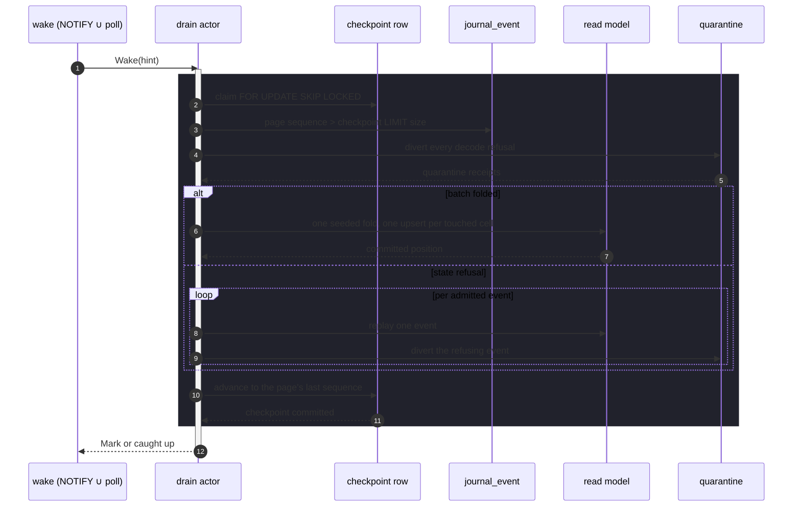

# [DATA_FOLD]

Projection plane: the durable altitude of the core fold contract. One lane binds one `Fold.Plan` to one keyed relation, and that binding runs at three staleness budgets — the inline slot executing inside the publish transaction (budget zero, read-your-writes structural), the checkpointed drain actor woken by LISTEN/NOTIFY and claimed under SKIP LOCKED (budget seconds, replicas cooperate with zero coordination), and the maintenance plane where the database itself owns the fold or a shadow-table replay repairs a drifted model under a session advisory lock.

One fold body serves all three budgets — a seeded held-state read, an in-memory reduction, one upsert per touched cell — so a budget selects a driver rather than a second reduction. Rows persist `Clock.Hlc` with sequence and expose `Fold.AsOf`, poison diverts to an idempotent quarantine while the checkpoint advances, and every budget re-reads rather than maintaining operator state, forfeiting per-row deltas for a model any replica rebuilds from the journal alone.

## [01]-[INDEX]

- [02]-[LANE_SPEC]: plan-bound lane value, keyed relation, realized `AsOf` coordinate.
- [03]-[INLINE_SLOT]: zero-staleness lane — the slot the publish transaction executes.
- [04]-[DRAIN_ACTOR]: checkpoint ledger, SKIP-LOCKED claim, wake merge, quarantine, the machine Layer.
- [05]-[MAINTENANCE]: cron/ivm/incremental rows and the shadow-table rebuild with atomic swap.

## [02]-[LANE_SPEC]

- Owner: `Lane.Spec` — one `Fold.Plan` bound to one keyed relation under a `Live.Band`, carrying the state codec, stamp projection, upcast plan, and batch engine; `Lane.at` realizes the per-cell `Fold.AsOf` coordinate from the relation's own position columns, `Lane.Edit` folds content-addressed node edits under the graph's redaction manifest, and `Lane.Organization` folds one decoded organization document into the three read-side relations `read/query#ORGANIZATION_ROWS` owns.
- Packages: `effect` (`Array`, `Data`, `HashMap`, `HashSet`, `Match`, `Option`, `Schema`); `@effect/sql` (`SqlClient`, `SqlSchema.findOne`); `@rasm/ts/core` (`Clock.Hlc`, `Fault.Class`, `Fold.Plan`, `Format.Patch`, `Wire.ElementGraph`, `Wire.Organization`); `journal/append.md` (`Journal.Event`, `Journal.Sequence`); `journal/evolve.md` (`Upcast.Plan`); `read/query.md` (`Query.Relation`, `Organization`); `read/live.md` (`Live.Keys`).
- Entry: an owning lane declares one `Lane.Spec` beside its relation and hands it to `Lane.of`, which settles the coordinate read and the inline slot together.
- Law: `Lane.Spec.name` mints through `Live.scope` at the composition, never as a bare literal — the band carries its scope discriminant by construction, so a lane declared under two scopes wakes apart and no spec author can spell an unqualified band.
- Law: every projection row carries its own position — `sequence`, `stamp_physical`, and `stamp_logical` sit on the row, so `Fold.AsOf` reads what a caller already fetched and a staleness question costs no second relation.
- Law: each lane's DDL pair is total over the profile set — one `Capability.Ensure` states pg and sqlite together, so a lane this branch writes cannot fail its first upsert against a relation nobody planted.
- Law: edit admission is content-addressed — an unstable node refuses before any patch applies, a held `contentAddress` disagreeing with the edit's `base` refuses `conflicted`, and a patch renaming its own key refuses `invalid`; all three close through `Fault.Class`, so blame and retryability derive from the core row table and no local policy column rides beside them.
- Law: reduction and encoding are separate owners — `Fold.Plan` owns the fold and `Lane.Spec.state` owns the persisted codec, so a storage-shape change is a codec swap with a rebuild, never a plan rewrite.
- Law: organization admission is STRUCTURAL and whole-source — a containment edge naming an absent container or an absent entity target refuses `invalid` before any row lands, mirroring the producer's own orphan refusal, while a member target names a foreign key space and admits unresolved because its join miss belongs to the consuming query. Replacement is per source key, never per row: a producer re-reads its document whole, so a surviving stale entity from a prior fold is exactly the drift a scoped delete forecloses.
- Law: content-key spelling lowers at the core landing and never here — `Wire.Organization` presents lowercase-hex addresses, so this fold moves strings and the 16-big-endian-byte face resolves once, at the one decode.
- Law: each budget answers its own lifetime and admit, and none answers tenancy — `[3]` admits through the publish transaction's slot, `[4]` through a claimed journal page, `[5]` through an operator rebuild; a projection row lives until its lane rebuilds, a checkpoint until its lane retires, and a quarantine row until an operator replays or a groom schedule ages it. Tenancy is the owning scope's, never a column here: the lane binds inside `lane/tenant.md`'s scoped client, so a cross-tenant lane has no spelling and a tenancy field restates a scope the binding already carries. What each budget forfeits is its selection cost — budget zero pays commit latency, budget seconds pays bounded staleness and cannot read its own write, and the maintenance budget pays a full re-fold and a swap window.
- Growth: a new lane is one `Lane.Spec` value; a new position axis is one column on the DDL pair with its `_Position` field.
- Boundary: `Fold.Plan`, `Clock.Hlc`, and the graph wire shapes arrive settled from core — this page binds them to a relation and re-derives no key, cell, or stamp.

```typescript signature
import { Array, Data, Duration, Effect, HashMap, HashSet, Match, Option, type ParseResult, Schema } from "effect"
import { Clock, Fault, Fold, Format, Wire } from "@rasm/ts/core"
import { SqlClient, SqlSchema, type SqlError } from "@effect/sql"
import type { Capability } from "../lane/capability.ts"
import { Journal } from "../journal/append.ts"
import type { Upcast } from "../journal/evolve.ts"
import { Batch } from "./batch.ts"
import { Live } from "./live.ts"
import { Organization, Query } from "./query.ts"

declare namespace Lane {
  type Spec<A extends Journal.Event, K, S, I> = {
    readonly name: Live.Band
    readonly plan: Fold.Plan<A, K, S>
    readonly state: Schema.Schema<S, I>
    readonly relation: Query.Relation
    readonly stamp: (event: A) => Clock.Hlc
    readonly decode: Upcast.Plan<A>
    readonly batch: Batch.Engine
  }
  type At = Fold.AsOf
  type Graph = Schema.Schema.Type<typeof Wire.ElementGraph>
  type Node = Schema.Schema.Type<typeof Wire.ElementGraph.Node>
  type EntityEdit = Schema.Schema.Type<typeof Wire.EntityEdit>
  type NodeState = {
    readonly nodes: HashMap.HashMap<Node["id"], Node>
    readonly unstable: HashSet.HashSet<Node["id"]>
    readonly checkpoint: At
  }
  type Apply<A extends Journal.Event> = (
    events: Array.NonEmptyReadonlyArray<A>,
    at: At,
  ) => Effect.Effect<ReadonlyArray<Live.Cell>, Fold.Fault | SqlError.SqlError | ParseResult.ParseError>
  type Organization = Schema.Schema.Type<typeof Wire.Organization>
  type OrganizationRows = {
    readonly source: Organization["source"]
    readonly entities: ReadonlyArray<typeof Organization.Entity.insert.Type>
    readonly members: ReadonlyArray<{ readonly address: string; readonly member: string }>
    readonly views: ReadonlyArray<{ readonly address: string; readonly view: string; readonly visible: boolean }>
  }
}

const _editFamily = Fault.Class.family(["unstable", "base", "root", "identity"] as const, {
  unstable: { class: "invalid" },
  base: { class: "conflicted" },
  root: { class: "invalid" },
  identity: { class: "invalid" },
})

class _EditFault extends Data.TaggedError("Lane.EditFault")<{
  readonly reason: (typeof _editFamily.reasons)[number]
  readonly key: Lane.Node["id"]
}> {
  get class(): Fault.Class.Kind {
    return _editFamily.classOf(this.reason)
  }
}

const _nodeState = (graph: Lane.Graph, checkpoint: Lane.At): Lane.NodeState => ({
  nodes: graph.byId,
  unstable: Option.match(graph.redaction, {
    onNone: () => HashSet.empty(),
    onSome: (manifest) => HashSet.fromIterable(manifest.unstableNodeIds),
  }),
  checkpoint,
})

const _edited = (state: Lane.NodeState, edit: Lane.EntityEdit, checkpoint: Lane.At) => {
  const refused = (reason: (typeof _editFamily.reasons)[number]) => Effect.fail(new _EditFault({ reason, key: edit.key }))
  if (HashSet.has(state.unstable, edit.key)) return refused("unstable")
  return Option.match(HashMap.get(state.nodes, edit.key), {
    onNone: () => refused("base"),
    onSome: (held) => held.contentAddress !== edit.base ? refused("base") : Match.value(edit).pipe(
      Match.when({ kind: "tombstone" }, (change) =>
        Effect.succeed({ ...state, nodes: HashMap.remove(state.nodes, change.key), checkpoint })),
      Match.when({ kind: "members" }, (change) =>
        Effect.flatMap(Schema.encode(Wire.ElementGraph.Node.Json)(held), (json) =>
          Effect.flatMap(Format.Patch.apply(json, change.patch), Option.match({
            onNone: () => refused("root"),
            onSome: (successor) => Effect.flatMap(
              Schema.decode(Wire.ElementGraph.Node.Json)(successor),
              (node) => node.id === change.key
                ? Effect.succeed({ ...state, nodes: HashMap.set(state.nodes, change.key, node), checkpoint })
                : refused("identity"),
            ),
          })))),
      Match.exhaustive,
    ),
  })
}

const _editFold = (
  state: Lane.NodeState,
  edits: Array.NonEmptyReadonlyArray<Lane.EntityEdit>,
  checkpoint: Lane.At,
) => Effect.reduce(edits, state, (held, edit) => _edited(held, edit, checkpoint))

const _ddl = (relation: Query.Relation): Capability.Ensure => ({
  relation: relation.table,
  pg: `CREATE TABLE IF NOT EXISTS ${relation.table} (
    cell TEXT PRIMARY KEY,
    state JSONB NOT NULL,
    sequence BIGINT NOT NULL,
    stamp_physical BIGINT NOT NULL,
    stamp_logical BIGINT NOT NULL,
    folded_at TIMESTAMPTZ NOT NULL DEFAULT now());`,
  sqlite: `CREATE TABLE IF NOT EXISTS ${relation.table} (
    cell TEXT PRIMARY KEY,
    state TEXT NOT NULL,
    sequence INTEGER NOT NULL,
    stamp_physical INTEGER NOT NULL,
    stamp_logical INTEGER NOT NULL,
    folded_at TEXT NOT NULL DEFAULT (strftime('%Y-%m-%dT%H:%M:%fZ','now')));`,
})

const _Position = Schema.Struct({
  // driver posture folds to bigint, then the Hlc field brands re-prove: written by encode, total by construction
  sequence: Journal.Sequence,
  stamp_physical: Schema.compose(Journal.Sequence, Clock.Hlc.fields.physical, { strict: false }),
  stamp_logical: Schema.compose(Journal.Sequence, Clock.Hlc.fields.logical, { strict: false }),
})

const _at = <A extends Journal.Event, K, S, I>(spec: Lane.Spec<A, K, S, I>) =>
  Effect.map(SqlClient.SqlClient, (sql) => {
    const found = SqlSchema.findOne({
      Request: Live.Keys.Cell,
      Result: _Position,
      execute: (key) => sql`SELECT sequence, stamp_physical, stamp_logical FROM ${sql(spec.relation.table)} WHERE cell = ${key}`,
    })
    return (cell: Live.Cell) =>
      Effect.map(
        found(cell),
        Option.map((row) => Fold.AsOf.at(
          new Clock.Hlc({ physical: row.stamp_physical, logical: row.stamp_logical }),
          row.sequence,
        )),
      )
  })

const _organizationFamily = Fault.Class.family(["container", "target"] as const, {
  container: { class: "invalid" },
  target: { class: "invalid" },
})

class _OrganizationFault extends Data.TaggedError("Lane.OrganizationFault")<{
  readonly reason: (typeof _organizationFamily.reasons)[number]
  readonly key: string
}> {
  get class(): Fault.Class.Kind {
    return _organizationFamily.classOf(this.reason)
  }
}

// Structural admission over one document: containment resolves against the entity set BEFORE any row projects, so a
// damaged document lands nothing rather than a half-written tree. Membership targets deliberately skip that gate —
// their key space belongs to the producing authority, so an unresolved member is a join miss at the query, not
// evidence of wire damage.
const _organizationRows = (wire: Lane.Organization): Effect.Effect<Lane.OrganizationRows, _OrganizationFault> => {
  const known = HashSet.fromIterable(Array.map(wire.entities, (entity) => entity.address))
  const nesting = Array.filterMap(wire.containment, (edge) =>
    edge.target._tag === "entity" ? Option.some({ container: edge.container, entity: edge.target.entity }) : Option.none())
  const dangling = Array.findFirst(wire.containment, (edge) => !HashSet.has(known, edge.container))
  const unrooted = Array.findFirst(nesting, (edge) => !HashSet.has(known, edge.entity))
  const container = HashMap.fromIterable(Array.map(nesting, (edge) => [edge.entity, edge.container] as const))
  return Option.match(dangling, {
    onSome: (edge) => Effect.fail(new _OrganizationFault({ reason: "container", key: edge.container })),
    onNone: () => Option.match(unrooted, {
      onSome: (edge) => Effect.fail(new _OrganizationFault({ reason: "target", key: edge.entity })),
      onNone: () => Effect.succeed({
        source: wire.source,
        entities: Array.map(wire.entities, (entity) => ({
          address: entity.address,
          source: wire.source,
          authority: wire.authority,
          name: entity.name,
          ordinal: entity.ordinal,
          container: HashMap.get(container, entity.address),
          visible: entity.visible,
          locked: entity.locked,
        })),
        members: Array.filterMap(wire.containment, (edge) =>
          edge.target._tag === "member"
            ? Option.some({ address: edge.container, member: edge.target.member })
            : Option.none()),
        views: Array.map(wire.overrides, (probe) => ({
          address: probe.entity,
          view: probe.view,
          visible: probe.visible,
        })),
      }),
    }),
  })
}

// Replacement is per SOURCE and inside one transaction: a producer re-reads its document whole, so scoping the
// delete to the source key retires every entity the prior fold landed and no stale branch survives a rename. Edge
// relations clear through their entity scope, which is why neither carries a repository of its own.
const _organizationLand = (rows: Lane.OrganizationRows) =>
  Effect.flatMap(SqlClient.SqlClient, (sql) =>
    sql.withTransaction(Effect.all([
      sql`DELETE FROM organization_view WHERE address IN (SELECT address FROM organization_entity WHERE source = ${rows.source})`,
      sql`DELETE FROM organization_member WHERE address IN (SELECT address FROM organization_entity WHERE source = ${rows.source})`,
      sql`DELETE FROM organization_entity WHERE source = ${rows.source}`,
      sql`INSERT INTO organization_entity ${sql.insert(rows.entities)}`,
      sql`INSERT INTO organization_member ${sql.insert(rows.members)}`,
      sql`INSERT INTO organization_view ${sql.insert(rows.views)}`,
    ])))
```

## [03]-[INLINE_SLOT]

- Owner: `Lane.inline` — the budget-zero slot the publish transaction executes — and `_apply`, the one seeded batch fold every staleness budget shares: one held-state read over the touched cells, one in-memory reduction, one upsert per touched cell.
- Packages: `effect` (`Array`, `BigInt`, `Effect`, `HashMap`, `Option`, `Schema`); `@effect/sql` (`SqlSchema.findAll`, `sql.onDialectOrElse`, `sql.insert`, `sql.in`); `read/live.md` (`Live.band`, `Live.cell` — the slot's coordinate and the per-cell mint).
- Entry: `journal/append.md`'s publish transaction runs the returned `Journal.Slot` inside its own commit, so the event and its projection land or roll back as one.
- Receipt: the slot answers the touched cell roster, which the publish transaction stamps as this lane's invalidation coordinates.
- Law: read-your-writes is structural at budget zero — the fold runs INSIDE the publish transaction, so no reader can observe the event without its projection.
- Law: held state locks wherever the dialect can lock — the pg arm reads `FOR UPDATE` so two commits touching one cell serialize on the row, and the neutral arm rests on its profile's own writer exclusion; a posture offering neither interleaves two seeded folds over one cell and loses the earlier reduction.
- Law: one cell answers one key — a batch mapping two distinct plan keys onto one cell refuses `Fold.Fault` before any state moves, because a cell collision merges two aggregates into one row with no error anywhere.
- Law: the commit point is the batch's own maximum — the slot folds the receipt's NonEmpty row roster for its top sequence and stamps the last event's `Clock.Hlc`, so the persisted coordinate is exactly what this transaction wrote.
- Growth: a lane changing staleness budget keeps this fold — `[4]` and `[5]` compose `_apply` unchanged, so budget is a driver choice and never a second reduction.
- Boundary: the slot opens no transaction, stamps no coordinates, and never retries — the publish owner holds all three.

```typescript signature
import { Array, BigInt, Effect, HashMap, Option } from "effect"
import { Live } from "./live.ts"

const _held = <S, I>(sql: SqlClient.SqlClient, table: Query.Relation["table"], state: Schema.Schema<S, I>) => {
  const found = SqlSchema.findAll({
    Request: Schema.Array(Live.Keys.Cell),
    Result: Schema.Struct({ cell: Live.Keys.Cell, state: Upcast.json(state) }),
    execute: (keys) =>
      sql.onDialectOrElse({
        orElse: () => sql`SELECT cell, state FROM ${sql(table)} WHERE ${sql.in("cell", keys)}`,
        pg: () => sql`SELECT cell, state FROM ${sql(table)} WHERE ${sql.in("cell", keys)} FOR UPDATE`,
      }),
  })
  return (cells: ReadonlyArray<Live.Cell>) =>
    Effect.map(found(cells), (rows) => HashMap.fromIterable(Array.map(rows, (row) => [row.cell, row.state] as const)))
}

const _apply = <A extends Journal.Event, K, S, I>(spec: Lane.Spec<A, K, S, I>) =>
  Effect.map(SqlClient.SqlClient, (sql) => {
    const held = _held(sql, spec.relation.table, spec.state)
    return (events: Array.NonEmptyReadonlyArray<A>, at: Lane.At) =>
      Effect.gen(function* () {
        const keyed = Array.map(events, (event) => {
          const key = spec.plan.key(event)
          const cell = spec.plan.cell(key)
          return [event, key, cell, Live.cell(cell)] as const
        })
        const collision = Array.findFirst(keyed, ([, key, cell], at) =>
          Array.some(Array.take(keyed, at), ([, prior, priorCell]) =>
            priorCell === cell && !spec.plan.keyAlike(prior, key)))
        yield* Option.match(collision, {
          onNone: () => Effect.void,
          onSome: ([, , cell]) => Effect.fail(new Fold.Fault({ reason: "cell", cell: Option.some(cell) })),
        })
        const touched = Array.dedupe(Array.map(keyed, ([, , , cell]) => cell))
        const current = yield* held(touched)
        const seeded = Array.reduce(keyed, HashMap.empty<K, S>(), (table, [, key, , cell]) =>
          Option.match(HashMap.get(current, cell), {
            onNone: () => table,
            onSome: (state) => HashMap.set(table, key, state),
          }))
        const step = Fold.step(spec.plan)
        const merged = Array.reduce(keyed, seeded, (table, [event]) => step(table, event)[0])
        const rows = yield* Effect.forEach(HashMap.toEntries(merged), ([key, state]) =>
          Effect.map(Schema.encode(Schema.parseJson(spec.state))(state), (encoded) => ({
            cell: Live.cell(spec.plan.cell(key)),
            state: encoded,
            sequence: at.sequence,
            stamp_physical: at.stamp.physical,
            stamp_logical: at.stamp.logical,
          })), { concurrency: "unbounded" })
        yield* sql`INSERT INTO ${sql(spec.relation.table)} ${sql.insert(rows)}
          ON CONFLICT (cell) DO UPDATE
          SET state = excluded.state, sequence = excluded.sequence,
              stamp_physical = excluded.stamp_physical, stamp_logical = excluded.stamp_logical,
              folded_at = ${Journal.now(sql)}`
        return touched
      })
  })

// Slot contracts carry a batch whose arity the append split already proved and a receipt whose rows roster is
// NonEmpty, so the commit point folds off that roster's own head rather than a `0n` seed no inhabited fold reaches,
// and no arm re-proves an emptiness the signature forecloses.
const _inline = <A extends Journal.Event, K, S, I>(spec: Lane.Spec<A, K, S, I>) =>
  Effect.map(_apply(spec), (apply): Journal.Slot<A> => ({
    keys: () => Live.band(spec.name),
    project: (_stream, events, receipt) =>
      Effect.asVoid(apply(events, Fold.AsOf.at(
        spec.stamp(Array.lastNonEmpty(events)),
        Array.reduce(
          Array.tailNonEmpty(receipt.rows),
          Array.headNonEmpty(receipt.rows).sequence,
          (top, row) => BigInt.max(top, row.sequence),
        ),
      ))),
  }))
```

## [04]-[DRAIN_ACTOR]

- Owner: `Lane.daemon` — the seconds-budget lane: the checkpoint and quarantine ledgers, the claim, the paged drain cycle, the two-road wake, and the `Machine` actor whose held state is the lag read.
- Packages: `@effect/experimental` (`Machine.makeWith`, `Machine.procedures`, `Machine.boot`, `Machine.retry`; `Reactivity`); `@effect/sql-pg` (`PgClient.listen`); `@effect/sql` (`SqlClient.SafeIntegers`, `sql.withTransaction`); `effect` (`Layer`, `Metric`, `Request`, `Schedule`, `Stream`); `@rasm/ts/core` (`Convention`, `Fault.Budget`, `Identity.App`).
- Entry: an owning app composes `Lane.daemon(spec, app)` once per lane; every replica composes the same Layer and the claim alone decides which one drains.
- Receipt: `Lane.Mark` carries lane, advanced checkpoint, and drained count; the mounted gauge tags by lane name and the actor's `Lane.State` is the subscription a lag dashboard reads.
- Law: replicas cooperate with zero coordination — the claim is `FOR UPDATE SKIP LOCKED` over the lane's checkpoint row, so a losing replica answers `Option.none()` and idles instead of blocking, and no leader election, lease table, or external lock exists.
- Law: retry gates stand DOWN by claim, never by classification — this cycle's `SqlError` family carries no `class` column, so the core's default retryability gate reads every transient connection fault as a defect and never re-drives; the lane claims transience over its whole channel and prices it by budget row.
- Law: poison never blocks the checkpoint — a decode refusal diverts to the idempotent quarantine row before any state moves, and a state refusal the batch grain cannot attribute replays the page one event at a time and quarantines exactly the refusing event; the enclosing transaction has committed nothing, so the abandoned batch leaves the repair nothing to double-apply.
- Law: the advance IS the claimed page's last row — every row left applied or quarantined and the page reads ordered by sequence, so no verdict roster recovers a maximum the read already states.
- Law: the wake is two roads merged, never one — LISTEN/NOTIFY wherever the pg client resolves and a spaced poll always, so a lane on a profile carrying no notification channel still drains and a dropped listener costs latency rather than liveness; a hint at or below the held checkpoint answers in zero round trips.
- Law: exhausted infrastructure recovery is a machine defect — the cycle dies past its budget so `Machine.retry` re-initializes from held state, because a lane swallowing its own exhaustion reports `caughtUp` while draining nothing.
- Growth: a new drain policy is a budget row on `Fault.Budget`; a new operator verb is one `Machine.procedures` row beside `Wake` and `Poll`.
- Boundary: the actor owns no fold — `_apply` is `[3]`'s, and the quarantine replay marker is an operator verb rather than an automatic re-drive.


```mermaid conceptual
sequenceDiagram
  accTitle: Projection drain transaction
  accDescr: A wake drives one claimed journal page through fold, quarantine, and checkpoint advancement.
  autonumber
  participant W as wake (NOTIFY ∪ poll)
  participant A as drain actor
  participant C as checkpoint row
  participant J as journal_event
  participant M as read model
  participant Q as quarantine
  W->>A: Wake(hint)
  activate A
  rect rgb(33, 34, 44)
    A->>C: claim FOR UPDATE SKIP LOCKED
    A->>J: page sequence > checkpoint LIMIT size
    A->>Q: divert every decode refusal
    Q-->>A: quarantine receipts
    alt batch folded
      A->>M: one seeded fold, one upsert per touched cell
      M-->>A: committed position
    else state refusal
      loop per admitted event
        A->>M: replay one event
        A->>Q: divert the refusing event
      end
    end
    A->>C: advance to the page's last sequence
    C-->>A: checkpoint committed
  end
  A-->>W: Mark or caught up
  deactivate A
```

```typescript signature
import { BigInt, Function, Layer, Metric, Option, type ParseResult, Request, Schedule, Stream } from "effect"
import { Machine, Reactivity } from "@effect/experimental"
import { PgClient } from "@effect/sql-pg"
import { SqlClient, SqlSchema } from "@effect/sql"
import { Convention, Fault, Identity } from "@rasm/ts/core"
import { Upcast } from "../journal/evolve.ts"

declare namespace Lane {
  type Mark = _Mark
  type Phase = typeof _Phase.Type
  type State = _State
}

const _Phase = Schema.Literal("idle", "draining", "caughtUp")

class _Mark extends Schema.Class<_Mark>("Lane.Mark")({
  lane: Live.Keys.Band,
  checkpoint: Journal.Sequence,
  drained: Schema.NonNegativeInt,
}) {}

class _State extends Schema.Class<_State>("Lane.State")({
  checkpoint: Journal.Sequence,
  phase: _Phase,
}) {}

const _checkpointDdl: Capability.Ensure = {
  relation: "projection_checkpoint",
  pg: `CREATE TABLE IF NOT EXISTS projection_checkpoint (
    lane TEXT PRIMARY KEY,
    checkpoint BIGINT NOT NULL DEFAULT 0,
    claimed_at TIMESTAMPTZ);`,
  sqlite: `CREATE TABLE IF NOT EXISTS projection_checkpoint (
    lane TEXT PRIMARY KEY,
    checkpoint INTEGER NOT NULL DEFAULT 0,
    claimed_at TEXT);`,
}

const _quarantineDdl: Capability.Ensure = {
  relation: "projection_quarantine",
  pg: `CREATE TABLE IF NOT EXISTS projection_quarantine (
    lane TEXT NOT NULL, sequence BIGINT NOT NULL,
    envelope JSONB NOT NULL, fault TEXT NOT NULL,
    diverted_at TIMESTAMPTZ NOT NULL DEFAULT now(),
    replayed_at TIMESTAMPTZ,
    PRIMARY KEY (lane, sequence));`,
  sqlite: `CREATE TABLE IF NOT EXISTS projection_quarantine (
    lane TEXT NOT NULL, sequence INTEGER NOT NULL,
    envelope TEXT NOT NULL, fault TEXT NOT NULL,
    diverted_at TEXT NOT NULL DEFAULT (strftime('%Y-%m-%dT%H:%M:%fZ','now')),
    replayed_at TEXT,
    PRIMARY KEY (lane, sequence));`,
}

// Core-compiled budget rows, gates stood down: the cycle's SqlError family carries no `class` column, so the
// default `Fault.Class.retryable` gate would classify it `defect` and never re-drive — transience is this lane's
// own claim over its whole channel, priced by the row (`lease` the drain cadence, `bulk` the machine reboot).
const _RETRY = Fault.Budget.schedule("lease", Function.constTrue)

const _REBOOT = Fault.Budget.schedule("bulk", Function.constTrue)

const _checkpointGauge = Convention.mount(Convention.metric.laneCheckpoint)

const _Checkpoint = Schema.Struct({ checkpoint: Journal.Sequence })

const _Page = Schema.Struct({
  sequence: Journal.Sequence,
  tag: Schema.String,
  event_version: Schema.Number,
  payload: Schema.Unknown, // deliberately raw: a poison payload fails inside the per-event effect, never the whole page read
})

const _claim = (sql: SqlClient.SqlClient) =>
  SqlSchema.findOne({
    Request: Live.Keys.Band,
    Result: _Checkpoint,
    execute: (lane) =>
      sql.onDialectOrElse({
        orElse: () => sql`SELECT checkpoint FROM projection_checkpoint WHERE lane = ${lane}`,
        pg: () => sql`SELECT checkpoint FROM projection_checkpoint WHERE lane = ${lane} FOR UPDATE SKIP LOCKED`,
      }),
  })

const _page = (sql: SqlClient.SqlClient, app: Identity.App.Key) =>
  SqlSchema.findAll({
    Request: Schema.Struct({ floor: Journal.Sequence, take: Schema.Int.pipe(Schema.positive()) }),
    Result: _Page,
    execute: (window) =>
      sql`SELECT sequence, tag, event_version, payload FROM journal_event
          WHERE app = ${app} AND sequence > ${window.floor}
          ORDER BY sequence LIMIT ${window.take}`,
  })

const _envelope = (payload: unknown) =>
  typeof payload === "string" ? Effect.succeed(payload) : Schema.encode(Schema.parseJson(Schema.Unknown))(payload)

// One quarantine landing both poison roads share: the envelope crosses as the stored text and the row is
// idempotent, so a replayed cycle re-diverts nothing and the two roads cannot drift apart on the evidence shape.
const _diverted = <A extends Journal.Event, K, S, I>(
  sql: SqlClient.SqlClient,
  spec: Lane.Spec<A, K, S, I>,
  row: typeof _Page.Type,
  fault: ParseResult.ParseError,
) =>
  Effect.flatMap(_envelope(row.payload), (envelope) =>
    sql`INSERT INTO projection_quarantine ${sql.insert([{
      lane: spec.name,
      sequence: row.sequence,
      envelope,
      fault: String(fault),
    }])} ON CONFLICT (lane, sequence) DO NOTHING`)

// Decode partitions before any state moves, so both halves keep their row: the admitted half carries the
// source row its position and stamp read off, the refused half carries the row its quarantine envelope comes from.
const _decoded = <A extends Journal.Event, K, S, I>(spec: Lane.Spec<A, K, S, I>) =>
(
  row: typeof _Page.Type,
): Effect.Effect<
  { readonly event: A; readonly row: typeof _Page.Type },
  { readonly fault: ParseResult.ParseError; readonly row: typeof _Page.Type }
> =>
  Effect.mapBoth(
    Effect.flatMap(Schema.decodeUnknown(Upcast.Column)(row.payload), (payload) =>
      spec.decode.decode({ tag: row.tag, version: row.event_version, payload })),
    { onFailure: (fault) => ({ fault, row }), onSuccess: (event) => ({ event, row }) },
  )

// Pages fold as ONE batch — one seeded held-state read, one upsert per touched cell, one mutation stamp over
// every cell the page moved — which is the shape `_apply` was built for and the shape the inline slot already runs.
// `ParseError` escaping it is a STATE-schema refusal the batch grain cannot attribute to a row, so the repair
// replays the page one event at a time and quarantines exactly the refusing event; the enclosing transaction has
// committed nothing, so the abandoned attempt leaves the repair nothing to double-apply.
const _folded = <A extends Journal.Event, K, S, I>(
  sql: SqlClient.SqlClient,
  spec: Lane.Spec<A, K, S, I>,
  apply: Lane.Apply<A>,
  admitted: Array.NonEmptyReadonlyArray<{ readonly event: A; readonly row: typeof _Page.Type }>,
) =>
  Live.mutation(
    Live.cells(spec.name, Array.dedupe(Array.map(admitted, ({ event }) =>
      Live.cell(spec.plan.cell(spec.plan.key(event)))))),
    apply(
      Array.map(admitted, ({ event }) => event),
      Fold.AsOf.at(
        spec.stamp(Array.lastNonEmpty(admitted).event),
        Array.lastNonEmpty(admitted).row.sequence,
      ),
    ),
  ).pipe(
    Effect.catchTag("ParseError", () =>
      Effect.forEach(admitted, ({ event, row }) =>
        Live.mutation(
          Live.cells(spec.name, [Live.cell(spec.plan.cell(spec.plan.key(event)))]),
          apply([event], Fold.AsOf.at(spec.stamp(event), row.sequence)),
        ).pipe(Effect.catchTag("ParseError", (fault) => _diverted(sql, spec, row, fault))), {
        concurrency: 1,
        discard: true,
      })),
  )

const _cycle = <A extends Journal.Event, K, S, I>(
  sql: SqlClient.SqlClient,
  claim: ReturnType<typeof _claim>,
  page: ReturnType<typeof _page>,
  spec: Lane.Spec<A, K, S, I>,
  apply: Lane.Apply<A>,
) =>
  sql.withTransaction(
    Effect.gen(function* () {
      yield* sql`INSERT INTO projection_checkpoint ${sql.insert([{ lane: spec.name, checkpoint: 0 }])}
        ON CONFLICT (lane) DO NOTHING`
      const held = yield* claim(spec.name)
      return yield* Effect.transposeOption(Option.map(held, ({ checkpoint }) =>
        Effect.gen(function* () {
          const rows = yield* page({ floor: checkpoint, take: spec.batch.width })
          const [poison, admitted] = yield* Effect.partition(rows, _decoded(spec)) // cannot fail: every row lands in exactly one half
          yield* Effect.forEach(poison, ({ fault, row }) => _diverted(sql, spec, row, fault), { concurrency: 1, discard: true })
          yield* Array.isNonEmptyReadonlyArray(admitted) ? _folded(sql, spec, apply, admitted) : Effect.void
          // Every row of the claimed page left applied or quarantined, and the page reads ordered by sequence, so its
          // advance IS that last row and no verdict roster is folded to recover a maximum the read already states.
          const last = Option.match(Array.last(rows), { onNone: () => checkpoint, onSome: (row) => row.sequence })
          yield* sql`UPDATE projection_checkpoint SET checkpoint = ${last}, claimed_at = ${Journal.now(sql)} WHERE lane = ${spec.name}`
          return new _Mark({ lane: spec.name, checkpoint: last, drained: rows.length })
        })))
    }))

class _Wake extends Request.TaggedClass("Wake")<Option.Option<Lane.Mark>, never, { readonly hint: Option.Option<bigint> }> {}
class _Poll extends Request.TaggedClass("Poll")<Lane.State, never, {}> {}

const _machine = <A extends Journal.Event, K, S, I>(
  spec: Lane.Spec<A, K, S, I>,
  app: Identity.App.Key,
  apply: Lane.Apply<A>,
) =>
  Machine.makeWith<Lane.State, void>()((_, previous) =>
    Effect.gen(function* () {
      const sql = yield* SqlClient.SqlClient
      const claim = _claim(sql)
      const page = _page(sql, app)
      const drained = (state: Lane.State) =>
        _cycle(sql, claim, page, spec, apply).pipe(
          Effect.provideService(SqlClient.SafeIntegers, true),
          Effect.retry(_RETRY),
          Effect.tap((mark) =>
            Option.match(mark, {
              onNone: () => Effect.void,
              onSome: (won) =>
                Metric.set(Metric.tagged(_checkpointGauge, Convention.rasm.laneName, won.lane), won.checkpoint).pipe(
                  Effect.annotateLogs({ lane: spec.name })),
            })),
          Effect.tapErrorCause((cause) => Effect.logError("lane drain exhausted retries", cause)),
          Effect.orDie, // exhausted infrastructure recovery is a machine defect: Machine.retry re-initializes from the held state
          Effect.map((mark) =>
            Option.match(mark, {
              onNone: () => [mark, new _State({ checkpoint: state.checkpoint, phase: "idle" })] as const, // a sibling replica held the claim
              onSome: (won) => [mark, new _State({
                checkpoint: won.checkpoint,
                phase: won.drained < spec.batch.width ? "caughtUp" : "draining",
              })] as const,
            })),
        )
      return Machine.procedures.make(previous ?? new _State({ checkpoint: 0n, phase: "idle" })).pipe(
        Machine.procedures.add<_Wake>()("Wake", ({ request, state }) =>
          Option.match(request.hint, { onNone: () => false, onSome: (head) => state.checkpoint > 0n && head <= state.checkpoint })
            ? Effect.succeed([Option.none<Lane.Mark>(), state] as const) // the hint proves nothing new landed: zero round trips
            : drained(state)),
        Machine.procedures.add<_Poll>()("Poll", ({ state }) => Effect.succeed([state, state] as const)), // the lag read: dashboards subscribe the Actor or poll this row
      )
    }),
  ).pipe(Machine.retry(_REBOOT))

const _seqOf = (payload: string): Option.Option<bigint> =>
  BigInt.fromString(payload)

const _wake = <A extends Journal.Event, K, S, I>(spec: Lane.Spec<A, K, S, I>, app: Identity.App.Key): Stream.Stream<Option.Option<bigint>> =>
  Stream.merge(
    Stream.unwrap(
      Effect.map(Effect.serviceOption(PgClient.PgClient), Option.match({
        onNone: () => Stream.empty,
        onSome: (pg) =>
          Stream.retry(pg.listen(Journal.channel(app)), Schedule.spaced(spec.batch.window)).pipe(
            Stream.map(_seqOf),
            Stream.orDie, // unreachable by policy: the spaced retry re-registers forever; a reached failure is a defect
          ),
      })),
    ),
    Stream.repeatEffectWithSchedule(Effect.succeedNone, Schedule.spaced(spec.batch.window)),
    { haltStrategy: "both" },
  )

const _replay = (name: Live.Band, sequence: bigint) =>
  Effect.flatMap(SqlClient.SqlClient, (sql) =>
    sql`UPDATE projection_quarantine SET replayed_at = ${Journal.now(sql)}
        WHERE lane = ${name} AND sequence = ${sequence} AND replayed_at IS NULL`)

const _daemon = <A extends Journal.Event, K, S, I>(spec: Lane.Spec<A, K, S, I>, app: Identity.App.Key): Layer.Layer<never, never, SqlClient.SqlClient | Reactivity.Reactivity> =>
  Layer.scopedDiscard(
    Effect.gen(function* () {
      const apply = yield* _apply(spec)
      const actor = yield* Machine.boot(_machine(spec, app, apply)) // Subscribable of Lane.State: the lag dashboard's live read
      yield* Effect.forkScoped(Stream.runForEach(_wake(spec, app), (hint) => actor.send(new _Wake({ hint }))))
    }),
  ).pipe(Layer.withSpan("data.lane", { attributes: { lane: spec.name } }))
```

## [05]-[MAINTENANCE]

- Owner: `Lane.jobs` and `Lane.rebuild` — the maintenance budget: groom schedule rows total over retention's roster, and the shadow-table rebuild that re-folds a drifted model under a session advisory lock and swaps it atomically.
- Packages: `effect` (`Array`, `Record`, `Schema`); `@effect/sql` (`sql.reserve`, `sql.withTransaction`, `sql.onDialectOrElse`, `executeUnprepared`); `journal/retain.md` (`Retain.Groomed`, `Retain.groomText`).
- Entry: the provisioning plane installs `Lane.jobs()` as scheduled statements; an operator runs `Lane.rebuild(spec, drain)` outside every request path.
- Law: cadence is this page's fact and the statement is retention's — the schedule record is total over the groom roster, so a relation retention starts aging without a cadence fails at this declaration rather than landing as a sweep nothing runs.
- Law: rebuilds serialize on the LANE, never on the relation — a session advisory lock keyed by lane name admits one rebuild across replicas, and session close releases it regardless, so an unlock miss is not evidence; a profile carrying no advisory-lock verb rests on its own single-writer posture instead, which is the honest degradation this pair states rather than a lock it cannot take.
- Law: the swap is one transaction and the invalidation follows it — rename, rename, and drop commit together and the lane's whole band invalidates afterward, so no reader observes a half-swapped relation and every reader re-reads the fresh one.
- Law: the shadow inherits what its dialect can copy — the pg arm carries constraints, defaults, and indexes through `INCLUDING ALL`, and the neutral arm copies columns alone, so a rebuilt relation off the spine re-earns its indexes from the lane's own ensure roster.
- Growth: a maintenance posture the database itself owns (a materialized view, an incremental-view-maintenance extension) is one row beside these, sharing the lane spec and the swap.
- Boundary: the drain function is the caller's — this owner holds the lock, the shadow, the swap, and the invalidation, never the fold that fills the shadow.

```typescript signature
import { Array, type ParseResult, Record } from "effect"
import type { SqlError } from "@effect/sql"
import { Retain } from "../journal/retain.ts"

// Cadence is the maintenance plane's own fact and the statement is retention's, so this record carries exactly the
// half this page owns and the record is total over the groom roster — a relation retention starts aging fails HERE
// rather than landing as a sweep no schedule ever runs. A class-carrying relation renders one statement per finite
// class, so the index closes the job name over a row that expands.
const _SPECS = {
  facts: "15 4 * * *",
  ledger: "0 4 * * *",
  outbox: "30 4 * * *",
  quarantine: "45 4 * * *",
} as const satisfies Record<Retain.Groomed, string>

const _jobs = (): ReadonlyArray<{ readonly name: string; readonly spec: string; readonly statement: string }> =>
  Array.flatMap(Record.toEntries(_SPECS), ([key, spec]) =>
    Array.map(Retain.groomText(key), (statement, index) => ({ name: `groom_${key}_${index}`, spec, statement })))

const _shadowOf = Schema.decodeSync(Query.Relation.fields.table) // total by construction: the identifier pattern is closed under suffixing

const _rebuild = <A extends Journal.Event, K, S, I>(spec: Lane.Spec<A, K, S, I>, drain: (into: Query.Relation["table"]) => Effect.Effect<number, SqlError.SqlError | ParseResult.ParseError, SqlClient.SqlClient>) =>
  Effect.flatMap(SqlClient.SqlClient, (sql) =>
    Effect.scoped(
      Effect.gen(function* () {
        const held = yield* sql.reserve
        yield* Effect.acquireRelease(
          sql.onDialectOrElse({
            orElse: () => Effect.void,
            pg: () => held.executeUnprepared("SELECT pg_advisory_lock(hashtextextended($1, 0))", [spec.name], undefined),
          }),
          () =>
            Effect.ignore(sql.onDialectOrElse({
              // ruled discard: session close releases the advisory lock regardless, so an unlock miss is not evidence
              orElse: () => Effect.void,
              pg: () => held.executeUnprepared("SELECT pg_advisory_unlock(hashtextextended($1, 0))", [spec.name], undefined),
            })),
        )
        const shadow = _shadowOf(`${spec.relation.table}_shadow`)
        const retired = _shadowOf(`${spec.relation.table}_retired`)
        yield* sql.onDialectOrElse({
          orElse: () => sql`CREATE TABLE IF NOT EXISTS ${sql(shadow)} AS SELECT * FROM ${sql(spec.relation.table)} WHERE 0`,
          pg: () => sql`CREATE TABLE IF NOT EXISTS ${sql(shadow)} (LIKE ${sql(spec.relation.table)} INCLUDING ALL)`,
        })
        const folded = yield* drain(shadow)
        yield* sql.withTransaction(
          Effect.gen(function* () {
            yield* sql`ALTER TABLE ${sql(spec.relation.table)} RENAME TO ${sql(retired)}`
            yield* sql`ALTER TABLE ${sql(shadow)} RENAME TO ${sql(spec.relation.table)}`
            yield* sql`DROP TABLE ${sql(retired)}`
          }),
        )
        yield* Live.invalidate(Live.band(spec.name))
        return folded
      }),
    ))

const _of = <A extends Journal.Event, K, S, I>(spec: Lane.Spec<A, K, S, I>) =>
  Effect.map(
    Effect.all({ at: _at(spec), inline: _inline(spec) }, { concurrency: "unbounded" }),
    (bound) => ({ spec, ensure: _ddl(spec.relation), ...bound }),
  )

const Lane = {
  At: Fold.AsOf,
  Mark: _Mark,
  Phase: _Phase,
  State: _State,
  Edit: { Fault: _EditFault, state: _nodeState, fold: _editFold },
  of: _of,
  ddl: _ddl,
  ledger: [_checkpointDdl, _quarantineDdl],
  at: _at,
  inline: _inline,
  daemon: _daemon,
  cycle: _cycle,
  replay: _replay,
  rebuild: _rebuild,
  jobs: _jobs,
} as const

// --- [EXPORTS] --------------------------------------------------------------------------

export { Lane }
```

## [06]-[RESEARCH]

<!-- source-only: research row template:
[TOKEN]-[OPEN|BLOCKED]: <exact question>; <verification route>.
[SPLIT_MEMBER]-[OPEN]: does `shape-core` expose `split_all`; verify against the member rail.
-->

(none)
