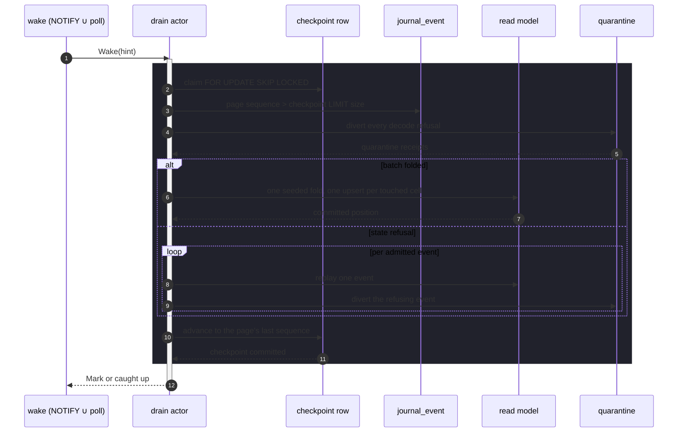

# [DATA_FOLD]

Projection plane: the durable altitude of the core fold contract. One lane binds one `Fold.Plan` to one keyed relation, and that binding runs at three staleness budgets — the inline slot executing inside the publish transaction (budget zero, read-your-writes structural), the checkpointed drain actor woken by LISTEN/NOTIFY and claimed under SKIP LOCKED (budget seconds, replicas cooperate with zero coordination), and the maintenance plane where the database itself owns the fold or a shadow-table replay repairs a drifted model under a session advisory lock.

One fold body serves all three budgets — a seeded held-state read, an in-memory reduction, one upsert per touched cell — so a budget selects a driver rather than a second reduction. Rows persist `Clock.Hlc` with sequence and expose `Fold.AsOf`, poison diverts to an idempotent quarantine while the checkpoint advances, and every budget re-reads rather than maintaining operator state, forfeiting per-row deltas for a model any replica rebuilds from the journal alone.

## [01]-[INDEX]

- [02]-[LANE_SPEC]: plan-bound lane value, keyed relation, realized `AsOf` coordinate.
- [03]-[INLINE_SLOT]: zero-staleness lane — the slot the publish transaction executes.
- [04]-[DRAIN_ACTOR]: checkpoint ledger, SKIP-LOCKED claim, wake merge, quarantine, the machine Layer.
- [05]-[MAINTENANCE]: cron/ivm/incremental rows and the shadow-table rebuild with atomic swap.
- [06]-[ORGANIZATION_FOLD]: generated organization forest admission and ordered relational projection.

## [02]-[LANE_SPEC]

- Owner: `Lane.Spec` — one `Fold.Plan` bound to one keyed relation under a `Live.Band`, carrying the state codec, stamp projection, event family, and batch engine; `Lane.at` realizes the per-cell `Fold.AsOf` coordinate from the relation's own position columns, and `Lane.Edit.fold` decodes each foreign `EntityEditWire` document once before folding content-addressed edits under the graph's redaction manifest.
- Packages: `effect` (`Array`, `HashMap`, `HashSet`, `Match`, `Option`, `Schema`); `@effect/sql` (`SqlClient`, `SqlSchema.findOne`); `@rasm/core` (`Clock.Hlc`, `Fault.Class.family`, `Fault.Class.row`, `Fold.Plan`, `Format.Patch`, `Wire.decode`, `Wire.ElementGraph`, `Wire.EntityEdit`); `journal/append.md` (`Journal.Event`, `Journal.Sequence`); `journal/generation.md` (`Payload.Column`, `Payload.json`); `read/query.md` (`Query.Relation`); `read/live.md` (`Live.Keys`).
- Entry: an owning lane declares one `Lane.Spec` beside its relation and hands it to `Lane.of`, which settles the coordinate read and the inline slot together.
- Law: `Lane.Spec.name` mints through `Live.scope` at the composition, never as a bare literal — the band carries its scope discriminant by construction, so a lane declared under two scopes wakes apart and no spec author can spell an unqualified band.
- Law: every projection row carries its own position — `sequence`, `stamp_physical`, and `stamp_logical` sit on the row, so `Fold.AsOf` reads what a caller already fetched and a staleness question costs no second relation.
- Law: each lane's DDL pair is total over the profile set — one `Capability.Ensure` states pg and sqlite together, so a lane this branch writes cannot fail its first upsert against a relation nobody planted.
- Law: edit admission is content-addressed — an unstable node refuses before any patch applies, a held `contentAddress` disagreeing with the edit's `base` refuses `conflicted`, and a patch renaming its own key refuses `invalid`; all three close through `Fault.Class`, so blame and retryability derive from the core row table and no local policy column rides beside them.
- Law: reduction and encoding are separate owners — `Fold.Plan` owns the fold and `Lane.Spec.state` owns the persisted codec, so a storage-shape change is a codec swap with a rebuild, never a plan rewrite.
- Law: content-key spelling lowers at the core landing and never here — `Wire.decode("EntityEditWire", …)` presents lowercase-hex addresses, so this fold moves strings and the 16-big-endian-byte face resolves once at ingress.
- Law: each budget answers its own lifetime, admit, AND tenancy — `[3]` admits through the publish transaction's slot and inherits its pin (`single`, the committing tenant), `[4]` admits through a claimed journal page and answers `multi` by `[4]`'s own stated law, `[5]` admits through an operator rebuild outside every request path; a projection row lives until its lane rebuilds, a checkpoint until its lane retires, and a quarantine row until an operator replays or a groom schedule ages it. Scope identity — app and isolation case — stays the binding's coordinate, so a tenancy COLUMN here restates what the pin or the page predicate already carries. What each budget forfeits is its selection cost — budget zero pays commit latency, budget seconds pays bounded staleness and cannot read its own write, and the maintenance budget pays a full re-fold and a swap window.
- Growth: a new lane is one `Lane.Spec` value; a new position axis is one column on the DDL pair with its `_Position` field.
- Boundary: `Fold.Plan`, `Clock.Hlc`, and `Wire.ElementGraph` arrive settled from core; foreign edit bytes cross only at `Lane.Edit.fold`, and this page re-derives no key, cell, or stamp.

```typescript signature
import { Array, Duration, Effect, Encoding, HashMap, HashSet, Match, Option, ParseResult, Schema } from "effect"
import { Clock, Fault, Fold, Format, Wire } from "@rasm/core"
import { SqlClient, SqlSchema, type SqlError } from "@effect/sql"
import type { Capability } from "../lane/capability.ts"
import { Journal } from "../journal/append.ts"
import { Payload } from "../journal/generation.ts"
import { Batch } from "./batch.ts"
import { Live } from "./live.ts"
import { Query } from "./query.ts"

declare namespace Lane {
  type Spec<A extends Journal.Event, K, S, I> = {
    readonly name: Live.Band
    readonly plan: Fold.Plan<A, K, S>
    readonly state: Schema.Schema<S, I>
    readonly relation: Query.Relation
    readonly stamp: (event: A) => Clock.Hlc
    readonly family: Schema.Schema<A, unknown>
    readonly batch: Batch.Engine
  }
  type At = Fold.AsOf
  type Graph = Schema.Schema.Type<typeof Wire.ElementGraph>
  type Node = Schema.Schema.Type<typeof Wire.ElementGraph.Node>
  type EntityEdit = Schema.Schema.Type<typeof Wire.EntityEdit>
  type NodeState = {
    readonly nodes: HashMap.HashMap<Node["id"], Node>
    readonly unstable: HashSet.HashSet<Node["id"]>
    readonly checkpoint: At
  }
  type Apply<A extends Journal.Event> = (
    events: Array.NonEmptyReadonlyArray<A>,
    at: At,
  ) => Effect.Effect<ReadonlyArray<Live.Cell>, Fold.Fault | SqlError.SqlError | ParseResult.ParseError>
}

// Edit clauses are DEPENDENT — the held node the base clause reads is what the patch clauses transform — so this arm
// stays sequenced and refuses singly; the subject is the node key alone, which the page's own content-key law already
// proves is a lowercase-hex string by the time it reaches this fold.
const _editFamily = Fault.Class.family(["unstable", "base", "root", "identity"] as const, {
  unstable: Fault.Class.row({
    class: "invalid",
    leg: "edit",
    detail: Schema.Struct({ key: Schema.String }),
    render: ({ key }) => `edit targets ${key}, a node the redaction manifest marks unstable`,
  }),
  base: Fault.Class.row({
    class: "conflicted",
    leg: "edit",
    detail: Schema.Struct({ key: Schema.String }),
    render: ({ key }) => `edit for ${key} carries a base no held node matches`,
  }),
  root: Fault.Class.row({
    class: "invalid",
    leg: "edit",
    detail: Schema.Struct({ key: Schema.String }),
    render: ({ key }) => `patch for ${key} reached no node in the held document`,
  }),
  identity: Fault.Class.row({
    class: "invalid",
    leg: "edit",
    detail: Schema.Struct({ key: Schema.String }),
    render: ({ key }) => `patch for ${key} renamed the node key it edits`,
  }),
})

class _EditFault extends Schema.TaggedError<_EditFault>()("Lane.EditFault", {
  case: _editFamily.payload,
}) {
  get class(): Fault.Class.Kind {
    return _editFamily.classOf(this.case.reason)
  }
  get leg(): string {
    return _editFamily.legOf(this.case.reason)
  }
  override get message(): string {
    return _editFamily.render(this.case)
  }
}

const _nodeState = (graph: Lane.Graph, checkpoint: Lane.At): Lane.NodeState => ({
  nodes: graph.byId,
  unstable: Option.match(graph.redaction, {
    onNone: () => HashSet.empty(),
    onSome: (manifest) => HashSet.fromIterable(manifest.unstableNodeIds),
  }),
  checkpoint,
})

const _edited = (state: Lane.NodeState, edit: Lane.EntityEdit, checkpoint: Lane.At) => {
  const refused = (reason: (typeof _editFamily.kinds)[number]) => Effect.fail(new _EditFault({ case: { reason, key: edit.key } }))
  if (HashSet.has(state.unstable, edit.key)) return refused("unstable")
  return Option.match(HashMap.get(state.nodes, edit.key), {
    onNone: () => refused("base"),
    onSome: (held) => held.contentAddress !== edit.base ? refused("base") : Match.value(edit).pipe(
      Match.when({ kind: "tombstone" }, (change) =>
        Effect.succeed({ ...state, nodes: HashMap.remove(state.nodes, change.key), checkpoint })),
      Match.when({ kind: "members" }, (change) =>
        Effect.flatMap(Schema.encode(Wire.ElementGraph.Node.Json)(held), (json) =>
          Effect.flatMap(Format.Patch.apply(json, change.patch), Option.match({
            onNone: () => refused("root"),
            onSome: (successor) => Effect.flatMap(
              Schema.decode(Wire.ElementGraph.Node.Json)(successor),
              (node) => node.id === change.key
                ? Effect.succeed({ ...state, nodes: HashMap.set(state.nodes, change.key, node), checkpoint })
                : refused("identity"),
            ),
          })))),
      Match.exhaustive,
    ),
  })
}

const _editFold = (
  state: Lane.NodeState,
  documents: Array.NonEmptyReadonlyArray<Uint8Array>,
  checkpoint: Lane.At,
) =>
  Effect.reduce(documents, state, (held, octets) =>
    Effect.flatMap(Wire.decode("EntityEditWire", octets), (edit) => _edited(held, edit, checkpoint)))

const _ddl = (relation: Query.Relation): Capability.Ensure => ({
  relation: relation.table,
  pg: `CREATE TABLE IF NOT EXISTS ${relation.table} (
    cell TEXT PRIMARY KEY,
    state JSONB NOT NULL,
    sequence BIGINT NOT NULL,
    stamp_physical BIGINT NOT NULL,
    stamp_logical BIGINT NOT NULL,
    folded_at TIMESTAMPTZ NOT NULL DEFAULT now());`,
  sqlite: `CREATE TABLE IF NOT EXISTS ${relation.table} (
    cell TEXT PRIMARY KEY,
    state TEXT NOT NULL,
    sequence INTEGER NOT NULL,
    stamp_physical INTEGER NOT NULL,
    stamp_logical INTEGER NOT NULL,
    folded_at TEXT NOT NULL DEFAULT (strftime('%Y-%m-%dT%H:%M:%fZ','now')));`,
})

const _Position = Schema.Struct({
  // driver posture folds to bigint, then the Hlc field brands re-prove: written by encode, total by construction
  sequence: Journal.Sequence,
  stamp_physical: Schema.compose(Journal.Sequence, Clock.Hlc.fields.physical, { strict: false }),
  stamp_logical: Schema.compose(Journal.Sequence, Clock.Hlc.fields.logical, { strict: false }),
})

const _at = <A extends Journal.Event, K, S, I>(spec: Lane.Spec<A, K, S, I>) =>
  Effect.map(SqlClient.SqlClient, (sql) => {
    const found = SqlSchema.findOne({
      Request: Live.Keys.Cell,
      Result: _Position,
      execute: (key) => sql`SELECT sequence, stamp_physical, stamp_logical FROM ${sql(spec.relation.table)} WHERE cell = ${key}`,
    })
    return (cell: Live.Cell) =>
      Effect.map(
        found(cell),
        Option.map((row) => Fold.AsOf.at(
          new Clock.Hlc({ physical: row.stamp_physical, logical: row.stamp_logical }),
          row.sequence,
        )),
      )
  })

```

## [03]-[INLINE_SLOT]

- Owner: `Lane.inline` — the budget-zero slot the publish transaction executes — and `_apply`, the one seeded batch fold every staleness budget shares: one held-state read over the touched cells, one in-memory reduction, one upsert per touched cell.
- Packages: `effect` (`Array`, `BigInt`, `Effect`, `HashMap`, `Option`, `Schema`); `@effect/sql` (`SqlSchema.findAll`, `sql.onDialectOrElse`, `sql.insert`, `sql.in`); `read/live.md` (`Live.band`, `Live.cell` — the slot's coordinate and the per-cell mint).
- Entry: `journal/append.md`'s publish transaction runs the returned `Journal.Slot` inside its own commit, so the event and its projection land or roll back as one.
- Receipt: the slot answers the touched cell roster, which the publish transaction stamps as this lane's invalidation coordinates.
- Law: read-your-writes is structural at budget zero — the fold runs INSIDE the publish transaction, so no reader can observe the event without its projection.
- Law: held state locks wherever the dialect can lock — the pg arm reads `FOR UPDATE` so two commits touching one cell serialize on the row, and the neutral arm rests on its profile's own writer exclusion; a posture offering neither interleaves two seeded folds over one cell and loses the earlier reduction.
- Law: one cell answers one key — a batch mapping two distinct plan keys onto one cell refuses `Fold.Fault` before any state moves, because a cell collision merges two aggregates into one row with no error anywhere.
- Law: the commit point is the batch's own maximum — the slot folds the receipt's NonEmpty row roster for its top sequence and stamps the last event's `Clock.Hlc`, so the persisted coordinate is exactly what this transaction wrote.
- Growth: a lane changing staleness budget keeps this fold — `[4]` and `[5]` compose `_apply` unchanged, so budget is a driver choice and never a second reduction.
- Boundary: the slot opens no transaction, stamps no coordinates, and never retries — the publish owner holds all three.

```typescript signature
import { Array, BigInt, Effect, HashMap, Option } from "effect"
import { Live } from "./live.ts"

const _held = <S, I>(sql: SqlClient.SqlClient, table: Query.Relation["table"], state: Schema.Schema<S, I>) => {
  const found = SqlSchema.findAll({
    Request: Schema.Array(Live.Keys.Cell),
    Result: Schema.Struct({ cell: Live.Keys.Cell, state: Payload.json(state) }),
    execute: (keys) =>
      sql.onDialectOrElse({
        orElse: () => sql`SELECT cell, state FROM ${sql(table)} WHERE ${sql.in("cell", keys)}`,
        pg: () => sql`SELECT cell, state FROM ${sql(table)} WHERE ${sql.in("cell", keys)} FOR UPDATE`,
      }),
  })
  return (cells: ReadonlyArray<Live.Cell>) =>
    Effect.map(found(cells), (rows) => HashMap.fromIterable(Array.map(rows, (row) => [row.cell, row.state] as const)))
}

const _apply = <A extends Journal.Event, K, S, I>(spec: Lane.Spec<A, K, S, I>) =>
  Effect.map(SqlClient.SqlClient, (sql) => {
    const held = _held(sql, spec.relation.table, spec.state)
    return (events: Array.NonEmptyReadonlyArray<A>, at: Lane.At) =>
      Effect.gen(function* () {
        const keyed = Array.map(events, (event) => {
          const key = spec.plan.key(event)
          const cell = spec.plan.cell(key)
          return [event, key, cell, Live.cell(cell)] as const
        })
        const collision = Array.findFirst(keyed, ([, key, cell], at) =>
          Array.some(Array.take(keyed, at), ([, prior, priorCell]) =>
            priorCell === cell && !spec.plan.keyAlike(prior, key)))
        yield* Option.match(collision, {
          onNone: () => Effect.void,
          onSome: ([, , cell]) => Effect.fail(new Fold.Fault({ reason: "cell", cell: Option.some(cell) })),
        })
        const touched = Array.dedupe(Array.map(keyed, ([, , , cell]) => cell))
        const current = yield* held(touched)
        const seeded = Array.reduce(keyed, HashMap.empty<K, S>(), (table, [, key, , cell]) =>
          Option.match(HashMap.get(current, cell), {
            onNone: () => table,
            onSome: (state) => HashMap.set(table, key, state),
          }))
        const step = Fold.step(spec.plan)
        const merged = Array.reduce(keyed, seeded, (table, [event]) => step(table, event)[0])
        const rows = yield* Effect.forEach(HashMap.toEntries(merged), ([key, state]) =>
          Effect.map(Schema.encode(Schema.parseJson(spec.state))(state), (encoded) => ({
            cell: Live.cell(spec.plan.cell(key)),
            state: encoded,
            sequence: at.sequence,
            stamp_physical: at.stamp.physical,
            stamp_logical: at.stamp.logical,
          })), { concurrency: "unbounded" })
        yield* sql`INSERT INTO ${sql(spec.relation.table)} ${sql.insert(rows)}
          ON CONFLICT (cell) DO UPDATE
          SET state = excluded.state, sequence = excluded.sequence,
              stamp_physical = excluded.stamp_physical, stamp_logical = excluded.stamp_logical,
              folded_at = ${Journal.now(sql)}`
        return touched
      })
  })

// Slot contracts carry a batch whose arity the append split already proved and a receipt whose rows roster is
// NonEmpty, so the commit point folds off that roster's own head rather than a `0n` seed no inhabited fold reaches,
// and no arm re-proves an emptiness the signature forecloses.
const _inline = <A extends Journal.Event, K, S, I>(spec: Lane.Spec<A, K, S, I>) =>
  Effect.map(_apply(spec), (apply): Journal.Slot<A> => ({
    keys: () => Live.band(spec.name),
    project: (_stream, events, receipt) =>
      Effect.asVoid(apply(events, Fold.AsOf.at(
        spec.stamp(Array.lastNonEmpty(events)),
        Array.reduce(
          Array.tailNonEmpty(receipt.rows),
          Array.headNonEmpty(receipt.rows).sequence,
          (top, row) => BigInt.max(top, row.sequence),
        ),
      ))),
  }))
```

## [04]-[DRAIN_ACTOR]

- Owner: `Lane.daemon` — the seconds-budget lane: the checkpoint and quarantine ledgers, the claim, the paged drain cycle, the two-road wake, and the `Machine` actor whose held state is the lag read.
- Packages: `@effect/experimental` (`Machine.makeWith`, `Machine.procedures`, `Machine.boot`, `Machine.retry`; `Reactivity`); `@effect/sql` (`SqlClient.SafeIntegers`, `sql.withTransaction`); `effect` (`Layer`, `Metric`, `Request`, `Schedule`, `Stream`); `journal/append.md` (`Journal.wake` — the one notify road; `Journal.retryable` — the statement-fault gate); `@rasm/core` (`Convention`, `Fault.Budget`, `Identity.App`).
- Entry: an owning app composes `Lane.daemon(spec, app)` once per lane; every replica composes the same Layer and the claim alone decides which one drains.
- Receipt: `Lane.Mark` carries lane, advanced checkpoint, and drained count; the mounted gauge tags by lane name and the actor's `Lane.State` is the subscription a lag dashboard reads.
- Law: replicas cooperate with zero coordination — the claim is `FOR UPDATE SKIP LOCKED` over the lane's checkpoint row, so a losing replica answers `Option.none()` and idles instead of blocking, and no leader election, lease table, or external lock exists.
- Law: the drain's tenancy is `multi` and STATED, never inherited — `_page` predicates on `app` alone across every tenant, the checkpoint carries no tenant column, and the daemon's `SqlClient` is the app root's spine client (the same unpinned client the relay drains through), never a `Stores` subgraph and never `Tenant.within`: the subgraph hides the client behind the pin, and a drain started inside one tenant's pin folds that tenant's events alone while the checkpoint advances past every other tenant's rows — silent projection loss reporting a healthy `Mark`.
- Law: the retry gate is the journal's OWN classifier, never the core default and never a blanket claim — a raw `SqlError` carries no `class` column, so the default property grader reads every connection blip as `defect` and never re-drives, while a whole-channel transience claim re-drives an absent relation or a violated check on the lease forever; `Journal.retryable` grades the driver fault through the append owner's code-and-message tables, and a decode refusal falls through the gate as shape-wrong evidence the machine reboot surfaces.
- Law: poison never blocks the checkpoint — a decode refusal diverts to the idempotent quarantine row before any state moves, and a state refusal the batch grain cannot attribute replays the page one event at a time and quarantines exactly the refusing event; the enclosing transaction has committed nothing, so the abandoned batch leaves the repair nothing to double-apply.
- Law: the advance IS the claimed page's last row — every row left applied or quarantined and the page reads ordered by sequence, so no verdict roster recovers a maximum the read already states.
- Law: the wake is two roads merged, never one — the append owner's `Journal.wake` stream (LISTEN wherever the pg client resolves, with reconnect and listener-loss policy spelled once at that owner) and a spaced poll always, so a lane on a profile carrying no notification channel still drains and a dropped listener costs latency rather than liveness; a hint at or below the held checkpoint answers in zero round trips.
- Law: exhausted infrastructure recovery is a machine defect — the cycle dies past its budget so `Machine.retry` re-initializes from held state, because a lane swallowing its own exhaustion reports `caughtUp` while draining nothing.
- Growth: a new drain policy is a budget row on `Fault.Budget`; a new operator verb is one `Machine.procedures` row beside `Wake` and `Poll`.
- Boundary: the actor owns no fold — `_apply` is `[3]`'s, and the quarantine replay marker is an operator verb rather than an automatic re-drive.


```mermaid conceptual
sequenceDiagram
  accTitle: Projection drain transaction
  accDescr: A wake drives one claimed journal page through fold, quarantine, and checkpoint advancement.
  autonumber
  participant W as wake (NOTIFY ∪ poll)
  participant A as drain actor
  participant C as checkpoint row
  participant J as journal_event
  participant M as read model
  participant Q as quarantine
  W->>A: Wake(hint)
  activate A
  rect rgb(33, 34, 44)
    A->>C: claim FOR UPDATE SKIP LOCKED
    A->>J: page sequence > checkpoint LIMIT size
    A->>Q: divert every decode refusal
    Q-->>A: quarantine receipts
    alt batch folded
      A->>M: one seeded fold, one upsert per touched cell
      M-->>A: committed position
    else state refusal
      loop per admitted event
        A->>M: replay one event
        A->>Q: divert the refusing event
      end
    end
    A->>C: advance to the page's last sequence
    C-->>A: checkpoint committed
  end
  A-->>W: Mark or caught up
  deactivate A
```

```typescript signature
import { BigInt, Function, Layer, Metric, Option, type ParseResult, Request, Schedule, Stream } from "effect"
import { Machine, Reactivity } from "@effect/experimental"
import { SqlClient, SqlSchema } from "@effect/sql"
import { Convention, Fault, Identity } from "@rasm/core"
import { Payload } from "../journal/generation.ts"

declare namespace Lane {
  type Mark = _Mark
  type Phase = typeof _Phase.Type
  type State = _State
}

const _Phase = Schema.Literal("idle", "draining", "caughtUp")

class _Mark extends Schema.Class<_Mark>("Lane.Mark")({
  lane: Live.Keys.Band,
  checkpoint: Journal.Sequence,
  drained: Schema.NonNegativeInt,
}) {}

class _State extends Schema.Class<_State>("Lane.State")({
  checkpoint: Journal.Sequence,
  phase: _Phase,
}) {}

const _checkpointDdl: Capability.Ensure = {
  relation: "projection_checkpoint",
  pg: `CREATE TABLE IF NOT EXISTS projection_checkpoint (
    lane TEXT PRIMARY KEY,
    checkpoint BIGINT NOT NULL DEFAULT 0,
    claimed_at TIMESTAMPTZ);`,
  sqlite: `CREATE TABLE IF NOT EXISTS projection_checkpoint (
    lane TEXT PRIMARY KEY,
    checkpoint INTEGER NOT NULL DEFAULT 0,
    claimed_at TEXT);`,
}

const _quarantineDdl: Capability.Ensure = {
  relation: "projection_quarantine",
  pg: `CREATE TABLE IF NOT EXISTS projection_quarantine (
    lane TEXT NOT NULL, sequence BIGINT NOT NULL,
    envelope JSONB NOT NULL, fault TEXT NOT NULL,
    diverted_at TIMESTAMPTZ NOT NULL DEFAULT now(),
    replayed_at TIMESTAMPTZ,
    PRIMARY KEY (lane, sequence));`,
  sqlite: `CREATE TABLE IF NOT EXISTS projection_quarantine (
    lane TEXT NOT NULL, sequence INTEGER NOT NULL,
    envelope TEXT NOT NULL, fault TEXT NOT NULL,
    diverted_at TEXT NOT NULL DEFAULT (strftime('%Y-%m-%dT%H:%M:%fZ','now')),
    replayed_at TEXT,
    PRIMARY KEY (lane, sequence));`,
}

// Core-compiled budget rows over the journal's own signal classifier: a raw `SqlError` carries no `class` column,
// so the core's default property grader reads every connection blip as `defect` and never re-drives — and a blanket
// `constTrue` overshoots the other way, re-driving an absent relation or a violated check on the lease forever.
// `Journal.retryable` is the gate the append owner publishes for exactly this channel; a decode refusal is
// shape-wrong evidence no schedule outlasts, so it falls through the gate and exits to the machine.
const _RETRY = Fault.Budget.schedule("lease", (fault: SqlError.SqlError | ParseResult.ParseError) =>
  fault._tag === "SqlError" && Journal.retryable(fault))

const _REBOOT = Fault.Budget.schedule("bulk", Function.constTrue) // machine defects carry no classifier: the reboot claims re-initialization over its whole channel

const _checkpointGauge = Convention.mount(Convention.metric.laneCheckpoint)

const _Checkpoint = Schema.Struct({ checkpoint: Journal.Sequence })

const _Page = Schema.Struct({
  sequence: Journal.Sequence,
  tag: Schema.String,
  payload: Schema.Unknown, // deliberately raw: a poison payload fails inside the per-event effect, never the whole page read
})

const _claim = (sql: SqlClient.SqlClient) =>
  SqlSchema.findOne({
    Request: Live.Keys.Band,
    Result: _Checkpoint,
    execute: (lane) =>
      sql.onDialectOrElse({
        orElse: () => sql`SELECT checkpoint FROM projection_checkpoint WHERE lane = ${lane}`,
        pg: () => sql`SELECT checkpoint FROM projection_checkpoint WHERE lane = ${lane} FOR UPDATE SKIP LOCKED`,
      }),
  })

const _page = (sql: SqlClient.SqlClient, app: Identity.App.Key) =>
  SqlSchema.findAll({
    Request: Schema.Struct({ floor: Journal.Sequence, take: Schema.Int.pipe(Schema.positive()) }),
    Result: _Page,
    execute: (window) =>
      sql`SELECT sequence, tag, payload FROM journal_event
          WHERE app = ${app} AND sequence > ${window.floor}
          ORDER BY sequence LIMIT ${window.take}`,
  })

const _envelope = (payload: unknown) =>
  typeof payload === "string" ? Effect.succeed(payload) : Schema.encode(Schema.parseJson(Schema.Unknown))(payload)

// One quarantine landing both poison roads share: the envelope crosses as the stored text and the row is
// idempotent, so a replayed cycle re-diverts nothing and the two roads cannot drift apart on the evidence shape.
const _diverted = <A extends Journal.Event, K, S, I>(
  sql: SqlClient.SqlClient,
  spec: Lane.Spec<A, K, S, I>,
  row: typeof _Page.Type,
  fault: ParseResult.ParseError,
) =>
  Effect.flatMap(_envelope(row.payload), (envelope) =>
    sql`INSERT INTO projection_quarantine ${sql.insert([{
      lane: spec.name,
      sequence: row.sequence,
      envelope,
      fault: String(fault),
    }])} ON CONFLICT (lane, sequence) DO NOTHING`)

// Decode partitions before any state moves, so both halves keep their row: the admitted half carries the
// source row its position and stamp read off, the refused half carries the row its quarantine envelope comes from.
const _decoded = <A extends Journal.Event, K, S, I>(spec: Lane.Spec<A, K, S, I>) =>
(
  row: typeof _Page.Type,
): Effect.Effect<
  { readonly event: A; readonly row: typeof _Page.Type },
  { readonly fault: ParseResult.ParseError; readonly row: typeof _Page.Type }
> =>
  Effect.mapBoth(
    Schema.decodeUnknown(Payload.json(spec.family))(row.payload),
    { onFailure: (fault) => ({ fault, row }), onSuccess: (event) => ({ event, row }) },
  )

// Pages fold as ONE batch — one seeded held-state read, one upsert per touched cell, one mutation stamp over
// every cell the page moved — which is the shape `_apply` was built for and the shape the inline slot already runs.
// `ParseError` escaping it is a STATE-schema refusal the batch grain cannot attribute to a row, so the repair
// replays the page one event at a time and quarantines exactly the refusing event; the enclosing transaction has
// committed nothing, so the abandoned attempt leaves the repair nothing to double-apply.
const _folded = <A extends Journal.Event, K, S, I>(
  sql: SqlClient.SqlClient,
  spec: Lane.Spec<A, K, S, I>,
  apply: Lane.Apply<A>,
  admitted: Array.NonEmptyReadonlyArray<{ readonly event: A; readonly row: typeof _Page.Type }>,
) =>
  Live.mutation(
    Live.cells(spec.name, Array.dedupe(Array.map(admitted, ({ event }) =>
      Live.cell(spec.plan.cell(spec.plan.key(event)))))),
    apply(
      Array.map(admitted, ({ event }) => event),
      Fold.AsOf.at(
        spec.stamp(Array.lastNonEmpty(admitted).event),
        Array.lastNonEmpty(admitted).row.sequence,
      ),
    ),
  ).pipe(
    Effect.catchTag("ParseError", () =>
      Effect.forEach(admitted, ({ event, row }) =>
        Live.mutation(
          Live.cells(spec.name, [Live.cell(spec.plan.cell(spec.plan.key(event)))]),
          apply([event], Fold.AsOf.at(spec.stamp(event), row.sequence)),
        ).pipe(Effect.catchTag("ParseError", (fault) => _diverted(sql, spec, row, fault))), {
        concurrency: 1,
        discard: true,
      })),
  )

const _cycle = <A extends Journal.Event, K, S, I>(
  sql: SqlClient.SqlClient,
  claim: ReturnType<typeof _claim>,
  page: ReturnType<typeof _page>,
  spec: Lane.Spec<A, K, S, I>,
  apply: Lane.Apply<A>,
) =>
  sql.withTransaction(
    Effect.gen(function* () {
      yield* sql`INSERT INTO projection_checkpoint ${sql.insert([{ lane: spec.name, checkpoint: 0 }])}
        ON CONFLICT (lane) DO NOTHING`
      const held = yield* claim(spec.name)
      return yield* Effect.transposeOption(Option.map(held, ({ checkpoint }) =>
        Effect.gen(function* () {
          const rows = yield* page({ floor: checkpoint, take: spec.batch.width })
          const [poison, admitted] = yield* Effect.partition(rows, _decoded(spec)) // cannot fail: every row lands in exactly one half
          yield* Effect.forEach(poison, ({ fault, row }) => _diverted(sql, spec, row, fault), { concurrency: 1, discard: true })
          yield* Array.isNonEmptyReadonlyArray(admitted) ? _folded(sql, spec, apply, admitted) : Effect.void
          // Every row of the claimed page left applied or quarantined, and the page reads ordered by sequence, so its
          // advance IS that last row and no verdict roster is folded to recover a maximum the read already states.
          const last = Option.match(Array.last(rows), { onNone: () => checkpoint, onSome: (row) => row.sequence })
          yield* sql`UPDATE projection_checkpoint SET checkpoint = ${last}, claimed_at = ${Journal.now(sql)} WHERE lane = ${spec.name}`
          return new _Mark({ lane: spec.name, checkpoint: last, drained: rows.length })
        })))
    }))

class _Wake extends Request.TaggedClass("Wake")<Option.Option<Lane.Mark>, never, { readonly hint: Option.Option<bigint> }> {}
class _Poll extends Request.TaggedClass("Poll")<Lane.State, never, {}> {}

const _machine = <A extends Journal.Event, K, S, I>(
  spec: Lane.Spec<A, K, S, I>,
  app: Identity.App.Key,
  apply: Lane.Apply<A>,
) =>
  Machine.makeWith<Lane.State, void>()((_, previous) =>
    Effect.gen(function* () {
      const sql = yield* SqlClient.SqlClient
      const claim = _claim(sql)
      const page = _page(sql, app)
      const drained = (state: Lane.State) =>
        _cycle(sql, claim, page, spec, apply).pipe(
          Effect.provideService(SqlClient.SafeIntegers, true),
          Effect.retry(_RETRY),
          Effect.tap((mark) =>
            Option.match(mark, {
              onNone: () => Effect.void,
              onSome: (won) =>
                Metric.set(Metric.tagged(_checkpointGauge, Convention.rasm.laneName, won.lane), won.checkpoint).pipe(
                  Effect.annotateLogs({ lane: spec.name })),
            })),
          Effect.tapErrorCause((cause) => Effect.logError("lane drain exhausted retries", cause)),
          Effect.orDie, // exhausted infrastructure recovery is a machine defect: Machine.retry re-initializes from the held state
          Effect.map((mark) =>
            Option.match(mark, {
              onNone: () => [mark, new _State({ checkpoint: state.checkpoint, phase: "idle" })] as const, // a sibling replica held the claim
              onSome: (won) => [mark, new _State({
                checkpoint: won.checkpoint,
                phase: won.drained < spec.batch.width ? "caughtUp" : "draining",
              })] as const,
            })),
        )
      return Machine.procedures.make(previous ?? new _State({ checkpoint: 0n, phase: "idle" })).pipe(
        Machine.procedures.add<_Wake>()("Wake", ({ request, state }) =>
          Option.match(request.hint, { onNone: () => false, onSome: (head) => state.checkpoint > 0n && head <= state.checkpoint })
            ? Effect.succeed([Option.none<Lane.Mark>(), state] as const) // the hint proves nothing new landed: zero round trips
            : drained(state)),
        Machine.procedures.add<_Poll>()("Poll", ({ state }) => Effect.succeed([state, state] as const)), // the lag read: dashboards subscribe the Actor or poll this row
      )
    }),
  ).pipe(Machine.retry(_REBOOT))

const _seqOf = (payload: string): Option.Option<bigint> =>
  BigInt.fromString(payload)

const _wake = <A extends Journal.Event, K, S, I>(spec: Lane.Spec<A, K, S, I>, app: Identity.App.Key): Stream.Stream<Option.Option<bigint>> =>
  Stream.merge(
    // Notify rides the append owner's wake stream: profile absence, jittered re-listen, and listener loss are its
    // policy spelled once — a second LISTEN registration here re-derives all three and drifts on the first edit.
    Stream.map(Journal.wake(app), _seqOf),
    Stream.repeatEffectWithSchedule(Effect.succeedNone, Schedule.spaced(spec.batch.window)),
    { haltStrategy: "both" },
  )

const _replay = (name: Live.Band, sequence: bigint) =>
  Effect.flatMap(SqlClient.SqlClient, (sql) =>
    sql`UPDATE projection_quarantine SET replayed_at = ${Journal.now(sql)}
        WHERE lane = ${name} AND sequence = ${sequence} AND replayed_at IS NULL`)

const _daemon = <A extends Journal.Event, K, S, I>(spec: Lane.Spec<A, K, S, I>, app: Identity.App.Key): Layer.Layer<never, never, SqlClient.SqlClient | Reactivity.Reactivity> =>
  Layer.scopedDiscard(
    Effect.gen(function* () {
      const apply = yield* _apply(spec)
      const actor = yield* Machine.boot(_machine(spec, app, apply)) // Subscribable of Lane.State: the lag dashboard's live read
      yield* Effect.forkScoped(Stream.runForEach(_wake(spec, app), (hint) => actor.send(new _Wake({ hint }))))
    }),
  ).pipe(Layer.withSpan("data.lane", { attributes: { lane: spec.name } }))
```

## [05]-[MAINTENANCE]

- Owner: `Lane.jobs` and `Lane.rebuild` — the maintenance budget: groom schedule rows total over retention's roster, and the shadow-table rebuild that re-folds a drifted model under a session advisory lock and swaps it atomically.
- Packages: `effect` (`Array`, `Record`, `Schema`); `@effect/sql` (`sql.reserve`, `sql.withTransaction`, `sql.onDialectOrElse`, `executeUnprepared`); `journal/retain.md` (`Retain.Dialect`, `Retain.Groomed`, `Retain.groomText`); `lane/tenant.md` (`Tenancy.sweep`, `Tenancy.sweepText` — the maintenance-plane posture both roads compose).
- Entry: the provisioning plane installs `Lane.jobs(dialect)` as scheduled statements, naming the profile it provisions into; an operator runs `Lane.rebuild(spec, drain)` outside every request path.
- Law: cadence is this page's fact and the statement is retention's — the schedule record is total over the groom roster, so a relation retention starts aging without a cadence fails at this declaration rather than landing as a sweep nothing runs.
- Law: the dialect rides the installer, never a default this plane elects — retention's age table spells a different predicate per arm, so a job rendered against the wrong arm registers cleanly and dies on its first run; this plane renders text and holds no client to read the engine off.
- Law: every scheduled statement carries the maintenance-plane posture — `_jobs` composes `Tenancy.sweepText` around each rendering, because a job runs in its own unpinned session and the FORCE policy answers it zero rows, a sweep that deletes nothing and reports success; the posture is the tenancy owner's one word, never text this plane re-spells, and the rebuild's drain composes the same posture as `Tenancy.sweep` because it re-folds the spine across every tenant.
- Law: rebuilds serialize on the LANE, never on the relation — a session advisory lock keyed by lane name admits one rebuild across replicas, and session close releases it regardless, so an unlock miss is not evidence; a profile carrying no advisory-lock verb rests on its own single-writer posture instead, which is the honest degradation this pair states rather than a lock it cannot take.
- Law: the swap is one transaction and the invalidation follows it — rename, rename, and drop commit together and the lane's whole band invalidates afterward, so no reader observes a half-swapped relation and every reader re-reads the fresh one.
- Law: the shadow mints from the lane's OWN ensure text under the shadow name, never a structural copy of the live relation — `AS SELECT … WHERE 0` keeps affinity names alone and drops the key, every `NOT NULL`, and every default, and `LIKE … INCLUDING ALL` renames what it copies and carries no policy — and a leftover shadow drops before the mint, because a projection holds zero authority and a rebuild starts from nothing; the ensure's `IF NOT EXISTS` is inert behind that drop.
- Growth: a maintenance posture the database itself owns (a materialized view, an incremental-view-maintenance extension) is one row beside these, sharing the lane spec and the swap.
- Boundary: the drain function is the caller's — this owner holds the lock, the shadow, the swap, and the invalidation, never the fold that fills the shadow.

```typescript signature
import { Array, type ParseResult, Record } from "effect"
import type { SqlError } from "@effect/sql"
import { Retain } from "../journal/retain.ts"
import { Tenancy } from "../lane/tenant.ts"

// Cadence is the maintenance plane's own fact and the statement is retention's, so this record carries exactly the
// half this page owns and the record is total over the groom roster — a relation retention starts aging fails HERE
// rather than landing as a sweep no schedule ever runs. A class-carrying relation renders one statement per finite
// class, so the index closes the job name over a row that expands.
const _SPECS = {
  facts: "15 4 * * *",
  ledger: "0 4 * * *",
  outbox: "30 4 * * *",
  quarantine: "45 4 * * *",
} as const satisfies Record<Retain.Groomed, string>

// Dialect is the INSTALLING plane's fact, threaded rather than assumed: the roster renders through the retention
// owner's own age table, whose two arms spell different age predicates, so a job installed on an embedded profile that
// received the spine's spelling dies on its first run. This plane holds no client at render time and elects nothing.
const _jobs = (dialect: Retain.Dialect): ReadonlyArray<{ readonly name: string; readonly spec: string; readonly statement: string }> =>
  Array.flatMap(Record.toEntries(_SPECS), ([key, spec]) =>
    Array.map(Retain.groomText(key, dialect), (statement, index) =>
      // Posture rides every job unit: a scheduled session is unpinned, and the FORCE policy answers an unpinned
      // DELETE zero rows — success over nothing, forever — so the plane word prefixes the statement session-locally.
      ({ name: `groom_${key}_${index}`, spec, statement: Tenancy.sweepText(statement) })))

const _shadowOf = Schema.decodeSync(Query.Relation.fields.table) // total by construction: the identifier pattern is closed under suffixing

const _rebuild = <A extends Journal.Event, K, S, I>(spec: Lane.Spec<A, K, S, I>, drain: (into: Query.Relation["table"]) => Effect.Effect<number, SqlError.SqlError | ParseResult.ParseError, SqlClient.SqlClient>) =>
  Effect.flatMap(SqlClient.SqlClient, (sql) =>
    Effect.scoped(
      Effect.gen(function* () {
        const held = yield* sql.reserve
        yield* Effect.acquireRelease(
          sql.onDialectOrElse({
            orElse: () => Effect.void,
            pg: () => held.executeUnprepared("SELECT pg_advisory_lock(hashtextextended($1, 0))", [spec.name], undefined),
          }),
          () =>
            Effect.ignore(sql.onDialectOrElse({
              // ruled discard: session close releases the advisory lock regardless, so an unlock miss is not evidence
              orElse: () => Effect.void,
              pg: () => held.executeUnprepared("SELECT pg_advisory_unlock(hashtextextended($1, 0))", [spec.name], undefined),
            })),
        )
        const shadow = _shadowOf(`${spec.relation.table}_shadow`)
        const retired = _shadowOf(`${spec.relation.table}_retired`)
        // Minting spells the lane's own relation under the shadow name: a structural copy of the live one carries
        // neither its key nor its defaults on sqlite and renames what it copies on pg. Leftover shadows drop first,
        // because a projection holds zero authority and a rebuild starts from nothing.
        const minted = _ddl({ ...spec.relation, table: shadow })
        yield* sql`DROP TABLE IF EXISTS ${sql(shadow)}`
        yield* sql.onDialectOrElse({
          orElse: () => sql.unsafe(minted.sqlite),
          pg: () => sql.unsafe(minted.pg),
        })
        // Draining re-folds the spine across every tenant, so it runs under the maintenance-plane transaction —
        // which is also the consistent snapshot a shadow fill wants; the swap below stays its own transaction.
        const folded = yield* Tenancy.sweep(sql)(drain(shadow))
        yield* sql.withTransaction(
          Effect.gen(function* () {
            yield* sql`ALTER TABLE ${sql(spec.relation.table)} RENAME TO ${sql(retired)}`
            yield* sql`ALTER TABLE ${sql(shadow)} RENAME TO ${sql(spec.relation.table)}`
            yield* sql`DROP TABLE ${sql(retired)}`
          }),
        )
        yield* Live.invalidate(Live.band(spec.name))
        return folded
      }),
    ))

const _of = <A extends Journal.Event, K, S, I>(spec: Lane.Spec<A, K, S, I>) =>
  Effect.map(
    Effect.all({ at: _at(spec), inline: _inline(spec) }, { concurrency: "unbounded" }),
    (bound) => ({ spec, ensure: _ddl(spec.relation), ...bound }),
  )

const Lane = {
  At: Fold.AsOf,
  Mark: _Mark,
  Phase: _Phase,
  State: _State,
  Edit: { Fault: _EditFault, state: _nodeState, fold: _editFold },
  of: _of,
  ddl: _ddl,
  ledger: [_checkpointDdl, _quarantineDdl],
  at: _at,
  inline: _inline,
  daemon: _daemon,
  cycle: _cycle,
  replay: _replay,
  rebuild: _rebuild,
  jobs: _jobs,
} as const

// --- [EXPORTS] --------------------------------------------------------------------------

export { Lane }
```

## [06]-[ORGANIZATION_FOLD]

- Owner: `Organization.decode` is the sole TypeScript landing for generated `organization.Organization` bytes; it preserves the recursive forest's sibling order while projecting entity, member, and view rows for `read/query#ORGANIZATION_ROWS`.
- Entry: `Organization.decode(bytes)` runs generated Protovalidate through `Format.proto.frame(OrganizationSchema)`, then one bounded frontier proves only schema-inexpressible laws: globally unique entity keys, at most 65,536 entities, depth at most 64, and exact current-path resolution.
- Law: nesting is structural and every member/view row is emitted with its owning entity. `position` derives from repeated-list position at this landing; no ordinal crosses or survives beside it.
- Boundary: duplicate entity keys refuse before any `Map` insert; current is the resolved entity address or absence, never an unchecked key. Generated rules already own member/view uniqueness and field bounds, so this fold does not revalidate them.
- Packages: `@rasm/contracts` (generated `organization.OrganizationSchema`); `@rasm/core` (`Format.proto.frame`, `Digest.Key.content`); `effect` (`Effect`, `Schema`).

```typescript signature
import { fromBinary, type MessageShape } from "@bufbuild/protobuf"
import { OrganizationSchema } from "@rasm/contracts/rasm/contracts/organization/organization_pb"

type OrganizationEntityRow = {
  readonly address: string
  readonly container: Option.Option<string>
  readonly position: number
  readonly name: string
  readonly visible: boolean
  readonly locked: boolean
}

type OrganizationMemberRow = { readonly address: string; readonly member: string }
type OrganizationViewRow = { readonly address: string; readonly view: string; readonly visible: boolean }
type OrganizationRows = {
  readonly entities: ReadonlyArray<OrganizationEntityRow>
  readonly members: ReadonlyArray<OrganizationMemberRow>
  readonly views: ReadonlyArray<OrganizationViewRow>
  readonly current: Option.Option<string>
}

const _organizationMessage = Format.proto.message(OrganizationSchema)
const _organizationRefused = (wire: unknown, reason: string) => new ParseResult.ParseError({
  issue: new ParseResult.Type(_organizationMessage.ast, wire, reason),
})

const _organizationRows = (
  wire: MessageShape<typeof OrganizationSchema>,
): Effect.Effect<OrganizationRows, ParseResult.ParseError> => {
      const entities: OrganizationEntityRow[] = []
      const members: OrganizationMemberRow[] = []
      const views: OrganizationViewRow[] = []
      const addresses = new Set<string>()
      let refusal: string | undefined
      const stack = globalThis.Array.from(wire.roots, (entity, position) => ({
        entity,
        container: Option.none<string>(),
        depth: 1,
        position,
      })).reverse()
      while (stack.length > 0) {
        const held = stack.pop()
        if (held === undefined) break
        if (held.depth > 64) {
          refusal = "<organization-depth>"
          break
        }
        if (entities.length >= 65_536) {
          refusal = "<organization-nodes>"
          break
        }
        const address = Encoding.encodeHex(held.entity.key).toLowerCase()
        if (addresses.has(address)) {
          refusal = `<organization-duplicate:${address}>`
          break
        }
        addresses.add(address)
        entities.push({
          address,
          container: held.container,
          position: held.position,
          name: held.entity.name,
          visible: held.entity.visible,
          locked: held.entity.locked,
        })
        members.push(...Array.map(held.entity.members, (member) => ({ address, member })))
        views.push(...Array.map(held.entity.overrides, (override) => ({
          address,
          view: override.view,
          visible: override.visible,
        })))
        for (let position = held.entity.children.length - 1; position >= 0; position -= 1) {
          stack.push({
            entity: held.entity.children[position]!,
            container: Option.some(address),
            depth: held.depth + 1,
            position,
          })
        }
      }
      if (refusal !== undefined) return Effect.fail(_organizationRefused(wire, refusal))
      let current = Option.none<string>()
      if (wire.current !== undefined) {
        let level = wire.roots
        for (const index of wire.current.indexes) {
          const selected = level[index]
          if (selected === undefined) return Effect.fail(_organizationRefused(wire, "<organization-current>"))
          current = Option.some(Encoding.encodeHex(selected.key).toLowerCase())
          level = selected.children
        }
      }
      return Effect.succeed({ entities, members, views, current })
}

const Organization = {
  decode: (bytes: Uint8Array) =>
    Effect.try({
      try: () => fromBinary(OrganizationSchema, bytes, Format.proto.read),
      catch: (cause) => _organizationRefused(bytes, String(cause)),
    }).pipe(
      Effect.flatMap((wire) => Effect.flatMap(
        _organizationRows(wire),
        (rows) => Effect.as(Schema.decode(_organizationMessage)(wire), rows),
      )),
    ),
} as const
```

## [07]-[RESEARCH]

<!-- source-only: research row template:
[TOKEN]-[OPEN|BLOCKED]: <exact question>; <verification route>.
[SPLIT_MEMBER]-[OPEN]: does `shape-core` expose `split_all`; verify against the member rail.
-->

(none)
