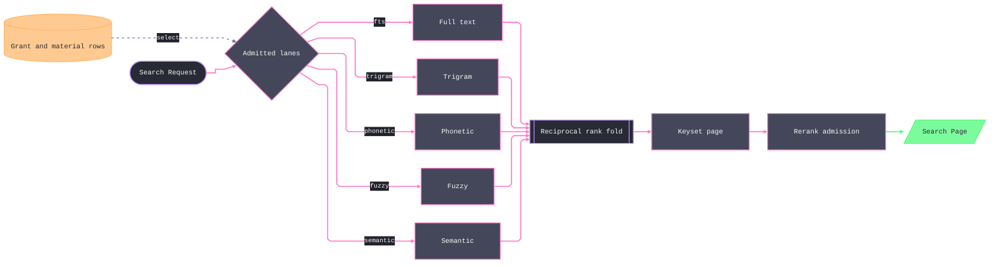

# [DATA_SEARCH]

Retrieval is one bound owner: five data-driven lanes — FTS, trigram, phonetic, fuzzy, semantic — emit ranked rows and fuse through reciprocal-rank fusion (`Σ 1/(k + rank)`) inside one database statement. The lane roster intersects request intent with the scope's grants and reports every exclusion. The FTS floor owns a provisioned artifact on every dialect, `Search.Embedding` admits provider identity, and `Search.Corpus` composes that identity with its distinct relation coordinate. The semantic seam validates the provider vector against the admitted embedding before the lane can run. `Search.of(corpus)` binds fused search, facets, snippets, keyset cursor, scoped filters, and the provision roster once; the runtime never executes schema statements.

## [01]-[CLUSTERS]

| [INDEX] | [CLUSTER]      | [OWNS]                                                                               |
| :-----: | :------------- | :----------------------------------------------------------------------------------- |
|  [01]   | `PORTS`        | the `Embedder` port (fingerprint contract, `EmbedFault`) and the optional `Reranker` |
|  [02]   | `INDEX_PLANE`  | `Search.Embedding`, `Search.Corpus`, the embedding relation, and index rows           |
|  [03]   | `LANE_ROSTER`  | the closed five-lane row table — grants, floor, rank fragment, per-call admission    |
|  [04]   | `FUSION_QUERY` | `Search.of` — the RRF statement, rerank admission, facet/snippet/cursor families     |

## [02]-[PORTS]

- Owner: the `Embedder` `Context.Tag` — embed-with-fingerprint, the one cross-folder retrieval contract — and the `Reranker` tag read through `Effect.serviceOption` so rerank is presence-typed, never a knob.
- Packages: `effect` (`Context`, `Schema`, `Array`).
- Entry: the runtime branch's embedding rows satisfy `Embedder` at app composition; nothing in this folder imports a provider — the port is the whole seam, and a scope without an embedder simply has no semantic lane, the same degradation shape as a missing grant.
- Receipt: singular `embed(text)` answers one vector under the port's own `fingerprint` — the satisfying Layer batches calls through `Batch.Engine`, the consuming seam proves both `vector.length === corpus.embedding.dims` and `port.fingerprint === corpus.embedding.fingerprint`, and only then can the semantic lane run.
- Growth: an embedding capability axis (dimension negotiation, batch policy) is a member on this one port; a second model in one app is a second Layer against the same tag selected per scope, never a second tag.
- Law: `EmbedFault` is the port's typed failure — reason-discriminated `budget | provider | shape`, schema-tagged so the persisted request band and any wire crossing carry it structurally — and retrieval folds it into lane exclusion BEFORE the census settles: the embed runs first, a failed embed folds to absence through `Effect.option`, the census marks the semantic lane `unembedded`, and the fused statement never names the lane its parameters cannot serve; text lanes still answer.
- Law: the `Reranker` answer is provider material, never trusted order — the port's declared type admits duplicates, unknown cells, and omissions, so the consuming seam (`[4]`'s rerank admission) proves the answer against its own candidate window and no port value can change hit cardinality; the port stays thin because the evidence lives at the seam that holds the candidates.
- Law: the port's provider side batches through `read/batch.md`'s engine — the window geometry is the satisfying Layer's concern; this port declares only the vector contract.

```typescript signature
import { Array, Context, Effect, Schema } from "effect"

class EmbedFault extends Schema.TaggedError<EmbedFault>()("EmbedFault", {
  reason: Schema.Literal("budget", "provider", "shape"),
  detail: Schema.String,
}) {}

class Embedder extends Context.Tag("data/Embedder")<Embedder, {
  readonly fingerprint: Search.Fingerprint
  readonly embed: (text: string) => Effect.Effect<ReadonlyArray<number>, EmbedFault>
}>() {}

class _RerankCandidate extends Schema.Class<_RerankCandidate>("Reranker.Candidate")({
  cell: Schema.NonEmptyString,
  body: Schema.String,
}) {}

class Reranker extends Context.Tag("data/Reranker")<Reranker, {
  readonly rerank: (
    query: string,
    hits: Array.NonEmptyReadonlyArray<_RerankCandidate>,
  ) => Effect.Effect<Array.NonEmptyReadonlyArray<string>, EmbedFault>
}>() {
  static readonly Candidate = _RerankCandidate
}
```

## [03]-[INDEX_PLANE]

- Owner: `Search.Embedding` — model, dimensions, revision, and derived fingerprint under the provider identity regime — and `Search.Corpus` — the distinct relation identity composed with one embedding value — plus the `retrieve_embedding` ensure whose primary key includes that fingerprint and the dialect-paired index rows; vector method selection is grant-ordered data, never a query rewrite, and the runtime never executes a DDL statement.
- Packages: `effect` (`Schema`, `Array`, `HashSet`, `Option`); `read/query.md` (`Query.Relation` — the identifier lexical class and relation owner); `lane/capability.md` (`Capability.Ensure` — the shape the provision plane applies and the rail proves); `lane/postgres.md` (the `vchord`, `vector`, `trigram`, `phonetic`, and `fuzzy` grants arrive as the granted set).
- Entry: `Search.ddl(corpus, granted)` derives the corpus's ensure roster — the embedding relation plus the admitted index rows, each row's dialect pair landing as one `Capability.Ensure` — which the provision plane applies and `lane/tenant.md`'s roster collection proves at scope construction; an absent ACCELERATOR degrades scan speed, never correctness, while the FTS floor row is relation-bearing on the sqlite profiles (the `MATCH` arm queries a virtual table) and therefore always in the roster.
- Receipt: the derivation returns the admitted artifact names — the corpus's index census, joined with the capability report in startup evidence.
- Growth: a model migration is a new fingerprint value — old vectors stay queryable under theirs until re-embedding completes; a new index posture (second metric, partial index) is one row; dims live in the DDL as data, so a dims change is a new fingerprint hence a new ensure, and mixed widths are refused by the engine.
- Law: fingerprint identity derives from `Search.Embedding` — pattern-refined `model` and `revision` plus bounded `dims` assemble under `Schema.decodeSync`, total because the field refinements close the composite pattern; `Search.Corpus` embeds that owner beside its relation field because provider identity and relation identity are distinct discriminants, while loose part brands and parallel DTOs remain unspellable.
- Law: the corpus coordinate is layered evidence — `Search.Corpus.fields.table` derives from `Query.Relation.fields.table` and adds the corpus role, so a caller-derived string can never reach an identifier position, ensure texts interpolate only sealed names, and facet dimensions derive from `Query.Relation.fields.table` because the identifier law admits no second lexical class.
- Law: every vector write and scan carries the fingerprint predicate — the column sits in the primary key and the semantic lane filters on it, so cross-model distance comparison is unrepresentable.
- Law: the vector row is ONE row with a grant-ordered method — `vchordrq` under `vchord`, else `hnsw` under `vector` — the stronger engine is data and an image upgrade re-indexes without touching a query.
- Law: every index row states both dialects — the pg text and the sqlite text are one `ensure` pair, `SELECT 1` only where the lane genuinely cannot exist on the profile (vector and trigram ride pg-only grants), and the FTS floor row's sqlite arm is the external-content FTS5 virtual table with three sync triggers plus the idempotent `rebuild` command that admits pre-existing corpus rows, so the lane arm and its storage artifact are one row and cannot drift.

```typescript signature
import { Schema } from "effect"
import { Query } from "./query.ts"

const _Model = Schema.NonEmptyString.pipe(Schema.pattern(/^[a-z0-9._-]+$/), Schema.brand("EmbedModel"))

const _Dims = Schema.Int.pipe(Schema.between(1, 16000), Schema.brand("EmbedDims"))

const _Revision = Schema.NonEmptyString.pipe(Schema.pattern(/^[a-z0-9._-]+$/), Schema.brand("EmbedRevision"))

const _Fingerprint = Schema.NonEmptyString.pipe(
  Schema.pattern(/^[a-z0-9._-]+:\d+:[a-z0-9._-]+$/),
  Schema.brand("Fingerprint"),
)

class _Embedding extends Schema.Class<_Embedding>("Search.Embedding")({
  model: _Model,
  dims: _Dims,
  revision: _Revision,
}) {
  get fingerprint(): typeof _Fingerprint.Type {
    return Schema.decodeSync(_Fingerprint)(`${this.model}:${this.dims}:${this.revision}`)
  }
}

const _Table = Query.Relation.fields.table.pipe(Schema.brand("Corpus"))

class _Corpus extends Schema.Class<_Corpus>("Search.Corpus")({
  table: _Table,
  embedding: _Embedding,
}) {}

declare namespace Search {
  type Corpus = _Corpus
  type Embedding = _Embedding
  type Model = Embedding["model"]
  type Dims = Embedding["dims"]
  type Revision = Embedding["revision"]
  type Fingerprint = Embedding["fingerprint"]
  type Table = Corpus["table"]
}

const _fingerprint = (embedding: Search.Embedding): Search.Fingerprint => embedding.fingerprint

const _embeddingDdl = (dims: Search.Dims): Capability.Ensure => ({
  relation: "retrieve_embedding",
  pg: `CREATE TABLE IF NOT EXISTS retrieve_embedding (
    corpus TEXT NOT NULL, cell TEXT NOT NULL,
    fingerprint TEXT NOT NULL,
    embedding vector(${dims}) NOT NULL,
    embedded_at TIMESTAMPTZ NOT NULL DEFAULT now(),
    PRIMARY KEY (corpus, cell, fingerprint));`,
  sqlite: `CREATE TABLE IF NOT EXISTS retrieve_embedding (
    corpus TEXT NOT NULL, cell TEXT NOT NULL,
    fingerprint TEXT NOT NULL,
    embedding BLOB NOT NULL,
    embedded_at TEXT NOT NULL DEFAULT (strftime('%Y-%m-%dT%H:%M:%fZ','now')),
    PRIMARY KEY (corpus, cell, fingerprint));`,
})

const _indexRows = {
  fts: {
    artifact: "fts",
    grant: "core",
    ensure: (corpus: Search.Table) => ({
      pg: `CREATE INDEX IF NOT EXISTS ${corpus}_tsv ON ${corpus} USING gin (to_tsvector('simple', body));`,
      sqlite: `CREATE VIRTUAL TABLE IF NOT EXISTS ${corpus}_fts USING fts5(cell UNINDEXED, body, content='${corpus}', content_rowid='rowid');
CREATE TRIGGER IF NOT EXISTS ${corpus}_fts_ai AFTER INSERT ON ${corpus} BEGIN
  INSERT INTO ${corpus}_fts(rowid, cell, body) VALUES (new.rowid, new.cell, new.body); END;
CREATE TRIGGER IF NOT EXISTS ${corpus}_fts_ad AFTER DELETE ON ${corpus} BEGIN
  INSERT INTO ${corpus}_fts(${corpus}_fts, rowid, cell, body) VALUES ('delete', old.rowid, old.cell, old.body); END;
CREATE TRIGGER IF NOT EXISTS ${corpus}_fts_au AFTER UPDATE OF cell, body ON ${corpus} BEGIN
  INSERT INTO ${corpus}_fts(${corpus}_fts, rowid, cell, body) VALUES ('delete', old.rowid, old.cell, old.body);
  INSERT INTO ${corpus}_fts(rowid, cell, body) VALUES (new.rowid, new.cell, new.body); END;
INSERT INTO ${corpus}_fts(${corpus}_fts) VALUES ('rebuild');`,
    }),
  },
  vectorChord: {
    artifact: "vectorChord",
    grant: "vchord",
    ensure: (corpus: Search.Table) => ({
      pg: `CREATE INDEX IF NOT EXISTS ${corpus}_embedding_vchord ON retrieve_embedding
       USING vchordrq (embedding vector_cosine_ops) WHERE corpus = '${corpus}';`,
      sqlite: "SELECT 1", // the semantic lane rides pg-only grants: no sqlite artifact exists to ensure
    }),
  },
  vectorHnsw: {
    artifact: "vectorHnsw",
    grant: "vector",
    ensure: (corpus: Search.Table) => ({
      pg: `CREATE INDEX IF NOT EXISTS ${corpus}_embedding_hnsw ON retrieve_embedding
       USING hnsw (embedding vector_cosine_ops) WHERE corpus = '${corpus}';`,
      sqlite: "SELECT 1",
    }),
  },
  trigram: {
    artifact: "trigram",
    grant: "trigram",
    ensure: (corpus: Search.Table) => ({
      pg: `CREATE INDEX IF NOT EXISTS ${corpus}_trgm ON ${corpus} USING gin (body gin_trgm_ops);`,
      sqlite: "SELECT 1",
    }),
  },
  keyset: {
    artifact: "keyset",
    grant: "core",
    ensure: (corpus: Search.Table) => ({
      pg: `CREATE INDEX IF NOT EXISTS ${corpus}_keyset ON ${corpus} (cell);`,
      sqlite: `CREATE INDEX IF NOT EXISTS ${corpus}_keyset ON ${corpus} (cell);`,
    }),
  },
} as const satisfies {
  readonly [row: string]: {
    readonly artifact: string
    readonly grant: string
    readonly ensure: (corpus: Search.Table) => { readonly pg: string; readonly sqlite: string }
  }
}

declare namespace Search {
  type IndexKind = keyof typeof _indexRows
}
```

## [04]-[LANE_ROSTER]

- Owner: the `_lanes` anchor — five rows, each `{ grants, floor, material, rank }` where `rank` builds the lane's scored CTE body as a composed `sql` fragment over a typed bind value — and `_admitted`, the per-call fold intersecting the request's lanes with the scope's grants, floor postures, and required material.
- Packages: composition over `[2]`/`[3]` values and the granted set; `@effect/sql` (the `sql` fragment constructor plus `sql.and` — every parameter binds by value inside the fragment, so no positional index exists anywhere on the page); `effect` (`Array`, `HashSet`, `Option`, `Record`).
- Growth: a sixth lane is one row — the fusion statement folds whatever the admission returns; a lane's SQL tuning edits its row alone; a new bind axis is a `Search.Bind` field every row can read.
- Law: lane rows are fragment builders, never SQL text — `rank(sql, corpus, bind)` interpolates `bind.text`/`bind.limit`/the vector literal as BOUND parameters and the corpus only through the brand-proven identifier or a value predicate, so a lane-set change cannot misalign parameters (there are none to count) and the statement stays typed, batched, and dialect-switched; hand-assembled `$N` text is the deleted spelling.
- Law: every lane emits one shape — `(cell, rank)` with rank 1-based by lane-local score — because RRF consumes ranks, never scores; score normalization across heterogeneous lanes is exactly what the fusion deletes.
- Law: the floor is a row column, never a special case — `floor: true` marks a lane that runs regardless of its accelerator grant (`fts` degrades to `ts_rank_cd` over `websearch_to_tsquery` on the spine and to the FTS5 `MATCH` arm on the sqlite profiles, both against `[3]`'s provisioned floor artifacts), and `_admitted` reads the column, so the census logic enumerates no lane by name and a future floored lane is one row fact.
- Law: lane SQL rides its grant set AND its dialect — `fts` is the core `tsvector`/FTS5 floor, `trigram` rides `similarity()`, `phonetic` rides `soundex()`, `fuzzy` rides bounded `levenshtein()`, and `semantic` accepts the `vector` contract from either vector engine plus an admitted embedding; a lane the profile cannot express self-excludes through its grant set, so degradation is the fence, not prose.
- Law: the scope predicate is one composed fragment — `Search.Filter` is one schema-tagged family over equality, inequality, bounds, ranges, and set membership; `_scoped` exhaustively maps its cases into one `sql.and` fragment (or the neutral `1 = 1`), every lane splices it, and the semantic lane joins the corpus relation to apply it — so a filtered search filters EVERY lane before fusion and a hit outside the scope cannot enter the pool through any arm.
- Law: the corpus contract is one relation with stable `cell`, searchable `body`, and admitted facet columns — `score` is a fused-query projection and never a corpus column, so the keyset support row indexes the stable `cell` tie-breaker only; `Search.of` takes the corpus value, and a second searchable relation is a second binding.
- Law: admission is evidence and row-driven — each requested lane resolves to `ran`, `ungranted`, `unembedded`, or `excluded` from its `floor` and `material` columns; no lane name appears in the admission fold, and the output is both CTE roster and reply census.

```typescript signature
import { Statement, type SqlClient } from "@effect/sql"

class _Vector extends Schema.Class<_Vector>("Search.Vector")({
  literal: Schema.NonEmptyString,
  fingerprint: _Fingerprint,
}) {}

class _Bind extends Schema.Class<_Bind>("Search.Bind")({
  text: Schema.NonEmptyString,
  limit: Schema.Int.pipe(Schema.greaterThan(0)),
  scope: Schema.declare(Statement.isFragment),
  vector: Schema.OptionFromSelf(_Vector),
}) {}

declare namespace Search {
  type Bind = _Bind
}

const _lanes = {
  fts: {
    grants: ["core"],
    floor: true,
    material: "text",
    rank: (sql: SqlClient.SqlClient, corpus: Search.Table, bind: Search.Bind) =>
      sql.onDialectOrElse({
        orElse: () =>
          sql`SELECT ${sql(`${corpus}_fts`)}.cell, rank() OVER (ORDER BY ${sql(`${corpus}_fts`)}.rank) AS rank
              FROM ${sql(`${corpus}_fts`)} JOIN ${sql(corpus)} c ON c.cell = ${sql(`${corpus}_fts`)}.cell
              WHERE ${sql(`${corpus}_fts`)} MATCH ${bind.text} AND ${bind.scope} LIMIT ${bind.limit}`,
        pg: () =>
          sql`SELECT c.cell, rank() OVER (ORDER BY ts_rank_cd(to_tsvector('simple', c.body), websearch_to_tsquery('simple', ${bind.text})) DESC) AS rank
              FROM ${sql(corpus)} c WHERE to_tsvector('simple', c.body) @@ websearch_to_tsquery('simple', ${bind.text}) AND ${bind.scope} LIMIT ${bind.limit}`,
      }),
  },
  trigram: {
    grants: ["trigram"],
    floor: false,
    material: "text",
    rank: (sql: SqlClient.SqlClient, corpus: Search.Table, bind: Search.Bind) =>
      sql`SELECT c.cell, rank() OVER (ORDER BY similarity(c.body, ${bind.text}) DESC) AS rank
          FROM ${sql(corpus)} c WHERE c.body % ${bind.text} AND ${bind.scope} LIMIT ${bind.limit}`,
  },
  phonetic: {
    grants: ["phonetic"],
    floor: false,
    material: "text",
    rank: (sql: SqlClient.SqlClient, corpus: Search.Table, bind: Search.Bind) =>
      sql`SELECT c.cell, rank() OVER (ORDER BY c.body) AS rank
          FROM ${sql(corpus)} c WHERE soundex(c.body) = soundex(${bind.text}) AND ${bind.scope} LIMIT ${bind.limit}`,
  },
  fuzzy: {
    grants: ["fuzzy"],
    floor: false,
    material: "text",
    rank: (sql: SqlClient.SqlClient, corpus: Search.Table, bind: Search.Bind) =>
      sql`SELECT c.cell, rank() OVER (ORDER BY levenshtein(left(c.body, 64), left(${bind.text}, 64))) AS rank
          FROM ${sql(corpus)} c WHERE ${bind.scope} LIMIT ${bind.limit}`,
  },
  semantic: {
    grants: ["vector", "vchord"],
    floor: false,
    material: "embedding",
    rank: (sql: SqlClient.SqlClient, corpus: Search.Table, bind: Search.Bind) =>
      Option.match(bind.vector, {
        onNone: () => sql`SELECT cell, 1 AS rank FROM retrieve_embedding WHERE 1 = 0`,
        onSome: (held) =>
          sql`SELECT e.cell, rank() OVER (ORDER BY e.embedding <=> ${held.literal}::vector) AS rank
              FROM retrieve_embedding e JOIN ${sql(corpus)} c ON c.cell = e.cell
              WHERE e.corpus = ${corpus} AND e.fingerprint = ${held.fingerprint} AND ${bind.scope} LIMIT ${bind.limit}`,
      }),
  },
} as const

const _LANE_NAMES = ["fts", "trigram", "phonetic", "fuzzy", "semantic"] as const

const _DISPOSITIONS = ["ran", "ungranted", "unembedded", "excluded"] as const

declare namespace Search {
  type Lane = (typeof _LANE_NAMES)[number]
  type Disposition = (typeof _DISPOSITIONS)[number]
}

const _admitted = (
  requested: ReadonlyArray<Search.Lane>,
  granted: HashSet.HashSet<string>,
  embedded: boolean,
): Record.ReadonlyRecord<Search.Lane, Search.Disposition> =>
  Record.map(_lanes, (row, lane) =>
    !Array.contains(requested, lane)
      ? "excluded"
      : row.material === "embedding" && !embedded
        ? "unembedded"
        : Array.some(row.grants, (grant) => HashSet.has(granted, grant)) || row.floor
          ? "ran"
          : "ungranted")
```

## [05]-[FUSION_QUERY]

- Owner: `Search.of(corpus)` — the once-per-scope effectful binding whose accessors mint at construction and whose members are the bound read family: `search` (the fused RRF statement plus the rerank admission), `facets`, the snippet projection, the keyset cursor codec, and `ddl` from `[3]`; one request shape carries every modality.
- Packages: `effect` (`Effect`, `Option`, `HashMap`, `HashSet`, `Record`, `Schema`, `Array`); `@effect/sql` (the fused statement, the rerank-window body fetch, the snippet fetch, and the one-statement facet census are each composed fragment values — `sql.in` set-shaped over the hit cells, `sql.and` over the filter rows, never a per-hit query and never assembled text); `lane/capability.md` (`Capability` — the grant read, taken once at bind because grants are scope-construction facts).
- Entry: `const bound = yield* Search.of(corpus)` inside the owning scope's construction, then `bound.search(request)` per call; `Search.Request` admits text, lanes, policy refinements, decoded cursor, filters, facets, snippets, and rerank depth once, and the reply carries scored hits, facet counts, next cursor, lane census, and rerank disposition.
- Receipt: `Search.Page.lanes` names each lane's disposition and `Search.Page.rerank` names the accelerator's — `applied`, `partial` (the provider omitted or repeated candidates and the seam repaired the window), `degraded` (the provider faulted and fusion order held), `off` — so a degraded scope and a misbehaving provider are both visible in every reply and a relevance regression traces to evidence, never to guesswork.
- Growth: rerank depth, fusion constant `k`, facet bound, filter rows, and snippet shape are `Search.Request` fields derived from `Search.Policy`; a new reply projection is a field on the page, never a second search.
- Law: the binding is bind-once — `Search.of` yields the client, reads the capability report, and mints every `SqlSchema` accessor exactly once, so a search call pays zero construction and resolver identity holds across calls; an accessor minted inside `search`'s body is the per-call rebuild `read/query.md` already names as the defect.
- Law: fusion is in-database and fragment-composed — admitted lane fragments fold into the `WITH` roster and the `UNION ALL` pool by fragment interpolation, `Σ 1.0/(k + rank)` groups by cell, the keyset predicate arrives as a bound-value `HAVING` fragment when a cursor exists, and the statement is ONE round trip whose every parameter is value-bound; assembling lanes in process re-buys N queries and loses the shared plan, and hand-counted placeholder text is the deleted defect.
- Law: every reply row decodes — the fused rows, the snippet clips, the facet counts, and the rerank bodies each prove through a `Result` schema (`score` through the numeric-or-string codec because aggregate numerics arrive dialect-dependent), so no `String(row[...])` cast exists on the page.
- Law: facet census shares request scope — one `SqlSchema.findAll` accessor folds every requested dimension through `UNION ALL`, applies the same `Search.Filter` fragment before grouping, and binds the request's refined `facetTop`; a per-dimension round trip, unfiltered census, or hidden module default is a different query and therefore a defect.
- Law: the cursor is opaque and typed — `{ score, cell }` under one composed codec, `Schema.StringFromBase64Url` over `Schema.parseJson`, so encode and decode share the schema and a malformed caller cursor is `ParseError` on the admission rail; a raw offset is the rejected pagination, and the cursor mints from the FUSED order — rerank re-orders presentation inside the page and never moves the keyset coordinate, so a full-page rerank window cannot skip rows.
- Law: snippets ride the granted relevance lane AND its dialect — the `bm25` snippet function where the grant holds (its spelling travels with the `[3]` RESEARCH row), `ts_headline` as the in-core pg floor, the FTS5 `snippet()` arm serving the sqlite profiles against the same provisioned virtual table the lane row queries.
- Law: rerank is an admitted window policy — when the `Reranker` is present and the request asks, the top `window` fused hits re-order by the port's verdict AFTER the seam proves it: the answer deduplicates, unknown cells drop, candidates the provider omitted keep their fusion order behind the ranked head, an empty body window reports `partial`, and the tail beyond the window never moves — so hit cardinality is invariant under any provider answer, the page's tail guarantee holds for every value the port type admits, and a provider fault degrades to fusion order through `Effect.option`; retrieval never fails on the accelerator.

```typescript signature
import { Array, Effect, HashMap, HashSet, Match, Option, type ParseResult, Record, Schema } from "effect"
import { SqlClient, SqlSchema, type SqlError, type Statement } from "@effect/sql"
import { Capability } from "../lane/capability.ts"

declare namespace Search {
  type Filter = typeof _Filter.Type
  type Request = _Request
  type Rerank = (typeof _RERANKS)[number]
  type Hit = _Hit
  type Page = _Page
}

const _Cursor = Schema.compose(
  Schema.StringFromBase64Url,
  Schema.parseJson(Schema.Struct({ score: Schema.Number, cell: Schema.NonEmptyString })),
)

class _Policy extends Schema.Class<_Policy>("Search.Policy")({
  limit: Schema.Int.pipe(Schema.between(1, 200)),
  k: Schema.Int.pipe(Schema.between(1, 1000)),
  rerank: Schema.NonNegativeInt.pipe(Schema.lessThanOrEqualTo(200)),
  facetTop: Schema.Int.pipe(Schema.between(1, 500)),
}) {}

const _PAGE = new _Policy({ limit: 20, k: 60, rerank: 0, facetTop: 50 })

const _Scalar = Schema.Union(Schema.String, Schema.Number, Schema.Boolean)

const _Filter = Schema.Union(
  Schema.TaggedStruct("Equal", { dim: Query.Relation.fields.table, value: _Scalar }),
  Schema.TaggedStruct("NotEqual", { dim: Query.Relation.fields.table, value: _Scalar }),
  Schema.TaggedStruct("AtLeast", { dim: Query.Relation.fields.table, value: _Scalar }),
  Schema.TaggedStruct("AtMost", { dim: Query.Relation.fields.table, value: _Scalar }),
  Schema.TaggedStruct("Between", { dim: Query.Relation.fields.table, lower: _Scalar, upper: _Scalar }),
  Schema.TaggedStruct("AnyOf", { dim: Query.Relation.fields.table, values: Schema.NonEmptyArray(_Scalar) }),
)

const _RERANKS = ["applied", "partial", "degraded", "off"] as const

class _Request extends Schema.Class<_Request>("Search.Request")({
  text: Schema.NonEmptyString,
  lanes: Schema.optionalWith(Schema.Array(Schema.Literal(..._LANE_NAMES)), {
    default: () => ["fts", "trigram", "semantic"],
  }),
  limit: Schema.optionalWith(_Policy.fields.limit, { default: () => _PAGE.limit }),
  k: Schema.optionalWith(_Policy.fields.k, { default: () => _PAGE.k }),
  cursor: Schema.optionalWith(_Cursor, { as: "Option" }),
  filter: Schema.optionalWith(Schema.Array(_Filter), { default: () => [] }),
  facets: Schema.optionalWith(Schema.Array(Query.Relation.fields.table), { default: () => [] }),
  facetTop: Schema.optionalWith(_Policy.fields.facetTop, { default: () => _PAGE.facetTop }),
  snippet: Schema.optionalWith(Schema.Boolean, { default: () => false }),
  rerank: Schema.optionalWith(_Policy.fields.rerank, { default: () => _PAGE.rerank }),
}) {}

class _Hit extends Schema.Class<_Hit>("Search.Hit")({
  cell: Schema.NonEmptyString,
  score: Schema.Number,
  snippet: Schema.OptionFromSelf(Schema.String),
}) {}

class _FacetCount extends Schema.Class<_FacetCount>("Search.FacetCount")({
  dim: Query.Relation.fields.table,
  value: _Scalar,
  count: Schema.NonNegativeInt,
}) {}

class _Page extends Schema.Class<_Page>("Search.Page")({
  hits: Schema.Array(_Hit),
  facets: Schema.Array(_FacetCount),
  cursor: Schema.OptionFromSelf(Schema.String),
  lanes: Schema.Record({
    key: Schema.Literal(..._LANE_NAMES),
    value: Schema.Literal(..._DISPOSITIONS),
  }),
  rerank: Schema.Literal(..._RERANKS),
}) {}

const _Score = Schema.Union(Schema.Number, Schema.NumberFromString)

const _HitRow = Schema.Struct({ cell: Schema.NonEmptyString, score: _Score })

const _Body = Reranker.Candidate

const _Clip = Schema.Struct({ cell: Schema.NonEmptyString, clip: Schema.String })

const _Facet = Schema.Struct({
  dim: Query.Relation.fields.table,
  value: _Scalar,
  count: Schema.Union(Schema.NonNegativeInt, Schema.NumberFromString.pipe(Schema.int(), Schema.nonNegative())),
})

const _scoped = (sql: SqlClient.SqlClient, filter: ReadonlyArray<Search.Filter>) =>
  Array.isNonEmptyReadonlyArray(filter)
    ? sql.and(Array.map(filter, Match.typeTags<Search.Filter, Statement.Fragment>()({
        Equal: (term) => sql`c.${sql(term.dim)} = ${term.value}`,
        NotEqual: (term) => sql`c.${sql(term.dim)} <> ${term.value}`,
        AtLeast: (term) => sql`c.${sql(term.dim)} >= ${term.value}`,
        AtMost: (term) => sql`c.${sql(term.dim)} <= ${term.value}`,
        Between: (term) => sql`c.${sql(term.dim)} BETWEEN ${term.lower} AND ${term.upper}`,
        AnyOf: (term) => sql.or(Array.map(term.values, (value) => sql`c.${sql(term.dim)} = ${value}`)),
      })))
    : sql`1 = 1`

const _fused = (
  sql: SqlClient.SqlClient,
  corpus: Search.Table,
  lanes: Array.NonEmptyReadonlyArray<Search.Lane>,
  bind: Search.Bind,
  k: number,
  cursor: Option.Option<{ readonly score: number; readonly cell: string }>,
  limit: number,
) => {
  const roster = Array.map(lanes, (lane) => sql`${sql(lane)} AS (${_lanes[lane].rank(sql, corpus, bind)})`)
  const pool = Array.map(lanes, (lane) => sql`SELECT cell, rank FROM ${sql(lane)}`)
  const ctes = Array.reduce(Array.tailNonEmpty(roster), Array.headNonEmpty(roster), (held, cte) => sql`${held}, ${cte}`)
  const union = Array.reduce(Array.tailNonEmpty(pool), Array.headNonEmpty(pool), (held, arm) => sql`${held} UNION ALL ${arm}`)
  const paging = Option.match(cursor, {
    onNone: () => sql``,
    onSome: (at) =>
      sql`HAVING sum(1.0 / (${k} + rank)) < ${at.score} OR (sum(1.0 / (${k} + rank)) = ${at.score} AND cell > ${at.cell})`,
  })
  return sql`WITH ${ctes}
    SELECT cell, sum(1.0 / (${k} + rank)) AS score FROM (${union}) pool
    GROUP BY cell ${paging}
    ORDER BY score DESC, cell LIMIT ${limit}`
}
```



```typescript signature
const _ddl = (corpus: Search.Corpus, granted: HashSet.HashSet<string>) => {
  const vector = HashSet.has(granted, "vchord")
    ? Option.some(_indexRows.vectorChord)
    : HashSet.has(granted, "vector")
      ? Option.some(_indexRows.vectorHnsw)
      : Option.none<(typeof _indexRows)["vectorChord" | "vectorHnsw"]>()
  const admitted = Array.appendAll(
    Option.toArray(vector),
    Array.prepend(
      Array.filter([_indexRows.trigram, _indexRows.keyset], (row) => row.grant === "core" || HashSet.has(granted, row.grant)),
      _indexRows.fts,
    ),
  )
  return {
    census: Array.map(admitted, (row) => row.artifact),
    ensures: Array.appendAll(
      Option.match(vector, { onNone: () => [], onSome: () => [_embeddingDdl(corpus.embedding.dims)] }),
      Array.map(admitted, (row): Capability.Ensure => ({ relation: corpus.table, ...row.ensure(corpus.table) })),
    ),
  }
}

const _reranked = (
  bodies: (cells: ReadonlyArray<string>) => Effect.Effect<ReadonlyArray<typeof _Body.Type>, SqlError.SqlError | ParseResult.ParseError>,
  text: string,
  window: number,
  hits: ReadonlyArray<Search.Hit>,
) =>
  Effect.flatMap(Effect.serviceOption(Reranker), (port) =>
    Option.match(Option.filter(port, () => window > 0 && hits.length > 0), {
      onNone: () => Effect.succeed([hits, "off"] as const),
      onSome: (reranker) =>
        Effect.gen(function* () {
          const head = Array.take(hits, window)
          const candidates = yield* bodies(Array.map(head, (hit) => hit.cell))
          if (!Array.isNonEmptyReadonlyArray(candidates)) return [hits, "partial"] as const
          const verdict = yield* Effect.option(reranker.rerank(text, candidates))
          return Option.match(verdict, {
            onNone: () => [hits, "degraded"] as const, // provider fault: fusion order holds, the page says so
            onSome: (order) => {
              const byCell = HashMap.fromIterable(Array.map(head, (hit) => [hit.cell, hit] as const))
              const ranked = Array.filterMap(Array.dedupe(order), (cell) => HashMap.get(byCell, cell))
              const seen = HashSet.fromIterable(Array.map(ranked, (hit) => hit.cell))
              const kept = Array.filter(head, (hit) => !HashSet.has(seen, hit.cell)) // omitted candidates keep fusion order behind the ranked head
              const repaired = ranked.length !== order.length || kept.length > 0
              return [Array.appendAll(Array.appendAll(ranked, kept), Array.drop(hits, window)), repaired ? ("partial" as const) : ("applied" as const)] as const
            },
          })
        }),
    }))

const _facetArm = (
  sql: SqlClient.SqlClient,
  table: Search.Table,
  dim: Query.Relation["table"],
  scope: Statement.Fragment,
  top: number,
) =>
  // each arm wraps as a derived table: pg refuses a bare per-arm ORDER BY/LIMIT inside UNION ALL
  sql`SELECT * FROM (SELECT ${dim} AS dim, c.${sql(dim)} AS value, count(*) AS count FROM ${sql(table)} c
      WHERE ${scope} GROUP BY c.${sql(dim)} ORDER BY count(*) DESC LIMIT ${top}) f`

const _of = (corpus: Search.Corpus) =>
  Effect.gen(function* () {
    const sql = yield* SqlClient.SqlClient
    const capability = yield* Capability // grants are scope-construction facts: read once at bind
    const hits = Schema.decodeUnknown(Schema.Array(_HitRow))
    const bodies = SqlSchema.findAll({
      Request: Schema.Array(Schema.String),
      Result: _Body,
      execute: (cells) => sql`SELECT cell, body FROM ${sql(corpus.table)} WHERE ${sql.in("cell", cells)}`,
    })
    const clips = SqlSchema.findAll({
      Request: Schema.Struct({ text: Schema.String, cells: Schema.Array(Schema.String) }),
      Result: _Clip,
      execute: (window) =>
        sql.onDialectOrElse({
          orElse: () =>
            sql`SELECT cell, snippet(${sql(`${corpus.table}_fts`)}, -1, '', '', '…', 12) AS clip
                FROM ${sql(`${corpus.table}_fts`)} WHERE ${sql(`${corpus.table}_fts`)} MATCH ${window.text} AND ${sql.in("cell", window.cells)}`,
          pg: () =>
            sql`SELECT cell, ts_headline('simple', body, websearch_to_tsquery('simple', ${window.text})) AS clip
                FROM ${sql(corpus.table)} WHERE ${sql.in("cell", window.cells)}`,
        }),
    })
    const counted = SqlSchema.findAll({
      // one statement censuses every asked dimension: the UNION ALL folds wrapped per-dim arms, no per-dim round trip
      Request: Schema.Struct({
        dims: Schema.Array(Query.Relation.fields.table),
        filter: Schema.Array(_Filter),
        top: _Policy.fields.facetTop,
      }),
      Result: _Facet,
      execute: (request) =>
        Array.isNonEmptyReadonlyArray(request.dims)
          ? Array.reduce(
              Array.tailNonEmpty(request.dims),
              _facetArm(sql, corpus.table, Array.headNonEmpty(request.dims), _scoped(sql, request.filter), request.top),
              (held, dim) => sql`${held} UNION ALL ${_facetArm(sql, corpus.table, dim, _scoped(sql, request.filter), request.top)}`,
            )
          : sql`SELECT '' AS dim, '' AS value, 0 AS count WHERE 1 = 0`,
    })
    const search = (request: Search.Request) =>
      Effect.gen(function* () {
        const requested = request.lanes
        const embedder = yield* Effect.serviceOption(Embedder)
        const embedded = Option.flatten(yield* Effect.transposeOption(
          Option.map(Option.filter(embedder, () => Array.contains(requested, "semantic")), (port) =>
            Effect.option(
              Effect.map(
                Effect.filterOrFail(
                  port.embed(request.text),
                  (vector) =>
                    vector.length === corpus.embedding.dims &&
                    Array.every(vector, Number.isFinite) &&
                    port.fingerprint === corpus.embedding.fingerprint,
                  () => new EmbedFault({
                    reason: "shape",
                    detail: `expected ${corpus.embedding.fingerprint} with ${corpus.embedding.dims} dimensions`,
                  }),
                ),
                (vector) => ({ vector, fingerprint: port.fingerprint }),
              )))))
        const census = _admitted(requested, capability.granted, Option.isSome(embedded))
        const running = Array.filter(Record.keys(census), (lane) => census[lane] === "ran")
        const cursor = request.cursor
        const limit = request.limit
        const bind = new _Bind({
          text: request.text,
          limit,
          scope: _scoped(sql, request.filter),
          vector: Option.map(embedded, (held) => new _Vector({
            literal: `[${Array.join(held.vector, ",")}]`,
            fingerprint: held.fingerprint,
          })),
        })
        const rows = yield* Array.isNonEmptyReadonlyArray(running)
          ? Effect.flatMap(
              _fused(sql, corpus.table, running, bind, request.k, cursor, limit + 1),
              hits,
            )
          : Effect.succeed<ReadonlyArray<typeof _HitRow.Type>>([])
        const scored = Array.map(Array.take(rows, limit), (row) => new _Hit({
          cell: row.cell,
          score: row.score,
          snippet: Option.none<string>(),
        }))
        const clipped = request.snippet && scored.length > 0
          ? yield* Effect.map(clips({ text: request.text, cells: Array.map(scored, (hit) => hit.cell) }), (found) => {
              const byCell = HashMap.fromIterable(Array.map(found, (row) => [row.cell, row.clip] as const))
              return Array.map(scored, (hit) => new _Hit({
                cell: hit.cell,
                score: hit.score,
                snippet: HashMap.get(byCell, hit.cell),
              }))
            })
          : scored
        const [ordered, reranked] = yield* _reranked(bodies, request.text, request.rerank, clipped)
        const facets = Array.map(
          yield* counted({ dims: request.facets, filter: request.filter, top: request.facetTop }),
          (row) => new _FacetCount(row),
        )
        const next = rows.length > limit ? Array.last(clipped) : Option.none<Search.Hit>()
        return new _Page({
          hits: ordered,
          facets,
          cursor: yield* Effect.transposeOption(
            Option.map(next, (hit) => Schema.encode(_Cursor)({ score: hit.score, cell: hit.cell }))),
          lanes: census,
          rerank: reranked,
        })
      })
    return {
      search,
      facets: counted,
      ddl: _ddl(corpus, capability.granted),
    }
  })

const Search = {
  Corpus: _Corpus,
  Embedding: _Embedding,
  Cursor: _Cursor,
  Filter: _Filter,
  Hit: _Hit,
  Page: _Page,
  Policy: _Policy,
  Request: _Request,
  defaults: _PAGE,
  fingerprint: _fingerprint,
  lanes: _lanes,
  indexes: _indexRows,
  embedding: _embeddingDdl,
  admitted: _admitted,
  fused: _fused,
  ddl: _ddl,
  of: _of,
} as const

// --- [EXPORTS] --------------------------------------------------------------------------

export { Embedder, EmbedFault, Reranker, Search }
```
