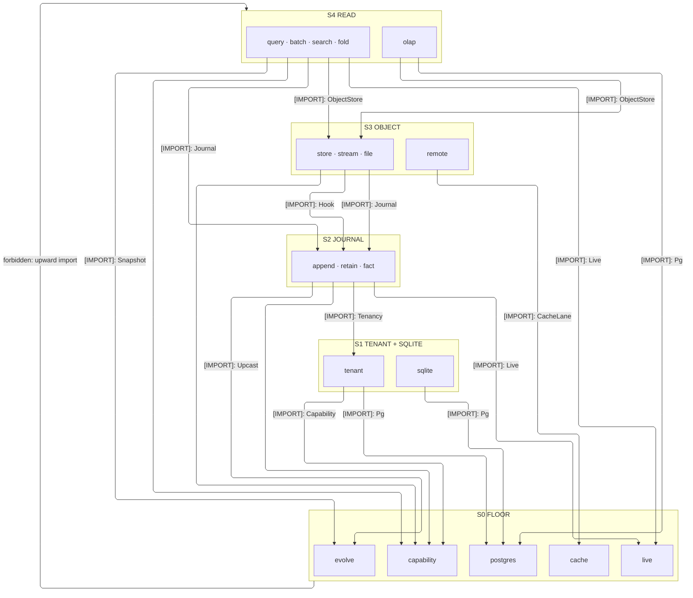
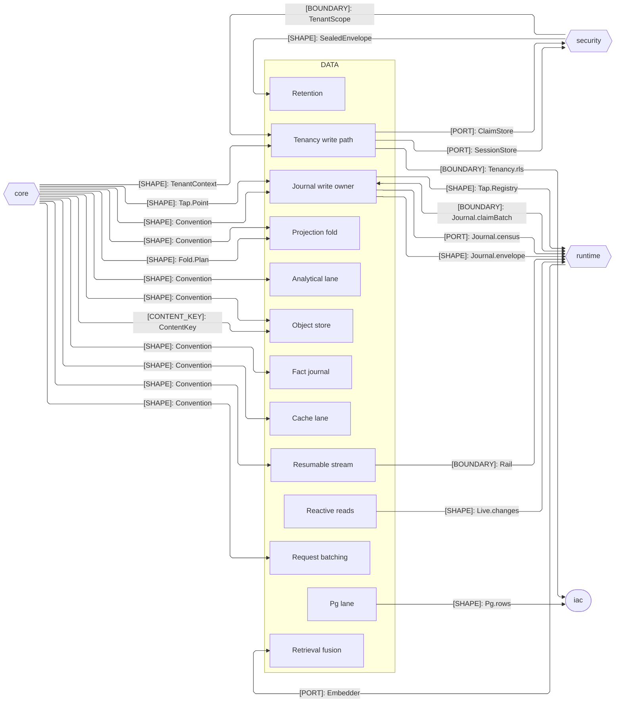

# [TS_DATA_ARCHITECTURE]

`data` owns the branch's durable-persistence surface: the `lane`, `journal`, `object`, and `read` sub-domains meet through the one journal write owner, the one capability rail, the one content identity, and the one tenancy contract. A backend is a semantic-guarantee row on its owning lane, never a sibling shape; sub-domains align with the core, security, runtime, and iac peers by contract, never by reference.

## [01]-[DOMAIN_MAP]

```text codemap
data/
└── src/
    ├── lane/             # Guarantee-lane matrix: engines as rows under sealed capability vocabularies
    │   ├── postgres.ts   # First-party relational lane and its ruled extension matrix
    │   ├── sqlite.ts     # Embedded lane degrading one relational contract across its profile rows
    │   ├── olap.ts       # Analytical lane over DuckDB and ClickHouse engine rows
    │   ├── cache.ts      # Latency lane: single-flight, dedup, restart-surviving cache rows
    │   ├── capability.ts # Fail-closed capability rail probed at Layer construction
    │   └── tenant.ts     # Tenancy write path pinning the TENANT_GUC across RLS, schema, and database cases
    ├── journal/          # Record of truth: atomic writes, evolution, facts, lawful aging
    │   ├── append.ts     # One atomic write owner: journal, outbox, and idempotency ledger in one commit
    │   ├── evolve.ts     # Read-time upcasting: per-tag version chains, snapshot as a projection
    │   ├── fact.ts       # Durable fact journal: audit and metering as one buffered family
    │   └── retain.ts     # Retention classes, crypto-shredding, and DSAR portability folds
    ├── object/           # Content-addressed object plane over the one ContentKey
    │   ├── store.ts      # S3-conditional content-addressed object store
    │   ├── stream.ts     # Resumable rail: BYOB ingress, checkpointed identity fold, tus server
    │   ├── file.ts       # Filesystem plane: gated content-addressed intake and derivative codec
    │   └── remote.ts     # Remote-origin plane: scheme-dispatched non-local sources
    └── read/             # Read side: typed queries, batching, projections, reactivity, retrieval
        ├── query.ts      # Typed CRUD with arity as combinator over Model codec pairs
        ├── batch.ts      # Request-batching engine: structural dedup and windowed resolvers
        ├── fold.ts       # Durable projection plane binding one Fold.Plan across staleness budgets
        ├── live.ts       # Reactivity-keyed reads: invalidation keys stamped at publish, read at query
        └── search.ts     # Retrieval lanes fused by reciprocal rank inside the database
```

## [02]-[STRATA]

- S0 floor — independent mints, none importing a data sibling: `lane/postgres` guarantee rows and the shared profile-receipt band (`Pg.rows`, `Pg.Profile`), `lane/capability` the fail-closed rail (`Capability`) fed by argument, never import, `lane/cache` the latency rows (`CacheLane`), `journal/evolve` the upcast chains (`Upcast`), `read/live` the reactivity keys (`Live`).
- S1 `lane/tenant` + `lane/sqlite` — `tenant` pins the tenancy write path over `Capability` and `Pg`; `sqlite` degrades the `Pg` contract through the grant-key type read and harvests query evidence into `Pg.Profile`, its one value read.
- S2 `journal` — `append` commits journal, outbox, and idempotency in one transaction composing `Upcast`, `Tenancy`, and `Live` invalidation stamps, mints the CloudEvents relay envelope, and owns the core-brand `Hook` point vocabulary with its publisher port; `retain` ages and `fact` meters over `Journal` inside the wave, `retain` fanning its erase tombstone through `Hook`.
- S3 `object` — every byte plane binds `Journal` custody under the one content identity: `store` roots, `stream`/`file`/`remote` compose it, `stream`/`file` tapping `Hook` at their admission seams, `remote` alone reaching `CacheLane`.
- S4 `read` — consumption over everything below: `query`/`batch`/`search`/`fold` compose `Journal`, `ObjectStore`, `Live`, and the rails; `lane/olap` sits beside them composing `ObjectStore` and the `Pg.Profile` harvest band.



## [03]-[SEAMS]



## [04]-[ORGANIZATION]

`lane` prices guarantees, never durability tiers: `postgres` is the spine, the embedded, analytical, and latency lanes sit beside it, `capability` refuses to boot an engine that cannot prove its rows, and `tenant` is the single write path pinning the tenancy GUC. `journal` is the record of truth — `append` commits journal, outbox, and idempotency together, and read-time upcasting keeps the log append-only. `object` binds every byte plane to the one content identity through a single admission fold. `read` composes the lanes into consumption, from proven-shape CRUD to reciprocal-rank fusion.

## [05]-[BOUNDARIES]

- DDL is declarative additive ensure: iac applies at provision, this folder verifies fail-closed at startup, and runtime never mutates schema.
- One sole carve-out exists: the operator rebuild verb — the session-locked shadow swap — never scheduled, never reachable from a request path.
- Key custody stays out: no authorization decision here, the security-declared tenancy contract enforced, only wrapped key material stored.
- Engine names never leak upward: consumers bind guarantee lanes, and a new engine is a row on its owning lane page.
- Object-plane conformance refuses any engine that cannot honor `If-None-Match: *` conditional put; refused rows are recorded once.
