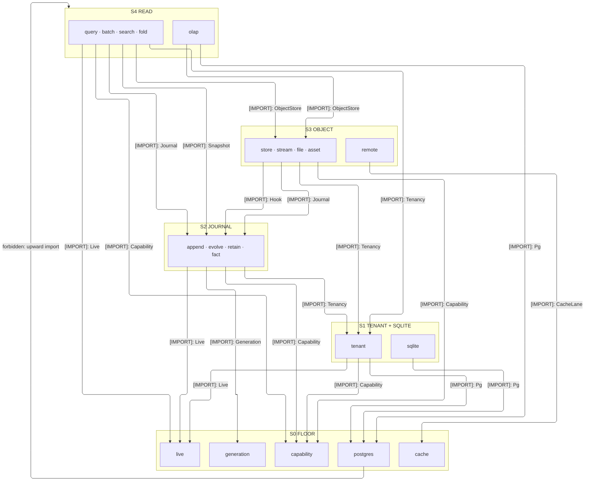
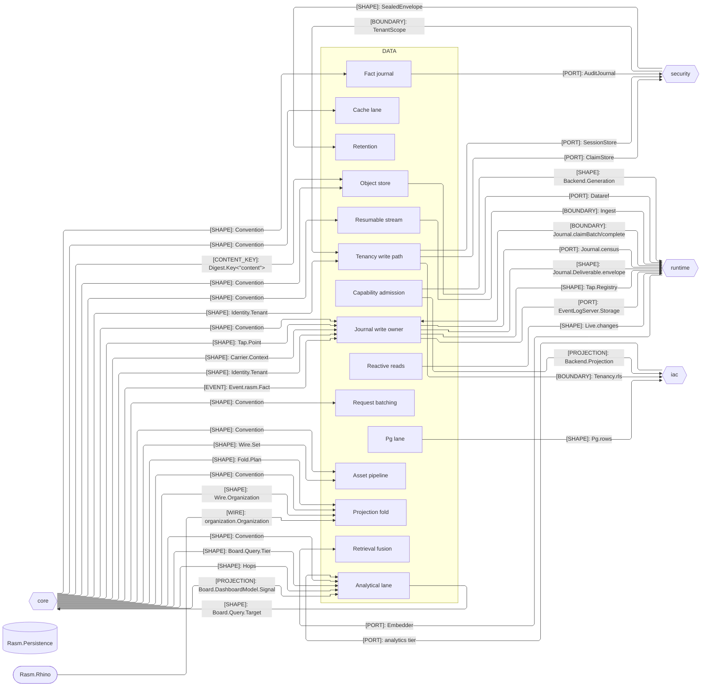

# [TS_DATA_ARCHITECTURE]

`data` owns the branch's durable-persistence surface: the `lane`, `journal`, `object`, and `read` sub-domains meet through the one journal write owner, the one capability gate, the one content identity, and the one tenancy contract. Backends land as semantic-guarantee rows on their owning lane, never sibling shapes; sub-domains align with the core, security, runtime, and iac peers by contract, never by reference.

## [01]-[DOMAIN_MAP]

```text
data/
└── src/
    ├── lane/               # Guarantee-lane matrix: engines as rows under sealed capability vocabularies
    │   ├── cache.ts        # Latency lane: single-flight, dedup, restart-surviving cache rows
    │   ├── capability.ts   # Fail-closed capability gate probed at Layer construction
    │   ├── olap.ts         # Analytical lane over DuckDB, ClickHouse, Flight, tier rows, and the Arrow-Parquet wire
    │   ├── postgres.ts     # SqlClient driver Layers, the ruled extension matrix, and one derived capability union
    │   ├── sqlite.ts       # Embedded lane degrading one relational contract across its profile rows
    │   └── tenant.ts       # Tenancy write path pinning the session-coordinate GUCs across RLS, schema, and database cases
    ├── journal/            # Record of truth: atomic writes, evolution, facts, lawful aging
    │   ├── append.ts       # One atomic write owner and the outbox relay claim boundary
    │   ├── evolve.ts       # Evolution re-mints the whole log under a custody row and projects snapshots
    │   ├── fact.ts         # AuditFact and MeterFact rows draining into one stream-discriminated table
    │   ├── generation.ts   # Floor mint: payload coordinate, generation identity, custody ledger, transaction guard
    │   └── retain.ts       # Retention classes, crypto-shredding, and DSAR portability folds
    ├── object/             # Content-addressed object plane over one Digest.Key
    │   ├── asset.ts        # Category-blind spine, entry pair, and products; the GPU glTF/KTX2 family is the first row set
    │   ├── file.ts         # Digest.Key intake gate and the derivative emit legs sharing one content identity
    │   ├── remote.ts       # Remote-origin plane: scheme-dispatched non-local sources
    │   ├── store.ts        # S3-conditional content-addressed object store
    │   └── stream.ts       # Resumable pipeline: BYOB ingress, checkpointed identity fold, tus server
    └── read/               # Read side: typed queries, batching, projections, reactivity, retrieval
        ├── batch.ts        # Request-batching engine: structural dedup and windowed resolvers
        ├── fold.ts         # Fold.Plan binding seat: inline publish slot, LISTEN/NOTIFY drain actor, operator rebuild
        ├── live.ts         # Reactivity-keyed reads: invalidation keys stamped at publish, read at query
        ├── query.ts        # Model codec pairs and the arity combinator every relation read folds through
        └── search.ts       # Retrieval lanes fused by reciprocal rank inside the database
```

## [02]-[STRATA]

- S0 floor — independent mints, none importing a data sibling; `capability` is the fail-closed gate fed by argument, never import.
- S0 split — `journal/generation`, `read/live`, and `lane/cache` seat on the floor apart from their folders: each is a mint no sibling feeds.
- S1 `lane/tenant` — pins the tenancy write path, mints the maintenance-plane posture, and projects its scope key into `Live`'s coordinate alphabet.
- S1 `lane/sqlite` — degrades the `Pg` contract through the grant-key type read, harvesting query evidence into `Pg.Profile` — its one value read.
- S2 `journal` — `append` is the stratum's one write owner; `evolve` re-mints and snapshots, `retain` ages, and `fact` meters inside the stratum.
- S2 `append` mints the CloudEvents relay message envelope and owns the core-brand `Hook` vocabulary; `retain` fans its erase tombstone through it.
- S3 `object` — byte planes bind `Journal` custody under one content identity; `remote` alone binds none, reaching only the latency lane.
- S3 merge — `asset` rides the object node composing `file`'s derive plane inside the stratum; the merge hides no cross-rank edge.
- S4 `lane/olap` co-seats with `read` — analytical consumption ranks by its reads, never its folder, and nothing imports either back.
- S4→S0 crossings are mint reads — floor owners answer every rank without an interior hop, and none reads back, so no cycle forms.


```mermaid
---
config:
  layout: elk
  flowchart:
    curve: linear
    padding: 25
---
flowchart TB
    accTitle: Data interior import strata
    accDescr: How the interior sub-domains rank onto the mint floor, every import downward.
    subgraph S4["S4 READ"]
        Olap[olap]
        Read["query · batch · search · fold"]
    end
    subgraph S3["S3 OBJECT"]
        Object["store · stream · file · asset"]
        Remote[remote]
    end
    subgraph S2["S2 JOURNAL"]
        Journal["append · evolve · retain · fact"]
    end
    subgraph S1["S1 TENANT + SQLITE"]
        Tenant[tenant]
        Sqlite[sqlite]
    end
    subgraph S0["S0 FLOOR"]
        Postgres[postgres]
        Capability[capability]
        Generation[generation]
        Live[live]
        Cache[cache]
    end
    Tenant e1@-->|"[IMPORT]: Capability"| Capability
    Tenant e2@-->|"[IMPORT]: Pg"| Postgres
    Tenant e3@-->|"[IMPORT]: Live"| Live
    Journal e4@-->|"[IMPORT]: Tenancy"| Tenant
    Journal e5@-->|"[IMPORT]: Generation"| Generation
    Journal e6@-->|"[IMPORT]: Live"| Live
    Journal e7@-->|"[IMPORT]: Capability"| Capability
    Object e8@-->|"[IMPORT]: Journal"| Journal
    Remote e9@-->|"[IMPORT]: CacheLane"| Cache
    Object e10@-->|"[IMPORT]: Capability"| Capability
    Read e11@-->|"[IMPORT]: ObjectStore"| Object
    Read e12@-->|"[IMPORT]: Journal"| Journal
    Read e13@-->|"[IMPORT]: Live"| Live
    Read e14@-->|"[IMPORT]: Capability"| Capability
    Read e15@-->|"[IMPORT]: Snapshot"| Journal
    Olap e16@-->|"[IMPORT]: ObjectStore"| Object
    Olap e17@-->|"[IMPORT]: Pg"| Postgres
    Sqlite e18@-->|"[IMPORT]: Pg"| Postgres
    Object e19@-->|"[IMPORT]: Hook"| Journal
    Object e20@-->|"[IMPORT]: Tenancy"| Tenant
    Read e21@-->|"[IMPORT]: Tenancy"| Tenant
    Postgres f1@-->|"forbidden: upward import"| S4
```

## [03]-[CONTRACTS]


```mermaid
---
config:
  layout: elk
  flowchart:
    curve: linear
    padding: 25
---
flowchart LR
    accTitle: Data package boundary registry
    accDescr: Data exchanges custody, tenancy, hook, backend, and Board.Query contracts with branch peers and Rasm.Persistence, and folds the organization wire Rasm.Rhino produces.
    subgraph data[DATA]
        Fold[Projection fold]
        Store[Object store]
        Tenant[Tenancy write path]
        Retain[Retention]
        Append[Journal write owner]
        Live[Reactive reads]
        Stream[Resumable stream]
        Search[Retrieval fusion]
        Postgres[Pg lane]
        Capability[Capability admission]
        Fact[Fact journal]
        Batch[Request batching]
        Cache[Cache lane]
        Olap[Analytical lane]
        Asset[Asset pipeline]
    end
    Core{{core}}
    Security{{security}}
    Runtime{{runtime}}
    Iac{{iac}}
    Persistence[(Rasm.Persistence)]
    Rhino([Rasm.Rhino])
    Core e1@-->|"[SHAPE]: Fold.Plan"| Fold
    Core e2@-->|"[CONTENT_KEY]: Digest.Key&lt;&quot;content&quot;&gt;"| Store
    Core e3@-->|"[SHAPE]: Identity.Tenant"| Tenant
    Tenant e4@-->|"[PORT]: SessionStore"| Security
    Security e5@-->|"[BOUNDARY]: TenantScope"| Tenant
    Security e6@-->|"[SHAPE]: SealedEnvelope"| Retain
    Append e7@<-->|"[BOUNDARY]: Journal.claimBatch/complete"| Runtime
    Live e8@-->|"[SHAPE]: Live.changes"| Runtime
    Stream e9@-->|"[BOUNDARY]: Ingest"| Runtime
    Runtime e10@-->|"[PORT]: Embedder"| Search
    Postgres e11@-->|"[SHAPE]: Pg.rows"| Iac
    Tenant e12@-->|"[BOUNDARY]: Tenancy.rls"| Iac
    Core e13@-->|"[SHAPE]: Convention"| Append
    Core e14@-->|"[SHAPE]: Convention"| Fold
    Append e15@-->|"[PORT]: Journal.census"| Runtime
    Tenant e16@-->|"[PORT]: ClaimStore"| Security
    Core e17@-->|"[SHAPE]: Convention"| Fact
    Core e18@-->|"[SHAPE]: Convention"| Batch
    Core e19@-->|"[SHAPE]: Convention"| Store
    Core e20@-->|"[SHAPE]: Convention"| Stream
    Core e21@-->|"[SHAPE]: Convention"| Cache
    Core e22@-->|"[SHAPE]: Convention"| Olap
    Append e23@-->|"[SHAPE]: Journal.Deliverable.envelope"| Runtime
    Core e24@-->|"[SHAPE]: Tap.Point"| Append
    Append e25@-->|"[SHAPE]: Tap.Registry"| Runtime
    Capability e26@-->|"[PROJECTION]: Backend.Projection"| Iac
    Capability e27@-->|"[SHAPE]: Backend.Generation"| Runtime
    Fact e29@-->|"[PORT]: AuditJournal"| Security
    Core e30@-->|"[SHAPE]: Board.Query.Tier"| Olap
    Core e31@-->|"[SHAPE]: Hops"| Olap
    Olap e32@-->|"[SHAPE]: Board.Query.Target"| Core
    Core e33@-->|"[PROJECTION]: Board.DashboardModel.Signal"| Olap
    Iac e34@-->|"[PORT]: analytics tier"| Olap
    Core e35@-->|"[SHAPE]: Convention"| Asset
    Core e36@-->|"[SHAPE]: Wire.Set"| Asset
    Core e37@-->|"[SHAPE]: Wire.Organization"| Fold
    Core e38@-->|"[SHAPE]: Carrier.Context"| Append
    Core e39@-->|"[SHAPE]: Identity.Tenant"| Append
    Core e40@-->|"[EVENT]: Event.rasm.Fact"| Append
    Append e41@-->|"[PORT]: EventLogServer.Storage"| Runtime
    Store e42@-->|"[PORT]: Dataref"| Runtime
    Rhino e43@-->|"[WIRE]: organization.Organization"| Fold
```

## [04]-[INTERNAL]

```mermaid
---
config:
  layout: elk
  flowchart:
    curve: linear
    padding: 25
---
flowchart LR
    accTitle: Data custody spine
    accDescr: Ingress commits to the journal, anchors object custody, folds reads, and materializes analytics tiers.
    Ingress([admitted events + octets])
    Journal[(journal · record of truth)]
    Object[(object · content plane)]
    Read[read · projection folds]
    Tier[(lane/olap · analytics tier)]
    Query([Board.Query.Target])
    Ingress e10->|"commit: event + appended"| Journal
    Journal e2@-->|"anchor: content custody"| Object
    Journal e3@-->|"replay: event"| Read
    Object e4@-->|"resolve: Digest.Key"| Read
    Read e5@-->|"materialize: derived rows"| Tier
    Tier e6@-->|"serve: query target"| Query
```

`lane` prices guarantees, never durability tiers: `postgres` is the spine, the embedded, analytical, and latency lanes sit beside it, `capability` refuses to boot an engine that cannot prove its rows, and `tenant` is the single write path pinning the tenancy GUC. `journal` is the record of truth: `append` commits journal, outbox, and idempotency together so a replay returns the stored append, and one generation per log keeps every reader on one shape. `object` binds every byte plane to the one content identity through a single admission fold.

`read` composes the guarantee lanes into consumption, from proven-shape CRUD to reciprocal-rank fusion. One pool and one code path serve a fleet-scale consumer with tenancy carried as a scope value; an artifact hashed in any runtime is reusable by every other; and `retain` makes erasure cryptographically total: destroying the sole wrapped key folds every sealed read to a redaction marker.

## [05]-[BOUNDARIES]

- Generated framework artifacts apply through IaC convergence; this folder verifies realized state and never mutates schema at runtime.
- Generated backend projections drive admission and provider adapters without transferring contract authority into this package.
- Operator rebuild materializes, verifies, and publishes a fresh target outside every request path.
- Key custody stays out: no authorization decision here, the security-declared tenancy contract enforced, only wrapped key material stored.
- Engine names never leak upward: consumers bind guarantee lanes, and a new engine is a row on its owning lane page.
- Object-plane conformance refuses any engine that cannot honor `If-None-Match: *` conditional put; refused rows are recorded once.
