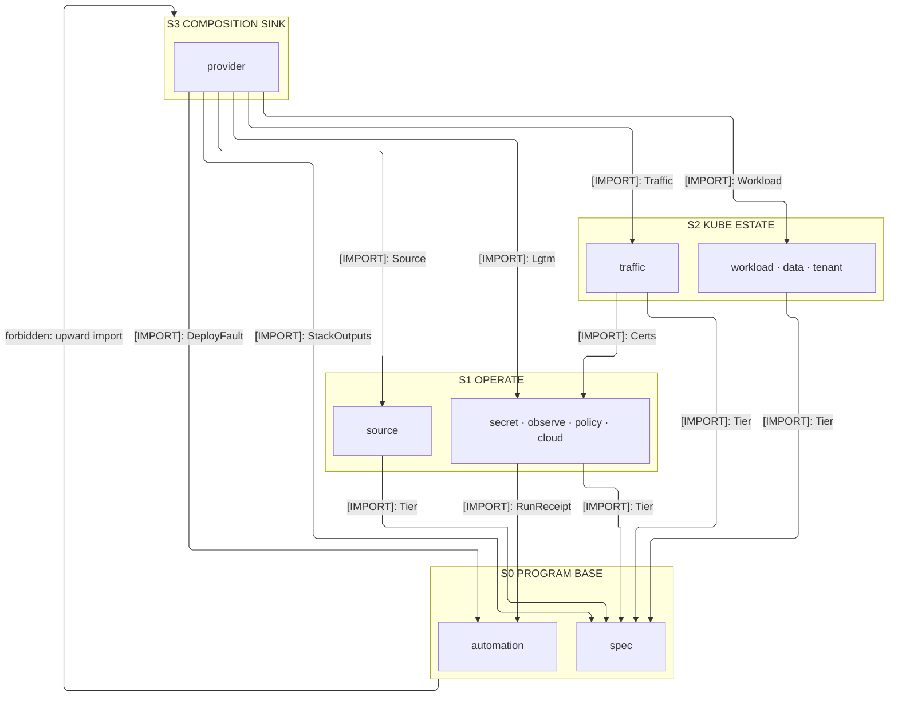
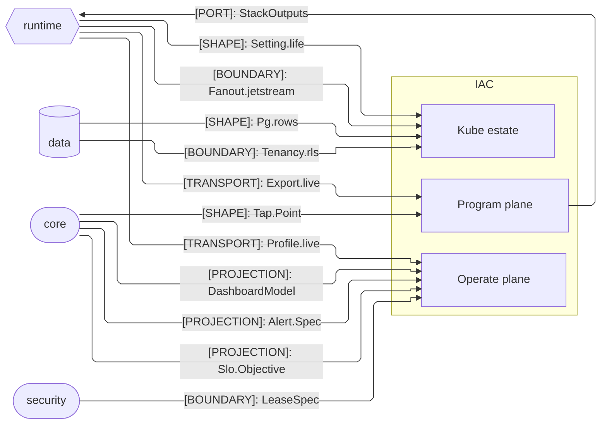

# [TS_IAC_ARCHITECTURE]

`iac` owns the plane-distinct deploy package outside the runtime graph: sub-domains `program`, `operate`, and `kube` meet through one `StackSpec` value, one arm-keyed dispatch, and one Automation-API ledger. Every runtime alignment is a mirrored deploy fact, never an import the runtime carries.

## [01]-[DOMAIN_MAP]

```text codemap
iac/
└── src/
    ├── program/          # Program shapes, arm dispatch, the Automation-API drive, and the bootstrap legs
    │   ├── spec.ts       # StackSpec — the one decoded deploy value an app supplies
    │   ├── provider.ts   # Capability-by-arm map and realizer over the shared k8s and docker estates
    │   ├── automation.ts # Sole executor — the Automation-API driver with resilience and the fleet verbs
    │   └── source.ts     # Source-control shells the Doppler mirror fills, with the distribution leg
    ├── operate/          # Secrets, observability realization, policy, and the hosted control plane
    │   ├── secret.ts     # Doppler hierarchy, mirror fan-out, access RBAC, and the three-lane cert axis
    │   ├── observe.ts    # Store-row metrics family, signal backends, collector ingest, dev estate, board compile
    │   ├── policy.ts     # Guard policies, drift projection, the evidence sink spine, and the in-cluster PKO reconcile loop
    │   └── cloud.ts      # Hosted control-plane twin set, gated on the cloud backend
    └── kube/             # K8s estate tiers realized on either plane
        ├── workload.ts   # One spec row realized as the full typed workload set with its _LIFE anchor
        ├── traffic.ts    # Gateway API edge with external-dns automation and the tunnel/WAF/vanity rows
        ├── data.ts       # Typed CNPG data plane — object store, NATS, backups, pooler, replication
        └── tenant.ts     # Isolation modes and the cross-stack platform seam
```

## [02]-[STRATA]

- S0 `program/spec` + `program/automation` — co-base pair composing mutually: spec reads `DeployFault`, automation reads `StackSpec`.
- S1 `operate` + `program/source` — each composes the base alone: `policy` alone drives `Automation` receipts, none imports an operate sibling.
- S2 `kube` — estate tiers over `Tier` rows; `traffic` alone adds a type-only `Certs` read on `operate/secret`, its issue verb injected.
- S3 `program/provider` — the `_estate` composition sink pulling every tier through the capability-by-arm map; nothing imports it.



## [03]-[SEAMS]



## [04]-[INTERNAL]

One `StackSpec` decodes into an arm, and the arm realizer proves every spec coordinate on the `DeployFault` rail before minting a `PulumiFn` — a rejected coordinate never reaches a provider. `provider` holds the single `_estate` composition the metal bootstrap and the EKS escalation both feed, beside the docker machine estate at container depth. `automation` is the sole executor and internalizes resilience, retry, and per-run budgets. Per-file wiring — tier rows, mirror fan-out, the reconcile loop — lives on the owning pages.

## [05]-[BOUNDARIES]

- Nothing imports this package at runtime; values cross back only as typed stack outputs read from env at boot.
- iac applies DDL and extensions; data verifies at startup, runtime never mutates schema, so divergence fails closed, never a pulumi read-back.
- Object-engine admission requires conditional-create semantics; `minio | ceph` are the conforming rows.
- Static distribution publishes caller-owned artifact rows at `assets/<digest>/<file>` on the `served` plane and carries no UI codec semantics.
- Queue durability is the SKIP-LOCKED outbox with the runtime relay owned by the data and runtime planes.
