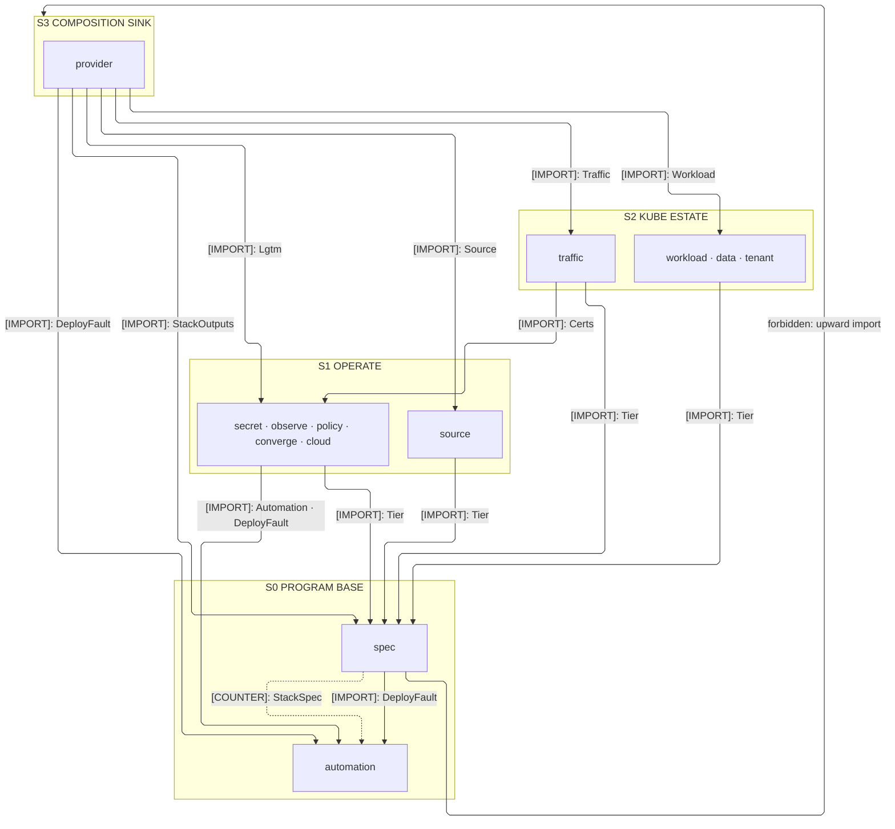
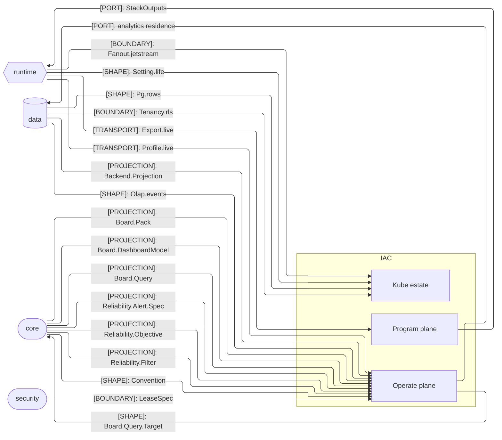
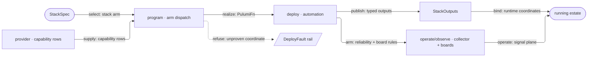

# [TS_IAC_ARCHITECTURE]

`iac` owns the plane-distinct deploy package outside the runtime graph: sub-domains `program`, `operate`, and `kube` meet through one `StackSpec` value, one arm-keyed dispatch, one backend projection, and Pulumi's native lifecycle results. Every runtime alignment is a mirrored deploy fact, never an import the runtime carries.

## [01]-[DOMAIN_MAP]

```text
iac/
└── src/
    ├── program/          # Program shapes, arm dispatch, the Automation-API drive, and the bootstrap legs
    │   ├── spec.ts       # StackSpec, the Tier base with its privilege anchor, and both env-key catalogs
    │   ├── provider.ts   # _ARMS capability record, its _map adjacency constraint, and the docker machine estate at container depth
    │   ├── automation.ts # Sole executor — the Automation-API driver with resilience and the fleet verbs
    │   └── source.ts     # _FOLDERS and _DECODERS rows with the _TYPE_REPAIR seam over the digest-addressed assets root
    ├── operate/          # Secrets, observability, policy, backend convergence, and hosted control plane
    │   ├── secret.ts     # Doppler hierarchy, mirror fan-out, access RBAC, and the three-lane cert axis
    │   ├── observe.ts    # _SOURCES and residence row families, the _PACKS ingest arm, and the realized-backend projection seam
    │   ├── policy.ts     # Native PreviewResult drift sweep and the guard-pack row set asserting estate-authored resources
    │   ├── converge.ts   # Backend proof fold and the atomic active-generation pointer write
    │   └── cloud.ts      # EscApi rail, the twin resource set, and the one-clock seating constraint
    └── kube/             # K8s estate Tier classes realized on either plane
        ├── workload.ts   # _LIFE lifecycle anchor and the typed workload cell set every role row constructs
        ├── traffic.ts    # Edge tagged family and the closed _EDGES vocabulary the gateway realizes
        ├── data.ts       # CNPG admit rail with backup, pooler, and replication rows over the typed cluster set
        └── tenant.ts     # Isolation modes and the cross-stack platform seam
```

## [02]-[STRATA]

- S0 co-base — `spec` imports the fault family; `StackSpec` reaches `automation` as a caller value under a type-only import, so no cycle forms.
- S1 merge — `secret`, `observe`, `policy`, `converge`, and `cloud` share one rank with no lateral import; `source` seats on its `Tier` read alone.
- S2 split — `traffic` draws apart from the kube node because it alone reads the operate plane; the merged trio imports `Tier` and nothing else.
- S3 `program/provider` — the `_estate` composition sink pulling every `Tier` through the capability-by-arm map; nothing imports it.


```mermaid
---
config:
  layout: elk
  flowchart:
    curve: linear
    padding: 25
---
flowchart TB
    accTitle: Iac interior import strata
    accDescr: How the provider sink, kube estate, and operate plane rank onto the spec-automation co-base, the StackSpec counter-edge a caller value.
    subgraph S3["S3 COMPOSITION SINK"]
        Provider[provider]
    end
    subgraph S2["S2 KUBE ESTATE"]
        Kube["workload · data · tenant"]
        Traffic[traffic]
    end
    subgraph S1["S1 OPERATE"]
        Operate["secret · observe · policy · converge · cloud"]
        Source[source]
    end
    subgraph S0["S0 PROGRAM BASE"]
        Spec[spec]
        Automation[automation]
    end
    Spec e1@-->|"[IMPORT]: DeployFault"| Automation
    Spec e2@-.->|"[COUNTER]: StackSpec"| Automation
    Operate e3@-->|"[IMPORT]: Tier"| Spec
    Operate e4@-->|"[IMPORT]: Automation · DeployFault"| Automation
    Source e5@-->|"[IMPORT]: Tier"| Spec
    Kube e6@-->|"[IMPORT]: Tier"| Spec
    Traffic e7@-->|"[IMPORT]: Tier"| Spec
    Traffic e8@-->|"[IMPORT]: Certs"| Operate
    Provider e9@-->|"[IMPORT]: StackOutputs"| Spec
    Provider e10@-->|"[IMPORT]: DeployFault"| Automation
    Provider e11@-->|"[IMPORT]: Workload"| Kube
    Provider e12@-->|"[IMPORT]: Traffic"| Traffic
    Provider e13@-->|"[IMPORT]: Lgtm"| Operate
    Provider e14@-->|"[IMPORT]: Source"| Source
    Spec f1@-->|"forbidden: upward import"| S3
```

## [03]-[SEAMS]


```mermaid
---
config:
  layout: elk
  flowchart:
    curve: linear
    padding: 25
---
flowchart LR
    accTitle: IaC package seam registry
    accDescr: IaC owners exchanging stack outputs, data-plane shapes, board packs, and lease custody with runtime, data, core, and security.
    subgraph iac[IAC]
        Program[Program plane]
        Operate[Operate plane]
        Kube[Kube estate]
    end
    Runtime{{runtime}}
    Data[(data)]
    Core([core])
    Security([security])
    Program e1@-->|"[PORT]: StackOutputs"| Runtime
    Data e2@-->|"[SHAPE]: Pg.rows"| Kube
    Data e3@-->|"[BOUNDARY]: Tenancy.rls"| Kube
    Data e4@-->|"[PROJECTION]: Backend.Projection"| Operate
    Data e18@-->|"[SHAPE]: Olap.events"| Operate
    Core e19@-->|"[PROJECTION]: Board.Pack"| Operate
    Runtime e5@-->|"[BOUNDARY]: Fanout.jetstream"| Kube
    Runtime e6@-->|"[SHAPE]: Setting.life"| Kube
    Runtime e7@-->|"[TRANSPORT]: Export.live"| Program
    Runtime e8@-->|"[TRANSPORT]: Profile.live"| Operate
    Core e9@-->|"[PROJECTION]: Board.DashboardModel"| Operate
    Core e10@-->|"[PROJECTION]: Board.Query"| Operate
    Core e11@-->|"[PROJECTION]: Reliability.Alert.Spec"| Operate
    Core e12@-->|"[PROJECTION]: Reliability.Objective"| Operate
    Core e13@-->|"[PROJECTION]: Reliability.Filter"| Operate
    Core e14@-->|"[SHAPE]: Convention"| Operate
    Security e15@-->|"[BOUNDARY]: LeaseSpec"| Operate
    Operate e16@-->|"[PORT]: analytics residence"| Data
    Operate e17@-->|"[SHAPE]: Board.Query.Target"| Core
```

## [04]-[INTERNAL]


```mermaid
---
config:
  layout: elk
  flowchart:
    curve: linear
    padding: 25
---
flowchart LR
    accTitle: IaC realization spine
    accDescr: Stack specs and provider rows drive program dispatch, deployment, typed outputs, and estate observation.
    Spec([StackSpec])
    Providers[provider · capability rows]
    Program[program · arm dispatch]
    Deploy[deploy · automation]
    Outputs[StackOutputs]
    Observe[operate/observe · collector + boards]
    Estate([running estate])
    Fault[/DeployFault rail/]
    Spec e1@-->|"select: stack arm"| Program
    Providers e2@-->|"supply: capability rows"| Program
    Program f1@-.->|"refuse: unproven coordinate"| Fault
    Program e3@-->|"realize: PulumiFn"| Deploy
    Deploy e4@-->|"publish: typed outputs"| Outputs
    Deploy e5@-->|"arm: reliability + board rules"| Observe
    Outputs e6@-->|"bind: runtime coordinates"| Estate
    Observe e7@-->|"operate: signal plane"| Estate
```

One `StackSpec` decodes into an arm, and the arm realizer proves every spec coordinate on the `DeployFault` rail before minting a `PulumiFn`, so a rejected coordinate never reaches a provider. `provider` holds the single `_estate` composition the metal bootstrap and the EKS escalation both feed, beside the docker machine estate at container depth.

Growth is one row on the owning surface (a cloud, capability, credential, tenancy `Tier`, or injected env fact), so promoting a metal cluster to a managed estate is one provider seam swap and finalizing a cloud is a spec value, never a lib edit. Automation returns Pulumi lifecycle results directly, and drift reads `PreviewResult.changeSummary`.

## [05]-[BOUNDARIES]

- Typed stack outputs read from env at boot are the one value crossing back; the runtime graph imports nothing from this package.
- Coordinates publish and material never does: the output gate refuses any secret-flagged value.
- One secret source of truth reaches external stores only as mirrors.
- IaC builds unpublished generations and re-runs convergence on deployment gates; data admits the published generation read-only.
- Telemetry residences provision here and read nowhere: the deploy plane plants the schema and publishes the door on the `analytics` output plane.
- Data planes bind the published door as an ordinary query end.
- Convergence treats recovery as clean-target materialization and returns it through the normal publication path.
- Every declared pod stamps `Tier`'s privilege anchor; the guard pack asserts it only on estate-authored resources.
- Every backend-armed workload takes the proved contract and active-generation pointer before scheduling, each platform row projecting it per row.
- Object-engine admission requires conditional-create semantics; `minio | ceph` are the conforming rows.
- Static distribution publishes caller-owned artifact rows on the `served` plane and carries no UI codec semantics.
