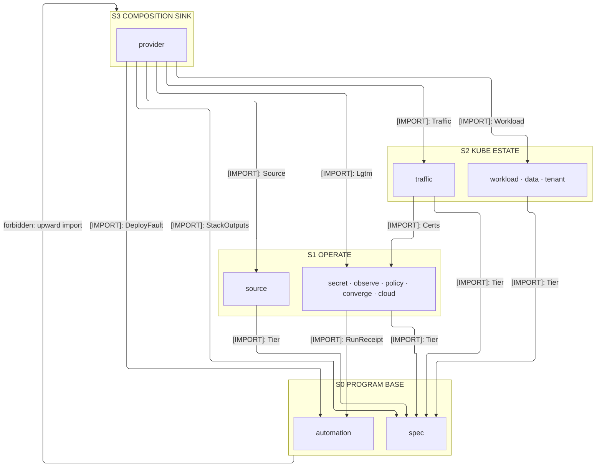
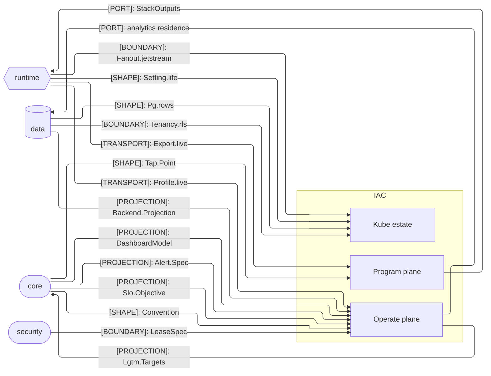

# [TS_IAC_ARCHITECTURE]

`iac` owns the plane-distinct deploy package outside the runtime graph: sub-domains `program`, `operate`, and `kube` meet through one `StackSpec` value, one arm-keyed dispatch, one backend projection, and one Automation-API ledger. Every runtime alignment is a mirrored deploy fact, never an import the runtime carries.

## [01]-[DOMAIN_MAP]

```text codemap
iac/
└── src/
    ├── program/          # Program shapes, arm dispatch, the Automation-API drive, and the bootstrap legs
    │   ├── spec.ts       # StackSpec — the one decoded deploy value an app supplies
    │   ├── provider.ts   # Capability-by-arm map and realizer over the shared k8s and docker estates
    │   ├── automation.ts # Sole executor — the Automation-API driver with resilience and the fleet verbs
    │   └── source.ts     # Source-control shells the Doppler mirror fills, with the distribution leg
    ├── operate/          # Secrets, observability, policy, backend convergence, and hosted control plane
    │   ├── secret.ts     # Doppler hierarchy, mirror fan-out, access RBAC, and the three-lane cert axis
    │   ├── observe.ts    # Store-row and residence families, collector ingest, dev estate, board compile
    │   ├── policy.ts     # Guard policies, drift projection, the evidence sink spine, in-cluster PKO reconcile
    │   ├── converge.ts   # Immutable generation construction, hydration, proof, cutover, and retention
    │   └── cloud.ts      # Hosted control-plane twin set, gated on the cloud backend
    └── kube/             # K8s estate tiers realized on either plane
    │   ├── workload.ts   # Service and worker roles from one spec row, typed workload set, `_LIFE` anchor
    │   ├── traffic.ts    # Gateway API edge with external-dns automation and the tunnel/WAF/vanity rows
    │   ├── data.ts       # Typed CNPG data plane — object store, NATS, backups, pooler, replication
    │   └── tenant.ts     # Isolation modes and the cross-stack platform seam
```

## [02]-[STRATA]

- S0 `program/spec` + `program/automation` — co-base pair composing mutually: spec reads `DeployFault`, automation reads `StackSpec`.
- S1 `operate` + `program/source` — convergence consumes backend projections and produces retained evidence.
- S2 `kube` — workload roles, data targets, traffic, and tenancy over `Tier` rows.
- S3 `program/provider` — the `_estate` composition sink pulling every tier through the capability-by-arm map; nothing imports it.


```mermaid
---
config:
  layout: elk
  flowchart:
    curve: linear
    padding: 25
---
flowchart TB
    accTitle: Iac interior import strata
    accDescr: Four strata — the provider sink over the kube estate over the operate plane onto the spec-automation co-base; imports point downward.
    subgraph S3["S3 COMPOSITION SINK"]
        Provider[provider]
    end
    subgraph S2["S2 KUBE ESTATE"]
        Kube["workload · data · tenant"]
        Traffic[traffic]
    end
    subgraph S1["S1 OPERATE"]
        Operate["secret · observe · policy · converge · cloud"]
        Source[source]
    end
    subgraph S0["S0 PROGRAM BASE"]
        Spec[spec]
        Automation[automation]
    end
    Operate e1@-->|"[IMPORT]: Tier"| Spec
    Operate e2@-->|"[IMPORT]: RunReceipt"| Automation
    Source e3@-->|"[IMPORT]: Tier"| Spec
    Kube e4@-->|"[IMPORT]: Tier"| Spec
    Traffic e5@-->|"[IMPORT]: Tier"| Spec
    Traffic e6@-->|"[IMPORT]: Certs"| Operate
    Provider e7@-->|"[IMPORT]: StackOutputs"| Spec
    Provider e8@-->|"[IMPORT]: DeployFault"| Automation
    Provider e9@-->|"[IMPORT]: Workload"| Kube
    Provider e10@-->|"[IMPORT]: Traffic"| Traffic
    Provider e11@-->|"[IMPORT]: Lgtm"| Operate
    Provider e12@-->|"[IMPORT]: Source"| Source
    S0 f1@-->|"forbidden: upward import"| S3
```

## [03]-[SEAMS]


```mermaid
---
config:
  layout: elk
  flowchart:
    curve: linear
    padding: 25
---
flowchart LR
    accTitle: IaC package seam registry
    accDescr: IaC owners exchanging stack outputs, data-plane shapes, board packs, and lease custody with runtime, data, core, and security.
    subgraph iac[IAC]
        Program[Program plane]
        Operate[Operate plane]
        Kube[Kube estate]
    end
    Runtime{{runtime}}
    Data[(data)]
    Core([core])
    Security([security])
    Program e1@-->|"[PORT]: StackOutputs"| Runtime
    Data e2@-->|"[SHAPE]: Pg.rows"| Kube
    Data e3@-->|"[BOUNDARY]: Tenancy.rls"| Kube
    Data e14@-->|"[PROJECTION]: Backend.Projection"| Operate
    Runtime e4@-->|"[BOUNDARY]: Fanout.jetstream"| Kube
    Runtime e5@-->|"[SHAPE]: Setting.life"| Kube
    Core e7@-->|"[PROJECTION]: DashboardModel"| Operate
    Core e8@-->|"[PROJECTION]: Alert.Spec"| Operate
    Core e9@-->|"[PROJECTION]: Slo.Objective"| Operate
    Core e15@-->|"[SHAPE]: Convention"| Operate
    Operate e16@-->|"[PORT]: analytics residence"| Data
    Operate e17@-->|"[PROJECTION]: Lgtm.Targets"| Core
    Runtime e10@-->|"[TRANSPORT]: Export.live"| Program
    Runtime e11@-->|"[TRANSPORT]: Profile.live"| Operate
    Core e12@-->|"[SHAPE]: Tap.Point"| Program
    Security e13@-->|"[BOUNDARY]: LeaseSpec"| Operate
```

## [04]-[INTERNAL]

One `StackSpec` decodes into an arm, and the arm realizer proves every spec coordinate on the `DeployFault` rail before minting a `PulumiFn` — a rejected coordinate never reaches a provider. `provider` holds the single `_estate` composition the metal bootstrap and the EKS escalation both feed, beside the docker machine estate at container depth. `automation` is the sole executor and internalizes resilience, retry, and per-run budgets.

Growth is one row on the owning surface — a cloud, capability, credential, tenancy tier, or injected env fact — so promoting a metal cluster to a managed estate is one provider seam swap and finalizing a cloud is a spec value, never a lib edit. Deploy and drift evidence share one receipt vocabulary, so drift stays pure projection and cannot fork. Per-file wiring — tier rows, mirror fan-out, the reconcile loop — lives on the owning pages.

## [05]-[BOUNDARIES]

- Nothing imports this package at runtime; values cross back only as typed stack outputs read from env at boot.
- Coordinates publish and material never does: the output gate refuses any secret-flagged value, and the one secret source of truth reaches external stores only as mirrors.
- IaC builds unpublished generations and re-runs convergence on deployment fences; data admits the published generation read-only.
- Telemetry residences provision here and read nowhere: the deploy plane plants the schema and publishes the door on the `analytics` output plane, and the data planes bind that door as an ordinary query end.
- Convergence treats recovery as clean-target materialization and returns it through the normal publication path.
- Every workload role mounts the proved contract and active-generation pointer before scheduling.
- Object-engine admission requires conditional-create semantics; `minio | ceph` are the conforming rows.
- Static distribution publishes caller-owned artifact rows — every leaf of a row under one lowercase `assets/<digest>/` directory beside the one served-header roster every arm reads — on the `served` plane and carries no UI codec semantics; a served address IS the object key, so every declared leaf proves present under the built directory before the dialect converges.
- Queue durability is the SKIP-LOCKED outbox with the runtime relay owned by the data and runtime planes.
