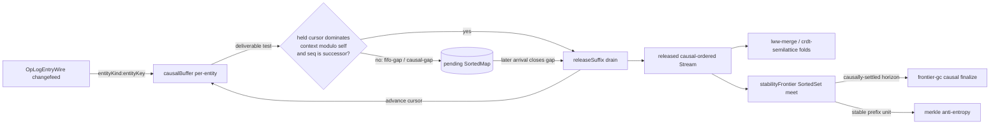

# [PROJECTION_BUFFER]

The delivery discipline the per-op verdict alone cannot enforce — `vector#VERSION_VECTOR` tags each arrival `Before`/`After`/`Concurrent`/`ConcurrentUncertain` but applies it the instant it lands, so an op that overtakes its own cause on the wire paints a state no peer ever held; `CausalBuffer` is the per-entity pending queue that holds an `OpLogEntryWire` until the held `OriginCursor` dominates the op's context version vector *modulo the op's own origin slot*, then releases the dependency-satisfied suffix in causal order so the downstream `convergence/merge#LWW_MERGE` and `vector#CRDT_SEMILATTICE` folds only ever see a gap-free causal prefix. `DeliveryVerdict` is the closed two-case `Held`/`Released` family the admission test dispatches under a total `Match`, and `causalDelivery` is the composition root that forks the per-entity buffer store and the `frontier#STABILITY_FRONTIER` cursor meet into one `Scope`, emitting the released, causally-ordered changefeed every read-model fold downstream subscribes to. The discipline is one algebra over the version-vector `dominates` predicate and the `originFold` cursor already owned at `vector#ORIGIN_CURSOR` — never a second ordering surface, never a re-minted clock, never a re-decided write. The deliverability test is the classic causal-broadcast condition: every causal dependency carried in the op's `context` is at-or-below the held cursor and the op's own origin sequence is exactly the cursor's next, so two peers folding the same op multiset in any wire order release the identical causal sequence.

## [1]-[INDEX]

- [1]-[CAUSAL_BUFFER]: Owns `DeliveryVerdict`, `BufferCell`, `contextOf`, `deliverable`, `releaseSuffix`, `bufferMerge`, and the `causalBuffer` per-entity pending-queue fold.
- [2]-[CAUSAL_DELIVERY]: Owns `causalDelivery`, the composition root forking the `causalBuffer` store and the `frontier#STABILITY_FRONTIER` cursor meet into one `Scope` and emitting the released causal-ordered changefeed `Stream`.

## [2]-[CAUSAL_BUFFER]

- Owner: `DeliveryVerdict`, the closed two-case `Data.TaggedEnum` (`Held`/`Released`) the admission test resolves per arrival; `BufferCell`, the per-entity held-cursor plus the pending-op `SortedMap` keyed by the op's `(origin, sequence)` causal position; `contextOf`, the selector projecting each op's causal-dependency vector (the `write`-op `context`, or the reconstructed-cursor `VersionVectorWire` for a context-free op) into the `VersionVectorWire` `dominates` reads; `deliverable`, the causal-broadcast admission predicate testing that the held cursor dominates the op's context modulo the op's own origin slot and that the op's origin sequence is the cursor's exact successor; `releaseSuffix`, the fixpoint drain that repeatedly admits every now-deliverable pending op in causal order, advancing the cursor by each release; `bufferMerge`, the slot step that inserts each arrival into the pending `SortedMap`, runs `releaseSuffix`, and records the released suffix beside the residual held queue; and `causalBuffer`, the `combinators#KEYED_FOLD` fold tracking one `BufferCell` per `entityKind:entityKey` and emitting the released ops as a flattened causal-ordered `Stream`.
- Cases: `deliverable` is the two-part causal-broadcast test — the per-origin FIFO part requires the op's own `sequence` to be exactly one past the held cursor's slot for that origin (a gap on the origin's own axis means an earlier op from the same origin has not arrived, so the op holds), and the cross-origin causal part requires `dominates(heldCursor, contextMinusSelf)` where `contextMinusSelf` is the op's context with its own origin slot erased (every *other* origin the op causally depends on is already delivered). An op satisfying both is `Released` and its origin slot advances; an op failing either is `Held` in the pending `SortedMap` until a later release closes the gap. `releaseSuffix` is the fixpoint over the pending map: it scans for the lowest pending op whose `deliverable` now holds against the advanced cursor, admits it, advances the cursor by its slot, and repeats until no pending op is deliverable — so one arrival that closes a gap cascades the entire dependency-satisfied suffix in a single fold step, and the residual map holds only ops still waiting on an unarrived cause. The pending `SortedMap` is keyed by the `(origin, sequence)` causal position under the composed `Order` so the drain visits candidates in deterministic causal order and two peers folding divergent delivery orders release the byte-identical sequence — the delivery-order independence the `convergence/law#CONVERGENCE_LAW` harness extends over the buffered path. A duplicate op (one whose origin slot is at-or-below the held cursor) is the already-delivered form: `deliverable` rejects it as non-successor and `bufferMerge` drops it rather than re-releasing, so reconnect-replay through `policy#STREAM_POLICY` re-folds idempotently.
- Entry: `causalBuffer(changefeed, contextOf, policy)` folds the decoded `OpLogEntryWire` changefeed into one `SubscriptionRef<HashMap<string, BufferCell>>` through `keyedFold` and exposes the released causal-ordered ops as the flattened `Stream<OpLogEntryWire>` the downstream convergence folds subscribe to; `deliverable(cursor, entry, contextOf)` is the standalone admission predicate the buffer and the diagnostic surface both read.
- Packages: `effect` for `Data.TaggedEnum`, `Match`, `HashMap`, `SortedMap`, `Option`, `Order`, `Stream`, `SubscriptionRef`, `Effect`, and `Scope`; the `dominates` predicate, the `VersionVectorWire`/`OriginCursor` shapes, and the `originFold` cursor advance arrive owned from `vector#ORIGIN_CURSOR` — the buffer composes them and mints no parallel ordering surface (charter law).
- Growth: a new delivery outcome lands as one `DeliveryVerdict` variant breaking the `bufferMerge` `Match.tagsExhaustive` dispatch at compile time, never a parallel held/released boolean pair; a Merkle range-reconciliation handshake reads the same released `BufferCell` cursor as the stable-prefix unit through `dominates`, never a second cursor projection; the per-origin FIFO and cross-origin causal parts stay one `deliverable` predicate even as the context vector widens, the new slot folding into the same `dominates` test.
- Boundary: the buffer re-validates nothing an earlier decode admitted — `contextOf` reads the decode-admitted `write`-op `context` slot array or the reconstructed `OriginCursor` vector verbatim, and the op's `(origin, sequence)` causal position is the decode-surfaced `OpLogEntryWire.origin`/`sequence` pair, never a re-minted identity; the buffer decides only *when* to release, never *what* the op means — the released op folds through `merge#LWW_MERGE` and `vector#CRDT_SEMILATTICE` unchanged, so the buffer owns causal order and the convergence folds own convergent state, two disjoint concerns over one changefeed; the pending `SortedMap` is the persistent structure so a release shares structure with the residual queue under advance, never a `new Map().set` rebuild that breaks referential transparency on reconnect-replay; the held cursor is the same `OriginCursor` the `frontier#STABILITY_FRONTIER` meet reads, one cursor owner serving both the per-entity release and the cross-entity horizon; the domain dials no transport.

```ts contract
import { Data, Effect, HashMap, Match, Option, Order, Scope, SortedMap, Stream, SubscriptionRef } from "effect";
import type { OpLogEntryWire, VersionVectorWire } from "@rasm/interchange";
import { keyedFold } from "../fold/combinators";
import type { StreamPolicy } from "../fold/policy";
import { originFold, type OriginCursor, emptyOriginCursor } from "../causality/vector";

// --- [TYPES] -------------------------------------------------------------------------------

type DeliveryVerdict = Data.TaggedEnum<{
  readonly Held: { readonly reason: "fifo-gap" | "causal-gap" | "duplicate" };
  readonly Released: { readonly entry: OpLogEntryWire };
}>;
const DeliveryVerdict = Data.taggedEnum<DeliveryVerdict>();

// --- [MODELS] ------------------------------------------------------------------------------

const causalKey = (entry: OpLogEntryWire): string => `${entry.entityKind}:${entry.entityKey}`;

const positionKey = (origin: string, sequence: bigint): string => `${origin}${sequence.toString().padStart(20, "0")}`;

const positionOrder: Order.Order<string> = Order.string;

interface BufferCell {
  readonly cursor: OriginCursor;
  readonly pending: SortedMap.SortedMap<string, OpLogEntryWire>;
  readonly released: ReadonlyArray<OpLogEntryWire>;
}

const emptyBufferCell: BufferCell = {
  cursor: emptyOriginCursor,
  pending: SortedMap.empty<string, OpLogEntryWire>(positionOrder),
  released: [],
};

// --- [OPERATIONS] --------------------------------------------------------------------------

const contextMinusSelf = (context: VersionVectorWire, origin: string): VersionVectorWire => ({
  slots: Object.fromEntries(Object.entries(context.slots).filter(([k]) => k !== origin)),
});

const heldSlot = (cursor: OriginCursor, origin: string): bigint =>
  Option.getOrElse(HashMap.get(cursor.slots, origin), () => 0n);

const dominatesCursor = (cursor: OriginCursor, deps: VersionVectorWire): boolean =>
  Object.entries(deps.slots).every(([origin, seq]) => heldSlot(cursor, origin) >= seq);

const deliverable = (
  cursor: OriginCursor,
  entry: OpLogEntryWire,
  contextOf: (entry: OpLogEntryWire) => VersionVectorWire,
): DeliveryVerdict => {
  const held = heldSlot(cursor, entry.origin);
  if (entry.sequence <= held) return DeliveryVerdict.Held({ reason: "duplicate" });
  if (entry.sequence !== held + 1n) return DeliveryVerdict.Held({ reason: "fifo-gap" });
  return dominatesCursor(cursor, contextMinusSelf(contextOf(entry), entry.origin))
    ? DeliveryVerdict.Released({ entry })
    : DeliveryVerdict.Held({ reason: "causal-gap" });
};

const releaseSuffix = (
  cell: BufferCell,
  contextOf: (entry: OpLogEntryWire) => VersionVectorWire,
): BufferCell => {
  const drain = (cursor: OriginCursor, pending: SortedMap.SortedMap<string, OpLogEntryWire>, out: ReadonlyArray<OpLogEntryWire>): BufferCell => {
    const next = Option.flatMap(
      Option.fromNullable(Array.from(SortedMap.entries(pending)).find(([, entry]) =>
        DeliveryVerdict.$is("Released")(deliverable(cursor, entry, contextOf)))),
      ([key, entry]) => Option.some({ key, entry } as const),
    );
    return Option.match(next, {
      onNone: () => ({ cursor, pending, released: out }),
      onSome: ({ key, entry }) =>
        Match.value(deliverable(cursor, entry, contextOf)).pipe(
          Match.tagsExhaustive({
            Released: () => drain(originFold(cursor, entry), SortedMap.remove(pending, key), [...out, entry]),
            Held: ({ reason }) => reason === "duplicate"
              ? drain(cursor, SortedMap.remove(pending, key), out)
              : ({ cursor, pending, released: out }),
          }),
        ),
    });
  };
  return drain(cell.cursor, cell.pending, cell.released);
};

const bufferMerge =
  (contextOf: (entry: OpLogEntryWire) => VersionVectorWire) =>
  (prior: Option.Option<BufferCell>, entry: OpLogEntryWire): BufferCell => {
    const cell = Option.getOrElse(prior, () => emptyBufferCell);
    return Match.value(deliverable(cell.cursor, entry, contextOf)).pipe(
      Match.tagsExhaustive({
        Released: () => releaseSuffix(
          { ...cell, cursor: originFold(cell.cursor, entry), released: [entry] },
          contextOf,
        ),
        Held: ({ reason }) => reason === "duplicate"
          ? { ...cell, released: [] }
          : { ...cell, pending: SortedMap.set(cell.pending, positionKey(entry.origin, entry.sequence), entry), released: [] },
      }),
    );
  };

// --- [COMPOSITION] -------------------------------------------------------------------------

const causalBuffer = (
  changefeed: Stream.Stream<OpLogEntryWire>,
  contextOf: (entry: OpLogEntryWire) => VersionVectorWire,
  policy: StreamPolicy,
): Effect.Effect<SubscriptionRef.SubscriptionRef<HashMap.HashMap<string, BufferCell>>, never, Scope.Scope> =>
  keyedFold(changefeed, causalKey, bufferMerge(contextOf), policy);

const releasedStream = (
  store: SubscriptionRef.SubscriptionRef<HashMap.HashMap<string, BufferCell>>,
): Stream.Stream<OpLogEntryWire> =>
  store.changes.pipe(
    Stream.flatMap((map) => Stream.fromIterable(Array.from(HashMap.values(map)).flatMap((cell) => cell.released))),
  );
```

## [3]-[CAUSAL_DELIVERY]

- Owner: `causalDelivery`, the composition root that forks the `causalBuffer` per-entity pending store and the `frontier#STABILITY_FRONTIER` cursor-meet store into one `Scope` and returns the released causal-ordered changefeed `Stream` plus the live `SubscriptionRef` handles a downstream consumer subscribes to. It is the one entrypoint the `convergence/merge#LWW_MERGE` and `vector#CRDT_SEMILATTICE` folds re-source onto so they fold a gap-free causal prefix rather than the raw arrival order, and the one place the `retention#FRONTIER_GC` causal-finalization input and the `MERKLE_ANTI_ENTROPY` stable-prefix unit both read.
- Cases: `causalDelivery` forks both folds under one `Scope` so the buffer store and the frontier store share lifetime — a scope close tears down both fibers in one step, never a leaked half. The released `Stream` is the `releasedStream` flattening of the buffer store's per-entity `released` suffixes, so a consumer re-sourcing onto it sees exactly the causally-ordered prefix the buffer admitted and never the held tail; the `stabilityFrontier` store advances its `SortedSet`-of-cursors meet off the same released changefeed so the causally-settled horizon is the greatest lower bound below which every entity's cursor is dominated — the input `retention#FRONTIER_GC` reads to finalize causally rather than only by the event-time `query/watermark#WATERMARK`. Both stores fold under the one `policy#STREAM_POLICY` so reconnect, buffer, throttle, and batch land identically across the buffer and the frontier and the make-fork-update scaffold exists once.
- Entry: `causalDelivery(changefeed, contextOf, policy)` returns the `{ released, buffer, frontier }` triple — `released` the causal-ordered `Stream<OpLogEntryWire>` the convergence folds subscribe to, `buffer` the per-entity `BufferCell` store, `frontier` the `StabilityFrontier` store the GC and the reconciliation read.
- Packages: `effect` for `Effect`, `Scope`, `Stream`, `SubscriptionRef`, and `HashMap`; the `stabilityFrontier` constructor arrives owned from `frontier#STABILITY_FRONTIER`, the `causalBuffer` from `[2]-[CAUSAL_BUFFER]`.
- Growth: a new delivery-stage store lands as one additional `Effect.forkScoped` fork inside the same `Scope` and one field on the returned triple, never a second composition root; the released `Stream` stays the one causal-ordered source every downstream fold re-sources onto.
- Boundary: `causalDelivery` forks but never re-folds — the buffer owns the per-entity release order and the frontier owns the cross-entity horizon, two disjoint folds over one changefeed sharing one cursor algebra; the released `Stream` re-sources the convergence folds onto the gap-free prefix without re-deciding any write, so the convergence folds stay the sole owner of convergent state; both stores read the decode-admitted changefeed and re-mint nothing; the domain dials no transport.

```ts contract
import { Effect, HashMap, Scope, Stream, SubscriptionRef } from "effect";
import type { OpLogEntryWire, VersionVectorWire } from "@rasm/interchange";
import type { StreamPolicy } from "../fold/policy";
import { stabilityFrontier, type StabilityFrontier } from "./stability-frontier";
import { causalBuffer, releasedStream, type BufferCell } from "./causal-buffer";

// --- [COMPOSITION] -------------------------------------------------------------------------

interface CausalDelivery {
  readonly released: Stream.Stream<OpLogEntryWire>;
  readonly buffer: SubscriptionRef.SubscriptionRef<HashMap.HashMap<string, BufferCell>>;
  readonly frontier: SubscriptionRef.SubscriptionRef<StabilityFrontier>;
}

const causalDelivery = (
  changefeed: Stream.Stream<OpLogEntryWire>,
  contextOf: (entry: OpLogEntryWire) => VersionVectorWire,
  policy: StreamPolicy,
): Effect.Effect<CausalDelivery, never, Scope.Scope> =>
  Effect.gen(function* () {
    const buffer = yield* causalBuffer(changefeed, contextOf, policy);
    const released = releasedStream(buffer);
    const frontier = yield* stabilityFrontier(released, policy);
    return { released, buffer, frontier };
  });
```


