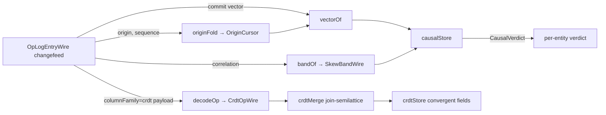

# [PROJECTION_VECTOR]

The concurrency-detection read model the HLC total order structurally erases — `VersionVector` decodes the per-origin `Record<string, bigint>` slot map the C# op-log carries on every commit and `CrdtOpWire.write` op, `vectorOrder` derives the `VectorOrderKind` partial order (`Before`/`After`/`Concurrent`/`Equal`) over two vectors by pointwise slot dominance, and `skewVerdict` fuses the vector verdict with the `skew#SKEW_BAND` interval so two rows the vectors prove concurrent surface as `concurrent-uncertain` rather than forced into a spurious HLC total order. The desktop AppUi cannot produce this read model: the C# stamp keeps O(1) width and deliberately surrenders concurrency detection to the total order, so concurrency is recoverable only from the version-vector slots a browser peer reconstructs off the wire. The vector slots and the `CrdtOpWire` causal metadata cross decode-admitted from `interchange/Codec/codec#TS_PROJECTION` over the C#-owned `csharp:Rasm.Persistence/Sync/collaboration#TS_PROJECTION` op-log entry and the `csharp:Rasm.Persistence/Version/commits#TS_PROJECTION` commit and CRDT op shapes; the fold mints no clock, no origin identity, no slot, and no op arm the wire does not carry.

## [1]-[INDEX]

- [1]-[VERSION_VECTOR]: Owns `VectorOrderKind`, `CausalVerdict`, `vectorOrder`, `vectorJoin`, `dominates`, `skewVerdict`, and the `causalStore` concurrency fold.
- [2]-[ORIGIN_CURSOR]: Owns `OriginCursor`, the `origin`-keyed `highest-sequence` cursor the changefeed projects, and the `vectorOf`/`bandOf` selectors `causalStore` reads.
- [3]-[CRDT_SEMILATTICE]: Owns the `CrdtOpWire` join-semilattice decode arm — `crdtContext` feeding `vectorJoin` off the `write` op and the `add`/`remove` observed-tags feeding the OR-set `tagVerdict` under the `convergence/law#CONVERGENCE_LAW` delivery-order independence.
- [4]-[MERKLE_RECONCILE]: Forward stub for the `dominates`-driven `MerkleRangeWire` range-digest handshake — named on the same vector algebra, its fence body gated on the C# wire decode and the causal stable prefix.

## [2]-[VERSION_VECTOR]

- Owner: `VectorOrderKind`, the four-case `Data.TaggedEnum` causal order mirroring the C# `VectorOrderKind` wire literal (`Before`/`After`/`Concurrent`/`Equal`); `CausalVerdict`, the five-case derived `Data.TaggedEnum` widening the wire order with the skew-fused `ConcurrentUncertain` the read model surfaces; `vectorOrder`, the pointwise partial order over two `VersionVectorWire` slot maps; `vectorJoin`, the slot-wise least-upper-bound that advances a held vector to absorb an incoming one; `dominates`, the one-directional slot-dominance predicate `vectorOrder` and the frontier reconciliation both read; `skewVerdict`, the widening that downgrades a `Concurrent` order to `ConcurrentUncertain` when the bands overlap; and `causalStore`, the `combinators#KEYED_FOLD` fold that tracks the per-entity held vector and band and tags each incoming op with its `CausalVerdict`.
- Cases: `vectorOrder` reads every slot present in either vector and folds the pointwise comparison to one verdict — all-equal slots resolve `Equal`, every slot at-or-above with one strictly above resolves `After`, the mirror resolves `Before`, and a vector with one slot above and another below resolves `Concurrent` (the case the HLC total order erases); a missing slot reads as `0n` so a fresh origin compares as zero. `vectorJoin` takes the per-slot maximum so the joined vector is the least upper bound dominating both inputs, the monotone advance the frontier reconciliation drives. `skewVerdict` widens a `Concurrent` order to `CausalVerdict.ConcurrentUncertain` only when the two `SkewInterval` bands overlap within the summed `radiusMs`, downgrading a strict vector order to honest uncertainty exactly when physical-clock skew makes the HLC tiebreak statistically indistinguishable, and otherwise maps each wire order to its definite `CausalVerdict`.
- Packages: `effect` for `Data.TaggedEnum`, `HashMap`, `Option`, `Stream`, `SubscriptionRef`, `Effect`, and `Scope`.
- Growth: a new wire causal order lands as one `VectorOrderKind` variant breaking the `vectorOrder` fold and the `skewVerdict` dispatch at compile time; a new derived verdict lands as one `CausalVerdict` variant; a Merkle-DAG range-reconciliation handshake lands as one `dominates`-driven `MerkleRangeWire` digest comparison on the same vector algebra, never a parallel ordering surface.
- Boundary: the vector reads decode-admitted `bigint` slots, never re-validated and never re-minted — a slot keyed on an `origin` the wire did not stamp is the deleted form; the `crdt` `write` op's `context` is the same `Record<string, bigint>` version-vector shape `vectorOrder` reads, so the convergence-detection read model is one algebra over both the commit vector and the op causal context; the `merge#LWW_MERGE` scalar fold owns the live cell and this fold owns only the causal verdict beside it, never re-deciding the held write; the band fusion reads `skew#SKEW_BAND` `skewInterval`, never re-deriving the HLC bound; the domain dials no transport.

```ts contract
import { Data, Effect, HashMap, Option, Scope, Stream, SubscriptionRef } from "effect";
import type { OpLogEntryWire, VersionVectorWire } from "@rasm/interchange";
import { keyedFold } from "../fold/combinators";
import type { StreamPolicy } from "../fold/policy";
import { bandsOverlap, skewInterval, type SkewBandWire, type SkewInterval } from "../causality/skew";

type VectorOrderKind = Data.TaggedEnum<{
  readonly Before: {};
  readonly After: {};
  readonly Concurrent: {};
  readonly Equal: {};
}>;
const VectorOrderKind = Data.taggedEnum<VectorOrderKind>();

type CausalVerdict = Data.TaggedEnum<{
  readonly Before: {};
  readonly After: {};
  readonly Concurrent: {};
  readonly Equal: {};
  readonly ConcurrentUncertain: {};
}>;
const CausalVerdict = Data.taggedEnum<CausalVerdict>();

const slotKeys = (a: VersionVectorWire, b: VersionVectorWire): ReadonlyArray<string> =>
  Array.from(new Set([...Object.keys(a.slots), ...Object.keys(b.slots)]));

const dominates = (a: VersionVectorWire, b: VersionVectorWire): boolean =>
  slotKeys(a, b).every((k) => (a.slots[k] ?? 0n) >= (b.slots[k] ?? 0n));

const vectorOrder = (a: VersionVectorWire, b: VersionVectorWire): VectorOrderKind => {
  const ab = dominates(a, b);
  const ba = dominates(b, a);
  return ab && ba ? VectorOrderKind.Equal() : ab ? VectorOrderKind.After() : ba ? VectorOrderKind.Before() : VectorOrderKind.Concurrent();
};

const vectorJoin = (a: VersionVectorWire, b: VersionVectorWire): VersionVectorWire => ({
  slots: Object.fromEntries(slotKeys(a, b).map((k) => [k, (a.slots[k] ?? 0n) > (b.slots[k] ?? 0n) ? a.slots[k] ?? 0n : b.slots[k] ?? 0n])),
});

const skewVerdict = (order: VectorOrderKind, held: SkewInterval, incoming: SkewInterval): CausalVerdict =>
  VectorOrderKind.$match(order, {
    Concurrent: () => (bandsOverlap(held, incoming) ? CausalVerdict.ConcurrentUncertain() : CausalVerdict.Concurrent()),
    Before: () => CausalVerdict.Before(),
    After: () => CausalVerdict.After(),
    Equal: () => CausalVerdict.Equal(),
  });

interface CausalCell {
  readonly vector: VersionVectorWire;
  readonly band: SkewInterval;
  readonly verdict: CausalVerdict;
}

const causalKey = (entry: OpLogEntryWire): string => `${entry.entityKind}:${entry.entityKey}`;

const causalMerge =
  (vectorOf: (entry: OpLogEntryWire) => VersionVectorWire, bandOf: (entry: OpLogEntryWire) => SkewBandWire) =>
  (prior: Option.Option<CausalCell>, entry: OpLogEntryWire): CausalCell => {
    const incoming = vectorOf(entry);
    const band = skewInterval(bandOf(entry));
    return Option.match(prior, {
      onNone: () => ({ vector: incoming, band, verdict: CausalVerdict.Equal() }),
      onSome: (cell) => ({
        vector: vectorJoin(cell.vector, incoming),
        band,
        verdict: skewVerdict(vectorOrder(incoming, cell.vector), cell.band, band),
      }),
    });
  };

const causalStore = (
  changefeed: Stream.Stream<OpLogEntryWire>,
  vectorOf: (entry: OpLogEntryWire) => VersionVectorWire,
  bandOf: (entry: OpLogEntryWire) => SkewBandWire,
  policy: StreamPolicy,
): Effect.Effect<SubscriptionRef.SubscriptionRef<HashMap.HashMap<string, CausalCell>>, never, Scope.Scope> =>
  keyedFold(changefeed, causalKey, causalMerge(vectorOf, bandOf), policy);
```

## [3]-[ORIGIN_CURSOR]

- Owner: `OriginCursor`, the `origin`-keyed `highest-sequence` cursor a browser peer reconstructs off the decoded changefeed; `vectorOf`, the held-vector selector projecting the per-entity cursor into the `VersionVectorWire` `vectorOrder` reads; `bandOf`, the skew-band selector reading the `evidence/correlation#EVIDENCE_CORRELATION` correlation cell; `originFold`, the `combinators#KEYED_FOLD` cursor advance that takes the per-origin maximum sequence so a reordered or replayed op never rewinds the cursor.
- Cases: the C# HLC stamp keeps O(1) width and erases concurrency into the total order, so the version vector has no first-class wire field on the scalar op-log row — the browser peer reconstructs it from the `OpLogEntryWire.origin` (`OriginStoreId` guid-string) and `OpLogEntryWire.sequence` the decode-rail now surfaces, folding each entry into the `origin → highest sequence` cursor and projecting that cursor into the slot map. `originFold` advances the cursor by the per-origin maximum sequence so two peers folding the same op-set in divergent delivery order reconstruct the identical cursor, and `vectorOf` reads that cursor as the held `VersionVectorWire`; a commit op carries the authoritative `CommitNodeWire.vector` the decode-rail surfaces and `vectorOf` reads that vector directly rather than the reconstructed cursor, so a commit anchors the per-entity vector to the producer-stamped slot map.
- Packages: `effect` for `HashMap` and `Option`.
- Growth: a new origin axis lands as one cursor slot on `OriginCursor`; a Merkle-range reconciliation reads the same cursor through `dominates`, never a second cursor projection.
- Boundary: the cursor authors no slot the wire does not stamp — every slot keys on a decode-admitted `OpLogEntryWire.origin`, and a commit op reads the producer-stamped `CommitNodeWire.vector` verbatim rather than re-deriving it; the cursor is the per-entity held vector `causalStore` reads through `vectorOf` and the reconciliation reads through `dominates`, one cursor owner serving both; the band selector reads the correlation cell's earliest/latest pair, never re-deriving the HLC bound; the domain dials no transport.

```ts contract
import { HashMap, Option } from "effect";
import type { CommitNodeWire, OpLogEntryWire, VersionVectorWire } from "@rasm/interchange";
import type { SkewBandWire } from "../causality/skew";

interface OriginCursor {
  readonly slots: HashMap.HashMap<string, bigint>;
}

const emptyOriginCursor: OriginCursor = { slots: HashMap.empty() };

const originFold = (cursor: OriginCursor, entry: OpLogEntryWire): OriginCursor => ({
  slots: HashMap.modifyAt(cursor.slots, entry.origin, (held) =>
    Option.some(Option.match(held, { onNone: () => entry.sequence, onSome: (s) => (entry.sequence > s ? entry.sequence : s) }))),
});

const cursorVector = (cursor: OriginCursor): VersionVectorWire => ({
  slots: Object.fromEntries(HashMap.toEntries(cursor.slots)),
});

const vectorOf =
  (commitOf: (entry: OpLogEntryWire) => Option.Option<CommitNodeWire>, cursorOf: (entry: OpLogEntryWire) => OriginCursor) =>
  (entry: OpLogEntryWire): VersionVectorWire =>
    Option.match(commitOf(entry), {
      onNone: () => cursorVector(cursorOf(entry)),
      onSome: (commit) => commit.vector,
    });

const bandOf =
  (correlationOf: (entry: OpLogEntryWire) => SkewBandWire) =>
  (entry: OpLogEntryWire): SkewBandWire =>
    correlationOf(entry);
```

## [4]-[CRDT_SEMILATTICE]

- Owner: the `CrdtOpWire` join-semilattice decode arm — `crdtContext`, the `write`-op causal-context reader projecting the `CrdtOpWire.write.context` `Record<string, bigint>` into the same `VersionVectorWire` `vectorJoin` and `vectorOrder` read; `tagVerdict`, the add-wins observed-remove OR-set verdict over the `add`/`remove` observed-tags; `crdtMerge`, the `Match.discriminatorsExhaustive` op dispatch that folds each `CrdtOpWire` arm into the held `CrdtSemilatticeCell` under the join-semilattice least-upper-bound; and `crdtStore`, the `combinators#KEYED_FOLD` fold that decodes the `crdt` column-family `OpLogEntryWire.payload` into the per-field convergent state beside the `causalStore` verdict.
- Cases: the `crdt` column-family op carries the C#-owned `CrdtOpWire` 10-arm union on the `OpLogEntryWire.payload` slot — `set`/`write`/`add`/`remove`/`increment`/`insertAfter`/`delete`/`maintain`/`beat`/`leave` — decoded once at `interchange/Codec/codec#TS_PROJECTION` off the MessagePack `[MessagePack.Union]` integer tag into the `op`-discriminated TS union the C# `Version/commits#TS_PROJECTION` declares. The `write` op feeds its `context` version vector into `vectorJoin` so a multi-value register write advances the held convergence vector by the least upper bound, and `vectorOrder` over two `write` contexts surfaces the `Concurrent` verdict a concurrent multi-value write carries. The `add` op installs its `(tagOrigin, tagLogical)` tag and the `remove` op erases only its observed `observedTags`, so a concurrent add and remove of the same element resolve add-wins by tag-set difference under `tagVerdict` — the OR-set convergence the C# `Crdt.OrSet` arm proves, mirrored on the wire vocabulary. The `increment` op folds the per-origin `delta` into the PN-counter slot map, the `insertAfter`/`delete` ops fold the RGA element by its `(origin, logical)` id, the `beat`/`leave` ops fold the `EphemeralMap` presence delta per origin by the flat `(physicalTicks, logical)` stamp the wire arm carries (the same two halves the C# `Hlc.Physical.ToUnixTimeTicks()`/`Logical` pair emits, never the `OpLogEntryWire.physical` ISO-8601 projection), and `maintain` compacts every field below the `quiescent` horizon. `Match.discriminatorsExhaustive` over the `op` key breaks the build when a new arm lands rather than silently dropping it, mirroring the C# `Crdt.Apply` total switch.
- Packages: `effect` for `Data.TaggedEnum`, `HashMap`, `HashSet`, `SortedMap`, `Match`, `Option`, `Order`, `Stream`, `SubscriptionRef`, `Effect`, and `Scope`; `fast-check` and `@effect/vitest` ground the `convergence/law#CONVERGENCE_LAW` harness over the join-semilattice merge. The RGA sequence is not a linear `cells` array re-scanned per insert and delete — it is an `effect` `SortedMap` keyed by the dense `(predecessor, id)` order position, so an `insertAfter` is one O(log n) `SortedMap.set` at its order key, a `delete` is one O(log n) `SortedMap.set` re-writing the cell to a tombstone at its order key, and the in-order replay is the `SortedMap.entries` ordered traversal — replacing the `[...seq, ...]` append and the `seq.map` linear tombstone scan, the flat-code surface sprawl the density floor names.
- Growth: a new replicated type lands as one `CrdtOpWire` arm decoded at the decode-rail plus one `crdtMerge` match arm plus one `CrdtSemilatticeCell` field, breaking the `Match.discriminatorsExhaustive` dispatch at compile time; the convergence-law harness gates admission with the version-vector least-upper-bound oracle, never a parallel merge surface.
- Boundary: the fold authors no op arm the wire does not carry — every arm decodes the C#-owned `CrdtOpWire` union verbatim and re-mints nothing, the second mint being the named cross-language drift defect; the `write` context is the same `VersionVectorWire` shape `[2]-[VERSION_VECTOR]` reads so the convergence-detection read model is one vector algebra over the commit vector, the cursor vector, and the op causal context; the OR-set, PN-counter, RGA, and `EphemeralMap` folds carry the join-semilattice least-upper-bound so any permutation of any partition of the op multiset applied any number of times converges to identical state — the `convergence/law#CONVERGENCE_LAW` delivery-order independence the scalar fold passes, extended over the join-semilattice arm; the RGA `SortedMap` is keyed by the dense order position so two peers folding divergent insert order materialize the identical ordered sequence through `SortedMap.entries`, the persistent structure sharing under `set` so reconnect-replay re-inserts identically; the `set` arm reconstructs the LWW register the `merge#LWW_MERGE` scalar fold owns, so this fold tags the causal verdict and folds the convergent field while the scalar fold owns the live cell, never re-deciding the held write; the domain dials no transport.

```ts contract
import { Data, Effect, HashMap, HashSet, Match, Option, Order, Scope, SortedMap, Stream, SubscriptionRef } from "effect";
import type { CrdtOpWire, OpLogEntryWire, VersionVectorWire } from "@rasm/interchange";
import { keyedFold } from "../fold/combinators";
import type { StreamPolicy } from "../fold/policy";

type Stamp = { readonly physicalTicks: bigint; readonly logical: bigint };

const keyHex = (key: Uint8Array): string => Array.from(key, (b) => b.toString(16).padStart(2, "0")).join("");

const elementKey = (origin: string, logical: bigint): string => `${origin}:${logical}`;

interface RgaOrderKey {
  readonly after: string;
  readonly id: string;
}

const RgaOrder: Order.Order<RgaOrderKey> = Order.combine(
  Order.mapInput(Order.string, (k: RgaOrderKey) => k.after),
  Order.mapInput(Order.string, (k: RgaOrderKey) => k.id),
);

const stampAfter = (a: Stamp, b: Stamp): boolean =>
  a.physicalTicks !== b.physicalTicks ? a.physicalTicks > b.physicalTicks : a.logical > b.logical;

const slotVector = (slots: ReadonlyArray<readonly [string, bigint]>): VersionVectorWire => ({
  slots: Object.fromEntries(slots),
});

type CrdtField = Data.TaggedEnum<{
  readonly LwwRegister: { readonly value: Uint8Array; readonly stamp: Stamp; readonly origin: string };
  readonly MvRegister: { readonly values: ReadonlyArray<{ readonly value: Uint8Array; readonly context: VersionVectorWire; readonly stamp: Stamp }> };
  readonly OrSet: { readonly live: HashMap.HashMap<string, HashSet.HashSet<string>>; readonly tombstoned: HashSet.HashSet<string> };
  readonly PnCounter: { readonly positive: HashMap.HashMap<string, bigint>; readonly negative: HashMap.HashMap<string, bigint> };
  readonly RgaSequence: { readonly cells: SortedMap.SortedMap<RgaOrderKey, { readonly value: Uint8Array; readonly tombstone: boolean }> };
  readonly EphemeralMap: { readonly live: HashMap.HashMap<string, { readonly state: Uint8Array; readonly stamp: Stamp }> };
}>;
const CrdtField = Data.taggedEnum<CrdtField>();

interface CrdtSemilatticeCell {
  readonly fields: HashMap.HashMap<string, CrdtField>;
}

const emptyCrdtCell: CrdtSemilatticeCell = { fields: HashMap.empty() };

const dominatesVector = (a: VersionVectorWire, b: VersionVectorWire): boolean =>
  Array.from(new Set([...Object.keys(a.slots), ...Object.keys(b.slots)])).every((k) => (a.slots[k] ?? 0n) >= (b.slots[k] ?? 0n));

const sameStamp = (a: Stamp, b: Stamp): boolean => a.physicalTicks === b.physicalTicks && a.logical === b.logical;

const antiChain = (
  values: ReadonlyArray<{ readonly value: Uint8Array; readonly context: VersionVectorWire; readonly stamp: Stamp }>,
): ReadonlyArray<{ readonly value: Uint8Array; readonly context: VersionVectorWire; readonly stamp: Stamp }> =>
  values.filter((candidate) =>
    !values.some((other) => !sameStamp(other.stamp, candidate.stamp) && dominatesVector(other.context, candidate.context)));

const crdtContext = (op: Extract<CrdtOpWire, { op: "write" }>): VersionVectorWire => slotVector(op.context);

const tagVerdict = (live: HashSet.HashSet<string>, observed: ReadonlyArray<string>): HashSet.HashSet<string> =>
  observed.reduce((acc, tag) => HashSet.remove(acc, tag), live);

const fieldOf = (cell: CrdtSemilatticeCell, field: string, seed: CrdtField): CrdtField =>
  Option.getOrElse(HashMap.get(cell.fields, field), () => seed);

const setField = (cell: CrdtSemilatticeCell, field: string, next: CrdtField): CrdtSemilatticeCell => ({
  fields: HashMap.set(cell.fields, field, next),
});

const crdtMerge = (cell: CrdtSemilatticeCell, op: CrdtOpWire): CrdtSemilatticeCell =>
  Match.value(op).pipe(
    Match.discriminatorsExhaustive("op")({
      set: (set) => {
        const stamp = { physicalTicks: set.physicalTicks, logical: set.logical };
        const held = fieldOf(cell, set.field, CrdtField.LwwRegister({ value: new Uint8Array(0), stamp: { physicalTicks: 0n, logical: 0n }, origin: "" }));
        return CrdtField.$is("LwwRegister")(held) && !stampAfter(stamp, held.stamp)
          ? cell
          : setField(cell, set.field, CrdtField.LwwRegister({ value: set.value, stamp, origin: set.origin }));
      },
      write: (write) => {
        const held = fieldOf(cell, write.field, CrdtField.MvRegister({ values: [] }));
        const prior = CrdtField.$is("MvRegister")(held) ? held.values : [];
        const context = crdtContext(write);
        return setField(cell, write.field, CrdtField.MvRegister({
          values: antiChain([...prior.filter((v) => !dominatesVector(context, v.context)), { value: write.value, context, stamp: { physicalTicks: write.physicalTicks, logical: write.logical } }]),
        }));
      },
      add: (add) => {
        const held = fieldOf(cell, add.field, CrdtField.OrSet({ live: HashMap.empty(), tombstoned: HashSet.empty() }));
        const set = CrdtField.$is("OrSet")(held) ? held : { live: HashMap.empty<string, HashSet.HashSet<string>>(), tombstoned: HashSet.empty<string>() };
        const ek = keyHex(add.element);
        const tag = elementKey(add.tagOrigin, add.tagLogical);
        return setField(cell, add.field, CrdtField.OrSet({
          live: HashMap.modifyAt(set.live, ek, (tags) => Option.some(HashSet.add(Option.getOrElse(tags, () => HashSet.empty<string>()), tag))),
          tombstoned: set.tombstoned,
        }));
      },
      remove: (remove) => {
        const held = fieldOf(cell, remove.field, CrdtField.OrSet({ live: HashMap.empty(), tombstoned: HashSet.empty() }));
        const set = CrdtField.$is("OrSet")(held) ? held : { live: HashMap.empty<string, HashSet.HashSet<string>>(), tombstoned: HashSet.empty<string>() };
        const ek = keyHex(remove.element);
        const observed = remove.observedTags.map(([origin, logical]) => elementKey(origin, logical));
        return setField(cell, remove.field, CrdtField.OrSet({
          live: HashMap.modifyAt(set.live, ek, (tags) => {
            const remaining = tagVerdict(Option.getOrElse(tags, () => HashSet.empty<string>()), observed);
            return HashSet.size(remaining) > 0 ? Option.some(remaining) : Option.none();
          }),
          tombstoned: observed.reduce((acc, tag) => HashSet.add(acc, tag), set.tombstoned),
        }));
      },
      increment: (inc) => {
        const held = fieldOf(cell, inc.field, CrdtField.PnCounter({ positive: HashMap.empty(), negative: HashMap.empty() }));
        const counter = CrdtField.$is("PnCounter")(held) ? held : { positive: HashMap.empty<string, bigint>(), negative: HashMap.empty<string, bigint>() };
        return setField(cell, inc.field, inc.delta >= 0n
          ? CrdtField.PnCounter({ positive: HashMap.modifyAt(counter.positive, inc.origin, (h) => Option.some(Option.getOrElse(h, () => 0n) + inc.delta)), negative: counter.negative })
          : CrdtField.PnCounter({ positive: counter.positive, negative: HashMap.modifyAt(counter.negative, inc.origin, (h) => Option.some(Option.getOrElse(h, () => 0n) - inc.delta)) }));
      },
      insertAfter: (ins) => {
        const held = fieldOf(cell, ins.field, CrdtField.RgaSequence({ cells: SortedMap.empty(RgaOrder) }));
        const seq = CrdtField.$is("RgaSequence")(held) ? held.cells : SortedMap.empty<RgaOrderKey, { readonly value: Uint8Array; readonly tombstone: boolean }>(RgaOrder);
        const key: RgaOrderKey = { after: elementKey(ins.predOrigin, ins.predLogical), id: elementKey(ins.idOrigin, ins.idLogical) };
        return setField(cell, ins.field, CrdtField.RgaSequence({ cells: SortedMap.set(seq, key, { value: ins.value, tombstone: false }) }));
      },
      delete: (del) => {
        const held = fieldOf(cell, del.field, CrdtField.RgaSequence({ cells: SortedMap.empty(RgaOrder) }));
        const seq = CrdtField.$is("RgaSequence")(held) ? held.cells : SortedMap.empty<RgaOrderKey, { readonly value: Uint8Array; readonly tombstone: boolean }>(RgaOrder);
        const id = elementKey(del.idOrigin, del.idLogical);
        const target = Array.from(SortedMap.keys(seq)).find((k) => k.id === id);
        return setField(cell, del.field, CrdtField.RgaSequence({
          cells: Option.match(Option.fromNullable(target), {
            onNone: () => seq,
            onSome: (k) => SortedMap.set(seq, k, { value: Option.getOrElse(Option.map(SortedMap.get(seq, k), (c) => c.value), () => new Uint8Array(0)), tombstone: true }),
          }),
        }));
      },
      beat: (beat) => {
        const stamp = { physicalTicks: beat.physicalTicks, logical: beat.logical };
        const held = fieldOf(cell, beat.field, CrdtField.EphemeralMap({ live: HashMap.empty() }));
        const map = CrdtField.$is("EphemeralMap")(held) ? held.live : HashMap.empty<string, { readonly state: Uint8Array; readonly stamp: Stamp }>();
        return setField(cell, beat.field, CrdtField.EphemeralMap({
          live: HashMap.modifyAt(map, beat.origin, (h) =>
            Option.some(Option.match(h, { onNone: () => ({ state: beat.state, stamp }), onSome: (slot) => (stampAfter(stamp, slot.stamp) ? { state: beat.state, stamp } : slot) }))),
        }));
      },
      leave: (leave) => {
        const stamp = { physicalTicks: leave.physicalTicks, logical: leave.logical };
        const held = fieldOf(cell, leave.field, CrdtField.EphemeralMap({ live: HashMap.empty() }));
        const map = CrdtField.$is("EphemeralMap")(held) ? held.live : HashMap.empty<string, { readonly state: Uint8Array; readonly stamp: Stamp }>();
        return setField(cell, leave.field, CrdtField.EphemeralMap({
          live: Option.match(HashMap.get(map, leave.origin), {
            onNone: () => map,
            onSome: (slot) => (stampAfter(slot.stamp, stamp) ? map : HashMap.remove(map, leave.origin)),
          }),
        }));
      },
      maintain: () => cell,
    }),
  );

const crdtKey = (entry: OpLogEntryWire): string => `${entry.entityKind}:${entry.entityKey}`;

const crdtStore = (
  changefeed: Stream.Stream<OpLogEntryWire>,
  decodeOp: (payload: Uint8Array) => Option.Option<CrdtOpWire>,
  policy: StreamPolicy,
): Effect.Effect<SubscriptionRef.SubscriptionRef<HashMap.HashMap<string, CrdtSemilatticeCell>>, never, Scope.Scope> =>
  keyedFold(
    changefeed.pipe(Stream.filter((entry) => entry.columnFamily === "crdt")),
    crdtKey,
    (prior: Option.Option<CrdtSemilatticeCell>, entry: OpLogEntryWire): CrdtSemilatticeCell =>
      Option.match(decodeOp(entry.payload), {
        onNone: () => Option.getOrElse(prior, () => emptyCrdtCell),
        onSome: (op) => crdtMerge(Option.getOrElse(prior, () => emptyCrdtCell), op),
      }),
    policy,
  );
```

## [5]-[MERKLE_RECONCILE]

- Owner: `MerkleRangeWire` digest handshake — a `dominates`-driven range-digest comparison that names the divergent slice between a reconnecting peer's retained stable prefix and a peer range, and `rangeReconcile`, the set-difference handshake folding only the divergent slice rather than re-scanning the whole changefeed through `policy#STREAM_POLICY`. The reconciliation unit is the `frontier#STABILITY_FRONTIER` causally-settled prefix, never the unbounded op-log.
- Cases: a reconnecting browser peer compares its retained-prefix range digest against the peer's; where the digests differ the `dominates` algebra over the two `VersionVectorWire` range endpoints names the divergent slice, and `rangeReconcile` pulls only that slice — bounding reconnect cost to the divergent range rather than a full re-fold. The handshake lands as ONE `dominates`-driven `MerkleRangeWire` digest comparison on the same vector algebra `[2]-[VERSION_VECTOR]` owns, never a parallel ordering surface.
- Packages: `effect` for `HashMap`, `SortedMap`, and `Order`, reading the `[2]-[VERSION_VECTOR]` `dominates` predicate already owned — no second comparison surface.
- Boundary: the reconciliation reads the `frontier#STABILITY_FRONTIER` stable prefix as the unit and the `[2]-[VERSION_VECTOR]` `dominates` algebra as the comparison, minting no second ordering; the `MerkleRangeWire` shape arrives decode-admitted from `csharp:Rasm.Persistence/Version/commits#TS_PROJECTION`, re-validated nowhere.

[BLOCKED-GATED] — the fence body is not authored. Two preconditions gate it: (1) the `MerkleRangeWire` shape must arrive decode-admitted on the `libs/typescript/interchange` decode rail from `csharp:Rasm.Persistence/Version/commits#TS_PROJECTION` — confirmed absent from the rail today, present only in this folder's forward-notes; (2) the `frontier#STABILITY_FRONTIER` causal stable prefix must land as the reconciliation unit. The `[2]-[VERSION_VECTOR]` Growth bullet already anticipates this handshake verbatim. Close-condition: author the `dominates`-driven digest-comparison fence once both the C# wire decode and the causal stability frontier land; until then this stays an OPEN idea card with no executable fence.


