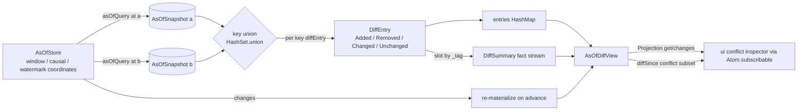

# [PROJECTION_AS_OF_DIFF]

The two-coordinate snapshot diff the conflict inspector reads — `asOfDiff` materializes one keyed map at two `AsOf` coordinates through `temporal-query/as-of-query#AS_OF_QUERY` and folds the union of keys present in either snapshot into one closed `DiffEntry` family, so the inspector reads "what changed between version V and version W", "between the stable frontier and now", or "across the event-time mark" as one structural delta rather than a hand-diffed pair of `HashMap`s. `DiffEntry` is the closed four-case `Data.TaggedEnum` (`Added`/`Removed`/`Changed`/`Unchanged`) a total `diffEntry` dispatch resolves per key by the presence pair and one `Equivalence` over the materialized value, `DiffSummary` is the one fact-stream count carrier slotting each verdict by its tag rather than four parallel counters, and `asOfDiff` is the one diff entrypoint over any two coordinates the same `asOfQuery` projection answers — never a second store holding a parallel history, never a per-coordinate-pair diff function. The diff is pure over the two materialized snapshots: it re-reads no changefeed, re-mints no clock, and re-folds no convergence state — both snapshots arrive settled from `temporal-query/as-of-query#AS_OF_QUERY`, which sources the Version coordinate off the retained `standing-query/window-fold#DATAFLOW` `Index#reconstructAt` trace, the EventTime coordinate off the `standing-query/watermark#WATERMARK` mark, and the Stable coordinate off the `causal-delivery/stability-frontier#STABILITY_FRONTIER` horizon, so the diff inherits the same coordinate algebra and adds only the set-difference over the two resulting key spaces.

## [1]-[INDEX]

Two clusters:
- `[2]-[AS_OF_DIFF]` owns `DiffEntry`, `DiffSummary`, `valueEquivalence`, `diffEntry`, `summarize`, and `asOfDiff` — the closed verdict family, the one fact-stream count carrier, and the two-coordinate diff fold over the materialized snapshots.
- `[3]-[DIFF_PROJECTION]` owns `AsOfDiffView`, `diffSince`, and `asOfDiffStore` — the live `Projection`-faced diff the conflict inspector binds through the `fold-core/projection#PROJECTION` `Atom.subscribable` seam, re-materializing the diff whenever either coordinate's store advances.

## [2]-[AS_OF_DIFF]

- Owner: `DiffEntry<A>`, the closed four-case `Data.TaggedEnum` resolving one key's fate across the two coordinates — `Added` (present at `b`, absent at `a`), `Removed` (present at `a`, absent at `b`), `Changed` (present at both, values inequivalent, carrying both sides for the inspector), and `Unchanged` (present at both, equivalent) — so a fifth diff outcome breaks the `summarize` and the inspector dispatch at compile time rather than threading a parallel boolean; `DiffSummary`, the one count carrier slotting each verdict by its `DiffEntry` tag into a single `HashMap<DiffEntry["_tag"], bigint>` fact stream rather than four sibling `added`/`removed`/`changed`/`unchanged` counters, so the tally is one `HashMap.modifyAt` per entry and a new verdict is one slot key; `valueEquivalence`, the `Equivalence<A>` deciding `Changed` versus `Unchanged` — the structural `Equal.equals` over an `effect` persistent value by default, overridable per materialized type so a value carrying decode-incidental fields diffs on its identity projection only; `diffEntry`, the total per-key dispatch over the `(Option<A>, Option<A>)` presence pair returning `Option<DiffEntry<A>>` — the three present-bearing combinations map onto the `Added`/`Removed`/`Changed`/`Unchanged` cases and the both-absent pair is the only `None` (never entered from the union walk, but the function stays total at the standalone diagnostic surface); `summarize`, the fold tallying a `ReadonlyArray<DiffEntry<A>>` into one `DiffSummary` under the slot-by-tag fact stream; and `asOfDiff`, the two-coordinate diff that materializes both snapshots through `asOfQuery`, walks the union of keys present in either, and emits the per-key `DiffEntry` map plus its `DiffSummary`.
- Cases: `asOfDiff` materializes the keyed map at coordinate `a` and coordinate `b` through one `queryStore` projection each, takes the key union via `HashSet.union` over both snapshots' `cells` key sets so a key added or removed between the coordinates is visited exactly once, and resolves each key through `diffEntry` reading the `Option<A>` slot from each snapshot's `cells` and keeps only the `Some` result — the `HashMap.get` absence is the `Removed`/`Added` axis and the `valueEquivalence` over two present values is the `Changed`/`Unchanged` axis. `diffEntry` is the total presence dispatch: `(None, Some)` resolves `Added`, `(Some, None)` resolves `Removed`, `(Some, Some)` splits on `valueEquivalence` into `Changed` carrying `{ before, after }` or `Unchanged` carrying the settled value, and `(None, None)` is the only `None` the union walk never produces — the inspector reads the `Changed` arm's both-sides payload to render the conflict, never re-reading either coordinate. `summarize` folds the entry array into one `DiffSummary` by `HashMap.modifyAt` on the entry's `_tag`, so the four tallies share one construction and a Sliding-window diff over thousands of keys pays one increment per key rather than four branch tests; the `total` reads off the summed slots, never a fifth maintained counter. The diff is order-independent and idempotent in the coordinate pair: `asOfDiff(store, a, b)` and the swapped `asOfDiff(store, b, a)` exchange `Added` with `Removed` and preserve `Changed`/`Unchanged`, the inverse the inspector's direction toggle reads off the same materialization without a re-query.
- Entry: `asOfDiff(store, a, b)` returns the `Effect<{ entries: HashMap<K, DiffEntry<A>>; summary: DiffSummary }>` the conflict inspector reads — `entries` the per-key verdict map keyed by the same entity key the store folds, `summary` the slot-by-tag tally; `diffEntry(left, right, eq)` is the standalone per-key dispatch the diagnostic surface and the store both read; `summarize(entries)` lifts any entry collection into its `DiffSummary` independent of the materialization.
- Packages: `effect` for `Data.TaggedEnum` (with `TaggedEnum.WithGenerics` threading the materialized value type `A` through the one verdict family), `HashMap`, `HashSet`, `Option`, `Equal`, `Equivalence`, and `Effect`; the `AsOf` coordinate, the `asOfQuery` projection, and the `AsOfSnapshot` materialized-map shape arrive owned from `temporal-query/as-of-query#AS_OF_QUERY` — the diff composes them and mints no second coordinate family nor a parallel history store (charter law).
- Growth: a new diff outcome lands as one `DiffEntry` variant the `summarize` slot fold absorbs by tag with no new branch and the `ui` inspector's `$match` over the family breaks at compile time until it renders, never a parallel boolean pair; a value type that diffs on a projection rather than full structural identity lands as one `valueEquivalence` override passed to `asOfDiff`, never a per-type diff function; a three-coordinate diff (a baseline against two divergent peers) lands as one fold over the same `diffEntry` dispatch widened to an `Option<A>` triple, never a second diff surface.
- Boundary: the diff re-reads no changefeed and re-mints nothing — both snapshots arrive materialized from `asOfQuery`, which already read the decode-admitted trace, so the diff owns only the set-difference over two settled key spaces and never re-decides a value; the `valueEquivalence` reads the `effect` persistent value's structural `Equal.equals` so two snapshots sharing a structurally-identical cell resolve `Unchanged` without a field-by-field re-walk, and an override projects out a decode-incidental field rather than re-deriving identity; the key union is a `HashSet` over the two snapshot key sets so a key is visited once regardless of which coordinate carries it; the diff is pure — it forks no fiber, dials no transport, and holds no `SubscriptionRef`, the live re-materialization living in `[3]-[DIFF_PROJECTION]`.

```ts contract
import { Data, Effect, Equal, Equivalence, HashMap, HashSet, Option } from "effect";
import { queryStore, type AsOf, type AsOfSnapshot, type AsOfStore } from "./as-of-query";

// --- [TYPES] -------------------------------------------------------------------------------

type DiffEntry<A> = Data.TaggedEnum<{
  readonly Added: { readonly after: A };
  readonly Removed: { readonly before: A };
  readonly Changed: { readonly before: A; readonly after: A };
  readonly Unchanged: { readonly value: A };
}>;
interface DiffEntryDefinition extends Data.TaggedEnum.WithGenerics<1> {
  readonly taggedEnum: DiffEntry<this["A"]>;
}
const DiffEntry = Data.taggedEnum<DiffEntryDefinition>();

type DiffTag = DiffEntry<unknown>["_tag"];

// --- [MODELS] ------------------------------------------------------------------------------

interface DiffSummary {
  readonly slots: HashMap.HashMap<DiffTag, bigint>;
}

const emptySummary: DiffSummary = { slots: HashMap.empty<DiffTag, bigint>() };

const slotOf = (summary: DiffSummary, tag: DiffTag): bigint =>
  Option.getOrElse(HashMap.get(summary.slots, tag), () => 0n);

const total = (summary: DiffSummary): bigint =>
  HashMap.reduce(summary.slots, 0n, (sum, count) => sum + count);

// --- [OPERATIONS] --------------------------------------------------------------------------

const valueEquivalence = <A>(): Equivalence.Equivalence<A> => Equivalence.make((a, b) => Equal.equals(a, b));

const diffEntry = <A>(
  left: Option.Option<A>,
  right: Option.Option<A>,
  eq: Equivalence.Equivalence<A>,
): Option.Option<DiffEntry<A>> =>
  Option.match(left, {
    onNone: () => Option.map(right, (after) => DiffEntry.Added({ after })),
    onSome: (before) =>
      Option.some(Option.match(right, {
        onNone: () => DiffEntry.Removed({ before }),
        onSome: (after) =>
          eq(before, after) ? DiffEntry.Unchanged({ value: after }) : DiffEntry.Changed({ before, after }),
      })),
  });

const summarize = <K, A>(entries: HashMap.HashMap<K, DiffEntry<A>>): DiffSummary => ({
  slots: HashMap.reduce(entries, emptySummary.slots, (slots, entry) =>
    HashMap.modifyAt(slots, entry._tag, (held) => Option.some(Option.getOrElse(held, () => 0n) + 1n))),
});

const diffSnapshots = <K, A>(
  before: AsOfSnapshot<K, A>,
  after: AsOfSnapshot<K, A>,
  eq: Equivalence.Equivalence<A>,
): { readonly entries: HashMap.HashMap<K, DiffEntry<A>>; readonly summary: DiffSummary } => {
  const keys = HashSet.union(HashSet.fromIterable(HashMap.keys(before.cells)), HashSet.fromIterable(HashMap.keys(after.cells)));
  const entries = HashSet.reduce(keys, HashMap.empty<K, DiffEntry<A>>(), (acc, key) =>
    Option.match(diffEntry(HashMap.get(before.cells, key), HashMap.get(after.cells, key), eq), {
      onNone: () => acc,
      onSome: (entry) => HashMap.set(acc, key, entry),
    }));
  return { entries, summary: summarize(entries) };
};

const asOfDiff = <K, A>(
  store: AsOfStore<K, A>,
  a: AsOf,
  b: AsOf,
  eq: Equivalence.Equivalence<A> = valueEquivalence<A>(),
): Effect.Effect<{ readonly entries: HashMap.HashMap<K, DiffEntry<A>>; readonly summary: DiffSummary }> =>
  Effect.zipWith(queryStore(store, a), queryStore(store, b), (before, after) => diffSnapshots(before, after, eq));

// --- [EXPORTS] -----------------------------------------------------------------------------

export {
  asOfDiff,
  diffEntry,
  diffSnapshots,
  DiffEntry,
  emptySummary,
  slotOf,
  summarize,
  total,
  valueEquivalence,
  type DiffSummary,
  type DiffTag,
};
```

## [3]-[DIFF_PROJECTION]

- Owner: `AsOfDiffView<K, A>`, the live diff value the conflict inspector renders — the per-key `DiffEntry` map plus its `DiffSummary` and the two coordinates it was taken between, so a render reads the verdict, the tally, and the coordinate provenance off one value; `diffSince`, the filtered derivation projecting only the `Changed` and `Removed` and `Added` entries (the conflict-bearing subset) off a full `AsOfDiffView` so the inspector's conflict list is one `derive` row rather than a bind-site filter; and `asOfDiffStore`, the `fold-core/projection#PROJECTION` `Projection`-faced store that re-materializes the diff whenever either coordinate's underlying store advances and exposes the result as one `Subscribable<AsOfDiffView>` the `ui` `Atom.subscribable` bridge binds at the boundary.
- Cases: `asOfDiffStore` holds the two `AsOf` coordinates and re-runs `asOfDiff` against the live `AsOfStore`, so a freshly-arrived op that advances the underlying window or causal store re-materializes both snapshots and re-diffs — the inspector's view tracks the live state without a manual re-query. For a `Stable`-versus-now diff the `b` coordinate is the moving present and the `a` coordinate the settled `causal-delivery/stability-frontier#STABILITY_FRONTIER` horizon, so the view shows exactly the in-flight delta below the causally-stable prefix the inspector flags as not-yet-converged; for a `Version`-versus-`Version` diff both coordinates are fixed `Index#reconstructAt` marks so the view is stable and re-materializes only on a structural store change that cannot affect a settled historical trace, which the deduplicated `Stream.changes` collapses. `diffSince` derives the conflict-bearing subset through one `derive` over the projected view, filtering the `Unchanged` entries out so the inspector's conflict count and list read the `Changed`/`Added`/`Removed` rows directly off the `DiffSummary` slots without a second tally; the `total` minus the `Unchanged` slot is the conflict count the inspector badges. The store forks nothing the `asOfQuery` projection does not already own — it re-sources the two coordinate materializations and the diff is a pure fold over them, so a scope close tears down the one re-materialization fiber and leaks no half.
- Entry: `asOfDiffStore(store, a, b, eq?)` returns the `Effect<Projection<AsOfDiffView<K, A>>>` the `ui` binds through `Atom.subscribable`; `diffSince(view)` derives the conflict-bearing `Projection<AsOfDiffView<K, A>>` the conflict list reads.
- Packages: `effect` for `Effect`, `Stream`, `SubscriptionRef`, `Scope`, and `HashMap`; the `Projection`/`projectStore`/`derive` face arrives owned from `fold-core/projection#PROJECTION` and the `asOfDiff` fold from `[2]-[AS_OF_DIFF]`; `@effect-atom/atom` is named in the binding seam only, never imported into the fold interior (the `fold-core/projection#BINDING_SEAM` consumer law).
- Growth: a new diff-derived view the inspector needs lands as one `derive` row over the `AsOfDiffView` at the `projection` altitude — a conflict-only list, a per-entity-kind grouping, a coordinate-provenance badge — and one `Atom.subscribable` bind the `ui` owns, never a parallel bind-site fold; a new live coordinate pairing lands as one `asOfDiffStore` call, never a second store implementation.
- Boundary: the wire is one-way — `projection` produces the `Subscribable<AsOfDiffView>`, the `ui` conflict inspector consumes it through `Atom.subscribable`, and the `Subscribable` surfaces read-only `get`/`changes` so no inspector bind can mutate either coordinate's store through the face; the store re-materializes through `asOfQuery` and re-decides nothing, so the diff stays the sole set-difference owner and the underlying stores stay the sole state owners; the deduplicated `Stream.changes` collapses a re-materialization that produced an identical diff so a settled `Version`-versus-`Version` view emits no spurious render; the domain dials no transport and the `@effect-atom/atom` bridge owns the `changes` subscription lifetime at the `ui` bind site, so the face holds no fiber beyond the one re-materialization fork the enclosing `Scope` owns.

```ts contract
import { Effect, Equivalence, HashMap, Scope, Stream, SubscriptionRef } from "effect";
import type { AsOf, AsOfStore } from "./as-of-query";
import { asOfDiff, DiffEntry, slotOf, total, valueEquivalence, type DiffSummary } from "./as-of-diff";
import { derive, projectStore, type Projection } from "../fold-core/projection";

// --- [MODELS] ------------------------------------------------------------------------------

interface AsOfDiffView<K, A> {
  readonly between: readonly [AsOf, AsOf];
  readonly entries: HashMap.HashMap<K, DiffEntry<A>>;
  readonly summary: DiffSummary;
}

const conflictCount = (summary: DiffSummary): bigint => total(summary) - slotOf(summary, "Unchanged");

// --- [COMPOSITION] -------------------------------------------------------------------------

const asOfDiffStore = <K, A>(
  store: AsOfStore<K, A>,
  a: AsOf,
  b: AsOf,
  eq: Equivalence.Equivalence<A> = valueEquivalence<A>(),
): Effect.Effect<Projection<AsOfDiffView<K, A>>, never, Scope.Scope> =>
  Effect.gen(function* () {
    const view = yield* SubscriptionRef.make<AsOfDiffView<K, A>>({
      between: [a, b],
      entries: HashMap.empty<K, DiffEntry<A>>(),
      summary: { slots: HashMap.empty() },
    });
    const rematerialize = asOfDiff(store, a, b, eq).pipe(
      Effect.flatMap(({ entries, summary }) => SubscriptionRef.set(view, { between: [a, b], entries, summary })),
    );
    yield* rematerialize;
    yield* store.changes.pipe(Stream.runForEach(() => rematerialize), Effect.forkScoped);
    return projectStore(view);
  });

const diffSince = <K, A>(view: Projection<AsOfDiffView<K, A>>): Projection<AsOfDiffView<K, A>> =>
  derive(view, (full) => ({
    between: full.between,
    entries: HashMap.filter(full.entries, (entry) => !DiffEntry.$is("Unchanged")(entry)),
    summary: full.summary,
  }));

export { asOfDiffStore, conflictCount, diffSince, type AsOfDiffView };
```


