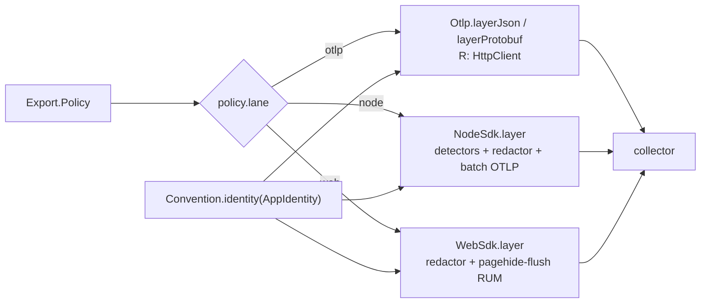

# [RUNTIME_EMIT]

The one OTLP wire owner: egress and ingress of the telemetry plane in one module. Egress is one policy value and one Layer — `Export.live(policy)` composes the whole trace/metric/log export plane as a registration node providing `Hooks.Meter`, the lane (native `Otlp` over the shared `HttpClient`, `NodeSdk`, `WebSdk`) selected by one policy row, every lane consuming one identity: the OTLP `Resource` derives from `Convention.identity(policy.identity)` folded with the platform's own resource detectors so the incubating host/pod/pid rows the convention declares have a producer. Ingress is the W3C continuation — `traceparent`/`tracestate`/`baggage` decode from any string-keyed carrier into an `Option`-carried parent, and one total transformer continues it, so extract-and-continue can never be half-applied. `Redaction` is the one shared scrub owner and it is ambient: the rules ride a `Context.Reference` every capture seam reads at zero requirement pressure — export-boundary span scrub here, capture-time and fatal-band rules consumed by `crash`, baggage annotations scrubbed inside the ingress transformer itself — four consumption sites, one rule shape, one override at the root. `Hooks` is the consumer hook plane — taps, processors, exporters, views, detectors, and redaction points contribute through append-only registry rows one SDK drain collects, so a thousand apps extend the pipeline without forking it. The `@opentelemetry` sdk/exporter block behind the SDK lanes is the `[R3]` pin block — it collapses as one unit when native `Otlp` parity (including the span-scrub hook) closes, and only the propagation codecs, `resources`, and `semantic-conventions` survive. The `plane:dev` DevTools row ships as its own `./dev` subpath module. The module is `runtime/src/otel/emit.ts`.

## [01]-[CLUSTERS]

| [INDEX] | [CLUSTER]      | [OWNS]                                                                             | [PUBLIC]      |
| :-----: | :------------- | :--------------------------------------------------------------------------------- | :------------ |
|  [01]   | `POLICY`       | the one `Export.Policy` row: identity, collector, lane, cadence, sampling, limits  | `Export`      |
|  [02]   | `REDACTION`    | the ambient scrub rules + the per-signal structural-safety ledger                  | `Redaction`   |
|  [03]   | `HOOKS`        | the contribute-then-collect pipeline registry: taps, processors, readers, views    | `Hooks`       |
|  [04]   | `LANES`        | the native `Otlp` row, the `NodeSdk`/`WebSdk` rows, detectors, the roster dispatch | `Export`      |
|  [05]   | `CONTINUATION` | carrier decode + the ingress transformer + the egress stamp                        | `Propagation` |
|  [06]   | `DEV`          | the `plane:dev`-fenced `./dev` DevTools module                                     | `dev`         |

## [02]-[POLICY]

[POLICY]:
- Owner: `Export.Policy` — one typed row carrying every export decision: the `AppIdentity` (whose settled dimensions — instance, namespace, environment — the `Convention.identity` projection stamps on the `Resource`, so no export field re-mints an identity fact), the collector endpoint and sealed headers, the lane and serialization, per-signal cadence as `Duration` rows, the head-sampling ratio, batch tuning, metric temporality, the tenant-cardinality budget, the span structural limits, the shutdown drain window, and the redaction rules. The transport rows — collector origin, sealed headers, cadence, sampling ratio — home in `Setting.otel` (`config#ADMISSION_ROWS`' described group), so the app root assembles the policy from the boot-validated `Setting` plus its own identity value, and no export decision exists outside the one row.
- Law: the collector secret rides `Redacted` end-to-end — the policy's `headers` values are `Redacted<string>` sealed at config admission and unwrapped exactly once inside the lane construction, so an exporter credential can never print.
- Law: cadence, batch width, sampling ratio, temporality, and the span limits are policy values with stated defaults — a lane never hardcodes an interval, and tuning a fleet is a config edit; the OTLP signal paths derive from one base URL by the interior `_signal` projection, so a collector move is one field.
- Growth: a new export decision is one policy field consumed by the lane rows; a new backend is a `baseUrl`/`headers` value, never a lane.
- Packages: `effect` (`Duration`, `Redacted`), `@rasm/ts/core` (`AppIdentity`, `Convention`).

```typescript
import {
  Array, Chunk, Context, Duration, Effect, Exit, Function, Layer, Option, Record, Redacted, Ref, Scope, type Tracer,
} from "effect"
import type { HttpClient } from "@effect/platform"
import { NodeSdk, Otlp, Tracer as OtelBridge, WebSdk } from "@effect/opentelemetry"
import type { SpanContext } from "@opentelemetry/api"
import { AggregationTemporalityPreference, OTLPMetricExporter } from "@opentelemetry/exporter-metrics-otlp-http"
import { CompressionAlgorithm, OTLPTraceExporter } from "@opentelemetry/exporter-trace-otlp-http"
import { OTLPLogExporter } from "@opentelemetry/exporter-logs-otlp-http"
import { BatchLogRecordProcessor, type LogRecordProcessor } from "@opentelemetry/sdk-logs"
import { MeterProvider, PeriodicExportingMetricReader, type IMetricReader, type ViewOptions } from "@opentelemetry/sdk-metrics"
import { BatchSpanProcessor, ParentBasedSampler, type Span, type SpanProcessor, TraceIdRatioBasedSampler } from "@opentelemetry/sdk-trace-base"
import {
  TRACE_PARENT_HEADER, TRACE_STATE_HEADER, TraceState, parseKeyPairsIntoRecord, parseTraceParent,
} from "@opentelemetry/core"
import {
  detectResources, envDetector, hostDetector, osDetector, processDetector, resourceFromAttributes, type Resource as OtelResource,
  serviceInstanceIdDetector, type ResourceDetector,
} from "@opentelemetry/resources"
import { type AppIdentity, Convention } from "@rasm/ts/core"
import { Life } from "../proc/life.ts"

declare namespace Export {
  type Lane = keyof typeof _lanes
  type Policy = {
    readonly identity: AppIdentity
    readonly collector: {
      readonly baseUrl: string
      readonly headers: Readonly<Record<string, Redacted.Redacted<string>>>
    }
    readonly lane: Lane
    readonly serialization: "json" | "protobuf"
    readonly cadence: {
      readonly logs: Duration.Duration
      readonly metrics: Duration.Duration
      readonly traces: Duration.Duration
    }
    readonly sampling: { readonly ratio: number }
    readonly batch: { readonly maxExportBatchSize: number; readonly maxQueueSize: number }
    readonly limits: { readonly attributeValueLengthLimit: number; readonly attributeCountLimit: number }
    readonly temporality: "cumulative" | "delta"
    readonly cardinality: { readonly tenant: number }
    readonly shutdown: Duration.Duration
    readonly redaction: Redaction.Rules
  }
  type Live = Layer.Layer<Hooks.Meter, never, HttpClient.HttpClient | Hooks | Life>
}

const _signal = (policy: Export.Policy, signal: "logs" | "metrics" | "traces"): string =>
  `${policy.collector.baseUrl}/v1/${signal}`
```

## [03]-[REDACTION]

[REDACTION]:
- Owner: `Redaction` — the one scrub owner of the branch: `Rules` as data (sealed attribute keys plus value patterns), one total `scrub` fold over any open attribute bag, `processor(rules)` materializing the rules as an OTel `SpanProcessor` whose `onEnding` hook overwrites deny-keyed and pattern-matched span attributes with the sealed sentinel before the span freezes for export, and `Redaction.Current` — a `Context.Reference` defaulting to `defaults` — so every capture seam reads the live rule set at zero requirement pressure and the app root overrides once with the policy's own rows.
- Law: the scrub signature is the open read-side record — `Convention.Bag` in, `Convention.Bag` out — because scrubbed material lawfully carries keys the vocabulary never minted (platform tracer attributes, foreign baggage, crash-context bags); a scrub seam demanding the closed `Convention.Attributes` stamping record is the inverted-trust defect the convention page names.
- Law: the signals are safe by distinct mechanisms, and the ledger is explicit over four consumption sites — metrics carry only bounded-vocabulary tags, so no metric attribute can hold PII by construction; span attributes scrub structurally through `Redaction.processor` at the export boundary; log annotations scrub at their capture seams — the crash owner's breadcrumb record and fatal forensic band (`crash#REPLAY`, `crash#CAPTURE`) and this module's own baggage ingress (`[06]`) all fold the identical `Rules` value read from `Redaction.Current` — so a new PII class lands as one row every site inherits and no annotation path exists outside the fold.
- Law: the native `Otlp` lane exposes no span-attribute hook — export-boundary span scrub is therefore an `[R3]` parity criterion: a deployment whose compliance posture mandates boundary scrub selects an SDK lane until the native lane grows the hook, a selection pressure recorded on the lane card, never worked around with a fork.
- Law: `defaults` seals the identifier-grade semconv keys — `client.address`, `user_agent.original`, `url.full` — and the pattern rows mask bearer tokens and email shapes inside surviving string values — scalar and string-array element alike; app policies extend by row composition, never by a second scrub.
- Exemption: the `SpanProcessor` hooks are the OTel SDK's own callback contract — the platform-forced statement seam where `setAttribute` writes cross back into the span before it freezes.
- Law: `onEnding` is the correct hook and a pin-watch fact — it hands a mutable `Span` where `onEnd` hands only a `ReadableSpan`; the member carries the SDK's `@experimental` flag, so it rides the `[R3]` pin block's watch list, never a design change.
- Growth: a new PII class is one `sealed` key row or one `patterns` row.
- Packages: `effect` (`Array`, `Context`, `Record`), `@opentelemetry/sdk-trace-base` (`SpanProcessor`).

```typescript
declare namespace Redaction {
  type Rules = {
    readonly patterns: ReadonlyArray<RegExp>
    readonly sealed: ReadonlyArray<string>
  }
}

const _SEAL = "<redacted>"

const _defaults: Redaction.Rules = {
  patterns: [/bearer\s+[a-z0-9._-]+/gi, /[a-z0-9._%+-]+@[a-z0-9.-]+\.[a-z]{2,}/gi],
  sealed: [Convention.attr.clientAddress, Convention.attr.userAgent, Convention.attr.urlFull],
}

class _Current extends Context.Reference<_Current>()("runtime/Redaction", {
  defaultValue: (): Redaction.Rules => _defaults,
}) {}

const _mask = (rules: Redaction.Rules, text: string): string =>
  Array.reduce(rules.patterns, text, (held, pattern) => held.replace(pattern, _SEAL))

const _masked = (rules: Redaction.Rules, value: Convention.Bag[string]): Convention.Bag[string] =>
  typeof value === "string"
    ? _mask(rules, value)
    : Array.isArray(value)
      ? Array.map(value, (entry) => (typeof entry === "string" ? _mask(rules, entry) : entry))
      : value

const _scrub = (rules: Redaction.Rules, bag: Convention.Bag): Convention.Bag =>
  Record.map(bag, (value, key) => (Array.contains(rules.sealed, key) ? _SEAL : _masked(rules, value)))

const _processor = (rules: Redaction.Rules): SpanProcessor => ({
  forceFlush: () => Promise.resolve(),
  onEnd: () => undefined,
  onEnding: (span: Span) => {
    const attributes = Record.filterMap(span.attributes, (value) => Option.fromNullable(value))
    for (const [key, value] of Object.entries(_scrub(rules, attributes))) {
      span.setAttribute(key, value)
    }
  },
  onStart: () => undefined,
  shutdown: () => Promise.resolve(),
})

const Redaction: {
  readonly Current: typeof _Current
  readonly defaults: Redaction.Rules
  readonly processor: (rules: Redaction.Rules) => SpanProcessor
  readonly scrub: (rules: Redaction.Rules, bag: Convention.Bag) => Convention.Bag
} = {
  Current: _Current,
  defaults: _defaults,
  processor: _processor,
  scrub: _scrub,
}
```

## [04]-[HOOKS]

[HOOKS]:
- Owner: `Hooks` — the consumer hook plane of the telemetry pipeline: one accumulating registry of `SpanProcessor` taps, `IMetricReader` rows, `LogRecordProcessor` sinks, `ViewOptions` reshaping rows, and `ResourceDetector` enrichers. A feature, app, or tenant plane contributes through `Hooks.contribute` — a `Layer.effectDiscard` that appends its rows — and exactly one drain exists: the SDK lanes build their `Configuration` inside `NodeSdk.layer(Effect<Configuration>)` / `WebSdk.layer(Effect<Configuration>)`, folding the collected rows behind the policy's own, while `_meter` exposes the scoped raw-OTel `MeterProvider` as `Hooks.Meter` for third-party instruments.
- Law: contributions are order-independent appends with zero global effects — no `register()`, no global provider, no module side effect; the registry is a service, a proof overrides it wholesale, and an append after the drain is construction-order misuse the root's Layer ordering makes unspellable (`Export.live` composes after every contributor).
- Law: tenant isolation rides the plane — a baggage-to-`tenant.id` span-attribute bridge is one contributed `onStart` processor row, and a per-tenant metric stream is one contributed reader; identity scopes every stream, so multi-app deployments never tangle.
- Law: view rows govern cardinality — `ViewOptions` carries the allow-list primary (`attributesProcessors: [createAllowListAttributesProcessor(keys)]`) with `aggregationCardinalityLimit` as the circuit-breaker above it, and the per-reader `cardinalityLimits` ceiling sits above every per-view max. The Effect facade producer keeps the policy and contributed readers; the raw-OTel producer is a scoped `MeterProvider({ resource, views, readers })` under `Hooks.Meter`, so third-party instruments obtain a local meter through the Layer graph and contributed views execute on the SDK surface that owns them without `metrics.setGlobalMeterProvider`.
- Growth: a new hook class (an exporter tap, a scrub point, a sampling processor) is one registry slot consumed by the same drain.
- Packages: `effect` (`Chunk`, `Effect`, `Layer`, `Ref`), `@opentelemetry/sdk-trace-base` (`SpanProcessor`), `@opentelemetry/sdk-metrics` (`MeterProvider`, `IMetricReader`, `ViewOptions`), `@opentelemetry/sdk-logs` (`LogRecordProcessor`), `@opentelemetry/resources` (`ResourceDetector`).

```typescript
declare namespace Hooks {
  type Meter = _Meter
  type Drained = {
    readonly detectors: ReadonlyArray<ResourceDetector>
    readonly logs: ReadonlyArray<LogRecordProcessor>
    readonly readers: ReadonlyArray<IMetricReader>
    readonly spans: ReadonlyArray<SpanProcessor>
    readonly views: ReadonlyArray<ViewOptions>
  }
}

class _Meter extends Context.Tag("runtime/Hooks/Meter")<_Meter, MeterProvider>() {}

class Hooks extends Effect.Service<Hooks>()("runtime/Hooks", {
  effect: Effect.gen(function* () {
    const cells = {
      detectors: yield* Ref.make(Chunk.empty<ResourceDetector>()),
      logs: yield* Ref.make(Chunk.empty<LogRecordProcessor>()),
      readers: yield* Ref.make(Chunk.empty<IMetricReader>()),
      spans: yield* Ref.make(Chunk.empty<SpanProcessor>()),
      views: yield* Ref.make(Chunk.empty<ViewOptions>()),
    }
    return {
      detector: (row: ResourceDetector): Effect.Effect<void> => Ref.update(cells.detectors, Chunk.append(row)),
      log: (row: LogRecordProcessor): Effect.Effect<void> => Ref.update(cells.logs, Chunk.append(row)),
      reader: (row: IMetricReader): Effect.Effect<void> => Ref.update(cells.readers, Chunk.append(row)),
      span: (row: SpanProcessor): Effect.Effect<void> => Ref.update(cells.spans, Chunk.append(row)),
      view: (row: ViewOptions): Effect.Effect<void> => Ref.update(cells.views, Chunk.append(row)),
      drained: Effect.map(
        Effect.all({
          detectors: Ref.get(cells.detectors),
          logs: Ref.get(cells.logs),
          readers: Ref.get(cells.readers),
          spans: Ref.get(cells.spans),
          views: Ref.get(cells.views),
        }),
        (held): Hooks.Drained => ({
          detectors: Chunk.toReadonlyArray(held.detectors),
          logs: Chunk.toReadonlyArray(held.logs),
          readers: Chunk.toReadonlyArray(held.readers),
          spans: Chunk.toReadonlyArray(held.spans),
          views: Chunk.toReadonlyArray(held.views),
        }),
      ),
    }
  }),
}) {
  static readonly Meter = _Meter
  static readonly contribute = (tap: (hooks: Hooks) => Effect.Effect<void>): Layer.Layer<never, never, Hooks> =>
    Layer.effectDiscard(Effect.flatMap(Hooks, tap))
}
```

## [05]-[LANES]

[LANES]:
- Owner: the interior `_lanes` roster — `as const satisfies Record<string, (policy) => Layer>` — with `Export.live(policy)` as the one entrypoint dispatching `_lanes[policy.lane](policy)`; the lane union derives as `keyof typeof _lanes`, so config admission, the policy type, and the dispatch read one anchor, and a new lane is one row.
- Law: the native `otlp` row is the default — Effect's own `Tracer`/`Metric`/`Logger` serialize straight to the collector over the `HttpClient.HttpClient` requirement the root satisfies with `client#LANE_ROWS`'s policy client (node/bun) or the browser client, so OTLP egress inherits the branch timeout/retry posture; serialization selects `Otlp.layerJson` versus `Otlp.layerProtobuf`, and the policy's `shutdown` window rides the lane's `shutdownTimeout` so the drain budget is one stated value.
- Law: identity is detected, awaited, then projected — the node row folds `detectResources` over the platform detector roster (`envDetector`, `hostDetector`, `osDetector`, `processDetector`, `serviceInstanceIdDetector`), crosses `waitForAsyncAttributes()` whenever `asyncAttributesPending` is true, and merges the result beneath the `Convention.identity` base. The incubating `host.name`/`k8s.pod.name`/`process.pid` rows are complete before the first exporter observes them, the identity projection always wins on collision, and a raw `@opentelemetry/resources` value never leaves this module; the native and web rows carry the projection alone — browser detection is the RUM toolkit's concern.
- Law: the SDK rows exist for SDK-only capability — the boundary span scrub, explicit temporality, structural span limits, the hook plane — and each is one facade `Configuration` built as an `Effect` that drains `Hooks` behind the policy's own rows: the `node` row wires `Redaction.processor` before a `BatchSpanProcessor(new OTLPTraceExporter({ compression: gzip, keepAlive }))` with contributed span taps between, a `PeriodicExportingMetricReader({ exporter: new OTLPMetricExporter({ temporalityPreference }) })` beside contributed readers, a `ParentBasedSampler({ root: new TraceIdRatioBasedSampler(ratio) })` tracer config carrying the policy's `spanLimits` — the structural attribute caps that complement the scrub; the `web` row is the same shape over `WebSdk` with pagehide auto-flush ON so RUM spans drain before navigation; neither row calls `register()` — the facade owns context wiring through the fiber-backed tracer.
- Law: the SDK rows carry the full three-signal egress — the log leg is `new BatchLogRecordProcessor(new OTLPLogExporter({ url, headers }))` on `Configuration.logRecordProcessor` beside contributed log sinks, so an SDK-lane deployment exports logs to the same collector under the same batch discipline, and a parallel log sink beside the replaced process logger is the named defect; the offline/air-gapped tier is `PlatformLogger.toFile(path, { batchWindow })` added beside the wire logger at the root — an additive `Logger` row, never a fork.
- Law: metric temporality is the policy row mapped to `AggregationTemporalityPreference` — `delta` the fact-stream default, `cumulative` the monotonic-totals alternative — and the tenant-cardinality budget rides the reader's `cardinalityLimits`, the governed ceiling the data fact journal's tenant tag operates under.
- Law: `Export.live` returns one registration node providing `Hooks.Meter` with the native lane's `HttpClient` requirement in `R` — merged once at the composition root; construction observability attaches at the Layer value (`Layer.annotateLogs`), and a boot-time collector outage is Layer construction policy, never a runtime branch. `_managed` builds the selected lane in a child `Scope`, registers `Scope.close(scope, Exit.void)` as the standing rank-90 telemetry row through `Life.register`, and retains an idempotent outer finalizer, so the exporters' real `forceFlush`/`shutdown` finalizers execute inside the ordered drain choreography and remain leak-free if construction unwinds before shutdown.
- Entry: `Export.live(policy)` merged beneath `Hooks.Default` and after every `Hooks.contribute` node, so the drain observes the full contribution set.
- Growth: a new lane (OTLP/gRPC, a vendor exporter) is one `_lanes` row plus any policy field it reads.
- Packages: `@effect/opentelemetry` (`Otlp`, `NodeSdk`, `WebSdk`), `@opentelemetry/resources` (`detectResources`, the detector roster), the `[R3]` SDK block (`sdk-trace-base`, `sdk-metrics`, `exporter-trace-otlp-http`, `exporter-metrics-otlp-http`).



```typescript
const _headers = (policy: Export.Policy): Record<string, string> =>
  Record.map(policy.collector.headers, Redacted.value)

const _DETECTORS: ReadonlyArray<ResourceDetector> = [
  envDetector, hostDetector, osDetector, processDetector, serviceInstanceIdDetector,
]

type _Resource = {
  readonly facade: {
    readonly attributes: Convention.Bag
    readonly serviceName: string
    readonly serviceVersion: string
  }
  readonly otel: OtelResource
}

const _resource = (policy: Export.Policy, detectors: ReadonlyArray<ResourceDetector> = []): Effect.Effect<_Resource> =>
  Effect.promise(async () => {
    const resource = detectResources({ detectors: [..._DETECTORS, ...detectors] })
      .merge(resourceFromAttributes(Convention.identity(policy.identity)))
    if (resource.asyncAttributesPending) {
      await resource.waitForAsyncAttributes?.()
    }
    return {
      facade: {
        attributes: Record.filterMap(resource.attributes, (value) => Option.fromNullable(value)),
        serviceName: policy.identity.app,
        serviceVersion: policy.identity.build.version,
      },
      otel: resource,
    }
  })

const _temporality = {
  cumulative: AggregationTemporalityPreference.CUMULATIVE,
  delta: AggregationTemporalityPreference.DELTA,
} as const

const _sdk = (policy: Export.Policy, adds: Hooks.Drained) =>
  Effect.map(_resource(policy, adds.detectors), (resource) => ({
    logRecordProcessor: [
      new BatchLogRecordProcessor(
        new OTLPLogExporter({ headers: _headers(policy), url: _signal(policy, "logs") }),
      ),
      ...adds.logs,
    ],
    metricReader: [
      new PeriodicExportingMetricReader({
        exportIntervalMillis: Duration.toMillis(policy.cadence.metrics),
        exporter: new OTLPMetricExporter({
          headers: _headers(policy),
          temporalityPreference: _temporality[policy.temporality],
          url: _signal(policy, "metrics"),
        }),
        cardinalityLimits: { default: policy.cardinality.tenant },
      }),
      ...adds.readers,
    ],
    resource: resource.facade,
    shutdownTimeout: policy.shutdown,
    spanProcessor: [
      Redaction.processor(policy.redaction),
      ...adds.spans,
      new BatchSpanProcessor(
        new OTLPTraceExporter({
          compression: CompressionAlgorithm.GZIP,
          headers: _headers(policy),
          keepAlive: true,
          url: _signal(policy, "traces"),
        }),
        policy.batch,
      ),
    ],
    tracerConfig: {
      sampler: new ParentBasedSampler({ root: new TraceIdRatioBasedSampler(policy.sampling.ratio) }),
      spanLimits: policy.limits,
    },
  }))

const _drained = Effect.flatMap(Hooks, (hooks) => hooks.drained)

const _meter = (policy: Export.Policy): Layer.Layer<_Meter, never, Hooks> =>
  Layer.scoped(
    _Meter,
    Effect.acquireRelease(
      Effect.flatMap(_drained, (adds) =>
        Effect.map(_resource(policy, adds.detectors), (resource) =>
          new MeterProvider({
            resource: resource.otel,
            readers: [
              new PeriodicExportingMetricReader({
                exportIntervalMillis: Duration.toMillis(policy.cadence.metrics),
                exporter: new OTLPMetricExporter({
                  headers: _headers(policy),
                  temporalityPreference: _temporality[policy.temporality],
                  url: _signal(policy, "metrics"),
                }),
                cardinalityLimits: { default: policy.cardinality.tenant },
              }),
            ],
            views: [...adds.views],
          })),
      (provider) => Effect.promise(() => provider.forceFlush().then(() => provider.shutdown())),
    ),
  )

const _lanes = {
  node: (policy: Export.Policy): Export.Live =>
    Layer.merge(Layer.discard(NodeSdk.layer(Effect.flatMap(_drained, (adds) => _sdk(policy, adds)))), _meter(policy)),
  otlp: (policy: Export.Policy): Export.Live =>
    Layer.merge(
      Layer.unwrapEffect(
        Effect.map(_resource(policy), (resource) =>
          Layer.discard((policy.serialization === "protobuf" ? Otlp.layerProtobuf : Otlp.layerJson)({
            baseUrl: policy.collector.baseUrl,
            headers: _headers(policy),
            loggerExportInterval: policy.cadence.logs,
            maxBatchSize: policy.batch.maxExportBatchSize,
            metricsExportInterval: policy.cadence.metrics,
            resource: resource.facade,
            shutdownTimeout: policy.shutdown,
            tracerExportInterval: policy.cadence.traces,
          }))),
      ),
      _meter(policy),
    ),
  web: (policy: Export.Policy): Export.Live =>
    Layer.merge(Layer.discard(WebSdk.layer(Effect.flatMap(_drained, (adds) => _sdk(policy, adds)))), _meter(policy)),
} as const satisfies Record<string, (policy: Export.Policy) => Export.Live>

const _managed = (policy: Export.Policy, lane: Export.Live): Export.Live =>
  Layer.scopedContext(
    Effect.gen(function* () {
      const scope = yield* Scope.make()
      const context = yield* Layer.buildWithScope(lane, scope)
      yield* Life.register({
        label: "telemetry",
        rank: 90,
        budget: Option.some(policy.shutdown),
        run: Scope.close(scope, Exit.void),
      }).pipe(Effect.orDie)
      yield* Effect.addFinalizer(() => Scope.close(scope, Exit.void))
      return context
    }),
  )

const Export: {
  readonly live: (policy: Export.Policy) => Export.Live
} = {
  live: (policy) => Layer.annotateLogs(_managed(policy, _lanes[policy.lane](policy)), { lane: policy.lane }),
}
```

## [06]-[CONTINUATION]

[CONTINUATION]:
- Owner: `Propagation` — causal identity crossing every ingress: the interior codec kernel decodes `traceparent` through `parseTraceParent` into an OTel `SpanContext`, lifts `tracestate` through `new TraceState(raw)`, decodes `baggage` through `parseKeyPairsIntoRecord`, header names read from the core constants; the assembled owner carries the extraction members plus the one ingress transformer and the egress stamp, `Function.dual` so the transformer follows a live pipe subject at every entry seam.
- Law: the carrier is one shape — `Readonly<Record<string, string | undefined>>` — so platform headers, worker message metadata, queue envelope maps, and plain records all admit through one signature; carrier keys read case-normalized at the seam because HTTP header casing is transport accident.
- Law: absence is normal, never a fault — `parseTraceParent` returning `null` folds the whole parent to `Option.none`; `TraceState` filters malformed vendor members and preserves a valid `traceparent` with the surviving state, so invalid optional metadata cannot forge or discard valid causal identity. The receipt is `Option<Tracer.ExternalSpan>`, the doctrine interior form for inbound trace identity.
- Law: `Propagation.ingress` is the entry-seam law — one transformer that continues the inbound parent through the facade's `Tracer.withSpanContext` when present, runs unchanged when absent, and stamps the decoded baggage as log annotations in the same declaration AFTER the shared scrub: the fold reads `Redaction.Current` and passes every baggage record through `Redaction.scrub`, so a foreign baggage value can never carry an identifier or credential into logs and the signal-safety ledger covers this seam by construction; every ingress composes this one member, so extract-and-continue can never be half-applied; baggage is annotation material, never span identity and never a metric tag.
- Law: transport seams split by owner — the shared HTTP client egress rides `HttpClient.withTracerPropagation` composed on `client#DIAL_SEAM`'s client; outbound stamping onto any record-shaped carrier rides the platform `HttpTraceContext.toHeaders` directly; HTTP-header ingress at the serving edge may equivalently ride `HttpTraceContext.fromHeaders` with its `w3c`/`b3`/`xb3` dialect rows since both produce the same interior form; and a new inbound wire dialect lands as the `CompositePropagator` row over the core propagator family, never a bespoke decode arm.
- Boundary: span creation, naming, and the `Effect.fn` seam are callers' law — this owner never opens a span, it fixes the parent of whatever span the caller opens next.
- Entry: `Propagation.ingress(effect, carrier)` or `effect.pipe(Propagation.ingress(carrier))`; `Propagation.extract(carrier)`; `Propagation.baggage(carrier)`.
- Growth: a new inbound transport is one call site composing `ingress` — the owner is closed.
- Packages: `@opentelemetry/core` (`parseTraceParent`, `TraceState`, `parseKeyPairsIntoRecord`, header constants), `@effect/opentelemetry` (`Tracer.makeExternalSpan`, `Tracer.withSpanContext`), `effect` (`Array`, `Effect`, `Function`, `Option`, `Record`).

```typescript
const _BAGGAGE_HEADER = "baggage"

declare namespace Propagation {
  type Carrier = Readonly<Record<string, string | undefined>>
}

const _read = (carrier: Propagation.Carrier, key: string): Option.Option<string> =>
  Option.orElse(Option.fromNullable(carrier[key]), () =>
    Option.flatMap(
      Array.findFirst(Record.toEntries(carrier), ([held]) => held.toLowerCase() === key),
      ([, value]) => Option.fromNullable(value),
    ))

const _context = (carrier: Propagation.Carrier): Option.Option<SpanContext> =>
  Option.map(
    Option.flatMap(_read(carrier, TRACE_PARENT_HEADER), (header) => Option.fromNullable(parseTraceParent(header))),
    (context) =>
      Option.match(_read(carrier, TRACE_STATE_HEADER), {
        onNone: () => context,
        onSome: (raw) => ({ ...context, traceState: new TraceState(raw) }),
      }),
  )

const _extract = (carrier: Propagation.Carrier): Option.Option<Tracer.ExternalSpan> =>
  Option.map(_context(carrier), (context) =>
    OtelBridge.makeExternalSpan({
      spanId: context.spanId,
      traceFlags: context.traceFlags,
      traceId: context.traceId,
      ...(context.traceState !== undefined && { traceState: context.traceState }),
    }))

const _baggage = (carrier: Propagation.Carrier): Readonly<Record<string, string>> =>
  parseKeyPairsIntoRecord(Option.getOrUndefined(_read(carrier, _BAGGAGE_HEADER)))

const _ingress: {
  (carrier: Propagation.Carrier): <A, E, R>(self: Effect.Effect<A, E, R>) => Effect.Effect<A, E, R>
  <A, E, R>(self: Effect.Effect<A, E, R>, carrier: Propagation.Carrier): Effect.Effect<A, E, R>
} = Function.dual(
  2,
  <A, E, R>(self: Effect.Effect<A, E, R>, carrier: Propagation.Carrier): Effect.Effect<A, E, R> =>
    Effect.flatMap(Redaction.Current, (rules) => {
      // baggage is foreign material: it rides the shared scrub before any annotation lands
      const noted = Effect.annotateLogs(self, Redaction.scrub(rules, _baggage(carrier)))
      return Option.match(_context(carrier), {
        onNone: () => noted,
        onSome: (context) => OtelBridge.withSpanContext(noted, context),
      })
    }),
)

const Propagation: {
  readonly baggage: (carrier: Propagation.Carrier) => Readonly<Record<string, string>>
  readonly extract: (carrier: Propagation.Carrier) => Option.Option<Tracer.ExternalSpan>
  readonly ingress: typeof _ingress
} = {
  baggage: _baggage,
  extract: _extract,
  ingress: _ingress,
}
```

## [07]-[DEV]

[DEV]:
- Owner: the sibling `otel/dev` module the `./dev` exports-map subpath alone resolves — one `DevTools.layer` row wired to the local DevTools WebSocket, `plane:dev` by tag so the architecture gauge fails any runtime import; the physical module split is what makes the fence structural rather than disciplinary.
- Law: the dev layer is a registration node like the export layer — merged into a dev composition root beside `Export.live`, never instead of it — and it carries no policy: the DevTools endpoint default is the tool's own.
- Growth: none — the module is closed; richer dev wiring belongs to the tests estate.
- Packages: `@effect/experimental` (`DevTools`).

```typescript
import { DevTools } from "@effect/experimental"
import type { Layer } from "effect"

const dev: Layer.Layer<never> = DevTools.layer()

// --- [EXPORTS] --------------------------------------------------------------------------

export { Export, Hooks, Propagation, Redaction, dev }
```
