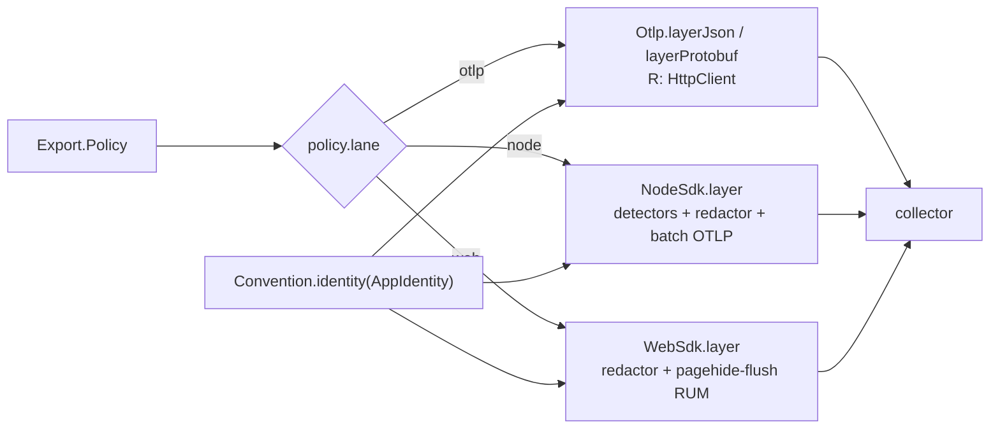

# [RUNTIME_EMIT]

The one OTLP wire owner: egress and ingress of the telemetry plane in one module. Egress is one policy value and one Layer — `Export.live(policy)` composes the whole trace/metric/log export plane as a `Layer<never>` registration node the app root merges once, the lane (native `Otlp` over the shared `HttpClient`, `NodeSdk`, `WebSdk`) selected by one policy row, every lane consuming one identity: the OTLP `Resource` derives from `Convention.identity(policy.identity)` folded with the platform's own resource detectors so the incubating host/pod/pid rows the convention declares have a producer. Ingress is the W3C continuation — `traceparent`/`tracestate`/`baggage` decode from any string-keyed carrier into an `Option`-carried parent, and one total transformer continues it, so extract-and-continue can never be half-applied. `Redaction` is the one shared scrub owner: export-boundary span scrub here, capture-time rules consumed by `crash`, structurally distinct laws over one rule shape. The `@opentelemetry` sdk/exporter block behind the SDK lanes is the `[R3]` pin block — it collapses as one unit when native `Otlp` parity (including the span-scrub hook) closes, and only the propagation codecs, `resources`, and `semantic-conventions` survive. The `plane:dev` DevTools row ships as its own `./dev` subpath module. The module is `runtime/src/otel/emit.ts`.

## [1]-[CLUSTERS]

| [INDEX] | [CLUSTER]      | [OWNS]                                                                         | [PUBLIC]      |
| :-----: | :------------- | :--------------------------------------------------------------------------------- | :------------ |
|  [01]   | `POLICY`       | the one `Export.Policy` row: identity, collector, lane, cadence, sampling, limits   | `Export`      |
|  [02]   | `REDACTION`    | the shared scrub rules + the per-signal structural-safety ledger                   | `Redaction`   |
|  [03]   | `LANES`        | the native `Otlp` row, the `NodeSdk`/`WebSdk` rows, detectors, the roster dispatch | `Export`      |
|  [04]   | `CONTINUATION` | carrier decode + the ingress transformer + the egress stamp                        | `Propagation` |
|  [05]   | `DEV`          | the `plane:dev`-fenced `./dev` DevTools module                                     | `dev`         |

## [2]-[POLICY]

[POLICY]:
- Owner: `Export.Policy` — one typed row carrying every export decision: the `AppIdentity`, the deployment environment, the collector endpoint and sealed headers, the lane and serialization, per-signal cadence as `Duration` rows, the head-sampling ratio, batch tuning, metric temporality, the tenant-cardinality budget, the span structural limits, and the redaction rules; the policy arrives as a value from the app root's `Config.unwrap` owner (`config#ADMISSION_ROWS`' family form), and no export decision exists outside it.
- Law: the collector secret rides `Redacted` end-to-end — the policy's `headers` values are `Redacted<string>` sealed at config admission and unwrapped exactly once inside the lane construction, so an exporter credential can never print.
- Law: cadence, batch width, sampling ratio, temporality, and the span limits are policy values with stated defaults — a lane never hardcodes an interval, and tuning a fleet is a config edit; the OTLP signal paths derive from one base URL by the interior `_signal` projection, so a collector move is one field.
- Growth: a new export decision is one policy field consumed by the lane rows; a new backend is a `baseUrl`/`headers` value, never a lane.
- Packages: `effect` (`Duration`, `Redacted`), `@rasm/ts/core` (`AppIdentity`, `Convention`).

```typescript
import type { Duration, Redacted } from "effect"
import type { HttpClient } from "@effect/platform"
import type { Layer } from "effect"
import { type AppIdentity, Convention } from "@rasm/ts/core"

declare namespace Export {
  type Lane = keyof typeof _lanes
  type Policy = {
    readonly identity: AppIdentity
    readonly environment: string
    readonly collector: {
      readonly baseUrl: string
      readonly headers: Readonly<Record<string, Redacted.Redacted<string>>>
    }
    readonly lane: Lane
    readonly serialization: "json" | "protobuf"
    readonly cadence: {
      readonly logs: Duration.Duration
      readonly metrics: Duration.Duration
      readonly traces: Duration.Duration
    }
    readonly sampling: { readonly ratio: number }
    readonly batch: { readonly maxExportBatchSize: number; readonly maxQueueSize: number }
    readonly limits: { readonly attributeValueLengthLimit: number; readonly attributeCountLimit: number }
    readonly temporality: "cumulative" | "delta"
    readonly cardinality: { readonly tenant: number }
    readonly redaction: Redaction.Rules
  }
  type Live = Layer.Layer<never, never, HttpClient.HttpClient>
}

const _signal = (policy: Export.Policy, signal: "logs" | "metrics" | "traces"): string =>
  `${policy.collector.baseUrl}/v1/${signal}`

const _attributes = (policy: Export.Policy): Convention.Attributes => ({
  ...Convention.identity(policy.identity),
  [Convention.attr.deploymentEnvironment]: policy.environment,
})
```

## [3]-[REDACTION]

[REDACTION]:
- Owner: `Redaction` — the one scrub owner of the branch: `Rules` as data (sealed attribute keys plus value patterns), one total `scrub` fold over any attribute record, and `processor(rules)` materializing the rules as an OTel `SpanProcessor` whose `onEnding` hook overwrites deny-keyed and pattern-matched span attributes with the sealed sentinel before the span freezes for export.
- Law: the three signals are safe by three distinct mechanisms, and the ledger is explicit — metrics carry only bounded-vocabulary tags, so no metric attribute can hold PII by construction; log safety is the `Redacted` carrier law plus the same deny-key vocabulary applied to annotation records at capture seams; span attributes are the one open surface, scrubbed structurally by `Redaction.processor` on the SDK lanes.
- Law: two consumption sites, one rule shape — export-boundary scrub here governs what leaves the process, and capture-time scrub is `crash#REPLAY`'s law over the identical `Rules` value, so a new PII class lands as one row both sites inherit.
- Law: the native `Otlp` lane exposes no span-attribute hook — export-boundary span scrub is therefore an `[R3]` parity criterion: a deployment whose compliance posture mandates boundary scrub selects an SDK lane until the native lane grows the hook, a selection pressure recorded on the lane card, never worked around with a fork.
- Law: `defaults` seals the identifier-grade semconv keys — `client.address`, `user_agent.original`, `url.full` — and the pattern rows mask bearer tokens and email shapes inside surviving string values; app policies extend by row composition, never by a second scrub.
- Exemption: the `SpanProcessor` hooks are the OTel SDK's own callback contract — the platform-forced statement seam where `setAttribute` writes cross back into the span before it freezes.
- Growth: a new PII class is one `sealed` key row or one `patterns` row.
- Packages: `effect` (`Array`, `Record`), `@opentelemetry/sdk-trace-base` (`SpanProcessor`).

```typescript
import { Array, Record } from "effect"
import type { Span, SpanProcessor } from "@opentelemetry/sdk-trace-base"

declare namespace Redaction {
  type Rules = {
    readonly patterns: ReadonlyArray<RegExp>
    readonly sealed: ReadonlyArray<string>
  }
}

const _SEAL = "<redacted>"

const _defaults: Redaction.Rules = {
  patterns: [/bearer\s+[a-z0-9._-]+/gi, /[a-z0-9._%+-]+@[a-z0-9.-]+\.[a-z]{2,}/gi],
  sealed: [Convention.attr.clientAddress, Convention.attr.userAgent, Convention.attr.urlFull],
}

const _masked = (rules: Redaction.Rules, value: Convention.Value): Convention.Value =>
  typeof value === "string"
    ? Array.reduce(rules.patterns, value, (held, pattern) => held.replace(pattern, _SEAL))
    : value

const _scrub = (rules: Redaction.Rules, attributes: Convention.Attributes): Convention.Attributes =>
  Record.map(attributes, (value, key) => (Array.contains(rules.sealed, key) ? _SEAL : _masked(rules, value)))

const _processor = (rules: Redaction.Rules): SpanProcessor => ({
  forceFlush: () => Promise.resolve(),
  onEnd: () => undefined,
  onEnding: (span: Span) => {
    for (const [key, value] of Object.entries(_scrub(rules, span.attributes as Convention.Attributes))) {
      span.setAttribute(key, value)
    }
  },
  onStart: () => undefined,
  shutdown: () => Promise.resolve(),
})

const Redaction: {
  readonly defaults: Redaction.Rules
  readonly processor: (rules: Redaction.Rules) => SpanProcessor
  readonly scrub: (rules: Redaction.Rules, attributes: Convention.Attributes) => Convention.Attributes
} = {
  defaults: _defaults,
  processor: _processor,
  scrub: _scrub,
}
```

## [4]-[LANES]

[LANES]:
- Owner: the interior `_lanes` roster — `as const satisfies Record<string, (policy) => Layer>` — with `Export.live(policy)` as the one entrypoint dispatching `_lanes[policy.lane](policy)`; the lane union derives as `keyof typeof _lanes`, so config admission, the policy type, and the dispatch read one anchor, and a new lane is one row.
- Law: the native `otlp` row is the default — Effect's own `Tracer`/`Metric`/`Logger` serialize straight to the collector over the `HttpClient.HttpClient` requirement the root satisfies with `client#LANE_ROWS`'s policy client (node/bun) or the browser client, so OTLP egress inherits the branch timeout/retry posture; serialization selects `Otlp.layerJson` versus `Otlp.layerProtobuf`.
- Law: identity is detected, then projected — the node row folds `detectResources` over the platform detector roster (`envDetector`, `hostDetector`, `osDetector`, `processDetector`, `serviceInstanceIdDetector`) and merges the result beneath the `Convention.identity` base, so the incubating `host.name`/`k8s.pod.name`/`process.pid` rows the convention declares are populated by the platform, the identity projection always wins on collision, and a raw `@opentelemetry/resources` value never leaves this module; the native and web rows carry the projection alone — browser detection is the RUM toolkit's concern.
- Law: the SDK rows exist for SDK-only capability — the boundary span scrub, explicit temporality, structural span limits — and each is one facade `Configuration`: the `node` row wires `Redaction.processor` before a `BatchSpanProcessor(new OTLPTraceExporter({ compression: gzip, keepAlive }))`, a `PeriodicExportingMetricReader({ exporter: new OTLPMetricExporter({ temporalityPreference }) })`, a `ParentBasedSampler({ root: new TraceIdRatioBasedSampler(ratio) })` tracer config carrying the policy's `spanLimits` — the structural attribute caps that complement the scrub; the `web` row is the same shape over `WebSdk` with pagehide auto-flush ON so RUM spans drain before navigation; neither row calls `register()` — the facade owns context wiring through the fiber-backed tracer.
- Law: SDK-lane log egress does not exist — no OTLP log exporter is admitted, so the log signal is native-lane-only and a parallel log sink beside the replaced process logger is the named defect.
- Law: metric temporality is the policy row mapped to `AggregationTemporalityPreference` — `delta` the fact-stream default, `cumulative` the monotonic-totals alternative — and the tenant-cardinality budget rides the reader's `cardinalityLimits`, the governed ceiling the data fact journal's tenant tag operates under.
- Law: `Export.live` returns a registration node — `Layer<never>` semantics with the native lane's `HttpClient` requirement in `R` — merged once at the composition root; construction observability attaches at the Layer value (`Layer.annotateLogs`), and a boot-time collector outage is Layer construction policy, never a runtime branch.
- Entry: `Export.live(policy)`.
- Growth: a new lane (OTLP/gRPC, a vendor exporter) is one `_lanes` row plus any policy field it reads.
- Packages: `@effect/opentelemetry` (`Otlp`, `NodeSdk`, `WebSdk`), `@opentelemetry/resources` (`detectResources`, the detector roster), the `[R3]` SDK block (`sdk-trace-base`, `sdk-metrics`, `exporter-trace-otlp-http`, `exporter-metrics-otlp-http`).



```typescript
import { Duration, Layer, Record, Redacted } from "effect"
import { NodeSdk, Otlp, WebSdk } from "@effect/opentelemetry"
import { detectResources, envDetector, hostDetector, osDetector, processDetector, serviceInstanceIdDetector } from "@opentelemetry/resources"
import { AggregationTemporalityPreference, OTLPMetricExporter } from "@opentelemetry/exporter-metrics-otlp-http"
import { CompressionAlgorithm, OTLPTraceExporter } from "@opentelemetry/exporter-trace-otlp-http"
import { PeriodicExportingMetricReader } from "@opentelemetry/sdk-metrics"
import { BatchSpanProcessor, ParentBasedSampler, TraceIdRatioBasedSampler } from "@opentelemetry/sdk-trace-base"

const _headers = (policy: Export.Policy): Record<string, string> =>
  Record.map(policy.collector.headers, Redacted.value)

const _resource = (policy: Export.Policy): {
  readonly attributes: Convention.Attributes
  readonly serviceName: string
  readonly serviceVersion: string
} => ({
  attributes: {
    ...(detectResources({
      detectors: [envDetector, hostDetector, osDetector, processDetector, serviceInstanceIdDetector],
    }).attributes as Convention.Attributes),
    ..._attributes(policy),
  },
  serviceName: policy.identity.app,
  serviceVersion: policy.identity.build.version,
})

const _temporality = {
  cumulative: AggregationTemporalityPreference.CUMULATIVE,
  delta: AggregationTemporalityPreference.DELTA,
} as const

const _sdk = (policy: Export.Policy) => ({
  metricReader: new PeriodicExportingMetricReader({
    exportIntervalMillis: Duration.toMillis(policy.cadence.metrics),
    exporter: new OTLPMetricExporter({
      headers: _headers(policy),
      temporalityPreference: _temporality[policy.temporality],
      url: _signal(policy, "metrics"),
    }),
    cardinalityLimits: { default: policy.cardinality.tenant },
  }),
  resource: _resource(policy),
  spanProcessor: [
    Redaction.processor(policy.redaction),
    new BatchSpanProcessor(
      new OTLPTraceExporter({
        compression: CompressionAlgorithm.GZIP,
        headers: _headers(policy),
        keepAlive: true,
        url: _signal(policy, "traces"),
      }),
      policy.batch,
    ),
  ],
  tracerConfig: {
    sampler: new ParentBasedSampler({ root: new TraceIdRatioBasedSampler(policy.sampling.ratio) }),
    spanLimits: policy.limits,
  },
})

const _lanes = {
  node: (policy: Export.Policy): Export.Live => NodeSdk.layer(() => _sdk(policy)),
  otlp: (policy: Export.Policy): Export.Live =>
    (policy.serialization === "protobuf" ? Otlp.layerProtobuf : Otlp.layerJson)({
      baseUrl: policy.collector.baseUrl,
      headers: _headers(policy),
      loggerExportInterval: policy.cadence.logs,
      maxBatchSize: policy.batch.maxExportBatchSize,
      metricsExportInterval: policy.cadence.metrics,
      resource: _resource(policy),
      tracerExportInterval: policy.cadence.traces,
    }),
  web: (policy: Export.Policy): Export.Live => WebSdk.layer(() => _sdk(policy)),
} as const satisfies Record<string, (policy: Export.Policy) => Export.Live>

const Export: {
  readonly live: (policy: Export.Policy) => Export.Live
} = {
  live: (policy) => Layer.annotateLogs(_lanes[policy.lane](policy), { lane: policy.lane }),
}
```

## [5]-[CONTINUATION]

[CONTINUATION]:
- Owner: `Propagation` — causal identity crossing every ingress: the interior codec kernel decodes `traceparent` through `parseTraceParent` into an OTel `SpanContext`, lifts `tracestate` through `new TraceState(raw)`, decodes `baggage` through `parseKeyPairsIntoRecord`, header names read from the core constants; the assembled owner carries the extraction members plus the one ingress transformer and the egress stamp, `Function.dual` so the transformer follows a live pipe subject at every entry seam.
- Law: the carrier is one shape — `Readonly<Record<string, string | undefined>>` — so platform headers, worker message metadata, queue envelope maps, and plain records all admit through one signature; carrier keys read case-normalized at the seam because HTTP header casing is transport accident.
- Law: absence is normal, never a fault — `parseTraceParent` returning `null` and a malformed `tracestate` both fold to `Option.none`, because continuing a corrupt trace forges causality where starting a root records the truth; the receipt is `Option<Tracer.ExternalSpan>`, the doctrine interior form for inbound trace identity.
- Law: `Propagation.ingress` is the entry-seam law — one transformer that continues the inbound parent through the facade's `Tracer.withSpanContext` when present, runs unchanged when absent, and stamps the decoded baggage as log annotations in the same declaration; every ingress composes this one member, so extract-and-continue can never be half-applied; baggage is annotation material, never span identity and never a metric tag.
- Law: transport seams split by owner — the shared HTTP client egress rides `HttpClient.withTracerPropagation` composed on `client#DIAL_SEAM`'s client; outbound stamping onto any record-shaped carrier rides the platform `HttpTraceContext.toHeaders` directly; HTTP-header ingress at the serving edge may equivalently ride `HttpTraceContext.fromHeaders` with its `w3c`/`b3`/`xb3` dialect rows since both produce the same interior form; and a new inbound wire dialect lands as the `CompositePropagator` row over the core propagator family, never a bespoke decode arm.
- Boundary: span creation, naming, and the `Effect.fn` seam are callers' law — this owner never opens a span, it fixes the parent of whatever span the caller opens next.
- Entry: `Propagation.ingress(effect, carrier)` or `effect.pipe(Propagation.ingress(carrier))`; `Propagation.extract(carrier)`; `Propagation.baggage(carrier)`.
- Growth: a new inbound transport is one call site composing `ingress` — the owner is closed.
- Packages: `@opentelemetry/core` (`parseTraceParent`, `TraceState`, `parseKeyPairsIntoRecord`, header constants), `@effect/opentelemetry` (`Tracer.makeExternalSpan`, `Tracer.withSpanContext`), `effect` (`Array`, `Effect`, `Function`, `Option`, `Record`).

```typescript
import { Array, Effect, Function, Option, Record, type Tracer } from "effect"
import { Tracer as OtelBridge } from "@effect/opentelemetry"
import {
  TRACE_PARENT_HEADER,
  TRACE_STATE_HEADER,
  TraceState,
  parseKeyPairsIntoRecord,
  parseTraceParent,
} from "@opentelemetry/core"
import type { SpanContext } from "@opentelemetry/api"

const _BAGGAGE_HEADER = "baggage"

declare namespace Propagation {
  type Carrier = Readonly<Record<string, string | undefined>>
}

const _read = (carrier: Propagation.Carrier, key: string): Option.Option<string> =>
  Option.orElse(Option.fromNullable(carrier[key]), () =>
    Option.flatMap(
      Array.findFirst(Record.toEntries(carrier), ([held]) => held.toLowerCase() === key),
      ([, value]) => Option.fromNullable(value),
    ))

const _context = (carrier: Propagation.Carrier): Option.Option<SpanContext> =>
  Option.map(
    Option.flatMap(_read(carrier, TRACE_PARENT_HEADER), (header) => Option.fromNullable(parseTraceParent(header))),
    (context) =>
      Option.match(_read(carrier, TRACE_STATE_HEADER), {
        onNone: () => context,
        onSome: (raw) => ({ ...context, traceState: new TraceState(raw) }),
      }),
  )

const _extract = (carrier: Propagation.Carrier): Option.Option<Tracer.ExternalSpan> =>
  Option.map(_context(carrier), (context) =>
    OtelBridge.makeExternalSpan({
      spanId: context.spanId,
      traceFlags: context.traceFlags,
      traceId: context.traceId,
      ...(context.traceState !== undefined && { traceState: context.traceState }),
    }))

const _baggage = (carrier: Propagation.Carrier): Readonly<Record<string, string>> =>
  parseKeyPairsIntoRecord(Option.getOrElse(_read(carrier, _BAGGAGE_HEADER), () => undefined))

const _ingress: {
  (carrier: Propagation.Carrier): <A, E, R>(self: Effect.Effect<A, E, R>) => Effect.Effect<A, E, R>
  <A, E, R>(self: Effect.Effect<A, E, R>, carrier: Propagation.Carrier): Effect.Effect<A, E, R>
} = Function.dual(
  2,
  <A, E, R>(self: Effect.Effect<A, E, R>, carrier: Propagation.Carrier): Effect.Effect<A, E, R> =>
    Option.match(_context(carrier), {
      onNone: () => Effect.annotateLogs(self, _baggage(carrier)),
      onSome: (context) => OtelBridge.withSpanContext(Effect.annotateLogs(self, _baggage(carrier)), context),
    }),
)

const Propagation: {
  readonly baggage: (carrier: Propagation.Carrier) => Readonly<Record<string, string>>
  readonly extract: (carrier: Propagation.Carrier) => Option.Option<Tracer.ExternalSpan>
  readonly ingress: typeof _ingress
} = {
  baggage: _baggage,
  extract: _extract,
  ingress: _ingress,
}
```

## [6]-[DEV]

[DEV]:
- Owner: the sibling `otel/dev` module the `./dev` exports-map subpath alone resolves — one `DevTools.layer` row wired to the local DevTools WebSocket, `plane:dev` by tag so the architecture gauge fails any runtime import; the physical module split is what makes the fence structural rather than disciplinary.
- Law: the dev layer is a registration node like the export layer — merged into a dev composition root beside `Export.live`, never instead of it — and it carries no policy: the DevTools endpoint default is the tool's own.
- Growth: none — the module is closed; richer dev wiring belongs to the tests estate.
- Packages: `@effect/experimental` (`DevTools`).

```typescript
import { DevTools } from "@effect/experimental"
import type { Layer } from "effect"

const dev: Layer.Layer<never> = DevTools.layer()

// --- [EXPORTS] --------------------------------------------------------------------------

export { Export, Propagation, Redaction, dev }
```
