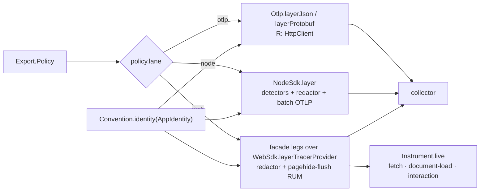

# [RUNTIME_EMIT]

`Export` owns the OTLP wire — egress and ingress of the telemetry plane in one module. Egress is one policy value and one Layer: `Export.live(policy)` composes the whole trace/metric/log export plane as a registration node providing `Hooks.Meter`, the lane selected by one policy row, every lane consuming the one `Resource` derived from `Convention.identity(policy.identity)` folded with the platform detectors. Ingress is the W3C continuation: `traceparent`/`tracestate`/`baggage` decode from any string-keyed carrier into an `Option`-carried parent continued by one total transformer.

`Redaction` is the one ambient scrub owner: rules ride a `Context.Reference` every capture seam reads — export-boundary span scrub here, capture seams in `crash`, baggage annotations inside the ingress transformer — one rule shape, one override at the root. `Hooks` is the consumer hook plane: taps, processors, exporters, views, and detectors contribute through append-only registry rows one SDK drain collects. `Instrument` registers the browser auto-instrumentation rows on the web lane's own tracer provider. `@opentelemetry` sdk/exporter machinery behind the SDK lanes is the `[OTEL_PIN_BLOCK]` pin block, collapsing as one unit when native `Otlp` parity closes — only the propagation codecs, `resources`, and `semantic-conventions` survive; the `plane:dev` DevTools row ships as its own `./dev` subpath module. Its module is `runtime/src/otel/emit.ts`.

## [01]-[CLUSTERS]

| [INDEX] | [CLUSTER]      | [OWNS]                                                                                            | [PUBLIC]            |
| :-----: | :------------- | :------------------------------------------------------------------------------------------------ | :------------------ |
|  [01]   | `POLICY`       | the one `Export.Policy` row: identity, collector, lane, cadence, sampling, limits                 | `Export`            |
|  [02]   | `REDACTION`    | the ambient scrub rules + the per-signal structural-safety ledger                                 | `Redaction`         |
|  [03]   | `HOOKS`        | the contribute-then-collect registry + the tap dispatch engine executing core's point vocabulary  | `Hooks`, `Dispatch` |
|  [04]   | `LANES`        | the native `Otlp` row, the `NodeSdk`/`WebSdk` rows, detectors, engine vitals, the roster dispatch | `Export`            |
|  [05]   | `INSTRUMENT`   | the `./browser` registration node: fetch/document-load/interaction over the zone                  | `Instrument`        |
|  [06]   | `CONTINUATION` | carrier decode + the ingress transformer + the egress stamp                                       | `Propagation`       |
|  [07]   | `DEV`          | the `plane:dev`-fenced `./dev` DevTools module                                                    | `dev`               |

## [02]-[POLICY]

[POLICY]:
- Owner: `Export.Policy` — one typed row carrying every export decision: the `AppIdentity` (whose settled dimensions — instance, namespace, environment — the `Convention.identity` projection stamps on the `Resource`, so no export field re-mints an identity fact), the collector endpoint and sealed headers, the lane and serialization, per-signal cadence as `Duration` rows, the head-sampling ratio, batch tuning, metric temporality, the base-2 exponential-histogram size, the tenant-cardinality budget, the span structural limits, the shutdown drain window, and the redaction rules. Transport rows — collector origin, sealed headers, cadence, sampling ratio — home in `Setting.otel` (`config#ADMISSION_ROWS`' described group), so the app root assembles the policy from the boot-validated `Setting` and its own identity value, and no export decision exists outside the one row.
- Law: the collector secret rides `Redacted` end-to-end — the policy's `headers` values are `Redacted<string>` sealed at config admission and unwrapped exactly once inside the lane construction, so an exporter credential can never print.
- Law: cadence, batch width, sampling ratio, temporality, and the span limits are policy values with stated defaults — a lane never hardcodes an interval, and tuning a fleet is a config edit; the OTLP signal paths derive from one base URL by the interior `_signal` projection, so a collector move is one field.
- Law: the `browser` group is the auto-instrumentation policy — `propagate` names the API origins granted CORS `traceparent` injection, `interaction.events` the admitted DOM event roster, `interaction.prevent` the per-event span-admission predicate — consumed only by `[06]`'s registration node, so a fetch-span origin or event admission is a policy row, never a literal at the browser root; its member types import type-only from the instrumentation packages, erased outside the browser condition.
- Law: the promotion key set is policy — `promote` carries the baggage key prefixes admitted onto span attributes (the `rasm.` prefix is the standing default carrying `Convention.rasm.tenant`), homed as a `Setting.otel` row; one `_admitted` predicate serves the ingress annotation fold and the SDK lanes' `BaggageSpanProcessor` row, so promotion has exactly one gate.
- Law: `placement` is the deploy-target fact arming the environment detectors — `cloud` selects at most one compute arm from the `_CLOUD` roster and `container` arms the cgroup row, so a detector never runs on a host it cannot answer — and `vitals` carries the engine-health rows: the `HostMetrics` group allow-list and the runtime-node `monitoringPrecision`.
- Growth: a new export decision is one policy field consumed by the lane rows; a new backend is a `baseUrl`/`headers` value, never a lane.
- Packages: `effect` (`Duration`, `Redacted`), `@rasm/ts/core` (`AppIdentity`, `Convention`).

```typescript
import {
  Array, Chunk, Context, Data, Duration, Effect, Exit, FiberSet, Function, HashMap, Layer, Option, pipe, Record, Redacted, Ref, Scope,
  type Cause, type Tracer,
} from "effect"
import type { HttpClient } from "@effect/platform"
import { Logger as OtelLogger, Metrics as OtelMetrics, NodeSdk, Otlp, Resource as OtelIdentity, Tracer as OtelBridge, WebSdk } from "@effect/opentelemetry"
import { TraceFlags, type Meter, type SpanContext } from "@opentelemetry/api"
import { BaggageSpanProcessor } from "@opentelemetry/baggage-span-processor"
import { AggregationTemporalityPreference, OTLPMetricExporter } from "@opentelemetry/exporter-metrics-otlp-http"
import { OTLPMetricExporter as ProtoMetricExporter } from "@opentelemetry/exporter-metrics-otlp-proto"
import { CompressionAlgorithm, OTLPTraceExporter } from "@opentelemetry/exporter-trace-otlp-http"
import { OTLPTraceExporter as ProtoTraceExporter } from "@opentelemetry/exporter-trace-otlp-proto"
import { OTLPLogExporter } from "@opentelemetry/exporter-logs-otlp-http"
import { OTLPLogExporter as ProtoLogExporter } from "@opentelemetry/exporter-logs-otlp-proto"
import { HostMetrics } from "@opentelemetry/host-metrics"
import { registerInstrumentations } from "@opentelemetry/instrumentation"
import { RuntimeNodeInstrumentation } from "@opentelemetry/instrumentation-runtime-node"
import { BatchLogRecordProcessor, type LogRecordProcessor } from "@opentelemetry/sdk-logs"
import { AggregationType, InstrumentType, MeterProvider, PeriodicExportingMetricReader, type IMetricReader, type ViewOptions } from "@opentelemetry/sdk-metrics"
import { BatchSpanProcessor, ParentBasedSampler, type Span, type SpanProcessor, TraceIdRatioBasedSampler } from "@opentelemetry/sdk-trace-base"
import { TraceState } from "@opentelemetry/core"
import { browserDetector } from "@opentelemetry/opentelemetry-browser-detector"
import { awsBeanstalkDetector, awsEc2Detector, awsEcsDetector, awsEksDetector, awsLambdaDetector } from "@opentelemetry/resource-detector-aws"
import { containerDetector } from "@opentelemetry/resource-detector-container"
import { gcpDetector } from "@opentelemetry/resource-detector-gcp"
import {
  detectResources, envDetector, hostDetector, osDetector, processDetector, resourceFromAttributes, type Resource as OtelResource,
  serviceInstanceIdDetector, type ResourceDetector,
} from "@opentelemetry/resources"
import type { EventName, ShouldPreventSpanCreation } from "@opentelemetry/instrumentation-user-interaction"
import { type AppIdentity, Carrier, Convention, Tap } from "@rasm/ts/core"
import { Life } from "../proc/life.ts"

declare namespace Export {
  type Lane = keyof typeof _lanes
  type Policy = {
    readonly identity: AppIdentity
    readonly collector: {
      readonly baseUrl: string
      readonly headers: Readonly<Record<string, Redacted.Redacted<string>>>
    }
    readonly lane: Lane
    readonly serialization: "json" | "protobuf"
    readonly cadence: {
      readonly logs: Duration.Duration
      readonly metrics: Duration.Duration
      readonly traces: Duration.Duration
    }
    readonly sampling: { readonly ratio: number }
    readonly batch: { readonly maxExportBatchSize: number; readonly maxQueueSize: number }
    readonly limits: { readonly attributeValueLengthLimit: number; readonly attributeCountLimit: number }
    readonly temporality: "cumulative" | "delta"
    readonly histogram: { readonly maxSize: number }
    readonly cardinality: { readonly tenant: number }
    readonly promote: ReadonlyArray<string>
    readonly placement: {
      readonly cloud: keyof typeof _CLOUD
      readonly container: boolean
    }
    readonly vitals: {
      readonly groups: ReadonlyArray<string>
      readonly precision: number
    }
    readonly browser: {
      readonly propagate: ReadonlyArray<string | RegExp>
      readonly interaction: {
        readonly events: ReadonlyArray<EventName>
        readonly prevent: ShouldPreventSpanCreation
      }
    }
    readonly shutdown: Duration.Duration
    readonly redaction: Redaction.Rules
  }
  type Context = HttpClient.HttpClient | Hooks | Life
  type Live = Layer.Layer<Hooks.Meter, never, Context>
  type Browser = Layer.Layer<Hooks.Meter | OtelBridge.OtelTracerProvider, never, Context>
  type Of<P extends Policy> = ReturnType<(typeof _lanes)[P["lane"]]>
}

const _signal = (policy: Export.Policy, signal: "logs" | "metrics" | "traces"): string =>
  `${policy.collector.baseUrl}/v1/${signal}`

const _admitted = (promote: ReadonlyArray<string>) => (key: string): boolean =>
  Array.some(promote, (prefix) => key.startsWith(prefix))
```

## [03]-[REDACTION]

[REDACTION]:
- Owner: `Redaction` — the one scrub owner of the branch: `Rules` as data (sealed attribute keys and value patterns), one total `scrub` fold over any open attribute bag, `processor(rules)` materializing the rules as an OTel `SpanProcessor` whose `onEnding` hook overwrites deny-keyed and pattern-matched span attributes with the sealed sentinel before the span freezes for export, and `Redaction.Current` — a `Context.Reference` defaulting to `defaults` — so every capture seam reads the live rule set at zero requirement pressure and the app root overrides once with the policy's own rows.
- Law: the scrub signature is the open read-side record — `Convention.Bag` in, `Convention.Bag` out — because scrubbed material lawfully carries keys the vocabulary never minted (platform tracer attributes, foreign baggage, crash-context bags); a scrub seam demanding the closed `Convention.Attributes` stamping record is the inverted-trust defect the convention page names.
- Law: the signals are safe by distinct mechanisms, and the ledger is explicit over four consumption sites — metrics carry only bounded-vocabulary tags, so no metric attribute can hold PII by construction; span attributes scrub structurally through `Redaction.processor` at the export boundary; log annotations scrub at their capture seams — the crash owner's breadcrumb record and fatal forensic band (`crash#REPLAY`, `crash#CAPTURE`) and this module's own baggage ingress (`[07]`) all fold the identical `Rules` value read from `Redaction.Current` — so a new PII class lands as one row every site inherits and no annotation path exists outside the fold.
- Law: the native `Otlp` lane exposes no span-attribute hook — export-boundary span scrub is therefore an `[OTEL_PIN_BLOCK]` parity criterion: a deployment whose compliance posture mandates boundary scrub selects an SDK lane until the native lane grows the hook, a selection pressure recorded on the lane card, never worked around with a fork.
- Law: `defaults` seals the identifier-grade semconv keys — `client.address`, `user_agent.original`, `url.full` — and the pattern rows mask bearer tokens and email shapes inside surviving string values — scalar and string-array element alike; app policies extend by row composition, never by a second scrub.
- Exemption: the `SpanProcessor` hooks are the OTel SDK's own callback contract — the platform-forced statement seam where `setAttribute` writes cross back into the span before it freezes.
- Law: `onEnding` is the correct hook and a pin-watch fact — it hands a mutable `Span` where `onEnd` hands only a `ReadableSpan`; the member carries the SDK's `@experimental` flag, so it rides the `[OTEL_PIN_BLOCK]` pin block's watch list, never a design change.
- Growth: a new PII class is one `sealed` key row or one `patterns` row.
- Packages: `effect` (`Array`, `Context`, `Record`), `@opentelemetry/sdk-trace-base` (`SpanProcessor`).

```typescript
declare namespace Redaction {
  type Rules = {
    readonly patterns: ReadonlyArray<RegExp>
    readonly sealed: ReadonlyArray<string>
  }
}

const _SEAL = "<redacted>"

const _defaults: Redaction.Rules = {
  patterns: [/bearer\s+[a-z0-9._-]+/gi, /[a-z0-9._%+-]+@[a-z0-9.-]+\.[a-z]{2,}/gi],
  sealed: [Convention.attr.clientAddress, Convention.attr.userAgent, Convention.attr.urlFull],
}

class _Current extends Context.Reference<_Current>()("runtime/Redaction", {
  defaultValue: (): Redaction.Rules => _defaults,
}) {}

const _mask = (rules: Redaction.Rules, text: string): string =>
  Array.reduce(rules.patterns, text, (held, pattern) => held.replace(pattern, _SEAL))

const _masked = (rules: Redaction.Rules, value: Convention.Bag[string]): Convention.Bag[string] =>
  typeof value === "string"
    ? _mask(rules, value)
    : Array.isArray(value)
      ? Array.map(value, (entry) => (typeof entry === "string" ? _mask(rules, entry) : entry))
      : value

const _scrub = (rules: Redaction.Rules, bag: Convention.Bag): Convention.Bag =>
  Record.map(bag, (value, key) => (Array.contains(rules.sealed, key) ? _SEAL : _masked(rules, value)))

const _processor = (rules: Redaction.Rules): SpanProcessor => ({
  forceFlush: () => Promise.resolve(),
  onEnd: () => undefined,
  onEnding: (span: Span) => {
    const attributes = Record.filterMap(span.attributes, (value) => Option.fromNullable(value))
    for (const [key, value] of Object.entries(_scrub(rules, attributes))) {
      span.setAttribute(key, value)
    }
  },
  onStart: () => undefined,
  shutdown: () => Promise.resolve(),
})

const Redaction: {
  readonly Current: typeof _Current
  readonly defaults: Redaction.Rules
  readonly processor: (rules: Redaction.Rules) => SpanProcessor
  readonly scrub: (rules: Redaction.Rules, bag: Convention.Bag) => Convention.Bag
} = {
  Current: _Current,
  defaults: _defaults,
  processor: _processor,
  scrub: _scrub,
}
```

## [04]-[HOOKS]

[HOOKS]:
- Owner: `Hooks` — the consumer hook plane of the telemetry pipeline: one accumulating registry of `SpanProcessor` taps, `IMetricReader` rows, `LogRecordProcessor` sinks, `ViewOptions` reshaping rows, and `ResourceDetector` enrichers. A feature, app, or tenant plane contributes through `Hooks.contribute` — a `Layer.effectDiscard` that appends its rows — and exactly one drain exists: the SDK lanes build their `Configuration` inside `NodeSdk.layer(Effect<Configuration>)` / `WebSdk.layer(Effect<Configuration>)`, folding the collected rows behind the policy's own, while `_meter` exposes the scoped raw-OTel `MeterProvider` as `Hooks.Meter` for third-party instruments.
- Law: contributions are order-independent appends with zero global effects — no `register()`, no global provider, no module side effect; the registry is a service, a proof overrides it wholesale, and an append after the drain is construction-order misuse the root's Layer ordering makes unspellable (`Export.live` composes after every contributor).
- Law: tenant isolation rides the plane — baggage-to-span promotion is the shipped `BaggageSpanProcessor` row the SDK lanes wire from `policy.promote` under the one `_admitted` predicate, so `Convention.rasm.tenant` rides the `rasm.` prefix and one tenant projection has one exact spelling; a per-tenant metric stream is one contributed reader, and identity scopes every stream, so multi-app deployments never tangle.
- Law: view rows govern cardinality — `ViewOptions` carries the allow-list primary (`attributesProcessors: [createAllowListAttributesProcessor(keys)]`) with `aggregationCardinalityLimit` as the circuit-breaker above it, and the per-reader `cardinalityLimits` ceiling sits above every per-view max. Effect's facade producer keeps the policy and contributed readers; the raw-OTel producer is a scoped `MeterProvider({ resource, views, readers })` under `Hooks.Meter`, so third-party instruments obtain a local meter through the Layer graph and contributed views execute on the SDK surface that owns them without `metrics.setGlobalMeterProvider`.
- Law: `Hooks.meter(pkg)` is the one scoped-meter accessor — it reads the raw `MeterProvider` off `Hooks.Meter` and names its `getMeter` scope `Convention.scope(pkg)`, so a package's third-party instruments stamp the single `@rasm/<pkg>` instrumentation scope and no signal site spells a free-string scope; Effect's own metrics ride the app `Resource` scope the facade fixes, so this seam is the sole per-package scope site.
- Law: `Hooks.Dispatch` executes the core `Tap` vocabulary — `mount` admits a core-validated `Tap.Registry`, installing each subscription into a point-keyed rail scoped by the registry's `AppIdentity.Key` so two apps composing identical point names occupy distinct rails, and `publish(app, point, fact)` is the publisher's one entry returning the veto verdict as data, so the emitting fold consumes refusal as a value and dispatch never re-opens the zero-exporter boundary.
- Law: dispatch reads the modality table's columns, never names — a `feedback` row joins the pure veto fold (first refusal wins, before any journal write or delivery), a `buffered` row drains the point's retained window at mount then receives live facts, and every non-feedback delivery forks onto an isolated fiber in the engine's scoped `FiberSet`; a subscriber fault folds through `Tap.isolated` into `Breach` evidence landing as an annotated warning on the log rail — never the publisher's failure — and the interruption-only cause folds to none, so a cancelled delivery never reads as breach.
- Law: the replay journal is a bounded ring — `policy.journal` deep, appended only for points whose modality set admits the buffered column — so replay is a warm-up window, never durable history, and telemetry-as-tap holds by construction: a signal emitter mounts as a `Tap.emitter` subscription like any observer, and an emit call inside a domain fold has no spelling on this plane.
- Growth: a new hook class (an exporter tap, a scrub point, a sampling processor) is one `Rows` slot consumed by the same drain; `add` widens with the slot, never a new verb; a new dispatch modality is a core table row the column reads absorb with zero executor edits.
- Packages: `effect` (`Chunk`, `Data`, `Effect`, `FiberSet`, `HashMap`, `Layer`, `Ref`), `@opentelemetry/sdk-trace-base` (`SpanProcessor`), `@opentelemetry/sdk-metrics` (`MeterProvider`, `IMetricReader`, `ViewOptions`), `@opentelemetry/sdk-logs` (`LogRecordProcessor`), `@opentelemetry/resources` (`ResourceDetector`), `@opentelemetry/api` (`Meter`), `@rasm/ts/core` (`Convention`, `Tap`).

```typescript
declare namespace Hooks {
  type Meter = _Meter
  type Rows = {
    readonly detectors: ResourceDetector
    readonly logs: LogRecordProcessor
    readonly readers: IMetricReader
    readonly spans: SpanProcessor
    readonly views: ViewOptions
  }
  type Drained = { readonly [K in keyof Rows]: ReadonlyArray<Rows[K]> }
}

class _Meter extends Context.Tag("runtime/Hooks/Meter")<_Meter, MeterProvider>() {}

declare namespace Dispatch {
  type Policy = { readonly journal: number }
  type Verdict = Option.Option<InstanceType<typeof Tap.Veto>>
  type Entry = {
    readonly journal: Chunk.Chunk<unknown>
    readonly taps: Chunk.Chunk<{ readonly buffered: boolean; readonly deliver: (fact: unknown) => Effect.Effect<void> }>
    readonly vetoes: Chunk.Chunk<(fact: unknown) => Verdict>
  }
}

const _EMPTY_RAIL: Dispatch.Entry = { journal: Chunk.empty(), taps: Chunk.empty(), vetoes: Chunk.empty() }

const _amended = (
  rails: Ref.Ref<HashMap.HashMap<Data.Data<readonly [string, string]>, Dispatch.Entry>>,
  key: Data.Data<readonly [string, string]>,
  grow: (entry: Dispatch.Entry) => Dispatch.Entry,
): Effect.Effect<void> =>
  Ref.update(rails, (held) => HashMap.modifyAt(held, key, (slot) => Option.some(grow(Option.getOrElse(slot, () => _EMPTY_RAIL)))))

const _isolated = <A>(point: Tap.Point<A>, label: string, run: (fact: A) => Effect.Effect<void, unknown>) =>
  // BOUNDARY ADAPTER: erasure seam — the closure mints where A is bound, so the erased rail re-admits only the point's own facts
  (fact: unknown): Effect.Effect<void> =>
    run(fact as A).pipe(
      Effect.catchAllCause((cause: Cause.Cause<unknown>) =>
        Option.match(Tap.isolated(point.name, label)(cause), {
          onNone: () => Effect.void, // interruption-only cause: a cancelled delivery never reads as breach
          onSome: (breach) =>
            Effect.annotateLogs(Effect.logWarning("<tap-breach>"), {
              class: breach.class,
              point: breach.point,
              subscriber: breach.label,
            }),
        })),
    )

class _Dispatch extends Effect.Service<_Dispatch>()("runtime/Hooks/Dispatch", {
  scoped: (policy: Dispatch.Policy) =>
    Effect.gen(function* () {
      const rails = yield* Ref.make(HashMap.empty<Data.Data<readonly [string, string]>, Dispatch.Entry>())
      const fibers = yield* FiberSet.make() // scope-bound: every delivery fiber dies with the graph, so a leaked subscriber is unspellable
      const gate = yield* Effect.makeSemaphore(1) // mount replay and live publish share one order; no point lands between warm-up and enrollment
      const enroll = <A>(app: AppIdentity.Key, label: string, sub: Tap.Subscription<A>): Effect.Effect<void> => {
        const key = Data.tuple(app as string, sub.point.name as string)
        const row = Tap[Tap.modality(sub.handler)] // column-driven: feedback selects the veto fold, buffered the window-then-live delivery
        const handler = sub.handler
        return gate.withPermits(1)(handler._tag === "Veto"
          ? _amended(rails, key, (entry) => ({
              ...entry,
              vetoes: Chunk.append(entry.vetoes, (fact: unknown) => handler.decide(fact as A)), // BOUNDARY ADAPTER: same erasure seam as the delivery closure
            }))
          : pipe(_isolated(sub.point, label, handler.run), (deliver) =>
              Effect.zipRight(
                Effect.when(
                  Effect.flatMap(Ref.get(rails), (held) =>
                    Effect.forEach(
                      Option.getOrElse(HashMap.get(held, key), () => _EMPTY_RAIL).journal,
                      (fact) => FiberSet.run(fibers, deliver(fact)),
                      { discard: true },
                    )),
                  () => row.buffered, // the buffered column drains the retained window before live facts arrive
                ),
                _amended(rails, key, (entry) => ({ ...entry, taps: Chunk.append(entry.taps, { buffered: row.buffered, deliver }) })),
              )))
      }
      const fanned = <A>(key: Data.Data<readonly [string, string]>, point: Tap.Point<A>, fact: A, entry: Dispatch.Entry): Effect.Effect<Dispatch.Verdict> =>
        Effect.as(
          Effect.zipRight(
            Effect.when(
              _amended(rails, key, (held) => ({
                ...held,
                journal: Chunk.takeRight(Chunk.append(held.journal, fact), policy.journal), // bounded ring: the window is policy, never unbounded history
              })),
              () => Array.some(point.modalities, (modality) => Tap[modality].buffered), // journal only where the point admits replay
            ),
            Effect.forEach(entry.taps, (tap) => FiberSet.run(fibers, tap.deliver(fact)), { discard: true }),
          ),
          Option.none(),
        )
      return {
        mount: <T extends Record<string, unknown>>(registry: Tap.Registry<T>): Effect.Effect<void> =>
          Effect.forEach(
            Record.toEntries(registry.rows),
            ([label, sub]) => enroll(registry.app, label, sub),
            { discard: true },
          ),
        publish: <A>(app: AppIdentity.Key, point: Tap.Point<A>, fact: A): Effect.Effect<Dispatch.Verdict> =>
          gate.withPermits(1)(Effect.flatMap(Ref.get(rails), (held) => {
            const key = Data.tuple(app as string, point.name as string)
            const entry = Option.getOrElse(HashMap.get(held, key), () => _EMPTY_RAIL)
            return Option.match(Chunk.head(Chunk.filterMap(entry.vetoes, (decide) => decide(fact))), {
              // This pure veto fold: first refusal wins, before any journal write or delivery
              onNone: () => fanned(key, point, fact, entry),
              onSome: (veto) => Effect.succeed(Option.some(veto)),
            })
          })),
      }
    }),
}) {}

class Hooks extends Effect.Service<Hooks>()("runtime/Hooks", {
  effect: Effect.gen(function* () {
    const cells: { readonly [K in keyof Hooks.Rows]: Ref.Ref<Chunk.Chunk<Hooks.Rows[K]>> } = {
      detectors: yield* Ref.make(Chunk.empty<ResourceDetector>()),
      logs: yield* Ref.make(Chunk.empty<LogRecordProcessor>()),
      readers: yield* Ref.make(Chunk.empty<IMetricReader>()),
      spans: yield* Ref.make(Chunk.empty<SpanProcessor>()),
      views: yield* Ref.make(Chunk.empty<ViewOptions>()),
    }
    return {
      // one keyed append serves every slot: the mapped cell annotation correlates kind to row type, so the indexed write is cast-free
      add: <K extends keyof Hooks.Rows>(kind: K, row: Hooks.Rows[K]): Effect.Effect<void> =>
        Ref.update(cells[kind], (held) => Chunk.append(held, row)),
      drained: Effect.map(
        Effect.all({
          detectors: Ref.get(cells.detectors),
          logs: Ref.get(cells.logs),
          readers: Ref.get(cells.readers),
          spans: Ref.get(cells.spans),
          views: Ref.get(cells.views),
        }),
        (held): Hooks.Drained => ({
          detectors: Chunk.toReadonlyArray(held.detectors),
          logs: Chunk.toReadonlyArray(held.logs),
          readers: Chunk.toReadonlyArray(held.readers),
          spans: Chunk.toReadonlyArray(held.spans),
          views: Chunk.toReadonlyArray(held.views),
        }),
      ),
    }
  }),
}) {
  static readonly Meter = _Meter
  static readonly Dispatch = _Dispatch
  static readonly contribute = (tap: (hooks: Hooks) => Effect.Effect<void>): Layer.Layer<never, never, Hooks> =>
    Layer.effectDiscard(Effect.flatMap(Hooks, tap))
  // This one raw-OTel meter seam: a package names its instrumentation scope through Convention, never a free string
  static readonly meter = (pkg: string): Effect.Effect<Meter, never, _Meter> =>
    Effect.map(_Meter, (provider) => provider.getMeter(Convention.scope(pkg)))
}
```

## [05]-[LANES]

[LANES]:
- Owner: the interior `_lanes` roster — `as const satisfies Record<string, (policy) => Layer>` — with `Export.live(policy)` as the one entrypoint dispatching `_lanes[policy.lane](policy)`; the lane union derives as `keyof typeof _lanes`, so config admission, the policy type, and the dispatch read one anchor, and a new lane is one row.
- Law: the native `otlp` row is the default — Effect's own `Tracer`/`Metric`/`Logger` serialize straight to the collector over the `HttpClient.HttpClient` requirement the root satisfies with `client#LANE_ROWS`'s policy client (node/bun) or the browser client, so OTLP egress inherits the branch timeout/retry posture; serialization selects `Otlp.layerJson` versus `Otlp.layerProtobuf`, and the policy's `shutdown` window rides the lane's `shutdownTimeout` so the drain budget is one stated value.
- Law: identity is detected, awaited, then projected — the node-process rosters fold `detectResources` over the platform detector roster (`envDetector`, `hostDetector`, `osDetector`, `processDetector`, `serviceInstanceIdDetector`) and the placement-armed environment rows — `_CLOUD[policy.placement.cloud]` contributes at most one compute arm (`awsEc2Detector`, `awsEcsDetector`, `awsEksDetector`, `awsBeanstalkDetector`, `awsLambdaDetector`, `gcpDetector`) and `containerDetector` arms on the container fact — cross `waitForAsyncAttributes()` whenever `asyncAttributesPending` is true, and merge the result beneath the `Convention.identity` base pinned to `Convention.wire.schemaUrl`, so every SDK-lane `Resource` declares its semconv schema. Incubating `host.name`/`k8s.pod.name`/`process.pid` rows are complete before the first exporter observes them, the identity projection always wins on collision, and a raw `@opentelemetry/resources` value never leaves this module; the native row's facade resource carries the projection alone without a schema slot — an `[OTEL_PIN_BLOCK]` parity criterion beside the span-scrub hook — while the web roster folds `browserDetector`, so RUM identity carries the `browser.*` client-hint facts. One `_resource` fold feeds every lane its `_grounds`/`_rum` roster, so `OtlpResource.fromConfig` — the config-sourced facade mint — is the rejected second identity path.
- Law: the SDK rows exist for SDK-only capability — the boundary span scrub, baggage promotion, explicit temporality, structural span limits, the hook plane — and each is one facade `Configuration` built as an `Effect` that drains `Hooks` behind the policy's own rows: the `node` row wires the `BaggageSpanProcessor` promotion row then `Redaction.processor` before a `BatchSpanProcessor` over the `_wire` trace exporter (`compression: gzip`, `keepAlive`) with contributed span taps between — promotion writes before the span freezes, so the boundary scrub still governs a promoted key — the shared `_reader` beside contributed readers, a `ParentBasedSampler({ root: new TraceIdRatioBasedSampler(ratio) })` tracer config carrying the policy's `spanLimits` — the structural attribute caps that complement the scrub; the `web` row assembles the same `_sdk` configuration through the facade's public legs — `WebSdk.layerTracerProvider` under the `Tracer`, `Metrics`, and `Logger` bridge layers over `Resource.layer` — because the graph must expose `OtelBridge.OtelTracerProvider` for `[06]`'s registration node, a Tag `WebSdk.layer` conceals; the browser `BatchSpanProcessor` flushes on pagehide so RUM spans drain before navigation; neither row calls `register()` — the facade owns context wiring through the fiber-backed tracer.
- Law: wire encoding is a serializer binding, never a fork — the `_wire` table dispatches `policy.serialization` between the `-http` json exporter family and the `-proto` protobuf family (`OTLPTraceExporter`/`OTLPMetricExporter`/`OTLPLogExporter` under both package roots) with the same headers, temporality, cardinality, and batch rows on both arms, so the estate's OTLP/HTTP+protobuf sole-egress mandate holds on the SDK lanes exactly as on the native lane and the C# host's protobuf-only collector posture needs no JSON side door.
- Law: engine health is first-class on the node-process lanes — `_vitals` binds `HostMetrics` (group allow-list from `policy.vitals.groups`) and `RuntimeNodeInstrumentation` (`monitoringPrecision` from `policy.vitals.precision`) against the raw provider `Hooks.Meter` exposes; the registration unload tears down runtime-node instrumentation, and the enclosing raw-provider shutdown retires the HostMetrics observables. Event-loop delay/utilization, GC-duration, and V8 heap series ride the same resource identity as every span and log; the web row never carries it, and the `v8js.*` attribute fan stays governed by the deny-list view row (`meter#ENGINE`).
- Law: metric-provider construction splits by plane — the facade lanes never construct a `MeterProvider` (`Metrics.layer` behind `NodeSdk`/`WebSdk` owns the Effect-metric provider; the lanes hand it readers), and `_meter`'s scoped raw provider is the ONE sanctioned raw construction, existing solely because the third-party instrument plane (`HostMetrics`, `RuntimeNodeInstrumentation`) demands a raw provider the facade conceals; both planes share the one `_reader` value, so reader, exporter, temporality, cardinality, and base-2 exponential-histogram policy cannot drift between them.
- Law: histogram aggregation is a selector, never per-instrument setup — `_aggregation(policy)` maps `InstrumentType.HISTOGRAM` onto `AggregationType.EXPONENTIAL_HISTOGRAM` with the policy's bounded `maxSize`, leaves every other type on `DEFAULT`, and feeds both OTLP serializer rows through `aggregationPreference`; current-span exemplars therefore ride the same metric stream whose stores and dashboards declare exemplar support.
- Law: the SDK rows carry the full three-signal egress — the log leg is a `BatchLogRecordProcessor` over the `_wire` log exporter on `Configuration.logRecordProcessor` beside contributed log sinks, so an SDK-lane deployment exports logs to the same collector under the same batch discipline and the same serialization row, and a parallel log sink beside the replaced process logger is the named defect; the offline/air-gapped tier is `PlatformLogger.toFile(path, { batchWindow })` added beside the wire logger at the root — an additive `Logger` row, never a fork.
- Law: metric temporality is the policy row mapped to `AggregationTemporalityPreference` — `delta` the fact-stream default, `cumulative` the monotonic-totals alternative — and the tenant-cardinality budget rides the reader's `cardinalityLimits`, the governed ceiling the data fact journal's tenant tag operates under.
- Law: `Export.live` returns one registration node providing `Hooks.Meter` with the native lane's `HttpClient` requirement in `R` — merged once at the composition root; construction observability attaches at the Layer value (`Layer.annotateLogs`), and a boot-time collector outage is Layer construction policy, never a runtime branch. `_managed` acquires the child `Scope` through the outer scope's release bracket before building the selected lane, then registers `Scope.close(scope, Exit.void)` as the standing rank-90 telemetry row through `Life.register`; exporters flush inside the ordered drain, while any build or registration failure still closes the child scope.
- Law: browser auto-instrumentation is `[06]`'s registration node riding the web row's exposed provider — `Export.Of` derives each lane's return type off the `_lanes` roster, so `Export.live` answers `Export.Browser` exactly when `policy.lane` is `"web"` and a native-lane root composing `Instrument.live` dies at the requirement channel; `Vital.enrich` stays the library-side timing projection over the spans those rows open.
- Entry: `Export.live(policy)` merged beneath `Hooks.Default` and after every `Hooks.contribute` node, so the drain observes the full contribution set.
- Growth: a new lane (OTLP/gRPC, a vendor exporter) is one `_lanes` row with any policy field it reads; a new deploy target is one `_CLOUD` row.
- Packages: `@effect/opentelemetry` (`Otlp`, `NodeSdk`, `WebSdk`, `Tracer`, `Metrics`, `Logger`, `Resource`), `@opentelemetry/resources` (`detectResources`, the detector roster), `@opentelemetry/resource-detector-aws`/`-container`/`-gcp` and `@opentelemetry/opentelemetry-browser-detector` (the placement rows), `@opentelemetry/host-metrics` + `@opentelemetry/instrumentation-runtime-node` (the engine-vitals rows), `@opentelemetry/baggage-span-processor`, the `[OTEL_PIN_BLOCK]` SDK block (`sdk-trace-base`, `sdk-metrics`, `sdk-logs`, the `exporter-*-otlp-http` and `exporter-*-otlp-proto` trios).



```typescript
const _headers = (policy: Export.Policy): Record<string, string> =>
  Record.map(policy.collector.headers, Redacted.value)

const _DETECTORS: ReadonlyArray<ResourceDetector> = [
  envDetector, hostDetector, osDetector, processDetector, serviceInstanceIdDetector,
]

const _CLOUD = {
  beanstalk: [awsBeanstalkDetector],
  ec2: [awsEc2Detector],
  ecs: [awsEcsDetector],
  eks: [awsEksDetector],
  gcp: [gcpDetector],
  lambda: [awsLambdaDetector],
  none: [],
} as const satisfies Record<string, ReadonlyArray<ResourceDetector>>

const _placed = (placement: Export.Policy["placement"]): ReadonlyArray<ResourceDetector> => [
  ..._CLOUD[placement.cloud], // at most one compute arm: the placement declares its cloud, the row supplies its detector
  ...(placement.container ? [containerDetector] : []),
]

const _grounds = (policy: Export.Policy) => (adds: ReadonlyArray<ResourceDetector>): ReadonlyArray<ResourceDetector> =>
  [..._DETECTORS, ..._placed(policy.placement), ...adds]

const _rum = (adds: ReadonlyArray<ResourceDetector>): ReadonlyArray<ResourceDetector> => [browserDetector, ...adds]

type _Resource = {
  readonly facade: {
    readonly attributes: Convention.Bag
    readonly serviceName: string
    readonly serviceVersion: string
  }
  readonly otel: OtelResource
}

const _resource = (policy: Export.Policy, roster: ReadonlyArray<ResourceDetector>): Effect.Effect<_Resource> =>
  Effect.promise(async () => {
    const resource = detectResources({ detectors: [...roster] })
      .merge(resourceFromAttributes(Convention.identity(policy.identity), { schemaUrl: Convention.wire.schemaUrl }))
    if (resource.asyncAttributesPending) {
      await resource.waitForAsyncAttributes?.()
    }
    return {
      facade: {
        attributes: Record.filterMap(resource.attributes, (value) => Option.fromNullable(value)),
        serviceName: policy.identity.app,
        serviceVersion: policy.identity.build.version,
      },
      otel: resource,
    }
  })

const _temporality = {
  cumulative: AggregationTemporalityPreference.CUMULATIVE,
  delta: AggregationTemporalityPreference.DELTA,
} as const

const _wire = {
  // wire encoding is a serializer binding: one table row per serialization, one exporter shape, zero forks
  json: { logs: OTLPLogExporter, metrics: OTLPMetricExporter, traces: OTLPTraceExporter },
  protobuf: { logs: ProtoLogExporter, metrics: ProtoMetricExporter, traces: ProtoTraceExporter },
} as const

const _aggregation = (policy: Export.Policy) => (instrument: InstrumentType) =>
  instrument === InstrumentType.HISTOGRAM
    ? { type: AggregationType.EXPONENTIAL_HISTOGRAM, options: { maxSize: policy.histogram.maxSize, recordMinMax: true } } as const
    : { type: AggregationType.DEFAULT } as const

const _reader = (policy: Export.Policy): PeriodicExportingMetricReader =>
  // This one reader spelling both metric planes share: facade lane and raw provider cannot drift on cadence, temporality, or ceiling
  new PeriodicExportingMetricReader({
    cardinalityLimits: { default: policy.cardinality.tenant },
    exportIntervalMillis: Duration.toMillis(policy.cadence.metrics),
    exporter: new _wire[policy.serialization].metrics({
      aggregationPreference: _aggregation(policy),
      headers: _headers(policy),
      temporalityPreference: _temporality[policy.temporality],
      url: _signal(policy, "metrics"),
    }),
  })

const _sdk = (policy: Export.Policy, adds: Hooks.Drained, roster: ReadonlyArray<ResourceDetector>) =>
  Effect.map(_resource(policy, roster), (resource) => ({
    logRecordProcessor: [
      new BatchLogRecordProcessor(
        new _wire[policy.serialization].logs({ headers: _headers(policy), url: _signal(policy, "logs") }),
      ),
      ...adds.logs,
    ],
    metricReader: [_reader(policy), ...adds.readers],
    resource: resource.facade,
    shutdownTimeout: policy.shutdown,
    spanProcessor: [
      new BaggageSpanProcessor(_admitted(policy.promote)), // promotion precedes the scrub, so a promoted key matching a deny rule still seals
      Redaction.processor(policy.redaction),
      ...adds.spans,
      new BatchSpanProcessor(
        new _wire[policy.serialization].traces({
          compression: CompressionAlgorithm.GZIP,
          headers: _headers(policy),
          keepAlive: true,
          url: _signal(policy, "traces"),
        }),
        policy.batch,
      ),
    ],
    tracerConfig: {
      sampler: new ParentBasedSampler({ root: new TraceIdRatioBasedSampler(policy.sampling.ratio) }),
      spanLimits: policy.limits,
    },
  }))

const _drained = Effect.flatMap(Hooks, (hooks) => hooks.drained)

const _meter = (
  policy: Export.Policy,
  roster: (adds: ReadonlyArray<ResourceDetector>) => ReadonlyArray<ResourceDetector>,
): Layer.Layer<_Meter, never, Hooks> =>
  Layer.scoped(
    _Meter,
    Effect.acquireRelease(
      Effect.flatMap(_drained, (adds) =>
        Effect.map(_resource(policy, roster(adds.detectors)), (resource) =>
          new MeterProvider({
            // This one sanctioned raw construction: the third-party instrument plane needs the provider the facade conceals
            resource: resource.otel,
            readers: [_reader(policy)],
            views: [...adds.views],
          }))),
      (provider) => Effect.promise(() => provider.forceFlush().then(() => provider.shutdown())),
    ),
  )

const _vitals = (policy: Export.Policy): Layer.Layer<never, never, _Meter> =>
  Layer.scopedDiscard(
    Effect.flatMap(_Meter, (provider) =>
      Effect.acquireRelease(
        Effect.sync(() => {
          new HostMetrics({ meterProvider: provider, metricGroups: [...policy.vitals.groups], name: policy.identity.app }).start()
          return registerInstrumentations({
            instrumentations: [new RuntimeNodeInstrumentation({ monitoringPrecision: policy.vitals.precision })],
            meterProvider: provider,
          })
        }),
        (unload) => Effect.sync(unload),
      )),
  )

const _lanes = {
  node: (policy: Export.Policy): Export.Live =>
    Layer.merge(
      Layer.discard(NodeSdk.layer(Effect.flatMap(_drained, (adds) => _sdk(policy, adds, _grounds(policy)(adds.detectors))))),
      _vitals(policy).pipe(Layer.provideMerge(_meter(policy, _grounds(policy)))),
    ),
  otlp: (policy: Export.Policy): Export.Live =>
    Layer.merge(
      Layer.unwrapEffect(
        Effect.map(_resource(policy, []), (resource) => // the native row carries the projection alone: no detector runs on this facade resource
          Layer.discard((policy.serialization === "protobuf" ? Otlp.layerProtobuf : Otlp.layerJson)({
            baseUrl: policy.collector.baseUrl,
            headers: _headers(policy),
            loggerExportInterval: policy.cadence.logs,
            maxBatchSize: policy.batch.maxExportBatchSize,
            metricsExportInterval: policy.cadence.metrics,
            resource: resource.facade,
            shutdownTimeout: policy.shutdown,
            tracerExportInterval: policy.cadence.traces,
          }))),
      ),
      _vitals(policy).pipe(Layer.provideMerge(_meter(policy, _grounds(policy)))), // both node-process lanes carry engine health; the raw provider still detects
    ),
  web: (policy: Export.Policy): Export.Browser =>
    Layer.merge(
      Layer.unwrapEffect(
        Effect.map(Effect.flatMap(_drained, (adds) => _sdk(policy, adds, _rum(adds.detectors))), (config) =>
          Layer.mergeAll(
            OtelBridge.layer,
            OtelMetrics.layer(() => [...config.metricReader]),
            Layer.provide(OtelLogger.layerLoggerAdd, OtelLogger.layerLoggerProvider(config.logRecordProcessor)),
          ).pipe(
            // provideMerge keeps OtelTracerProvider public: Instrument registers on the SAME provider, never a second one
            Layer.provideMerge(WebSdk.layerTracerProvider(config.spanProcessor, config.tracerConfig)),
            Layer.provideMerge(OtelIdentity.layer(config.resource)),
          )),
      ),
      _meter(policy, _rum),
    ),
} as const satisfies Record<string, (policy: Export.Policy) => Export.Live | Export.Browser>

const _managed = <Out>(policy: Export.Policy, lane: Layer.Layer<Out, never, Export.Context>): Layer.Layer<Out, never, Export.Context> =>
  Layer.scopedContext(
    Effect.gen(function* () {
      const scope = yield* Effect.acquireRelease(
        Scope.make(),
        (held) => Scope.close(held, Exit.void),
      )
      const context = yield* Layer.buildWithScope(lane, scope)
      yield* Life.register({
        label: "telemetry",
        rank: 90,
        budget: Option.some(policy.shutdown),
        run: Scope.close(scope, Exit.void),
      }).pipe(Effect.orDie)
      return context
    }),
  )

const Export: {
  readonly live: <const P extends Export.Policy>(policy: P) => Export.Of<P>
} = {
  live: (policy) => Layer.annotateLogs(_managed(policy, _lanes[policy.lane](policy)), { lane: policy.lane }),
}
```

## [06]-[INSTRUMENT]

[INSTRUMENT]:
- Owner: `Instrument` — the browser auto-instrumentation registration node on the sibling `otel/instrument` module the `./browser` condition alone resolves (importing `@opentelemetry/context-zone` patches the global `Zone`, so the module split fences the side effect structurally): `_rows(policy)` constructs the three instrumentation rows from the one policy value, and `Instrument.live(policy)` brackets the whole registration — the zone manager enabled and installed as the global context manager, `registerInstrumentations` bound to the web lane's `OtelBridge.OtelTracerProvider`, the returned unload thunk with `ambient.disable()` as the scope teardown.
- Law: self-exclusion is mandatory policy — `ignoreUrls` carries the collector origin from `policy.collector.baseUrl`, so an export batch never mints its own fetch span and the trace feed cannot feed itself; `propagateTraceHeaderCorsUrls` reads `policy.browser.propagate`, so `traceparent` crosses only to the named API origins.
- Law: interaction admission is the cardinality gate — `eventNames` and `shouldPreventSpanCreation` read the policy's interaction rows because every admitted event is a span; click-only with an admit-all predicate is the stated default, and a high-frequency row (scroll, pointermove) enters only beside a refusing predicate.
- Law: `semconvStabilityOptIn: "http"` selects stable-only HTTP semconv on both request rows, aligned with the estate schema pin.
- Law: the XHR row rides beside fetch under the identical policy — `ignoreUrls` self-exclusion and the CORS propagate allow-list read the same rows, so legacy `XMLHttpRequest` traffic and `fetch` traffic split the request surface with one policy spelling and the zone manager parents both span families across the async chain.
- Law: this node is the branch's one sanctioned global-API call — async context is process-global by construction, so exactly this bracket calls `ambient.setGlobalContextManager`; tracer and meter globals stay unregistered, and `registerInstrumentations` receives the provider explicitly because the facade registers none globally — an omitted provider falls back to the no-op global and every instrumentation span dies silently.
- Exemption: the acquire body is the platform-forced registration seam — global manager install and the composed unload closure are the SDK's own imperative contract.
- Boundary: registration composes only at the browser composition root beside `Export.live` — a library composing this node double-instruments its host; the fetch row leaves `clearTimingResources` off because `Vital.enrich` reads the same resource-timing buffer.
- Entry: `Instrument.live(policy)` merged at the browser root under the web lane's `Export.live(policy)`.
- Growth: a new browser instrumentation is one `_rows` entry with its policy rows.
- Packages: `@opentelemetry/instrumentation` (`registerInstrumentations`, `Instrumentation`), `@opentelemetry/context-zone` (`ZoneContextManager`), `@opentelemetry/instrumentation-fetch`, `-document-load`, `-user-interaction`, `-xml-http-request`, `@opentelemetry/api` (`context`), `@effect/opentelemetry` (`Tracer.OtelTracerProvider`).

```typescript
import { context as ambient } from "@opentelemetry/api"
import { ZoneContextManager } from "@opentelemetry/context-zone"
import { registerInstrumentations, type Instrumentation } from "@opentelemetry/instrumentation"
import { DocumentLoadInstrumentation } from "@opentelemetry/instrumentation-document-load"
import { FetchInstrumentation } from "@opentelemetry/instrumentation-fetch"
import { UserInteractionInstrumentation } from "@opentelemetry/instrumentation-user-interaction"
import { XMLHttpRequestInstrumentation } from "@opentelemetry/instrumentation-xml-http-request"
import { Tracer as OtelBridge } from "@effect/opentelemetry"
import { Effect, Layer } from "effect"
import type { Export } from "./emit.ts"

const _rows = (policy: Export.Policy): ReadonlyArray<Instrumentation> => [
  new DocumentLoadInstrumentation(),
  new FetchInstrumentation({
    ignoreUrls: [policy.collector.baseUrl],
    propagateTraceHeaderCorsUrls: [...policy.browser.propagate],
    semconvStabilityOptIn: "http",
  }),
  new UserInteractionInstrumentation({
    eventNames: [...policy.browser.interaction.events],
    shouldPreventSpanCreation: policy.browser.interaction.prevent,
  }),
  new XMLHttpRequestInstrumentation({
    // This legacy request surface under the identical self-exclusion and propagate policy as the fetch row
    ignoreUrls: [policy.collector.baseUrl],
    propagateTraceHeaderCorsUrls: [...policy.browser.propagate],
    semconvStabilityOptIn: "http",
  }),
]

const Instrument: {
  readonly live: (policy: Export.Policy) => Layer.Layer<never, never, OtelBridge.OtelTracerProvider>
} = {
  live: (policy) =>
    Layer.scopedDiscard(
      Effect.flatMap(OtelBridge.OtelTracerProvider, (provider) =>
        Effect.acquireRelease(
          Effect.sync(() => {
            const zone = new ZoneContextManager()
            ambient.setGlobalContextManager(zone.enable())
            const unload = registerInstrumentations({ instrumentations: [..._rows(policy)], tracerProvider: provider })
            return () => {
              unload()
              ambient.disable()
            }
          }),
          (teardown) => Effect.sync(teardown),
        ))),
}

// --- [EXPORTS] --------------------------------------------------------------------------

export { Instrument }
```

## [07]-[CONTINUATION]

[CONTINUATION]:
- Owner: `Propagation` — causal identity crossing every ingress: each admitted transport selects core `Carrier.extract` at its live frame seam, this adapter lifts the resulting `Carrier.Context` into an OTel `SpanContext`, and `new TraceState(Carrier.print.tracestate(...))` preserves the parsed state; the assembled owner carries extraction, the ambient carried context, and the one ingress transformer, `Function.dual` so the transformer follows a live pipe subject at every entry seam.
- Law: the carrier is one shape — `Carrier.Context` — so HTTP, fanout, NATS, Kafka, MQTT, Connect, and CloudEvents frames cross their own dialect rows before continuation; a generic string record never masquerades as a transport inside this adapter.
- Law: absence is normal, never a fault — `Carrier.extract` folds a malformed parent to `Option.none` and retains surviving state and baggage members, so invalid optional metadata cannot forge or discard valid causal identity. Extraction's receipt is `Option<Tracer.ExternalSpan>`, the doctrine interior form for inbound trace identity.
- Law: `Propagation.ingress` is the entry-seam law — one transformer that continues the inbound parent through the facade's `Tracer.withSpanContext` when present, runs unchanged when absent, scopes the scrubbed context through core `Carrier.Current`, and stamps baggage as log annotations in the same declaration AFTER the shared scrub: the fold reads `Redaction.Current` and passes every baggage record through `Redaction.scrub`, so a foreign baggage value can never carry an identifier or credential into logs and the signal-safety ledger covers this seam by construction; every ingress composes this one member, so extract-and-continue can never be half-applied.
- Law: `Propagation.current` exposes core `Carrier.current` at the runtime boundary — the core owner overlays the live Effect span parent onto `Carrier.Current` while retaining admitted tracestate and baggage; every egress injects that value through its exact core dialect row without ambient OTel mutation.
- Law: promotion closes the loop ingress opens, both halves behind the one `_admitted` predicate — an admitted prefix-keyed pair (the `Propagation.Promote` reference, defaulting to `rasm.` and overridden once at the root from `policy.promote`) additionally stamps every span in the continuation region through `Effect.annotateSpans`, the Effect-side half whose SDK-lane half is the `_sdk` `BaggageSpanProcessor` row — so `Convention.rasm.tenant` walks baggage to span to metric view under the standing cardinality governor, and baggage stays annotation and governed-promotion material, never span identity and never a metric tag.
- Law: transport seams split by owner — the shared HTTP client egress rides `HttpClient.withTracerPropagation` composed on `client#DIAL_SEAM`'s client; non-HTTP egress reads `Propagation.current` and injects through core `Carrier`, so transport-native frame construction stays at each live seam and no global propagator state leaks into the branch.
- Boundary: span creation, naming, and the `Effect.fn` seam are callers' law — this owner never opens a span, it fixes the parent of whatever span the caller opens next.
- Entry: admitted ingress calls `Carrier.extract(dialect, frame)` then `Propagation.ingress(effect, context)` or `effect.pipe(Propagation.ingress(context))`; `Propagation.extract(context)` holds the parent as a value; the root overrides `Propagation.Promote` once with `Layer.succeed(Propagation.Promote, policy.promote)`. Baggage never leaves this owner raw — the decoded context feeds `ingress` behind the scrub, so a foreign baggage read outside the fold is unspellable.
- Growth: a new inbound transport is one call site composing `ingress` — the owner is closed.
- Packages: `@opentelemetry/core` (`TraceState`), `@opentelemetry/api` (`SpanContext`, `TraceFlags`), `@effect/opentelemetry` (`Tracer.makeExternalSpan`, `Tracer.withSpanContext`), `@rasm/ts/core` (`Carrier`), `effect` (`Array`, `Context`, `Effect`, `Function`, `Option`, `Record`).

```typescript
const _context = (carrier: Carrier.Context): Option.Option<SpanContext> =>
  Option.map(carrier.parent, (parent) => ({
    traceId: parent.traceId,
    spanId: parent.spanId,
    traceFlags: parent.sampled ? TraceFlags.SAMPLED : TraceFlags.NONE,
    ...(Array.isNonEmptyReadonlyArray(carrier.state) && {
      traceState: new TraceState(Carrier.print.tracestate(carrier.state)),
    }),
  }))

const _extract = (carrier: Carrier.Context): Option.Option<Tracer.ExternalSpan> =>
  Option.map(_context(carrier), (context) =>
    OtelBridge.makeExternalSpan({
      spanId: context.spanId,
      traceFlags: context.traceFlags,
      traceId: context.traceId,
      ...(context.traceState !== undefined && { traceState: context.traceState }),
    }))

const _baggage = (carrier: Carrier.Context): Readonly<Record<string, string>> =>
  Record.fromEntries(Array.map(carrier.baggage, (member) => [member.key, member.value] as const))

class _Promote extends Context.Reference<_Promote>()("runtime/Propagation/Promote", {
  defaultValue: (): ReadonlyArray<string> => ["rasm."],
}) {}

const _ingress: {
  (carrier: Carrier.Context): <A, E, R>(self: Effect.Effect<A, E, R>) => Effect.Effect<A, E, R>
  <A, E, R>(self: Effect.Effect<A, E, R>, carrier: Carrier.Context): Effect.Effect<A, E, R>
} = Function.dual(
  2,
  <A, E, R>(self: Effect.Effect<A, E, R>, carrier: Carrier.Context): Effect.Effect<A, E, R> =>
    Effect.flatMap(Effect.all([Redaction.Current, _Promote]), ([rules, promote]) => {
      // baggage is foreign material: it rides the shared scrub before any annotation or promotion lands
      const bag = Redaction.scrub(rules, _baggage(carrier))
      const carried: Carrier.Context = {
        ...carrier,
        baggage: Array.filterMap(carrier.baggage, (member) =>
          Option.flatMap(Option.fromNullable(bag[member.key]), (value) =>
            typeof value === "string" ? Option.some({ ...member, value }) : Option.none())),
      }
      const promoted = Record.filter(bag, (_, key) => _admitted(promote)(key))
      const noted = pipe(
        Effect.provideService(Effect.annotateLogs(self, bag), Carrier.Current, carried),
        (held) => (Record.isEmptyRecord(promoted) ? held : Effect.annotateSpans(held, promoted)), // the Effect-side promotion half: admitted pairs ride every span in the region
      )
      return Option.match(_context(carrier), {
        onNone: () => noted,
        onSome: (context) => OtelBridge.withSpanContext(noted, context),
      })
    }),
)

const Propagation: {
  readonly Promote: typeof _Promote
  readonly current: Effect.Effect<Carrier.Context>
  readonly extract: (carrier: Carrier.Context) => Option.Option<Tracer.ExternalSpan>
  readonly ingress: typeof _ingress
} = {
  Promote: _Promote,
  current: Carrier.current,
  extract: _extract,
  ingress: _ingress,
}

// --- [EXPORTS] --------------------------------------------------------------------------

export { Export, Hooks, Propagation, Redaction }
```

## [08]-[DEV]

[DEV]:
- Owner: the sibling `otel/dev` module the `./dev` exports-map subpath alone resolves — one `DevTools.layer` row wired to the local DevTools WebSocket, `plane:dev` by tag so the architecture gauge fails any runtime import; the physical module split is what makes the fence structural rather than disciplinary.
- Law: the dev layer is a registration node like the export layer — merged into a dev composition root beside `Export.live`, never instead of it — and it carries no policy: the DevTools endpoint default is the tool's own.
- Growth: none — the module is closed; richer dev wiring belongs to the tests estate.
- Packages: `@effect/experimental` (`DevTools`).

```typescript
import { DevTools } from "@effect/experimental"
import type { Layer } from "effect"

const dev: Layer.Layer<never> = DevTools.layer()

// --- [EXPORTS] --------------------------------------------------------------------------

export { dev }
```

## [09]-[RESEARCH]

(none)
