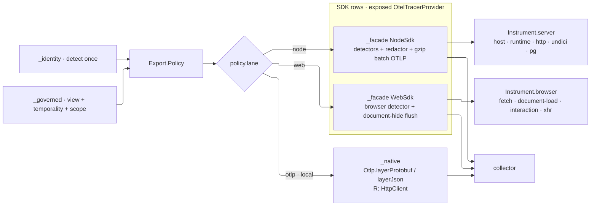

# [RUNTIME_EMIT]

`Export` owns the OTLP wire — egress and ingress of the telemetry plane in one module. Egress is one policy value and one Layer: `Export.live(policy)` composes the trace, metric, and log plane as a registration node providing `Hooks.Meter` and, on the SDK lanes, `OtelTracerProvider`, every lane consuming one `Resource` detected once per graph. Ingress is the W3C continuation, one total transformer adopting the decoded parent beside the composite propagator the same lane registers for foreign libraries.

`Redaction` is the one ambient scrub owner, its rules riding a `Context.Reference` every capture seam reads. `Hooks` is the consumer hook plane: taps, processors, exporters, views, instrumentations, and detectors contribute through append-only rows one drain collects. `Instrument` is the condition-fenced registration plane, one node per process condition on its own exports subpath. `@opentelemetry` sdk/exporter machinery is the `[OTEL_PIN_BLOCK]` pin block; the `plane:dev` DevTools row ships on `./dev`. Its module is `runtime/src/otel/emit.ts`.

## [01]-[INDEX]

- [02]-[POLICY] — the one `Export.Policy` row: identity, collector, lane, cadence, sampling, caps, instrumentation groups; `Export`.
- [03]-[REDACTION] — the ambient scrub rules and the per-signal structural-safety ledger; `Redaction`.
- [04]-[HOOKS] — the contribute-then-collect registry and the tap dispatch engine executing core's point vocabulary; `Hooks`, `Dispatch`.
- [05]-[GOVERNANCE] — the producer-side view projection making scope, temporality, and cardinality real on the Effect metric stream; interior.
- [06]-[LANES] — the native `Otlp` rows, the SDK facade rows, detectors, ambient globals, the roster dispatch; `Export`.
- [07]-[INSTRUMENT] — the `./server` and `./browser` registration nodes over each lane's exposed providers; `Instrument`.
- [08]-[CONTINUATION] — carrier decode, the ingress transformer, and the egress stamp; `Propagation`.
- [09]-[DEV] — the `plane:dev`-fenced `./dev` DevTools module; `dev`.

## [02]-[POLICY]

- Owner: `Export.Policy` — one typed row carrying every export decision: the `AppIdentity` (whose settled dimensions — instance, namespace, environment — the `Convention.identity` projection stamps on the `Resource`, so no export field re-mints an identity fact), the collector endpoint and sealed headers, the lane, per-signal cadence as `Duration` rows, the head-sampling ratio, the exporter transport bounds, the three structural cap sets under one `caps` group, metric temporality, the base-2 exponential-histogram size, the per-instrument-kind cardinality budget, the diagnostic floor, the server and browser instrumentation groups, the shutdown drain window, and the redaction rules. Transport rows — collector origin, sealed headers, cadence, sampling ratio — home in `Setting.otel` (`proc/config#ADMISSION_ROWS`' described group), so the app root assembles the policy from the boot-validated `Setting` and its own identity value, and no export decision exists outside the one row.
- Law: the collector secret rides `Redacted` end-to-end — the policy's `headers` values are `Redacted<string>` sealed at config admission and unwrapped exactly once inside the lane construction, so an exporter credential can never print.
- Law: cadence, batch width, sampling ratio, temporality, and the structural limits are policy values with stated defaults — a lane never hardcodes an interval, and tuning a fleet is a config edit; the OTLP signal paths derive from one base URL by the interior `_signal` projection, so a collector move is one field.
- Law: `caps` groups the three structural cap sets under one name because one concept binds them — how much a hostile or runaway payload may occupy — and each set types off the SDK's own record under `Required`: `BatchSpanProcessorBrowserConfig` for the queue, `SpanLimits` for span structure, `LogRecordLimits` for log-record structure, and `cardinalityLimits` for the per-instrument-kind series budget. `Required` is what forbids a partially-answered cap set, so every knob the pin ships is a policy row by construction and an upstream field addition surfaces as a type error rather than a silently unreachable default; `cardinality` reads the reader's own record whole, whose `default` row already catches every unnamed kind.
- Law: wire framing is a lane column, never a second policy axis — `_lanes` rows fix serialization, so every deployed lane frames protobuf and the JSON framing survives as the `local` row a developer points at a local collector. Collector protobuf-only posture therefore needs no side door, and a fleet cannot select a framing its gateway refuses.
- Law: `promote` carries the baggage key prefixes admitted onto span attributes (the `rasm.` prefix is the standing default carrying `Convention.rasm.tenant`), homed as a `Setting.otel` row; one `_admitted` predicate serves the ingress annotation fold and the SDK lanes' `BaggageSpanProcessor` row, so promotion has exactly one gate.
- Law: `placement` is the deploy-target fact arming the environment detectors — `cloud` selects at most one compute arm from the `_CLOUD` roster and `container` arms the cgroup row, so a detector never runs on a host it cannot answer.
- Law: the `server` and `browser` groups are the auto-instrumentation policy consumed only by `[07]`'s condition-fenced nodes — `propagate` names the API origins granted CORS `traceparent` injection, `interaction` the admitted DOM event roster and its span-admission predicate, `engine` the `HostMetrics` group allow-list and runtime-node precision, `ignore` the request paths excluded from inbound server spans, `orphan` the foreign-hop admission gate, `connect` the pool-acquisition span posture, `statement` the database statement-capture posture, `comment` the SQLCommenter statement annotation, and `session` the per-query `application_name` trace stamp — so an instrumented origin, event, route, or statement is a policy row, never a literal at a composition root; the member types import type-only from their instrumentation packages, erased outside the owning condition.
- Law: a browser URL roster is `RegExp` by default because the SDK's own `urlMatches` compares a string entry to the WHOLE request URL by equality — an origin spelled as a string never equals `<origin>/v1/traces` and never equals an API path, so `propagate` and `[07]`'s self-exclusion both carry anchored patterns and the string arm survives for the exact-URL case alone.
- Law: `engine.groups` closes against `_GROUPS`, the collector's own five group names, because `HostMetrics` treats an unrecognized entry as a group nobody enabled — a misspelling silently drops a whole engine family rather than refusing, so the roster is a closed vocabulary here instead of a free-string list the package can only ignore.
- Law: `diagnostic` is the SDK's own log floor, so an exporter rejection, a dropped batch, or a detector fault reads on the process log rail.
- Law: the floor crosses as a NAME the `_DIAGNOSTIC` roster closes, so `Setting.otel.diagnostic` and this policy row spell one vocabulary.
- Law: `_DIAGNOSTIC` is the one map onto the SDK enum, so no deployment spells a numeric level and no branch spells a `console` sink.
- Growth: a new export decision is one policy field consumed by the lane rows; a new backend is a `baseUrl`/`headers` value, never a lane; a new framing or SDK binding is one `_lanes` row.
- Packages: `effect` (`Duration`, `Redacted`), `@rasm/ts/core` (`AppIdentity`, `Convention`), `@opentelemetry/sdk-trace-base` + `-metrics` + `-logs` (the cap and cardinality records), `@opentelemetry/api` (`DiagLogLevel`).

```typescript signature
import {
  Array, Chunk, Context, Data, Duration, Effect, Exit, FiberSet, Function, HashMap, Layer, Option, pipe, Record, Redacted, Ref, Runtime,
  Scope, type Cause, type Tracer,
} from "effect"
import type { HttpClient } from "@effect/platform"
import { Logger as OtelLogger, Metrics as OtelMetrics, NodeSdk, Otlp, Resource as OtelIdentity, Tracer as OtelBridge, WebSdk } from "@effect/opentelemetry"
import { diag, DiagLogLevel, propagation, TraceFlags, type Attributes, type DiagLogger, type Meter, type SpanContext } from "@opentelemetry/api"
import { BaggageSpanProcessor } from "@opentelemetry/baggage-span-processor"
import { CompositePropagator, TraceState, W3CBaggagePropagator, W3CTraceContextPropagator } from "@opentelemetry/core"
import { CompressionAlgorithm, type OTLPExporterNodeConfigBase } from "@opentelemetry/otlp-exporter-base"
import { AggregationTemporalityPreference, OTLPMetricExporter } from "@opentelemetry/exporter-metrics-otlp-http"
import { OTLPMetricExporter as ProtoMetricExporter } from "@opentelemetry/exporter-metrics-otlp-proto"
import { OTLPTraceExporter } from "@opentelemetry/exporter-trace-otlp-http"
import { OTLPTraceExporter as ProtoTraceExporter } from "@opentelemetry/exporter-trace-otlp-proto"
import { OTLPLogExporter } from "@opentelemetry/exporter-logs-otlp-http"
import { OTLPLogExporter as ProtoLogExporter } from "@opentelemetry/exporter-logs-otlp-proto"
import { BatchLogRecordProcessor, type LogRecordLimits, type LogRecordProcessor } from "@opentelemetry/sdk-logs"
import {
  AggregationTemporality, AggregationType, DataPointType, InstrumentType, MeterProvider, PeriodicExportingMetricReader,
  type CollectionResult, type MetricData, type MetricProducer, type MetricReader, type PeriodicExportingMetricReaderOptions,
  type ScopeMetrics, type ViewOptions,
} from "@opentelemetry/sdk-metrics"
import {
  BatchSpanProcessor, ParentBasedSampler, TraceIdRatioBasedSampler, type BatchSpanProcessorBrowserConfig, type Span,
  type SpanLimits, type SpanProcessor,
} from "@opentelemetry/sdk-trace-base"
import type { Instrumentation } from "@opentelemetry/instrumentation"
import { browserDetector } from "@opentelemetry/opentelemetry-browser-detector"
import { awsBeanstalkDetector, awsEc2Detector, awsEcsDetector, awsEksDetector, awsLambdaDetector } from "@opentelemetry/resource-detector-aws"
import { containerDetector } from "@opentelemetry/resource-detector-container"
import { gcpDetector } from "@opentelemetry/resource-detector-gcp"
import {
  detectResources, envDetector, hostDetector, osDetector, processDetector, resourceFromAttributes, type Resource as OtelResource,
  serviceInstanceIdDetector, type ResourceDetector,
} from "@opentelemetry/resources"
import type { EventName, ShouldPreventSpanCreation } from "@opentelemetry/instrumentation-user-interaction"
import { type AppIdentity, Carrier, Convention, Tap } from "@rasm/ts/core"
import { Life } from "../proc/life.ts"

// HostMetrics enables a family only on an exact match and ignores every other entry, so an unrostered spelling
// disables silently — this roster closes here rather than reaching the package as free strings
const _GROUPS = ["process.cpu", "process.memory", "system.cpu", "system.memory", "system.network"] as const

// `_DIAGNOSTIC` totally maps the NAME config carries onto the SDK's own numeric enum, so no deployment spells 30 or
// 9999; this roster IS the policy vocabulary, so a config row and a policy row cannot drift
const _DIAGNOSTIC = {
  all: DiagLogLevel.ALL,
  debug: DiagLogLevel.DEBUG,
  error: DiagLogLevel.ERROR,
  info: DiagLogLevel.INFO,
  none: DiagLogLevel.NONE,
  verbose: DiagLogLevel.VERBOSE,
  warn: DiagLogLevel.WARN,
} as const

declare namespace Export {
  type Lane = keyof typeof _lanes
  type Policy = {
    readonly identity: AppIdentity
    readonly collector: {
      readonly baseUrl: string
      readonly headers: Readonly<Record<string, Redacted.Redacted<string>>>
    }
    readonly lane: Lane
    readonly cadence: {
      readonly logs: Duration.Duration
      readonly metrics: Duration.Duration
      readonly traces: Duration.Duration
    }
    readonly sampling: { readonly ratio: number }
    readonly transport: { readonly concurrency: number; readonly timeout: Duration.Duration }
    // every cap set types off the SDK's own record under Required: an upstream field addition breaks here, never defaults away silently
    readonly caps: {
      readonly batch: Required<BatchSpanProcessorBrowserConfig>
      readonly logs: Required<LogRecordLimits>
      readonly spans: Required<SpanLimits>
    }
    readonly temporality: "cumulative" | "delta"
    readonly histogram: { readonly maxSize: number }
    readonly cardinality: Required<NonNullable<PeriodicExportingMetricReaderOptions["cardinalityLimits"]>>
    readonly promote: ReadonlyArray<string>
    readonly diagnostic: keyof typeof _DIAGNOSTIC
    readonly placement: {
      readonly cloud: keyof typeof _CLOUD
      readonly container: boolean
    }
    readonly server: {
      readonly comment: boolean
      readonly connect: boolean
      // engine health, never web vitals: `Vital` owns the Core Web Vitals family and this row binds HostMetrics and runtime-node
      readonly engine: { readonly groups: ReadonlyArray<(typeof _GROUPS)[number]>; readonly precision: number }
      readonly ignore: ReadonlyArray<string>
      readonly orphan: boolean
      readonly redact: ReadonlyArray<string>
      readonly session: boolean
      readonly statement: boolean
    }
    readonly browser: {
      // string entries match a whole URL by equality inside the SDK's own urlMatches, so an origin rides a pattern
      readonly propagate: ReadonlyArray<string | RegExp>
      readonly interaction: {
        readonly events: ReadonlyArray<EventName>
        readonly prevent: ShouldPreventSpanCreation
      }
    }
    readonly shutdown: Duration.Duration
    readonly redaction: Redaction.Rules
  }
  type Context = HttpClient.HttpClient | Hooks | Life
  type Live = Layer.Layer<Hooks.Meter, never, Context>
  // SDK rows publish every Tag their assembly exposes: an under-declared output is a Tag [07] cannot bind
  type Sdk = Layer.Layer<
    Hooks.Meter | OtelBridge.OtelTracer | OtelBridge.OtelTracerProvider | OtelIdentity.Resource | OtelLogger.OtelLoggerProvider,
    never,
    Context
  >
  type Of<P extends Policy> = ReturnType<(typeof _lanes)[P["lane"]]>
}

const _signal = (policy: Export.Policy, signal: "logs" | "metrics" | "traces"): string =>
  `${policy.collector.baseUrl.replace(/\/+$/, "")}/v1/${signal}` // one trailing-slash fold: a collector origin spelled either way resolves identically

const _admitted = (promote: ReadonlyArray<string>) => (key: string): boolean =>
  Array.some(promote, (prefix) => key.startsWith(prefix))
```

## [03]-[REDACTION]

- Owner: `Redaction` — the one scrub owner of the branch: `Rules` as data (sealed attribute keys and value patterns), one total `scrub` fold over any open attribute bag, `processor(rules)` materializing the rules as an OTel `SpanProcessor` whose `onEnding` hook overwrites deny-keyed and pattern-matched span attributes with the sealed sentinel before the span freezes for export, and `Redaction.Current` — a `Context.Reference` defaulting to `defaults` — so every capture seam reads the live rule set at zero requirement pressure and the app root overrides once with the policy's own rows.
- Law: the scrub signature is the open read-side record — `Convention.Bag` in, `Convention.Bag` out — because scrubbed material lawfully carries keys the vocabulary never minted (platform tracer attributes, foreign baggage, crash-context bags); a scrub seam demanding the closed `Convention.Attributes` stamping record is the inverted-trust defect the convention page names.
- Law: the signals are safe by distinct mechanisms, and the ledger is explicit over four consumption sites — metrics carry only bounded-vocabulary tags, so no metric attribute can hold PII by construction; span attributes scrub structurally through `Redaction.processor` at the export boundary; log annotations scrub at their capture seams — the crash owner's breadcrumb record and fatal forensic band (`crash#REPLAY`, `crash#CAPTURE`) and this module's own baggage ingress (`[08]`) all fold the identical `Rules` value read from `Redaction.Current` — so a new PII class lands as one row every site inherits and no annotation path exists outside the fold.
- Law: the native `Otlp` lane exposes no span-attribute hook — export-boundary span scrub is therefore an `[OTEL_PIN_BLOCK]` parity criterion: a deployment whose compliance posture mandates boundary scrub selects an SDK lane until the native lane grows the hook, a selection pressure recorded on the lane card, never worked around with a fork.
- Law: `defaults` seals the identifier-grade semconv keys — `client.address`, `user_agent.original`, `url.full` — and the pattern rows mask bearer tokens and email shapes inside surviving string values — scalar and string-array element alike; app policies extend by row composition, never by a second scrub.
- Exemption: the `SpanProcessor` hooks are the OTel SDK's own callback contract — the platform-forced statement seam where `setAttribute` writes cross back into the span before it freezes.
- Law: `onEnding` is the correct hook and a pin-watch fact — it hands a mutable `Span` where `onEnd` hands only a `ReadableSpan`; the member carries the SDK's `@experimental` flag, so it rides the `[OTEL_PIN_BLOCK]` pin block's watch list, never a design change.
- Growth: a new PII class is one `sealed` key row or one `patterns` row.
- Packages: `effect` (`Array`, `Context`, `Option`, `Record`), `@opentelemetry/sdk-trace-base` (`SpanProcessor`, `Span`), `@opentelemetry/api` (`Attributes`).

```typescript signature
declare namespace Redaction {
  type Rules = {
    readonly patterns: ReadonlyArray<RegExp>
    readonly sealed: ReadonlyArray<string>
  }
}

const _SEAL = "<redacted>"

const _defaults: Redaction.Rules = {
  patterns: [/bearer\s+[a-z0-9._-]+/gi, /[a-z0-9._%+-]+@[a-z0-9.-]+\.[a-z]{2,}/gi],
  sealed: [Convention.attr.clientAddress, Convention.attr.userAgent, Convention.attr.urlFull],
}

class _Current extends Context.Reference<_Current>()("runtime/Redaction", {
  defaultValue: (): Redaction.Rules => _defaults,
}) {}

const _mask = (rules: Redaction.Rules, text: string): string =>
  Array.reduce(rules.patterns, text, (held, pattern) => held.replace(pattern, _SEAL))

const _masked = (rules: Redaction.Rules, value: Convention.Bag[string]): Convention.Bag[string] =>
  typeof value === "string"
    ? _mask(rules, value)
    : Array.isArray(value)
      ? Array.map(value, (entry) => (typeof entry === "string" ? _mask(rules, entry) : entry))
      : value

const _scrub = (rules: Redaction.Rules, bag: Convention.Bag): Convention.Bag =>
  Record.map(bag, (value, key) => (Array.contains(rules.sealed, key) ? _SEAL : _masked(rules, value)))

const _admits = (bag: Attributes): Convention.Bag =>
  // BOUNDARY ADAPTER: absent values drop here; the api bag's arrays also admit nullish members the open record's element types never name,
  // and the mask fold passes a non-string element through untouched, so the re-narrow is sound at the value level.
  Record.filterMap(bag, (value) => Option.fromNullable(value)) as Convention.Bag

const _processor = (rules: Redaction.Rules): SpanProcessor => ({
  forceFlush: () => Promise.resolve(),
  onEnd: () => undefined,
  onEnding: (span: Span) => {
    // platform statement seam: setAttribute writes back into the live span, so the scrubbed record replays as writes
    Record.toEntries(_scrub(rules, _admits(span.attributes))).forEach(([key, value]) => span.setAttribute(key, value))
  },
  onStart: () => undefined,
  shutdown: () => Promise.resolve(),
})

const Redaction: {
  readonly Current: typeof _Current
  readonly defaults: Redaction.Rules
  readonly processor: (rules: Redaction.Rules) => SpanProcessor
  readonly scrub: (rules: Redaction.Rules, bag: Convention.Bag) => Convention.Bag
} = {
  Current: _Current,
  defaults: _defaults,
  processor: _processor,
  scrub: _scrub,
}
```

## [04]-[HOOKS]

- Owner: `Hooks` — consumer hook plane of the telemetry pipeline: one accumulating registry of `SpanProcessor` taps, `MetricReader` rows, `LogRecordProcessor` sinks, `ViewOptions` reshaping rows, `Instrumentation` registrations, and `ResourceDetector` enrichers. Feature, app, and tenant planes contribute through `Hooks.contribute` — a `Layer.effectDiscard` appending their rows — and exactly one drain exists: the lanes build their configuration from `Hooks.drained`, folding the collected rows behind the policy's own, while `_meter` seats the scoped raw-OTel plane as `Hooks.Meter` — the provider third-party instruments bind beside the build version their scope coordinate spends.
- Law: contributions are order-independent appends with zero global effects — no `register()`, no global provider, no module side effect; the registry is a service, a proof overrides it wholesale, and an append after the drain is construction-order misuse the root's Layer ordering makes unspellable (`Export.live` composes after every contributor).
- Law: tenant isolation rides the plane — baggage-to-span promotion is the shipped `BaggageSpanProcessor` row the SDK lanes wire from `policy.promote` under the one `_admitted` predicate, so `Convention.rasm.tenant` rides the `rasm.` prefix and one tenant projection has one exact spelling; a per-tenant metric stream is one contributed reader, and identity scopes every stream, so multi-app deployments never tangle.
- Law: one `ViewOptions` row vocabulary executes on two seams, because the metric plane splits by producer. Instruments minted on `Hooks.Meter`'s raw `MeterProvider({ resource, views, readers })` reach the SDK's own view engine, which applies selection, attribute processors, aggregation, and `aggregationCardinalityLimit` at instrument-storage time. Effect-minted `rasm.*` metrics never touch a `MeterProvider` at all — `Metrics.registerProducer` installs a `MetricProducer` straight onto the reader, so the SDK view engine, the reader's aggregation and temporality selectors, and its cardinality selector all sit downstream of nothing. `[05]` therefore folds the identical rows as a collection-time projection over the producer's output; a knob left on the reader alone is a governance row that silently governs nothing, which is the defect this split exists to foreclose.
- Law: instrumentation rows contribute like every other row and register nowhere here — `[07]`'s condition-fenced node drains the slot into exactly one `registerInstrumentations` call bound to the lane's own providers, so a feature plane adds a library instrumentation without reaching a global API and a second activation call cannot exist per condition.
- Law: `Hooks.meter(module)` is the one scoped-meter accessor and it spends `Convention.scope(module, version)` WHOLE — `getMeter` takes the `@rasm/ts/<module>` specifier, the emitting build version, and `Convention.wire.schemaUrl` together, so a third-party instrument carries the same versioned single-semconv coordinate every span and log carries instead of a bare name. Module arguments type off the Convention roster, so a free-string scope has no spelling; the version rides `Hooks.Meter` beside the provider because the lane seating that provider is the one surface holding the identity, and a caller passing its own forks the coordinate per import site. Effect's own metrics ride the app `Resource` scope the facade fixes and the producer projection at `[05]` restamps, so these are the branch's two scope sites and both read one mint.
- Law: `Hooks.Dispatch` executes the core `Tap` vocabulary — `mount` admits a core-validated `Tap.Registry`, installing each subscription into a point-keyed rail scoped by the registry's `AppIdentity.Key` so two apps composing identical point names occupy distinct rails, and `publish(app, point, fact)` is the publisher's one entry returning the veto verdict as data, so the emitting fold consumes refusal as a value and dispatch never re-opens the zero-exporter boundary.
- Law: dispatch reads the modality table's columns, never names — a `feedback` row joins the pure veto fold (first refusal wins, before any journal write or delivery), a `buffered` row drains the point's retained window at mount then receives live facts, and every non-feedback delivery forks onto an isolated fiber in the engine's scoped `FiberSet`; a subscriber fault folds through `Tap.isolated` into `Breach` evidence landing as an annotated warning on the log rail — never the publisher's failure — and the interruption-only cause folds to none, so a cancelled delivery never reads as breach.
- Law: the replay journal is a bounded ring — `policy.journal` deep, appended only for points whose modality set admits the buffered column — so replay is a warm-up window, never durable history, and telemetry-as-tap holds by construction: a signal emitter mounts as a `Tap.emitter` subscription like any observer, and an emit call inside a domain fold has no spelling on this plane.
- Law: the reader slot types `MetricReader`, not the `IMetricReader` interface the raw provider accepts — the facade's `Configuration.metricReader` and `Metrics.registerProducer` both demand the abstract class, so a contributed reader typed to the interface is a row the SDK rows cannot mount; the narrower type is what makes a per-tenant reader composable on every lane.
- Entry: `Hooks.Default` merges first at the composition root, every `Hooks.contribute` node after it, and `Export.live` last so the drain observes the whole contribution set; `Hooks.Dispatch.Default(journal)` seats the tap engine with its own ring depth beside them, because the replay window is a dispatch decision the export policy never carries.
- Growth: a new hook class (an exporter tap, a scrub point, a sampling processor) is one `Rows` slot consumed by the same drain; `add` widens with the slot, never a new verb; a new dispatch modality is a core table row the column reads absorb with zero executor edits.
- Packages: `effect` (`Chunk`, `Data`, `Effect`, `FiberSet`, `HashMap`, `Layer`, `Ref`), `@opentelemetry/sdk-trace-base` (`SpanProcessor`), `@opentelemetry/sdk-metrics` (`MeterProvider`, `MetricReader`, `ViewOptions`), `@opentelemetry/sdk-logs` (`LogRecordProcessor`), `@opentelemetry/instrumentation` (`Instrumentation`), `@opentelemetry/resources` (`ResourceDetector`), `@opentelemetry/api` (`Meter`), `@rasm/ts/core` (`AppIdentity`, `Convention`, `Tap`).

```typescript signature
declare namespace Hooks {
  type Meter = _Meter
  type Rows = {
    readonly detectors: ResourceDetector
    readonly instruments: Instrumentation
    readonly logs: LogRecordProcessor
    readonly readers: MetricReader
    readonly spans: SpanProcessor
    readonly views: ViewOptions
  }
  type Drained = { readonly [K in keyof Rows]: ReadonlyArray<Rows[K]> }
}

// this raw metric plane travels whole: [07] binds the provider and [04]'s scope coordinate spends the version
class _Meter extends Context.Tag("runtime/Hooks/Meter")<_Meter, {
  readonly provider: MeterProvider
  readonly version: AppIdentity.Version
}>() {}

declare namespace Dispatch {
  type Policy = { readonly journal: number }
  type Verdict = Option.Option<InstanceType<typeof Tap.Veto>>
  type Entry = {
    readonly journal: Chunk.Chunk<unknown>
    readonly taps: Chunk.Chunk<{ readonly buffered: boolean; readonly deliver: (fact: unknown) => Effect.Effect<void> }>
    readonly vetoes: Chunk.Chunk<(fact: unknown) => Verdict>
  }
}

const _EMPTY_RAIL: Dispatch.Entry = { journal: Chunk.empty(), taps: Chunk.empty(), vetoes: Chunk.empty() }

const _amended = (
  rails: Ref.Ref<HashMap.HashMap<Data.Data<readonly [string, string]>, Dispatch.Entry>>,
  key: Data.Data<readonly [string, string]>,
  grow: (entry: Dispatch.Entry) => Dispatch.Entry,
): Effect.Effect<void> =>
  Ref.update(rails, (held) => HashMap.modifyAt(held, key, (slot) => Option.some(grow(Option.getOrElse(slot, () => _EMPTY_RAIL)))))

const _isolated = <A>(point: Tap.Point<A>, label: string, run: (fact: A) => Effect.Effect<void, unknown>) =>
  // BOUNDARY ADAPTER: erasure seam — the closure mints where A is bound, so the erased rail re-admits only the point's own facts
  (fact: unknown): Effect.Effect<void> =>
    run(fact as A).pipe(
      Effect.catchAllCause((cause: Cause.Cause<unknown>) =>
        Option.match(Tap.isolated(point.name, label)(cause), {
          onNone: () => Effect.void, // interruption-only cause: a cancelled delivery never reads as breach
          onSome: (breach) =>
            Effect.annotateLogs(Effect.logWarning("<tap-breach>"), {
              class: breach.class,
              point: breach.point,
              subscriber: breach.label,
            }),
        })),
    )

class _Dispatch extends Effect.Service<_Dispatch>()("runtime/Hooks/Dispatch", {
  scoped: (policy: Dispatch.Policy) =>
    Effect.gen(function* () {
      const rails = yield* Ref.make(HashMap.empty<Data.Data<readonly [string, string]>, Dispatch.Entry>())
      const fibers = yield* FiberSet.make() // scope-bound: every delivery fiber dies with the graph, so a leaked subscriber is unspellable
      const gate = yield* Effect.makeSemaphore(1) // mount replay and live publish share one order; no point lands between warm-up and enrollment
      const enroll = <A>(app: AppIdentity.Key, label: string, sub: Tap.Subscription<A>): Effect.Effect<void> => {
        const key = Data.tuple(app as string, sub.point.name as string)
        const row = Tap[Tap.modality(sub.handler)] // column-driven: feedback selects the veto fold, buffered the window-then-live delivery
        const handler = sub.handler
        return gate.withPermits(1)(handler._tag === "Veto"
          ? _amended(rails, key, (entry) => ({
              ...entry,
              vetoes: Chunk.append(entry.vetoes, (fact: unknown) => handler.decide(fact as A)), // BOUNDARY ADAPTER: same erasure seam as the delivery closure
            }))
          : pipe(_isolated(sub.point, label, handler.run), (deliver) =>
              Effect.zipRight(
                Effect.when(
                  Effect.flatMap(Ref.get(rails), (held) =>
                    Effect.forEach(
                      Option.getOrElse(HashMap.get(held, key), () => _EMPTY_RAIL).journal,
                      (fact) => FiberSet.run(fibers, deliver(fact)),
                      { discard: true },
                    )),
                  () => row.buffered, // the buffered column drains the retained window before live facts arrive
                ),
                _amended(rails, key, (entry) => ({ ...entry, taps: Chunk.append(entry.taps, { buffered: row.buffered, deliver }) })),
              )))
      }
      const fanned = <A>(key: Data.Data<readonly [string, string]>, point: Tap.Point<A>, fact: A, entry: Dispatch.Entry): Effect.Effect<Dispatch.Verdict> =>
        Effect.as(
          Effect.zipRight(
            Effect.when(
              _amended(rails, key, (held) => ({
                ...held,
                journal: Chunk.takeRight(Chunk.append(held.journal, fact), policy.journal), // bounded ring: the window is policy, never unbounded history
              })),
              () => Array.some(point.modalities, (modality) => Tap[modality].buffered), // journal only where the point admits replay
            ),
            Effect.forEach(entry.taps, (tap) => FiberSet.run(fibers, tap.deliver(fact)), { discard: true }),
          ),
          Option.none(),
        )
      return {
        mount: <T extends Record<string, unknown>>(registry: Tap.Registry<T>): Effect.Effect<void> =>
          Effect.forEach(
            Record.toEntries(registry.rows),
            ([label, sub]) => enroll(registry.app, label, sub),
            { discard: true },
          ),
        publish: <A>(app: AppIdentity.Key, point: Tap.Point<A>, fact: A): Effect.Effect<Dispatch.Verdict> =>
          gate.withPermits(1)(Effect.flatMap(Ref.get(rails), (held) => {
            const key = Data.tuple(app as string, point.name as string)
            const entry = Option.getOrElse(HashMap.get(held, key), () => _EMPTY_RAIL)
            return Option.match(Chunk.head(Chunk.filterMap(entry.vetoes, (decide) => decide(fact))), {
              // This pure veto fold: first refusal wins, before any journal write or delivery
              onNone: () => fanned(key, point, fact, entry),
              onSome: (veto) => Effect.succeed(Option.some(veto)),
            })
          })),
      }
    }),
}) {}

class Hooks extends Effect.Service<Hooks>()("runtime/Hooks", {
  effect: Effect.gen(function* () {
    const cells: { readonly [K in keyof Hooks.Rows]: Ref.Ref<Chunk.Chunk<Hooks.Rows[K]>> } = {
      detectors: yield* Ref.make(Chunk.empty<ResourceDetector>()),
      instruments: yield* Ref.make(Chunk.empty<Instrumentation>()),
      logs: yield* Ref.make(Chunk.empty<LogRecordProcessor>()),
      readers: yield* Ref.make(Chunk.empty<MetricReader>()),
      spans: yield* Ref.make(Chunk.empty<SpanProcessor>()),
      views: yield* Ref.make(Chunk.empty<ViewOptions>()),
    }
    return {
      // one keyed append serves every slot: the mapped cell annotation correlates kind to row type, so the indexed write is cast-free
      add: <K extends keyof Hooks.Rows>(kind: K, row: Hooks.Rows[K]): Effect.Effect<void> =>
        Ref.update(cells[kind], (held) => Chunk.append(held, row)),
      drained: Effect.map(
        Effect.all(Record.map(cells, Ref.get)), // one mapped read over the cell record: a new slot drains with zero fold edits
        (held): Hooks.Drained => Record.map(held, Chunk.toReadonlyArray) as Hooks.Drained,
      ),
    }
  }),
}) {
  static readonly Meter = _Meter
  static readonly Dispatch = _Dispatch
  static readonly contribute = (tap: (hooks: Hooks) => Effect.Effect<void>): Layer.Layer<never, never, Hooks> =>
    Layer.effectDiscard(Effect.flatMap(Hooks, tap))
  // This one raw-OTel meter seam: the scope coordinate crosses whole, so a name never reaches getMeter without its
  // version and schema — the three-argument surface is what carries them, and the module closes against the roster
  static readonly meter = (module: Convention.Module): Effect.Effect<Meter, never, _Meter> =>
    Effect.map(_Meter, ({ provider, version }) =>
      pipe(
        Convention.scope(module, version),
        (scope) => provider.getMeter(scope.name, scope.version, { schemaUrl: scope.schemaUrl }),
      ))
}
```

## [05]-[GOVERNANCE]

- Owner: the interior `_governed` projection — one decorator over the Effect `MetricProducer` applying the drained `ViewOptions` rows, the policy temporality, and the instrumentation-scope stamp to every collection before a reader observes it, so the metric-governance vocabulary holds across the facade rows' Effect plane and every row's raw-provider plane under one row shape.
- Law: this seam exists because `Metrics.registerProducer` seats the Effect producer as the reader's own producer, and a producer's `CollectionResult` reaches the exporter untouched — no `MeterProvider`, therefore no view engine, no `aggregationSelector`, no `aggregationTemporalitySelector`, no `cardinalitySelector`. Every `rasm.*` series a folder mints through Effect `Metric` rides this path, so the reader-level knobs govern the raw-provider plane alone and this projection is what makes them true where the estate's own series live.
- Law: `_governed` reaches the facade rows alone — `Otlp.layerProtobuf`/`layerJson` install Effect's own metric bridge with no `registerProducer` seam and no views field, so a native row exports every `rasm.*` series with the `Convention.dimensions` allow-list, the delta conversion, the cardinality ceiling, and the scope restamp all inert.
- Law: the ungoverned native series carry every key the governor strips on a facade row — the `unit` carrier and the frequency `key` ride the wire as data-point attributes, the scope stays `@effect/opentelemetry/Metrics` carrying no version, and temporality stays cumulative. `iac/operate/observe#CHART_ROWS`'s metric-leg strip closes the carrier at the gateway; the remainder is an `[OTEL_PIN_BLOCK]` parity criterion beside the span-scrub and compression gaps, so a deployment under the estate's dimension governance selects an SDK row.
- Law: selection narrows to what a collected descriptor carries — `MetricDescriptor` is `{ name, description, unit, valueType }`, so `instrumentName` globs and `instrumentUnit` select here while `instrumentType`, `meterName`, `meterVersion`, and `meterSchemaUrl` stay raw-provider selectors; a row spelling one of those against the Effect plane selects nothing and the law states that rather than letting it read as governance.
- Law: stream alteration honors what a snapshot admits — `name` and `description` rewrite, `attributesProcessors` fold in row order, `aggregationCardinalityLimit` caps, and `AggregationType.DROP` deletes the metric whole. Re-bucketing a collected point is not derivable, so the explicit-bucket and exponential-histogram arms belong to the raw-provider view engine and to Effect's own `MetricBoundaries` at the mint site; the projection refuses silently reshaping a distribution it cannot recompute.
- Law: cardinality overflow follows the instrument's own aggregation — the first `aggregationCardinalityLimit` attribute sets survive in encounter order and every excess series folds into one point stamped `otel.metric.overflow`, additively for sums and last-value for gauges, so a runaway tag loses its identity instead of its data and a dashboard reads the overflow bucket as the signal it is. Distributions carry bucket vectors a scalar fold cannot merge, so a histogram passes uncapped and its allow-list row is what bounds it; the `_FOLD` table states that by carrying only the two shapes it can honestly fold.
- Law: temporality conversion covers exactly what a cumulative snapshot determines — monotonic sums convert losslessly against the previous reading keyed by name and canonical attributes, with the prior collection's end time becoming the delta point's start time. Histogram interval minima and maxima are unrecoverable from a cumulative snapshot, so histograms export cumulative and the gateway `cumulative_to_delta` processor owns their conversion; a delta histogram claimed here fabricates two fields per point.
- Law: scope is stamped, never inherited — Effect's producer emits one hardcoded `@effect/opentelemetry/Metrics` scope carrying no version and no schema URL, which fails the estate's version-stamped single-semconv-coordinate row on every `rasm.*` series. This projection replaces it with `Convention.scope("runtime", policy.identity.build.version)` whole, so the emitting specifier, its version, and one schema coordinate ride every metric exactly as they ride every span and log; the mint returns the triple, so no record is hand-assembled here and a coordinate field cannot go missing.
- Law: the version is the COMPOSED build's, not a per-library constant — every `rasm.*` series on this plane leaves one process under one `Resource` whose `service.version` is that same value, so a second version spelling here attributes the metric stream to a build the resource never names; a library-owned version enters only when a folder ships as an independently versioned artifact emitting its own resource, which is the same edit that gives it its own identity.
- Law: exemplars are absent by capability, not by omission — `sdk-metrics` ships the `ExemplarFilter` family unexported and referenced by no aggregation, storage, or reader path at the pin, and Effect's producer emits data points carrying no exemplar slot, so no metric this branch mints can carry a trace id. Metric-to-trace click-through therefore rides the gateway's span-derived series until the pin grows a reachable filter, and a configuration row spelled here asserts a capability the wire never carries. This is an `[OTEL_PIN_BLOCK]` parity criterion beside the native lane's span-scrub and compression gaps.
- Growth: a new governed axis is one `ViewOptions` field the projection reads; a new convertible point shape is one `_FOLD` row.
- Packages: `@opentelemetry/sdk-metrics` (`ViewOptions`, `MetricProducer`, `CollectionResult`, `MetricData`, `DataPointType`, `AggregationTemporality`, `AggregationType`, `IAttributesProcessor`), `@opentelemetry/api` (`Attributes`), `@rasm/ts/core` (`Convention`).

```typescript signature
const _OVERFLOW = "otel.metric.overflow"
const _GLOB = /[.+^${}()|[\]\\]/g

const _selects = (row: ViewOptions, data: MetricData): boolean =>
  (row.instrumentName === undefined
    || new RegExp(`^${row.instrumentName.replace(_GLOB, "\\$&").replace(/\*/g, ".*").replace(/\?/g, ".")}$`).test(data.descriptor.name))
  && (row.instrumentUnit === undefined || row.instrumentUnit === data.descriptor.unit)

// The delta ledger keys on the point's ORIGINAL coordinate — producing scope, name, unit, attributes — because the
// collection below rewrites every scope to the one estate triple: keyed on name and attributes alone, two producers
// publishing one name under identical attributes share a baseline and each differences against the other's reading,
// and a same-name pair differing only by unit does the same across two dimensions.
const _series = (scope: ScopeMetrics["scope"], data: MetricData, attributes: Attributes): string =>
  JSON.stringify([
    scope.name,
    scope.version ?? "",
    data.descriptor.name,
    data.descriptor.unit,
    Array.map(Object.keys(attributes).sort(), (key) => [key, attributes[key]]),
  ])

const _FOLD: Partial<Record<DataPointType, (held: number, next: number) => number>> = {
  // overflow folds by the point's own aggregation: an additive sum accumulates, a level takes the last reading
  [DataPointType.GAUGE]: (_held, next) => next,
  [DataPointType.SUM]: (held, next) => held + next,
}

const _capped = (data: MetricData, limit: number | undefined): MetricData =>
  Option.match(
    Option.flatMap(
      // an unfoldable point shape or an absent ceiling collapses here; an under-cap series collapses on the empty tail
      Option.all([Option.fromNullable(_FOLD[data.dataPointType]), Option.fromNullable(limit)]),
      ([fold, cap]) =>
        pipe(Array.splitAt(data.dataPoints, cap), ([kept, excess]) =>
          Option.map(Array.last(excess), (template) => ({ excess, fold, kept, template }))),
    ),
    {
      onNone: () => data,
      // BOUNDARY ADAPTER: the fold table carries only the scalar shapes, so the point list re-narrows on its own dataPointType.
      onSome: ({ excess, fold, kept, template }) =>
        ({
          ...data,
          dataPoints: [
            ...kept,
            {
              ...template,
              attributes: { [_OVERFLOW]: true },
              value: Array.reduce(excess, 0, (held, point) => fold(held, point.value as number)),
            },
          ],
        }) as MetricData,
    },
  )

const _shaped = (rows: ReadonlyArray<ViewOptions>, data: MetricData): Option.Option<MetricData> =>
  Array.reduce(Array.filter(rows, (row) => _selects(row, data)), Option.some(data), (held, row) =>
    Option.flatMap(held, (carried) =>
      row.aggregation?.type === AggregationType.DROP
        ? Option.none()
        : Option.some(_capped(
          // BOUNDARY ADAPTER: descriptor and attribute rewrites preserve the point shape, so the union re-narrows on its own tag.
          {
            ...carried,
            descriptor: {
              ...carried.descriptor,
              description: row.description ?? carried.descriptor.description,
              name: row.name ?? carried.descriptor.name,
            },
            dataPoints: carried.dataPoints.map((point) => ({
              ...point,
              attributes: Array.reduce(row.attributesProcessors ?? [], point.attributes, (bag, step) => step.process(bag)),
            })),
          } as MetricData,
          row.aggregationCardinalityLimit,
        ))))

const _delta = (
  readings: Map<string, { readonly end: MetricData["dataPoints"][number]["endTime"]; readonly value: number }>,
  scope: ScopeMetrics["scope"],
  data: MetricData,
): MetricData =>
  // exactly the losslessly convertible shape: a monotonic cumulative sum differenced against its own prior reading
  data.dataPointType !== DataPointType.SUM || !data.isMonotonic
    ? data
    : {
      ...data,
      aggregationTemporality: AggregationTemporality.DELTA,
      dataPoints: data.dataPoints.map((point) => {
        const key = _series(scope, data, point.attributes)
        const prior = readings.get(key)
        readings.set(key, { end: point.endTime, value: point.value })
        return { ...point, startTime: prior?.end ?? point.startTime, value: point.value - (prior?.value ?? 0) }
      }),
    }

const _governed = (producer: MetricProducer, policy: Export.Policy, rows: ReadonlyArray<ViewOptions>): MetricProducer => {
  const readings = new Map<string, { readonly end: MetricData["dataPoints"][number]["endTime"]; readonly value: number }>()
  // Convention.scope returns the whole InstrumentationScope triple, so the rewrite is one call and no field goes missing
  const scope = Convention.scope("runtime", policy.identity.build.version)
  return {
    collect: async (options): Promise<CollectionResult> => {
      const collected = await producer.collect(options)
      return {
        ...collected,
        resourceMetrics: {
          ...collected.resourceMetrics,
          scopeMetrics: collected.resourceMetrics.scopeMetrics.map((held): ScopeMetrics => ({
            // producer scope is a package constant carrying no version and no schema, so the estate coordinate replaces it
            scope,
            metrics: Array.filterMap(held.metrics, (data) =>
              Option.map(
                _shaped(rows, data),
                // the ORIGINAL scope keys the ledger, read before the rewrite above replaces it
                (shaped) => (policy.temporality === "delta" ? _delta(readings, held.scope, shaped) : shaped),
              )),
          })),
        },
      }
    },
  }
}
```

## [06]-[LANES]

- Owner: the interior `_lanes` roster — `as const satisfies Record<string, (policy) => Layer>` — with `Export.live(policy)` as the one entrypoint dispatching `_lanes[policy.lane](policy)`; the lane union derives as `keyof typeof _lanes`, so config admission, the policy type, and the dispatch read one anchor, and a new lane is one row.
- Law: a lane row is the whole binding — SDK module or native serializer, detector roster, wire framing, and exporter sender travel together, so `_native(framing)` and `_facade(sdk, roster, sender)` are the two builders every row instantiates and a fifth row adds no branch. `otlp` is the protobuf native default, `local` its JSON twin for a developer reading collector frames, `node` and `web` the SDK facade rows; every deployed row frames protobuf.
- Law: the native rows carry Effect's own `Tracer`/`Metric`/`Logger` straight to the collector over the `HttpClient.HttpClient` requirement the root satisfies with `net/client#LANE_ROWS`'s policy client (node/bun) or the browser client, so OTLP egress inherits the branch timeout/retry posture, and the policy's `shutdown` window rides `shutdownTimeout` so the drain budget is one stated value. Their option bag carries no compression field at the pin and `@effect/platform` ships no request-encoding middleware, so a native row cannot gzip — an `[OTEL_PIN_BLOCK]` parity criterion recorded beside the span-scrub hook, and a deployment under the estate compression pin selects an SDK row. Both native rows declare the node sender because the only SDK exporter they construct is the raw meter provider's, so a browser root takes the `web` facade row and a browser-framed native row is one more `_lanes` entry rather than a runtime guess inside the builder.
- Law: identity is detected once, awaited, then projected — `_identity` is a Layer-seated `Effect` folding `detectResources` over the platform roster (`envDetector`, `hostDetector`, `osDetector`, `processDetector`, `serviceInstanceIdDetector`) and the placement-armed environment rows — `_CLOUD[policy.placement.cloud]` contributes at most one compute arm and `containerDetector` arms on the container fact — crossing `waitForAsyncAttributes()` whenever `asyncAttributesPending` is true and merging the detected roster UNDER the `Convention.identity` override pinned to `Convention.wire.schemaUrl` — `Resource.merge` gives the argument precedence, so the deployment's own identity wins every collision the detectors contest, which is the enrich-then-override order the conformance row fixes. One seat is load-bearing, not tidiness: `serviceInstanceIdDetector` mints a fresh guid per run, so a second detection stamps the facade signals and the raw meter provider with different `service.instance.id` values and splits one process into two resources. Web rosters fold `browserDetector` for the `browser.*` client-hint facts, a raw `@opentelemetry/resources` value never leaves this module, and `OtlpResource.fromConfig` is the rejected second identity path.
- Law: the SDK rows exist for SDK-only capability — boundary span scrub, baggage promotion, wire compression, structural span and log-record limits, auto-instrumentation, and the hook plane — and both assemble through the facade's public legs (`layerTracerProvider` under the `Tracer`, `Metrics`, and `Logger` bridges over `Resource.layer`) rather than `NodeSdk.layer`/`WebSdk.layer`, because the graph must expose `OtelBridge.OtelTracerProvider` for `[07]`'s registration nodes, which the aggregate layer conceals. Span processors run promotion, then `Redaction.processor`, then contributed taps, then the batching exporter — promotion writes before the span freezes, so the boundary scrub still governs a promoted key.
- Law: batching answers its whole record — `policy.caps.batch` is `Required<BatchSpanProcessorBrowserConfig>`, so `scheduledDelayMillis` and `exportTimeoutMillis` reach the span and log processors beside the two queue widths, and `disableAutoFlushOnDocumentHide` states the browser posture explicitly rather than riding an SDK default; the browser processor's document-hide flush is what drains RUM spans before navigation, so the field is the knob a kiosk deployment flips, never a claim without a seat. Log batching takes that record inside one options bag beside its own `exporter`, which is the whole constructor the pin ships.
- Law: metric-plane construction splits by producer and the facade row's two halves read one governor — its metric leg composes `Metrics.makeProducer`, wraps it in `_governed`, and registers it on its own reader, while `_meter`'s scoped raw `MeterProvider({ resource, views, readers })` is the ONE sanctioned raw construction, existing because the third-party instrument plane demands a provider the facade conceals. Native rows compose `_meter` alone, so their raw plane governs and their Effect plane rides ungoverned per `[05]`. Two reader instances stand because `setMetricProducer` seats exactly one producer per reader and throws on a second, so the producer plane and the raw provider cannot share an instance; both mint from the one `_reader` spelling and drain the same view rows, so cadence, exporter, transport, temporality, cardinality, and histogram policy cannot drift even though the sockets are two. `Hooks.Meter` carries the build version beside the provider because the scope coordinate `[04]`'s accessor spends is a lane fact, and the release folds a wedged flush onto the log rail rather than letting a rejected promise become a defect the ranked drain dies on.
- Law: the drain window reaches every leg it can — `policy.shutdown` rides `shutdownTimeout` on the native rows, on `layerTracerProvider`'s config, and on `layerLoggerProvider`'s config, so the facade's span and log queues flush against the same budget the ranked `Life` row spends; the web row's trace leg carries no such field at the pin, so its flush bound is the batch record's `exportTimeoutMillis` alone.
- Law: histogram aggregation is a selector on the raw plane — `_aggregation(policy)` maps `InstrumentType.HISTOGRAM` onto `AggregationType.EXPONENTIAL_HISTOGRAM` with the policy's bounded `maxSize` and leaves every other type on `DEFAULT`, feeding the metric exporter's `aggregationPreference`; Effect-minted distributions carry the boundaries chosen at their mint site, which is why an explicit-bucket view row targets an instrument the raw provider owns.
- Law: the SDK rows carry the full three-signal egress under one transport projection whose node-only columns ride a sender row — `_transport` supplies url, headers, `timeoutMillis`, and `concurrencyLimit` to all three exporters on both rows, and `_SENDER` folds `CompressionAlgorithm.GZIP` and `keepAlive` in on the node sender alone, because the browser exporter build accepts neither field and its `fetch`/`XHR` transport compresses nothing. Every signal therefore leaves bounded on both rows and gzipped on the node row, a transport edit lands once, and the browser's uncompressed egress is a stated sender column rather than a silent hole in a universal claim. Log egress rides a `BatchLogRecordProcessor` beside contributed sinks under `loggerProviderConfig.logRecordLimits`, so hostile log payloads meet the same structural caps spans do. Offline deployments add `PlatformLogger.toFile(path, { batchWindow })` beside the wire logger at the root — an additive `Logger` row, never a fork.
- Law: ambient global registration is one bracket — `_ambient` installs the `CompositePropagator` over `W3CTraceContextPropagator` and `W3CBaggagePropagator` as the global propagator and seats `diag.setLogger` on a `DiagLogger` forwarding into the Effect log rail at the policy's `DiagLogLevel`, releasing both on scope close. Global propagation exists for foreign libraries calling `propagation.inject`/`extract`; it is stateless, idempotent, and takes nothing from `[08]`'s typed `Carrier` path, which stays the branch's own spelling. Context managers are condition-bound and therefore `[07]`'s, never this bracket's — so a native row answers a foreign `extract` in full while a foreign `inject` reads the ROOT context until an SDK row seats a manager, which is the ambient-continuation asymmetry the lane card carries rather than a gap the bracket hides.
- Law: `Export.live` returns one registration node providing `Hooks.Meter` and, on the SDK rows, the whole exposed Tag set — `OtelTracer`, `OtelTracerProvider`, `OtelLoggerProvider`, and the facade `Resource` — carrying the native rows' `HttpClient` requirement in `R` — merged once at the composition root; construction observability attaches at the Layer value (`Layer.annotateLogs`), and a boot-time collector outage is Layer construction policy, never a runtime branch. `_managed` acquires the child `Scope` through the outer scope's release bracket before building the selected lane, then registers `Scope.close(scope, Exit.void)` as the standing rank-90 telemetry row through `Life.register`; exporters flush inside the ordered drain, while any build or registration failure still closes the child scope.
- Law: auto-instrumentation is `[07]`'s node riding the lane's exposed provider — `Export.Of` derives each lane's return type off the `_lanes` roster, so a native-lane root composing either registration node dies at the requirement channel and only an SDK row can carry foreign-library spans; `Vital.enrich` stays the library-side timing projection over the spans those rows open.
- Entry: `Export.live(policy)` merged beneath `Hooks.Default` and after every `Hooks.contribute` node, so the drain observes the full contribution set.
- Growth: a new lane (OTLP/gRPC, a vendor exporter, a browser-framed native row) is one `_lanes` row over the two builders under its own framing and sender columns; a new deploy target is one `_CLOUD` row; a new exporter column carried by one runtime build alone is one `_SENDER` field.
- Packages: `@effect/opentelemetry` (`Otlp`, `NodeSdk`, `WebSdk`, `Tracer`, `Metrics`, `Logger`, `Resource`), `@opentelemetry/resources` (`detectResources`, the detector roster), `@opentelemetry/resource-detector-aws`/`-container`/`-gcp` and `@opentelemetry/opentelemetry-browser-detector` (the placement rows), `@opentelemetry/core` (the propagator trio), `@opentelemetry/otlp-exporter-base` (`CompressionAlgorithm`), `@opentelemetry/baggage-span-processor`, the `[OTEL_PIN_BLOCK]` SDK block (`sdk-trace-base`, `sdk-metrics`, `sdk-logs`, the `exporter-*-otlp-http` and `exporter-*-otlp-proto` trios).


```mermaid
---
config:
  layout: elk
  flowchart:
    curve: linear
    padding: 25
---
flowchart LR
  accTitle: Export lane dispatch
  accDescr: One Export.Policy row selects a native or SDK lane row; every row consumes the one detected identity resource and ships to the collector, and the SDK rows expose the tracer provider the condition-fenced Instrument nodes register on.
  I["_identity · detect once"] --> P["Export.Policy"]
  G["_governed · view + temporality + scope"] --> P
  P --> D{"policy.lane"}
  D -->|otlp · local| N["_native<br/>Otlp.layerProtobuf / layerJson<br/>R: HttpClient"]
  subgraph SDK["SDK rows · exposed OtelTracerProvider"]
    S["_facade NodeSdk<br/>detectors + redactor + gzip batch OTLP"]
    W["_facade WebSdk<br/>browser detector + document-hide flush"]
  end
  D -->|node| S
  D -->|web| W
  S --> RS["Instrument.server<br/>host · runtime · http · undici · pg"]
  W --> RB["Instrument.browser<br/>fetch · document-load · interaction · xhr"]
  N --> C["collector"]
  S --> C
  W --> C
```

```typescript signature
const _headers = (policy: Export.Policy): Record<string, string> =>
  Record.map(policy.collector.headers, Redacted.value)

const _DETECTORS: ReadonlyArray<ResourceDetector> = [
  envDetector, hostDetector, osDetector, processDetector, serviceInstanceIdDetector,
]

const _CLOUD = {
  beanstalk: [awsBeanstalkDetector],
  ec2: [awsEc2Detector],
  ecs: [awsEcsDetector],
  eks: [awsEksDetector],
  gcp: [gcpDetector],
  lambda: [awsLambdaDetector],
  none: [],
} as const satisfies Record<string, ReadonlyArray<ResourceDetector>>

const _placed = (placement: Export.Policy["placement"]): ReadonlyArray<ResourceDetector> => [
  ..._CLOUD[placement.cloud], // at most one compute arm: the placement declares its cloud, the row supplies its detector
  ...(placement.container ? [containerDetector] : []),
]

const _grounds = (policy: Export.Policy) => (adds: ReadonlyArray<ResourceDetector>): ReadonlyArray<ResourceDetector> =>
  [..._DETECTORS, ..._placed(policy.placement), ...adds]

const _rum = (adds: ReadonlyArray<ResourceDetector>): ReadonlyArray<ResourceDetector> => [browserDetector, ...adds]

type _Resource = {
  readonly facade: {
    // api attribute shape serves both facade legs and the native option bag, so the detected record crosses unprojected
    readonly attributes: Attributes
    readonly serviceName: string
    readonly serviceVersion: string
  }
  readonly otel: OtelResource
}

class _Identity extends Context.Tag("runtime/Export/Identity")<_Identity, _Resource>() {}

const _drained = Effect.flatMap(Hooks, (hooks) => hooks.drained)

const _identity = (
  policy: Export.Policy,
  roster: (adds: ReadonlyArray<ResourceDetector>) => ReadonlyArray<ResourceDetector>,
): Layer.Layer<_Identity, never, Hooks> =>
  Layer.effect(
    _Identity,
    Effect.flatMap(_drained, (adds) =>
      Effect.promise(async () => {
        // one seat per graph: serviceInstanceIdDetector mints a fresh guid per run, so a second detection splits one process in two
        const resource = detectResources({ detectors: [...roster(adds.detectors)] })
          .merge(resourceFromAttributes(Convention.identity(policy.identity), { schemaUrl: Convention.wire.schemaUrl }))
        if (resource.asyncAttributesPending) {
          await resource.waitForAsyncAttributes?.()
        }
        return {
          facade: {
            attributes: resource.attributes,
            serviceName: policy.identity.app,
            serviceVersion: policy.identity.build.version,
          },
          otel: resource,
        }
      })),
  )

const _temporality = {
  cumulative: AggregationTemporalityPreference.CUMULATIVE,
  delta: AggregationTemporalityPreference.DELTA,
} as const

const _wire = {
  // wire framing is a lane column: one table row per serializer, one exporter shape, zero forks
  json: { logs: OTLPLogExporter, metrics: OTLPMetricExporter, traces: OTLPTraceExporter },
  protobuf: { logs: ProtoLogExporter, metrics: ProtoMetricExporter, traces: ProtoTraceExporter },
} as const

type _Framing = keyof typeof _wire

const _SENDER = {
  // node-only exporter columns ride here: the browser build's config accepts neither, and its fetch/XHR transport compresses nothing
  browser: {},
  node: { compression: CompressionAlgorithm.GZIP, keepAlive: true },
} as const satisfies Record<string, Partial<OTLPExporterNodeConfigBase>>

type _Sender = keyof typeof _SENDER

const _transport = (policy: Export.Policy, signal: "logs" | "metrics" | "traces", sender: _Sender) => ({
  ..._SENDER[sender], // gzip and socket reuse ride the sender row, so no signal on a row carries a field its build drops
  concurrencyLimit: policy.transport.concurrency,
  headers: _headers(policy),
  timeoutMillis: Duration.toMillis(policy.transport.timeout),
  url: _signal(policy, signal),
})

const _aggregation = (policy: Export.Policy) => (instrument: InstrumentType) =>
  instrument === InstrumentType.HISTOGRAM
    ? { type: AggregationType.EXPONENTIAL_HISTOGRAM, options: { maxSize: policy.histogram.maxSize, recordMinMax: true } } as const
    : { type: AggregationType.DEFAULT } as const

const _reader = (policy: Export.Policy, framing: _Framing, sender: _Sender): PeriodicExportingMetricReader =>
  // one reader spelling, two seats: setMetricProducer throws on a second producer, so the producer plane and the raw provider
  // each mint their own instance from this construction and no knob can drift between the two metric planes
  new PeriodicExportingMetricReader({
    cardinalityLimits: policy.cardinality,
    exportIntervalMillis: Duration.toMillis(policy.cadence.metrics),
    exportTimeoutMillis: Duration.toMillis(policy.transport.timeout),
    exporter: new _wire[framing].metrics({
      ..._transport(policy, "metrics", sender),
      aggregationPreference: _aggregation(policy),
      temporalityPreference: _temporality[policy.temporality],
    }),
    maxExportBatchSize: policy.caps.batch.maxExportBatchSize,
  })

const _sdk = (policy: Export.Policy, adds: Hooks.Drained, framing: _Framing, resource: _Resource, sender: _Sender) => ({
  // every seat is non-empty by construction: the facade legs and registerProducer take a NonEmptyReadonlyArray, never a bare array
  logRecordProcessor: [
    // log batching declares one options bag as its whole constructor, so the exporter is a field beside the batch record
    new BatchLogRecordProcessor({ exporter: new _wire[framing].logs(_transport(policy, "logs", sender)), ...policy.caps.batch }),
    ...adds.logs,
  ] as const satisfies Array.NonEmptyReadonlyArray<LogRecordProcessor>,
  loggerProviderConfig: { logRecordLimits: policy.caps.logs, shutdownTimeout: policy.shutdown },
  metricReader: [_reader(policy, framing, sender), ...adds.readers] as const satisfies Array.NonEmptyReadonlyArray<MetricReader>,
  resource: resource.facade,
  spanProcessor: [
    new BaggageSpanProcessor(_admitted(policy.promote)), // promotion precedes the scrub, so a promoted key matching a deny rule still seals
    Redaction.processor(policy.redaction),
    ...adds.spans,
    new BatchSpanProcessor(new _wire[framing].traces(_transport(policy, "traces", sender)), policy.caps.batch),
  ] as const satisfies Array.NonEmptyReadonlyArray<SpanProcessor>,
  tracerConfig: {
    sampler: new ParentBasedSampler({ root: new TraceIdRatioBasedSampler(policy.sampling.ratio) }),
    shutdownTimeout: policy.shutdown, // inert on the web leg, whose provider config carries no drain bound at the pin
    spanLimits: policy.caps.spans,
  },
})

const _meter = (policy: Export.Policy, framing: _Framing, sender: _Sender): Layer.Layer<_Meter, never, Hooks | _Identity> =>
  Layer.scoped(
    _Meter,
    Effect.acquireRelease(
      Effect.map(Effect.all([_drained, _Identity]), ([adds, resource]) => ({
        // This one sanctioned raw construction: the third-party instrument plane needs the provider the facade conceals
        provider: new MeterProvider({
          resource: resource.otel,
          readers: [_reader(policy, framing, sender)],
          views: [...adds.views],
        }),
        version: policy.identity.build.version, // the scope coordinate rides the seat, so no caller re-supplies it
      })),
      ({ provider }) =>
        // a wedged exporter must not poison the ordered drain: the fault reads on the log rail and the scope still closes
        Effect.catchAll(
          Effect.tryPromise(() => provider.forceFlush().then(() => provider.shutdown())),
          (fault) => Effect.annotateLogs(Effect.logWarning("<meter-drain>"), { detail: String(fault) }),
        ),
    ),
  )

const _ambient = (policy: Export.Policy): Layer.Layer<never> =>
  Layer.scopedDiscard(
    Effect.flatMap(Effect.runtime<never>(), (runtime) => {
      const emit = (run: (message: string) => Effect.Effect<void>) => (message: string, ...rest: ReadonlyArray<unknown>): void => {
        Runtime.runFork(runtime)(Effect.annotateLogs(run(message), { detail: rest }))
      }
      const logger: DiagLogger = {
        debug: emit(Effect.logDebug),
        error: emit(Effect.logError),
        info: emit(Effect.logInfo),
        verbose: emit(Effect.logTrace),
        warn: emit(Effect.logWarning),
      }
      return Effect.acquireRelease(
        Effect.sync(() => {
          // this one global-propagation seat answers foreign libraries calling propagation.inject/extract with the estate W3C pair
          propagation.setGlobalPropagator(
            new CompositePropagator({ propagators: [new W3CTraceContextPropagator(), new W3CBaggagePropagator()] }),
          )
          diag.setLogger(logger, { logLevel: _DIAGNOSTIC[policy.diagnostic], suppressOverrideMessage: true })
        }),
        () => Effect.sync(() => {
          diag.disable()
          propagation.disable()
        }),
      )
    }),
  )

const _native = (framing: _Framing, sender: _Sender) => (policy: Export.Policy): Export.Live =>
  Layer.mergeAll(
    _ambient(policy),
    Layer.unwrapEffect(
      Effect.map(_Identity, (resource) =>
        // Otlp layers already publish nothing: they install Effect's own Tracer/Metric/Logger and require HttpClient alone
        (framing === "protobuf" ? Otlp.layerProtobuf : Otlp.layerJson)({
          baseUrl: policy.collector.baseUrl,
          headers: _headers(policy),
          loggerExportInterval: policy.cadence.logs,
          maxBatchSize: policy.caps.batch.maxExportBatchSize,
          metricsExportInterval: policy.cadence.metrics,
          resource: resource.facade,
          shutdownTimeout: policy.shutdown,
          tracerExportInterval: policy.cadence.traces,
        })),
    ),
    _meter(policy, framing, sender),
  ).pipe(Layer.provide(_identity(policy, _grounds(policy)))) // one identity build feeds every merged member; the Tag stays interior

const _facade = (
  sdk: typeof NodeSdk | typeof WebSdk,
  roster: (policy: Export.Policy) => (adds: ReadonlyArray<ResourceDetector>) => ReadonlyArray<ResourceDetector>,
  sender: _Sender,
) =>
(policy: Export.Policy): Export.Sdk =>
  Layer.mergeAll(
    _ambient(policy),
    Layer.unwrapEffect(
      Effect.map(Effect.all([_drained, _Identity]), ([adds, resource]) => {
        const config = _sdk(policy, adds, "protobuf", resource, sender)
        return Layer.mergeAll(
          OtelBridge.layer,
          Layer.scopedDiscard(Effect.flatMap(
            // governance rides the producer seam because a registered producer bypasses every MeterProvider knob
            Effect.map(OtelMetrics.makeProducer, (producer) => _governed(producer, policy, adds.views)),
            (producer) => OtelMetrics.registerProducer(producer, () => config.metricReader),
          )),
          OtelLogger.layerLoggerAdd,
        ).pipe(
          // every provideMerge keeps its Tag public: [07] binds the SAME tracer, meter, and logger providers, never a second set
          Layer.provideMerge(OtelLogger.layerLoggerProvider(config.logRecordProcessor, config.loggerProviderConfig)),
          Layer.provideMerge(sdk.layerTracerProvider(config.spanProcessor, config.tracerConfig)),
          Layer.provideMerge(OtelIdentity.layer(config.resource)),
        )
      }),
    ),
    _meter(policy, "protobuf", sender),
  ).pipe(Layer.provide(_identity(policy, roster(policy))))

const _lanes = {
  local: _native("json", "node"), // the developer row: JSON frames a human reads off a local collector; no deployed row selects it
  node: _facade(NodeSdk, _grounds, "node"),
  otlp: _native("protobuf", "node"),
  web: _facade(WebSdk, () => _rum, "browser"),
} as const satisfies Record<string, (policy: Export.Policy) => Export.Live | Export.Sdk>

const _managed = <Out>(policy: Export.Policy, lane: Layer.Layer<Out, never, Export.Context>): Layer.Layer<Out, never, Export.Context> =>
  Layer.scopedContext(
    Effect.gen(function* () {
      const scope = yield* Effect.acquireRelease(
        Scope.make(),
        (held) => Scope.close(held, Exit.void),
      )
      const context = yield* Layer.buildWithScope(lane, scope)
      yield* Life.register({
        label: "telemetry",
        rank: 90,
        budget: Option.some(policy.shutdown),
        run: Scope.close(scope, Exit.void),
      }).pipe(Effect.orDie)
      return context
    }),
  )

const Export: {
  readonly live: <const P extends Export.Policy>(policy: P) => Export.Of<P>
} = {
  live: (policy) => Layer.annotateLogs(_managed(policy, _lanes[policy.lane](policy)), { lane: policy.lane }),
}
```

## [07]-[INSTRUMENT]

- Owner: `Instrument.live(policy)` — one name, one signature, one bracket per process condition: the `server` condition resolves `otel/server`, the `browser` condition resolves `otel/instrument`, and each module supplies its own `_rows` roster, its own context manager, and its own third-party instrument plane. Both brackets fold the drained `Hooks` instrumentation rows behind their own, install the condition's context manager, issue exactly one `registerInstrumentations` bound to the lane's exposed `OtelTracerProvider`, `OtelLoggerProvider`, and `Hooks.Meter`, and release the unload thunk with the manager on scope close.
- Law: the split is structural, never disciplinary — `@opentelemetry/context-zone` patches the global `Zone` and the server rows pull node-only native surfaces (`systeminformation`, `perf_hooks`, `pg` module patching), so a condition-bound side effect physically cannot load on a peer plane and no bundler flag is what keeps it out.
- Law: exactly one activation call exists per condition — engine health, foreign-library rows, and every contributed row register together, so `registerInstrumentations` is called once and the SDK's second-registration warning has no path. Every provider slot the options record carries passes explicitly, because the facade registers none globally and an omitted slot silently falls back to the no-op api global: a row emitting spans without `tracerProvider` records nowhere, a row emitting series without `meterProvider` drops them, and a row emitting log records without `loggerProvider` loses them — which is why `[06]`'s facade publishes the logger provider instead of consuming it privately.
- Law: async context is process-global by construction, so exactly this bracket calls `ambient.setGlobalContextManager` — `AsyncLocalStorageContextManager` on the server condition, `ZoneContextManager` on the browser. Without it a foreign library reading `context.active()` sees ROOT and every span it opens roots a new trace; the global propagator that answers such a library's `inject`/`extract` lands separately at `[06]`'s `_ambient`, so ambient identity and ambient context have one owner each.
- Law: Effect's own spans are primary and auto-instrumentation covers foreign libraries alone — `policy.server.orphan` set false gates the client rows behind a live parent (`requireParentforSpans` on undici, `requireParentSpan` on pg), so a library call inside an `Effect.fn` region enriches the existing span tree instead of rooting a rival trace, and one outbound hop never yields two spans from two layers. That is the same posture the C# branch spells as downstream suppression; the JS packages carry parent-presence gates rather than a suppression flag, so the row is the gate and the law names the divergence rather than claiming a member that does not exist.
- Law: self-exclusion is mandatory policy on both conditions and each hook is matched against the coordinate it receives, because every hook family states the collector differently and a compare against the wrong shape silently keeps tracing the exporter — the self-feeding loop where every export batch mints a traced request that feeds the next batch. `_collector` parses `policy.collector.baseUrl` once into the three coordinates the three families demand: the node client hook receives a `RequestOptions` whose authority splits across optional `host` (which may carry a port), `hostname` (which never does), and `port`, and which a URL-built request — exactly what the OTLP node transport issues — leaves without a `host` at all, so `_authority` normalizes those fields into a host/port pair under the package's own default-port fill and the compare is exact on both halves; the undici hook receives a scheme-qualified `origin` compared through `URL` rather than a substring probe; the inbound hook receives a request PATH, so `policy.server.ignore` carries paths alone and the collector has no spelling there.
- Law: the browser exclusion is a pattern, never a base URL — `ignoreUrls` and `propagateTraceHeaderCorsUrls` both run the SDK's `urlMatches`, which compares a STRING entry to the whole request URL by equality, so a bare collector origin never equals the `/v1/<signal>` URL the exporter posts to and never equals an API path; `_self` anchors a `RegExp` on the escaped collector origin and `policy.browser.propagate` carries patterns for the same reason.
- Law: interaction admission is the cardinality gate — `eventNames` and `shouldPreventSpanCreation` read the policy's interaction rows because every admitted event is a span; click-only with an admit-all predicate is the stated default, and a high-frequency row (scroll, pointermove) enters only beside a refusing predicate. XHR rides beside fetch under identical self-exclusion and propagate rows, so `XMLHttpRequest` and `fetch` traffic split the surface with one policy spelling.
- Law: database posture is four independent rows because four mechanisms answer four questions at four costs. `policy.server.statement` drives `enhancedDatabaseReporting`, attaching bound parameters to the span — identifier-grade material, so the row defaults off and a deployment enabling it inherits the export-boundary scrub as its only guard. `policy.server.comment` drives `addSqlCommenterCommentToQueries`, appending a SQLCommenter comment so `pg_stat_statements` carries the trace coordinate inside the normalized statement text. `policy.server.session` drives `enableTraceContextPropagation`, which is NOT that comment's other half: it issues a `SET application_name` round-trip before every user query, so arming it roughly doubles the connection's network round-trips and buys `pg_stat_activity.application_name` carrying the live `traceparent`. Binding the two to one value spends that latency on every deployment that only wanted the comment, so they stand apart and the session row defaults off. `policy.server.connect` admits the pool-acquisition span through `ignoreConnectSpans`, which a pooled workload turns off so a checkout is not a span per query.
- Law: query-parameter redaction is the HTTP row's own mechanism — the boundary scrub seals `url.full` whole, and `policy.server.redact` is the finer form a deployment that must keep the URL uses, replacing the package's own default roster rather than extending it.
- Law: engine health rides the server condition alone — `HostMetrics` under the `policy.server.engine.groups` allow-list and `RuntimeNodeInstrumentation` at the stated precision bind the raw provider `Hooks.Meter` exposes, so event-loop delay and utilization, GC duration, and V8 heap series carry the same resource identity as every span and log while the `v8js.*` attribute fan stays governed by the deny-list view row (`meter#VIEWS`). That row's `captureUncaughtException` seat stays explicitly false: `crash#CAPTURE` is the branch's one process-fatal owner and folds every `Cause` through the forensic band, so a second uncaught-exception listener mints a rival fatal record under a foreign shape.
- Exemption: each acquire body is the platform-forced registration seam — global manager install, the `HostMetrics` start call, and the composed unload closure are the SDK's own imperative contract.
- Boundary: registration composes only at a composition root beside `Export.live` — a library composing either node double-instruments its host; the fetch row leaves `clearTimingResources` off because `Vital.enrich` reads the same resource-timing buffer.
- Entry: `Instrument.live(policy)` merged at the owning root under an SDK lane's `Export.live(policy)`; a native-lane root fails at the requirement channel because neither the OTel tracer provider nor the logger provider exists to bind.
- Growth: a new instrumentation is one `_rows` entry on its owning condition with its policy rows, or one `Hooks.contribute` row from the feature plane that needs it.
- Packages: `@opentelemetry/instrumentation` (`registerInstrumentations`, `Instrumentation`), `@opentelemetry/context-async-hooks` + `@opentelemetry/context-zone` (the two managers), `@opentelemetry/host-metrics` + `-instrumentation-runtime-node` (engine health), `@opentelemetry/instrumentation-http`, `-undici`, `-pg`, `-fetch`, `-document-load`, `-user-interaction`, `-xml-http-request`, `@opentelemetry/api` (`context`), `@effect/opentelemetry` (`Tracer.OtelTracerProvider`, `Logger.OtelLoggerProvider`), `effect` (`Array`, `pipe`), `node:http` (`RequestOptions`, type-only).

```typescript signature
// --- [SERVER] --- runtime/src/otel/server.ts, the `server` condition

import { context as ambient } from "@opentelemetry/api"
import { AsyncLocalStorageContextManager } from "@opentelemetry/context-async-hooks"
import { HostMetrics } from "@opentelemetry/host-metrics"
import { registerInstrumentations, type Instrumentation } from "@opentelemetry/instrumentation"
import { HttpInstrumentation } from "@opentelemetry/instrumentation-http"
import { PgInstrumentation } from "@opentelemetry/instrumentation-pg"
import { RuntimeNodeInstrumentation } from "@opentelemetry/instrumentation-runtime-node"
import { UndiciInstrumentation } from "@opentelemetry/instrumentation-undici"
import { Logger as OtelLogger, Tracer as OtelBridge } from "@effect/opentelemetry"
import { Array, Effect, Layer, pipe } from "effect"
import type { RequestOptions } from "node:http"
import { type Export, Hooks } from "./emit.ts"

// one parse per registration yields every coordinate the three hook families each receive
const _collector = (policy: Export.Policy) =>
  pipe(new URL(policy.collector.baseUrl), (url) => ({
    host: url.hostname,
    origin: url.origin,
    port: url.port === "" ? (url.protocol === "https:" ? "443" : "80") : url.port,
  }))

type _Collector = ReturnType<typeof _collector>

// RequestOptions never carries a scheme-qualified URL and fills only the authority fields its caller supplied — a
// URL-built request (what the OTLP node transport issues) leaves `host` undefined entirely — so the pair normalizes
// here under the package's own default-port fill; a bare `host` compare misses the exporter's own traffic outright
const _authority = (request: RequestOptions): { readonly host: string; readonly port: string } =>
  pipe(request.host?.match(/^([^:/ ]+)(:\d{1,5})?/), (stated) => ({
    host: request.hostname ?? stated?.[1] ?? "localhost",
    port: String(request.port ?? stated?.[2]?.slice(1) ?? (request.protocol === "https:" ? "443" : "80")),
  }))

const _rows = (policy: Export.Policy, collector: _Collector): ReadonlyArray<Instrumentation> => [
  new HttpInstrumentation({
    // inbound hooks receive a request path, so the ignore roster is paths and the collector fact has no spelling here
    ignoreIncomingRequestHook: (request) => Array.some(policy.server.ignore, (row) => (request.url ?? "").includes(row)),
    ignoreOutgoingRequestHook: (request) =>
      pipe(_authority(request), ({ host, port }) => host === collector.host && port === collector.port),
    redactedQueryParams: [...policy.server.redact], // finer than the boundary seal: a deployment keeping url.full still masks its named params
    requireParentforOutgoingSpans: !policy.server.orphan,
  }),
  new UndiciInstrumentation({
    ignoreRequestHook: (request) => new URL(request.origin).origin === collector.origin,
    requireParentforSpans: !policy.server.orphan, // Effect's spans are primary: a client hop enriches the live tree, never roots a rival trace
  }),
  new PgInstrumentation({
    addSqlCommenterCommentToQueries: policy.server.comment, // the comment rides the statement text pg_stat_statements normalizes
    // an extra SET application_name round-trip per query: the session stamp is priced apart from the comment, never bundled with it
    enableTraceContextPropagation: policy.server.session,
    enhancedDatabaseReporting: policy.server.statement,
    ignoreConnectSpans: !policy.server.connect,
    requireParentSpan: !policy.server.orphan,
  }),
  new RuntimeNodeInstrumentation({
    captureUncaughtException: false, // crash#CAPTURE is the one process-fatal owner: a second listener mints a rival fatal record
    monitoringPrecision: policy.server.engine.precision,
  }),
]

const Instrument: {
  readonly live: (
    policy: Export.Policy,
  ) => Layer.Layer<never, never, Hooks | Hooks.Meter | OtelBridge.OtelTracerProvider | OtelLogger.OtelLoggerProvider>
} = {
  live: (policy) =>
    Layer.scopedDiscard(
      Effect.flatMap(
        Effect.all([
          Effect.flatMap(Hooks, (hooks) => hooks.drained),
          Hooks.Meter,
          OtelBridge.OtelTracerProvider,
          OtelLogger.OtelLoggerProvider,
        ]),
        ([adds, raw, tracerProvider, loggerProvider]) =>
          // The process-global context manager brackets ALONE and first, so a raise from any later step unwinds it
          // at scope close: one sync block returning a single teardown never reaches that teardown when it throws,
          // and the manager then outlives the graph that installed it for the whole process. `HostMetrics`
          // publishes no stop seam — it registers observable callbacks on the meter provider handed in, so its
          // lifetime is already that provider's and its rollback is that provider's own close.
          Effect.flatMap(
            Effect.acquireRelease(
              Effect.sync(() => ambient.setGlobalContextManager(new AsyncLocalStorageContextManager().enable())),
              () => Effect.sync(() => ambient.disable()),
            ),
            () =>
              Effect.acquireRelease(
                Effect.sync(() => {
                  const collector = _collector(policy) // one parse per registration, read by every hook the rows install
                  new HostMetrics({
                    meterProvider: raw.provider,
                    metricGroups: [...policy.server.engine.groups],
                    name: policy.identity.app,
                  }).start()
                  return registerInstrumentations({
                    instrumentations: [..._rows(policy, collector), ...adds.instruments],
                    loggerProvider, // every provider slot binds: an omitted one falls to the api global the facade never registers
                    meterProvider: raw.provider,
                    tracerProvider,
                  })
                }),
                (unload) => Effect.sync(unload),
              ),
          ),
      ),
    ),
}

// --- [EXPORTS] --------------------------------------------------------------------------

export { Instrument }

// --- [BROWSER] --- runtime/src/otel/instrument.ts, the `browser` condition

import { context as ambient } from "@opentelemetry/api"
import { ZoneContextManager } from "@opentelemetry/context-zone"
import { registerInstrumentations, type Instrumentation } from "@opentelemetry/instrumentation"
import { DocumentLoadInstrumentation } from "@opentelemetry/instrumentation-document-load"
import { FetchInstrumentation } from "@opentelemetry/instrumentation-fetch"
import { UserInteractionInstrumentation } from "@opentelemetry/instrumentation-user-interaction"
import { XMLHttpRequestInstrumentation } from "@opentelemetry/instrumentation-xml-http-request"
import { Logger as OtelLogger, Tracer as OtelBridge } from "@effect/opentelemetry"
import { Effect, Layer, pipe } from "effect"
import { type Export, Hooks } from "./emit.ts"

// urlMatches compares a STRING entry to the whole request URL by equality, so the base never matches the /v1/<signal>
// URL the exporter posts to — the exclusion anchors a pattern on the escaped collector origin instead
const _self = (policy: Export.Policy): RegExp =>
  pipe(
    new URL(policy.collector.baseUrl).origin.replace(/[.*+?^${}()|[\]\\]/g, "\\$&"),
    (origin) => new RegExp(`^${origin}/`),
  )

const _request = (policy: Export.Policy) => ({
  ignoreUrls: [_self(policy)],
  propagateTraceHeaderCorsUrls: [...policy.browser.propagate],
})

const _rows = (policy: Export.Policy): ReadonlyArray<Instrumentation> => [
  new DocumentLoadInstrumentation(),
  new FetchInstrumentation(_request(policy)),
  new UserInteractionInstrumentation({
    eventNames: [...policy.browser.interaction.events],
    shouldPreventSpanCreation: policy.browser.interaction.prevent,
  }),
  // This legacy request surface under the identical self-exclusion and propagate rows as the fetch row
  new XMLHttpRequestInstrumentation(_request(policy)),
]

const Instrument: {
  readonly live: (
    policy: Export.Policy,
  ) => Layer.Layer<never, never, Hooks | Hooks.Meter | OtelBridge.OtelTracerProvider | OtelLogger.OtelLoggerProvider>
} = {
  live: (policy) =>
    Layer.scopedDiscard(
      Effect.flatMap(
        Effect.all([
          Effect.flatMap(Hooks, (hooks) => hooks.drained),
          Hooks.Meter,
          OtelBridge.OtelTracerProvider,
          OtelLogger.OtelLoggerProvider,
        ]),
        ([adds, raw, tracerProvider, loggerProvider]) =>
          // Same two-bracket seam as the server node: the zone manager is process-global, so a registration that
          // throws must still unwind it — a single sync block returning one teardown never reaches that teardown.
          Effect.flatMap(
            Effect.acquireRelease(
              Effect.sync(() => ambient.setGlobalContextManager(new ZoneContextManager().enable())),
              () => Effect.sync(() => ambient.disable()),
            ),
            () =>
              Effect.acquireRelease(
                Effect.sync(() =>
                  registerInstrumentations({
                    instrumentations: [..._rows(policy), ...adds.instruments],
                    loggerProvider,
                    meterProvider: raw.provider,
                    tracerProvider,
                  })),
                (unload) => Effect.sync(unload),
              ),
          ),
      ),
    ),
}

// --- [EXPORTS] --------------------------------------------------------------------------

export { Instrument }
```

## [08]-[CONTINUATION]

- Owner: `Propagation` — causal identity crossing every ingress: each admitted transport selects core `Carrier.extract` at its live frame seam, this adapter lifts the resulting `Carrier.Context` into an OTel `SpanContext`, and `new TraceState(Carrier.print.tracestate(...))` preserves the parsed state; the assembled owner carries extraction, the ambient carried context, and the one ingress transformer, `Function.dual` so the transformer follows a live pipe subject at every entry seam.
- Law: the carrier is one shape — `Carrier.Context` — so HTTP, fanout, NATS, Kafka, MQTT, Connect, and CloudEvents frames cross their own dialect rows before continuation; a generic string record never masquerades as a transport inside this adapter.
- Law: W3C trace-context is the identity wire, its widths branded at the core `Traceparent` — a 32-hex trace id crossing every hop of one trace beside a 16-hex span id naming one hop's parent, each rejecting the all-zero value — and `_context` lifts that decoded pair verbatim into the `SpanContext` `withSpanContext` seats, so an inbound parent is adopted and the facade roots a trace only where the carrier carries none. `core/value/clock#TWO_HALF_LAYOUT` crosses the same frame on the typed `rasm-stamp-bin` metadata lane, disjoint from the W3C rows, so no causal cell occupies a trace or span id slot.
- Law: absence is normal, never a fault — `Carrier.extract` folds a malformed parent to `Option.none` and retains surviving state and baggage members, so invalid optional metadata cannot forge or discard valid causal identity. Extraction's receipt is `Option<Tracer.ExternalSpan>`, the doctrine interior form for inbound trace identity.
- Law: `Propagation.ingress` is the entry-seam law — one transformer that continues the inbound parent through the facade's `Tracer.withSpanContext` when present, runs unchanged when absent, scopes the scrubbed context through core `Carrier.Current`, and stamps baggage as log annotations in the same declaration AFTER the shared scrub: the fold reads `Redaction.Current` and passes every baggage record through `Redaction.scrub`, so a foreign baggage value can never carry an identifier or credential into logs and the signal-safety ledger covers this seam by construction; every ingress composes this one member, so extract-and-continue can never be half-applied.
- Law: `Propagation.current` exposes core `Carrier.current` at the runtime boundary — the core owner overlays the live Effect span parent onto `Carrier.Current` while retaining admitted tracestate and baggage; every egress injects that value through its exact core dialect row without ambient OTel mutation.
- Law: promotion closes the loop ingress opens, both halves behind the one `_admitted` predicate — an admitted prefix-keyed pair (the `Propagation.Promote` reference, defaulting to `rasm.` and overridden once at the root from `policy.promote`) also stamps every span in the continuation region through `Effect.annotateSpans`, the Effect-side half whose SDK-lane half is the `_sdk` `BaggageSpanProcessor` row — so `Convention.rasm.tenant` walks baggage to span to metric view under the standing cardinality governor, and baggage stays annotation and governed-promotion material, never span identity and never a metric tag.
- Law: transport seams split by owner — the shared HTTP client egress rides `HttpClient.withTracerPropagation` composed on `net/client#DIAL_SEAM`'s client; non-HTTP egress reads `Propagation.current` and injects through core `Carrier`, so transport-native frame construction stays at each live seam and every branch-owned frame carries a typed dialect row rather than an ambient codec.
- Law: the global composite propagator `[06]`'s `_ambient` registers serves foreign libraries alone — a third-party client calling `propagation.inject` or a foreign server helper calling `propagation.extract` meets the estate's own W3C trace-context and baggage pair instead of the no-op default, so an unowned hop still continues the trace. Registration is stateless and idempotent, this owner never reads the global back, and `Carrier` stays the one typed path every branch seam spells; a branch site reaching for the ambient propagator instead of its dialect row is the defect the typed path forecloses.
- Boundary: span creation, naming, and the `Effect.fn` seam are callers' law — this owner never opens a span, it fixes the parent of whatever span the caller opens next.
- Entry: admitted ingress calls `Carrier.extract(dialect, frame)` then `Propagation.ingress(effect, context)` or `effect.pipe(Propagation.ingress(context))`; `Propagation.extract(context)` holds the parent as a value; the root overrides `Propagation.Promote` once with `Layer.succeed(Propagation.Promote, policy.promote)`. Baggage never leaves this owner raw — the decoded context feeds `ingress` behind the scrub, so a foreign baggage read outside the fold is unspellable.
- Growth: a new inbound transport is one call site composing `ingress` — the owner is closed.
- Packages: `@opentelemetry/core` (`TraceState`), `@opentelemetry/api` (`SpanContext`, `TraceFlags`), `@effect/opentelemetry` (`Tracer.makeExternalSpan`, `Tracer.withSpanContext`), `@rasm/ts/core` (`Carrier`), `effect` (`Array`, `Context`, `Effect`, `Function`, `Option`, `Record`).

```typescript signature
const _context = (carrier: Carrier.Context): Option.Option<SpanContext> =>
  Option.map(carrier.parent, (parent) => ({
    traceId: parent.traceId,
    spanId: parent.spanId,
    traceFlags: parent.sampled ? TraceFlags.SAMPLED : TraceFlags.NONE,
    ...(Array.isNonEmptyReadonlyArray(carrier.state) && {
      traceState: new TraceState(Carrier.print.tracestate(carrier.state)),
    }),
  }))

const _extract = (carrier: Carrier.Context): Option.Option<Tracer.ExternalSpan> =>
  Option.map(_context(carrier), (context) =>
    OtelBridge.makeExternalSpan({
      spanId: context.spanId,
      traceFlags: context.traceFlags,
      traceId: context.traceId,
      ...(context.traceState !== undefined && { traceState: context.traceState }),
    }))

const _baggage = (carrier: Carrier.Context): Readonly<Record<string, string>> =>
  Record.fromEntries(Array.map(carrier.baggage, (member) => [member.key, member.value] as const))

class _Promote extends Context.Reference<_Promote>()("runtime/Propagation/Promote", {
  defaultValue: (): ReadonlyArray<string> => ["rasm."],
}) {}

const _ingress: {
  (carrier: Carrier.Context): <A, E, R>(self: Effect.Effect<A, E, R>) => Effect.Effect<A, E, R>
  <A, E, R>(self: Effect.Effect<A, E, R>, carrier: Carrier.Context): Effect.Effect<A, E, R>
} = Function.dual(
  2,
  <A, E, R>(self: Effect.Effect<A, E, R>, carrier: Carrier.Context): Effect.Effect<A, E, R> =>
    Effect.flatMap(Effect.all([Redaction.Current, _Promote]), ([rules, promote]) => {
      // baggage is foreign material: it rides the shared scrub before any annotation or promotion lands
      const bag = Redaction.scrub(rules, _baggage(carrier))
      const carried: Carrier.Context = {
        ...carrier,
        baggage: Array.filterMap(carrier.baggage, (member) =>
          Option.flatMap(Option.fromNullable(bag[member.key]), (value) =>
            typeof value === "string" ? Option.some({ ...member, value }) : Option.none())),
      }
      const promoted = Record.filter(bag, (_, key) => _admitted(promote)(key))
      const noted = pipe(
        Effect.provideService(Effect.annotateLogs(self, bag), Carrier.Current, carried),
        (held) => (Record.isEmptyRecord(promoted) ? held : Effect.annotateSpans(held, promoted)), // the Effect-side promotion half: admitted pairs ride every span in the region
      )
      return Option.match(_context(carrier), {
        onNone: () => noted,
        onSome: (context) => OtelBridge.withSpanContext(noted, context),
      })
    }),
)

const Propagation: {
  readonly Promote: typeof _Promote
  readonly current: Effect.Effect<Carrier.Context>
  readonly extract: (carrier: Carrier.Context) => Option.Option<Tracer.ExternalSpan>
  readonly ingress: typeof _ingress
} = {
  Promote: _Promote,
  current: Carrier.current,
  extract: _extract,
  ingress: _ingress,
}

// --- [EXPORTS] --------------------------------------------------------------------------

export { Export, Hooks, Propagation, Redaction }
```

## [09]-[DEV]

- Owner: the sibling `otel/dev` module the `./dev` exports-map subpath alone resolves — one `DevTools.layer` row wired to the local DevTools WebSocket, `plane:dev` by tag so the architecture gauge fails any runtime import; the physical module split is what makes the fence structural rather than disciplinary.
- Law: the dev layer is a registration node like the export layer — merged into a dev composition root beside `Export.live`, never instead of it — and it carries no policy: the DevTools endpoint default is the tool's own.
- Growth: none — the module is closed; richer dev wiring belongs to the tests estate.
- Packages: `@effect/experimental` (`DevTools`).

```typescript signature
import { DevTools } from "@effect/experimental"
import type { Layer } from "effect"

const dev: Layer.Layer<never> = DevTools.layer()

// --- [EXPORTS] --------------------------------------------------------------------------

export { dev }
```

## [10]-[RESEARCH]

(none)
