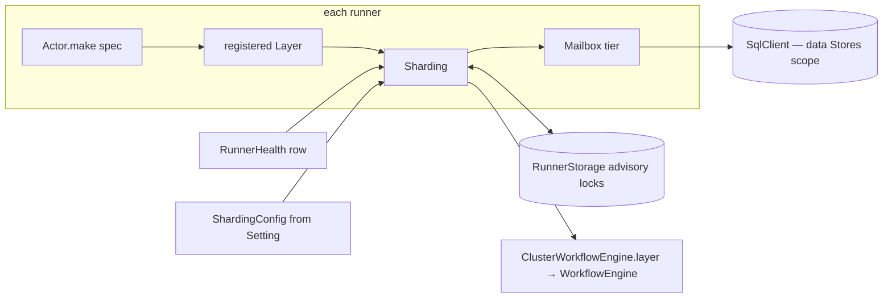

# [RUNTIME_ENTITY]

The durable-actor plane: a cluster entity is an `@effect/rpc` `RpcGroup` given sharded, per-id, single-writer identity, and this page owns everything that gives it that identity — the `WorkClass` service-class vocabulary every work surface prices itself against, the `Actor` mint that binds a protocol to fenced bounds and durability annotations, the `Mailbox` durable-message port over the data wave's `SqlClient` with the one `ClusterError → FaultClass` bridge, and the `Grid` topology assembly — leaderless sharding over `RunnerStorage` advisory locks, K8s runner health, the runner entry rows, the cluster singleton, and the workflow-engine bridge `flow` runs on. Sharding has no manager election: runners acquire, refresh, and release shard locks against storage, so the topology is a table of peers and a runner death is a lock expiry, never a coordinator failover. `work` composes `MessageStorage` and `SqlClient` as Tags satisfied at the app root from the data wave's `Stores` scopes; no SQL driver import is spellable here. The module ships on the `./server` exports subpath as `runtime/src/work/entity.ts`.

## [1]-[CLUSTERS]

| [INDEX] | [CLUSTER]     | [OWNS]                                                                              | [PUBLIC]     |
| :-----: | :------------ | :----------------------------------------------------------------------------------- | :----------- |
|  [01]   | `WORK_CLASS`  | the one service-class row table — concurrency, mailbox, idle, budget, priority        | `WorkClass`  |
|  [02]   | `ACTOR_MINT`  | the entity mint: protocol, fenced bounds, durability annotations, client, exposure    | `Actor`      |
|  [03]   | `MAILBOX`     | the durable-message port, dedup receipt, the `ClusterError → FaultClass` bridge       | `Mailbox`    |
|  [04]   | `GRID`        | leaderless topology, runner health, entry rows, singleton, the workflow-engine bridge | `Grid`       |

## [2]-[WORK_CLASS]

[WORK_CLASS]:
- Owner: `WorkClass`, the assembled service-class vocabulary — an interior key tuple in urgency order, a row table carrying the five axes every work surface reads, and the exported owner assembling rows, `kinds`, and `schema` under a `typeof`-derived stated annotation. Three rows ride the floor: `interactive` (a session-shaped actor: serialized handling, small mailbox, long residency, `pulse` budget, urgency 0), `steady` (an operational actor: bounded parallel handling, mid mailbox, `lease` budget, urgency 50), `bulk` (batch drains: wide handling, deep mailbox, short residency, `bulk` budget, urgency 100).
- Law: the row is the collapse point for three formerly parallel tables — entity fenced quotas, queue lane policy, and relay egress pacing all read these columns; a work surface that re-declares a `{ concurrency, retry }` pair beside this table is the named split-brain defect.
- Law: `concurrency` and `mailbox` are the entity fence — a tenant's actor saturates to `MailboxFull` at its own row's bound without starving a sibling; `idle` prices residency; `budget` names the `core/fault#RETRY_BUDGET` row whose compiled class-gated `Schedule` re-drives the class's transient faults; `urgency` is the integer the queue lane's claim `ORDER BY` term reads — smaller claims first.
- Law: `defectRetry` derives from the row's budget — the entity's `defectRetryPolicy` IS `Budget.schedule(row.budget)`, so a defecting handler re-drives under the same geometry as a transient fault and no second retry vocabulary exists.
- Growth: a new service class is one tuple entry plus one row every fence, lane, and pacing fold inherits at compile time; a new axis (a hedge delay, a spend weight) is one `Row` field consumed by the surfaces that name it.
- Boundary: which class an actor or job family selects is that declaration's policy field; this table prices classes and never names consumers.
- Packages: `effect` (`Duration`, `Schema`); `@rasm/ts/core` (`Budget`).

```typescript
import { ClusterError, ClusterSchema, Entity, EntityProxy, MessageStorage, RunnerHealth, Sharding, ShardingConfig, ShardingRegistrationEvent, Snowflake, SqlMessageStorage, SqlRunnerStorage } from "@effect/cluster"
import type { RpcGroup } from "@effect/rpc"
import { Duration, Effect, Layer, Schema, Stream, type Types } from "effect"
import { Budget, FaultClass, type TenantContext } from "@rasm/ts/core"
import { Setting } from "../proc/config.ts"

const _classes = ["interactive", "steady", "bulk"] as const

const _classRows = {
  interactive: { concurrency: 1, mailbox: 64, idle: Duration.minutes(30), budget: "pulse", urgency: 0 },
  steady: { concurrency: 4, mailbox: 512, idle: Duration.minutes(10), budget: "lease", urgency: 50 },
  bulk: { concurrency: 16, mailbox: 4096, idle: Duration.minutes(1), budget: "bulk", urgency: 100 },
} as const

declare namespace WorkClass {
  type Kinds = typeof _classes
  type Kind = keyof typeof _classRows
  type Row = {
    readonly concurrency: number
    readonly mailbox: number
    readonly idle: Duration.Duration
    readonly budget: Budget.Kind
    readonly urgency: number
  }
  type Contract = { readonly [K in Kinds[number]]: Row }
  type Shape = Types.Simplify<
    typeof _classRows & {
      readonly kinds: Kinds
      readonly schema: Schema.Literal<[...Kinds]>
      readonly defectRetry: (kind: Kind) => Budget.Gated
    }
  >
  type _Rows<T extends Contract = typeof _classRows> = T
}

const WorkClass: WorkClass.Shape = {
  ..._classRows,
  kinds: _classes,
  schema: Schema.Literal(..._classes),
  defectRetry: (kind) => Budget.schedule(_classRows[kind].budget),
}
```

## [3]-[ACTOR_MINT]

[ACTOR_MINT]:
- Owner: `Actor` — the one entity mint: `Actor.Spec` binds a name, a Schema-typed `RpcGroup` protocol, a `WorkClass` kind, and the tenant partition, and `Actor.make(spec)` compiles it — `Entity.fromRpcGroup` declares the actor, `annotateRpcs(ClusterSchema.Persisted, true)` marks every message durable-and-replayed, `annotateRpcs(ClusterSchema.ShardGroup, …)` partitions ids by the tenant key prefix so one tenant's saturation never crowds another's shard set, and `toLayer(handlers, bounds)` registers the exhaustively checked handler map under the class row's fence. The mint returns the registered `Layer`, the typed per-id `client`, and the two wire projections.
- Law: the protocol IS the contract — payload, success, and error `Schema`s on each `Rpc` are the message wire, the handler signature, and the client return at once; a message shape declared beside the group is unspellable. An agent session, a delivery drain, and a projection worker are all instances of this one mint.
- Law: single-writer is an entity fact — messages to one id serialize on one live instance cluster-wide, so per-key ordering needs no lock, version, or queue beside the actor; concurrency inside the row bounds parallel messages across ids, never within one.
- Law: an ephemeral message family is an annotation exemption, not a second mint — `spec.ephemeral` names the Rpc tags whose `Persisted` annotation stays off, so a heartbeat or a poll rides the same protocol without a storage write.
- Law: interrupt and trace posture are annotation rows on the same mint — `spec.interrupt` annotates `ClusterSchema.Uninterruptible` (`boolean | "client" | "server"`) so a must-settle message survives client disconnect by declaration, and `ClusterSchema.ClientTracingEnabled` turns the client span off for a chatty poll family as one row; neither is a handler-interior branch.
- Law: delayed delivery is native — a message whose payload carries the `DeliverAt.DeliverAt` `toMillis` interface delivers at its instant on the actor plane, so a one-shot deferred job is a scheduled message, never a timer or a poll beside the mailbox; `schedule`'s one-shot deferral rides this row.
- Law: the mailbox-drain reply seam is `Entity.Replier` — a `toLayerMailbox` handler answers out-of-band through `succeed`/`fail`/`failCause`/`complete(Exit)` on the handed replier, so a streaming-batch drain settles each message exactly once without occupying the serialized lane.
- Law: locality is span evidence — `Entity.CurrentAddress` and `Entity.CurrentRunnerAddress` are in-handler context Tags whose `EntityAddress`/`RunnerAddress` stamp the message span, so which shard and which runner handled a message reads off every trace, not just the registration census.
- Law: `Actor.expose(entity)` projects the entity as a `Contribution` pairing — `EntityProxy.toRpcGroup` for the RPC family, `EntityProxy.toHttpApiGroup` for the HTTP family, `EntityProxyServer` binding the served handler set where the proxied group serves locally — so the serving plane mounts an actor exactly like any other group and the typed client derives for free; the mailbox-draining `toLayerMailbox` form is the streaming-batch escape hatch and carries the same bounds.
- Law: a per-actor external handle rides `EntityResource.make({ acquire, idleTimeToLive })` — acquired once, surviving shard-move restarts, released on idle expiry — and the K8s pod form is `EntityResource.makeK8sPod`; a handle opened inside a handler body leaks across replays and is the rejected form.
- Entry: `Actor.make` at the owning page; `Entity.makeTestClient(entity, layer)` binds the kit-driven spec client with no runner.
- Growth: a new actor family is one `Spec` value; a new message is one `Rpc` row on its group; a new modality (streaming reply) is `toLayerMailbox` on the same spec.
- Packages: `@effect/cluster` (`Entity`, `EntityProxy`, `EntityResource`, `ClusterSchema`); `@effect/rpc` (`RpcGroup`); `effect` (`Layer`, `Effect`).

```typescript
declare namespace Actor {
  type Spec<Type extends string, Rpcs extends RpcGroup.Any> = {
    readonly name: Type
    readonly protocol: Rpcs
    readonly clazz: WorkClass.Kind
    readonly tenant: (entityId: string) => TenantContext.Key
    readonly ephemeral: ReadonlyArray<string>
    readonly interrupt: boolean | "client" | "server"
  }
}

const _make = <Type extends string, Rpcs extends RpcGroup.Any>(spec: Actor.Spec<Type, Rpcs>) => {
  const row = WorkClass[spec.clazz]
  const entity = Entity.fromRpcGroup(spec.name, spec.protocol).pipe(
    (e) => e.annotateRpcs(ClusterSchema.Persisted, true),
    (e) => e.annotateRpcs(ClusterSchema.ShardGroup, (entityId: string) => spec.tenant(entityId)),
    (e) => e.annotateRpcs(ClusterSchema.Uninterruptible, spec.interrupt),
  )
  const registered = (handlers: Parameters<typeof entity.toLayer>[0]) =>
    entity.toLayer(handlers, {
      concurrency: row.concurrency,
      mailboxCapacity: row.mailbox,
      maxIdleTime: row.idle,
      defectRetryPolicy: WorkClass.defectRetry(spec.clazz),
    })
  return { entity, registered, client: entity.client } as const
}

const _expose = <Type extends string, Rpcs extends RpcGroup.Any>(entity: Entity.Entity<Type, Rpcs>) => ({
  rpc: EntityProxy.toRpcGroup(entity),
  http: (name: string) => EntityProxy.toHttpApiGroup(name, entity),
})

const Actor = { make: _make, expose: _expose }
```

## [4]-[MAILBOX]

[MAILBOX]:
- Owner: `Mailbox` — the durable-message port composition and its fault fold. `SqlMessageStorage.layer` persists every `Persisted` message on the `SqlClient` Tag the app root satisfies from the data wave's `Stores` scopes; `Snowflake.layerGenerator` mints the monotonic message identity dedup keys on; `MessageStorage.layerMemory` is the single-node/spec tier and `layerNoop` the ephemeral tier — three tier rows behind one Tag, selected at the root.
- Law: delivery is at-least-once folded to exactly-once effect — `SaveResult.Duplicate`, keyed on `Snowflake` plus the Rpc primary key, re-subscribes a replayed send to the prior result and never re-executes the handler; the sender needs no idempotency wrapper because dedup is the storage contract.
- Law: the fault bridge is one governed record — every `ClusterError` tag maps to its `FaultClass` kind (`MailboxFull → exhausted`, `AlreadyProcessingMessage → conflicted`, `PersistenceError → unavailable`, `MalformedMessage → malformed`, `EntityNotAssignedToRunner → unavailable`, `RunnerNotRegistered → unavailable`, `RunnerUnavailable → unavailable`) — so cluster faults enter the branch rail with rank, blame, and the retryable column already decided, and `Mailbox.classify` is total over the family. Re-drive reads `FaultClass.retryable` through the caller's `Budget` row; no cluster-specific retry predicate exists.
- Law: drain liveness is supervised off the cluster's own instruments — `ClusterMetrics` carries the mailbox-depth and message-rate surface, a `Life` probe row reads it and grades a stalled drain as `lagging`, so a runner-transition stall surfaces as evidence instead of silent queue growth; the supervision is a probe over the standard metric source, never a bespoke meter or a second read loop.
- Boundary: the journal, outbox, and idempotency-ledger relations belong to the data wave; this port persists cluster envelopes in cluster-owned relations on the same scope, and atomicity with a domain aggregate is the data journal's transaction, reached by enqueuing from inside it — never by threading this storage into a domain write.
- Growth: a new durability tier is one row on the tier record; a new cluster fault tag is one bridge row the governed record demands at compile time.
- Packages: `@effect/cluster` (`SqlMessageStorage`, `MessageStorage`, `Snowflake`, `ClusterError`); `effect` (`Layer`); `@rasm/ts/core` (`FaultClass`).

```typescript
declare namespace Mailbox {
  type Tier = "durable" | "memory" | "noop"
}

const _tiers = {
  durable: Layer.provideMerge(SqlMessageStorage.layer, Snowflake.layerGenerator),
  memory: MessageStorage.layerMemory,
  noop: MessageStorage.layerNoop,
} as const

const _bridge = {
  MailboxFull: "exhausted",
  AlreadyProcessingMessage: "conflicted",
  PersistenceError: "unavailable",
  MalformedMessage: "malformed",
  EntityNotAssignedToRunner: "unavailable",
  RunnerNotRegistered: "unavailable",
  RunnerUnavailable: "unavailable",
} as const satisfies { readonly [tag: string]: FaultClass.Kind }

const _classify = (fault: ClusterError.ClusterError): FaultClass.Kind => _bridge[fault._tag] ?? "defect"

const Mailbox = {
  tier: (tier: Mailbox.Tier) => _tiers[tier],
  classify: _classify,
  retryable: (fault: ClusterError.ClusterError) => FaultClass[_classify(fault)].retryable,
}
```

## [5]-[GRID]

[GRID]:
- Owner: `Grid` — the topology assembly: `ShardingConfig.layerFromEnv` reads runner address, weight, shard groups, and lock intervals from the environment the deploy plane stamps (the `iac` StackOutputs → `ShardingConfig` shape seam, resolved through `Setting` rows, never a bare env read); `SqlRunnerStorage.layer` is the leaderless rebalancing substrate — runners acquire, refresh, and release shard advisory locks against storage under `shardLockRefreshInterval`/`shardLockExpiration`, so no manager, election, or coordinator exists; `RunnerHealth` is a kind row (`k8s` pod discovery over `K8sHttpClient`, `ping` for flat topologies, `noop` for single-node); and the runner entry is a `Runtime`-row selection — `NodeClusterHttp.layer`/`NodeClusterSocket.layer` with the Bun peers `BunClusterHttp.layer`/`BunClusterSocket.layer` are `@effect/platform-node`/`-bun` binding-tier modules (the frozen `@effect/cluster-node` family stays unadmitted), one options record (`transport`, `serialization: "msgpack"`, `storage: "sql"`, `runnerHealth`) — composed by the boot module beside the row's platform context, single-node degrading to the local-storage entry with `Mailbox.tier("memory")`.
- Law: `K8sHttpClient` is discovery only — it reads pod state through the service-account mount; provisioning, scaling, and image facts belong to the deploy plane, and a write-shaped call against it is unspellable here.
- Law: `Singleton.make(name, run)` is the one cluster-wide-instance form, reached directly at the package surface — the relay drain, a maintenance sweep, a horizon groom each run as a singleton that migrates on rebalance; a leader flag, a lock table, a "primary" config row, or a local rename of the package member is the rejected form.
- Law: the workflow bridge is `ClusterWorkflowEngine.layer` at the package surface — it satisfies the `WorkflowEngine` Tag over `Sharding` plus `MessageStorage`, so every `flow` definition runs durable and sharded by the same Layer selection that boots the grid; the spec engine swap happens at the root, never in a definition.
- Receipt: `Grid.census` folds `Sharding.getRegistrationEvents` through `ShardingRegistrationEvent.match` into typed rows — entity type or singleton name per registration — so the booted actor census lands beside the capability report as shaped startup evidence, never raw events.
- Growth: a new runner transport is one entry row — the websocket runner is `HttpRunner.layerWebsocket`, the served-with-clients form `RunnerServer.layerWithClients`; a new health mode is one kind row; a topology axis change is a `ShardingConfig` field the environment stamps.
- Packages: `@effect/cluster` (`Sharding`, `ShardingConfig`, `SqlRunnerStorage`, `RunnerHealth`, `K8sHttpClient`, `Singleton`, `ClusterWorkflowEngine`); `../proc/config.ts` (`Setting`); `../proc/exec.ts` (`Runtime` rows at the boot module).

```typescript
declare namespace Grid {
  type Health = "k8s" | "ping" | "noop"
}

const _health = {
  k8s: RunnerHealth.layerK8s(),
  ping: RunnerHealth.layerPing,
  noop: RunnerHealth.layerNoop,
} as const

const _topology = Layer.unwrapEffect(
  Effect.map(Setting, (setting) =>
    ShardingConfig.layerFromEnv({
      shardLockRefreshInterval: setting.cluster.lockRefresh,
      shardLockExpiration: setting.cluster.lockExpiry,
    })),
)

const _grid = (health: Grid.Health) =>
  Sharding.layer.pipe(
    Layer.provideMerge(SqlRunnerStorage.layer),
    Layer.provideMerge(_health[health]),
    Layer.provideMerge(_topology),
  )

const _rostered = ShardingRegistrationEvent.match({
  onEntityRegistered: (event) => ({ kind: "entity" as const, name: event.entity.type }),
  onSingletonRegistered: (event) => ({ kind: "singleton" as const, name: event.name }),
})

const Grid = {
  layer: _grid,
  census: Effect.map(Sharding.Sharding, (sharding) => Stream.map(sharding.getRegistrationEvents, _rostered)),
}

// --- [EXPORTS] --------------------------------------------------------------------------

export { Actor, Grid, Mailbox, WorkClass }
```


