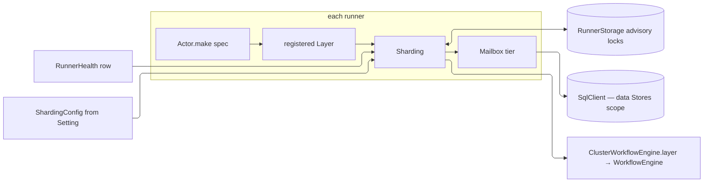

# [RUNTIME_ENTITY]

The durable-actor plane: a cluster entity is an `@effect/rpc` `RpcGroup` given sharded, per-id, single-writer identity, and this page owns everything that gives it that identity — the `WorkClass` service-class vocabulary every work surface prices itself against, the `Settled` carrier every work surface answers with when its concern lands, the `Actor` mint that binds a protocol to fenced bounds and durability annotations, the `Mailbox` durable-message port over the data wave's `SqlClient` with the one `ClusterError → Fault.Class` bridge, and the `Grid` topology assembly — leaderless sharding over `RunnerStorage` advisory locks, K8s runner health, the runner entry rows, the cluster singleton, and the workflow-engine bridge `flow` runs on. Sharding has no manager election: runners acquire, refresh, and release shard locks against storage, so the topology is a table of peers and a runner death is a lock expiry, never a coordinator failover. `work` composes `MessageStorage` and `SqlClient` as Tags satisfied at the app root from the data wave's `Stores` scopes; no SQL driver import is spellable here. The module ships on the `./server` exports subpath as `runtime/src/work/entity.ts`.

## [01]-[INDEX]

- [02]-[WORK_CLASS]: the one service-class row table — concurrency, mailbox, idle, budget, attempts, priority; `WorkClass`.
- [03]-[SETTLED]: the one landed-work carrier — partition, provenance, warning band, stamp pair; `Settled`.
- [04]-[ACTOR_MINT]: the entity mint: protocol, fenced bounds, durability annotations, client, exposure; `Actor`.
- [05]-[MAILBOX]: the durable plane's two-store tier rows, the `SaveResult.Duplicate` dedup, the `ClusterError → Fault.Class` bridge; `Mailbox`.
- [06]-[GRID]: leaderless topology, runner health, entry rows, singleton, the workflow-engine bridge; `Grid`.

## [02]-[WORK_CLASS]

[WORK_CLASS]:
- Owner: `WorkClass`, the assembled service-class vocabulary — the row table carries every axis a work surface reads, and the exported owner derives `kinds` and `schema` from that table under one `typeof`-derived annotation. Three seed rows ride the parameterized family: `interactive` (serialized handling, small mailbox, long residency, `pulse` budget, three attempts, urgency 0), `steady` (bounded parallel handling, mid mailbox, `lease` budget, five attempts, urgency 50), and `bulk` (wide handling, deep mailbox, short residency, `bulk` budget, eight attempts, urgency 100).
- Law: the row is the collapse point for three formerly parallel tables — entity fenced quotas, queue lane policy, and relay egress pacing all read these columns; a work surface that re-declares a `{ concurrency, retry }` pair beside this table is the named split-brain defect.
- Law: `concurrency` and `mailbox` are the entity fence — a tenant's actor saturates to `MailboxFull` at its own row's bound without starving a sibling; `idle` prices residency; `budget` names the `core/value/fault#RETRY_BUDGET` row; `attempts` is the durable lane's park ceiling; `urgency` is the integer the claim `ORDER BY` term reads — smaller claims first.
- Growth: a new service class is one tuple entry plus one row every fence, lane, and pacing fold inherits at compile time; a new axis (a hedge delay, a spend weight) is one `Row` field consumed by the surfaces that name it.
- Boundary: which class an actor or job family selects is that declaration's policy field; this table prices classes and never names consumers.
- Packages: `effect` (`Duration`, `Function`, `Schema`); `@rasm/core` (`Fault.Budget`).

```typescript
import { ClusterError, ClusterMetrics, ClusterSchema, ClusterWorkflowEngine, Entity, EntityProxy, EntityProxyServer, EntityResource, MessageStorage, RunnerHealth, Sharding, ShardingConfig, ShardingRegistrationEvent, Snowflake, SqlMessageStorage, SqlRunnerStorage } from "@effect/cluster"
import { PersistedQueue } from "@effect/experimental"
import type { HttpApi } from "@effect/platform"
import { type Rpc, RpcGroup } from "@effect/rpc"
import { SqlPersistedQueue } from "@effect/sql"
import { Array, Duration, Effect, Function, Layer, Metric, Option, Schema, type Scope, Stream, Struct, type Types } from "effect"
import { Convention, Fault, type Identity } from "@rasm/core"
import { Profile } from "../otel/profile.ts"
import { Setting } from "../proc/config.ts"

const _classRows = {
  interactive: { concurrency: 1, mailbox: 64, idle: Duration.minutes(30), budget: "pulse", attempts: 3, urgency: 0 },
  steady: { concurrency: 4, mailbox: 512, idle: Duration.minutes(10), budget: "lease", attempts: 5, urgency: 50 },
  bulk: { concurrency: 16, mailbox: 4096, idle: Duration.minutes(1), budget: "bulk", attempts: 8, urgency: 100 },
} as const

const _classes = Struct.keys(_classRows)

declare namespace WorkClass {
  type Kinds = typeof _classes
  type Kind = keyof typeof _classRows
  type Row = {
    readonly concurrency: number
    readonly mailbox: number
    readonly idle: Duration.Duration
    readonly budget: Fault.Budget.Kind
    readonly attempts: number
    readonly urgency: number
  }
  type Contract = { readonly [K in Kinds[number]]: Row }
  type Shape = Types.Simplify<
    typeof _classRows & {
      readonly kinds: Kinds
      readonly schema: Schema.Literal<[...Kinds]>
      readonly defectRetry: (kind: Kind) => Fault.Budget.Gated
    }
  >
  type _Rows<T extends Contract = typeof _classRows> = T
}

const WorkClass: WorkClass.Shape = {
  ..._classRows,
  kinds: _classes,
  schema: Schema.Literal(..._classes),
  defectRetry: (kind) => Fault.Budget.schedule(_classRows[kind].budget, Function.constTrue),
}
```

## [03]-[SETTLED]

[SETTLED]:
- Owner: `Settled` — the carrier a work surface answers when its concern LANDED, collapsing the delivery and document settlements onto one spine: the concern partition, the consumed and produced provenance, the warning band, and the stamp pair. Each producer declares its own `evidence` column through `Settled.extend`, so a payload's type stays exact at its producer while the spine stays total for every consumer reading across producers.
- Law: this carrier is the SETTLED half of `queue#LANE_POLICY`'s verdict and never its twin — the verdict states that a claim's custody ended, this carrier states what the effect produced, so a drain answers the verdict and its lane row answers the carrier.
- Law: lineage is the growth site — a producer widens through `Settled.extend<Self>(identifier)({ evidence })` and inherits every spine column and getter; a second class restating the spine is the parallel-carrier defect that let one folder carry two settlement vocabularies whose partitions, provenance, and warning bands no consumer could join.
- Law: `partition` is a payload-free vocabulary spread from one anchor as a literal, never a case family a decoding field cannot carry — `whole` every declared concern landed, `partial` some landed and the warning band names the rest, `empty` the producer ran and produced nothing. A producer that cannot separate partial from whole states `whole` and forfeits the band rather than minting a fourth word.
- Law: a warning is a named non-refusing DEGRADATION carrying the band its refusal would have taken — a producer folds its own `Fault.Class.family` reason through `classOf`, so the class rank lattice grades degradations exactly as it grades refusals and `degraded` elects the dominant one; a fault the rail already carried is not a warning, and a free note beside the evidence is not either.
- Law: the content key is NOT a spine column — runtime mints no content identity, so a produced artifact's key arrives from the data wave's artifact-index put over the landed bytes; a required key here would stamp an identity no producer took.
- Law: `provenance` states both directions — `consumed` names the identities this settlement spent, `produced` the one identity it minted — so a settlement joins backward to its cause and forward to its output without a second index.
- Boundary: a child-exit status (`proc/exec`'s `Proc.Status`) and a byte-parity proof (`browser/fetch`'s verified arrival) name no produced output and carry no provenance, so neither joins this family; folding either in fabricates spine columns their producers never measure, and neither seats where this carrier does.
- Growth: a new producer is one `extend` declaration; a new spine dimension is one field every producer's fold populates.
- Packages: `effect` (`Array`, `Option`, `Schema`); `@rasm/core` (`Fault.Class`).

```typescript
const _Warning = Schema.Struct({
  class: Fault.Class.schema,
  reason: Schema.NonEmptyString,
  note: Schema.String,
})

const _partitions = ["whole", "partial", "empty"] as const

class Settled extends Schema.Class<Settled>("Work.Settled")({
  partition: Schema.Literal(..._partitions),
  provenance: Schema.Struct({
    consumed: Schema.Array(Schema.NonEmptyString),
    produced: Schema.NonEmptyString,
  }),
  warnings: Schema.Array(_Warning),
  at: Schema.DateTimeUtc,
  span: Schema.Duration,
}) {
  get degraded(): Option.Option<Fault.Class.Kind> {
    return Array.match(Array.map(this.warnings, (warning) => warning.class), {
      onEmpty: Option.none,
      onNonEmpty: (classes) => Option.some(Fault.Class.dominant(classes)),
    })
  }
}

declare namespace Settled {
  type Partition = (typeof _partitions)[number]
  type Warning = typeof _Warning.Type
  type Of<Evidence> = Settled & { readonly evidence: Evidence }
}
```

## [04]-[ACTOR_MINT]

[ACTOR_MINT]:
- Owner: `Actor` — the one entity mint: `Actor.Spec` binds a name, a typed protocol generator, a `WorkClass` kind, tenant partition, and per-Rpc posture sets. The generator receives the mint's polymorphic annotation function and calls `RpcGroup.make` over its declaration tuple, preserving the exact Rpc union without an assertion while compiling each Rpc's `Persisted` and `ClientTracingEnabled` verdicts. `Entity.fromRpcGroup` then declares the actor, shard-group annotation partitions ids by tenant, and `toLayer` registers the exhaustive handler map under the class fence.
- Law: the protocol IS the contract — payload, success, and error `Schema`s on each `Rpc` are the message wire, the handler signature, and the client return at once; a message shape declared beside the group is unspellable. An agent session, a delivery drain, and a projection worker are all instances of this one mint.
- Law: single-writer is an entity fact — messages to one id serialize on one live instance cluster-wide, so per-key ordering needs no lock, version, or queue beside the actor; concurrency inside the row bounds parallel messages across ids, never within one.
- Law: an ephemeral message family is a per-Rpc annotation verdict, not a second mint — `spec.ephemeral` names the Rpc tags whose `Persisted` annotation compiles `false` at the mint's per-Rpc fold, so a heartbeat or a poll rides the same protocol with no storage write, and a tag outside the set keeps the durable-and-replayed contract; a group-wide `annotateRpcs(ClusterSchema.Persisted, true)` that ignores the set is the inert-policy defect this fold exists to prevent.
- Law: interrupt and trace posture are annotation rows on the same mint — `spec.interrupt` annotates `ClusterSchema.Uninterruptible` (`boolean | "client" | "server"`) group-wide so a must-settle message survives client disconnect by declaration, and `spec.untraced` names the chatty poll tags whose `ClusterSchema.ClientTracingEnabled` compiles `false` in the same per-Rpc fold; neither is a handler-interior branch.
- Law: delayed delivery is native — a message whose payload carries the `DeliverAt.DeliverAt` `toMillis` interface delivers at its instant on the actor plane, so a one-shot deferred job is a scheduled message, never a timer or a poll beside the mailbox; `schedule`'s one-shot deferral rides this row.
- Law: the mailbox-drain reply seam is `Entity.Replier` — a `toLayerMailbox` handler answers out-of-band through `succeed`/`fail`/`failCause`/`complete(Exit)` on the handed replier, so a streaming-batch drain settles each message exactly once without occupying the serialized lane.
- Law: locality is span evidence — `Entity.CurrentAddress` and `Entity.CurrentRunnerAddress` are in-handler context Tags whose `EntityAddress`/`RunnerAddress` stamp the message span, so which shard and which runner handled a message reads off every trace, not just the registration census.
- Law: actor identity is rostered vocabulary at two seats — `toLayer`'s `spanAttributes` stamps `rasm.work.family` statically on every message span beside the package's own `entity.type`, and the lifetime span carries family beside the instance's `rasm.work.shard` read from `Entity.CurrentAddress` — because the message seat is a static record no per-instance fact can ride; a free-string identity attribute beside these rows forks the join a trace view filters on.
- Law: `Actor.expose(entity)` projects the entity as `serve/api#CONTRIBUTION` pairing material — `EntityProxy.toRpcGroup(entity)` beside `EntityProxyServer.layerRpcHandlers(entity)` is exactly the `Contribution.rpc(group, handlers)` pair, and `EntityProxy.toHttpApiGroup(name, entity)` beside the api-reading builder `(api) => EntityProxyServer.layerHttpApi(api, name, entity)` is exactly the `Contribution.http(group, handlers)` pair — so the app mounts an actor through the same two pairing constructors as every other group and the typed client derives for free; a bare group projection whose handler binding the app must rediscover is the half-pairing defect. The mailbox-draining `toLayerMailbox` form is the streaming-batch escape hatch and carries the same bounds.
- Law: a per-actor external handle is a `Spec.resource` column, never a raw handler-body acquisition — the mint folds `Option.map(spec.resource, (acquire) => EntityResource.make({ acquire, idleTimeToLive: row.idle }))`, so the handle's residency is the actor's own `WorkClass` idle window, it survives a shard-move restart, and it releases on idle expiry; the K8s pod form is `EntityResource.makeK8sPod` against the same column. A handle opened raw inside a handler body leaks across replays and is the rejected form, and an actor with no external handle states `Option.none()` rather than carrying a null slot.
- Law: the resource is published as an EFFECT whose ONE seat is the per-instance handler builder — `EntityResource.make` mints a fresh `RcRef` per call and acquires eagerly, and its requirement channel names `Entity.CurrentAddress`, which `toLayer` provides to a builder effect alone (the return type excludes `Scope`, `CurrentAddress`, and `CurrentRunnerAddress` from `RX` for exactly that reason). So an actor's builder runs `resource` once and its handlers read `held.get` per message; calling `make` inside a handler body mints a second `RcRef` and a second acquisition on every message — the leak this column exists to close, wearing the column's name. `registered` therefore carries the package's own generic pair rather than an erased parameter type, because an erased builder cannot state the requirement the seat depends on.
- Law: the actor's LIFETIME is a span and the builder is its one seat — `toLayer` provides `Scope`, `Entity.CurrentAddress`, and `Entity.CurrentRunnerAddress` to the builder effect alone and excludes all three from the Layer's requirement, so `actor/<name>` opens there and ends when the instance's scope closes on shard move or idle expiry. This is the anchor the locality law above needs: a span that exists for exactly as long as the instance does, rather than a per-message span that outlives nothing.
- Law: that span is the branch's ACTOR PROFILE ANCHOR — `otel/profile#BANDS`'s effectful arm stamps the correlation attribute on it, so a flamegraph window resolves from a trace view at the instance grain. The arm carries the attribute ALONE by that owner's law: an actor's messages interleave across fibers and the engine's label set is thread-global, so no sample label can name this region from here; a handler running a genuinely synchronous kernel takes the band's synchronous arm under this same span, and the `span_id` label it writes is what closes the store join this attribute opened.
- Law: the band's channel is the actor FAMILY and its steps are the three regions one instance owns, so a family's profile series count is bounded by its lifecycle rather than by its message roster — a per-Rpc step mints one series per tag per family, which is the metric-cardinality defect wearing a profile label.
- Entry: `Actor.make` at the owning page; `Entity.makeTestClient(entity, layer)` binds the kit-driven spec client with no runner.
- Growth: a new actor family is one `Spec` value; a new message is one `Rpc` row on its group; a new per-Rpc posture axis is one exemption set folded at `_annotated`; a new modality (streaming reply) is `toLayerMailbox` on the same spec; a new banded region is one `_PHASES` entry.
- Packages: `@effect/cluster` (`Entity`, `EntityProxy`, `EntityProxyServer`, `EntityResource`, `ClusterSchema`); `@effect/rpc` (`Rpc`, `RpcGroup`); `@effect/platform` (`HttpApi` — the pairing builder's api parameter); `effect` (`Array`, `Effect`, `Layer`, `Option`, `Scope`); `@rasm/core` (`Convention` — the identity rows both span seats stamp); `../otel/profile.ts` (`Profile`).

```typescript
declare namespace Actor {
  type Spec<Type extends string, Rpcs extends Rpc.Any, Handle = never, Fault = never, Need = never> = {
    readonly name: Type
    readonly protocol: (annotate: <Current extends Rpcs>(rpc: Current) => Current) => RpcGroup.RpcGroup<Rpcs>
    readonly clazz: WorkClass.Kind
    readonly tenant: (entityId: string) => Identity.Tenant.Key
    readonly ephemeral: ReadonlyArray<Rpcs["_tag"]>
    readonly untraced: ReadonlyArray<Rpcs["_tag"]>
    readonly interrupt: boolean | "client" | "server"
    readonly resource: Option.Option<Effect.Effect<Handle, Fault, Need>>
  }
}

const _PHASES = ["instance", "message", "resource"] as const

const _band = (name: string): Profile.BandVocabulary => ({ channel: [name], step: _PHASES })

const _annotated = <Rpcs extends Rpc.Any>(
  spec: Pick<Actor.Spec<string, Rpcs, unknown, unknown, unknown>, "protocol" | "ephemeral" | "untraced">,
): RpcGroup.RpcGroup<Rpcs> =>
  spec.protocol(<Current extends Rpcs>(rpc: Current): Current =>
    rpc
      .annotate(ClusterSchema.Persisted, !Array.contains(spec.ephemeral, rpc._tag))
      .annotate(ClusterSchema.ClientTracingEnabled, !Array.contains(spec.untraced, rpc._tag)))

const _make = <Type extends string, Rpcs extends Rpc.Any, Handle, Fault, Need>(spec: Actor.Spec<Type, Rpcs, Handle, Fault, Need>) => {
  const row = WorkClass[spec.clazz]
  const entity = Entity.fromRpcGroup(spec.name, _annotated(spec)).pipe(
    (e) => e.annotateRpcs(ClusterSchema.ShardGroup, (entityId: string) => spec.tenant(entityId)),
    (e) => e.annotateRpcs(ClusterSchema.Uninterruptible, spec.interrupt),
  )
  const resource = Option.map(spec.resource, (acquire) => EntityResource.make({ acquire, idleTimeToLive: row.idle }))
  const band = _band(spec.name)
  const anchored = <Handlers, RX>(build: Effect.Effect<Handlers, never, RX>): Effect.Effect<Handlers, never, RX | Scope.Scope | Entity.CurrentAddress> =>
    Profile.banded(band, { channel: spec.name, step: "instance" }, build).pipe(
      Effect.catchTag("ParseError", Effect.die),
      (built) =>
        Effect.zipRight(
          Effect.flatMap(Entity.CurrentAddress, (address) =>
            Effect.annotateCurrentSpan({
              [Convention.rasm.workFamily]: spec.name,
              [Convention.rasm.workShard]: `${address.shardId}`,
            } satisfies Convention.Attributes)),
          built,
        ),
      Effect.withSpanScoped(`actor/${spec.name}`),
    )
  const registered = <Handlers extends Entity.HandlersFrom<Rpcs>, RX = never>(build: Handlers | Effect.Effect<Handlers, never, RX>) =>
    entity.toLayer(anchored(Effect.isEffect(build) ? build : Effect.succeed(build)), {
      concurrency: row.concurrency,
      mailboxCapacity: row.mailbox,
      maxIdleTime: row.idle,
      defectRetryPolicy: WorkClass.defectRetry(spec.clazz),
      spanAttributes: { [Convention.rasm.workFamily]: spec.name },
    })
  return { band, entity, registered, resource, client: entity.client } as const
}

const _expose = <Type extends string, Rpcs extends Rpc.Any>(entity: Entity.Entity<Type, Rpcs>) => ({
  rpc: EntityProxy.toRpcGroup(entity),
  rpcHandlers: EntityProxyServer.layerRpcHandlers(entity),
  http: (name: string) => EntityProxy.toHttpApiGroup(name, entity),
  httpHandlers: (name: string) => <Api extends HttpApi.HttpApi.Any>(api: Api) => EntityProxyServer.layerHttpApi(api, name, entity),
})

const Actor = { make: _make, expose: _expose }
```

## [05]-[MAILBOX]

[MAILBOX]:
- Owner: `Mailbox` — the durable plane's store composition and its fault fold. Each tier row publishes the two stores the plane draws on: the cluster envelope store (`SqlMessageStorage.layer` on the `SqlClient` Tag the app root satisfies from the data wave's `Stores` scopes, with `Snowflake.layerGenerator` minting the monotonic identity dedup keys on; `MessageStorage.layerMemory` for single-node and spec, `layerNoop` for ephemeral) AND the queue-item store (`PersistedQueue.layer` over `SqlPersistedQueue.layerStore()` on the same `SqlClient`, over `PersistedQueue.layerStoreMemory` on the lighter tiers) — three rows behind one selection at the root.
- Law: the two stores are disjoint by signature and neither substitutes for the other — `MessageStorage` holds cluster envelopes keyed by `Snowflake` plus Rpc primary key, `PersistedQueueFactory` holds queue items a `DurableQueue.worker` leases and settles, and the `worker` Layer's requirement names the second by type. A tier publishing only the envelope arm leaves every `queue#JOB_FAMILY` worker Layer unsatisfiable at the composition root, which is why the queue store is a column on this row and not a fourth Layer the app must remember.
- Law: delivery is at-least-once folded to exactly-once effect — `SaveResult.Duplicate`, keyed on `Snowflake` plus the Rpc primary key, re-subscribes a replayed send to the prior result and never re-executes the handler; the sender needs no idempotency wrapper because dedup is the storage contract.
- Law: cluster topology is observed through the package's own instruments — `Grid.metrics` reads `ClusterMetrics.entities`, `ClusterMetrics.singletons`, `ClusterMetrics.runners`, `ClusterMetrics.runnersHealthy`, and `ClusterMetrics.shards` as one concurrent snapshot, so runner and shard topology stays aligned with the cluster runtime's registered gauges. Mailbox depth and drain rate belong to the queue and journal owners because `ClusterMetrics` exposes neither; attributing those signals to this package is a phantom contract.
- Boundary: the journal, outbox, and idempotency-ledger relations belong to the data wave; this port persists cluster envelopes in cluster-owned relations on the same scope, and atomicity with a domain aggregate is the data journal's transaction, reached by enqueuing from inside it — never by threading this storage into a domain write.
- Growth: a new durability tier is one row on the tier record carrying both store arms; a new cluster fault tag is one bridge row the governed record demands at compile time.

```typescript
declare namespace Mailbox {
  type Tier = "durable" | "memory" | "noop"
}

const _tiers = {
  durable: Layer.mergeAll(
    Layer.provideMerge(SqlMessageStorage.layer, Snowflake.layerGenerator),
    Layer.provide(PersistedQueue.layer, SqlPersistedQueue.layerStore()),
  ),
  memory: Layer.mergeAll(MessageStorage.layerMemory, Layer.provide(PersistedQueue.layer, PersistedQueue.layerStoreMemory)),
  noop: Layer.mergeAll(MessageStorage.layerNoop, Layer.provide(PersistedQueue.layer, PersistedQueue.layerStoreMemory)),
} as const

const _bridge = {
  MailboxFull: "exhausted",
  AlreadyProcessingMessage: "conflicted",
  PersistenceError: "unavailable",
  MalformedMessage: "malformed",
  EntityNotAssignedToRunner: "unavailable",
  RunnerNotRegistered: "unavailable",
  RunnerUnavailable: "unavailable",
} as const satisfies Record<ClusterError.ClusterError["_tag"], Fault.Class.Kind>

const _classify = (fault: ClusterError.ClusterError): Fault.Class.Kind => _bridge[fault._tag]

const Mailbox = {
  tier: (tier: Mailbox.Tier) => _tiers[tier],
  classify: _classify,
  retryable: (fault: ClusterError.ClusterError) => Fault.Class.retryable(_classify(fault)),
}
```

## [06]-[GRID]

[GRID]:
- Owner: `Grid` — the topology core: `ShardingConfig.layerFromEnv` reads lock intervals from `Setting`; `SqlRunnerStorage.layer` is the leaderless rebalancing substrate; `RunnerHealth` is a kind row (`k8s`, `ping`, `noop`); and `Grid.workflow` is the package's `ClusterWorkflowEngine.layer`. The runner binding remains the `proc/exec#RUNTIME_ROWS` selection — `NodeClusterHttp.layer`/`NodeClusterSocket.layer` and their Bun peers compose beside this core at boot, while single-node selects `Mailbox.tier("memory")` and `WorkflowEngine.layerMemory`.
- Law: `K8sHttpClient` is discovery only — it reads pod state through the service-account mount; provisioning, scaling, and image facts belong to the deploy plane, and a write-shaped call against it is unspellable here.
- Law: `Singleton.make(name, run)` is the one cluster-wide-instance form, reached directly at the package surface — the relay drain, a maintenance sweep, a horizon groom each run as a singleton that migrates on rebalance; a leader flag, a lock table, a "primary" config row, or a local rename of the package member is the rejected form.
- Law: the workflow bridge is `ClusterWorkflowEngine.layer` at the package surface — it satisfies the `WorkflowEngine` Tag over `Sharding` plus `MessageStorage`, so every `flow` definition runs durable and sharded by the same Layer selection that boots the grid; the spec engine swap happens at the root, never in a definition.
- Output: `Grid.census` folds `Sharding.getRegistrationEvents` through `ShardingRegistrationEvent.match` into typed rows — entity type or singleton name per registration — so the booted actor census lands beside the capability report as shaped startup evidence, never raw events.
- Growth: a new runner transport is one entry row — the websocket runner is `HttpRunner.layerWebsocket`, the served-with-clients form `RunnerServer.layerWithClients`; a new health mode is one kind row; a topology axis change is a `ShardingConfig` field the environment stamps.
- Packages: `@effect/cluster` (`Sharding`, `ShardingConfig`, `SqlRunnerStorage`, `RunnerHealth`, `K8sHttpClient`, `Singleton`, `ClusterWorkflowEngine`); `../proc/config.ts` (`Setting`); `../proc/exec.ts` (`Runtime` rows at the boot module).

```typescript
declare namespace Grid {
  type Health = "k8s" | "ping" | "noop"
}

const _health = {
  k8s: RunnerHealth.layerK8s(),
  ping: RunnerHealth.layerPing,
  noop: RunnerHealth.layerNoop,
} as const

const _topology = Layer.unwrapEffect(
  Effect.map(Setting, (setting) =>
    ShardingConfig.layerFromEnv({
      shardLockRefreshInterval: setting.cluster.lockRefresh,
      shardLockExpiration: setting.cluster.lockExpiry,
    })),
)

const _grid = (health: Grid.Health) =>
  Sharding.layer.pipe(
    Layer.provideMerge(SqlRunnerStorage.layer),
    Layer.provideMerge(_health[health]),
    Layer.provideMerge(_topology),
  )

const _rostered = ShardingRegistrationEvent.match({
  onEntityRegistered: (event) => ({ kind: "entity" as const, name: event.entity.type }),
  onSingletonRegistered: (event) => ({ kind: "singleton" as const, name: event.name }),
})

const _metrics = Effect.all({
  entities: Metric.value(ClusterMetrics.entities),
  singletons: Metric.value(ClusterMetrics.singletons),
  runners: Metric.value(ClusterMetrics.runners),
  runnersHealthy: Metric.value(ClusterMetrics.runnersHealthy),
  shards: Metric.value(ClusterMetrics.shards),
}, { concurrency: "unbounded" })

const Grid = {
  layer: _grid,
  workflow: ClusterWorkflowEngine.layer,
  census: Effect.map(Sharding.Sharding, (sharding) => Stream.map(sharding.getRegistrationEvents, _rostered)),
  metrics: _metrics,
}

// --- [EXPORTS] -------------------------------------------------------------------------

export { Actor, Grid, Mailbox, Settled, WorkClass }
```


```mermaid
---
config:
  layout: elk
  flowchart:
    curve: linear
    padding: 25
---
flowchart LR
  accTitle: Durable actor grid composition
  accDescr: Actor declarations register into sharding, which composes mailbox persistence, advisory-lock ownership, runner health, configuration, and the cluster workflow engine.
  subgraph runner[each runner]
    A[Actor.make spec] --> B[registered Layer]
    B --> S[Sharding]
    S --> M[Mailbox tier]
  end
  S <--> L[(RunnerStorage advisory locks)]
  M --> Q[(SqlClient — data Stores scope)]
  H[RunnerHealth row] --> S
  E[ShardingConfig from Setting] --> S
  S --> W[ClusterWorkflowEngine.layer → WorkflowEngine]
```

## [07]-[RESEARCH]

<!-- source-only: research row template:
[TOKEN]-[OPEN|BLOCKED]: <exact question>; <verification route>.
-->

(none)
