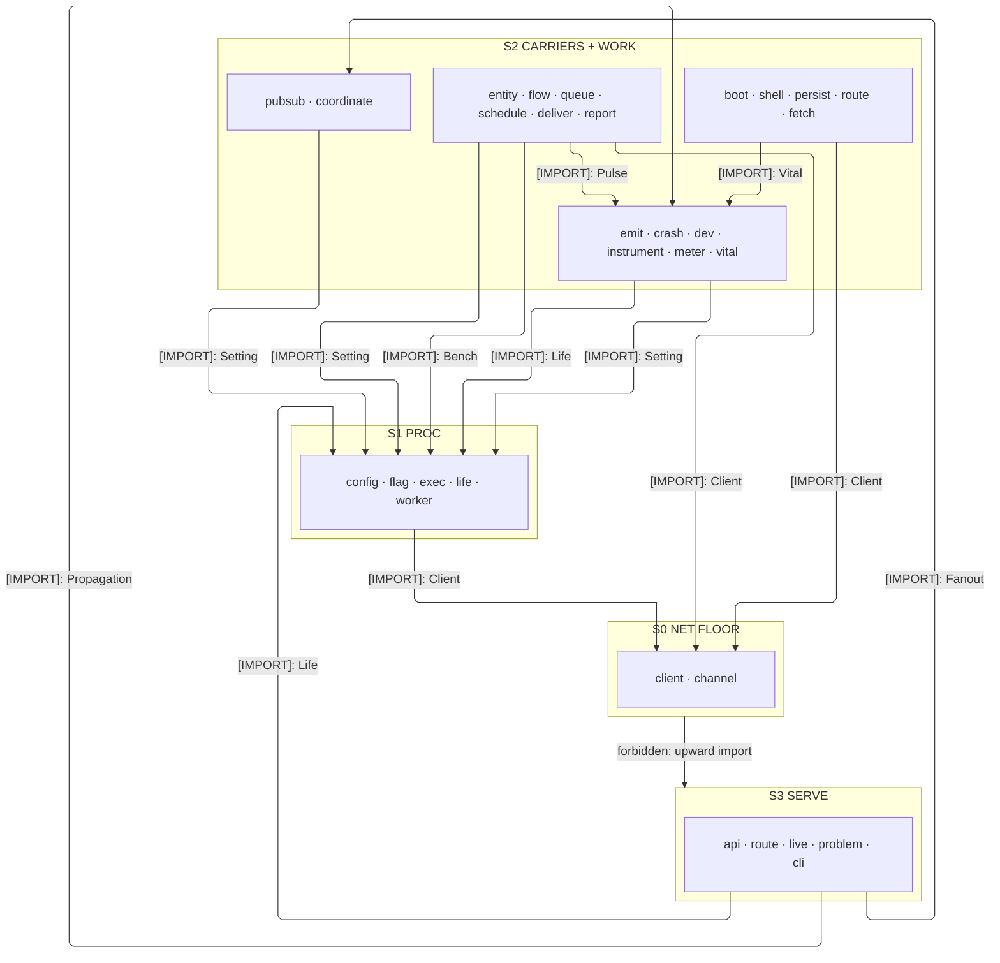
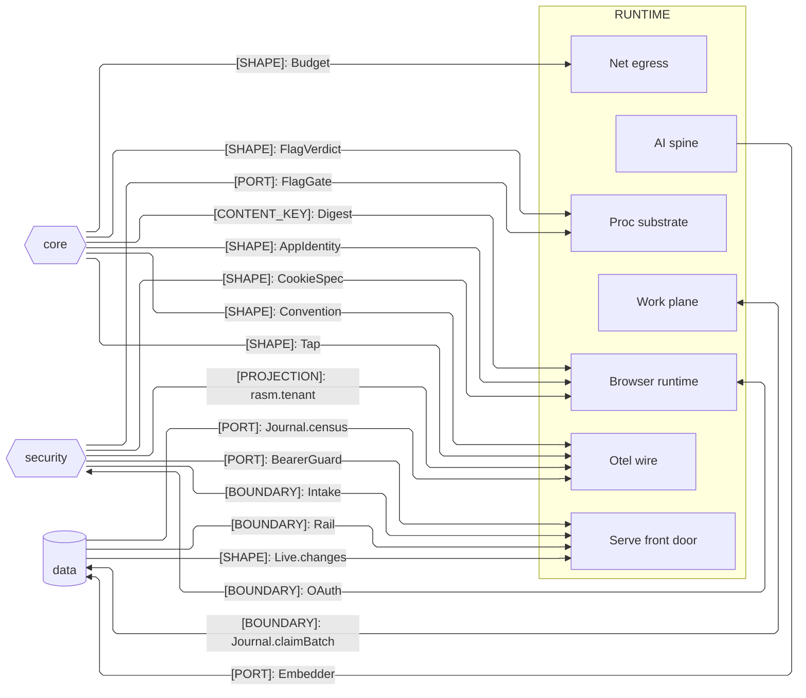
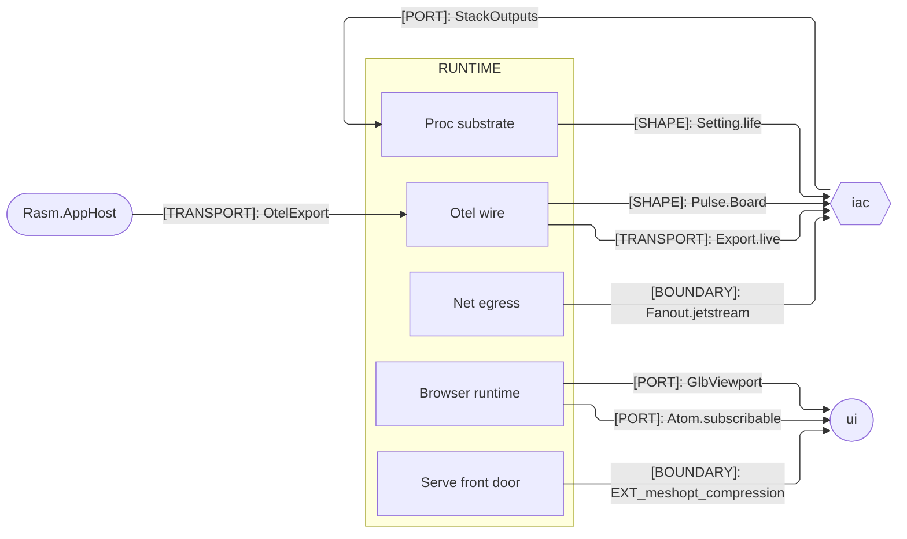

# [TS_RUNTIME_ARCHITECTURE]

`runtime` owns the branch's execution substrate across both process planes: `proc`, `net`, `otel`, `serve`, `work`, and `ai` meet through one runtime-row table, one budget ledger, one fault law, and one front-door assembly law, and `browser` is the same package under the browser condition, never a sibling. Owners align with the core, security, and data peers, the interface and deploy planes, and the C# host by seam contract, never a cross-package reference.

## [01]-[DOMAIN_MAP]

```text codemap
runtime/
└── src/
    ├── proc/                  # Process substrate: runtime rows, config, flags, lifecycle, off-thread compute
    │   ├── exec.ts            # Keyed node|bun runtime-row binding table; child processes as declarative values
    │   ├── config.ts          # Ordered provider chain and the boot-validated Setting contract resolved once
    │   ├── flag.ts            # OpenFeature server Provider: a recursive rule family over content-key bucketing
    │   ├── life.ts            # Ranked lifecycle and health rows on severed fibers folded into one graded receipt
    │   └── worker.ts          # Off-thread worker protocol: zero-copy crossings over one pool
    ├── net/                   # Outbound transport and the fanout/replay port
    │   ├── client.ts          # Outbound HTTP lane table: status admission and retry pulses off the core budget
    │   ├── channel.ts         # Framed long-lived byte channels: socket duplex and SSE feeds over one frame vocabulary
    │   ├── pubsub.ts          # Fanout — the engine-blind broadcast, replay, and blob port over one Broker
    │   └── coordinate.ts      # Accord — the engine-blind lease, elect, and CAS coordination port
    ├── otel/                  # OTLP wire: egress, W3C continuation, crash capture, browser RUM
    │   ├── emit.ts            # One OTLP egress Layer and the W3C continuation ingress under the redaction scrub
    │   ├── instrument.ts      # Browser auto-instrumentation registration on the web lane's exposed provider
    │   ├── dev.ts             # plane:dev DevTools registration node on the ./dev subpath; the gauge fails any runtime import
    │   ├── crash.ts           # Total Cause-to-fatal-emission fold through the core forensic fault band
    │   ├── meter.ts           # Work-plane fact-to-instrument bridge, census gauges, log floor, tenant views
    │   └── vital.ts           # RUM vital rows over one scoped PerformanceObserver bridge
    ├── serve/                 # One public front door
    │   ├── api.ts             # Assembly law: sub-domains export group data, the app assembles one HttpApi
    │   ├── route.ts           # HttpLayerRouter serving fold: api mount, upload dispatch, and intake verify
    │   ├── live.ts            # Realtime SSE/WS serving over branch feeds under the resume-token and admission laws
    │   ├── problem.ts         # Problem — the RFC 9457 owner rendering itself as a self-describing response
    │   └── cli.ts             # Command-value verb families the app folds into one root
    ├── work/                  # Durable work: actors, workflows, queues, schedules, delivery, documents
    │   ├── entity.ts          # Durable-actor plane: the WorkClass service-class table over tiered mailboxes
    │   ├── flow.ts            # Workflow suspend-and-replay: minted steps, two-tier deadlines, one durable pause timer
    │   ├── queue.ts           # DurableQueue families and rate-limiter throttles over the pg lane policy and DLQ fold
    │   ├── schedule.ts        # Cadence rows minted into cluster cron with misfire and catch-up postures
    │   ├── deliver.ts         # One channel table for mail and webhook egress: one receipt, one fault, one suppression
    │   └── report.ts          # Report specs folded through three engine arms over the same decoded rows
    ├── ai/                    # Intelligence spine
    │   ├── model.ts           # Provider families on one capability-asymmetry table with ranked fallback
    │   ├── embed.ts           # Deterministic chunking and embedding rows satisfying the data retrieval ports
    │   ├── tool.ts            # Schema-typed tools and toolkit assembly across both MCP lanes under one safety owner
    │   └── agent.ts           # Agent altitude: transition-machine sessions with persisted-chat durability
    └── browser/               # Browser runtime condition
        ├── boot.ts            # Single-boot law: the app-spec budget, connect cells, and the capability roster
        ├── shell.ts           # PWA shell: the manifest as a typed value under a scoped resource and update handshake
        ├── persist.ts         # IndexedDB domain vocabulary with batch read and write modalities
        ├── route.ts           # Navigation-API typed router carrying the Vault session plane and admission fold
        └── fetch.ts           # Browser byte transport: XHR, WebSocket, and worker binding rows for verified arrivals
```

## [02]-[STRATA]

- S0 `net` egress floor — `client` lanes and `channel` frames mint outbound transport (`Client`, `Feed`) and import no runtime sibling.
- S1 `proc` substrate — `config` resolves `Setting` once over `Client`, `flag` rides `Feed` channels, `exec`/`life`/`worker` mint their rails floor-free; the worker runner entry (`worker.main.ts`) hands `Report.worker` in as composition-root code, never a stratum import.
- S2 carriers + work — `net/pubsub` and `net/coordinate` compose `Setting`; `otel` composes `Life`; `browser` composes `Client`, folds `Vital.enrich` over its dial spans, and stands parallel to the server plane, importing none of serve, work, or ai; `work` prices the durable plane over `Setting`, `Client`, and the `Bench` protocol at the same rank and marks its settlement facts through the otel meter bridge — the meter mark and the vital projection are the two lateral edges inside S2.
- S3 `serve` — the front door composing `Fanout`, `Propagation`, and `Life`; nothing imports serve.
- `ai` composes no runtime sibling — its edges run outward to core, data, and security alone, standing beside the strata rather than inside them.



## [03]-[SEAMS]





## [04]-[ORGANIZATION]

`proc` is the substrate every plane boots on: a runtime is a row, config resolves once, flags evaluate as data, lifecycle folds evidence, workers speak one protocol. `net` owns egress geometry — every outbound call inherits a lane's compiled pulse and circuit row, every long-lived channel one frame vocabulary, every broadcast the engine-blind fanout port, every agreement the coordination port over the same wire. `otel` owns the wire half of observability; its vocabulary lives in core.

`serve` enforces the one front-door law: libraries export route, verb, and group data, the app assembles exactly one `HttpApi`, one CLI root, and one serve fold, and faults leave only as self-rendering `Problem`s. `work` prices every durable surface against one `WorkClass` table, so the durable plane shares one service-class economy. `ai` folds five providers onto one capability table and satisfies the data wave's retrieval ports. `browser` is the same package under the browser condition: one boot, one shell, one persistence vocabulary, one typed router carrying the session plane.

## [05]-[BOUNDARIES]

- App root, never this folder, assembles the `HttpApi`, satisfies port `Tag`s, selects runtime rows, and binds the browser composition root.
- Data owns the record of truth; work composes data's outbox and mailbox, never a second store; NATS carries fanout and replay, never truth.
- Content identity is never minted here; the browser decode worker delegates to the core `Digest` engine.
- Cluster runs leaderless over `RunnerStorage` advisory locks; the node-bound cluster and rpc-http upstreams are never admitted.
