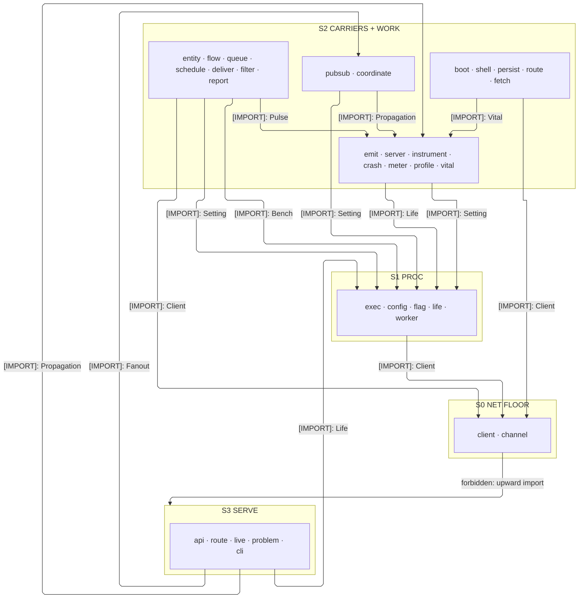
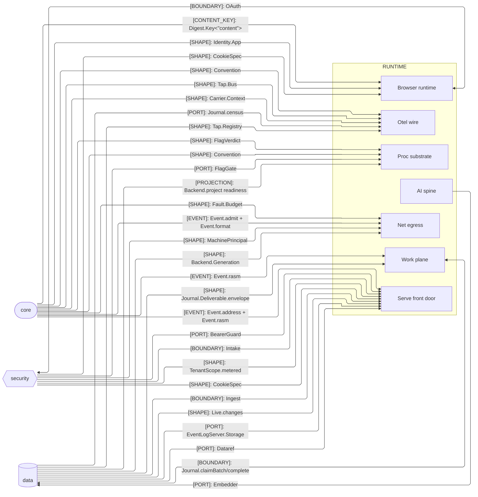
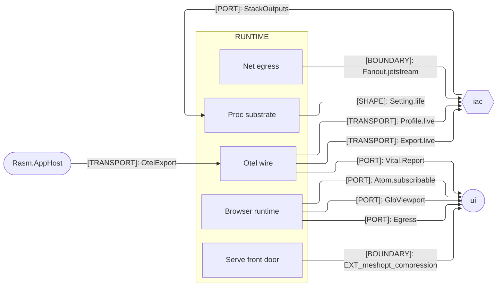
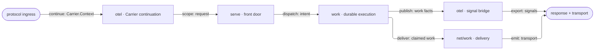

# [TS_RUNTIME_ARCHITECTURE]

`runtime` owns the branch's execution substrate across the server and browser process planes: `proc`, `net`, `otel`, `serve`, `work`, and `ai` meet through one runtime-row table, one budget ledger, one fault law, and one front-door assembly law, and `browser` is the same package under the browser condition, never a sibling. Owners align with the core, security, and data peers, the interface and deploy planes, and peer branches by interface contract, never a cross-package reference.

## [01]-[DOMAIN_MAP]

```text
runtime/
└── src/
    ├── proc/                  # Process substrate: runtime rows, config, flags, lifecycle, off-thread compute
    │   ├── exec.ts            # Keyed node|bun runtime-row binding table; child processes as declarative values
    │   ├── config.ts          # Closed Stage source family behind one Setting resolution at boot
    │   ├── flag.ts            # OpenFeature server Provider: a recursive rule family over content-key bucketing
    │   ├── life.ts            # Ranked lifecycle and health rows, including mounted backend contract readiness
    │   └── worker.ts          # Off-thread worker protocol: zero-copy crossings over one pool
    ├── net/                   # Outbound transport and the fanout/replay port
    │   ├── client.ts          # Composed lane transformers: circuit rows, redirect ceilings, machine-credential presentation
    │   ├── channel.ts         # Framed long-lived byte channels: socket duplex, SSE, and MQTT v5 over one frame vocabulary
    │   ├── pubsub.ts          # Broker port with Fanout.Replayed pairs; in-process, BroadcastChannel, and jetstream rows
    │   └── coordinate.ts      # Accord — the engine-blind lease, elect, and CAS coordination port
    ├── otel/                  # OTLP wire: egress, W3C continuation, condition registration, crash capture, browser RUM
    │   ├── emit.ts            # OTLP egress, W3C continuation, and a native local conformance diagnostic under one policy
    │   ├── server.ts          # AsyncLocalStorage manager seat; the node _rows roster and the _egress/_authority exclusion pair
    │   ├── instrument.ts      # Zone manager seat; the document _rows roster and one anchored RegExp per self-egress origin
    │   ├── crash.ts           # Total Cause-to-fatal-emission fold through the core forensic fault band
    │   ├── meter.ts           # Work-plane fact-to-instrument bridge, census gauges, bus deltas, log floor, tenant views
    │   ├── profile.ts         # Pyroscope pprof lifecycle bracket, sample labels, and the effectful long-lived-region arm
    │   └── vital.ts           # Repo-wide CWV custody: web-vitals capture, graded facts, the render-report intake
    ├── serve/                 # One public front door
    │   ├── api.ts             # HttpApiGroup and RpcGroup contribution contract with derived OpenAPI and client surfaces
    │   ├── route.ts           # HttpLayerRouter fold: Mount port, tus dispatchers, health trio, raw webhook intake
    │   ├── live.ts            # Feed-value endpoints over the channel-rule table; replayable reconnect held exact
    │   ├── problem.ts         # Problem — the RFC 9457 owner rendering itself as a self-describing response
    │   └── cli.ts             # Verb.main run entry and the Command.withSubcommands fold seat
    ├── work/                  # Durable work: actors, workflows, queues, schedules, delivery, filtering, documents
    │   ├── entity.ts          # Durable-actor plane: the WorkClass service-class table over tiered mailboxes
    │   ├── flow.ts            # Workflow suspend-and-replay: minted steps, two-tier deadlines, one durable pause timer
    │   ├── queue.ts           # DurableQueue families and rate-limiter throttles over the pg lane policy and DLQ fold
    │   ├── schedule.ts        # ClusterCron singleton mint over the recurrence table; one fire per cluster tick
    │   ├── deliver.ts         # Channel dispatch table and the outbox-relay cluster singleton draining every row
    │   ├── filter.ts          # Dialect rows with broker-pushdown verdicts; chevrotain lexer and LL(k) grammar seat
    │   └── report.ts          # Report specs folded through three engine arms over the same decoded rows
    ├── ai/                    # Intelligence spine
    │   ├── model.ts           # Model.make rows and the compiled ExecutionPlan shared by effect and stream arms
    │   ├── embed.ts           # Deterministic chunking and embedding rows satisfying the data retrieval ports
    │   ├── tool.ts            # Tool.make/Toolkit.make declarations and the Safety partition admission engine
    │   └── agent.ts           # Agent altitude: transition-machine sessions with persisted-chat durability
    └── browser/               # Browser runtime condition
        ├── boot.ts            # Single-boot law: the app-spec budget, connect cells, and the capability roster
        ├── shell.ts           # Workbox scoped resource and the SwLifecycle phase cell every affordance reads
        ├── persist.ts         # IndexedDB domain vocabulary, storage-residency verdicts, the file-egress routes
        ├── route.ts           # Route-table rows with nuqs codecs and guard policies; one navigation commit path
        └── fetch.ts           # Browser byte transport: XHR, WebSocket, and worker binding rows for verified arrivals
```

## [02]-[STRATA]

Strata rank the runtime interior; seating rows carry only the law the fence cannot show.

- S0 `net` egress floor — `client` lanes and `channel` frames mint outbound transport and import no runtime sibling.
- S1 `proc` merge — `exec`, `life`, and `worker` mint their layers floor-free; only `config` and `flag` reach the net floor.
- S1 `worker.main.ts` hands `Report.worker` in as composition-root code, never a stratum import.
- S2 lateral — every lateral edge points at `otel`, and `otel` reads no S2 sibling back, so the shared rank closes no cycle.
- S2 `otel` merge — condition nodes are registration seats the exports map resolves; `emit` owns egress and the native conformance diagnostic.
- S2 `otel/dev.ts` composes the `plane:dev` DevTools layer at a dev composition root, never a stratum import.
- S2 `work` merge — `deliver` drains under the queue verdict vocabulary, `filter` verdicts ride dialect rows; no member opens a second store.
- S2 `browser` merge — `boot` alone mints the runtime handle, and its siblings compose that handle once per document.
- S2 `browser` stands parallel to the server plane, importing none of serve, work, or ai.
- S3 `serve` — nothing imports the front door, and its one rank above the carriers keeps every dispatch downward.
- S3→S1 `serve` reads `Life` directly — the probe anchor is a floor fact no carrier wraps, and nothing returns upward.


```mermaid
---
config:
  layout: elk
  flowchart:
    curve: linear
    padding: 25
---
flowchart TB
    accTitle: Runtime interior import strata
    accDescr: How the interior sub-domains rank onto the net floor, lateral edges held inside one stratum.
    subgraph S3["S3 SERVE"]
        Serve["api · route · live · problem · cli"]
    end
    subgraph S2["S2 CARRIERS + WORK"]
        Fanout["pubsub · coordinate"]
        Otel["emit · server · instrument · crash · meter · profile · vital"]
        Browser["boot · shell · persist · route · fetch"]
        Work["entity · flow · queue · schedule · deliver · filter · report"]
    end
    subgraph S1["S1 PROC"]
        Proc["exec · config · flag · life · worker"]
    end
    subgraph S0["S0 NET FLOOR"]
        NetFloor["client · channel"]
    end
    Proc e1@-->|"[IMPORT]: Client"| NetFloor
    Fanout e2@-->|"[IMPORT]: Setting"| Proc
    Otel e3@-->|"[IMPORT]: Life"| Proc
    Otel e4@-->|"[IMPORT]: Setting"| Proc
    Browser e5@-->|"[IMPORT]: Client"| NetFloor
    Work e6@-->|"[IMPORT]: Setting"| Proc
    Work e7@-->|"[IMPORT]: Client"| NetFloor
    Work e8@-->|"[IMPORT]: Bench"| Proc
    Work e9@-->|"[IMPORT]: Pulse"| Otel
    Browser e10@-->|"[IMPORT]: Vital"| Otel
    Fanout e11@-->|"[IMPORT]: Propagation"| Otel
    Serve e12@-->|"[IMPORT]: Fanout"| Fanout
    Serve e13@-->|"[IMPORT]: Propagation"| Otel
    Serve e14@-->|"[IMPORT]: Life"| Proc
    NetFloor f1@-->|"forbidden: upward import"| S3
```

`ai` composes no runtime sibling; its edges run outward to core, data, and security alone, so the fence seats no ai node.

## [03]-[CONTRACTS]


```mermaid
---
config:
  layout: elk
  flowchart:
    curve: linear
    padding: 25
---
flowchart LR
    accTitle: Runtime domain-peer boundary registry
    accDescr: Runtime owners exchanging flag, budget, convention, identity, custody, and tap shapes with the core, security, and data peers.
    subgraph runtime[RUNTIME]
        Proc[Proc substrate]
        Net[Net egress]
        Otel[Otel wire]
        Browser[Browser runtime]
        Serve[Serve front door]
        Work[Work plane]
        Ai[AI spine]
    end
    Core([core])
    Security{{security}}
    Data[(data)]
    Core e1@-->|"[SHAPE]: FlagVerdict"| Proc
    Core e2@-->|"[SHAPE]: Fault.Budget"| Net
    Core e3@-->|"[SHAPE]: Convention"| Otel
    Core e4@-->|"[CONTENT_KEY]: Digest.Key&lt;&quot;content&quot;&gt;"| Browser
    Core e14@-->|"[SHAPE]: Identity.App"| Browser
    Security e5@-->|"[SHAPE]: CookieSpec"| Browser
    Browser e6@<-->|"[BOUNDARY]: OAuth"| Security
    Security e7@-->|"[PORT]: BearerGuard"| Serve
    Security e8@-->|"[BOUNDARY]: Intake"| Serve
    Security e13@-->|"[PORT]: FlagGate"| Proc
    Data e9@-->|"[BOUNDARY]: Ingest"| Serve
    Data e10@-->|"[SHAPE]: Live.changes"| Serve
    Work e11@<-->|"[BOUNDARY]: Journal.claimBatch/complete"| Data
    Ai e12@-->|"[PORT]: Embedder"| Data
    Data e15@-->|"[PORT]: Journal.census"| Otel
    Security e16@-->|"[SHAPE]: TenantScope.metered"| Serve
    Core e17@-->|"[SHAPE]: Tap.Bus"| Otel
    Data e18@-->|"[SHAPE]: Tap.Registry"| Otel
    Data e20@-->|"[SHAPE]: Journal.Deliverable.envelope"| Work
    Core e21@-->|"[SHAPE]: Carrier.Context"| Otel
    Data e22@-->|"[SHAPE]: Backend.Generation"| Net
    Data e29@-->|"[PROJECTION]: Backend.project readiness"| Proc
    Core e23@-->|"[SHAPE]: Convention"| Proc
    Core e24@-->|"[EVENT]: Event.admit + Event.format"| Net
    Core e25@-->|"[EVENT]: Event.address + Event.rasm"| Serve
    Core e26@-->|"[EVENT]: Event.rasm"| Work
    Security e27@-->|"[SHAPE]: CookieSpec"| Serve
    Security e28@-->|"[SHAPE]: MachinePrincipal"| Net
    Data e19@-->|"[PORT]: EventLogServer.Storage"| Serve
    Data e30@-->|"[PORT]: Dataref"| Serve
```


```mermaid
---
config:
  layout: elk
  flowchart:
    curve: linear
    padding: 25
---
flowchart LR
    accTitle: Runtime platform and cross-runtime boundary registry
    accDescr: Runtime owners exchanging settings, stack outputs, subscribable planes, and OTLP telemetry with iac, ui, and the Rasm.AppHost host.
    subgraph runtime[RUNTIME]
        Otel[Otel wire]
        Proc[Proc substrate]
        Net[Net egress]
        Serve[Serve front door]
        Browser[Browser runtime]
    end
    AppHost([Rasm.AppHost])
    Iac{{iac}}
    Ui([ui])
    AppHost e1@-->|"[TRANSPORT]: OtelExport"| Otel
    Proc e2@-->|"[SHAPE]: Setting.life"| Iac
    Net e3@-->|"[BOUNDARY]: Fanout.jetstream"| Iac
    Iac e4@-->|"[PORT]: StackOutputs"| Proc
    Serve e5@-->|"[BOUNDARY]: EXT_meshopt_compression"| Ui
    Browser e6@-->|"[PORT]: Atom.subscribable"| Ui
    Browser e7@-->|"[PORT]: GlbViewport"| Ui
    Browser e12@-->|"[PORT]: Egress"| Ui
    Otel e8@-->|"[TRANSPORT]: Export.live"| Iac
    Otel e10@-->|"[TRANSPORT]: Profile.live"| Iac
    Otel e11@-->|"[PORT]: Vital.Report"| Ui
```

## [04]-[INTERNAL]


```mermaid
---
config:
  layout: elk
  flowchart:
    curve: linear
    padding: 25
---
flowchart LR
    accTitle: Runtime execution spine
    accDescr: Which stages one admitted request crosses between carrier continuation and its emitted signals and delivery.
    Ingress([protocol ingress])
    Carrier[otel · Carrier continuation]
    Serve[serve · front door]
    Work[work · durable execution]
    Signals[otel · signal bridge]
    Delivery[net/work · delivery]
    Egress([response + transport])
    Ingress e1@-->|"continue: Carrier.Context"| Carrier
    Carrier e2@-->|"scope: request"| Serve
    Serve e3@-->|"dispatch: intent"| Work
    Work e4@-->|"publish: work facts"| Signals
    Work e5@-->|"deliver: claimed work"| Delivery
    Signals e6@-->|"export: signals"| Egress
    Delivery e7@-->|"emit: transport"| Egress
```

One front-door law rules serving: packages export route, verb, and group data, the app assembles exactly one `HttpApi`, one CLI root, and one serve fold, and faults leave only as self-rendering `Problem`s. Every capture boundary inherits the one ambient redaction scrub, every outbound call inherits its lane's compiled pulse and circuit row, every durable surface prices against the one `WorkClass` table, and the browser condition boots the same package once per document. Exact per-stage wiring lives on the owning implementation pages.

## [05]-[BOUNDARIES]

- App root, never this folder, assembles the `HttpApi`, satisfies port `Tag`s, selects runtime rows, and binds the browser composition root.
- Degradation reads as a `Layer` choice the composition root makes; a capability never narrows its own surface under pressure as hidden behavior.
- Data owns the record of truth; work composes data's outbox and mailbox, never a second store; NATS carries fanout and replay, never truth.
- Content identity is never minted here; the browser decode worker delegates to the core `Digest` engine.
- Cluster runs leaderless over `RunnerStorage` advisory locks; the node-bound cluster and rpc-http upstreams are never admitted.
