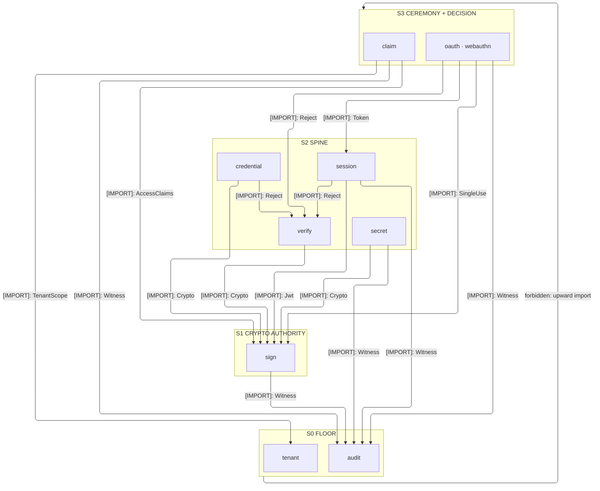
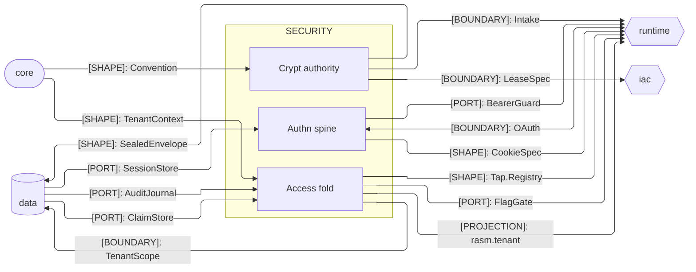

# [TS_SECURITY_ARCHITECTURE]

`security` owns the identity-and-custody concern — the `crypt`, `authn`, and `access` sub-domains meeting through one crypto authority, one session vocabulary, and one tenancy contract. Every stateful obligation is a port Tag the data stratum satisfies at app composition, so the folder imports only core.

## [01]-[DOMAIN_MAP]

```text codemap
security/
└── src/
    ├── crypt/                 # Crypto authority: signing, minting, shredding, custody, inbound verification
    │   ├── sign.ts            # The sole mint — every digest, signature, token, and envelope originates here
    │   ├── verify.ts          # Inbound-signature dialect table + one constant-time verify fold over HELD request octets
    │   └── secret.ts          # DopplerSDK leased-secret custody behind Layer.scoped — download, targeted read, name census
    ├── authn/                 # Authentication: session spine, digest credentials, OAuth, passkeys
    │   ├── session.ts         # The identity spine the ceremonies feed — rotation, ports, CSRF egress
    │   ├── credential.ts      # Digest — the one mint-and-resolve idiom over OTP, recovery codes, and machine API keys
    │   ├── oauth.ts           # Issuers modeled as rows over one authorization-code ceremony
    │   └── webauthn.ts        # Both passkey halves as per-runtime subpaths: RP verifier (./server) + browser invocation (./browser)
    └── access/                # Authorization: entitlement fold, tenancy contract, and the security fact rail
        ├── audit.ts           # SecurityFact vocabulary, Witness publish seam, AuditJournal port, pseudonymized egress, board projections
        ├── claim.ts           # Entitlement vocabulary + the RBAC-union-ReBAC evaluation fold, resolved once per request
        └── tenant.ts          # Ambient TenantContext reference + the rasm.tenant RLS shape the data stratum enforces
```

## [02]-[STRATA]

- S0 `access/audit` + `access/tenant` — floor mints importing only core; `audit` the fact plane, `tenant` the `TenantScope` reference and RLS shape.
- S1 `crypt/sign` — the crypto authority originating every digest, signature, token, and envelope.
- S2 `crypt/verify` + `crypt/secret` + `authn/session` + `authn/credential` — each composes the `sign` authority.
- S3 `authn/oauth` + `authn/webauthn` + `access/claim` — ceremonies and decisions over the spine; `authn` and `access` stay independent peers.



## [03]-[SEAMS]



## [04]-[INTERNAL]

`crypt/sign` is the sole mint and `crypt/verify` its inbound mirror over held octets, so no route hand-rolls a signature check; `crypt/secret` scopes the Doppler client to the folder's leased surfaces. `authn/session` is the identity spine the ceremonies feed: `credential` funnels second factors through one mint-and-resolve idiom, `oauth` models issuers as rows, `webauthn` splits the passkey ceremony by runtime subpath.

`access` turns verified identity into decisions and evidence: `claim` evaluates entitlements once per request, `tenant` declares the contract the data stratum enforces as RLS, and `audit` is the fact rail — every loud arm publishes a typed `SecurityFact` through the silent `Witness` seam, class-routed lanes draining into the `AuditJournal` port, every board, alert, and analytics view a projection of one receipt plane.

## [05]-[BOUNDARIES]

- Persistence lives outside by construction: every store is a port Tag the data stratum satisfies and the app root binds.
- Content-identity digesting stays core's; this folder owns secret derivation and authenticated crypto only.
- Cookie framing and CSRF are egress projections declared here and consumed by the runtime browser plane; no browser API is touched here.
- Tenancy is declared here and enforced in the data stratum; the folder opens no database transaction.
- Flag evaluation is the `FlagGate` consumer port the runtime stratum satisfies; the entitlement fold composes flag verdicts and owns no flag engine.
- Audit facts persist through the `AuditJournal` port the data stratum satisfies on its journal spine.
- Analytics egress leaves only as the `AuditTrace` projection under the keyed `Pseudonym` mask.
- Board and alert compilation rides the core-to-iac `DashboardModel`/`Alert.Spec` seams over the folder's declared objectives.
- KDF cost claims leave as core `Claim` receipts — the `BenchmarkClaimWire` landing under `Claim.admit` host admission.
- KDF measurement runs against the folder's own bulkhead, never persisting or grading a claim.
