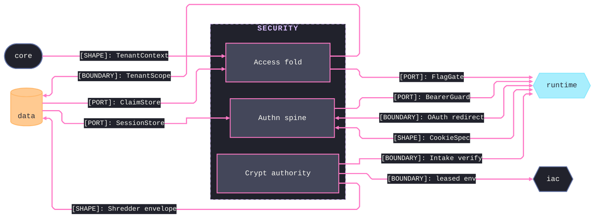

# [TS_SECURITY_ARCHITECTURE]

`security` owns the identity-and-custody concern — the `crypt`, `authn`, and `access` sub-domains meeting through one crypto authority, one session vocabulary, and one tenancy contract. Every stateful obligation is a port Tag the data wave satisfies at app composition, so the folder imports only core.

## [01]-[DOMAIN_MAP]

```text codemap
security/
└── src/
    ├── crypt/                 # Crypto authority: signing, minting, shredding, custody, inbound verification
    │   ├── sign.ts            # The sole mint — every digest, signature, token, and envelope originates here
    │   ├── verify.ts          # Inbound-signature dialect table + one constant-time verify fold over HELD request octets
    │   └── secret.ts          # DopplerSDK leased-secret custody behind Layer.scoped — download, targeted read, name census
    ├── authn/                 # Authentication: session spine, digest credentials, OAuth, passkeys
    │   ├── session.ts         # The identity spine the ceremonies feed — rotation, ports, CSRF egress
    │   ├── credential.ts      # Digest — the one mint-and-resolve idiom over OTP, recovery codes, and machine API keys
    │   ├── oauth.ts           # Issuers modeled as rows over one authorization-code ceremony
    │   └── webauthn.ts        # Both passkey halves as per-runtime subpaths: RP verifier (./server) + browser invocation (./browser)
    └── access/                # Authorization: entitlement fold and the tenancy contract
        ├── claim.ts           # Entitlement vocabulary + the RBAC-union-ReBAC evaluation fold, resolved once per request
        └── tenant.ts          # Ambient TenantContext reference + the app.current_tenant RLS shape the data wave enforces
```

## [02]-[SEAMS]



## [03]-[ORGANIZATION]

`crypt/sign` is the sole mint — every digest, signature, token, and envelope originates there; `crypt/verify` mirrors it inbound over held octets so no route hand-rolls a signature check; `crypt/secret` scopes the Doppler client to the leased surfaces the folder admits. `authn/session` is the identity spine the ceremonies feed: `credential` funnels every second factor through one mint-and-resolve idiom, `oauth` models issuers as rows, `webauthn` splits the passkey ceremony by runtime subpath. `access` turns verified identity into decisions: `claim` evaluates entitlements once per request, `tenant` states the tenancy contract the data wave enforces as row-level security.

## [04]-[BOUNDARIES]

- Persistence lives outside by construction: every store is a port Tag the data wave satisfies and the app root binds.
- Content-identity digesting stays core's; this folder owns secret derivation and authenticated crypto only.
- Cookie framing and CSRF are egress projections declared here and consumed by the runtime browser plane; no browser API is touched here.
- Tenancy is declared here and enforced in the data wave; the folder opens no database transaction.
- Flag evaluation is the `FlagGate` consumer port the runtime wave satisfies; the entitlement fold composes flag verdicts and owns no flag engine.
