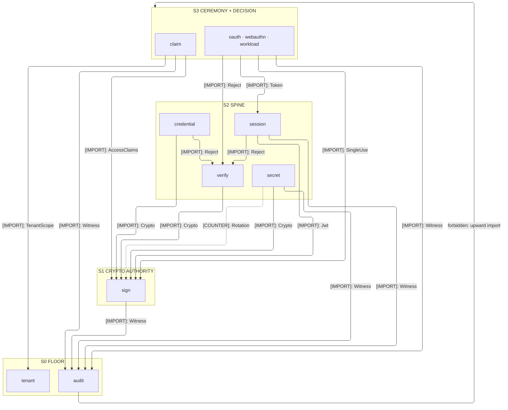
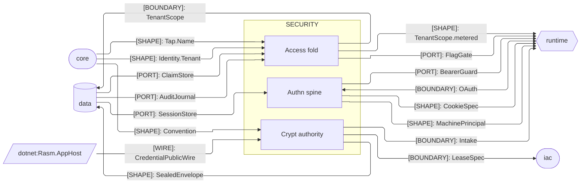

# [TS_SECURITY_ARCHITECTURE]

`security` owns the identity-and-custody concern: the `crypt`, `authn`, and `access` sub-domains meet through one crypto authority, one session vocabulary, and one tenancy contract. Every stateful obligation is a port Tag the data stratum satisfies at app composition, so the folder imports only core.

## [01]-[DOMAIN_MAP]

```text
security/
└── src/
    ├── crypt/             # Crypto authority the folder's every ceremony composes
    │   ├── sign.ts        # Crypto/Jwt/SingleUse/AccessClaims owners and the sealed-envelope shredder
    │   ├── verify.ts      # Verify, Intake, and IntakeRoute owners; every spine member imports Reject
    │   └── secret.ts      # DopplerSDK custody behind Layer.scoped — download, targeted read, name census
    ├── authn/             # Authentication ceremonies feeding one identity spine
    │   ├── session.ts     # Token mint and port seats; egress projections declared for the runtime browser plane
    │   ├── credential.ts  # Entropy-classed material table; argon2 and SHA-256 compare arms behind one resolve
    │   ├── oauth.ts       # openid-client Configuration seat and the code-exchange fold; SingleUse stash per leg pair
    │   ├── webauthn.ts    # Exports-map subpath split; zero shared runtime code between the halves
    │   └── workload.ts    # GrantRequest closed family; reaches the sign and verify owners, never session
    └── access/            # Authorization decisions and their evidence plane
        ├── claim.ts       # Verdict fold composing AccessClaims and TenantScope; flag verdicts join through FlagGate
        ├── tenant.ts      # TenantScope reference owner and the GUC coordinate vocabulary the data stratum enforces
        └── audit.ts       # SecurityFact union, class-routed drain lanes, and the Pseudonym mask
```

## [02]-[STRATA]

Strata rank the security interior; seating rows carry only the law the fence cannot show.


```mermaid
---
config:
  layout: elk
  flowchart:
    curve: linear
    padding: 25
---
flowchart TB
    accTitle: Security interior import strata
    accDescr: How ceremonies and claims rank onto the sign authority and the audit floor, the Rotation counter-edge a handed feed.
    subgraph S3["S3 CEREMONY + DECISION"]
        Ceremony["oauth · webauthn · workload"]
        Claim[claim]
    end
    subgraph S2["S2 SPINE"]
        Verify[verify]
        Secret[secret]
        Session[session]
        Credential[credential]
    end
    subgraph S1["S1 CRYPTO AUTHORITY"]
        Sign[sign]
    end
    subgraph S0["S0 FLOOR"]
        Audit[audit]
        TenantRef[tenant]
    end
    Sign e1@-->|"[IMPORT]: Witness"| Audit
    Verify e2@-->|"[IMPORT]: Crypto"| Sign
    Secret e3@-->|"[IMPORT]: Crypto"| Sign
    Secret e4@-->|"[IMPORT]: Witness"| Audit
    Session e5@-->|"[IMPORT]: Jwt"| Sign
    Session e6@-->|"[IMPORT]: Witness"| Audit
    Credential e7@-->|"[IMPORT]: Crypto"| Sign
    Ceremony e8@-->|"[IMPORT]: Token"| Session
    Ceremony e9@-->|"[IMPORT]: SingleUse"| Sign
    Ceremony e10@-->|"[IMPORT]: Witness"| Audit
    Claim e11@-->|"[IMPORT]: AccessClaims"| Sign
    Claim e12@-->|"[IMPORT]: TenantScope"| TenantRef
    Claim e13@-->|"[IMPORT]: Witness"| Audit
    Session e14@-->|"[IMPORT]: Reject"| Verify
    Credential e15@-->|"[IMPORT]: Reject"| Verify
    Ceremony e16@-->|"[IMPORT]: Reject"| Verify
    Secret e17@-.->|"[COUNTER]: Rotation"| Sign
    Audit f1@-->|"forbidden: upward import"| S3
```

- S0 floor — `audit` and `tenant` import core alone; `Witness` is the one symbol reaching down, so the floor feeds nothing back.
- S1 `crypt/sign` — every upper stratum composes this one authority, and no sibling mints beside it.
- S2 interleave — `session` and `credential` read `verify`'s `Reject` inside the rank; `verify` imports only the authority below, so no cycle forms.
- S2→S1 `Rotation` crosses as a caller-handed feed — `secret` supplies it and `sign` swaps its live ring, importing nothing upward.
- S3 ceremonies and claims — `authn` and `access` stay peers; `workload` reaches the sign and verify owners, never session.
- S3 merge — only `webauthn` reaches `Witness` inside the ceremony node, so the merged `[IMPORT]: Witness` edge carries one member's read.

## [03]-[CONTRACTS]


```mermaid
---
config:
  layout: elk
  flowchart:
    curve: linear
    padding: 25
---
flowchart LR
    accTitle: Security package boundary registry
    accDescr: Security owners exchanging identity, custody, tenancy, and telemetry contracts with the core, data, runtime, and iac peers, and admitting the AppHost credential wire.
    subgraph security[SECURITY]
        Crypt[Crypt authority]
        Authn[Authn spine]
        Access[Access fold]
    end
    Core([core])
    Data[(data)]
    Runtime{{runtime}}
    Iac([iac])
    AppHost[/dotnet:Rasm.AppHost/]
    Core e1@-->|"[SHAPE]: Identity.Tenant"| Access
    Data e2@-->|"[PORT]: ClaimStore"| Access
    Access e3@-->|"[BOUNDARY]: TenantScope"| Data
    Data e4@-->|"[PORT]: SessionStore"| Authn
    Authn e5@-->|"[PORT]: BearerGuard"| Runtime
    Authn e6@<-->|"[BOUNDARY]: OAuth"| Runtime
    Authn e7@-->|"[SHAPE]: CookieSpec"| Runtime
    Authn e8@-->|"[SHAPE]: MachinePrincipal"| Runtime
    Crypt e9@-->|"[SHAPE]: SealedEnvelope"| Data
    Crypt e10@-->|"[BOUNDARY]: Intake"| Runtime
    Crypt e11@-->|"[BOUNDARY]: LeaseSpec"| Iac
    Access e12@-->|"[PORT]: FlagGate"| Runtime
    Core e13@-->|"[SHAPE]: Convention"| Crypt
    Access e14@-->|"[SHAPE]: TenantScope.metered"| Runtime
    Data e15@-->|"[PORT]: AuditJournal"| Access
    Core e16@-->|"[SHAPE]: Tap.Name"| Access
    AppHost e17@-->|"[WIRE]: CredentialPublicWire"| Crypt
```

## [04]-[INTERNAL]


```mermaid
---
config:
  layout: elk
  flowchart:
    curve: linear
    padding: 25
---
flowchart LR
    accTitle: Security authority spine
    accDescr: Tenant scope and authentication produce access claims; policy drives cryptographic authority and audit evidence.
    Request([tenant + credential])
    Tenant[tenant · Identity.Tenant binding]
    Authn[authn · verified principal]
    Access[access · claims]
    Policy[policy · entitlement fold]
    Crypto[crypt · signed authority]
    Audit[(audit · SecurityFact)]
    Decision([decision + evidence])
    Reject[/Reject stream/]
    Request e1@-->|"bind: tenant scope"| Tenant
    Request e2@-->|"verify: credential"| Authn
    Authn f1@-.->|"count: rejected credential"| Reject
    Tenant e3@-->|"scope: principal"| Access
    Authn e4@-->|"carry: principal"| Access
    Access e5@-->|"resolve: claims"| Policy
    Policy e6@-->|"authorize: protected mint"| Crypto
    Policy e7@-->|"publish: decision fact"| Audit
    Crypto e8@-->|"publish: custody fact"| Audit
    Audit e9@-->|"emit: decision evidence"| Decision
```

Mint-once rules the crypt crossing: signing keys, webhook secrets, and the argon2 pepper enter as `Material.Source.Held` at construction, and every secret stays `Redacted` from first decode into the primitive call.

Ceremonies lift at the session boundary: each two-leg port instantiates `SingleUse`, so replay, cross-ceremony completion, and out-of-order finish stay unspellable, and a verified principal crosses as one carried value.

Evidence has one plane: every decision and custody fact lands typed at the audit journal, and boards, alerts, and analytics stay projections of it. Exact per-arm wiring lives on the owning implementation pages.

## [05]-[BOUNDARIES]

- Persistence lives outside by construction: every store is a port Tag the data stratum satisfies and the app root binds.
- Consumers carrying zero durable state compose the folder whole.
- Content-identity digesting stays core's; this folder owns secret derivation and authenticated crypto only.
- Cookie framing and CSRF are egress projections declared here; the runtime browser plane alone touches browser APIs.
- Tenancy is declared here and enforced in the data stratum; every database transaction stays the data stratum's.
- Flag evaluation is the `FlagGate` consumer port the runtime stratum satisfies; the entitlement fold composes verdicts, the engine stays runtime's.
- Audit facts persist through the `AuditJournal` port the data stratum satisfies on its journal spine.
- Analytics egress leaves only as the `AuditTrace` projection under the keyed `Pseudonym` mask.
- Board and alert compilation rides `Board.DashboardModel` and `Reliability.Alert.Spec` into IaC.
- KDF measurement runs against the folder's own bulkhead; claim persistence and grading stay the core board owner's.
