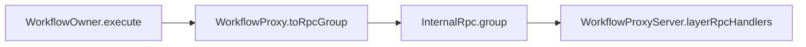

# [SERVICES_INTERNAL_RPC]

One page owns the internal TypeScript-to-TypeScript RPC surface and the runner placement and durable scheduling substrate beneath the durable units — `InternalRpc`, the one `@effect/rpc` `RpcGroup` with `WorkflowProxy` derived from it; `RunnerBackplane`, the 4-row protocol/message-storage/runner-storage/runner-health backplane with the snowflake id source; and `ScheduledWork`, the cluster-singleton and shard-pinned durable-cron owner. The internal RPC surface is distinct from the .NET wire — the protobuf-and-msgpack .NET wire is structurally absent, and `InternalRpc` serializes against the SAME wire Schema the durable workflows use, never a parallel surface. The page consumes no .NET wire shape and crosses no wire contract; the capture-event client-stream dialed on node rides the `interchange` clients, not this surface.

## [1]-[INDEX]

| [INDEX] | [CLUSTER]             | [OWNS]                                                    |
| :-----: | :-------------------- | :-------------------------------------------------------- |
|   [1]   | INTERNAL_RPC          | the one RpcGroup and the WorkflowProxy projection         |
|   [2]   | RUNNER_AND_SCHEDULING | the runner backplane, the id source, singletons, and cron |

## [2]-[INTERNAL_RPC]

- Owner: `InternalRpc`, the internal RPC surface — each procedure is a Schema-typed request with its own success and error schemas aggregated into ONE `RpcGroup`; the serialization row selects the in-process codec for the TS-to-TS edge (Schema-serialized, the protobuf-and-msgpack .NET wire structurally absent); the transport binds the group over the platform socket or HTTP layer with a client and a server half. `WorkflowProxy` is DERIVED from the durable workflow set, not a hand-built parallel surface.
- Cases: the durable workflows become callable over this surface through the workflow-proxy projection — `WorkflowProxy.toRpcGroup` converts the workflow set into the request group whose procedures start, resume, and poll each workflow by execution id, and `WorkflowProxyServer.layerRpcHandlers` installs the handlers as one RPC-handler layer, so the host-to-worker dispatch and the panel-to-host start and resume signalling both ride one group rather than a parallel surface; the `RpcClient` and `RpcServer` halves serialize against the SAME Schema the workflow defines, so the wire shape is the workflow's own success/error schema, never a re-minted RPC DTO.
- Entry: each procedure is a Schema-typed request; the node host-to-worker edge consumes the same group; the workflow proxy is the sole mechanism by which a durable unit becomes a callable procedure.
- Packages: `@effect/rpc` for the `RpcGroup`/`RpcSerialization`/`RpcClient`/`RpcServer` surface, `@effect/workflow` for the `WorkflowProxy.toRpcGroup`/`WorkflowProxyServer.layerRpcHandlers` projection, and `@effect/platform-node` for the transport.
- Growth: a new internal procedure lands as one request on the existing group; a new workflow becomes callable by extending the proxied workflow set, never a hand-built procedure.
- Boundary: `InternalRpc` is the `@effect/rpc` surface distinct from the .NET wire, its only consumers being this domain's owners; a second internal RPC surface is the named defect; this is a node-only surface, never browser-reachable.

```ts contract
interface InternalRpc<Procedures extends Rpc.Any> {
  readonly group: RpcGroup.RpcGroup<Procedures>;
  readonly serialization: Layer.Layer<RpcSerialization.RpcSerialization>;
  readonly server: Layer.Layer<never, never, RpcServer.Protocol>;
  readonly client: Effect.Effect<RpcClient.RpcClient<Procedures>, never, RpcServer.Protocol>;
  readonly fromWorkflows: <const W extends NonEmptyReadonlyArray<Workflow.Any>>(workflows: W) => RpcGroup.RpcGroup<WorkflowProxy.ConvertRpcs<W[number], "">>;
  readonly handlers: <const W extends NonEmptyReadonlyArray<Workflow.Any>>(workflows: W) => Layer.Layer<never, never, WorkflowEngine | Workflow.Requirements<W[number]>>;
}
```



## [3]-[RUNNER_AND_SCHEDULING]

- Owner: `RunnerBackplane`, the runner placement and durable storage backplane, and `ScheduledWork`, the cluster-wide singleton and durable-cron scheduling owner.
- Cases: `RunnerBackplane` owns four explicit rows rather than one Redis-or-SQL hand-wave. The runner protocol is the placement transport — the HTTP runner for production k8s topologies, the socket runner for node-to-node clusters, the single runner for one-process deployments, and the test runner for the ephemeral harness — one closed protocol vocabulary read by topology. Message storage and runner storage are the durable backing — the SQL message store and the SQL runner store over the `persistence.md` Postgres client as the production rows, with the in-memory and no-op stores as the sibling test rows. Runner health and discovery is the liveness row — ping-based health for socket and single-process clusters and the k8s health client for native runner-address resolution and pod liveness, with the no-op health as the test row. The distributed id source threading message and entity identity is the snowflake generator the shard manager exposes. `ScheduledWork` is the jobs half the request-driven cluster does not cover — a cluster singleton registers an exactly-one-runner background loop (the leader-elected sweep, reconcile, and garbage-collection jobs) pinned to one shard group so it never double-runs, and a durable cron registers a shard-pinned scheduled execution with the same exactly-once contract as a workflow.
- Entry: the backplane is the placement and durability substrate beneath `ClusterEngine` — the shard configuration, the chosen runner protocol layer, the message and runner storage layers, and the runner-health layer compose into the shard manager that the cluster-backed workflow engine layers onto; the runner protocol layer is selected by topology row, never branched in code; the capture-event client-stream (`DocumentService.captureEvents`) structurally non-dialable from the browser is dialed HERE on node through the `interchange` clients; cluster telemetry — shard counts, entity counts, runner counts, and runner health — emits through the cluster metrics source the `provisioning.md` `ObservabilityStack` collector reads.
- Packages: `@effect/cluster` for the sharding, shard-configuration, runner-protocol, message-storage, runner-storage, runner-health, k8s health-client, snowflake, singleton, and cluster-cron surfaces; `@effect/sql` and `@effect/sql-pg` for the durable stores backing through `persistence.md`; `ioredis` for the multi-node backplane and the cluster-metrics source; and `@effect/platform-node` for the driver host.
- Growth: a new runner protocol lands as one protocol-layer row; a new durable store lands as one storage-layer row; a new background loop lands as one singleton layer; a new scheduled job lands as one durable-cron layer.
- Boundary: this cluster crosses no .NET wire and carries no wire type; runner placement and durable scheduling are node-only concerns beneath the durable units, and the cluster-metrics signal reaches dashboards only through the collector; the SQL stores ride the one Postgres client `persistence.md` owns, never a second SQL surface.

```ts contract
type RunnerProtocol = "http" | "socket" | "single" | "test";

interface RunnerBackplane {
  readonly config: Layer.Layer<ShardingConfig.ShardingConfig, ConfigError.ConfigError>;
  readonly protocol: (kind: RunnerProtocol) => Layer.Layer<
    Sharding.Sharding | Runners.Runners,
    never,
    MessageStorage.MessageStorage | RunnerStorage.RunnerStorage | RunnerHealth.RunnerHealth
  >;
  readonly messageStore: Layer.Layer<MessageStorage.MessageStorage, never, SqlClient.SqlClient | ShardingConfig.ShardingConfig>;
  readonly runnerStore: Layer.Layer<RunnerStorage.RunnerStorage, SqlError.SqlError, SqlClient.SqlClient | ShardingConfig.ShardingConfig>;
  readonly health: (kind: "ping" | "k8s" | "noop") => Layer.Layer<RunnerHealth.RunnerHealth, never, Runners.Runners>;
  readonly snowflake: Effect.Effect<Snowflake.Generator, never, Sharding.Sharding>;
}

interface ScheduledWork {
  readonly singleton: <E, R>(name: string, run: Effect.Effect<void, E, R>, options?: { readonly shardGroup?: string }) => Layer.Layer<never, never, Sharding.Sharding | Exclude<R, Scope.Scope>>;
  readonly cron: <E, R>(options: {
    readonly name: string;
    readonly cron: Cron.Cron;
    readonly execute: Effect.Effect<void, E, R>;
    readonly shardGroup?: string;
  }) => Layer.Layer<never, never, Sharding.Sharding | Exclude<R, Scope.Scope>>;
}
```
