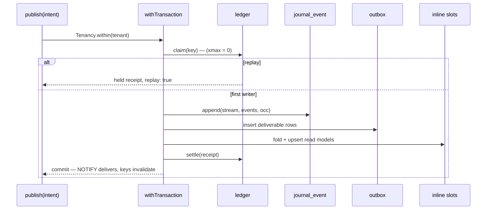

# [STORE_OUTBOX]

The exactly-once boundary of the write path: one `Outbox.publish` transaction composes the idempotency-ledger claim, the OCC append, the outbox insert, and the inline projection slots into a single commit — the `ON CONFLICT (key) DO UPDATE RETURNING (xmax = 0) AS inserted` claim decides first-writer-wins and replays return the stored receipt, the outbox rows become deliverable facts atomically with the events they announce, and the NOTIFY wake plus the reactivity stamp fire only when the commit lands. Store owns queue-as-data — the outbox table, the claim and completion statements, the wake channel — while `work/deliver/relay` owns execution semantics and drains through its `SqlClient` port; neither side imports the other.

## [1]-[CLUSTERS]

| [INDEX] | [CLUSTER]        | [OWNS]                                                                            |
| :-----: | :--------------- | :---------------------------------------------------------------------------------- |
|  [01]   | `LEDGER_CLAIM`   | the idempotency ledger — key brand, claim statement, replay receipt                   |
|  [02]   | `ATOMIC_PUBLISH` | the one publish transaction — claim, append, outbox, inline slots, post-commit wake   |
|  [03]   | `RELAY_ROWS`     | the outbox row model plus the claim/complete statements `work` drains through         |

## [2]-[LEDGER_CLAIM]

- Owner: the `idempotency_ledger` ensure row, the `IdempotencyKey` brand-in-field, and `_claim` — the one statement that inserts-or-touches and reports first-writer truth plus the stored receipt in a single round trip.
- Packages: `@effect/sql` (`sql.insert`, `sql.onDialect` for the claim's dialect pair).
- Receipt: `Outbox.Claim` — `{ key, first, held }` — `first` from `(xmax = 0)`, `held` the receipt JSON the first writer stored; a replay is served entirely from this row.
- Growth: a new ledger dimension (scope column, expiry class) is a column pair here plus a field on the claim row — the statement shape never changes.
- Law: the claim is one statement — `INSERT … ON CONFLICT (key) DO UPDATE SET touched_at = now() RETURNING (xmax = 0) AS inserted, receipt` — the pg arm reads first-writer truth from `xmax = 0` (a fresh row was never updated), the sqlite arm rides the catalogued `RETURNING changes()` pair through `sql.onDialect`; a `SELECT`-then-`INSERT` pair is the torn spelling.
- Law: the ledger row stores the publish receipt after the append succeeds (`_settle`), so a replayed key returns the ORIGINAL receipt — idempotency means the duplicate caller cannot distinguish itself from the first.
- Law: ledger rows age out by `touched_at` under a retention window (`journal/retain.md`'s policy rows) — a replay past the window is a fresh publish by declaration, and the window is a policy value, never a literal.

```typescript
import { Array, Effect, Option, Schema, type ParseResult } from "effect"
import { Model, SqlClient, type SqlError } from "@effect/sql"
import { AppKey, TenantId } from "@rasm/ts/kernel"
import type { Capability } from "../capability/row.ts"
import { Journal, StreamKey } from "./append.ts"
import { Upcast } from "./upcast.ts"

const _IdempotencyKey = Schema.NonEmptyString.pipe(Schema.maxLength(200), Schema.brand("IdempotencyKey"))

const _Receipt = Schema.Struct({
  stream: StreamKey,
  version: Schema.Number,
  count: Schema.Number,
  first: Schema.Number,
  rows: Schema.Array(Schema.Struct({ version: Schema.Number, tag: Schema.String, payload: Schema.String })),
})

declare namespace Outbox {
  type Key = typeof _IdempotencyKey.Type
  type Claim = {
    readonly key: Key
    readonly first: boolean
    readonly held: Option.Option<Journal.Receipt>
  }
}

const _claim = (sql: SqlClient.SqlClient, stream: StreamKey, key: Outbox.Key) =>
  Effect.flatMap(
    sql.onDialectOrElse({
      orElse: () =>
        sql`INSERT INTO idempotency_ledger ${sql.insert([{ key, app: stream.app, tenant: stream.tenant }])}
            ON CONFLICT (key) DO UPDATE SET touched_at = ${Journal.now(sql)}
            RETURNING (changes()) AS inserted, receipt`,
      pg: () =>
        sql`INSERT INTO idempotency_ledger ${sql.insert([{ key, app: stream.app, tenant: stream.tenant }])}
            ON CONFLICT (key) DO UPDATE SET touched_at = ${Journal.now(sql)}
            RETURNING (xmax = 0) AS inserted, receipt`,
    }),
    (rows) =>
      Effect.map(
        Effect.transposeOption(
          Option.map(Option.fromNullable(rows[0]?.["receipt"]), (held) =>
            Schema.decodeUnknown(_Receipt)(Upcast.body(held)))),
        (held): Outbox.Claim => ({ key, first: Boolean(rows[0]?.["inserted"]), held }),
      ),
  )

const _settle = (sql: SqlClient.SqlClient, key: Outbox.Key, receipt: Journal.Receipt) =>
  Effect.flatMap(
    Schema.encode(Schema.parseJson(_Receipt))(receipt),
    (held) => sql`UPDATE idempotency_ledger SET receipt = ${held} WHERE key = ${key}`,
  )

const _ledgerDdl: Capability.Ensure = {
  relation: "idempotency_ledger",
  pg: `CREATE TABLE IF NOT EXISTS idempotency_ledger (
    key TEXT PRIMARY KEY,
    app TEXT NOT NULL, tenant TEXT NOT NULL,
    receipt JSONB,
    claimed_at TIMESTAMPTZ NOT NULL DEFAULT now(),
    touched_at TIMESTAMPTZ NOT NULL DEFAULT now());`,
  sqlite: `CREATE TABLE IF NOT EXISTS idempotency_ledger (
    key TEXT PRIMARY KEY,
    app TEXT NOT NULL, tenant TEXT NOT NULL,
    receipt TEXT,
    claimed_at TEXT NOT NULL DEFAULT (strftime('%Y-%m-%dT%H:%M:%fZ','now')),
    touched_at TEXT NOT NULL DEFAULT (strftime('%Y-%m-%dT%H:%M:%fZ','now')));`,
}
```

## [3]-[ATOMIC_PUBLISH]

- Owner: `Outbox.publish` — the one write entry apps and edges call; everything the commit must carry is a field of `Outbox.Intent`, and the inline projection slots arrive as values (`project/inline.md` inhabits them), never as imports.
- Packages: `effect` (`Effect`, `Option`); `@effect/sql` (`sql.withTransaction`); `@effect/sql-pg` (`PgClient.notify` — the wake, pg lane only); `@effect/experimental` `Reactivity` (the read-your-writes stamp, composed through `sql.reactive`'s service).
- Entry: `Outbox.publish(bound, intent)` — `bound` is the `Journal.Bound` of the app's family; `intent` carries stream, events, occ, the optional idempotency key, and the inline lane slots; the whole body runs inside `Tenancy.within(intent.tenant)` composed by the caller's scope.
- Receipt: `Outbox.Receipt` — `{ journal, key, replay }` — the append receipt, the claiming key when present, and `replay: true` when the ledger served a duplicate.
- Growth: a new atomic participant is one step inside the transaction fold (one line), never a second publish; a new wake consumer subscribes the channel — the channel name derives from the app key, parameterized ingress.
- Law: ordering inside the transaction is load-bearing — claim first (a replay short-circuits before any write), append second, outbox third, inline slots fourth, ledger settle last; NOTIFY issues inside the transaction because pg delivers it at commit, so a rolled-back publish wakes nobody.
- Law: the reactivity stamp wraps the transaction as `mutation(keys, tx)` with keys collected from the inline slots — member readers and whole-band readers re-run exactly once per commit; a poll of unchanged rows restates delivery the keys already own.
- Law: publish is total over its faults — `VersionConflict` (reload-fold-retry as data), `SqlError`, `ParseError`; nothing else escapes, and a defect inside a slot dies rather than half-committing (the transaction rolls back whole).



```typescript
import { PgClient } from "@effect/sql-pg"

declare namespace Outbox {
  type Slot<A> = {
    readonly keys: (stream: StreamKey) => Record<string, ReadonlyArray<string>>
    readonly project: (stream: StreamKey, events: ReadonlyArray<A>, receipt: Journal.Receipt) => Effect.Effect<
      void,
      SqlError.SqlError | ParseResult.ParseError,
      SqlClient.SqlClient
    >
  }
  type Intent<A> = {
    readonly stream: StreamKey
    readonly events: A | Array.NonEmptyReadonlyArray<A>
    readonly occ: Journal.Occ
    readonly key: Option.Option<Key>
    readonly slots: ReadonlyArray<Slot<A>>
  }
  type Receipt = {
    readonly journal: Journal.Receipt
    readonly key: Option.Option<Key>
    readonly replay: boolean
  }
}

const _channel = (app: AppKey): string => `outbox:${app}`

const _rows = (stream: StreamKey, receipt: Journal.Receipt) =>
  receipt.rows.map((row) => ({
    app: stream.app,
    tenant: stream.tenant,
    aggregate: stream.aggregate,
    version: row.version,
    tag: row.tag,
    payload: row.payload,
  }))

const _publish = <A extends Journal.Event>(bound: Journal.Bound<A>, intent: Outbox.Intent<A>) =>
  Effect.flatMap(SqlClient.SqlClient, (sql) =>
    sql.withTransaction(
      Effect.gen(function* () {
        const claim = yield* Effect.transposeOption(
          Option.map(intent.key, (key) => _claim(sql, intent.stream, key)))
        const replay = Option.flatMap(claim, (held) => held.first ? Option.none() : held.held)
        if (Option.isSome(replay)) {
          return { journal: replay.value, key: intent.key, replay: true } satisfies Outbox.Receipt
        }
        const journal = yield* bound.append(intent.stream, intent.events, intent.occ)
        const batch = Array.ensure(intent.events)
        yield* sql`INSERT INTO outbox ${sql.insert(_rows(intent.stream, journal))}`
        yield* Effect.forEach(intent.slots, (slot) => slot.project(intent.stream, batch, journal), { discard: true })
        yield* Option.match(intent.key, {
          onNone: () => Effect.void,
          onSome: (key) => _settle(sql, key, journal),
        })
        yield* Effect.serviceOption(PgClient.PgClient).pipe(
          Effect.flatMap(Option.match({
            onNone: () => Effect.void,
            onSome: (pg) => pg.notify(_channel(intent.stream.app), String(journal.version)),
          })),
        )
        return { journal, key: intent.key, replay: false } satisfies Outbox.Receipt
      }),
    ))
```

## [4]-[RELAY_ROWS]

- Owner: the `outbox` ensure row, the `_Deliverable` model, and the two statements the drain composes — `Outbox.claimBatch` (`FOR UPDATE SKIP LOCKED`) and `Outbox.complete`; the wake channel name `Outbox.channel`.
- Packages: `@effect/sql` (`Model`, `sql.in`).
- Entry: `work/deliver/relay` drains through its `SqlClient` port with these statement values — store publishes the vocabulary, work owns fan-out policy, retry budgets, and per-tenant egress quota; `project/async.md` listens on the same channel for its own lanes.
- Growth: a new deliverable dimension (priority, deliver-at) is a column plus a `claimBatch` ORDER BY term — the drain contract never widens.
- Law: `claimBatch` is the competing-consumer claim — `WHERE delivered_at IS NULL ORDER BY id LIMIT n FOR UPDATE SKIP LOCKED` on pg; the sqlite arm serializes on the single writer and drops the lock clause through `sql.onDialectOrElse`; a drained row is completed by id set, and attempts increment on every claim so poison rows surface as data.

```typescript
class _Deliverable extends Model.Class<_Deliverable>("OutboxRow")({
  id: Model.Generated(Schema.Number),
  app: AppKey,
  tenant: TenantId,
  aggregate: StreamKey.fields.aggregate,
  version: Schema.Number,
  tag: Schema.NonEmptyString,
  payload: Schema.parseJson(Schema.Unknown),
  attempts: Schema.Int,
  createdAt: Model.DateTimeInsert,
  deliveredAt: Model.FieldOption(Schema.DateTimeUtc),
}) {}

const _outboxDdl: Capability.Ensure = {
  relation: "outbox",
  pg: `CREATE TABLE IF NOT EXISTS outbox (
    id BIGINT GENERATED ALWAYS AS IDENTITY PRIMARY KEY,
    app TEXT NOT NULL, tenant TEXT NOT NULL, aggregate TEXT NOT NULL,
    version BIGINT NOT NULL, tag TEXT NOT NULL,
    payload JSONB NOT NULL, attempts INT NOT NULL DEFAULT 0,
    created_at TIMESTAMPTZ NOT NULL DEFAULT now(),
    delivered_at TIMESTAMPTZ);
  CREATE INDEX IF NOT EXISTS outbox_pending ON outbox (app, id) WHERE delivered_at IS NULL;`,
  sqlite: `CREATE TABLE IF NOT EXISTS outbox (
    id INTEGER PRIMARY KEY AUTOINCREMENT,
    app TEXT NOT NULL, tenant TEXT NOT NULL, aggregate TEXT NOT NULL,
    version INTEGER NOT NULL, tag TEXT NOT NULL,
    payload TEXT NOT NULL, attempts INTEGER NOT NULL DEFAULT 0,
    created_at TEXT NOT NULL DEFAULT (strftime('%Y-%m-%dT%H:%M:%fZ','now')),
    delivered_at TEXT);`,
}

const Outbox = {
  publish: _publish,
  channel: _channel,
  Key: _IdempotencyKey,
  ddl: [_ledgerDdl, _outboxDdl],
  claimBatch: (sql: SqlClient.SqlClient, app: AppKey, take: number) =>
    sql.onDialectOrElse({
      orElse: () =>
        sql`UPDATE outbox SET attempts = attempts + 1
            WHERE id IN (SELECT id FROM outbox WHERE app = ${app} AND delivered_at IS NULL ORDER BY id LIMIT ${take})
            RETURNING *`,
      pg: () =>
        sql`UPDATE outbox SET attempts = attempts + 1
            WHERE id IN (SELECT id FROM outbox WHERE app = ${app} AND delivered_at IS NULL
                         ORDER BY id LIMIT ${take} FOR UPDATE SKIP LOCKED)
            RETURNING *`,
    }),
  complete: (sql: SqlClient.SqlClient, ids: ReadonlyArray<number>) =>
    sql`UPDATE outbox SET delivered_at = ${Journal.now(sql)} WHERE ${sql.in("id", ids)}`,
} as const

// --- [EXPORTS] --------------------------------------------------------------------------

export { Outbox }
```
