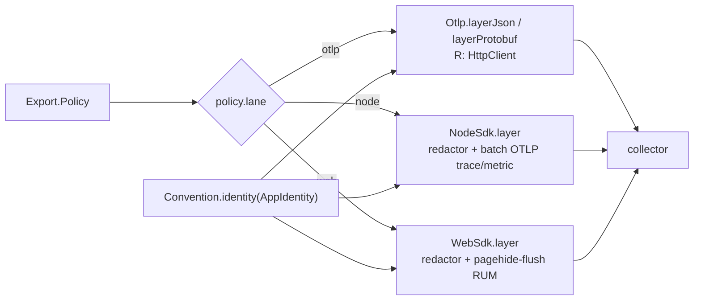

# [TELEMETRY_EXPORT]

OTLP egress is one policy value and one Layer: `Export.live(policy)` composes the whole trace/metric/log export plane as a `Layer<never>` registration node the app root merges once, with the lane — native `Otlp` over the shared `HttpClient` (the default), `NodeSdk` (node/bun SDK bridge), `WebSdk` (browser RUM SDK bridge) — selected by one policy row, never a fork. Every lane consumes one identity: the OTLP `Resource` derives from `Convention.identity(policy.identity)`, the same `AppIdentity` value `browser` boot and the `store` `StoreHandle` scope use. Redaction at the export boundary is a policy table with structural enforcement per signal, distinct by law from the capture-time replay redaction `signal/crash` owns. The `@opentelemetry` sdk/exporter block behind the SDK lanes is the `[R3]` pin block — it collapses as one unit when native `Otlp` parity (including the span-scrub hook) closes, and only `semantic-conventions` survives. The `plane:dev` DevTools row ships as its own `./dev` subpath module, physically unresolvable from runtime code.

## [1]-[INDEX]

| [INDEX] | [CLUSTER]   | [OWNS]                                                                        |
| :-----: | :---------- | :----------------------------------------------------------------------------- |
|  [01]   | [POLICY]    | the one `Export.Policy` row: identity, collector, lane, cadence, sampling       |
|  [02]   | [REDACTION] | export-boundary scrub rules + the per-signal structural-safety ledger           |
|  [03]   | [LANES]     | the native `Otlp` row, the `NodeSdk`/`WebSdk` rows, the lane-roster dispatch    |
|  [04]   | [DEV]       | the `plane:dev`-fenced `./dev` DevTools module                                  |

## [2]-[POLICY]

[POLICY]:
- Owner: `Export.Policy` — one typed row carrying every export decision: the `AppIdentity`, the deployment environment, the collector endpoint and sealed headers, the lane and serialization, per-signal cadence as `Duration` rows, the head-sampling ratio, batch tuning, metric temporality, the tenant-cardinality budget, and the redaction rules; the policy arrives as a value from the app root's `Config.unwrap` owner, and no export decision exists outside it.
- Law: the collector secret rides `Redacted` end-to-end — the policy's `headers` values are `Redacted<string>` sealed at config admission and unwrapped exactly once inside the lane construction, so an exporter credential can never print.
- Law: cadence, batch width, sampling ratio, and temporality are policy values with stated defaults — a lane never hardcodes an interval, and tuning a fleet is a config edit, never a code edit.
- Law: the OTLP signal paths derive from one base URL by the interior `_signal` projection — `/v1/traces`, `/v1/metrics` — so a collector move is one field.
- Growth: a new export decision is one policy field consumed by the lane rows; a new backend is a `baseUrl`/`headers` value, never a lane.

```typescript
import type { Duration, Redacted } from "effect"
import type { AppIdentity } from "@rasm/ts/kernel"
import { Convention } from "../signal/convention.ts"

declare namespace Export {
  type Lane = keyof typeof _lanes
  type Policy = {
    readonly identity: AppIdentity
    readonly environment: string
    readonly collector: {
      readonly baseUrl: string
      readonly headers: Readonly<Record<string, Redacted.Redacted<string>>>
    }
    readonly lane: Lane
    readonly serialization: "json" | "protobuf"
    readonly cadence: {
      readonly logs: Duration.Duration
      readonly metrics: Duration.Duration
      readonly traces: Duration.Duration
    }
    readonly sampling: { readonly ratio: number }
    readonly batch: { readonly maxExportBatchSize: number; readonly maxQueueSize: number }
    readonly temporality: "cumulative" | "delta"
    readonly cardinality: { readonly tenant: number }
    readonly redaction: Redaction.Rules
  }
  type Live = Layer.Layer<never, never, HttpClient.HttpClient>
}

const _signal = (policy: Export.Policy, signal: "logs" | "metrics" | "traces"): string =>
  `${policy.collector.baseUrl}/v1/${signal}`

const _attributes = (policy: Export.Policy): Convention.Attributes => ({
  ...Convention.identity(policy.identity),
  [Convention.attr.deploymentEnvironment]: policy.environment,
})
```

## [3]-[REDACTION]

[REDACTION]:
- Owner: `Redaction` — the export-boundary scrub: `Rules` as data (sealed attribute keys plus value patterns), one total `scrub` fold over any attribute record, and `processor(rules)` materializing the rules as an OTel `SpanProcessor` whose `onEnding` hook overwrites deny-keyed and pattern-matched span attributes with the sealed sentinel before the span freezes for export.
- Law: the three signals are safe by three distinct mechanisms, and the ledger is explicit — metrics carry only bounded-vocabulary tags (the rails bounded-dimension law), so no metric attribute can hold PII by construction; log safety is the `Redacted` carrier law — a secret prints `<redacted>` on every channel from admission — plus the same deny-key vocabulary applied to annotation records at the capture seams this folder owns; span attributes are the one open surface, scrubbed structurally by `Redaction.processor` on the SDK lanes.
- Law: the native `Otlp` lane exposes no span-attribute hook — export-boundary span scrub is therefore an `[R3]` parity criterion: a deployment whose compliance posture mandates boundary scrub selects an SDK lane until the native lane grows the hook, and that selection pressure is recorded on the lane card, never worked around with a fork.
- Law: `defaults` seals the identifier-grade semconv keys — `client.address`, `user_agent.original`, `url.full` (query strings carry tokens) — and the pattern rows mask bearer tokens and email shapes inside surviving string values; app policies extend by row composition, never by a second scrub.
- Boundary: capture-time replay redaction is `signal/crash`'s law — breadcrumbs scrub before they are stored; this owner scrubs what leaves the process.
- Exemption: the `SpanProcessor` hooks are the OTel SDK's own callback contract — the platform-forced statement seam where `setAttribute` writes cross back into the span before it freezes.
- Growth: a new PII class is one `sealed` key row or one `patterns` row.

```typescript
import { Array, Record } from "effect"
import type { Span, SpanProcessor } from "@opentelemetry/sdk-trace-base"

declare namespace Redaction {
  type Rules = {
    readonly patterns: ReadonlyArray<RegExp>
    readonly sealed: ReadonlyArray<string>
  }
}

const _SEAL = "<redacted>"

const _defaults: Redaction.Rules = {
  patterns: [/bearer\s+[a-z0-9._-]+/gi, /[a-z0-9._%+-]+@[a-z0-9.-]+\.[a-z]{2,}/gi],
  sealed: [Convention.attr.clientAddress, Convention.attr.userAgent, Convention.attr.urlFull],
}

const _masked = (rules: Redaction.Rules, value: Convention.Value): Convention.Value =>
  typeof value === "string"
    ? Array.reduce(rules.patterns, value, (held, pattern) => held.replace(pattern, _SEAL))
    : value

const _scrub = (rules: Redaction.Rules, attributes: Convention.Attributes): Convention.Attributes =>
  Record.map(attributes, (value, key) => (Array.contains(rules.sealed, key) ? _SEAL : _masked(rules, value)))

const _processor = (rules: Redaction.Rules): SpanProcessor => ({
  forceFlush: () => Promise.resolve(),
  onEnd: () => undefined,
  onEnding: (span: Span) => {
    for (const [key, value] of Object.entries(_scrub(rules, span.attributes as Convention.Attributes))) {
      span.setAttribute(key, value)
    }
  },
  onStart: () => undefined,
  shutdown: () => Promise.resolve(),
})

const Redaction: {
  readonly defaults: Redaction.Rules
  readonly processor: (rules: Redaction.Rules) => SpanProcessor
  readonly scrub: (rules: Redaction.Rules, attributes: Convention.Attributes) => Convention.Attributes
} = {
  defaults: _defaults,
  processor: _processor,
  scrub: _scrub,
}
```

## [4]-[LANES]

[LANES]:
- Owner: the interior `_lanes` roster — `as const satisfies Record<string, (policy) => Layer>` — with `Export.live(policy)` as the one entrypoint dispatching `_lanes[policy.lane](policy)`; the lane union derives as `keyof typeof _lanes`, so config admission (`Config.literal` at the app root), the policy type, and the dispatch read one anchor, and a new lane is one row.
- Packages: `@effect/opentelemetry` (`Otlp`, `NodeSdk`, `WebSdk` — the facade both lanes ride), the `[OTLP_SDK]` pin block composed here (`@opentelemetry/sdk-trace-base`, `sdk-metrics`, `exporter-trace-otlp-http`, `exporter-metrics-otlp-http`; `sdk-trace-node`/`sdk-trace-web` ride as the facade's lane peers — SDK lanes only, `[R3]`-collapse members).
- Law: the native `otlp` row is the default — Effect's own `Tracer`/`Metric`/`Logger` serialize straight to the collector over the `HttpClient.HttpClient` requirement the root satisfies with `host/net`'s policy client (node/bun) or the XHR client (browser), so OTLP egress inherits the branch timeout/retry/proxy posture; serialization selects `Otlp.layerJson` versus `Otlp.layerProtobuf`.
- Law: identity crosses as one interior `_resource` projection — the facade's `{ serviceName, serviceVersion, attributes }` resource options carrying `Convention.identity` — consumed identically by the native row and the SDK `Configuration`, so the facade owns `Resource` construction on every lane and a raw `@opentelemetry/resources` value never appears.
- Law: the SDK rows exist for SDK-only capability — processor semantics, the boundary span scrub, an explicit metric temporality preference — and each is one facade `Configuration`: the `node` row wires `Redaction.processor` before a `BatchSpanProcessor(new OTLPTraceExporter(...))`, a `PeriodicExportingMetricReader({ exporter: new OTLPMetricExporter({ temporalityPreference }) })`, and a `ParentBasedSampler({ root: new TraceIdRatioBasedSampler(ratio) })` tracer config; the `web` row is the same shape over `WebSdk` with the browser batch config keeping pagehide auto-flush ON so RUM spans drain before navigation. Neither row calls `register()` — the facade owns context wiring through the fiber-backed tracer.
- Law: SDK-lane log egress does not exist — no OTLP log exporter is admitted, so the log signal is native-lane-only (`Otlp` carries it; the SDK rows export traces and metrics), and a parallel log sink beside the replaced process logger is the named defect.
- Law: metric temporality is the policy row mapped to `AggregationTemporalityPreference` — `delta` is the meter-stream default (cheap billing rollups), `cumulative` the monotonic-totals alternative — and the tenant-cardinality budget rides the reader's `cardinalityLimits`, the governed ceiling `signal/meter`'s tenant tag operates under.
- Law: `Export.live` returns a registration node — `Layer<never>` semantics with the native lane's `HttpClient` requirement in `R` — merged once at the composition root beside `Resource`-independent siblings; construction observability attaches at the Layer value (`Layer.annotateLogs`), and a boot-time collector outage is Layer construction policy, never a runtime branch.
- Entry: `Export.live(policy)`.
- Growth: a new lane (OTLP/gRPC, a vendor SDK exporter) is one `_lanes` row plus any policy field it reads.



```typescript
import { Duration, Layer, Record, Redacted } from "effect"
import type { HttpClient } from "@effect/platform"
import { NodeSdk, Otlp, WebSdk } from "@effect/opentelemetry"
import { AggregationTemporalityPreference, OTLPMetricExporter } from "@opentelemetry/exporter-metrics-otlp-http"
import { OTLPTraceExporter } from "@opentelemetry/exporter-trace-otlp-http"
import { PeriodicExportingMetricReader } from "@opentelemetry/sdk-metrics"
import { BatchSpanProcessor, ParentBasedSampler, TraceIdRatioBasedSampler } from "@opentelemetry/sdk-trace-base"

const _headers = (policy: Export.Policy): Record<string, string> =>
  Record.map(policy.collector.headers, Redacted.value)

const _resource = (policy: Export.Policy): {
  readonly attributes: Convention.Attributes
  readonly serviceName: string
  readonly serviceVersion: string
} => ({
  attributes: _attributes(policy),
  serviceName: policy.identity.app,
  serviceVersion: policy.identity.build.version,
})

const _temporality = {
  cumulative: AggregationTemporalityPreference.CUMULATIVE,
  delta: AggregationTemporalityPreference.DELTA,
} as const

const _sdk = (policy: Export.Policy) => ({
  metricReader: new PeriodicExportingMetricReader({
    exportIntervalMillis: Duration.toMillis(policy.cadence.metrics),
    exporter: new OTLPMetricExporter({
      headers: _headers(policy),
      temporalityPreference: _temporality[policy.temporality],
      url: _signal(policy, "metrics"),
    }),
    cardinalityLimits: { default: policy.cardinality.tenant },
  }),
  resource: _resource(policy),
  spanProcessor: [
    Redaction.processor(policy.redaction),
    new BatchSpanProcessor(
      new OTLPTraceExporter({ headers: _headers(policy), url: _signal(policy, "traces") }),
      policy.batch,
    ),
  ],
  tracerConfig: { sampler: new ParentBasedSampler({ root: new TraceIdRatioBasedSampler(policy.sampling.ratio) }) },
})

const _lanes = {
  node: (policy: Export.Policy): Export.Live => NodeSdk.layer(() => _sdk(policy)),
  otlp: (policy: Export.Policy): Export.Live =>
    (policy.serialization === "protobuf" ? Otlp.layerProtobuf : Otlp.layerJson)({
      baseUrl: policy.collector.baseUrl,
      headers: _headers(policy),
      loggerExportInterval: policy.cadence.logs,
      maxBatchSize: policy.batch.maxExportBatchSize,
      metricsExportInterval: policy.cadence.metrics,
      resource: _resource(policy),
      tracerExportInterval: policy.cadence.traces,
    }),
  web: (policy: Export.Policy): Export.Live => WebSdk.layer(() => _sdk(policy)),
} as const satisfies Record<string, (policy: Export.Policy) => Export.Live>

const Export: {
  readonly live: (policy: Export.Policy) => Export.Live
} = {
  live: (policy) => Layer.annotateLogs(_lanes[policy.lane](policy), { lane: policy.lane }),
}

// --- [EXPORTS] --------------------------------------------------------------------------

export { Export, Redaction }
```

## [5]-[DEV]

[DEV]:
- Owner: the sibling `otlp/dev` module the `./dev` exports-map subpath alone resolves — one `DevTools.layer` row wired to the local DevTools WebSocket, `plane:dev` by tag so the `tests/typescript/_architecture` gauge fails any runtime import; the physical module split is what makes the fence structural rather than disciplinary.
- Packages: `@effect/experimental` (`DevTools`).
- Law: the dev layer is a registration node like the export layer — merged into a dev composition root beside `Export.live`, never instead of it — and it carries no policy: the DevTools endpoint default is the tool's own.
- Growth: none — the module is closed; richer dev wiring belongs to the tests estate.

```typescript
import { DevTools } from "@effect/experimental"
import type { Layer } from "effect"

const dev: Layer.Layer<never> = DevTools.layer()

// --- [EXPORTS] --------------------------------------------------------------------------

export { dev }
```
