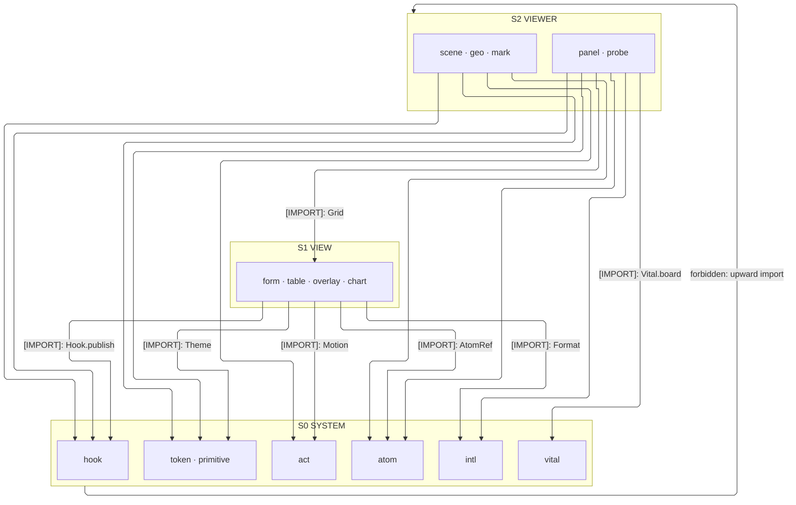
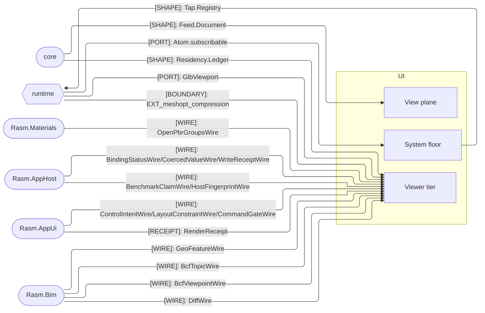

# [TS_UI_ARCHITECTURE]

`ui` maps the browser interface plane and its sibling `viewer` Nx project: `system`, `view`, and `viewer` sub-domains meet through one atom binding, one styled recipe, one motion vocabulary, and one selection plane. Viewer renders decoded wire vocabularies and owns zero geometry or IFC semantics.

## [01]-[DOMAIN_MAP]

```text codemap
ui/
├── src/
│   ├── system/                # Component system: token, interaction, state-binding, locale, primitive owners
│   │   ├── token.ts           # Design-token authority computing color and dimension as decode-gated data
│   │   ├── act.ts             # Motion and interaction, discrete accessible events split from continuous gestures
│   │   ├── atom.ts            # One state binding standing the app Layer graph behind the registry
│   │   ├── hook.ts            # Typed hook registry — the rasm.ui fact rail, modality rows, tap isolation
│   │   ├── vital.ts           # Browser performance evidence folded into probe-shaped metric rows
│   │   ├── intl.ts            # Zero-package locale plane riding native Intl behind one cache
│   │   └── primitive.ts       # Headless spine: the one styled recipe and the sanitize gate
│   └── view/                  # View plane composing the system owners into four dense surfaces
│       ├── form.ts            # Schema-driven forms: one kernel Schema owning wire decode and live field validity
│       ├── table.ts           # Data grid: models, virtual windows, and grid semantics under one TableState atom
│       ├── overlay.ts         # Overlay owner: anchoring, sheets, and the command palette over one presence cohort
│       └── chart.ts           # Analytic charts: declarations, streams, and pivots over one Arrow plane
└── viewer/
    └── src/                   # Spatial tier, a second Nx project
        ├── scene.ts           # Content-keyed GLB residency behind the GlbViewport port
        ├── geo.ts             # Geospatial surface: one shared WebGL context as a pure layer value tree
        ├── mark.ts            # GlobalId mark plane: one selection atom every pick pipeline folds into
        ├── panel.ts           # Wire materializer rendering the C#-minted control vocabularies through the owners
        └── probe.ts           # Render evidence: benchmarks paired with wire-decoded receipts, never gating
```

## [02]-[STRATA]

- S0 `system` — the capability floor: `atom` the one store bridge (`AtomRef`, `Atom.subscribable`), `act` the gesture and motion owner, `intl` the `Format` plane, `token` the `Theme` authority whose `cn` composer `primitive`'s recipes compose, `hook` the per-app `rasm.ui.<domain>.<point>` fact rail every plane taps, `vital` the performance-evidence fold minting probe-shaped rows.
- S1 `view` — dense surfaces over the floor: `form` binds draft cursors through `AtomRef`, `table` folds `TableState` on the one store and formats bands through `Format`, `overlay` and `chart` ride `act` gesture and motion rows under the same recipes.
- S2 `viewer` — the spatial Nx project atop both: `scene` parks its frame loop on `act`, binds color through the `token` authority, and rides its `Machine` lifecycle on the atom bridge; `mark` and `scene` compose `geo`'s `Camera` inside the wave — one camera vocabulary, per-backend adapters; `probe` renders its claim board through `view/table`'s `Grid` rows and `view/chart` series while `panel` folds receipts on the store; evidence taps and browser vitals arrive through the `hook` and `vital` floor owners.



## [03]-[SEAMS]



## [04]-[ORGANIZATION]

`system` is the capability floor the views instantiate; `view` composes those owners into dense surfaces — form, grid, overlay, chart — each a single owner where variation is rows (columns, commands, field kinds, chart regimes), never sibling components; `viewer` is the spatial tier as a separate Nx project consuming decoded wire and owning render alone. Selection stays one atom whose applied ops publish once into the bounded echo channel; the grid `RowSelectionState` and the `scrollToIndex` echo project it, never a second plane. Per-owner wiring lives on the owning implementation pages.

## [05]-[BOUNDARIES]

- IFC semantics and geometry stay unowned; GLB, BCF, and selection arrive decoded through the core interchange plane, rendered, never re-authored.
- A browser composition root — `GlbViewport` from Depot arrivals, host planes bound into atoms — is app composition, out of scope here.
- `EXT_meshopt_compression` assets refuse with the `codec-absent` reason until the iac plane admits the wasm decoder identity and its serving row.
- History consumers compose from the landed system pages; a second history owner never appears beside the selection atom.
- Telemetry leaves through app-composed hook taps — the folder mints no OTel instrument and imports no collector; the bridge layer subscribes `system/hook` points at app composition and carries rows to the estate spine.
