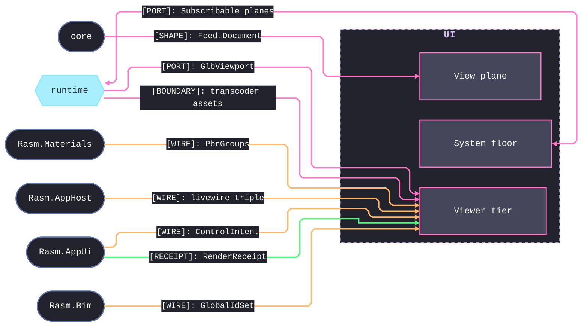

# [TS_UI_ARCHITECTURE]

`ui` maps the browser interface plane and its sibling `viewer` Nx project: `system`, `view`, and `viewer` sub-domains meet through one atom binding, one styled recipe, one motion vocabulary, and one selection plane. Viewer renders decoded wire vocabularies and owns zero geometry or IFC semantics.

Each codemap node names the source file its `.planning/` page becomes in camelCase `.ts`; the scaffold is authoring substrate, never part of the map.

## [01]-[DOMAIN_MAP]

```text codemap
ui/
├── src/
│   ├── system/                # Component system: token, interaction, state-binding, locale, primitive owners
│   │   ├── token.ts           # Design-token authority computing color and dimension as decode-gated data
│   │   ├── act.ts             # Motion and interaction, discrete accessible events split from continuous gestures
│   │   ├── atom.ts            # One state binding standing the app Layer graph behind the registry
│   │   ├── intl.ts            # Zero-package locale plane riding native Intl behind one cache
│   │   └── primitive.ts       # Headless spine: the one styled recipe and the sanitize gate
│   └── view/                  # View plane composing the system owners into four dense surfaces
│       ├── form.ts            # Schema-driven forms: one kernel Schema owning wire decode and live field validity
│       ├── table.ts           # Data grid: models, virtual windows, and grid semantics under one TableState atom
│       ├── overlay.ts         # Overlay owner: anchoring, sheets, and the command palette over one presence cohort
│       └── chart.ts           # Analytic charts: declarations, streams, and pivots over one Arrow plane
└── viewer/
    └── src/                   # Spatial tier, a second Nx project
        ├── scene.ts           # Content-keyed GLB residency behind the GlbViewport port
        ├── geo.ts             # Geospatial surface: one shared WebGL context as a pure layer value tree
        ├── mark.ts            # GlobalId mark plane: one selection atom every pick pipeline folds into
        ├── panel.ts           # Wire materializer rendering the C#-minted control vocabularies through the owners
        └── probe.ts           # Render evidence: benchmarks paired with wire-decoded receipts, never gating
```

## [02]-[SEAMS]



## [03]-[ORGANIZATION]

`system` is the capability floor the views instantiate; `view` composes those owners into four dense surfaces — form, grid, overlay, chart — each a single owner where variation is rows (columns, commands, field kinds, chart regimes), never sibling components; `viewer` is the spatial tier as a separate Nx project consuming decoded wire and owning render alone. Selection stays one atom: the grid `RowSelectionState` and the `scrollToIndex` echo project it, never a second plane. Per-owner wiring lives on the owning implementation pages.

## [04]-[BOUNDARIES]

- IFC semantics and geometry stay unowned here; GLB, BCF, and selection vocabularies arrive decoded through the core interchange plane, rendered and never re-authored.
- Browser composition root — `GlbViewport` satisfied from Depot arrivals, host Subscribable planes bound into atoms — is app composition, out of scope here.
- `EXT_meshopt_compression` assets refuse with the `codec-absent` reason until the iac plane admits the wasm decoder identity and its serving row.
- History consumers compose from the landed system pages; a second history owner never appears beside the selection atom.
