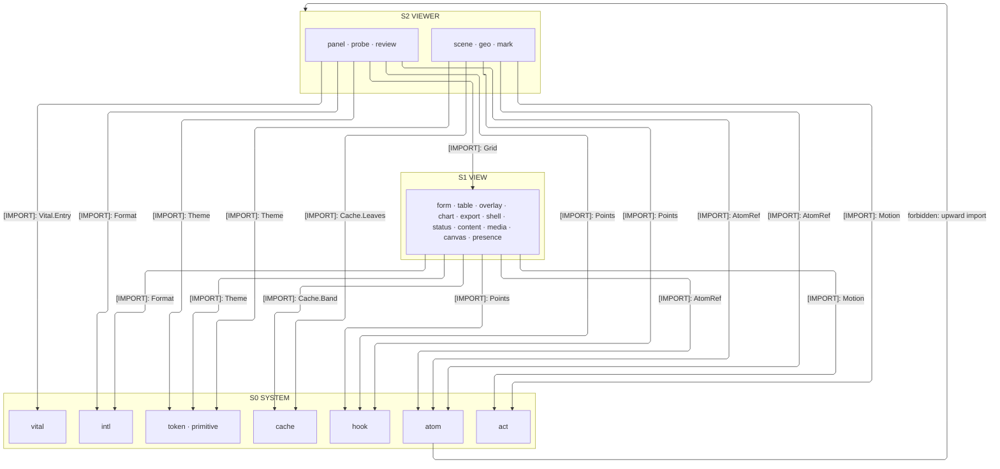
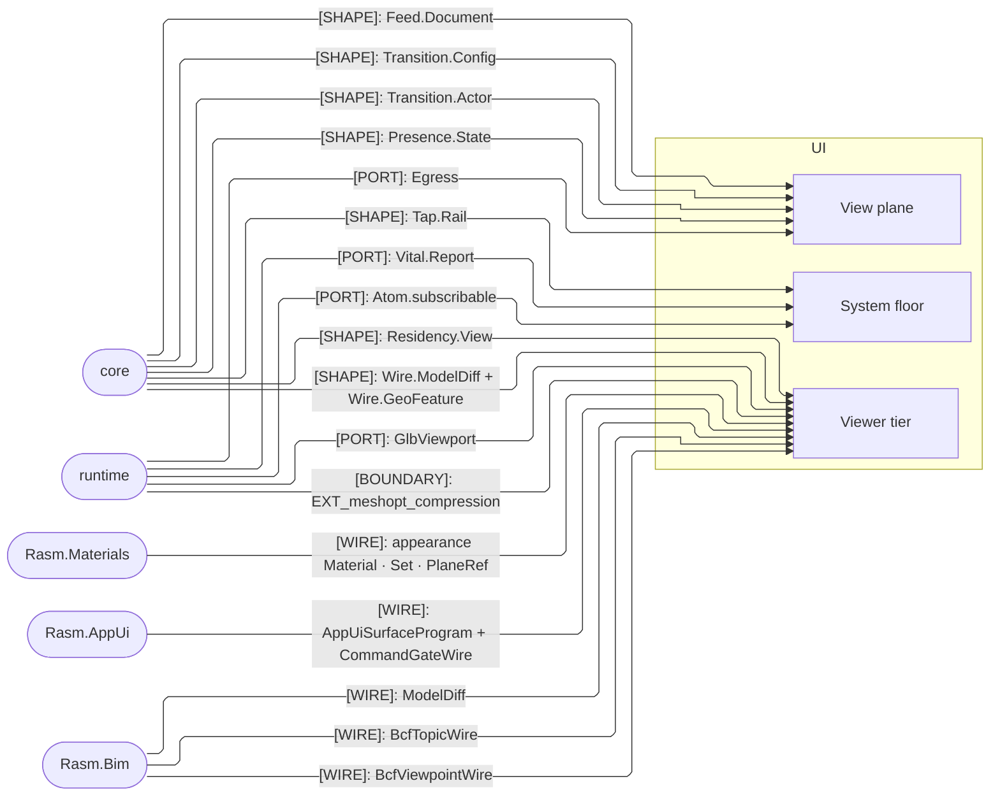
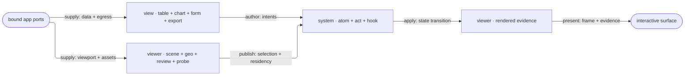

# [TS_UI_ARCHITECTURE]

`ui` maps the browser interface plane and its sibling `viewer` Nx project: `system`, `view`, and `viewer` sub-domains meet through one atom binding, one styled recipe, one motion vocabulary, and one selection plane. Viewer renders decoded wire vocabularies and owns zero geometry or IFC semantics.

## [01]-[DOMAIN_MAP]

```text
ui/
├── src/
│   ├── system/           # Component system floor the view and viewer strata instantiate
│   │   ├── token.ts      # Design-token authority computing color and dimension as decode-gated data
│   │   ├── act.ts        # Motion and interaction, discrete accessible events split from continuous gestures
│   │   ├── atom.ts       # Atom registry seat with the persistence, SSR, and undo planes
│   │   ├── cache.ts      # Content-keyed OPFS residency: band ledger, integrity gate, quota sweep
│   │   ├── hook.ts       # Folder registrar on core's Tap rail — point roster, adopted sources, consult selector
│   │   ├── vital.ts      # LoAF, event, commit, and compile evidence folded into probe-shaped rows; CWV is runtime's
│   │   ├── intl.ts       # Zero-package locale plane riding native Intl behind one cache
│   │   └── primitive.ts  # Headless spine: the one styled recipe and the sanitize gate
│   └── view/             # View plane composing the system owners into dense surfaces
│       ├── form.ts       # Schema-driven forms: one kernel Schema owning wire decode, live field validity, wizard, ceremony
│       ├── table.ts      # Data grid: models, virtual windows, and grid semantics under one TableState atom
│       ├── overlay.ts    # Overlay owner: anchoring, sheets, and the command palette over one presence cohort
│       ├── chart.ts      # Analytic charts: declarations, streams, and pivots over one Arrow plane
│       ├── export.ts     # Export plane: one serializer matrix, content-minted parcels, one egress port
│       ├── shell.ts      # Application chrome as data: region roster, navigation vocabulary, scaffold grammar
│       ├── status.ts     # Feedback family: Result-derived postures, lease windows, skeleton wrapper, gauges
│       ├── content.ts    # EditorView seat and the block-row dispatch fold behind one scoped acquisition
│       ├── media.ts      # Byte-borne presentation: image, avatar, transport, and gallery as policy rows
│       ├── canvas.ts     # Revision-stamped graph cell and the change-fold writer behind the engine mirror
│       └── presence.ts   # Anchor spaces assembled as composition values over settled core verdicts
└── viewer/               # Spatial stratum, the second Nx project
    └── src/
        ├── scene.ts      # Content-keyed GLB residency and environment dome behind the GlbViewport port
        ├── geo.ts        # Camera authority and the Clock seat; layer values stay pure per backend adapter
        ├── mark.ts       # Selection atom seat — BCF pin and board projections, one bounded echo channel
        ├── panel.ts      # Livewire fold and AppUiSurfaceProgram admission, projection, and layout solve
        ├── probe.ts      # Render evidence: benchmarks and wire-decoded timelines compared, never gating
        └── review.ts     # Join fold over the decoded diff and issue wires; board-row and echo projections
```

## [02]-[STRATA]

Strata rank the ui interior; seating rows carry only the law the fence cannot show.


```mermaid
---
config:
  layout: elk
  flowchart:
    curve: linear
    padding: 25
---
flowchart TB
    accTitle: Ui interior import strata
    accDescr: How the viewer project and view surfaces rank onto the system floor, every import downward.
    subgraph S2["S2 VIEWER"]
        Scene["scene · geo · mark"]
        Board["panel · probe · review"]
    end
    subgraph S1["S1 VIEW"]
        View["form · table · overlay · chart · export · shell · status · content · media · canvas · presence"]
    end
    subgraph S0["S0 SYSTEM"]
        Token["token · primitive"]
        Act[act]
        Atom[atom]
        Cache[cache]
        Intl[intl]
        Hook[hook]
        Vital[vital]
    end
    View e1@-->|"[IMPORT]: AtomRef"| Atom
    View e2@-->|"[IMPORT]: Format"| Intl
    View e3@-->|"[IMPORT]: Theme"| Token
    View e4@-->|"[IMPORT]: Motion"| Act
    View e5@-->|"[IMPORT]: Points"| Hook
    View e6@-->|"[IMPORT]: Cache.Band"| Cache
    Scene e7@-->|"[IMPORT]: Theme"| Token
    Scene e8@-->|"[IMPORT]: Motion"| Act
    Scene e9@-->|"[IMPORT]: AtomRef"| Atom
    Scene e10@-->|"[IMPORT]: Points"| Hook
    Scene e11@-->|"[IMPORT]: Cache.Leaves"| Cache
    Board e12@-->|"[IMPORT]: AtomRef"| Atom
    Board e13@-->|"[IMPORT]: Format"| Intl
    Board e14@-->|"[IMPORT]: Theme"| Token
    Board e15@-->|"[IMPORT]: Grid"| View
    Board e16@-->|"[IMPORT]: Vital.Entry"| Vital
    Board e17@-->|"[IMPORT]: Points"| Hook
    Atom f1@-->|"forbidden: upward import"| S2
```

- S0 merge — `token · primitive` share one node; `primitive`'s `styled` recipes are the floor's one token consumer, so the merge hides no edge.
- S0 `cache` — content-keyed residency seats on the floor; `media` bands and the viewer's `bvh` read-back compose it, and nothing feeds back.
- S1 `view` merge — each surface is a single owner where variation lands as rows; `presence` assembles anchor spaces as values, never imports.
- S1 `content` hosts the editor behind one scoped acquisition; `canvas` mirrors its engine through the edge adapter on the one store.
- S2 `viewer` — the spatial Nx project atop both strata; `scene` rides `Machine` on the atom bridge.
- S2 `mark` and `scene` compose `geo`'s `Camera` inside the stratum — one camera vocabulary, per-backend adapters.
- S2 `panel` folds livewire outcomes on the store; `probe`'s evidence stays render-side and gates nothing.
- S2→S0 evidence crossings are publish-only — viewer taps and long-frame rows land at the floor owners, and no floor owner reads a viewer symbol.

## [03]-[SEAMS]


```mermaid
---
config:
  layout: elk
  flowchart:
    curve: linear
    padding: 25
---
flowchart LR
    accTitle: UI package seam registry
    accDescr: Which value, wire, port, and boundary contracts cross between the ui owners and their core, runtime, and C# counterparts.
    subgraph ui[UI]
        System[System floor]
        View[View plane]
        Viewer[Viewer tier]
    end
    Core([core])
    Runtime([runtime])
    Materials([Rasm.Materials])
    AppUi([Rasm.AppUi])
    Bim([Rasm.Bim])
    Core e1@-->|"[SHAPE]: Feed.Document"| View
    Core e2@-->|"[SHAPE]: Transition.Config"| View
    Core e3@-->|"[SHAPE]: Transition.Actor"| View
    Core e4@-->|"[SHAPE]: Presence.State"| View
    Core e5@-->|"[SHAPE]: Residency.View"| Viewer
    Core e6@-->|"[SHAPE]: Wire.ModelDiff + Wire.GeoFeature"| Viewer
    Core e7@-->|"[SHAPE]: Tap.Rail"| System
    Runtime e8@-->|"[PORT]: Atom.subscribable"| System
    Runtime e9@-->|"[PORT]: GlbViewport"| Viewer
    Runtime e10@-->|"[PORT]: Vital.Report"| System
    Runtime e11@-->|"[BOUNDARY]: EXT_meshopt_compression"| Viewer
    Runtime e12@-->|"[PORT]: Egress"| View
    Materials e13@-->|"[WIRE]: appearance Material · Set · PlaneRef"| Viewer
    AppUi e14@-->|"[WIRE]: AppUiSurfaceProgram + CommandGateWire"| Viewer
    Bim e15@-->|"[WIRE]: BcfTopicWire"| Viewer
    Bim e16@-->|"[WIRE]: BcfViewpointWire"| Viewer
    Bim e17@-->|"[WIRE]: ModelDiff"| Viewer
```

Each seam edge collapses every contract between its endpoints at its labeled kind: the core wire, tap, and presence edges and the AppUi wire edge carry representative shapes, and the core codec registry census enumerates the full families.

## [04]-[INTERNAL]


```mermaid
---
config:
  layout: elk
  flowchart:
    curve: linear
    padding: 25
---
flowchart LR
    accTitle: UI interaction spine
    accDescr: Bound ports feed view and viewer owners; both publish interaction state that renders the product surface.
    Ports([bound app ports])
    View[view · table + chart + form + export]
    Viewer[viewer · scene + geo + review + probe]
    Interaction[system · atom + act + hook]
    Render[viewer · rendered evidence]
    Surface([interactive surface])
    Ports e1@-->|"supply: data + egress"| View
    Ports e2@-->|"supply: viewport + assets"| Viewer
    View e3@-->|"author: intents"| Interaction
    Viewer e4@-->|"publish: selection + residency"| Interaction
    Interaction e5@-->|"apply: state transition"| Render
    Render e6@-->|"present: frame + evidence"| Surface
```

`system` is the capability floor the views instantiate; `view` composes those owners into dense surfaces, each a single owner where variation lands as rows, never sibling components; `viewer` is the spatial stratum as a separate Nx project consuming decoded wire and owning render alone.

Every state fact binds through the one atom bridge, so a component projects and never runs an effect or mirrors domain state. Selection stays one atom whose applied ops publish once into the bounded echo channel; the grid `RowSelectionState` and the `scrollToIndex` echo project it, never a second plane. Color is one OKLCH artifact (gamut-fit and contrast-gated at decode) feeding the CSS plane and the viewer's linear render space as one object, and visualization data crosses zero-copy on one Arrow bus. Per-owner wiring lives on the owning implementation pages.

## [05]-[BOUNDARIES]

- `Rasm.Bim` and the core interchange plane own IFC semantics and geometry; this folder renders their decoded wire alone.
- GLB, BCF, WKB, and selection arrive decoded through the core interchange plane, rendered, never re-authored.
- Every GPU resource is scope-bracketed, so a lost context or torn-down surface releases its allocations through the same bracket that acquired them.
- Browser composition roots — `GlbViewport` from Depot arrivals, host planes bound into atoms — are app composition, out of scope here.
- `EXT_meshopt_compression` refuses as `codec-absent` without its decoder; codec construction requires draco and ktx2.
- History consumers compose from the landed system pages; a second history owner never appears beside the selection atom.
- Telemetry leaves through app-composed hook taps; the folder mints no OTel instrument and imports no collector.
- One bridge layer subscribes `system/hook` points at app composition and carries rows to the estate spine.
