# [H1][ASSAY_ARCHITECTURE]
>**Dictum:** *Tools are data; one Engine runs them all; one rail folds a claim; one Envelope carries the result; one Trigger drives them on change.*

<br>

`assay` is the polyglot quality-and-automation operator for the Rasm monorepo. It supersedes `tools/quality` (3,897 LOC, 9 files) and the `package.json` quality scripts (`check:py*`, `check:ts`, `test:cs`, `verify:rhino`). It routes every C#, Python, TypeScript, Bash, and SQL quality program through one process executor and emits exactly one JSON `Envelope` per invocation (a stream of Envelopes under the automation arm). The design separates the *executor* (launch, capture, scope, fold, lease) from the *tool* (which program, which arguments, which language): a tool is a data row, the Engine is one polymorphic surface, programs are integrated algorithmically in a catalog rather than as per-binary modules, and cross-cutting concerns attach as a slot-ordered aspect stack at exactly two seams.

This document is the keystone: it carries the abstraction, the type system, the aspect doctrine, the concurrency model, the **decision ledger** that resolves every prior contradiction, the **parity matrix** against `tools/quality` + `package.json`, the build order, and the corpus map. It absorbs the former `IMPLEMENTATION.md`. The deliverable of this design phase is documentation only; a later phase implements the `.py` from these docs.

| [DOC] | [ROLE] |
| ----- | ------ |
| `README.md` | Agent operator contract: invocation, Envelope, exit codes, concurrency, migration |
| `AGENTS.md` | Delta-only edit guidance: load order, ownership, tripwires |
| `ARCHITECTURE.md` | This file: shapes, axes, invariants, aspect doctrine, ledger, parity, build order, LOC budget |
| `design/<layer>/<file>.md` | One doc per intended `.py`: purpose, canonical shapes, validated snippet, seams, extensibility |

---
## [1][PROBLEM_AND_GOALS]
>**Dictum:** *State the rot, the prohibition, and the target before the mechanism.*

<br>

`tools/quality` works but accreted into a shape that resists growth and never crossed the language boundary. The defects below motivate every later decision.

| [INDEX] | [DEFECT]              | [EVIDENCE IN PREDECESSOR]                                                  |
| :-----: | --------------------- | ------------------------------------------------------------------------- |
|   [1]   | C#-only reach         | `dotnet` hardwired across `rails/*`; Python and TypeScript gate only in unrouted `package.json` shell lines; no Bash/SQL coverage at all. |
|   [2]   | Shape sprawl          | ~25 single-use `Literal` aliases, 14 report structs, three model systems (`process.py`, `rails/*`, `settings.py`). |
|   [3]   | Executor/tool fusion  | Per-binary argument builders in each rail invite one module per program.  |
|   [4]   | Projector ceremony    | `rail()` accepts eight callables; a `data`/`evidence` payload ladder re-normalizes mixed return shapes (`__main__.py:370`). |
|   [5]   | Agent concurrency     | Shared `.artifacts/quality` tree; no polyglot fan-out; leases (`process.py:261-307`) record `pid` but never verify holder liveness — a dead holder strands the lock. |
|   [6]   | Agent I/O contract    | The single-Envelope-to-stdout / diagnostics-to-stderr contract is real but undocumented as a first-class invariant; `rail`/`data`/`evidence` field naming leaks executor mechanics onto the wire. |
|   [7]   | Inconsistent exit code | `static` failure exits `2`, `test` failure exits `1`, `api doctor --strict`/`self-test` exit `2` — three meanings for two codes. |
|   [8]   | No automation         | "Point at a folder, re-run X on change" requires a separate ad-hoc watcher; no general trigger→action surface. |

These outcomes are prohibited in `assay` by construction.

| [INDEX] | [PROHIBITION]            | [REPLACED BY]                                            |
| :-----: | ------------------------ | ------------------------------------------------------- |
|   [1]   | Per-binary modules       | One `Tool` row per program in the catalog.              |
|   [2]   | Free `Literal` aliases   | Behavior-carrying `StrEnum`s on the axes.               |
|   [3]   | Per-rail report structs  | One `Report` plus a bounded `detail` union.             |
|   [4]   | Mixed model systems      | `pydantic-settings` for config; `msgspec` for the rest. |
|   [5]   | Status-string projectors | One `RailStatus` algebra self-describes status and exit. |
|   [6]   | Inconsistent exit codes  | One exit algebra (§8): `0` ok-class, `1` failed, `2` faulted, `3` unsupported, `5` busy/timeout. |
|   [7]   | Blocking locks           | Non-blocking leases with `psutil`-verified holder liveness; `busy`/exit 5. |

The target state is unification with a dense footprint and a sixth-language-cheap extension cost.

| [INDEX] | [GOAL]            | [GUARANTEE]                                                                |
| :-----: | ----------------- | -------------------------------------------------------------------------- |
|   [1]   | Unified shapes    | Five evidence structs plus one bounded `detail` union cross any rail.       |
|   [2]   | One Engine        | A single executor runs every program in every language.                     |
|   [3]   | One Envelope      | Exactly one JSON Envelope per invocation; automation streams one per fire.   |
|   [4]   | Unified rails     | One registry table drives both the CLI tree and routing.                     |
|   [5]   | Day-one polyglot  | C#, Python, TypeScript, Bash, SQL fully specced — catalog rows + routing arms. |
|   [6]   | First-class automation | A general `Trigger → Action` arm watches/schedules any path → any rail or program. |
|   [7]   | Agent-fleet ready | Disjoint `run_id` trees, capped read-only fan-out, fail-fast liveness-checked leases. |
|   [8]   | Dense footprint   | One class per concept; new strings land only in enums or catalog rows; impl `<2000` LOC hard, `<1250` dream. |

---
## [2][SYSTEM_OVERVIEW]
>**Dictum:** *Quality is one operator across five languages; automation is one loop over the same rails.*

<br>

The CLI accepts an argv, selects `Tool` rows for the requested claim and language, routes inputs by language, runs the rows through one Engine, and folds the outcomes into one `Report` → one `Envelope`. The automation arm wraps the same rails: a `Trigger` (watch | schedule | manual) drives an `Action` (a rail invocation, a program, or a sequence) under one `anyio` loop, emitting one `Envelope` per fire as NDJSON. Driven programs — `dotnet` (hosting `cs-analyzer`), `dotnet-stryker`, `ilspycmd`, `yak`, `ruff`, `ty`, `mypy`, `pytest`, `coverage`, `mutmut`, `validate-pyproject`, `ast-grep`, `tools.py_analyzer`, `tsc`, `biome`, `knip`, `sherif`, `vitest`, `shellcheck`, `shfmt`, `sqlfluff`, `squawk`, `mmdc` — are catalog rows, not modules.

```mermaid
---
config: { layout: elk, look: neo, theme: base }
---
flowchart LR
  accTitle: Assay orchestration boundary
  accDescr: The assay CLI and automation arm route inputs, select Tool rows, and run them through one Engine into one Envelope (or an Envelope stream).
  agent["Agent / CI"] -->|"argv"| cli["assay CLI"]
  trig["Trigger<br/>watch · schedule · manual"] -->|"Action"| cli
  cli -->|"claim, verb"| registry["registry<br/>claim x verb -> handler"]
  registry -->|"language"| routing["routing<br/>git + fd + graph/glob"]
  registry -->|"claim, language"| catalog["catalog<br/>Tool rows as data"]
  routing -->|"routed inputs"| engine["one Engine<br/>run / stream / lease / fan_out"]
  catalog -->|"Tool rows"| engine
  engine -->|"Completed or Fault"| report["Report<br/>status + counts + detail"]
  report -->|"report"| envelope["one Envelope<br/>stdout JSON (NDJSON under automation)"]
```



---
## [3][ABSTRACTION_MODEL]
>**Dictum:** *Vary behavior by data on orthogonal axes, never by adding code paths.*

<br>

Four concepts stay separate and compose in one direction.

| [INDEX] | [CONCEPT] | [KIND]       | [RESPONSIBILITY]                                                           |
| :-----: | --------- | ------------ | ------------------------------------------------------------------------- |
|   [1]   | `Tool`    | Data row     | Declares a program: runner, command, input placement, language, claim, `Mode`, optional `Parser`. |
|   [2]   | `Engine`  | One executor | Module `run_check` / `fan_out` — folds any `Check` into `Result[Completed, Fault]`; owns launch, capture, stream, timeout, leases. |
|   [3]   | `Rail`    | A fold       | Selects rows for one claim, routes inputs, runs them through the Engine, folds outcomes into one `Report`. |
|   [4]   | `Trigger` | An automation driver | `Watch \| Schedule \| Manual` → an `Action` (rail invocation, program, or sequence) under one `anyio` loop. |

A program differs from another along orthogonal axes, each a behavior-carrying `StrEnum`, never a module.

| [INDEX] | [AXIS]    | [ENUM]       | [PAYLOAD VIA `__new__`]                                          | [MEMBERS]                                  |
| :-----: | --------- | ------------ | --------------------------------------------------------------- | ------------------------------------------ |
|   [1]   | Launch    | `Runner`     | Argv prefix tuple: `MODULE=("uv","run","python","-m")`, `UV=("uv","run")`, `DOTNET=("dotnet",)`, `PNPM=("pnpm","exec")`, `DIRECT=()`. | `DIRECT`, `MODULE`, `UV`, `DOTNET`, `PNPM`. |
|   [2]   | Input     | `Input`      | `flag` tuple + `scoped` bool — placement of routed paths.        | `FILES`, `INCLUDE`, `PROJECT`, `SOLUTION`, `GLOB`, `NONE`. |
|   [3]   | Language  | `Language`   | `strategy` (`closure`/`glob`) + `suffixes` routing resolves.     | `CSHARP`, `PYTHON`, `TYPESCRIPT`, `BASH`, `SQL`, `DOCS`. |
|   [4]   | Operation | `Mode`       | `stream` + `writes` bools + operation kind.                      | `CHECK`, `WRITE`, `RESTORE`, `BUILD`, `RUN`, `LIST`, `MUTATION`, `CLIENT`, `VERIFY`, `QUERY`, `STAGE`, `DEPLOY`, `PUBLISH`. |
|   [5]   | Proof     | `Claim`      | (value only) — the rail a row belongs to.                        | `STATIC`, `TEST`, `BRIDGE`, `PACKAGE`, `API`, `DOCS`. |

Because the axes are data, the program set is a table, not a tree of files. `ruff check` is `Tool(name="ruff", runner=UV, command=("ruff","check"), input=FILES, language=PYTHON, claim=STATIC)`; the `ruff format` write twin sets `mode=Mode.WRITE` and `command=("ruff","format")`. `shellcheck` is `Tool("shellcheck", DIRECT, ("shellcheck","-f","json1"), FILES, BASH, STATIC, parser=parse_shellcheck)`. One dense row each.

Two rejected alternatives clarify the choice. One module per program would be ~22 near-identical argument builders whose only true variance is the axis data plus, for a few, a parser; encoding variance as data yields one Engine and one catalog. Five language folders would re-fragment the polymorphic surface; a `Language` is one field and one routing arm, so a `ruff` row and a `tsc` row share the same table and Engine.

---
## [4][SHAPE_DISCIPLINE]
>**Dictum:** *Collapse parallel shapes into one polymorphic surface before adding entrypoints.*

<br>

`assay` defines five canonical evidence shapes plus fixed infrastructure (`Completed`, `Fault`, `Envelope`, the `Detail` tagged base, `Counts`, `Bind`, `Routed`), never multiplied per rail.

| [INDEX] | [SHAPE]    | [ROLE]                                                                              |
| :-----: | ---------- | ---------------------------------------------------------------------------------- |
|   [1]   | `Tool`     | Declarative program row: runner, command, input, language, claim, mode, optional parser, optional timeout. |
|   [2]   | `Check`    | A `Tool` bound to concrete routed scalars (`paths`, `owner`, `solution`, `glob`, `cwd`); the runnable atom. |
|   [3]   | `Report`   | One payload: claim, verb, status, counts, artifacts, results, notes, and a tagged `detail`. |
|   [4]   | `Artifact` | One produced file: id, kind, path, bytes, lines.                                    |
|   [5]   | `Match`    | One ranked result row: id, kind, text, line, score.                                |

Algorithm-specific evidence lives only in `Report.detail`, a `msgspec` tagged union keyed by `kind` with explicit short tags, decoded in one pass. The collapse retires the duplication of `tools/quality`.

| [INDEX] | [RETIRED]                                                                                              | [CANONICAL]                                       |
| :-----: | ----------------------------------------------------------------------------------------------------- | ------------------------------------------------ |
|   [1]   | `RailStatus`, `ApiStatus`, raw `status: str` fields                                                    | `RailStatus`                                      |
|   [2]   | `StaticPlanReport`, `TestRunReport`, `TestListReport`, `Package*Report`, `Api*Report`, `VerifyReport`  | `Report` + four `Detail` variants                 |
|   [3]   | `artifact_paths: dict[str, str]` bags                                                                  | `tuple[Artifact, ...]`                            |
|   [4]   | `results`, `tests`, `sources`, `ApiMatch`                                                              | `tuple[Match, ...]`                               |
|   [5]   | `DotnetInvocation`, `dotnet_args`, per-binary builders                                                 | `Tool` rows + `Engine`                            |
|   [6]   | `FormatMode`, `ProjectMode`, `RouteNeed`, `StaticMode`, `ProcessMode`, `DotnetOp` + peers              | `Runner`, `Input`, `Language`, `Claim`, `Mode`    |
|   [7]   | `Envelope.rail` / `data` / `evidence` ladder                                                           | `Envelope.claim` + `report: Report \| None` + `error: Fault \| None` |

The single sanctioned escape hatch is `msgspec.defstruct`: an irregular evidence shape is generated from catalog metadata (`detail_type(tool, fields)`), preserving the rule that new evidence is data, not a new hand-written type.

---
## [5][TYPE_SYSTEM]
>**Dictum:** *One holistic stack: enums, msgspec, and pydantic compose; they never overlap. This section absorbs the former `TYPE_SYSTEM.md`.*

<br>

Each layer feeds the next; `msgspec` owns every non-config shape, `pydantic-settings` owns only env config, the two never model the same value. The load-bearing move is reuse of one `StrEnum` instance across three subsystems unchanged: it is the Cyclopts token, the `msgspec` wire value, and the `match` key at once.

| [SYSTEM] | [OWNS] | [NEVER] |
| --- | --- | --- |
| `msgspec` | `Tool`, `Check`, `Report`, `Detail`, `Envelope`, `Artifact`, `Match`, `Fault`, `Completed`, `Counts`, `Routed`, `Bind` | Env, argv, `AssaySettings` |
| `pydantic-settings` | `AssaySettings` scalars/`Path` | Wire structs, CLI params |
| frozen `@dataclass` | Per-verb `Params` (Cyclopts-flattened) | Wire, config |
| `ty` + `beartype` | Static proof + two runtime seam boundaries | Duplicate `msgspec` decode validation |

Ingress rule: env/flag → pydantic once → plain primitives into structs; wire → `msgspec` once; in-process construction is unchecked except at `@checked` seams. `msgspec.Meta` constraints (`gt`, `ge`, `le`) are enforced at **decode**, not construction. `Base(frozen=True, gc=False, omit_defaults=True, repr_omit_defaults=True)` is declared once and inherited; `Detail` adds `forbid_unknown_fields=True, tag_field="kind"`; `Envelope` overrides `omit_defaults=False` so `schema_version` always emits. Module-level `msgspec.json.Encoder`/`Decoder(Report)` are cached (no per-call codec cost).

| [ENUM] | [PAYLOAD] | [HOME] |
| --- | --- | --- |
| `RailStatus` | `exit_code`, `severity` | `core/status.py` |
| `Runner` | `prefix` tuple | `core/model.py` |
| `Input` | `flag` tuple, `scoped` | `core/model.py` |
| `Language` | `strategy`, `suffixes` — **no** standalone `Strategy` enum | `core/model.py` |
| `Mode` | `stream`, `writes` — unified; **no** `CAPTURE`/`STREAM`/`Tool.mutates` | `core/model.py` |
| `Claim`, `ArtifactKind` | value only / path-lease namespace | `core/model.py` |
| `Scope` | `CHANGED`/`FULL` (route scope) | `core/routing.py` |
| `Configuration`, `LogFormat` | `Debug`/`Release`; `ci`/`human` | `composition/settings.py` |

Exhaustive dispatch is `match` + `assert_never`; Cyclopts derives choices from members; `msgspec` encodes `_value_`. PEP 695 `type` aliases and generics throughout; `Parser = Callable[[Completed], Detail | None]` is attached by reference on the row — **no** `Engine`/`Parser` `Protocol`. The sole justified `Protocol` is `Source` in `core/routing.py` (git/fd/fsspec change-set provider).

---
## [6][ASPECT_DOCTRINE]
>**Dictum:** *AOT is Aspect-Oriented composition — `checked ▷ logged ▷ traced ▷ retried ▷ op` — not ahead-of-time. This section absorbs the former `AOT.md` + `aot-*.md` shards.*

<br>

Cross-cutting behavior attaches **only** as slot-ordered decorators at **two seams**, never inline in rails. The stack composes by `Slot` (an `IntEnum`); `compose` weaves `Hom → Hom` layers, `compose_spawn` weaves the engine-only `retried` `Spawn → Spawn` layer.

```python
type Hom[**P, T] = Callable[P, Result[T, Fault]]            # rail-facing
type Spawn[**P, T] = Callable[P, Coroutine[None, None, T]]  # engine spawn, exception-channeled
type Layer[**P, T] = tuple[Slot, Callable[[Hom[P, T]], Hom[P, T]]]
class Slot(IntEnum): checked, logged, traced, retried = range(4)  # checked=0 outermost
```

| [SLOT] | [FACTORY] | [LIBRARY] | [RUNTIME EFFECT] |
| :----: | --------- | --------- | ---------------- |
| 0 checked | `checked(conf=)` | `beartype` (`BeartypeConf(strategy=O1)`) | Shape boundary; `@wraps`-preserved `beartype(conf)(fn)`. |
| 1 logged | `logged(event, keys)` | `structlog` | `bound_contextvars(**keys)` + terminal `match res` → level table; stderr only. |
| 2 traced | `traced(span, attrs)` | `opentelemetry` | One span per call; `set_status` from `Result`; gated on configured endpoint. |
| 3 retried | `retried(on, attempts, timeout)` | `stamina` | Engine `Spawn` only; retries transient process faults, **never** `BUSY`/`TIMEOUT`. |

| [SEAM] | [STACK] | [WHY] |
| ------ | ------- | ----- |
| Rail runner (`composition/registry.py`) | `checked ▷ logged ▷ traced` — **no** `retried` | Parent span + context bind; a rail is not a `Spawn`. |
| `run_check` (`core/engine.py`) | `checked ▷ traced ▷ retried` — **no** `logged` | Per-`Check` child span; retry on the process spawn only; logging stays on the parent. |

`compose` uses `assemble` + `block.fold` (monotonic `Slot` order; an `Inversion` raises `TypeError` at decoration time) and an `id(dec)` idempotency guard (`_once`), so double-composition is a no-op. The OTel provider installs once via a module import hook gated on `(endpoint, provider)`; `structlog.configure` runs once at `__init__.py` import bound to `sys.stderr`; `beartype` attaches at seams only (no `beartype_this_package()` unless `ASSAY_CLAW` is set, in which case the claw is the first `__init__.py` statement).

---
## [7][CONCURRENCY_AND_ARTIFACTS]
>**Dictum:** *Isolation by path; exclusivity by liveness-checked fail-fast lease; fan-out is bounded.*

<br>

Each run opens an `ArtifactScope` under `.artifacts/assay/<claim>/<run_id>/` with an isolated `DOTNET_CLI_HOME`; closure builds use a **stable per-closure** path `.artifacts/assay/build/<closure>/` (closure = `sha256(sorted-projects)[:16]`, or `"solution"` for full) so the warm MSBuild/analyzer tree survives across runs. Read-only checks fan out under one `anyio` task group bounded by a `CapacityLimiter(settings.max_checks)`; the inner async `_guarded` is awaited directly inside the group — `run_check` (the sync wrapper) calls `anyio.run` exactly once, so `fan_out` never nests event loops.

| [RESOURCE] | [LOCK PATH] | [PARALLELISM] | [AT SCALE] |
| ---------- | ----------- | ------------- | ---------- |
| MSBuild closure | `locks/build-<closure>.lock` | One winner per closure hash; distinct closures concurrent | Same closure → `busy` storm (exit 5), never hang |
| Stryker mutation | `locks/mutation.lock` | Global exclusive | 1 mutation across the fleet |
| Live Rhino + verify | `locks/bridge.lock` | Global exclusive | 1 live-Rhino proof lane |
| Yak stage commit | `locks/package-stage.lock` (per dir) | Per package dir | Stage-dir collisions rare |
| Read-only tools | none | `fan_out` + distinct `run_id` | Scales with disk + CPU, capped by `max_checks` |

Leases port `exclusive_lease`/`leased` from `tools/quality/process.py:261-307`: `fcntl.flock(LOCK_EX|LOCK_NB)`, an owner block recording `resource/run_id/pid/create_time/cwd/started_at`, truncate-on-release, **never block**. The one upgrade: the holder's `(pid, create_time)` is validated via `psutil` before honoring a held lease — a dead or recycled holder (`not is_running()` or `create_time` mismatch within 1s) is **stale**, and the lock is stolen rather than stranded. `@retried` must never retry `BUSY`. `run_id` defaults to `"%Y-%m-%dT%H-%M-%S.%f-{pid}"`; `ASSAY_RUN_ID` overrides for CI correlation. The read-only API surface cache is content-addressed (`<key>.<fingerprint>.txt`) and safe to share across runs.

---
## [8][EXIT_CODE_ALGEBRA]
>**Dictum:** *One status type owns one exit meaning; the orchestrator reads exit codes, not stderr.*

<br>

`RailStatus` is the only status type; `Envelope.exit_code` is always `status.exit_code` (single source). `Completed.status` rides the success channel (process ran); `Fault.status` rides the error channel (assay could not complete the operation). This collapses `tools/quality`'s three-meaning split into one algebra and adds the operational/check distinction agents need.

| [STATUS] | [EXIT] | [SEVERITY] | [CHANNEL] | [MEANING] |
| -------- | :----: | :--------: | --------- | --------- |
| `SKIP` | 0 | 0 | Completed | Per-check opt-out (alias `"skipped"`). |
| `EMPTY` | 0 | 1 | Completed | Ran clean / nothing relevant changed (fold seed). |
| `OK` | 0 | 2 | Completed | Evidence affirmed (parser set it explicitly). |
| `UNSUPPORTED` | 3 | 3 | Completed | Valid precondition, no applicable path (e.g. verify matched no scenario). |
| `BUSY` | 5 | 4 | Fault | Exclusive resource held; retry elsewhere — never wait. |
| `TIMEOUT` | 5 | 5 | Fault | Deadline exceeded (`anyio.fail_after` / rc 124). |
| `FAILED` | 1 | 6 | Completed | A check ran and found defects (build/lint/test failure). |
| `FAULTED` | 2 | 7 | Fault | Operational failure — assay could not run the check (spawn/lease-miss/validation/`--strict` promotion/missing host API). |

`from_returncode`: `0→EMPTY`, `5→BUSY`, `124→TIMEOUT`, else `FAILED`. Process non-zero exit → `receipt()` → `Completed` (status `FAILED`), **never** `Fault`. `Fault` is reserved for spawn/timeout/lease/no-process/strict and defaults to `FAULTED`. Fold = `reduce(join, statuses, EMPTY)` where `join` is max-by-severity; `FAULTED`/`BUSY`/`TIMEOUT` ride the `Result` Error channel and never enter the success-channel fold. `--strict` (on `api`/`docs`) promotes `EMPTY`/`SKIP` to a `FAULTED` Fault — it is a flag, not a new status member.

---
## [9][AUTOMATION_ARM]
>**Dictum:** *A general Trigger→Action loop over any path and any rail — library-backed, decoupled from quality verbs, never a quality rail itself.*

<br>

`automation/` is a first-class arm, not a `Claim`. It points at a path and re-drives an `Action` on a `Trigger`, sharing the Engine, leases, settings, and `_emit` but living outside the six quality claims.

| [INDEX] | [CONCEPT] | [SHAPE] | [LIBRARY] |
| :-----: | --------- | ------- | --------- |
|   [1]   | `Trigger` | `Watch(paths, filter, debounce) \| Schedule(cron) \| Manual` (one `msgspec`-tagged union) | `watchfiles.awatch` / `aiocron.crontab` / immediate |
|   [2]   | `Action`  | `Rail(claim, verb, params) \| Program(argv) \| Sequence(actions)` | `core/engine` + `composition/registry` |
|   [3]   | loop      | One `anyio` task group hosts watch + schedule with a shared `anyio.Event` stop; each fire runs the `Action` and `_emit`s one `Envelope` (NDJSON) | `anyio` |

`watchfiles.awatch(*paths, watch_filter=DefaultFilter(), debounce=1600, stop_event=...)` yields `set[tuple[Change, str]]` batches; `aiocron.crontab(spec, func=, start=False)` schedules under the same task group (chosen over APScheduler for anyio-composable weight and zero data-store). `psutil` governs an optional fleet CPU ceiling. Automation is the documented exception to the one-Envelope invariant: it streams **one valid Envelope per fire** via the same sole `_emit` writer; `@retried` never retries `BUSY` inside a fire. `Trigger`/`Action` are unions so a third trigger or action is one tagged case, not a new module.

---
## [10][DEPENDENCIES]
>**Dictum:** *Approved manifests are the implementation surface; engines are processes, not libraries; every new dep earns its place.*

<br>

`requires-python >=3.14`. Installed and load-bearing (read from `.venv` source during design):

| [LIBRARY] | [VERSION] | [ROLE / VERIFIED SEAM] |
| --------- | :-------: | ---------------------- |
| `msgspec` | 0.21.1 | Wire + evidence structs; tagged `detail`; cached `Encoder`/`Decoder`; `defstruct`/`Raw`. |
| `pydantic-settings` (+`pydantic`) | 2.14.0 / 2.13.3 | `AssaySettings`; `settings_customise_sources → (init_settings, env_settings)` only; `AliasChoices`. |
| `expression` | 5.6.0 | `Result`/`Ok`/`Error`, `pipe`, `Block.fold`; `@effect.result` for generator ROP **only**. |
| `anyio` | 4.13.0 | `create_task_group`, `CapacityLimiter`, `run_process`, `fail_after`; single `anyio.run`. |
| `cyclopts` | 4.16.1 | `App`, `Parameter(name="*"\|parse=False)`, `resolve_returncode`, `__cyclopts_returncode__`. |
| `beartype` | 0.22.9 | `@checked` seam (`BeartypeConf(strategy=O1)`). |
| `structlog` | 25.5.0 | `@logged`; `WriteLoggerFactory(file=sys.stderr)`; renderer by `match log_format`. |
| `opentelemetry-{api,sdk,exporter-otlp-proto-http}` | 1.41.1 | `@traced`; `BatchSpanProcessor`; gated install. |
| `stamina` | 26.1.0 | `@retried` on spawn; `RetryHook` emits `retry.attempts`. |
| `httpx` | 0.28.1 | OTLP-HTTP egress / `api` network fetch only — **thin**; `trust_env=False`, `Timeout(10)`. Drop if the bundled requests-based exporter suffices. |

NEW dependencies (added to `pyproject.toml` + installed during the refinement cycle; versions verified against the research):

| [LIBRARY] | [CONSUMER] | [JUSTIFICATION] |
| --------- | ---------- | --------------- |
| `psutil` (7.2.2) | `core/engine` leases | Holder-liveness `(pid, create_time)` closes the stale-lock gap `tools/quality` left open; optional fleet CPU governor. |
| `watchfiles` (1.2.0) | `automation/engine` | Rust-backed `awatch` debounced filesystem trigger; anyio-native `stop_event`. |
| `aiocron` (2.1) | `automation/engine` | Cron `Schedule` trigger, anyio-composable under one task group; lighter than APScheduler 4.x. |
| `fsspec` (2026.4.0) | `composition/settings` `ArtifactStore` | Backend-agnostic `.artifacts` (glob/exists/cat/makedirs); `memory://` gives zero-IO test isolation. `pathlib` remains the local default; fsspec earns inclusion for test-FS + future remote backends. |

Orchestrated programs (catalog rows, not deps): C# `dotnet`/`dotnet-stryker`/`ilspycmd`/`yak`; Python `ruff`/`ty`/`mypy`/`pytest`/`coverage`/`mutmut`/`validate-pyproject`/`ast-grep`/`py_analyzer`; TS `tsc`/`biome`/`knip`/`sherif`/`vitest`/`ast-grep`; Bash `shellcheck`/`shfmt`; SQL `sqlfluff`/`squawk`; Docs `mmdc`. Custom linters (`py_analyzer`, `ast-grep`) are catalog rows — assay owns orchestration only, protecting the LOC budget.

---
## [11][DECISION_LEDGER]
>**Dictum:** *Every prior fork resolves to exactly one locked verdict; the corpus carries no unresolved alternative.*

<br>

Resolves AUDIT §3 + CRITIQUE-{SHAPES,AOT-SNIPPETS,CONCURRENCY} P0–P2. Each row is locked; design docs cite this ledger, never re-litigate.

| [#] | [FORK] | [LOCKED VERDICT] | [SOURCE] |
| :-: | ---------- | ---------------- | -------- |
| D1 | Aspect stack order | `checked(0) ▷ logged(1) ▷ traced(2) ▷ retried(3) ▷ op`; `compose` sorts by `Slot`. | AUDIT row 1 |
| D2 | `@retried` on rail runner | **No** — rail is `Hom`, not `Spawn`; rail = `checked ▷ logged ▷ traced`. | AUDIT row 2 |
| D3 | `@logged` on `run_check` | **No** — engine = `checked ▷ traced ▷ retried`; rail owns logging. | AUDIT row 3 |
| D4 | `Mode`: capture vs operation | One `Mode` with `stream`+`writes` payloads; retire `CAPTURE`/`STREAM` + `Tool.mutates`. | AUDIT row 4, SHAPES §4 |
| D5 | `Tool.mode` default | `Mode.CHECK`. | AUDIT row 5 |
| D6 | `Language.route` vs `Strategy` enum | `Language.strategy: str` payload (`closure`/`glob`); **delete** standalone `Strategy`. | AUDIT row 6 |
| D7 | `Runner.MODULE` prefix | `("uv","run","python","-m")`. | AUDIT row 7 |
| D8 | `Check` shape | Inlines `paths/owner/solution/glob/cwd`; `scope`+`routed` are `run_check` **parameters**, never fields. | AUDIT row 8, ENGINE |
| D9 | `claim` vs `rail` naming | `claim` everywhere (wire + context keys + structlog attrs). | AUDIT row 9, SHAPES P1.11 |
| D10 | `Envelope` shape | `report: Report \| None`, `error: Fault \| None`; drop `data`/`evidence`. | AUDIT row 10 |
| D11 | Receipt algebra (P0.1) | Enrich `Completed{status,notes}`; counts derived from outcomes; `Match`/`Artifact` parsed onto `Report`. | SHAPES P0.1 |
| D12 | `Fault` vs `Completed` channel (P0.2) | Non-zero exit → `Completed`+`from_returncode`; `Fault` only for spawn/timeout/lease/no-process/strict. | SHAPES P0.2 |
| D13 | Detail wire tags (P0.3) | Explicit short tags `verify`/`test`/`package`/`api`; **never** `str.lower(classname)`. | AUDIT row 22, SHAPES P0.3 |
| D14 | Executor naming (P0.4) | `run_check` + `fan_out` only; no `Engine.run`/`run_all`/`Check.run`. | SHAPES P0.4 |
| D15 | Status fold name | `RailStatus.join` (binary, max-severity) + module `fold`/`reduce(join,…,EMPTY)`; **drop** `worst`. | AUDIT row 21 |
| D16 | `Report.counts` | Frozen `Counts(ok,failed,total)`; derived in fold; **not** on `Detail` variants. | AUDIT row 12, SHAPES P1.8 |
| D17 | `ApiSurface.source` | Typed fields (`source_kind`/`source_id`/`version`/…); not `dict`. | AUDIT row 13 |
| D18 | `Artifact.kind` / `Match.kind` | `ArtifactKind` enum; `Match.kind` reuses an `ArtifactKind` subset (no free string). | AUDIT row 14, SHAPES P1.7 |
| D19 | CLI params type | Frozen `@dataclass` (`TID251` bans `NamedTuple`); Cyclopts `Parameter(name="*")` flatten. | AUDIT row 15 |
| D20 | Settings sources | `(init_settings, env_settings)` only — no `CliSettingsSource`, no dotenv. | AUDIT row 16 |
| D21 | `Configuration` / `LogFormat` | Both `StrEnum` in `settings.py`; no `Literal` duplicate. | AUDIT row 17, SHAPES P2.14 |
| D22 | `Parser` form | `Callable[[Completed], Detail \| None]` attached by reference; not a string registry key. | AUDIT row 18 |
| D23 | Input placement | `place(routed, tool, *, settings)` free function (needs `settings` for `SOLUTION`); no `Input.bind`. | AUDIT row 19 |
| D24 | `Scope` type | `Scope(StrEnum){CHANGED,FULL}` on `Routed.scope`; not `RouteScope` `Literal`. | SHAPES P1.6 |
| D25 | Drop `Engine`/`Parser` `Protocol` | Module functions + `Parser` alias; sole `Protocol` is `Source`. | AUDIT backlog 7 |
| D26 | `@effect.result` usage | Wraps **generator** ROP only; `rail` is a plain function folding the `Result` in `_emit` via `match` (not `.default_with`). Import `from expression import effect`. | AOT-SNIPPETS SNIP-C |
| D27 | `match` form | Statement form only (`match x: case …: return …`); never `return match …` (invalid Python). | AOT-SNIPPETS truth |
| D28 | `Fault` fields | `{argv, status=FAULTED, message}`; **no** `returncode`/`detail`; `logged`/`traced` read `f.status`/`f.message`. | SNIPPET truth |
| D29 | Exit-code algebra | Unified §8: `0/1/2/3/5`; add `FAULTED=2`; drop quality's split exit-2-for-static. `Envelope.exit_code = status.exit_code` always. | AUDIT row 11, CONCURRENCY §5 |
| D30 | `Envelope.__cyclopts_returncode__` | Method on `Envelope` returning `exit_code`; `meta` collapses to `resolve_returncode(app(...))` (handles `None→0`). | cyclopts truth |
| D31 | Registry parity | Full `REGISTRY` (§13) covers every `tools/quality` verb + polyglot expansion; no hand-wired gaps. | AUDIT row 23, SHAPES P2.12 |
| D32 | Closure-scoped artifacts | `ArtifactScope.build(closure)` → stable `.artifacts/assay/build/<closure>/`; not run-scoped. | CONCURRENCY §1 |
| D33 | `fan_out` cap + no nested loop | `CapacityLimiter(max_checks)`; inner async awaited directly; one `anyio.run`. | CONCURRENCY §3 |
| D34 | Lease liveness | `psutil (pid, create_time)` staleness steals dead holders. | CONCURRENCY blocker 2 |
| D35 | `Claim.PACKAGE` handlers | `rails/package.py` owns yak rows; no orphan rows. | SHAPES P2.13 |
| D36 | Day-one languages | `Language` gains `BASH`/`SQL`; catalog rows + routing arms; `static`/`docs` claims. | Plan lock |
| D37 | Automation | First-class arm (`Trigger`/`Action` unions), not a `Claim`; NDJSON stream is the documented one-Envelope exception. | Plan lock, MAIN §6 |
| D38 | `self-test` | Root-level command (preflight) attached to the root `App`, outside the claim tree; failure → `FAULTED`/exit 2. | Quality parity |
| D39 | `fsspec` adoption | `ArtifactStore` seam in `settings`; `pathlib` local default, `memory://` for tests; not "future-only". | Plan lock + research |

**Wave-3 amendments** (close the cross-doc seams + fold confirmed red-team improvements):

| [#] | [FORK / IMPROVEMENT] | [LOCKED VERDICT] | [SOURCE] |
| :-: | ------------------------ | ---------------- | -------- |
| D40 | `ResourceBusyError` undefined | Define `class ResourceBusyError(Exception)` in `core/model.py`; `exclusive_lease` raises it on contention → `RailStatus.BUSY`; `_transient` returns `False` for it (never retried). | P0 snippet-truth |
| D41 | `TestRun.selected` int vs tuple | `TestRun{mutation: str="off", coverage: float\|None=None, killed:int=0, survived:int=0, selected:int=0}` — `selected` is the count of selected tests; `test.md` aligns to `model.md`. | P0 shape |
| D42 | Snippets not copy-paste-ready | Every embedded snippet carries its own import block and references only defined/seam-named symbols; no phantom helper. | P0 snippet-truth |
| D43 | Per-verb `Params` home | `BaseParams` (frozen `@dataclass`) `{paths: tuple[str,...]=(), language: Language\|None=None}`; thin-Params inherit it; `api`/`docs` Params add `strict: bool=False`; `TestParams` adds `target/all/no_build/mutation/benchmark/coverage/fixtures/filter`. **Defined in the owning `rails/<claim>.py`**, imported by `registry`. | P0-6/12, P1-10/13/20/35 |
| D44 | `thin_rail` vs `Handler` | `thin_rail(settings, scope, params, *, claim, verb, mode)` is **not** a `Handler`; the per-verb adapter (`def fix(settings, scope, params) -> Result[Report,Fault]: return thin_rail(..., claim=STATIC, verb="fix", mode=WRITE)`) **is** the `Handler` and is what `REGISTRY` binds. | P1-10/12/25 |
| D45 | `check.routed` | `routed` flows as a parameter: the rail calls `route()` then `fan_out(checks, *, settings, scope, routed)`; `Check` never holds `routed`/`scope` (D8). | P0-7/9 |
| D46 | Phantom count/projection methods | Counts derive **only** in `core/model.fold` (no `Counts.derive`); `Match`/`Artifact` come from a `Parser`→`Detail` or handler projection onto `Report`, never from `Check`/`Completed` fields. | P0-8/10/11/12 |
| D47 | Deadline propagation | `run_check`/`fan_out` take optional `deadline: float\|None` (absolute wall-clock); `_guarded` uses `fail_after(deadline - now)`; `fan_out` collects partial results via `move_on_after` (best-effort, unfinished slots → `Fault(TIMEOUT)`). | P1-22/23 red-team |
| D48 | `Sequence` short-circuit | `Sequence` folds by `RailStatus.join` (max-severity): a `FAILED` leaf halts (exit 1); any Fault leaf (`BUSY`/`TIMEOUT`/`FAULTED`) dominates and halts; `SKIP`/`EMPTY` continue. | P1-27 red-team |
| D49 | Automation re-entrancy + governor | A leased `Action` is gated by a per-drive `CapacityLimiter(1)` (`async with` in `_fire`) so a slow fire never re-enters into `BUSY`; optional `Watch/Schedule.cpu_threshold: float\|None` emits `Completed{SKIP}` when `psutil.cpu_percent` ≥ threshold. | P1-24/26/28 red-team |
| D50 | Observability correlation | `run_id` is a span attribute at both seams; `fan_out` opens one parent span (`checks_total=N`) with one child span per `Check` keyed by `tool.name`; `__main__` calls `tracer_provider.force_flush(5000)` at exit before return; `Fault.message: Annotated[str, Meta(max_length=1024)]`. | P1-29/30/31/32 red-team |
| D51 | `Envelope.truncated` | `fold` caps `Report.results`≤1000 and `artifacts`≤100; over-cap sets `truncated=True`, writes a stderr note, and leaves full output in the rail's artifact dir. | P1-34 |
| D52 | `--strict` flag | `BaseParams.strict` (api/docs); the rail promotes a folded `EMPTY`/`SKIP` `Report` to `Error(Fault(status=FAULTED))`. | P1-35, D29 |

**Wave-3.5 power + modernization amendments** (lock the deep-research levers; full code is written against these):

| [#] | [LOCK] | [VERDICT] | [SOURCE] |
| :-: | ------ | --------- | -------- |
| D53 | Annotations | **No** `from __future__ import annotations` — PEP 649/749 deferred eval is native at 3.14. Keep msgspec class-definition ordering (Base → Detail variants → `AnyDetail` union → cached codec) for forward-ref resolution. PEP 695 `type X = …` / `def f[T]` / `class C[**P]` everywhere; **no** `TypeVar`/`ParamSpec`/`Generic`/`TypeAlias`. `assert_never(x)` closes every exhaustive `match`. | R06 |
| D54 | api vocab | `SourceKind(StrEnum){ASSEMBLY,NUGET,TOOL}` + `SymbolShape(StrEnum){INDEX,NAMESPACE,TYPE,MEMBER,SEARCH}` own `ApiSurface.source_kind`/`shape` (typed, never `dict`/`str`) — defined in `core/model.py`, refines D17. | R08, api dossier |
| D55 | Cached codec | `core/model.py` holds module-level `_ENCODER = msgspec.json.Encoder(order="deterministic")` + `_DECODER = msgspec.json.Decoder(Report)`; deterministic order makes the api-surface cache content-addressable; `_emit` and parsers reuse them (zero per-call codec cost). | R00 |
| D56 | Struct keys | `cache_hash=True` on frozen structs used as set/dict keys (`Tool`, `Check`). **Reject** `array_like=True` on `Match`/`Artifact` — the agent/bridge contract reads JSON by key; readability beats wire density. | R00/R08 |
| D57 | Automation shapes | Scheduler **locked = aiocron 2.1** (supersedes the D37 apscheduler-or-aiocron openness): anyio-composable `crontab(func=, start=False)` under one task group, zero data-store. `Action.Rail.params: msgspec.Raw` (zero-copy passthrough, decoded late at registry dispatch into the Bind's frozen Params). `Watch`/`Schedule.cpu_threshold: float \| None = None` governor field. `Watch.filter: str` (`"default"`/`"python"`) tag resolved in the engine to `DefaultFilter()`/`PythonFilter()`. | R07 |
| D58 | Params home | `BaseParams` (`@dataclass(frozen=True, slots=True, kw_only=True)` `{paths: tuple[str,...]=(), language: Language\|None=None}`) lives in `core/model.py` (the shared leaf both rails and registry import — no cycle); concrete `StaticParams`/`TestParams`/… inherit it in their owning `rails/<claim>.py` (refines D43). `api`/`docs` Params add `strict: bool=False`. | R08/R10 |
| D59 | 3.14 idioms | `X \| None` (no `Optional`), builtin generics (`dict`/`tuple`/…), `@cache`/`@cached_property` (no `lru_cache`), `match`+`assert_never` (no `if/elif` trees). `@override` **only** on genuine `Protocol` implementations (`Source`), **not** aspect wrappers. `@verify(UNIQUE)` only on alias-free enums (**not** `RailStatus` — it carries `_add_value_alias_`). `except*`/`ExceptionGroup` only as the task-group fallback; the primary discipline converts faults to `Result` values inside each task so the group exits clean. | R06 |

**Keychain expansion 2026-06-04** (agent-first nerve-center capabilities; all implemented + gate-green in the staged impl):

| [#] | [LOCK] | [VERDICT] | [SOURCE] |
| :-: | ------ | --------- | -------- |
| D60 | Universal pathing | `universal-pathlib` `UPath` is the path type for `root`/`test_target`/`mutation_project`/`artifact`/`ArtifactStore`/routing globs — a `pathlib.Path` drop-in (`file://` identical, `memory://`+remote transparent). Point-and-go I/O anywhere; **process execution** is the one thing that stays local-or-ssh (D61), never against `s3://`. | research, fsspec-deep |
| D61 | Transparent remote exec | One `settings.exec_target` (`""`=local, `ssh://[user@]host[:port]`=remote) + `exec_known_hosts`. The engine's single subprocess seam dispatches via `match` in `_run_process_backend` — local `anyio.run_process`/`open_process` (byte-identical hot path) vs `asyncssh` `conn.run`/`create_process` (cwd via `cd &&`, env, `exit_status`→returncode). NO `remote` arm/command; every rail inherits it. `_LeaseOwner.target` stamps where a holder ran. | user pick (inherent) |
| D62 | Automatic observability | The Envelope SELF-DIAGNOSES on failure — no `query` command. `Diagnostic(Detail, tag="diagnostic"){failing_step, recent_events, elapsed_ms, hint}` rides `Envelope.error_context` **alongside** `error` (Fault stays `{argv,status,message}`, D28). An invocation-scoped `_RING` deque (seeded in `rail()`, appended by the `ring_processor` structlog processor, survives the `anyio.run` boundary by in-place mutation of the shared deque) is distilled by `_emit._distill` on the non-OK path only; success stays terse. | user pick (inherent) |
| D63 | Fault auto-diagnostics | At every Fault site the engine calls `span.record_exception(exc)` + `span.add_event("fault.resource_snapshot", psutil-oneshot{mem,cpu,fds})` — crucial context rides the trace automatically, no knobs, no stdout flood. | research |
| D64 | Richer-on-failure feedback | `ApiResolution(Detail)` returns fuzzy candidates+scores+reason on an `api` miss; `Match.severity/confidence` for agent prioritization; `VerifySummary.first_fault_phase/output` for bridge triage. The agent gets next-step info in the one Envelope, never a bare empty result. | research |
| D65 | De-hardcode to settings | Engine/routing magic numbers + vocabularies (`stream_tail_bytes`/`stream_chunk_bytes`/`lease_drift_tolerance`/`scoped_verbs`/`trigger_files`/`trigger_prefixes`) are `AssaySettings` fields read at use; routing `_escalate` reads `settings.trigger_files/prefixes` (module constants are the fallback only). | research |
| D66 | Automation deepening | `Action.Debounce(action, window_ms, collapse)` coalesces fast-trigger storms; `Watch.ignore_patterns` parametrizes the watchfiles filter; tag-exhaustiveness constants. | research |
| D67 | Point-and-go construction | `AssaySettings` NEVER hard-fails on environment: `_anchor` falls back to `cwd` when no `Workspace.slnx` is found and the `_reconcile` hard-raise is **removed**, so import + construction succeed in any cwd / CI bootstrap / non-Rasm tree. A missing solution is a per-operation C# Fault (dotnet gets a bad path → non-zero → `Completed(FAILED)`), never an import crash. Load-bearing for D60/D61 point-and-go. | point-and-go audit |
| D68 | Gate truth & except style | The pre-promotion corpus is ALREADY six-gate green; the brief's "Python-2 except tuples are 3.14 SyntaxErrors" premise is stale. Python 3.14 ships **PEP 758** — parenless `except A, B, C:` is valid AND is the `ruff format` (target `py314`) canonical form, which *strips* the grouping parens. **Locked:** keep parenless multi-except; never re-add parens (`ruff format` reverts them, and the parenful form fails `ruff format --check`). The gate, pinned to repo root, is `uv run` × {`ruff check`, `ruff format --check`, `ty check`, `mypy --strict --explicit-package-bases`, `python -m py_compile`, `import tools.assay._TMP.__main__`}. Every "all green" claim in this corpus is a hypothesis to re-verify at runtime, not established fact. | Wave 0 |
| D72 | Runtime truth: the tool never ran (beartype × TYPE_CHECKING) | The "validated reference implementation" passed every STATIC gate (ruff/ty/mypy/`py_compile`/import) but crashed on EVERY rail invocation with `BeartypeCallHintForwardRefException`. Root cause: `@checked` (beartype, `_CONF`) resolves a function's forward-ref annotations from its module namespace at first CALL, but `Check`/`Completed`/`Routed`/`AssaySettings`/`ArtifactScope` lived under `if TYPE_CHECKING:` in `engine.py` (`_guarded`) and five of six rails — so beartype could not import them at runtime. ruff's `runtime-evaluated-base-classes` (msgspec.Struct / pydantic / pydantic-settings) means TC001 never *forced* those types into `TYPE_CHECKING`; the author put them there by habit, silently disarming beartype. **Locked fix:** any type in a `@checked`-wrapped signature is imported UNCONDITIONALLY (with `# noqa: TC001` only where ruff still flags it; `Check`/`Completed`/`Routed`/`AssaySettings` are runtime-evaluated bases so they need no TC001 in `engine.py`'s alias-bearing namespace). Cycle-safe (model/routing/settings import no engine/rails). Verified: all 6 rails invoke without crash; `api doctor` + `static plan` emit one Envelope on stdout (`exit_code` correct), structlog on stderr — the one-Envelope invariant holds at runtime. Every static-only "green" claim is a hypothesis until a real invocation proves it. | beartype runtime fix |
| D71 | Capability deepening: verify-don't-churn | Investigation of the four named areas found THREE already at depth (no change warranted): every `Detail` parser maps its full decode struct with no dropped field; D66 `Action.Debounce` is fully wired `drive→_armed→_debounce→_quiesce→_co_resident` with leading+trailing edges and a real `window_ms` coalescing the storm; routing/engine boundaries are total (git/fd/XML/read all map to `Fault`, the empty-input closure and the `range(len(graph))` fixpoint are off-by-one-safe). The one finding: `parse_findings`/`parse_shellcheck` decode-and-discard structured rows and their docstrings FALSELY claimed projection onto `Report.results` — but `Tool.parser` is invoked at runtime ONLY by the rail that imports the specific parser function (`test._detail`→`parse_tests`), and the thin static rail (`Claim.STATIC` = pass/fail gate) imports no parser, so it surfaces no `Match`. Corrected the two docstrings to document their real role — catalog schema guards decode-validated at the `_census` preflight to catch tool-output JSON-shape drift. Rich `Match`-with-severity is delivered in the Wave-4 `CODE` rail (purpose-built for per-finding rows), NOT bolted onto the thin static fold for partial value. Anti-churn discipline upheld: no manufactured "deepening". | Wave 3 |
| D70 | Library-depth, behavior-preserving | ADOPTED: (a) `expression` `Block.collect` replaces the hand-rolled nested-genexpr flatten in `static.thin_rail` (`routed.collect(lambda r: block.of_seq(_dispatch(r,…)))`) — the native concatMap, not a reimplementation. (b) D50's `fan_out` parent span is now REAL: `_run` wraps the bounded task group in one `assay.fan_out` span (`assay.checks_total=N`); per-tool child spans nest under it through anyio's context copy at `start_soon` (runtime-verified with an in-memory exporter — children carry `parent==fan_out.span_id`). REJECTED with reason: **`Result.map2`** — ZERO independent-combine sites exist in `api`/`package`; every `.bind`/`.map` is a dependent monadic sequence, and the two near-misses (`package.py` splice→build, the step `reduce`) are sequencing-for-effect where `map2`'s eager both-sides evaluation would run `yak build` on a failed splice / drop step short-circuit — a correctness bug. **Explicit OTel `Link`** — redundant: parent→child causality is already structural via context propagation, so no `links` param is added to `traced` (internalize over new shape). **`msgspec.json.schema` self-test guard** — msgspec validates a `Struct`'s schema at class-definition/import time and the decode-structs are primitive-typed, so a preflight schema probe adds no coverage `import` does not already guarantee. **`beartype.vale.Is` / `enc_hook`/`dec_hook` / anyio memory-streams / `TaskGroup.start`** — all ceremony: shape validation already rides `Struct` `Meta` + `@checked`; every wire type is msgspec-native (no custom-type hook); the ordered pre-sized-slots + `CapacityLimiter` fan-out needs neither a producer/consumer channel nor a startup-readiness handshake. FLAGGED for Phase 2: the engine-seam `traced` (a sync `Hom` decorator over the async `Spawn`) opens/closes its child span around coroutine *creation*, not the await — child spans are degenerate (zero-duration, no result status); the async-aware fix is deferred to runtime verification. | Wave 2 |
| D69 | Suppression-census floor | The four fcntl lease members collapse to ONE tuple-bind carrying a single `# ty: ignore[possibly-missing-attribute]` (4→1): ty's `python-platform="all"` flags the Windows leg, the no-`if` rule bars `sys.platform` narrowing, and ty does NOT narrow `match` (mypy narrows `match` *and* already accepts fcntl on darwin, so it needs no suppression). The two engine-seam type suppressions are IRREDUCIBLE — explicit parametrization cannot retire them, only relocate them between checkers: (a) `compose_spawn(retried())(_guarded)` keeps one mypy `[arg-type]` — mypy eagerly binds the no-arg generic factory `retried()` to `Never` and cannot back-propagate the declared target, while ty specializes only at the two-step *apply*; an `(layer, fn)` collapse just flips the rejection to ty's `[invalid-argument-type]`. (b) `compose(checked(), span)` woven over the async `_Woven` keeps one `[assignment]` + `ty:[invalid-assignment]` — `Hom`'s sync `Result[T, Fault]` return can never unify with `_Woven`'s `Coroutine`, the same `@wraps`-induced re-scope `logged`/`traced` carry. PLC2701 intra-staging noqas retire at promotion, not now. | Wave 1 |

**Deps added** (`pyproject.toml`, `>=` floors): `universal-pathlib` (D60), `asyncssh` (D61); the four prior NEW deps (`psutil`/`fsspec`/`watchfiles`/`aiocron`) installed; unpinned runtime deps given installed-version floors. **Secrets/keyring arm deferred** (operator decision); the deeper bench (code-intelligence, scaffold, venv-sandbox, SBOM-audit) is `ADOPT-DEFER`.

**Rejected as v1 (documented extension points, not scope):** a 5th `metered` aspect slot (`assemble` already admits it without changing `compose`; add only when a metrics consumer exists — P1-21); `httpx` as load-bearing (the bundled `opentelemetry-exporter-otlp-proto-http` handles egress; `httpx` is optional, wired only for a custom transport or `api` network fetch — P1-15); Python unused-export linting (no predecessor in `tools/quality`; `knip` is TS-only — not a regression — P1-16).

---
## [12][PARITY_MATRIX]
>**Dictum:** *Nothing in `tools/quality` or the `package.json` quality scripts is dropped; each maps to one assay owner.*

<br>

**`tools/quality` verbs → assay:**

| [QUALITY VERB] | [ASSAY OWNER] | [NOTES] |
| -------------- | ------------- | ------- |
| `static fix [paths]` | `static fix` (Mode.WRITE rows) | `dotnet format` + `ruff format` + `biome` write twins. |
| `static report [paths]` | `static report` | Non-mutating diagnostics (`--verify-no-changes`). |
| `static build [paths]` | `static build` | Closure-leased compile + analyzers. |
| `static full` | `static full` | `.slnx` parity; Debug+Release; closure `"solution"`. |
| `static plan [paths]` | `static plan` | Zero checks; argv/owners/closure into `notes`/`artifacts`. |
| `test run [filter] [--mutation\|--target\|--all\|--no-build]` | `test run` | MTP + Coverlet; Stryker via `--mutation`; `TestRun` detail. |
| `test list [--format json --grep --limit]` | `test list` | Bounded discovery JSON. |
| `test coverage` | `test coverage` | Coverlet json+cobertura. |
| `bridge verify <pattern>` | `bridge verify` | `VerifySummary` detail; `bridge.lock`; `UNSUPPORTED`=3 on no match. |
| `bridge doctor\|launch\|quit\|check\|clean\|build-bridge` | `bridge doctor\|launch\|quit\|check\|clean\|build` | Same `bridge.lock`; lifecycle. |
| `bridge package <slug> <ver>` | `package stage` | `PackageRun` detail; `package-stage.lock`. |
| `bridge package deploy\|publish\|list\|plan` | `package deploy\|publish\|list\|plan` | yak install/push; rasm-bridge lifecycle under bridge lease. |
| `api doctor [--strict]` | `api doctor` | Host/NuGet/tool health; `--strict`→`FAULTED`. |
| `api resolve <key> [kind]` | `api resolve` | Asset path resolution. |
| `api query <key> [symbol] [--max-lines\|--full\|--grep\|--restore]` | `api query` | Polymorphic ilspy surface; `ApiSurface` detail; fingerprint cache. |
| `api show <token> [--lines\|--grep\|--full\|--latest]` | `api show` | Artifact preview. |
| `self-test [--rhino]` | `self-test` (root) | Preflight; failure→`FAULTED`/exit 2. |

**`package.json` script steps → assay:**

| [SCRIPT STEP] | [ASSAY OWNER] |
| ------------- | ------------- |
| `check:ts`: `tsc --noEmit` | `static build`/`report` (TS, `tsc` row) |
| `check:ts`: `biome ci` | `static report` (TS, `biome` row) |
| `check:ts`: `ast-grep scan --filter ^ts-domain-` (+ pass/fail acceptance) | `static report` (TS, `ast-grep` rows incl. expect-no-match) |
| `check:ts`: `knip` / `sherif` | `static report` (TS, `knip`/`sherif` rows) |
| `check:ts`: `vitest run` | `test run` (TS, `vitest` row) |
| `check:py`: `validate-pyproject` | `static report` (Python, `validate-pyproject` row) |
| `check:py`: `ruff format --check` / `ruff check` | `static report`/`fix` (Python, `ruff` rows) |
| `check:py`: `ty check` / `mypy` (batch + per-hook) | `static build` (Python, `ty`/`mypy` rows) |
| `check:py`: `ast-grep --filter ^no-` (+ pass/fail) + `fd helpers\|utils` negative | `static report` (Python, `ast-grep` + naming rows) |
| `check:py`: `py_analyzer check` | `static report` (Python, `py_analyzer` row) |
| `check:py`: `pytest` | `test run` (Python, `pytest` row) |
| `check:py:coverage` | `test coverage` (Python, `coverage` row; `fail_under=100`) |
| `check:py:fixtures` (`--dead-fixtures`/`--dup-fixtures`) | `test list` (Python, fixture-audit mode) |
| `check:py:benchmark` (`-m benchmark`) | `test run --benchmark` (Python, `pytest-benchmark`) |
| `check:py:mutation` (`mutmut run`) | `test run --mutation` (Python, `mutmut` row) |
| `test:cs` (`tools.quality test run`) | `test run` (C#) |
| `verify:rhino` (`tools.quality bridge verify`) | `bridge verify` |

New Bash/SQL coverage (no quality predecessor): `static report`/`fix` Bash rows (`shellcheck -f json1`, `shfmt -d`), SQL rows (`sqlfluff lint --dialect postgres`, `squawk` migration safety). Gap: TS has no mutation runner (architectural — immutable AST); logged, not silently dropped.

---
## [13][REGISTRY]
>**Dictum:** *One `Bind` row per `(claim, verb)`; the CLI tree is a `groupby(claim)` fold; `self-test` is the lone root command.*

<br>

`Bind(claim, verb, handler, params, help)`. `build_app` groups by `claim` into nested `App`s. Polyglot `static`/`test`/`docs` handlers `select(claim, language)` rows and fold; C#-only `bridge`/`package`/`api` emit a bespoke `detail`.

| [CLAIM] | [VERBS] | [HANDLER] | [DETAIL] |
| ------- | ------- | --------- | -------- |
| `static` | `fix`, `report`, `build`, `full`, `plan` | `static_rail.*` (thin fold) | none |
| `test` | `run`, `list`, `coverage` | `test_rail.*` (thin fold) | `TestRun` |
| `bridge` | `verify`, `doctor`, `launch`, `quit`, `check`, `clean`, `build` | `bridge_rail.*` | `VerifySummary` |
| `package` | `stage`, `deploy`, `publish`, `list`, `plan` | `package_rail.*` | `PackageRun` |
| `api` | `doctor`, `resolve`, `query`, `show` | `api_rail.*` | `ApiSurface` |
| `docs` | `check` | `docs_rail.check` (thin fold) | none |
| (root) | `self-test` | `self_test` | none |

The three thin-rail verb families share one parameterized `thin_rail(settings, scope, params, *, claim, verb, mode)`; per-verb behavior is `Mode` + `Params`, not separate functions. `mutation`/`benchmark`/`coverage`/`target` on `test` are `Params` fields, not verbs.

---
## [14][BUILD_ORDER_AND_CONTRACTS]
>**Dictum:** *Build from the leaves of the acyclic graph; each file lands complete and type-checked. Absorbs the former `IMPLEMENTATION.md`.*

<br>

Core needs (acceptance floor for every module): two model systems (`pydantic-settings` config, `msgspec` else); behavior in enums not `Literal`; one `RailStatus` algebra; typed `Result[T, Fault]` rails (no exception control flow in domain logic); aspect seams only (no inline cross-cutting); no spam (new strings land in an enum member or a row). Only `__init__.py` exists as a marker; `core/`/`composition/`/`rails/`/`automation/` are PEP 420 namespace packages.

| [STAGE] | [FILE] | [DESIGN DOC] | [DEPENDS ON] |
| :-----: | ------ | ------------ | ------------ |
| 1 | `core/status.py` | `design/core/status.md` | — |
| 2 | `core/model.py` | `design/core/model.md` | status |
| 3 | `core/aspect.py` | `design/core/aspect.md` | model; beartype/structlog/otel/stamina/expression |
| 4 | `composition/settings.py` | `design/composition/settings.md` | model; pydantic-settings/fsspec |
| 5 | `core/engine.py` | `design/core/engine.md` | model, aspect, settings; anyio/psutil/stamina |
| 6 | `core/routing.py` | `design/core/routing.md` | model, engine |
| 7 | `composition/catalog.py` | `design/composition/catalog.md` | model |
| 8 | `rails/static.py`,`test.py`,`docs.py` | `design/rails/{static,test,docs}.md` | catalog, routing, engine |
| 9 | `rails/bridge.py`,`package.py`,`api.py` | `design/rails/{bridge,package,api}.md` | stage 8 + Detail variants |
| 10 | `composition/registry.py` | `design/composition/registry.md` | rails, settings, aspect; cyclopts/expression |
| 11 | `automation/model.py`,`engine.py` | `design/automation/{model,engine}.md` | registry, engine; watchfiles/aiocron |
| 12 | `__main__.py`, `__init__.py` | `design/entry/{main,init}.md` | registry, automation |

Per-stage gate: `ruff check`/`ty check` clean; clean namespace import; `encode(decode(x)) == x` for any new struct; no `Literal` alias / helper module / status-string field / second stdout writer introduced.

---
## [15][CORPUS_MAP]
>**Dictum:** *One design doc per intended `.py`; Bash/SQL are catalog rows, not files.*

<br>

`design/` mirrors the code layout, one doc per intended module. Each doc carries: purpose (1–2 lines), canonical shapes (verbatim where load-bearing), the validated snippet, integration seams, extensibility note, considerations — no meta-prose, no table-stakes.

```
design/
├── core/        status.md  model.md  routing.md  engine.md  aspect.md
├── composition/ settings.md  catalog.md  registry.md
├── rails/       static.md  test.md  bridge.md  package.md  api.md  docs.md
├── automation/  model.md  engine.md
└── entry/       main.md  init.md
```

Bash and SQL are `Tool` rows inside `catalog.md` plus routing arms inside `routing.md`, not new files. The former `TYPE_SYSTEM.md`/`AOT.md`/`aot-*.md`/`research-*.md` shards, the resolved `AUDIT.md`/`CRITIQUE-*` (now §11 ledger), and the validated `snippets` (now embedded in the core docs) were harvested into this file + the `design/` docs and removed. Validated snippets carried forward verbatim: `design/core/model.md` ← `model-status.py.md` (ship-as-is, amended per D28/D29); `design/core/aspect.md` ← `aspect.py.md` lines 88–125 (verbatim) + `assemble`/`compose` (per D26/D27); `design/composition/registry.md` + `design/entry/main.md` ← `cli.py.md` (rewritten per D26/D27/D30).

---
## [16][DENSITY_AND_VALIDATION]
>**Dictum:** *Density is concept count, not byte count; the implementation is written, measured, and gate-proven — the estimate is retired.*

<br>

The full implementation exists, validated against the live toolchain (staged as `tools.assay._TMP.*` for in-place type-checking, ready to promote by scrubbing the `_TMP` segment). **Measured**, not estimated:

| [LAYER] | [MODULES] | [LOC] | [NOTE] |
| ------- | --------- | :---: | ------ |
| core | `status` `model` `aspect` `engine` `routing` | 1,689 | shapes + algebra + executor + routing + aspect stack |
| composition | `settings` `catalog` `registry` | 852 | env ingress + 39 `Tool` rows + composition root |
| rails | `static` `test` `docs` `bridge` `package` `api` | 2,589 | 3 thin polyglot folds + 3 bespoke C# folds (yak/ilspy/scenario parity) |
| automation | `model` `engine` | 500 | `Trigger`/`Action` unions + one anyio drive loop |
| entry | `__main__` `__init__` | 186 | cyclopts meta + configure gates |
| **total** | **18** | **5,692** | of which ~1,501 docstring, ~1,292 blank, ~121 comment → **~2,780 executable** |

The earlier `<2000/<1250` estimate was wrong and is retired: it (a) counted no docstrings (the corpus carries ~1,500 lines of load-bearing "why" — NTP-drift tolerance, PEP 649/758 rationale, set-algebra, seam boundaries), and (b) under-counted the bespoke C# rails, which port `tools/quality`'s yak-lifecycle / ilspy-surface / scenario-verify logic (`rails` is 2,589 LOC; quality's `api`+`package`+`bridge` were 1,773). **~2,780 executable LOC delivers the full polyglot surface** — C#, Python, TypeScript, Bash, SQL static/test/docs + C# bridge/package/api + the automation arm — superseding `tools/quality`'s 3,897 C#-only lines plus the `package.json` scripts. That is denser **per capability** than the predecessor, which is the only density that matters; byte caps are explicitly **not** a refactor trigger (concept density is — parallel types ≥3, sibling factories ≥3, repeated arms ≥3).

**Validation record** — the staged package passes, as ground truth, every gate: `ruff check` (`select=ALL`, preview, py314), `ruff format --check`, `ty check`, `mypy --strict` (pydantic plugin), `py_compile` (all 18), and `import tools.assay.__main__`. The 8-critic adversarial review returned *dense, unified, one execution path, one contract, libs at idiomatic depth, zero dual-paradigms*. Refinement outcomes folded in: the `_weavable` `__globals__` hack was deleted for a clean `_narrow` (rails runtime-import the wire trio); the stamina retry hook now correlates `run_id` via `traced` (engine seam, no `logged`, D3 intact); `automation.drive` shares one stop `Event` across watch+schedule; the catalog is 39 complete parity rows; the thin-rail "duplication" was confirmed *false* (static fans N languages, test gates mutation, docs promotes strict — they share the deep primitives, not a collapsible body). Functionality is never deleted to hit a number.

---
## [17][INVARIANTS]
>**Dictum:** *Testable properties that hold regardless of rail, language, or trigger.*

<br>

1. Every quality verb writes exactly one `Envelope` to stdout; automation writes one `Envelope` per fire (NDJSON); all engine bytes and diagnostics go to stderr; `_emit` is the sole stdout writer.
2. `RailStatus` is the only status type; `Envelope.exit_code == status.exit_code` always (§8).
3. Non-zero process exit → `Completed` (`FAILED`), never `Fault`; `Fault` (`FAULTED`/`BUSY`/`TIMEOUT`) rides `Envelope.error` only.
4. Adding a program is one `Tool` row; adding a language is one `Language` member + one routing arm + rows; no rail signature changes, no new module.
5. `Report.detail` decodes with explicit short tags + `forbid_unknown_fields`; a drifting emitter fails loudly.
6. Routing is the only language-specific code; `Tool` rows stay uniform; `place(routed, tool, *, settings)` is the sole argv-tail projector.
7. Read-only checks fan out under `CapacityLimiter`; exclusive resources fail fast on a held (liveness-verified) lease; no blocking, no nested `anyio.run`.
8. Cross-cutting behavior exists only as aspect layers at two seams (rail = `checked▷logged▷traced`; `run_check` = `checked▷traced▷retried`); no inline structlog/otel/stamina; no `Engine`/`Parser` `Protocol`.
9. `match` is statement form; `@effect.result` wraps generators only; `Fault` has no `returncode`/`detail`.

---
## [18][CODEMAP]

```
tools/assay/
├── __init__.py            # marker; structlog configure + optional beartype claw gate
├── __main__.py            # Cyclopts tree from REGISTRY; one Envelope; resolve_returncode
├── README.md  AGENTS.md  ARCHITECTURE.md
├── design/                # one doc per intended .py (§15)
├── core/      status.py model.py engine.py routing.py aspect.py
├── composition/ settings.py catalog.py registry.py
├── rails/     static.py test.py docs.py  bridge.py package.py api.py
└── automation/ model.py engine.py        # Trigger/Action unions + one anyio loop
```
