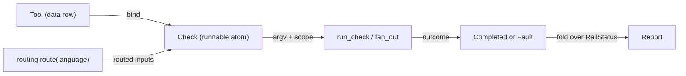

# [H1][ASSAY_ARCHITECTURE]
>**Dictum:** *Tools are data; one Engine runs them all; one rail folds a claim; one Envelope carries the result.*

<br>

`assay` is the polyglot quality operator for the Rasm monorepo. It routes every C#, Python, and TypeScript quality program through one process executor and emits exactly one JSON Envelope per invocation. The design separates the *executor* (launch, capture, scope, fold) from the *tool* (which program, which arguments, which language): a tool is a data row, the Engine is a single polymorphic surface, and programs are integrated algorithmically in a catalog rather than as per-binary modules.

| [DOC] | [ROLE] |
| ----- | ------ |
| `README.md` | Agent-only operator: Envelope contract, rails, concurrency, quality migration |
| `AGENTS.md` | Delta-only edit guide: load order, tripwires, validation |
| `.design/TYPE_SYSTEM.md` | msgspec / pydantic boundary, enum and shape law |
| `.design/AOT.md` | Aspect stack order and seam map (`beartype`, `structlog`, OTel, `stamina`) |

---
## [1][PROBLEM_AND_GOALS]
>**Dictum:** *State the rot, the prohibition, and the target before the mechanism.*

<br>

The predecessor `tools/quality` works but accreted into a shape that resists growth. The defects below motivate every later decision.

| [INDEX] | [DEFECT]              | [EVIDENCE IN `tools/quality`]                                              |
| :-----: | --------------------- | ------------------------------------------------------------------------- |
|   [1]   | C#-only reach         | `dotnet` hardwired; Python and TypeScript gate in two unrouted `package.json` shell lines. |
|   [2]   | Shape sprawl          | Roughly 25 single-use `Literal` aliases, 14 report structs, three model systems. |
|   [3]   | Executor/tool fusion  | Per-binary argument builders invite one module per program.               |
|   [4]   | Projector ceremony    | `rail()` accepts eight callables; a payload ladder re-normalizes mixed return shapes. |
|   [5]   | Agent concurrency     | Shared `.artifacts/quality`, no polyglot fan-out, lease semantics only documented for quality paths — parallel agents collide without per-`run_id` isolation. |
|   [6]   | Agent I/O contract    | Stderr vs stdout, JSON-only consumption, help-without-Envelope seam live in quality README / `main.md`, not stated as a first-class architecture defect. |

These outcomes are prohibited in `assay` by construction.

| [INDEX] | [PROHIBITION]           | [REPLACED BY]                                            |
| :-----: | ----------------------- | ------------------------------------------------------- |
|   [1]   | Per-binary modules      | One `Tool` row per program in the catalog.              |
|   [2]   | Free `Literal` aliases  | Behavior-carrying enums on three axes.                  |
|   [3]   | Per-rail report structs | One `Report` plus a bounded `detail` union.             |
|   [4]   | Mixed model systems     | `pydantic-settings` for config, `msgspec` for the rest. |
|   [5]   | Status-string projectors| One `RailStatus` algebra self-describes status and exit. |

The target state is unification with a dense footprint: one class per concept, growth that lands only in data.

| [INDEX] | [GOAL]            | [GUARANTEE]                                                              |
| :-----: | ----------------- | ----------------------------------------------------------------------- |
|   [1]   | Unified shapes    | Five evidence structs plus one bounded `detail` union cross any rail.    |
|   [2]   | One Engine        | A single executor runs every program in every language.                 |
|   [3]   | One Envelope      | Exactly one JSON Envelope reaches stdout per invocation.                 |
|   [4]   | Unified rails     | One registry table drives both the CLI tree and routing.                |
|   [5]   | Minimal extension | A program is one row; a language is one enum member; a rail is one row.  |
|   [6]   | Dense footprint   | One class per concept; new strings land only in enums or catalog rows.  |

[CRITICAL] The `package.json` `check:py` and `check:ts` lines retire once the `static` and `test` rails reach parity; `assay` becomes the sole entrypoint for all three languages.

---
## [2][SYSTEM_OVERVIEW]
>**Dictum:** *Quality is one operator across three languages, not three scripts and eighteen modules.*

<br>

The CLI accepts an argv, selects `Tool` rows for the requested claim and language, routes inputs by language, runs the rows through one Engine, and folds the outcomes into one Envelope. The driven programs — `dotnet`, `ruff`, `ty`, `mypy`, `pytest`, `ast-grep`, `tsc`, `biome`, `knip`, `sherif`, `vitest`, `dotnet-stryker`, `ilspycmd`, `yak`, `mmdc`, and the `tools.py_analyzer` LibCST gate — are catalog rows, not modules. The `cs-analyzer` Roslyn pass runs inside the `dotnet` build row.

```mermaid
---
config:
  layout: elk
  look: neo
  theme: base
  themeVariables:
    background: "#282a36"
    primaryColor: "#44475a"
    primaryTextColor: "#f8f8f2"
    primaryBorderColor: "#8be9fd"
    lineColor: "#8be9fd"
    clusterBkg: "#21222c"
    clusterBorder: "#6272a4"
---
flowchart LR
  accTitle: Assay orchestration boundary
  accDescr: The assay CLI routes changed files, selects Tool rows from the catalog, and runs them through one Engine into one Envelope.

  agent["Agent / CI"] -->|"argv"| cli["assay CLI"]
  cli -->|"claim, verb"| registry["registry<br/>claim x verb -> handler"]
  registry -->|"language"| routing["routing<br/>git + fd + graph"]
  registry -->|"claim, language"| catalog["catalog<br/>Tool rows as data"]
  routing -->|"routed inputs"| engine["one Engine<br/>run / stream / lease"]
  catalog -->|"Tool rows"| engine
  engine -->|"Completed or Fault"| report["Report<br/>status + counts + detail"]
  report -->|"report"| envelope["one Envelope<br/>stdout JSON"]

  classDef root fill:#44475a,stroke:#8be9fd,color:#f8f8f2
  classDef data fill:#282a36,stroke:#f1fa8c,color:#f8f8f2
  class cli,registry,engine,envelope root
  class routing,catalog,report data
```



---
## [3][ABSTRACTION_MODEL]
>**Dictum:** *Vary behavior by data on three orthogonal axes, never by adding code paths.*

<br>

Three concepts stay separate and compose in one direction.

| [INDEX] | [CONCEPT] | [KIND]       | [RESPONSIBILITY]                                                           |
| :-----: | --------- | ------------ | ------------------------------------------------------------------------- |
|   [1]   | `Tool`    | Data row     | Declares a program: runner, command, input placement, language, claim, `Mode`, optional `Parser` callable. |
|   [2]   | `Engine`  | One executor | Module `run_check` / `fan_out` — folds any `Check` into `Completed` or `Fault`; owns launch, capture, stream, timeout, leases. |
|   [3]   | `Rail`    | A fold       | Selects rows for one claim, routes inputs, runs them through the Engine, folds outcomes into one `Report`. |

A program differs from another along three orthogonal axes, each a behavior-carrying `StrEnum`, never a module.

| [INDEX] | [AXIS]   | [ENUM]     | [PAYLOAD VIA `__new__`]                                    | [MEMBERS]                                  |
| :-----: | -------- | ---------- | --------------------------------------------------------- | ------------------------------------------ |
|   [1]   | Launch   | `Runner`   | Argv prefix tuple such as `("uv","run")` or `("dotnet",)`. | `DIRECT`, `MODULE`, `UV`, `DOTNET`, `PNPM`. |
|   [2]   | Input    | `Input`    | Placement of routed paths: append, `--include`, project, solution. | `FILES`, `INCLUDE`, `PROJECT`, `SOLUTION`, `GLOB`, `NONE`. |
|   [3]   | Language | `Language` | `strategy` (`closure`/`glob`) and suffixes routing resolves. | `CSHARP`, `PYTHON`, `TYPESCRIPT`, `DOCS`.  |
|   [4]   | Operation| `Mode`     | Operation kind plus `stream` and `writes` payloads.          | `CHECK`, `WRITE`, `BUILD`, `RUN`, …        |

Because the axes are data, the program set is a table, not a tree of files. `ruff` is `Tool(name="ruff", runner=UV, command=("ruff","check"), input=FILES, language=PYTHON, claim=STATIC)`; `dotnet format` write twin sets `mode=Mode.WRITE`. One dense row each.



Two rejected alternatives clarify the choice. One module per program would be eighteen near-identical argument builders whose only true variance is the three-axis data plus, for a few, a parser; encoding variance as data yields one Engine and one catalog instead. Three language folders would re-fragment the polymorphic surface; a `Language` is one field and one routing arm, so a `ruff` row and a `tsc` row share the same table and Engine.

---
## [4][SHAPE_DISCIPLINE]
>**Dictum:** *Collapse parallel shapes into one polymorphic surface before adding entrypoints.*

<br>

`assay` defines five canonical evidence shapes. Supporting infrastructure (`Completed`, `Fault`, `Envelope`, the `Detail` tagged base) is fixed and never multiplied per rail.

| [INDEX] | [SHAPE]    | [ROLE]                                                                              |
| :-----: | ---------- | ---------------------------------------------------------------------------------- |
|   [1]   | `Tool`     | A declarative program row: runner, command, input, language, claim, mutation flag, mode, optional parser. |
|   [2]   | `Check`    | A `Tool` bound to concrete argv and scope; the runnable atom the Engine executes.   |
|   [3]   | `Report`   | One payload: status, counts, artifacts, results, notes, and a tagged `detail`.      |
|   [4]   | `Artifact` | One produced file: id, kind, path, bytes, lines.                                    |
|   [5]   | `Match`    | One ranked result row: id, kind, text, line, score.                                |

Algorithm-specific evidence lives only in `Report.detail`, a `msgspec` tagged union keyed by `kind`; one decode dispatches it. The collapse retires the following duplication.

| [INDEX] | [RETIRED]                                                                                              | [CANONICAL]                                       |
| :-----: | ----------------------------------------------------------------------------------------------------- | ------------------------------------------------ |
|   [1]   | `RailStatus`, `ApiStatus`, `StaticOutcome`, raw `status: str` fields                                   | `RailStatus`                                     |
|   [2]   | `StaticPlanReport`, `TestRunReport`, `TestListReport`, `Package*Report`, `Api*Report`, `VerifyReport`  | `Report` plus `detail` union                     |
|   [3]   | `artifact_paths: dict[str, str]` bags                                                                  | `tuple[Artifact, ...]`                           |
|   [4]   | `results`, `tests`, `sources`, `ApiMatch`                                                              | `tuple[Match, ...]`                              |
|   [5]   | `DotnetInvocation`, `dotnet`, `dotnet_args`, per-binary builders                                       | `Tool` rows plus `Engine`                        |
|   [6]   | `FormatMode`, `ProjectMode`, `RouteNeed`, `StaticMode`, `ProcessMode`, `DotnetOp`, and peers           | `Runner`, `Input`, `Language`, `Claim`, `Mode` enums |

---
## [5][TYPE_SYSTEM]
>**Dictum:** *One holistic stack: enums, msgspec, and pydantic compose; they never overlap.*

<br>

The type system is a single stack in which each layer feeds the next. `msgspec` owns every non-config shape; `pydantic-settings` owns only env config; the two never model the same value. The load-bearing move is reuse of one `StrEnum` instance across three subsystems unchanged.

| [INDEX] | [LAYER]        | [CONSTRUCT]                                          | [STACKS WITH]                                                  |
| :-----: | -------------- | --------------------------------------------------- | ------------------------------------------------------------- |
|   [1]   | Vocabulary     | `StrEnum` with `__new__` payloads                   | One member serves the Cyclopts parameter, the wire value, and the match key. |
|   [2]   | Shape          | `msgspec.Struct(frozen)` with `Annotated[..,Meta]`  | `Tool`, `Report`, `Check`; field constraints visible to `ty`. |
|   [3]   | Polymorphism   | Tagged union (`tag_field="kind"`, explicit short `tag=`) with `forbid_unknown_fields` | `Report.detail` decodes in one pass and rejects drift loudly (`.design/TYPE_SYSTEM.md` §3). |
|   [4]   | Irregular      | `msgspec.defstruct` and `convert` with `dec_hook`   | Data-derived one-off detail; no hand-written one-off type.    |
|   [5]   | Config         | `pydantic-settings` with `Annotated[..,Field]` and `computed_field` | `AssaySettings`; bounds and derived paths validated at load.  |
|   [6]   | Generics, refs | PEP 695 `type` and generics; PEP 649/749 deferred annotations | `Result[T, Fault]`; self-referential `Report`/`Detail` unions resolve unquoted. |
|   [7]   | Callables      | `Parser = Callable[[Completed], Detail \| None]`    | Row-attached decoder by reference; no `Engine`/`Parser` Protocol. |

`RailStatus` is the lone status algebra; per-member `exit_code` and `from_returncode` remove every status-string projector. Path properties collapse into one `artifact(kind, *parts)` derivation, retiring the `_QUALITY`, `_ARTIFACTS`, `_DOTNET_CLI`, and `_MARKER` constants. The single sanctioned escape hatch is `defstruct`: an irregular evidence shape is generated from catalog metadata, preserving the rule that new evidence is data rather than a new type.

---
## [6][EXTENSIBILITY]
>**Dictum:** *Growth lands in a data row or one decorator; a new capability is never a rewrite.*

<br>

Every axis of growth costs a bounded delta, with no new shape, no new status type, and no Engine change.

| [INDEX] | [GROWTH]       | [DELTA]                                                 | [TOUCHES]                                                       |
| :-----: | -------------- | ------------------------------------------------------ | ------------------------------------------------------------- |
|   [1]   | Add a program  | One `Tool` row.                                        | `composition/catalog.py`                                      |
|   [2]   | Add a language | One `Language` member, one routing arm, program rows.  | `core/model.py`, `core/routing.py`, `composition/catalog.py` |
|   [3]   | Add a rail     | One registry row and one handler returning a `Report`. | `composition/registry.py`, `rails/<name>.py`                 |
|   [4]   | Add evidence   | One `detail` tag, or one `defstruct` row for one-offs. | `core/model.py`                                              |

A cross-cutting library lands as one composable decorator in `core/aspect.py`, applied at two seams only: `run_check` / `fan_out` in `core/engine.py` and the rail runner in `composition/registry.py` (`.design/AOT.md`). A user-facing mode is one registry row; a resource or filesystem capability enriches the owning primitive. None of these touch a `Tool` row.

| [INDEX] | [CAPABILITY]       | [LIBRARY]       | [SEAM]                                               | [GATE] |
| :-----: | ------------------ | --------------- | --------------------------------------------------- | :----: |
|   [1]   | Typecheck boundary | `beartype`      | `@checked` decorator in `core/aspect.py`.           | v1 |
|   [2]   | Structured logs    | `structlog`     | `@logged` on rail runner; stderr only.              | v1 |
|   [3]   | Distributed trace  | `opentelemetry` | `@traced` span per `Check`.                       | v1 |
|   [4]   | Retry transients   | `stamina`       | `@retried` on `run_check` only.                   | v1 |
|   [5]   | Watch mode         | `watchfiles`    | One `watch` registry row looping the runner.        | future |
|   [6]   | Resource metrics   | `psutil`        | `Completed` receipt enrichment in `core/engine.py`. | future |
|   [7]   | Filesystem reach   | `fsspec`        | Optional `Source` behind `route()`.                 | future |

A new rail is as cheap as a new program: the rail runner takes one uniform contract, a handler returns a `Report`, and the `Report` self-describes its status, exit code, and notes. The six standing rails follow the same shape.

| [INDEX] | [RAIL]    | [CLAIM]                              | [LANGUAGES]      | [SHAPE]                          |
| :-----: | --------- | ----------------------------------- | ---------------- | ------------------------------- |
|   [1]   | `static`  | Format, lint, build, analyze.       | C#, Python, TS.  | Thin fold over catalog rows.    |
|   [2]   | `test`    | Unit, coverage, mutation.           | C#, Python, TS.  | Thin fold over catalog rows.    |
|   [3]   | `bridge`  | Live RhinoWIP runtime verification. | C#.              | `VerifySummary` detail.         |
|   [4]   | `package` | Yak stage, deploy, publish.         | C#.              | `PackageRun` detail.            |
|   [5]   | `api`     | Host and NuGet API metadata.        | C#.              | `ApiSurface` detail.            |
|   [6]   | `docs`    | Markdown and Mermaid validation.    | Docs.            | Thin fold over catalog rows.    |

[IMPORTANT] Keep rails orthogonal: `static` never tests, `test` never opens Rhino, and routing stays the only language-specific code.

---
## [7][DEPENDENCIES]
>**Dictum:** *Approved manifests are the implementation surface; engines are processes, not libraries.*

<br>

No new runtime dependency is required; `requires-python` is `>=3.14`. The collapse exploits capacity already declared in `pyproject.toml`.

| [INDEX] | [LIBRARY]           | [ROLE]                                            |
| :-----: | ------------------- | ------------------------------------------------- |
|   [1]   | `msgspec`           | Tool rows, Report encode and decode, tagged `detail`. |
|   [2]   | `pydantic-settings` | `AssaySettings`; validation at load.              |
|   [3]   | `expression`        | `Result` and `Option` rails over `Fault`.         |
|   [4]   | `anyio`             | Process exec, stream collection, task groups.     |
|   [5]   | `cyclopts`          | CLI tree derived from the registry.               |
|   [6]   | `beartype`          | Runtime boundary shape checks.                    |
|   [7]   | `structlog`         | Diagnostics to stderr only.                       |

| [INDEX] | [LIBRARY]                          | [UNDERUSED LEVER ADOPTED]                                |
| :-----: | ---------------------------------- | -------------------------------------------------------- |
|   [1]   | `opentelemetry-*` (sdk, otlp http) | One span per `Check`; the rail tree as a trace.          |
|   [2]   | `anyio` task groups                | Fan out independent read-only checks across languages.   |
|   [3]   | `stamina`                          | Retry flaky engine spawns and restore probes.            |
|   [4]   | `hypothesis`, `inline-snapshot`    | Property and snapshot laws over the catalog projection.  |

[IMPORTANT] **Future-only** until a concrete registry consumer and `pyproject.toml` entry exist: `watchfiles`, `psutil`, `fsspec` (§6 capability table). Do not import them in v1 spine modules.

| [INDEX] | [LANGUAGE] | [ORCHESTRATED PROGRAMS]                                                |
| :-----: | ---------- | --------------------------------------------------------------------- |
|   [1]   | C#         | `dotnet` hosting cs-analyzer, `dotnet-stryker`, `ilspycmd`, `yak`, bridge client. |
|   [2]   | Python     | `ruff`, `ty`, `mypy`, `pytest`, `validate-pyproject`, `ast-grep`, `tools.py_analyzer`. |
|   [3]   | TypeScript | `tsc`, `biome`, `knip`, `sherif`, `vitest`, `ast-grep`.               |
|   [4]   | Docs       | `mmdc` Mermaid validation.                                            |

---
## [8][FILE_PURPOSES_AND_WIRING]
>**Dictum:** *Each file owns one seam; the data flow crosses them in one direction.*

<br>

Only `tools/assay/__init__.py` exists as a package marker; `core/`, `composition/`, and `rails/` are PEP 420 namespace packages, matching `tools/quality`. The dependency order is acyclic: `core` then `composition` config and data then `rails` then `composition` registry then `__main__`. Module names state the concept they own; folders name layers. No module carries an `_` prefix, because the package is internal to the `python -m` entrypoint and privacy is expressed within modules, not on filenames.

| [INDEX] | [FILE]                                       | [PURPOSE]                                                                                  |
| :-----: | -------------------------------------------- | ----------------------------------------------------------------------------------------- |
|   [1]   | `__main__.py`                                | Build the Cyclopts tree from the registry; parse argv; print one Envelope; return its exit code. |
|   [2]   | `composition/registry.py`                    | Composition root: the claim-by-verb handler table and the one rail runner that opens scope, spans the trace, and wraps the Envelope. |
|   [3]   | `composition/settings.py`                    | `AssaySettings`; one `artifact(kind, *parts)` derivation; Rhino, yak, and target config validated at load. |
|   [4]   | `composition/catalog.py`                     | The `Tool` rows as data plus `select(claim, language)`; the only place a program is added. |
|   [5]   | `core/status.py`                             | `RailStatus`: the outcome algebra with `exit_code` payloads, aliases, and `from_returncode`. |
|   [6]   | `core/model.py`                              | The axis enums and every struct: `Tool`, `Check`, `Completed`, `Fault`, `Report`, `Artifact`, `Match`, `Detail`, `Envelope`. |
|   [7]   | `core/engine.py`                             | Module executor: `run_check`, `fan_out`, capture/stream, timeout, non-blocking exclusive leases. |
|   [8]   | `core/routing.py`                            | Routing: git change-set, `fd` discovery, project-graph closure; the one language-specific surface, keyed by `Language`. |
|   [9]   | `core/aspect.py`                             | Composable cross-cutting decorators (`@checked`, `@traced`, `@retried`, `@logged`) for the engine and runner seams. |
|  [10]   | `rails/static.py`, `test.py`, `docs.py`      | Thin folds: select rows, route inputs, bind checks, run, fold to one `Report`. |
|  [11]   | `rails/bridge.py`, `package.py`, `api.py`    | C#-only owners producing bespoke `detail` over the same Engine and leases. |

The data flow runs one direction: argv enters `__main__`; the `registry` runner opens an `ArtifactScope` and a span; the rail handler calls `routing.route(language, paths)` and `catalog.select(claim, language)`; binding a `Tool` to inputs yields a `Check`; `run_check` / `fan_out` returns `Result[Completed, Fault]`; the fold produces a `Report`; `_emit` writes one `Envelope` to stdout; `__main__` returns `resolve_returncode(envelope)`.

---
## [9][CROSS_CUTTING_CONCERNS]
>**Dictum:** *Isolation, routing, and observability attach as aspects, not inline in rails.*

<br>

**Agent-only I/O:** Consumers parse exactly one JSON `Envelope` from stdout per verb (`README.md`). Cyclopts `--help` may exit `0` without an Envelope; all proof verbs go through `_emit`. Child process stdout/stderr and structlog events never interleave into stdout. Agents must not scrape stderr for pass/fail.<br>
**Aspects:** `beartype`, `structlog`, `opentelemetry`, and `stamina` attach as composable decorators in `core/aspect.py` at two seams only. Stack order (outer→inner): rail `checked ▷ logged ▷ traced`; engine `checked ▷ traced ▷ retried` — **no** `@retried` on the rail, **no** `@logged` on `run_check` (`.design/AOT.md`). Rails carry no inline cross-cutting calls. No `Engine`/`Parser` `Protocol` — module functions and `Parser` type alias only.<br>
**Concurrency:** Each run opens an artifact scope under `.artifacts/assay/<claim>/<run_id>/` with an isolated `DOTNET_CLI_HOME`; closure builds also use `.artifacts/assay/build/<closure>/`; read-only checks fan out under `anyio` task groups; exclusive resources take non-blocking leases that fail fast to `busy` at exit code 5.<br>
**Language routing:** The C# path resolves owning-project closures from the `.csproj` graph; Python and TypeScript resolve file globs from the git change-set. This asymmetry lives in `core/routing.py` keyed by `Language` and stays out of catalog rows, which remain uniform.<br>
**Error handling:** Every `Check` returns `Result[Completed, Fault]`; faults fold into the Envelope `error` field, never raised across the rail boundary.<br>
**Observability:** `structlog` writes diagnostics to stderr only; one OpenTelemetry span wraps each `Check`, and the rail is the parent trace. Stdout carries exactly one Envelope.

---
## [10][CODEMAP]
>**Dictum:** *Three layered packages plus a data catalog; no per-binary tree.*

<br>

```
tools/assay/
├── __init__.py            # package marker; structlog AOT configure
├── __main__.py            # Cyclopts tree from the registry; prints one Envelope
├── README.md              # agent-only operator contract
├── AGENTS.md              # delta-only edit guide
├── ARCHITECTURE.md        # design: abstraction, shapes, invariants
├── IMPLEMENTATION.md      # build order, file contracts, verification
├── .design/
│   ├── TYPE_SYSTEM.md     # msgspec / pydantic / enum law
│   └── AOT.md             # aspect stack and seams
├── core/                  # primitives, no app wiring
│   ├── status.py          # RailStatus algebra
│   ├── model.py           # axis enums plus Tool, Check, Completed, Fault, Report, Artifact, Match, Detail, Envelope
│   ├── engine.py          # the Engine: run/stream plus exclusive leases
│   ├── routing.py         # git/fd/project-graph routing, keyed by Language
│   └── aspect.py          # cross-cutting decorators: checked, traced, retried, logged
├── composition/           # configuration, data, and wiring
│   ├── settings.py        # AssaySettings plus artifact(kind, *parts) derivation
│   ├── catalog.py         # Tool rows as data plus select(claim, language)
│   └── registry.py        # claim x verb handler table plus the one rail runner
└── rails/                 # one claim owner per module
    ├── static.py, test.py, docs.py    # thin folds over catalog rows
    └── bridge.py, package.py, api.py  # C#-only owners with bespoke detail
```

---
## [11][INVARIANTS]
>**Dictum:** *Testable properties hold regardless of rail or language.*

<br>

1. Every verb writes exactly one Envelope to stdout; all engine bytes and diagnostics go to stderr.
2. `RailStatus` is the only status type; a non-zero exit code originates solely from a `RailStatus` member.
3. Adding a program adds one `Tool` row and nothing else; adding a language adds one `Language` member, one routing arm, and rows, with no rail signature change and no new module.
4. No shape outside the five canonical models and fixed infrastructure crosses a rail boundary; violation breaks the single-decode contract.
5. Exactly one process executor and one CLI entrypoint exist; no per-binary module exists.
6. `Report.detail` decodes with `forbid_unknown_fields`, so a drifting emitter fails loudly rather than dropping a field silently.
7. Routing is the only language-specific code; `Tool` rows stay uniform across languages.
8. Read-only rails run concurrently under distinct `run_id`; exclusive rails fail fast on a held lease rather than block.
