```mermaid
---
config:
  layout: elk
  look: neo
  theme: base
  elk:
    mergeEdges: false
    nodePlacementStrategy: BRANDES_KOEPF
    cycleBreakingStrategy: GREEDY_MODEL_ORDER
---
flowchart LR
  accTitle: Assay orchestration boundary
  accDescr: CLI commands and automation fires enter rail or program execution, rail handlers select tools and route inputs into Check rows, the engine returns Completed receipts or Faults, and emit writes Report or error Envelopes to stdout.

  cli["CLI argv"] --> registry["REGISTRY\nBind rows"]
  registry --> rail["rail(bind)\nsettings + scope"]
  auto["Automation fire"] --> drive["drive(Action)\nlimiter/coalesce"]
  drive -->|"Rail"| rail
  drive -->|"Program / Sequence"| engine

  rail --> plan["rail-local plan\nselect TOOLS + route inputs"]
  plan --> checks["Check rows\nargv | INPROC"]
  checks --> engine["Engine\nrun_check / fan_out"]

  engine -->|"Completed"| fold["fold -> Report"]
  engine -->|"Fault"| diag["_distill -> Diagnostic"]
  fold --> emit["_emit\nEnvelope.report"]
  diag --> emitError["_emit\nEnvelope.error"]
  emit --> stdout["stdout\none JSON line"]
  emitError --> stdout
  drive -.-> ndjson["automation: NDJSON\nper fire / leaf"]

  rail -.-> railAspect["rail seam\nchecked -> logged -> traced"]
  engine -.-> engineAspect["engine seam\nretry + deadline + transport"]
```

# [ASSAY_OPERATOR]

`tools.assay` is the Rasm polyglot quality-operator implementation for C#, Python, TypeScript, Bash, SQL, docs, bridge, package, and API proof. Assay is the replacement quality surface, not a compatibility wrapper.

## [1][STATUS]

[STATUS]:
- Status: active replacement operator.
- Use: repository quality, API, bridge, package, static, test, code, docs, and automation validation.
- Machine contract: normal CLI invocations emit one JSON `Envelope` on stdout; diagnostics ride stderr.
- Automation: programmatic arm through `drive(trigger, action, settings)`; no registered root `watch` CLI.
- Compatibility: no stale command aliases or shim surfaces.

## [2][FIRST_COMMAND]

```bash copy-safe
uv run python -m tools.assay self-test
```

Verify: stdout contains one JSON `Envelope`; `status`/`exit_code` are the only process-result source; stderr may contain structlog events or tool diagnostics. Use `--rhino` only when the local Rhino bridge lane is intentionally part of the smoke.

## [3][FLOW]



Text equivalent: CLI argv resolves through `REGISTRY` into a `Bind`; the rail owns settings, scope, routing, check construction, engine dispatch, and fold. The engine runs `Check` rows and returns either `Completed` receipts for a `Report` or a `Fault` for an error `Envelope`. Automation uses the same engine and registry rails but emits NDJSON per fire or sequence leaf.

## [4][COMMANDS]

Command rows are the curated operator surface, not generated help. Run nested commands as `uv run python -m tools.assay <family> <verb> ...`; root commands omit `<family>`. Exhaustive parameter signatures stay in source and Cyclopts help.

This table is a lookup by command surface and verb set:

| [INDEX] | [SURFACE] | [VERBS]                                                         |
| :-----: | :-------- | :-------------------------------------------------------------- |
|   [1]   | root      | `self-test`, `delta`                                            |
|   [2]   | `static`  | `fix`, `report`, `build`, `full`, `plan`                        |
|   [3]   | `code`    | `search`, `rewrite`, `query`                                    |
|   [4]   | `test`    | `run`, `list`, `coverage`                                       |
|   [5]   | `bridge`  | `verify`, `doctor`, `launch`, `quit`, `check`, `clean`, `build` |
|   [6]   | `package` | `stage`, `deploy`, `publish`, `list`, `plan`                    |
|   [7]   | `api`     | `doctor`, `resolve`, `query`, `show`                            |
|   [8]   | `docs`    | `check`                                                         |

[ROOT_COMMANDS]:
- Verbs: `self-test`, `delta`
- Inputs: `self-test` accepts `--rhino`; `delta` accepts `<run_id>` and `--against <run_id>`.
- Output: `Envelope.report`; `delta` carries `RunDelta` detail.
- Use: `self-test` runs composition/catalog census; `--rhino` opts into bridge-aware smoke. `delta` compares retained history under `.artifacts/assay/history`.
- Example: `uv run python -m tools.assay delta <run_id> --against <run_id>`

[STATIC_COMMANDS]:
- Verbs: `fix`, `report`, `build`, `full`, `plan`
- Inputs: `[paths...]`, `--language`
- Output: shared `Report`; `plan` emits route/build-scope artifacts.
- Use: `fix` mutates under lease; `report` diagnoses; `build` compiles the routed restore/build closure; `full` runs the build-shaped closure for Debug and Release.
- Example: `uv run python -m tools.assay static plan --language csharp libs/csharp/Rasm`

[CODE_COMMANDS]:
- Verbs: `search`, `rewrite`, `query`
- Inputs: `[paths...]`, `--language`, `--pattern`, `--rewrite`, `--apply`, `--max-results`
- Output: `Match` rows and rail artifacts.
- Use: literal search uses ripgrep; metavars use ast-grep; `query` uses in-process tree-sitter; `rewrite --apply` mutates under lease.
- Example: `uv run python -m tools.assay code search --pattern run_check --language python tools/assay`

[TEST_COMMANDS]:
- Verbs: `run`, `list`, `coverage`
- Inputs: `[paths...]`, `--language`, `--mutation`, `--benchmark`, `--coverage`
- Source-exposed params: `--target`, `--all`, `--filter`, `--limit`, `--grep`
- Output: `TestRun` detail, or `Match` rows for `list`.
- Use: mutation is `off`, `changed`, or `full`; `target` and `all` constrain mutation eligibility, while `filter` narrows .NET list/run invocations. `list` emits direct test identity rows and keeps discovery diagnostics separate.
- Example: `uv run python -m tools.assay test run --language csharp tests/csharp`

[BRIDGE_COMMANDS]:
- Verbs: `verify`, `doctor`, `launch`, `quit`, `check`, `clean`, `build`
- Inputs: `--pattern`
- Output: `VerifySummary` detail where applicable.
- Use: `verify` discovers direct file, directory, then worktree glob; no matched scenario returns `unsupported`.
- Example: `uv run python -m tools.assay bridge verify --pattern tests/csharp/libs/Rasm.Rhino`

[PACKAGE_COMMANDS]:
- Verbs: `stage`, `deploy`, `publish`, `list`, `plan`
- Inputs: `--slug`, `--version`
- Output: `PackageRun` detail.
- Use: slug and version are flags, not positionals; stage/deploy/publish are Yak/Rhino-package operations.
- Example: `uv run python -m tools.assay package plan --slug <yak-slug> --version <version>`

[API_COMMANDS]:
- Verbs: `doctor`, `resolve`, `query`, `show`
- Inputs: `--key`, `--symbol`, `--kind`, `--token`, `--max-lines`, `--lines`, `--grep`, `--full`, `--strict`
- Output: `ApiSurface` or `ApiResolution` detail.
- Use: sources include host assemblies, NuGet packages, Python distributions, and TypeScript declarations; `show latest` resolves through artifact-store root priority rather than a workspace scan.
- Example: `uv run python -m tools.assay api query --key rhino-common --symbol Rhino.Geometry.Mesh`

[DOCS_COMMANDS]:
- Verbs: `check`
- Inputs: `[paths...]`, `--strict`
- Output: shared `Report`
- Use: Mermaid render validation through `mmdc`; not full Markdown standards, links, or anchor validation.
- Example: `uv run python -m tools.assay docs check tools/assay/README.md`

## [5][OUTPUT_CONTRACT]

Assay output is machine-first. The stable consumer rule is simple: parse stdout for results, use stderr for diagnosis, and treat the process exit as a projection of the emitted status.

[WIRE_INVARIANT]:
- Normal invocation: exactly one JSON `Envelope` line on stdout.
- Automation exception: NDJSON, one `Envelope` per fire or sequence leaf.
- Failure split: `Completed(FAILED)` means a tool ran and found defects; `Fault` means assay could not run or complete the operation.
- Schema route: full field-by-field schema lives in `core/model.py`; full status algebra lives in `core/status.py`.

[STDOUT]:
- Carries: one JSON `Envelope` per normal CLI invocation.
- Consumer rule: decode this for status, exit, report, artifacts, results, detail, and diagnostics.
- Do not parse: stderr for result data.

[STDERR]:
- Carries: structlog events, subprocess stderr, and operator diagnostics.
- Consumer rule: read for human diagnosis.
- Do not parse: stderr as the machine result channel.

[AUTOMATION_STDOUT]:
- Carries: NDJSON, one `Envelope` per fire or sequence leaf.
- Consumer rule: consume line-by-line.
- Do not expect: one aggregate sequence envelope.

[PROCESS_EXIT]:
- Carries: `Envelope.exit_code` through the Cyclopts return-code hook.
- Consumer rule: treat exit as a projection of `RailStatus`.
- Do not model: a separate process-status system.

[STATUS_MODEL]:
- Status tokens: `skip`, `empty`, `ok`, `unsupported`, `busy`, `timeout`, `failed`, `faulted`.
- Completed channel: process success, skip, empty, unsupported, or tool-found defects.
- Fault channel: operational failure under `Envelope.error` with diagnostic context.
- Strictness: flags such as `--strict` can promote otherwise non-error states into a fault for that invocation.

[PAYLOAD_MAP]:
- Report detail: rail-specific evidence under `report.detail`.
- Rows: bounded row output under `report.results`.
- Artifacts: durable files under `report.artifacts`.
- Truncation: inline lists may set `truncated=true`; envelope-level caps attach a full-report artifact before clipping rows.
- Result locations are the Assay contract; older tool payload shapes do not define this operator.

## [6][INTEGRATIONS]

Integrations are grouped by the reader action they change. They are capability notes, not a dependency catalog.

[DOTNET]:
- Enables: C# restore, build, test, API, bridge, and package rails.
- Boundary: catalog rows own invocations.

[PYTHON_TOOLS]:
- Enables: Ruff, ty, mypy, pytest, coverage, mutmut, and py-analyzer proof.
- Boundary: selected by claim and language rows.

[TYPESCRIPT_TOOLS]:
- Enables: `tsc`, Biome, Knip, Sherif, Vitest, and ast-grep proof.
- Boundary: selected by claim and language rows.

[BASH_SQL_TOOLS]:
- Enables: ShellCheck, shfmt, sqlfluff, and squawk proof.
- Boundary: selected by static rows.

[MERMAID_CLI]:
- Enables: `docs check` render validation on Markdown inputs.
- Boundary: `mmdc` only; no generic Markdown validation.

[RHINO_BRIDGE_YAK]:
- Enables: live scenario verification and package stage, deploy, or publish.
- Boundary: exclusive bridge/package resources use leases.

[API_EXTRACTION]:
- Enables: host assembly, NuGet, Python distribution, and TypeScript declaration lookup.
- Boundary: `api resolve`, `api query`, and `api show` expose the operator surface.

[TREE_SITTER]:
- Enables: in-process `code query` for Python and TypeScript AST shapes.
- Boundary: grammar-backed query, not text search.

[PSUTIL]:
- Enables: resource snapshots, fan-out sizing, stale lease liveness, and the automation CPU governor.
- Boundary: operator resilience, not user telemetry.

[OPENTELEMETRY]:
- Enables: optional spans when an OTLP endpoint is configured.
- Boundary: no endpoint means no-op tracing; CLI exit drains by force-flush then provider shutdown after envelope dispatch.

[FSSPEC_UPATH]:
- Enables: artifact-store shape and local file default.
- Boundary: most CLI operation still assumes local or shared paths.

[ASYNCSSH]:
- Enables: remote process execution through `ASSAY_EXEC_TARGET=ssh://...`.
- Boundary: moves command execution only; routing, artifacts, and locks still need local or shared paths.

[RUNTIME_MODELS]:
- Load-bearing libraries: `msgspec` owns wire structs, `pydantic-settings` owns `ASSAY_*` settings, `cyclopts` owns CLI binding, `anyio` owns concurrency, `expression` owns `Result` folding, `stamina` owns engine retry, and `beartype`/`structlog`/OpenTelemetry own cross-cutting aspects.
- Boundary: runtime model libraries are not command surfaces.

## [7][AUTOMATION]

Automation is a programmatic arm, not a root CLI command. `drive(trigger, action, settings)` hosts fires under one AnyIO loop and writes NDJSON output.

[TRIGGER]:
- Cases: `Watch`, `Schedule`, `Manual`.
- Effect: starts fires from filesystem changes, cron ticks, or immediate invocation.

[ACTION]:
- Cases: `Rail`, `Program`, `Sequence`, `Debounce`.
- Effect: runs a registry rail, direct argv program, ordered action leaves, or coalesced action.

[AUTOMATION_BEHAVIOR]:
- `Rail` actions dispatch through `REGISTRY`; registry rails emit their normal `Envelope`.
- `Program` actions run direct argv through the engine and emit thinner synthetic envelopes.
- `Sequence` emits each leaf and stops on `failed`, `busy`, `timeout`, or `faulted`; it does not emit one aggregate envelope.
- A per-drive limiter serializes action leaf execution so slow fires do not re-enter.
- `cpu_threshold` is fractional: `0.8` means 80 percent.
- Debounce can be trailing-edge collapse or leading-edge drain; schedule coalescing is separate from debounce.

## [8][ARTIFACTS_OBSERVABILITY_REMOTE]

Artifacts, logs, tracing, and remote execution are operator surfaces. They do not imply that every rail persists every byte or that Assay is a cloud-native workspace.

[ARTIFACT_ROOT]:
- Default local root: `.artifacts/assay`.
- Owner: `ArtifactStore` owns read, write, list, find, show, cache, history, and full-report artifact behavior.
- Rail policy: individual rails decide which full outputs become artifacts; local tool outputs are copied into the store before becoming report artifacts.
- Inspect rule: read `report.artifacts` before assuming a file exists.

[HISTORY]:
- Persistence: registry invocations persist compact envelope JSON and full report artifacts by `run_id`; `delta` reloads full report artifacts when compact history was clipped.
- Thinner envelopes: parse faults and automation program envelopes are thinner than normal rail history.
- Use: retained history for comparisons, not as a substitute for rerunning the rail.

[RUN_SCOPES]:
- Layout: per-run scopes live under the claim/run id; stable build scopes exist for build-like closures.
- Trust rule: emitted artifact paths over inferred directory shapes.

[LOGS]:
- Sink: structlog writes stderr; stdout remains the machine contract.
- Role: stderr is diagnostic context only.

[TRACING]:
- Gate: OTel is endpoint-gated through environment configuration.
- Absent endpoint: no tracing export.

[ENVIRONMENT]:
- README-worthy vars: `ASSAY_RUN_ID`, `ASSAY_AGENT_TASK_ID`, `ASSAY_ARTIFACT_RETENTION`, `ASSAY_ARTIFACT_BACKEND__PROTOCOL`, `ASSAY_ARTIFACT_BACKEND__ROOT`, `ASSAY_EXEC_TARGET`, and `ASSAY_EXEC_KNOWN_HOSTS`.
- Use: correlation, retention, and execution target control only where settings expose the behavior.

[REMOTE_EXECUTION]:
- Target: `ASSAY_EXEC_TARGET=ssh://...` runs processes over SSH.
- Local/shared requirement: routing, locks, package staging, bridge discovery, API discovery, and many artifacts still need local or shared paths.

[FSSPEC_STORE]:
- Shape: `ArtifactStore` is fsspec-shaped.
- Default: normal CLI use is local file storage.
