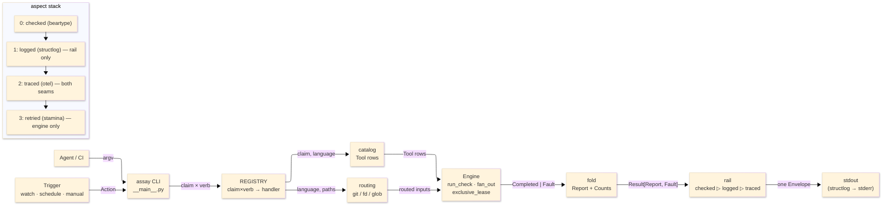

# [H1][ASSAY_OPERATOR]

`tools.assay` is the Rasm polyglot quality operator. Every quality verb emits **one JSON `Envelope` to stdout**; structlog rides stderr. It supersedes `tools/quality` and the `package.json` quality scripts, routing C#, Python, TypeScript, Bash, and SQL through one Engine.

```bash
uv run python -m tools.assay._TMP <claim> <verb> [args]         # one Envelope on stdout
uv run python -m tools.assay._TMP watch <paths> --on <action>   # NDJSON stream (automation arm)
```

The tool lives under `_TMP/` (not yet promoted). Use the Python module entrypoint only.

---
## [1][ARCHITECTURE]



**Core invariants:**
1. Every quality verb writes exactly one `Envelope` to stdout; `_emit` is the sole stdout writer.
2. `Envelope.exit_code == status.exit_code` always — single source.
3. Non-zero process exit → `Completed(FAILED)`, never `Fault`. `Fault` rides `Envelope.error` only.
4. Adding a program is one `Tool` row; adding a language is one member + one routing arm.
5. `Report.detail` decodes with explicit short tags + `forbid_unknown_fields`; shape drift fails loud.
6. `routing.place` is the sole argv-tail projector; routing is the only language-specific code.
7. Read-only checks fan out under `CapacityLimiter`; exclusive resources fail fast (psutil-verified).
8. Cross-cutting exists only as aspect layers at two seams — no inline structlog/otel/stamina anywhere else.

---
## [2][ENVELOPE_CONTRACT]

Every invocation writes exactly one JSON `Envelope` line to `stdout.buffer`. The schema version always emits (`omit_defaults=False` on `Envelope` only).

| [FIELD] | [TYPE] | [SEMANTICS] |
| ------- | ------ | ----------- |
| `schema_version` | `int` | Always `1`; always present. |
| `claim` | `Claim` | `static\|test\|bridge\|package\|api\|docs` |
| `verb` | `str` | The selected verb within the claim. |
| `status` | `RailStatus` | Wire token; see status table below. |
| `exit_code` | `int` | `== status.exit_code` always. |
| `run_id` | `str` | `%Y-%m-%dT%H-%M-%S.%f-{pid}`; `ASSAY_RUN_ID` overrides for CI correlation. |
| `duration_ms` | `float` | Wall time of the invocation in milliseconds. |
| `report` | `Report \| None` | `{claim, verb, status, counts, artifacts, results, notes, detail}`; `None` on a Fault. |
| `error` | `Fault \| None` | `{argv, status=FAULTED, message}` — no `returncode`, no `detail`, no `stderr`. |
| `error_context` | `Diagnostic \| None` | Auto-diagnosis on Fault: `{failing_step, recent_events, elapsed_ms, hint}`; absent on success. |
| `truncated` | `bool` | `True` when `report.results` > 1000 or `report.artifacts` > 100; full output stays in the run dir. |
| `notes` | `tuple[str, ...]` | Operator notes (owners, closure plan, argv). |

`report.counts` is `Counts(ok, failed, total)` derived in the fold only — never on a `Detail`.
`report.detail` is a tagged union keyed by `kind` with `forbid_unknown_fields`; a drifting emitter fails loud.
`report.artifacts` is `tuple[Artifact, ...]` with `{id, kind: ArtifactKind, path, bytes, lines}`.
`report.results` is `tuple[Match, ...]` with `{id, kind: ArtifactKind, text, line, score, severity, confidence}`.

---
## [3][RAILSTATUS_ALGEBRA]

`RailStatus` is the only status type. Fold = `reduce(join, statuses, EMPTY)`, `join` = max-by-severity.
`faulted`/`busy`/`timeout` ride the `Result` Error channel and never enter the success-channel fold.

| [STATUS] | [EXIT] | [SEV] | [CHANNEL] | [MEANING] |
| -------- | :----: | :---: | --------- | --------- |
| `skip` | 0 | 0 | Completed | Per-check opt-out (alias `"skipped"`). |
| `empty` | 0 | 1 | Completed | Ran clean / nothing relevant changed; fold seed. |
| `ok` | 0 | 2 | Completed | Evidence affirmed — only a parser sets this explicitly. |
| `unsupported` | 3 | 3 | Completed | Valid precondition, no applicable path (e.g. `verify` matched no scenario). |
| `busy` | 5 | 4 | Fault | Exclusive resource held — retry elsewhere, never wait. |
| `timeout` | 5 | 5 | Fault | Deadline exceeded (`anyio.fail_after` / rc 124). |
| `failed` | 1 | 6 | Completed | A check ran and found defects. |
| `faulted` | 2 | 7 | Fault | Operational failure — assay could not run the check. |

`from_returncode`: `0→empty`, `5→busy`, `124→timeout`, else `failed`.
`--strict` on `api`/`docs` promotes `empty`/`skip` to a `faulted` Fault — a flag, not a new member.

---
## [4][CLAIM_VERB_MAP]

Complete `REGISTRY` claim → verb map. Every `tools/quality` verb and every `package.json` script step maps here; nothing is dropped.

| [CLAIM] | [VERB] | [HELP] |
| ------- | ------ | ------ |
| `static` | `fix` | Format, style, analyzer autofix. |
| `static` | `report` | Non-mutating diagnostics. |
| `static` | `build` | Closure-leased restore + build + analyzers. |
| `static` | `full` | Workspace.slnx parity; Debug+Release. |
| `static` | `plan` | Owners, triggers, closure into notes. |
| `test` | `run` | Unit + coverage + mutation fold. |
| `test` | `list` | Bounded discovery JSON. |
| `test` | `coverage` | Coverlet json + cobertura. |
| `bridge` | `verify` | Live RhinoWIP scenario fold. |
| `bridge` | `doctor` | Bridge host health. |
| `bridge` | `launch` | Start RhinoWIP under lease. |
| `bridge` | `quit` | Clean Cocoa terminate. |
| `bridge` | `check` | Liveness probe. |
| `bridge` | `clean` | Clear crash markers + autosave. |
| `bridge` | `build` | Compile rasm-bridge plugin. |
| `package` | `stage` | Yak stage commit under lease. |
| `package` | `deploy` | Yak install to live host. |
| `package` | `publish` | Yak push to server. |
| `package` | `list` | Staged + published manifests. |
| `package` | `plan` | Stage plan into notes. |
| `api` | `doctor` | Host/NuGet/tool health; `--strict` → faulted. |
| `api` | `resolve` | Asset path resolution. |
| `api` | `query` | Polymorphic ilspy surface; fingerprint cache. |
| `api` | `show` | Artifact preview. |
| `docs` | `check` | Markdown + Mermaid validation. |
| (root) | `self-test` | Composition preflight census; failure → faulted/exit 2. |

Language coverage: `static`/`test`/`docs` are polyglot (C#, Python, TypeScript, Bash, SQL); `bridge`/`package`/`api` are C#-only bespoke folds.
`Detail` variants by claim: `bridge` → `VerifySummary`, `test` → `TestRun`, `package` → `PackageRun`, `api` → `ApiSurface`/`ApiResolution`, fault → `Diagnostic`.

---
## [5][CONCURRENCY_LEASE_ISOLATION]

Every run opens `ArtifactScope` under `.artifacts/assay/<claim>/<run_id>/` with isolated `DOTNET_CLI_HOME`.
Closure builds use a stable path `.artifacts/assay/build/<closure>/` (closure = `sha256(sorted-projects)[:16]`) for warm MSBuild reuse.

| [RESOURCE] | [LOCK PATH] | [PARALLELISM] |
| ---------- | ----------- | ------------- |
| MSBuild closure | `locks/build-<closure>.lock` | One winner per closure; distinct closures concurrent. |
| Stryker mutation | `locks/mutation.lock` | Global exclusive. |
| Live Rhino + verify | `locks/bridge.lock` | Global exclusive. |
| Yak stage commit | `locks/package-stage.lock` (per dir) | Per package dir. |
| Read-only tools | none | `fan_out` + distinct `run_id`, bounded by `CapacityLimiter(max_checks)`. |

Leases: `fcntl.flock(LOCK_EX|LOCK_NB)`, record `{resource/run_id/pid/create_time/cwd/started_at}`, truncate-on-release, **never block**.
A dead or recycled holder (`psutil.Process(pid).is_running()` fails or `create_time` mismatch > 1s) is stolen rather than stranded.
`@retried` (stamina) retries transient spawn faults only — never `busy` or `timeout`.

**Env isolation knobs:**
- `ASSAY_ROOT` — override the workspace root (default: anchored to `Workspace.slnx`; falls back to `cwd`).
- `ASSAY_EXEC_TARGET` — `""` = local (default); `ssh://[user@]host[:port]` = remote via asyncssh.
- `ASSAY_EXEC_KNOWN_HOSTS` — path to known_hosts for remote exec; `None` disables host checking.
- `ASSAY_RUN_ID` — override run_id for CI correlation.

`AssaySettings` never hard-fails on construction — a missing solution is a per-operation C# Fault, not an import crash.

---
## [6][STATUS_AND_NEXT_STEPS]

The tool lives in `_TMP/` (not yet promoted to the package root). The staged package is gate-green: `ruff check`, `ruff format --check`, `ty check`, `mypy --strict`, `py_compile` (all 18 modules), `import tools.assay._TMP.__main__`, and runtime-verified (`api doctor` + `static plan` each emit one Envelope with correct `exit_code`; structlog on stderr; the one-Envelope invariant holds).

**Phase-2 test harness** is built and green at `tests/tools/assay/`. Fixtures:
- `assay_root` — isolated `AssayHarness` with tmp-tree `AssaySettings`; all I/O roots under `<tmp>/.artifacts/assay`.
- `envelope` — decode the single stdout `Envelope`; asserts exactly one line.
- `rail_probe` — `RailProbe` socket-free mock: monkeypatch `run_check`/`fan_out` on the owner rail module to a canned `Completed` receipt.
- `ssh_loopback` — live asyncssh loopback server on a daemon thread; yields `SshLoopback.exec_target` for the remote-exec law.
- `ab_diff` — run a `_TMP` rail and the matching `tools.quality` rail in-process; decode both + the canonical `{rail↔claim, data↔report, evidence↔error_context}` field correspondence.
- `bridge_result` — write valid/malformed/partial/missing `_BridgeResult` JSON for the defensive bridge rail decode boundary.
- `yak_shape` — `YakShape` fake-yak + fake-msbuild materializer; port of `PackageShape` from the quality harness.

**Next session:** run the A/B matrix against `tools/quality`. After that, remaining work is general and unprescribed — holistic deepening/optimization + new claim arms as discovered through the workflow. There is no fixed list of Phase-3 items; new scope is researched, not assumed.
