# [ASSAY_OPERATOR]

`tools.assay` is the Rasm polyglot quality operator over the `static`, `code`, `test`, `bridge`, `package`, `api`, `docs`, and `provision` claims, validating C#, Python, TypeScript, Bash, SQL, and Markdown surfaces. Command surfaces, verbs, flags, and parameter signatures live in Cyclopts help (`uv run python -m tools.assay --help`, per-claim `--help`) and the `self-test` census.

## [01]-[SCOPE]

Normal CLI invocations emit one JSON `Envelope` on stdout; diagnostics ride stderr. The programmatic arm is `automation.engine.drive(trigger, action, settings, executor=...)`, which hosts `Watch`/`Schedule`/`Manual` fires under one AnyIO loop, writes NDJSON output, and spawns every check through the `Executor` port (the engine-bound port when absent).

- Invoke as `uv run python -m tools.assay <claim> [verb] ...`; bare `assay ...` is valid only when `command -v assay` proves a local wrapper exists. The language axis is the mutually-exclusive `--csharp`/`--python`/`--typescript` flags; an unset selection routes every eligible language.
- `static` diagnoses by default and mutates only under `--fix`; even then it never rewrites a C# target that does not compile, and its reported diagnostics match `dotnet build`.
- `api query` reports provable absence: a no-match reflects the current artifact, never a stale cache.
- The Python mutation lane is a staged gate scored against a kill-floor by `rails/mutation_gate.py`, which also emits a `mutation-testing-report-schema` JSON under `.artifacts/python/mutmut/`; mutmut runs copy-staged with `cwd=.artifacts/python/mutmut/work`, so a root `mutants/` directory is forbidden litter.
- `dotnet-ef` stays in the local tool manifest for a future Persistence design-time rail only; package health is SDK-first (`dotnet package list`, `dotnet nuget why`), and a `dotnet-outdated` fallback requires an explicit rail before the tool returns to the manifest.

## [02]-[FIRST_COMMAND]

```bash copy-safe
uv run python -m tools.assay self-test
```

Verify: stdout contains one JSON `Envelope`; `Envelope.status`/`exit_code` are the only process-result source; stderr carries structlog events and tool diagnostics. `--rhino` opts the local Rhino bridge lane into the smoke.

## [03]-[FLOW]

```mermaid
---
config:
  theme: base
  look: classic
  layout: elk
  flowchart:
    curve: linear
    padding: 25
  themeVariables:
    darkMode: true
    fontFamily: "SF Mono, Menlo, Cascadia Mono, Segoe UI Mono, Consolas, monospace"
    useGradient: false
    dropShadow: "none"
    background: "#282A36"
    primaryColor: "#44475A"
    primaryTextColor: "#F8F8F2"
    primaryBorderColor: "#BD93F9"
    lineColor: "#FF79C6"
    textColor: "#F8F8F2"
    edgeLabelBackground: "#21222C"
    labelBackgroundColor: "#21222C"
  themeCSS: ".nodeLabel{font-size:13px;font-weight:500}.edgeLabel{font-size:12px;font-weight:500}.cluster-label .nodeLabel{font-size:13.5px;font-weight:700;letter-spacing:.08em}.edge-thickness-normal{stroke-width:2px}.edge-thickness-thick{stroke-width:3px}.edge-pattern-dashed,.edge-pattern-dotted{stroke-width:1.5px;stroke-dasharray:4 6}.node rect,.node circle,.node polygon,.node path,.node .outer-path{stroke-width:1.5px;filter:none!important}.cluster rect{stroke-width:1px!important;stroke-dasharray:5 4!important;filter:none!important}.marker path{transform:scale(.8);transform-origin:5px 5px}.marker circle{transform:scale(.48);transform-origin:5px 5px}.edgeLabel rect{transform-box:fill-box;transform-origin:center;transform:scale(1.1,1.2)}"
---
flowchart LR
  accTitle: Assay orchestration boundary
  accDescr: CLI commands and automation fires enter rail or program execution, rail handlers select catalog tools and route inputs into Check rows, the Executor port returns Completed receipts or Faults, and emit writes Report or error Envelopes to stdout.

  cli["CLI argv"] --> registry["registry.py<br/>REGISTRY Bind rows"]
  registry --> rail["registry.rail(bind)<br/>settings + scope"]
  auto["Automation fire"] --> drive["automation.engine.drive<br/>limiter/coalesce"]
  drive -->|"Rail"| rail
  drive -->|"Program / Sequence"| executor

  rail --> plan["rail-local plan<br/>catalog.select TOOLS + routing"]
  plan --> checks["Check rows<br/>argv | INPROC"]
  checks --> executor["exec.py Executor<br/>run | fan"]

  executor received@-->|"Completed"| fold["diagnostics.fold -> Report"]
  executor -->|"Fault"| distill["registry._distill -> Diagnostic"]
  fold --> emit["registry._emit<br/>Envelope.report"]
  distill --> emitError["registry._emit<br/>Envelope.error"]
  emit --> stdout["stdout<br/>one JSON line"]
  emitError --> stdout
  drive -.-> ndjson["automation: NDJSON<br/>per fire / leaf"]

  rail -.-> railAspect["rail seam<br/>checked -> logged -> traced"]
  executor -.-> execAspect["exec seam<br/>retry + deadline + transport (remote.py)"]

  received@{ animate: true }
  linkStyle 9,11,13 stroke:#FF5555,stroke-width:3px,color:#F8F8F2
  classDef boundary fill:#282A36,stroke:#BD93F9,color:#F8F8F2
  classDef primary fill:#44475A,stroke:#FF79C6,color:#F8F8F2
  classDef error fill:#FF555580,stroke:#FF5555,color:#F8F8F2
  classDef annotation fill:#21222C,stroke:#6272A4,color:#F8F8F2
  class cli,auto,stdout,ndjson boundary
  class registry,rail,drive,plan,checks,executor,fold,emit primary
  class distill,emitError error
  class railAspect,execAspect annotation
```



Text equivalent: CLI argv resolves through `composition/registry.py` `REGISTRY` into a `Bind`; the rail owns settings, scope, routing (`core/routing.py`), check construction from `composition/catalog.py` rows, Executor dispatch, and fold. `core/exec.py` owns the `Executor` port (`run`/`fan`), argv composition from catalog templates, telemetry, and retry; `core/remote.py` owns the SSH transport; `core/govern.py` owns leases, dotnet slots, and fan scheduling. A `Completed` receipt folds through `diagnostics.fold` into a `Report`; a `Fault` distills into an error `Envelope`. Automation uses the same Executor and registry rails and emits NDJSON per fire or sequence leaf.

## [04]-[OUTPUT_CONTRACT]

Parse stdout for results, read stderr for diagnosis, and treat the process exit as a projection of `Envelope.status`.

[WIRE_INVARIANT]:
- Normal invocation: exactly one JSON `Envelope` line on stdout, newline-framed and flushed; a second emit on one invocation is suppressed to stderr as a FAULTED invariant-violation envelope.
- Automation exception: NDJSON, one `Envelope` per fire or sequence leaf; a `Sequence` stops on `failed`, `busy`, `timeout`, or `faulted` and emits no aggregate envelope.
- Failure split: `Completed(FAILED)` means a tool ran and found defects; non-zero tool exits stay on `Completed`. A `Fault` means routing, spawn, lease, timeout, or a precondition failed.
- Schema route: the field-by-field `Envelope` schema and the status algebra live in `core/model.py`.

[STATUS_MODEL]:
- Tokens and exit codes (`core/model.py`): `skip`/`empty`/`ok` -> 0, `failed` -> 1, `faulted` -> 2, `unsupported` -> 3, `busy`/`timeout` -> 5. Severity-ranked fold via `RailStatus.dominant`/`RailStatus.fold`.
- Completed channel: process success, skip, empty, unsupported, or tool-found defects. Fault channel: operational failure under `Envelope.error` with `Envelope.error_context` diagnostic.
- `--strict` promotes otherwise non-error states into a fault for that invocation.

[PAYLOAD_MAP]:
- Report detail: rail-specific evidence under `report.detail` (tagged `AnyDetail` union). Rows ride `report.results`; durable files ride `report.artifacts`.
- Remote facts: target URL, host, exit status, and pushed/pulled counts ride `report.exec` / `Envelope.exec` (`ExecReceipt`, threaded from `Completed.exec`), populated by `fold` and the emit layer.
- Truncation: when a result or artifact cap fires the emit layer sets `Envelope.truncated=true`, clips the rows, attaches the unclipped report as a full-report artifact, and appends one note to `report.notes` in the unified `results: {shown} of {total} (cap={cap}); full report artifact under {run_id}` shape. There is no stderr truncation side-channel.

## [05]-[ARTIFACTS_AND_HISTORY]

- Default local root: `.artifacts/assay`. `composition/store.py` `ArtifactStore` owns read, write, list, find, show, cache, zstd history, and full-report artifact behavior; read `report.artifacts` before assuming a file exists, and trust emitted artifact paths over inferred directory shapes.
- Per-run scopes live under the claim/run id. Opening an `ArtifactScope` computes its path without materializing the directory; `ArtifactScope.ensure()` routes the one `makedirs` through the store boundary. `ArtifactStore.retain_scopes(claim, keep)` prunes per-claim scope run-dirs oldest-first, bounded by `ASSAY_ARTIFACT_RETENTION` (default 50), mirroring history retention.
- Registry invocations persist compact envelope JSON and full report artifacts by `run_id`; `delta` reloads full report artifacts when compact history was clipped. Retained history serves comparisons, never a substitute for rerunning the rail.
- The store is fsspec-shaped: `UPath` routes the artifact root, and `storage_options`/`protocol=` resolution is load-bearing for the memory and object-store backends. The artifact store is the only fsspec-routed surface — routing, leases, package staging, and history require real local or shared paths.
- structlog writes stderr; stdout remains the machine contract. OTel tracing is endpoint-gated: no configured OTLP endpoint means no-op tracing; CLI exit drains by force-flush then provider shutdown after envelope dispatch.

## [06]-[ENVIRONMENT_AND_OFFLOAD]

[ENVIRONMENT]:
- Vars (`ASSAY_` prefix, `__` nested delimiter): `ASSAY_RUN_ID`, `ASSAY_AGENT_TASK_ID`, `ASSAY_ARTIFACT_RETENTION`, `ASSAY_ARTIFACT_BACKEND__PROTOCOL`, `ASSAY_ARTIFACT_BACKEND__ROOT`, `ASSAY_EXEC_TARGET`, `ASSAY_EXEC_KNOWN_HOSTS`, `ASSAY_SFTP_PUSH_CONCURRENCY`, `ASSAY_SFTP_MAX_REQUESTS`.
- They control correlation, retention, backend selection, execution target, and SFTP push throttle. `composition/settings.py` owns the `AssaySettings` + `Local`/`Ssh`/`Offload` value objects.

[REMOTE_EXECUTION]:
- Target switch: the `--exec` global flag selects offload; `--exec local` (default) keeps execution local, `--exec ssh://[user@]host[:port]` offloads process execution over SSH. The flag wins over its `ASSAY_EXEC_TARGET` env fallback. Scheme, host, and port validate at settings load, so a malformed target fails before any spawn; a missing port defaults to 22 at connect.
- Offload-capable lanes: heavy closures — the full `static` lane and `.NET` build graphs — run on the remote host and return the same one-`Envelope` result locally; mutation rides copy-staged tools, so it stays local under the host-bound reject. Remote facts ride the `ExecReceipt`; signalled kills synthesize exit 255 with an `ssh.signal=<name>` note. Remote runs carry no process-stall telemetry.
- Host-bound reject: `bridge`, `package`, and `provision` claims and copy-staged tools reject under `exec_target` as an `UNSUPPORTED` fault before argv composition.
- Working-tree push: before the remote exec, `core/remote.py` pushes the lane-scoped build closure to `<workroot>/<run_id>` over the pooled SFTP connection; `git ls-files` is the source universe and gitignored roots never cross. Push and pull each run under their own shielded budget while the bracketed exec stays cancellable by the check deadline. Build argv scope paths rebase from host-absolute to `<workroot>/<run_id>/...` before remote argv composition.
- Toolchain pre-flight: the exec probes the remote `PATH` for the runner's leading tool (`uv`, `dotnet`) under the injected fixed Linux toolchain prefix; an absent tool returns a typed `unsupported` receipt. The agent's local `PATH` never crosses.
- Artifact pull-back: `sftp` is the sole `TRANSFER` backend, derived from the SSH host and pinned under `<workroot>/<run_id>/.artifacts/assay`; a shielded post-exit download lands scope artifacts locally, degrading to a `remote.artifacts.degraded` note rather than reclassifying a completed run. A once-per-fan sweep prunes all but `artifact_retention` newest of this host's own remote run dirs.
- Cloud posture: `s3`, `gs`, and `gcs` are admitted `SHARED` backends — the remote tool writes and the agent reads the same universal object-store paths, so the pull transfers zero bytes.

[PROVISIONING_BOUNDARY]:
- The `provision` claim delegates to the Forge-owned `forge-provision`/`forge-scientific-env` executables on `PATH` and projects sanitized schema-v3 JSON into `ProvisionRun` evidence; assay pins no version, and a missing executable is a process fault.
- Assay-safe JSON carries redacted DSN metadata and safe topology facts, never raw passwords, password-bearing DSNs, raw logs, raw Compose, token values, or absolute Nix/store/provisioning paths; a sensitive payload is an adapter fault because the evidence contract itself failed. Docker/Compose generation, image choice, credential material, pruning, and Forge self-tests stay in Parametric_Forge.
