# [ASSAY_OPERATOR]

`tools.assay` is the Rasm polyglot quality operator over the `static`, `code`, `test`, `bridge`, `package`, `api`, `docs`, and `provision` claims, validating C#, Python, TypeScript, Bash, SQL, and Markdown surfaces.

## [00]-[KNOWN_ISSUES]

[API_TFM_RESOLUTION] — `api resolve`/`query` can decompile the wrong target framework for a multi-targeted package:
- `api resolve`/`query` select ONE `primary_assembly` per NuGet key but do NOT rank candidate `lib/<tfm>` folders against the workspace consumer TFM (`net10.0` from `Directory.Build.props`). For a multi-target package they can decompile a lower/fallback TFM whose PUBLIC surface differs from the asset the build actually binds.
- Observed: `RectpackSharp 1.2.0` resolved `lib/netstandard2.0` (`RectanglePacker.Pack(PackingRectangle[] …)`) while the `net10.0` consumer binds `lib/net5.0` (`RectanglePacker.Pack(Span<PackingRectangle> …)`) — a genuinely different public signature, not a formatting variant.
- IMPACT: a catalog or agent that trusts the default resolution documents a phantom or misses the real signature; `query`'s "provable absence" is provable only for the RESOLVED TFM, never proof for the CONSUMED one.
- WORKAROUND until hardened: when a package multi-targets, decompile the consumer-bound TFM explicitly and diff it against the resolved primary, trusting the consumer-TFM surface — `DOTNET_ROOT=$(dirname "$(readlink -f "$(command -v dotnet)")") ilspycmd <pkg>/lib/<consumer-tfm>/<asm>.dll -t <FQN>`.
- FIX DIRECTION: rank `lib/<tfm>` candidates by NuGet TFM-precedence against the workspace `TargetFramework` floor so `primary_assembly` is the bound asset; surface the chosen TFM on `ApiResolution`/`status` and emit a note whenever a non-bound fallback TFM is decompiled.

[PLANNED_DOTNET_EF]:
- `dotnet-ef` stays in the local tool manifest for a future Persistence design-time rail. That rail must prove migration metadata and generated SQL under Assay-owned artifacts, not act as general package health.
- Package health is SDK-first: use `dotnet package list --outdated|--deprecated|--vulnerable --format json` and `dotnet nuget why`. A `dotnet-outdated` fallback must be an explicit Assay rail before the tool returns to the manifest.

## [01]-[SCOPE]

Normal CLI invocations emit one JSON `Envelope` on stdout; diagnostics ride stderr. The programmatic arm is `drive(trigger, action, settings)`.

`static` never rewrites a C# target that does not compile, and its reported diagnostics match `dotnet build`.

`api query` reports provable absence: a no-match reflects the current artifact, never a stale cache.

The Python mutation lane is a staged `python -m` gate scored against an 0.80 kill-floor; it is not a CLI verb.

## [02]-[FIRST_COMMAND]

```bash copy-safe
uv run python -m tools.assay self-test
```

Verify: stdout contains one JSON `Envelope`; `Envelope.status`/`exit_code` are the only process-result source; stderr carries structlog events and tool diagnostics. `--rhino` opts the local Rhino bridge lane into the smoke.

## [03]-[FLOW]

```mermaid
---
config:
  layout: elk
  look: neo
  theme: base
  elk:
    mergeEdges: false
    nodePlacementStrategy: BRANDES_KOEPF
    cycleBreakingStrategy: GREEDY_MODEL_ORDER
---
flowchart LR
  accTitle: Assay orchestration boundary
  accDescr: CLI commands and automation fires enter rail or program execution, rail handlers select tools and route inputs into Check rows, the engine returns Completed receipts or Faults, and emit writes Report or error Envelopes to stdout.

  cli["CLI argv"] --> registry["REGISTRY\nBind rows"]
  registry --> rail["rail(bind)\nsettings + scope"]
  auto["Automation fire"] --> drive["drive(Action)\nlimiter/coalesce"]
  drive -->|"Rail"| rail
  drive -->|"Program / Sequence"| engine

  rail --> plan["rail-local plan\nselect TOOLS + route inputs"]
  plan --> checks["Check rows\nargv | INPROC"]
  checks --> engine["Engine\nrun_check / fan_out"]

  engine -->|"Completed"| fold["fold -> Report"]
  engine -->|"Fault"| diag["_distill -> Diagnostic"]
  fold --> emit["_emit\nEnvelope.report"]
  diag --> emitError["_emit\nEnvelope.error"]
  emit --> stdout["stdout\none JSON line"]
  emitError --> stdout
  drive -.-> ndjson["automation: NDJSON\nper fire / leaf"]

  rail -.-> railAspect["rail seam\nchecked -> logged -> traced"]
  engine -.-> engineAspect["engine seam\nretry + deadline + transport"]
```



Text equivalent: CLI argv resolves through `REGISTRY` into a `Bind`; the rail owns settings, scope, routing, check construction, engine dispatch, and fold. The engine runs `Check` rows and returns either a `Completed` receipt for a `Report` or a `Fault` for an error `Envelope`. Automation uses the same engine and registry rails and emits NDJSON per fire or sequence leaf.

## [04]-[COMMANDS]

Run nested commands as `uv run python -m tools.assay <claim> <verb> ...`; bare `assay <claim> <verb> ...` is only valid when `command -v assay` proves a local wrapper exists. Single-verb claims (`static`, `docs`) and root commands omit the verb token. Multi-verb claims (`code`, `test`, `bridge`, `package`, `api`, `provision`) are Cyclopts sub-apps. Exhaustive parameter signatures stay in source and Cyclopts help. The language axis is selected by the mutually-exclusive `--csharp`, `--python`, and `--typescript` flags; an unset selection routes every eligible language. There is no `--language` flag.

| [INDEX] | [SURFACE]   | [VERBS]                                                                                               |
| :-----: | :---------- | :---------------------------------------------------------------------------------------------------- |
|  [01]   | root        | `self-test`, `delta`                                                                                  |
|  [02]   | `static`    | _(leaf — value-driven targets, no sub-verbs)_                                                         |
|  [03]   | `code`      | `search`, `query`                                                                                     |
|  [04]   | `test`      | `run`, `list`, `coverage`                                                                             |
|  [05]   | `bridge`    | `build`, `verify`, `status`, `quit`                                                                   |
|  [06]   | `package`   | `publish`, `plan`, `list`                                                                             |
|  [07]   | `api`       | `resolve`, `query`, `show`, `status`                                                                  |
|  [08]   | `docs`      | `check`                                                                                               |
|  [09]   | `provision` | `up`, `down`, `status`, `doctor`, `ports`, `inventory`, `extensions`, `plan`, `env`, `check`, `apply` |

[ROOT_COMMANDS]:
- Verbs: `self-test`, `delta` (registered outside the claim fold).
- Inputs: `self-test` accepts `--rhino`; `delta` takes positional `<run_id>` and `--against <run_id>`.
- Output: `Envelope.report`; `delta` carries `RunDelta` detail with `drift` rows `(host-fact key, before, after)` for changed cross-session host facts (`rhinoVersion`, `mcp.platform.version`, `mcp.listener`, `rpc.streamjsonrpc`) when both sides are bridge runs.
- `self-test` runs the composition/catalog census; `--rhino` opts into bridge-aware smoke. `delta` compares retained history under `.artifacts/assay/history`; host-fact drift rows populate only when both compared runs are bridge runs, so non-bridge pairs report empty `drift`.
- Example: `uv run python -m tools.assay delta <run_id> --against <run_id>`

[STATIC_COMMANDS]:
- Verb: `static` is a single root leaf — no `check`/`build`/`fix` split.
- Inputs: `--all`, `--project <project.csproj>`, `--folder <path>...`, `--file <path>...`, or no target (changed-files default); `--plan` is an orthogonal modifier. Choosing more than one of `--all`, `--project`, or folder/file targets is an `unsupported` parse fault.
- `--all` fans every detected language at full scope (whole-workspace Python, TypeScript, Bash, plus the C# solution build).
- `--project <path.csproj>` pins one C# project; a non-`.csproj` or missing path is `unsupported`.
- `--plan` is a dry-run that emits planned argv per phase in `StaticRun.detail`, spawns no tool, and leaves the git tree clean.
- Target binding: each flag consumes space-separated values until the next option and is repeatable. Commas are literal path characters.
- Output: shared `Report`; `StaticRun` detail carries targets, routes, planned argv triples, skipped rows, phase order, resource projection, `sarif_status`, and artifact scopes.
- For every language the resolved targets touch, `static` runs the full lane in fixed order — FIX (`Mode.WRITE` formatters and fixers) -> DIAGNOSTIC (`Mode.CHECK` analyzers) -> RESTORE -> BUILD. The C# FIX phase is gated on an analyzer-free compile probe (`-p:RunAnalyzers=false`, throwaway scope): a non-compiling target drops both its WRITE fix and CHECK twin, so neither rewrites unbuildable source. C# closure builds run under an exclusive build lease over restored output; RESTORE failure forces BUILD checks to SKIP. dotnet build tools pin `-p:CspSarifDir=...` and `-maxCpuCount:`; SARIF folds into the report, so the reported set matches `dotnet build`.
- Example: `uv run python -m tools.assay static --folder tools/assay tests/python --file tools/assay/rails/static.py`
- Project example: `uv run python -m tools.assay static --project tools/rhino-bridge/Supervisor/Supervisor.csproj`

[CODE_COMMANDS]:
- Verbs: `search`, `query`
- Inputs: leading positional or `--pattern <p>` (blank = parse fault), trailing `[paths...]` (default `.`), `--csharp`, `--python`, `--typescript`, `--max-results <n>` (default 1000).
- Output: ranked `Match` rows capped by `--max-results` plus a complete `matches.txt` artifact listing; a cap note fires when rows are cut. The emit layer applies an independent defect-preserving 1000-row ceiling, so `--max-results` above 1000 still clips at emit.
- `search <pattern>`: a `$NAME` metavar pattern routes to ast-grep structural search; every other pattern routes to ripgrep content search.
- `query <pattern>`: in-process tree-sitter query over grammar-backed Python and TypeScript files (`.tsx` uses the tsx grammar). Capture rows carry name, ordinal, pattern, and line; parse and query errors surface as `failed`-severity rows; match-limit saturation marks rows truncated.
- Routing: use LSP for single declared-symbol navigation and post-edit diagnostics; `code search`/`code query` own `$NAME` metavar, predicate-filtered captures, and structural search; `api` owns external compiled-artifact decompile.
- Example: `uv run python -m tools.assay code search --pattern run_check --python tools/assay`

[TEST_COMMANDS]:
- Verbs: `run`, `coverage`, `list`
- Inputs: `[paths...]`, `--csharp` / `--python` / `--typescript` (mutually exclusive), `--target <path.csproj>`, `--all`, `--mutation <off|changed|full>` (default `off`), `--benchmark`, `--coverage`, `--filter <expr>`, `--limit <n>`, `--grep <s>`.
- Output: `TestRun` detail; `Match` roster rows for `list`.
- `run` runs eligible suites (`Mode.RUN`) and folds a `TestRun`. `coverage` re-runs under coverage (forces `coverage=True, benchmark=False`), decodes `totals.percent_covered` from `.artifacts/python/coverage/coverage.json`, and adopts the coverage json/xml/lcov artifacts. `list` discovers tests (`Mode.LIST`) via dotnet list-test and pytest collect, emits `roster.txt`/`roster.json`, and honors `--grep`/`--limit`.
- A runner with no eligible work reports `empty`, never `failed`: each runner row carries its nothing-to-do `empty_signature` — pytest exit 5, vitest exit 1 with `No test files found` — so an unflagged polyglot `run`/`coverage` stays green while a language branch holds zero tests. `dotnet test` keeps `--minimum-expected-tests 1`: a managed test project discovering zero tests is a defect, not an empty scope.
- C# `--all` selects every solution-admitted managed test project. Host-bound C# projects surface as typed unsupported/degraded test evidence; live Rhino/GH2 proof belongs to `bridge verify`. `<AssayTestShell>` projects classify into the SHELL lane and are excluded from every test scoping arm (`--all`, `--target`, changed closure); their scenario content ships through the bridge closure.
- `--mutation changed` scopes via Stryker `--mutate <glob>` and mutmut module-dotted names; runners with no changed-file scope surface `unsupported`, and `--mutation` with no eligible lane notes the gap. mutmut gets a lease-riding `mutmut-gate` kill-rate floor. Per-language mutation runs hold sorted exclusive `mutation-<lang>` leases.
- `--filter` is the MTP discriminant for dotnet RUN/LIST: leading `/` = query, `k=v` = trait, `Tests`/`Laws`/`Spec` suffix or `+` = class, else method. `--limit` caps roster rows; `--grep` substring-filters the discovered roster.
- Example: `uv run python -m tools.assay test run --csharp tests/csharp`

[BRIDGE_COMMANDS]:
- Verbs: `build`, `verify`, `status`, `quit` — all arity 0 except `verify`, all serialized through the process-global `bridge` exclusive lease (the live Rhino host is a per-machine singleton).
- Inputs: `verify [pattern]` (positional, arity 1).
- Output: `VerifySummary` for `verify`; `BridgeLifecycle` for `status`/`quit`; a build report for `build`.
- `build` compiles supervisor, shell, stub, cargo, contract, and typed scenario closures sequentially (RESTORE/build gated, first-error short-circuit) and folds `bridge.firstDiagnostic` plus SARIF artifacts. `verify` builds the closures, aggregates `bridge-closure.assay.json`, then runs typed scenarios under the live host lease; it first expires report dirs older than 300s (`_VERIFY_TTL_S`). `status` probes bridge host health; `quit` terminates the host under the lease.
- `verify` pattern selection is pass-through: empty / `all` / `*` = every scenario; comma-separated bare tokens select themes; dotted tokens select scenario names; the in-host shell owns name/glob resolution and its typed zero-match fault. An empty scenario corpus (no `*.cs` under `tests/csharp/scenarios/`) short-circuits to a typed `unsupported` receipt without building or launching Rhino. Scenario timeout is 600s.
- `verify` and `status` carry `detail.freshness` (`fresh` / `stale` / `absent` / `unknown`): the installed Yak plugin against the shell source. It is decoupled data, never a rail fault — a stale install still passes (the supervisor tolerates it and scenarios load fresh cargo), so a gated pipeline reads `detail.freshness` to decide escalation. A non-`fresh` state also rides a remediation note.
- Example: `uv run python -m tools.assay bridge verify blocks`

[PACKAGE_COMMANDS]:
- Verbs: `publish`, `plan`, `list`
- Inputs: `--slug <s>`, `--version <v>` (both flags, no positionals). `publish` requires both non-empty (an empty slug identifies a non-yak project; an empty version reaches the staged build as `-p:Version=` and breaks `GetAssemblyVersion` with MSB4044, so both reject at the boundary). `plan` requires `--slug` and is version-agnostic; `list` is slug-agnostic.
- Output: `PackageRun` detail (stage/package dir, project, pattern, version, dirs, platform, push source).
- `publish` runs the full yak pipeline under an exclusive `package-<slug>` lease: evaluate and validate MSBuild yak metadata, build with `-p:Version=<version>`, stage (host assemblies excluded), `yak build`, atomic same-filesystem commit, then policy-driven post-stage steps — non-bridge slug = INSTALL+PUSH; the `rasm-bridge` slug = QUIT, INSTALL, REFRESH, PUSH under the `bridge` lease. `plan` evaluates and validates yak metadata only with no staging. `list` rosters every package project as `Match` rows `id=slug, text=project`.
- Example: `uv run python -m tools.assay package plan --slug <yak-slug> --version <version>`

[API_COMMANDS]:
- Verbs: `resolve`, `query`, `show`, `status`
- Inputs: `--key` (default `rhino-common`), `--symbol`, `--kind` (default `all`), `--token`, `--max-lines <n>` (default 120), `--lines <start:end>`, `--grep`, `--full`, `--strict`, `--sources <prefix...>`. Positional slots alias the flags: `resolve <key> [kind]`, `query <symbol>`, `show <token>`.
- Output: `ApiResolution` for `resolve`, `ApiSurface` for `query`, `ApiSource` for `status`; ranked candidate previews ride `results`, full path or body lists ride a `<kind>.paths.txt` / `decompile.cs` artifact only when the cap saturates.
- Resolution precedence: host bundle (ASSEMBLY) > NuGet (`Directory.Packages.props`) > installed Python dist (PYDIST) > node_modules `.d.ts` (TSDECL); first hit wins. C#/NuGet decompile through `ilspycmd`; Python/TS through in-process thunks.
- `query <symbol>` dispatches on symbol shape (index roster, namespace roster, or `ilspycmd -t <fqn>` type/member decompile) and windows output to `--max-lines` unless `--full`. `resolve <key> [kind]` resolves a key to asset paths; `--kind` in `{all, assembly, xml, nuspec, deps, package-root}` (unknown = `unsupported`). `show <token>` previews a written artifact (`latest` selects newest), sliceable by `--lines`/`--grep`/`--max-lines`/`--full`. `status` inventories source health, narrowable by `--sources`; `--strict` faults when required core sources (`rhino-app`, `ilspycmd`, host specs) are absent.
- `query` results are content-fingerprint cached and self-invalidating: a truncated or corrupt cache fails `_cache_valid` and rebuilds, so a no-match reflects the current artifact rather than a stale hit.
- Row text: each `status` inventory `Match.text` is the fixed-order, single-space health grammar `<source_id> status=<status> assembly=present|missing xml=present|missing version=<version|->`. Envelope rows compact to ASSEMBLY, NuGet, and TOOL source kinds plus the `python-dists` and `ts-decls` summary rows; per-distribution PYDIST and TSDECL rows never ride the envelope and read from the full `status-inventory.json` artifact instead.
- Example: `uv run python -m tools.assay api query --key rhino-common --symbol Rhino.Geometry.Mesh`

[DOCS_COMMANDS]:
- Verb: `check`
- Inputs: `[paths...]`, `--strict` (promotes EMPTY/SKIP to a `FaultedPromotion`; real defects keep their status).
- Output: shared `Report` with one `mmdc <file>: ok|failed` PROCESS `Match` per routed file and `Artifact` rows for the produced `<stem>.md` and `<stem>-<n>.svg` under the per-run scope.
- `check` validates Mermaid diagrams across routed Markdown files through `mmdc`, one invocation per file as `-i <file> -a <scope_dir> -o <scope_dir>/<stem>.md`. The sink stem is the full relative path joined by `__`, so two same-basename files never clobber a shared sink. Files land under `.artifacts/assay/docs/<run_id>/`.
- Example: `uv run python -m tools.assay docs tools/assay/README.md`

[PROVISION_COMMANDS]:
- Verbs: `up`, `down`, `status`, `doctor`, `ports`, `inventory`, `extensions`, `plan`, `env`, `check`, `apply` — all arity 0, delegating to the Forge-owned `forge-provision` CLI.
- Inputs: none.
- Output: shared `Report` with `ProvisionRun` detail from Forge schema-v3 JSON. The rail validates explicit `schemaVersion`, command match, boolean `ok`, structured `error` on `ok:false`, sensitive-key/value absence, and absolute-local-path absence before projection; `ok:false` is a completed failed `ProvisionRun`, while missing JSON, malformed JSON, schema mismatch, command mismatch, timeout, spawn failure, and redaction breach are Assay faults. Provisioning raw stdout/stderr artifacts are not persisted.
- Evidence fields: `warnings`, `local_service_topology`, `service_roles`, `port_policy`, `provision_scope`, `resource_counts`, `doctor`, `extension_catalog`, `extension_metadata`, `extension_requirements`, `extensions`, `tool_surfaces`, `tool_summary`, `plan_summary`, and `local_probe_values`. `provision_scope` carries `rootKey`, `projectKey`, `instance`, and `composeProject`. `extensions` returns catalog rows with `riskClass`, `sourcePackage`, `preloadRequired`, and `createPolicy`; additive metadata projects sanitized scalar provenance and policy fields such as `sourceRoute`, `nixStatus`, `probeKind`, `capabilityRank`, `externalAccess`, `restartClass`, `serviceProfile`, and `loadPolicy`. `extension_requirements` preserves safety flags for rows that require superuser, shared preload, file access, network access, or background workers. `check` returns observed extension states without creation; `apply` is the explicit mutating extension-creation verb.
- `up` starts the enabled Forge services (`forge-provision --json up`, 300s) and lets Forge run its internal apply path. `down` stops owned services and preserves volumes. `status`, `doctor`, `ports`, `inventory`, `extensions`, `plan`, and `env` consume sanitized Forge JSON; Assay `plan` is a safe plan projection, not raw Compose YAML. `doctor` projects safe Docker policy, endpoint kind, Compose/server versions, credential-helper presence, lock state, Colima state, and listener-probe method. `check` runs `forge-provision --json check` and `forge-provision --json tools` (180s) plus local `forge-scientific-env` Python ABI, OpenBLAS, and ONNX Runtime presence probes. Successful local probe values pass the same sensitive-value rejection used for Forge JSON before they enter `ProvisionRun`; failed probe streams are reduced to bounded probe names. The ONNX Runtime probe reports `forge-onnxruntime-lib` as presence plus version/fingerprint or library basename only; it never emits `ONNXRUNTIME_LIB` or an absolute Nix/store path.
- Boundary: Docker/Compose generation, image choice, credential material, port policy, native exports, direct database shells, pruning, diagnostic JSON, and Forge self-tests stay in Parametric_Forge. Rasm owns this envelope surface and the manifest markers, lockfiles, `.api` catalogues, and evidence that consume it.
- Example: `uv run python -m tools.assay provision check`

## [05]-[OUTPUT_CONTRACT]

Parse stdout for results, read stderr for diagnosis, and treat the process exit as a projection of `Envelope.status`.

[WIRE_INVARIANT]:
- Normal invocation: exactly one JSON `Envelope` line on stdout, newline-framed and flushed; a second emit on one invocation is suppressed to stderr as a FAULTED invariant-violation envelope.
- Automation exception: NDJSON, one `Envelope` per fire or sequence leaf.
- Failure split: `Completed(FAILED)` means a tool ran and found defects; non-zero tool exits stay on `Completed`. A `Fault` means routing, spawn, lease, timeout, or a precondition failed.
- Schema route: the field-by-field `Envelope` schema and the status algebra live in `core/model.py`.

[STDOUT]:
- Carries one JSON `Envelope` per normal CLI invocation.
- Decode it for `status`, `exit_code`, `report`, `artifacts`, `results`, `detail`, and diagnostics.

[STDERR]:
- Carries structlog events, structured phase/process/resource progress records, subprocess stderr, and operator diagnostics.
- Read it for operational progress and human diagnosis only; it is never the machine result channel.

[AUTOMATION_STDOUT]:
- Carries NDJSON, one `Envelope` per fire or sequence leaf; consume it line-by-line. A sequence emits no aggregate envelope.

[PROCESS_EXIT]:
- Carries `Envelope.exit_code` through the Cyclopts return-code hook; treat it as a projection of `RailStatus`.

[STATUS_MODEL]:
- Tokens and exit codes (`core/model.py`): `skip`/`empty`/`ok` -> 0, `failed` -> 1, `faulted` -> 2, `unsupported` -> 3, `busy`/`timeout` -> 5. Severity-ranked fold via `RailStatus.dominant`/`RailStatus.fold`.
- Completed channel: process success, skip, empty, unsupported, or tool-found defects.
- Fault channel: operational failure under `Envelope.error` with `Envelope.error_context` diagnostic.
- `--strict` promotes otherwise non-error states into a fault for that invocation.

[PAYLOAD_MAP]:
- Report detail: rail-specific evidence under `report.detail` (tagged `AnyDetail` union).
- Rows: bounded row output under `report.results`.
- Artifacts: durable files under `report.artifacts`.
- Remote facts: target URL, host, exit status, and pushed/pulled counts ride `report.exec` / `Envelope.exec` (`ExecReceipt`, threaded from `Completed.exec`), populated by `fold` and the emit layer — not by the `envelope()` constructor.
- Truncation: when a result or artifact cap fires the emit layer sets `Envelope.truncated=true`, clips the rows, attaches the unclipped report as a full-report artifact, and appends one note to `report.notes` in the unified `results: {shown} of {total} (cap={cap}); full report artifact under {run_id}` shape. There is no stderr truncation side-channel.

## [06]-[INTEGRATIONS]

[DOTNET]:
- Enables: C# restore, build, test, API, bridge, and package rails.
- Boundary: catalog rows own invocations.

[PYTHON_TOOLS]:
- Enables: Ruff, ty, mypy, pytest, coverage, mutmut, and py-analyzer proof.
- Boundary: selected by claim and language rows.
- Mutation lane: the staged rail posture is the only Python mutation runner. mutmut runs with `cwd=.artifacts/python/mutmut/work` (a copy-staged worktree); a root `mutants/` directory is forbidden by the litter-law policy. `--max-children` is spliced from `mutation_max_cpu` to bind mutmut's second-tier fork fan, and `COVERAGE_RCFILE` (=`.config/coverage-mutmut.ini`) is carried as a row-owned `Tool.env` entry so the covered-lines flip does not abort. The `changed` lane maps changed `.py` files to module-dotted mutant-name globs (`tools.assay.rails.docs.*`), never file paths, because mutmut filters by mutant name.

[TYPESCRIPT_TOOLS]:
- Enables: `tsc`, Biome, Vitest, and ast-grep proof.
- Boundary: selected by claim and language rows.

[BASH_SQL_TOOLS]:
- Enables: ShellCheck, shfmt, sqlfluff, and squawk proof.
- Boundary: selected by static rows.

[MERMAID_CLI]:
- Enables: `docs check` render validation on Markdown inputs.
- Boundary: `mmdc` only; no generic Markdown validation. One `mmdc` invocation per routed file carries its own input placement (`-i <file> -a <scope_dir> -o <scope_dir>/<stem>.md`); the `__`-joined relative-path stem keeps concurrent fan-out writes collision-free.

[RHINO_BRIDGE_YAK]:
- Enables: live scenario verification and package publish.
- Boundary: exclusive bridge/package resources use leases.

[API_EXTRACTION]:
- Enables: host assembly, NuGet, Python distribution, and TypeScript declaration lookup.
- Boundary: `api resolve`, `api query`, and `api show` expose the operator surface.

[PROVISIONING]:
- Enables: tier-2 server and native runtime closure proofs through sanitized Assay evidence projected from the Forge-owned `forge-provision` and `forge-scientific-env` executables.
- Requires: `forge-provision` and `forge-scientific-env` on `PATH`; Parametric_Forge owns both executables and their version, so assay pins no version and a missing executable surfaces as a process fault rather than an assay defect.
- Surface: `uv run python -m tools.assay provision up|down|status|doctor|ports|inventory|extensions|plan|env|check|apply` is the Rasm campaign command surface; bare `assay provision ...` is not the contract unless `command -v assay` proves a repo-local wrapper. Forge-only debugging commands such as `paths`, `self-test`, `prune`, and `psql <service>` are intentionally absent from Assay.
- Security: Forge defaults to hidden automatic root credentials; agents do not need passwords. Assay-safe JSON carries redacted DSN metadata and safe topology facts, never raw passwords, password-bearing DSNs, raw logs, raw Compose, Docker config paths, mountpoints, token values, `ONNXRUNTIME_LIB`, absolute Nix/store paths, or absolute provisioning paths.
- Runtime evidence: `status` and `doctor` expose service health, Docker/locality policy, resource counts, stale state, safe runtime facts, and probe facts; `ports` exposes the resolved port policy without making port numbers root doctrine; `env` exposes connectability and variable names with redacted DSN templates; `inventory` exposes owned-resource counts and cleanup state.
- Failure: Docker-unavailable, invalid-root, port-bound, extension-missing, and probe-failed states can return Forge `ok:false` and become failed `ProvisionRun` detail. Missing/malformed JSON, schema drift, command drift, timeout, spawn failure, and sensitive payloads are adapter faults because the evidence contract itself failed.

[TREE_SITTER]:
- Enables: in-process `code query` for Python and TypeScript AST shapes.
- Boundary: grammar-backed query, not text search.

[PSUTIL]:
- Enables: resource snapshots, fan-out sizing, stale lease liveness, and the automation CPU governor.
- Boundary: operator resilience, not user telemetry.

[OPENTELEMETRY]:
- Enables: optional spans when an OTLP endpoint is configured.
- Boundary: no endpoint means no-op tracing; CLI exit drains by force-flush then provider shutdown after envelope dispatch.

[FSSPEC_UPATH]:
- Enables: artifact-store shape and local file default.
- Boundary: routing, leases, and the push manifest require real local paths; only the artifact store is fsspec-routed.

[ASYNCSSH]:
- Enables: remote process execution through the `--exec ssh://...` flag (or the `ASSAY_EXEC_TARGET` env fallback).
- Boundary: moves command execution only; routing, artifacts, and locks still need local or shared paths.

[RUNTIME_MODELS]:
- Load-bearing libraries: `msgspec` owns wire structs, `pydantic-settings` owns `ASSAY_*` settings, `cyclopts` owns CLI binding, `anyio` owns concurrency, `expression` owns `Result` folding, `stamina` owns engine retry, and `beartype`/`structlog`/OpenTelemetry own cross-cutting aspects.
- Boundary: runtime model libraries are not command surfaces.

## [07]-[AUTOMATION]

Automation is a programmatic arm, not a root CLI command. `drive(trigger, action, settings)` hosts fires under one AnyIO loop and writes NDJSON output.

[TRIGGER]:
- Cases: `Watch`, `Schedule`, `Manual`.
- Effect: starts fires from filesystem changes, cron ticks, or immediate invocation.

[ACTION]:
- Cases: `Rail`, `Program`, `Sequence`, `Debounce`.
- Effect: runs a registry rail, direct argv program, ordered action leaves, or coalesced action.

[AUTOMATION_BEHAVIOR]:
- `Rail` actions dispatch through `REGISTRY`; registry rails emit their normal `Envelope`.
- `Program` actions run direct argv through the engine and emit thinner synthetic envelopes.
- `Sequence` emits each leaf and stops on `failed`, `busy`, `timeout`, or `faulted`; it does not emit one aggregate envelope.
- A per-drive limiter serializes action leaf execution so slow fires do not re-enter.
- `cpu_threshold` is fractional: `0.8` means 80 percent.
- Debounce can be trailing-edge collapse or leading-edge drain; schedule coalescing is separate from debounce.

## [08]-[ARTIFACTS_OBSERVABILITY_REMOTE]

[ARTIFACT_ROOT]:
- Default local root: `.artifacts/assay`.
- Owner: `ArtifactStore` owns read, write, list, find, show, cache, history, and full-report artifact behavior.
- Rail policy: individual rails decide which full outputs become artifacts; local tool outputs are copied into the store before becoming report artifacts.
- Inspect rule: read `report.artifacts` before assuming a file exists.

[HISTORY]:
- Persistence: registry invocations persist compact envelope JSON and full report artifacts by `run_id`; `delta` reloads full report artifacts when compact history was clipped.
- Thinner envelopes: parse faults and automation program envelopes are thinner than normal rail history.
- Use: retained history for comparisons, not as a substitute for rerunning the rail.

[RUN_SCOPES]:
- Layout: per-run scopes live under the claim/run id; stable build scopes exist for build-like closures.
- Lazy ensure: opening a scope computes its path without materializing the directory; a rail that writes its own files into the scope calls `ArtifactScope.ensure()` once, which routes the `makedirs` through the store boundary. An opened-but-unused scope leaves no empty directory, and `.NET` builds create their own `--artifacts-path`.
- Retention: `ArtifactStore.retain_scopes(claim, keep)` prunes per-claim scope run-dirs oldest-first after each rail run, bounded by `ASSAY_ARTIFACT_RETENTION` (default 50), mirroring history retention.
- Trust rule: trust emitted artifact paths over inferred directory shapes.

[LOGS]:
- Sink: structlog writes stderr; stdout remains the machine contract.
- Role: stderr is diagnostic context only.

[TRACING]:
- Gate: OTel is endpoint-gated through environment configuration.
- Absent endpoint: no tracing export.

[ENVIRONMENT]:
- Vars (`ASSAY_` prefix, `__` nested delimiter): `ASSAY_RUN_ID`, `ASSAY_AGENT_TASK_ID`, `ASSAY_ARTIFACT_RETENTION`, `ASSAY_ARTIFACT_BACKEND__PROTOCOL`, `ASSAY_ARTIFACT_BACKEND__ROOT`, `ASSAY_EXEC_TARGET`, `ASSAY_EXEC_KNOWN_HOSTS`, `ASSAY_SFTP_PUSH_CONCURRENCY`, `ASSAY_SFTP_MAX_REQUESTS`.
- They control correlation, retention, backend selection, execution target, and SFTP push throttle. `--exec` is the primary execution-target surface; `ASSAY_EXEC_TARGET` is its env fallback.

[REMOTE_EXECUTION]:
- Target switch: the `--help`-visible `--exec` global flag selects offload. `--exec local` (default) keeps execution local; `--exec ssh://[user@]host[:port]` offloads process execution over SSH. The flag wins over its `ASSAY_EXEC_TARGET` env fallback when both are present, and both admit a raw unquoted URL through the modal value object. Scheme, host, and port validate at settings load, so a malformed target fails before any spawn; a missing port defaults to 22 at connect while the canonical URL keeps the no-`:22` rendering. Remote selects only on an explicit flag or env value.
- Offload-capable lanes: heavy closures — mutation `full`, the full `static` lane, and `.NET` build graphs — run on the remote host and return the same one-`Envelope` result locally. The engine streams stdout/stderr into the agent-local store, resolves the remote exit status (signalled kills synthesize exit 255 with an `ssh.signal=<name>` note), and returns a normal `Completed` receipt. Remote facts (target URL, host, exit status, signal, pushed/pulled counts) ride the `ExecReceipt` threaded `Completed` -> `Report.exec` -> `Envelope.exec`. Remote runs carry no process-stall telemetry; `psutil` cannot inspect remote pids.
- Host-bound reject: `bridge`, `package`, and `provision` claims and copy-staged tools reject under `exec_target` as an `UNSUPPORTED` fault (`host-bound tools require local execution`) before argv composition.
- Home resolution: the remote `~` in the workroot (default `~/.assay-work`) resolves to an absolute path once per connection via `sftp.realpath('.')`. That absolute workroot anchors the SFTP push, the derived offload backend root, the exec `cd`, and the injected `PATH`. An already-absolute workroot resolves to itself.
- Working-tree push: before the remote exec the engine pushes the lane-scoped build closure to `<workroot>/<run_id>` (the remote `cwd`) over the pooled SFTP connection. `git ls-files` is the source universe; gitignored roots (`.git`, `.cache`, `.artifacts`, `bin`, `obj`, `node_modules`, `.venv`) never cross. A C# lane derives the transitive `<ProjectReference>` closure plus root build-config anchors (`Directory.Build.*`, `Directory.Packages.props`, `global.json`, `.config/dotnet-tools.json`, `Workspace.slnx`, `.editorconfig`, `nuget.config`); a Python lane is package source plus tests plus dependency/config anchors; a lane with no project graph keeps the full universe. Push and pull each run under their own shielded budget while the bracketed exec stays cancellable by the check deadline, so a large transfer degrades to a note while a wedged tool reclaims on deadline. The push budget is `max(transfer_budget_s, file_count × transfer_per_file_s)`; put concurrency and request pipelining are tunable via `sftp_push_concurrency`/`sftp_max_requests`. Build argv scope paths (`CspSarifDir`, `--artifacts-path`) rebase from host-absolute to `<workroot>/<run_id>/...` before remote argv composition.
- Remote retention: a once-per-fan sweep hoisted to the pooled-ssh teardown lists `<workroot>` once and `rmtree`s all but `artifact_retention` newest of this host's own run dirs. The run-id host token partitions a shared workroot into disjoint per-host namespaces.
- Toolchain pre-flight: the engine probes the remote `PATH` for the runner's leading tool (`uv`, `dotnet`) under the same injected toolchain `PATH` the exec exports. An absent tool returns a typed `unsupported` receipt naming the missing tool. The injected `PATH` is a fixed Linux toolchain prefix; the agent's local `PATH` never crosses.
- Artifact pull-back: `sftp` is the sole admitted remote backend, derived from the SSH host and pinned under `<workroot>/<run_id>/.artifacts/assay`. After the process exits a shielded SFTP download under the transfer budget lands scope artifacts (SARIF, coverage, results) in the agent-local store, degrading to a `remote.artifacts.degraded` note rather than reclassifying a completed run as timeout.
- Uniform path semantics: scope paths are root-down across local and SSH; the store root is stripped so parts agree on every backend. `Artifact.path` carries scope-relative, agent-local paths, never an absolute host path.
- Cloud posture: `s3`, `gs`, and `gcs` sit in the backend-capability table as `(reachable, admitted=False, SHARED)` rows. Re-admission is a one-row `admitted=True` flip plus a `SHARED` pull arm.
- Local/shared requirement: routing, locks, package staging, bridge discovery, API discovery, and history require local or shared paths; remote execution moves command execution only.

[FSSPEC_STORE]:
- Shape: `ArtifactStore` is fsspec-shaped; `UPath` (`universal-pathlib`) routes the artifact root, and its `storage_options`/`protocol=` resolution is load-bearing for the memory and object-store backends.
- Default: normal CLI use is local file storage.
- Asymmetry: the artifact store is the only fsspec/`UPath`-routed surface. Source enumeration (`git ls-files`) and check staging stay git/local-fs because routing, leases, and the push manifest require real local paths.
