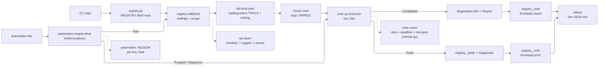

# [ASSAY_OPERATOR]

`assay` is the Rasm polyglot quality operator, validating C#, Python, TypeScript, Bash, SQL, and Markdown surfaces. It is a workspace member (`tools/assay`, flat-layout package `assay` at the member root) whose console script lands in the venv, so `uv run assay` is the gate form and `uv run --no-sync assay` the interactive fast path. Claims, verbs, flags, and parameter signatures live in Cyclopts help (`uv run assay --help`, per-claim `--help`) and the `self-test` census; a claim carrying more than one verb requires it, so a bare invocation of such a claim faults at parse.

## [01]-[SCOPE]

Normal CLI invocations emit one JSON `Envelope` on stdout; diagnostics ride stderr. Its programmatic arm is `automation.engine.drive(trigger, action, settings, executor=...)`, which hosts `Watch`/`Schedule`/`Manual` fires under one AnyIO loop, writes NDJSON output, and spawns every check through the `Executor` port (the engine-bound port when absent).

- Mutually-exclusive `--dotnet`/`--python`/`--typescript` ride the verbs carrying them, an unset selection routing every eligible language.
- `static` diagnoses by default, mutating under `--fix` alone and never rewriting a non-compiling C# target; its diagnostics match `dotnet build`.
- `api query` reports provable absence: a no-match reflects the current artifact, never a stale cache.
- `rails/mutation_gate.py` scores the staged Python mutation lane against its kill-floor; mutmut runs copy-staged, so a root `mutants/` is litter.
- `.config/dotnet-tools.json` is the register: every row carries a named owner and leaves with it, and package health reads SDK-first.
- `dotnet-ef` is the register's recorded negative: no rail runs it, and `Rasm.Persistence` `Element/identity` scaffolding keeps the row.
- `contracts check` gates the estate buf module under one lease, `generate` writes derived surfaces, and `publish` reruns it before the push.
- `contracts check` runs credential-free and reaches no registry; `publish` alone looks the module up, admitting exact absence only to bootstrap.
- `contracts publish` probes `buf registry whoami`, pushes under the resolved account, then reads the returned coordinate off the default label.
- `contracts publish` names a stale `BUF_TOKEN` export as the logged-out cause before the gate spends any work.
- `contracts` derives each `proto:` seam schema through `protoc-gen-jsonschema` into scratch: `check` fails `schema-stale`, `generate` lands it.
- `protoc-gen-jsonschema` absence seats the projection lanes `unsupported` and names each underivable seam, every other lane keeping its verdict.

## [02]-[FIRST_COMMAND]

```bash copy-safe
uv run assay self-test
```

Verify: stdout contains one JSON `Envelope`; `Envelope.status`/`exit_code` are the only process-result source; stderr carries structlog events and tool diagnostics. `--rhino` opts the local Rhino bridge lane into the smoke.

## [03]-[FLOW]


```mermaid
---
config:
  layout: elk
  flowchart:
    curve: linear
    padding: 25
---
flowchart LR
  accTitle: Assay orchestration boundary
  accDescr: CLI commands and automation fires enter rail or program execution, rail handlers select catalog tools and route inputs into Check rows, the Executor port returns Completed receipts or Faults, and emit writes Report or error Envelopes to stdout.

  cli["CLI argv"] --> registry["registry.py<br/>REGISTRY Bind rows"]
  registry --> rail["registry.rail(bind)<br/>settings + scope"]
  auto["Automation fire"] --> drive["automation.engine.drive<br/>limiter/coalesce"]
  drive -->|"Rail"| rail
  drive -->|"Program / Sequence"| executor

  rail --> plan["rail-local plan<br/>catalog.select TOOLS + routing"]
  plan --> checks["Check rows<br/>argv | INPROC"]
  checks --> executor["exec.py Executor<br/>run | fan"]

  executor received@-->|"Completed"| fold["diagnostics.fold -> Report"]
  executor -->|"Fault"| distill["registry._distill -> Diagnostic"]
  fold --> emit["registry._emit<br/>Envelope.report"]
  distill --> emitError["registry._emit<br/>Envelope.error"]
  emit --> stdout["stdout<br/>one JSON line"]
  emitError --> stdout
  drive -.-> ndjson["automation: NDJSON<br/>per fire / leaf"]

  rail -.-> railAspect["rail seam<br/>checked -> logged -> traced"]
  executor -.-> execAspect["exec seam<br/>retry + deadline + transport (remote.py)"]

```

`composition/registry.py` `REGISTRY` binds each claim, and the rail owns settings, scope, routing, check construction from `composition/catalog.py` rows, dispatch, and fold. `core/exec.py` owns the `Executor` port and argv composition, `core/remote.py` the SSH transport, and `core/govern.py` leases, dotnet slots, and fan scheduling.

## [04]-[OUTPUT_CONTRACT]

Parse stdout for results, read stderr for diagnosis, and treat the process exit as a projection of `Envelope.status`.

[WIRE_INVARIANT]:
- Normal invocation emits one newline-framed JSON `Envelope` on stdout; a second emit suppresses to stderr as a FAULTED invariant-violation envelope.
- Automation emits NDJSON, one `Envelope` per fire or leaf; a `Sequence` stops on `failed`, `busy`, `timeout`, or `faulted` and aggregates nothing.
- `Completed(FAILED)` carries a tool that ran and found defects; `Fault` carries routing, spawn, lease, timeout, and precondition failure.
- Schema route: the field-by-field `Envelope` schema and the status algebra live in `core/model.py`.

[STATUS_MODEL]:
- Completed carries success, skip, empty, unsupported, and found defects; Fault carries operational failure under `Envelope.error` with its context.
- `--strict` promotes otherwise non-error states into a fault for that invocation.
- `report.counts.by_status` seats one row per folded leaf under its own status, so a non-passing lane counts as itself and never as a pass.

[PAYLOAD_MAP]:
- `report.detail` carries rail-specific evidence as a tagged `AnyDetail` union; rows ride `report.results` and durable files ride `report.artifacts`.
- `report.exec` and `Envelope.exec` carry the `ExecReceipt` — target URL, host, exit status, transfer counts — threaded from `Completed.exec`.
- Cap fires set `Envelope.truncated`, clip the rows, attach the full report as an artifact, and note shown-of-total on `report.notes`, never stderr.

## [05]-[ARTIFACTS_AND_HISTORY]

- `ArtifactStore` owns the `.artifacts/assay` root whole, so a reader trusts `report.artifacts` over any path inferred from directory shape.
- Scopes key on claim and run id: `ArtifactScope` computes its path lazily, `ensure()` owns the `makedirs`, `retain_scopes` prunes oldest-first.
- Registry invocations persist compact envelope JSON and full reports by `run_id`; `delta` reloads a full report wherever compact history clipped.
- `UPath` routes the artifact root fsspec-shaped and `storage_options`/`protocol=` elects the backend; every other rail takes a real path.
- structlog writes stderr and stdout stays the machine contract; tracing no-ops without an OTLP endpoint, and exit force-flushes then shuts down.

## [06]-[ENVIRONMENT_AND_OFFLOAD]

[ENVIRONMENT]:
- Vars derive from `AssaySettings` fields under the `ASSAY_` prefix, `__` nesting a sub-model field, and an empty value reads unset.
- `composition/settings.py` owns `AssaySettings` beside the `Local`/`Ssh`/`Offload` value objects, and its field set is the whole var roster.

[REMOTE_EXECUTION]:
- `--exec` elects the target, `local` default against an `ssh://[user@]host[:port]` offload, validating the URL at settings load before any spawn.
- Heavy closures run remote for one same-shaped `Envelope` and no stall telemetry; a signalled kill synthesizes exit 255 under an `ssh.signal` note.
- `bridge`, `package`, `provision`, and `contracts` claims and every copy-staged tool reject `exec_target` as `UNSUPPORTED` before argv composition.
- `core/remote.py` pushes the `git ls-files` lane closure over pooled SFTP to `<workroot>/<run_id>` and rebases build argv paths onto that root.
- Pre-flight probes the remote `PATH` for the runner's lead tool under the injected toolchain prefix, an absent one returning `unsupported`.
- `sftp` is the sole `TRANSFER` backend, its shielded download degrading to `remote.artifacts.degraded` rather than reclassifying a completed run.
- Object-store backends admit `SHARED`, remote tool and agent reading one universal path, so the pull transfers zero bytes.

[PROVISIONING_BOUNDARY]: Parametric_Forge owns Compose generation, image choice, credential material, pruning, and its own self-tests.

- `provision` delegates to `forge-provision`/`forge-scientific-env` on `PATH` and projects sanitized JSON as `ProvisionRun` evidence; absence faults.
- Evidence carries redacted DSN metadata and safe topology facts alone, so a sensitive payload is an adapter fault the contract already failed.
