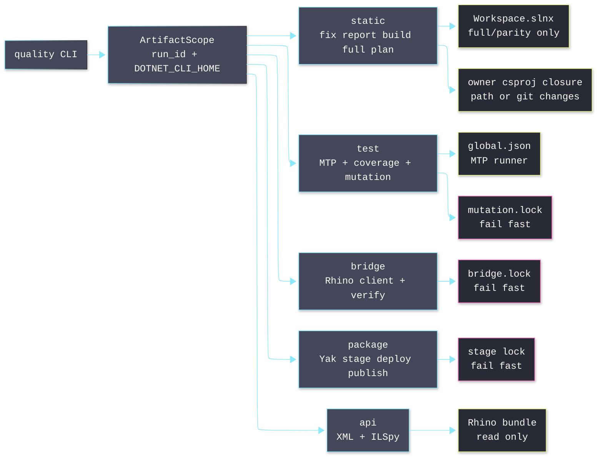

# [H1][QUALITY_OPERATOR]
>**Dictum:** *One rail owns one proof claim.*

<br>

[IMPORTANT] `tools.quality` is an agent-only CLI. Run the narrowest rail that owns the claim. Report command, exit, and evidence path.

```bash
uv run python -m tools.quality <rail> <verb> [args]
```

Rails stay orthogonal: `static` never runs tests, `test` never opens Rhino, `bridge verify` never replaces `static build`, and `api` never launches Rhino.

---
## [1][RAIL_MAP]
>**Dictum:** *Graph highlights routing and contention only.*

<br>



<br>

| [INDEX] | [MODULE]           | [OWNERSHIP]                                      |
| :-----: | ------------------ | ------------------------------------------------ |
|   [1]   | `__main__.py`      | Cyclopts tree, `rail()`, stdout/stderr contract. |
|   [2]   | `settings.py`      | `QualitySettings`, root anchor, artifact paths.  |
|   [3]   | `process.py`       | Subprocess, dotnet args, nonblocking leases.     |
|   [4]   | `rails/static.py`  | C# fix/report/build planning.                    |
|   [5]   | `rails/test.py`    | MTP, coverage, explicit Stryker mutation.        |
|   [6]   | `rails/bridge.py`  | Bridge client, verify reports, Rhino lease.      |
|   [7]   | `rails/package.py` | Yak metadata, atomic stage, stage lease.         |
|   [8]   | `rails/api.py`     | Rhino bundle path, XML search, ILSpy.            |

---
## [2][COMMAND_SURFACE]
>**Dictum:** *Verb names encode cost and mutability.*

<br>

Run from any path under the worktree. `QualitySettings.anchor()` walks parents until `Workspace.slnx`.

| [INDEX] | [RAIL]   | [COMMANDS]                                                                                 | [CLAIM]                    |
| :-----: | -------- | ------------------------------------------------------------------------------------------ | -------------------------- |
|   [1]   | `static` | `fix [paths...]`, `report [paths...]`, `build [paths...]`, `full`, `plan [paths...]`.       | C# cleanup and build proof. |
|   [2]   | `test`   | `run`, `list`, `coverage`; flags: `--target`, `--all`, `--no-build`, `--test-modules`.     | Unit, coverage, mutation.  |
|   [3]   | `bridge` | `build-bridge`, `doctor`, `launch`, `quit`, `check`, `clean`, `verify`.                    | Live Rhino evidence.       |
|   [4]   | package  | `bridge package <slug> <version>`, `deploy <slug> <version>`, `publish <slug> <version>`.  | Yak lifecycle.             |
|   [5]   | `api`    | `doctor`, `path`, `xml`, `types`, `decompile`.                                             | Host SDK metadata.         |
|   [6]   | root     | `self-test [--rhino]`.                                                                     | Tool/path preflight.       |

Use the Python module entrypoint directly. Do not add package-manager aliases for this operator.

---
## [3][STATIC_RAIL]
>**Dictum:** *Fix before proof; build owns remaining diagnostics.*

<br>

[CRITICAL] `static fix` mutates files. `static report`, `static build`, `static full`, and `static plan` do not intentionally mutate tracked source.

| [INDEX] | [MODE]   | [BEHAVIOR]                                                                                 |
| :-----: | -------- | ------------------------------------------------------------------------------------------ |
|   [1]   | `fix`    | Runs `dotnet format whitespace`, `style --severity error`, and `analyzers --severity error`. |
|   [2]   | `report` | Runs same format ladder with `--verify-no-changes` and `--report`.                         |
|   [3]   | `build`  | Restores/builds owner project closure in `Debug`, `--no-incremental`, errors-only output.  |
|   [4]   | `full`   | Verifies `.slnx` parity; restores/builds `Workspace.slnx` in `Debug` and `Release`.        |
|   [5]   | `plan`   | Emits JSON: inputs, owners, closure, full triggers, exact dotnet commands.                 |

Routing:
- No paths: read unstaged diff, staged diff, and untracked files.
- Paths: route explicit files; expand directories with `fd`.
- Full triggers: `Directory.Build.props`, `Directory.Build.targets`, `Directory.Packages.props`, `Workspace.slnx`, `.editorconfig`, `global.json`, and `tools/cs-analyzer/**`.
- Owner route: nearest `*.csproj`; `.cs` files join format groups; project seeds expand reverse `ProjectReference` closure.
- Orphan `.cs`, `.props`, or `.targets`: force full scope.

Modern command ladder:

```bash
uv run python -m tools.quality static fix libs/csharp/Rasm.Grasshopper
uv run python -m tools.quality static build libs/csharp/Rasm.Grasshopper
uv run python -m tools.quality static full
```

Direct dotnet equivalence:
- Fix: `dotnet format whitespace|style|analyzers <csproj> --include <files> --severity error --no-restore`.
- Build: `dotnet restore <csproj> --locked-mode`; then `dotnet build <csproj> -c Debug --no-restore --no-incremental -v:quiet /clp:ErrorsOnly -maxcpucount:<n>`.
- Full: same build shape against `Workspace.slnx` for both configured full configurations.

---
## [4][TEST_RAIL]
>**Dictum:** *MTP execution stays explicit and target-bound.*

<br>

MTP source: `global.json` uses `"runner": "Microsoft.Testing.Platform"`.

| [INDEX] | [MODE]     | [BEHAVIOR]                                                    |
| :-----: | ---------- | ------------------------------------------------------------- |
|   [1]   | `run`      | `dotnet test` with `--minimum-expected-tests 1`.              |
|   [2]   | `list`     | MTP `--list-tests`.                                           |
|   [3]   | `coverage` | Coverlet JSON + Cobertura with includes/excludes in `test.py`. |

Targeting:
- Default project: `tests/csharp/libs/Rasm/Rasm.Tests.csproj`.
- `--target <csproj>` replaces default project.
- `--all` runs `Workspace.slnx`.
- `--no-build` adds MTP `--no-build`; use after successful static build.
- `--test-modules "<glob>"` runs built test modules with `--root-directory <repo>`.
- `--all` and `--test-modules` cannot combine.

Mutation:
- Default `--mutation off`; no implicit mutation on `test run`.
- `changed` mutates changed `.cs` files under `libs/csharp/Rasm`.
- `full` mutates `**/*.cs` excluding `bin/` and `obj/`.
- Eligible only for default `Rasm.Tests` plus `libs/csharp/Rasm/Rasm.csproj`.
- Tool: `dotnet-stryker` `4.14.2`, MTP runner, thresholds `95/90/85`.
- Lock: `.artifacts/locks/mutation.lock`; live contention fails fast.

---
## [5][BRIDGE_PACKAGE_RAIL]
>**Dictum:** *Runtime and package rails own exclusive resources.*

<br>

[CRITICAL] Live Rhino and package staging never wait. Contention returns `busy` with owner text and exit `5`.

Bridge commands:
- `build-bridge` builds protocol, plugin, and client under `ArtifactScope`; it does not acquire Rhino lease.
- `doctor`, `launch`, `quit`, `check`, and `clean` acquire `.artifacts/locks/bridge.lock`, build client, then run `dotnet run --no-build`.
- `verify <pattern>` acquires `bridge.lock`, expires old reports, builds client and scenario kit, launches Rhino, runs scenarios, and emits `VerifyReport` JSON.

Verify discovery order:
1. Direct `*.verify.csx` file.
2. Directory containing `*.verify.csx`.
3. Worktree glob; bare names expand as `**/<pattern>`.

Package commands:
- Resolve one `*.csproj` under `apps/` or `tools/` with matching `YakPackageSlug`.
- Validate `.rhp`, target dir, Yak platform `mac`, package glob `*-rh9_*-mac.yak`, and executable `yak`.
- Build artifact, copy manifest/package files, exclude host assemblies, run `yak build`, then replace stage dir under nonblocking stage lease.
- `package` prints stage path.
- `deploy` runs `yak install`; `rasm-bridge` also `quit`, `install`, `refresh`.
- `publish` runs deploy path plus `yak push` when `YakPushSource` exists.

Bridge exit codes:

| [INDEX] | [STATUS]          | [EXIT] | [INTERPRETATION]                             |
| :-----: | ----------------- | -----: | -------------------------------------------- |
|   [1]   | `ok`, `skipped`   |      0 | Valid or intentionally skipped.              |
|   [2]   | `failed`          |      1 | Build, connect, execute, or scenario failure. |
|   [3]   | `unsupported`     |      3 | Build proof valid; no scenario path supplied. |
|   [4]   | `busy`, `timeout` |      5 | Exclusive resource busy or scenario timeout. |

---
## [6][API_RAIL]
>**Dictum:** *Host API truth comes from installed bundle files.*

<br>

API root: `Rhino.app/Contents/Frameworks/RhCore.framework/Versions/Current/Resources`.

| [INDEX] | [COMMAND]       | [BEHAVIOR]                                      |
| :-----: | --------------- | ----------------------------------------------- |
|   [1]   | `api doctor`    | JSON for Rhino version, ILSpy, RhinoCode, refs. |
|   [2]   | `api path`      | Resolved assembly or XML path.                  |
|   [3]   | `api xml`       | `rg -n -C 2` search; requires `--pattern`.      |
|   [4]   | `api types`     | `ilspycmd -l cisde` with optional text filter.  |
|   [5]   | `api decompile` | `ilspycmd -t <type>`; requires `--type-name`.   |

Keys:

| [INDEX] | [KEY]               | [ASSEMBLY]                                                | [XML]                                                     |
| :-----: | ------------------- | --------------------------------------------------------- | --------------------------------------------------------- |
|   [1]   | `rhino-common`      | `RhinoCommon.dll`                                         | `RhinoCommon.xml`                                         |
|   [2]   | `rhino-ui`          | `Rhino.UI.dll`                                            | `Rhino.UI.xml`                                            |
|   [3]   | `rhino-code`        | `Rhino.Runtime.Code.dll`                                  | none                                                      |
|   [4]   | `rhino-code-remote` | `Rhino.Runtime.Code.Remote.dll`                           | none                                                      |
|   [5]   | `eto`               | `Eto.dll`                                                 | `Eto.xml`                                                 |
|   [6]   | `gh2`               | `ManagedPlugIns/Grasshopper2Plugin.rhp/Grasshopper2.dll`  | `ManagedPlugIns/Grasshopper2Plugin.rhp/Grasshopper2.xml`  |
|   [7]   | `gh2-io`            | `ManagedPlugIns/Grasshopper2Plugin.rhp/GrasshopperIO.dll` | `ManagedPlugIns/Grasshopper2Plugin.rhp/GrasshopperIO.xml` |

---
## [7][ARTIFACTS_CONCURRENCY]
>**Dictum:** *Artifact isolation replaces static locks.*

<br>

Artifact scope:
- `rail()` opens `.artifacts/quality/<rail>/<run_id>/` and isolated `DOTNET_CLI_HOME`.
- Static build verbs receive `--artifacts-path`; no static locks exist.
- Non-static build verbs also receive `--disable-build-servers` and `MSBUILDDISABLENODEREUSE=1`.
- Test results live under `.artifacts/test/<slice>/<run_id>/`.
- Mutation output lives under `.artifacts/mutation/<slice>/<run_id>/`.
- Verify reports live under `.artifacts/rhino/verify/<run_id>/` and expire by retention.

Concurrency:
- Parallel: `static fix`, `static report`, `static build`, and `test run` with distinct `run_id`.
- Exclusive fail-fast: mutation, live Rhino bridge commands, `bridge verify`, bridge package live steps, and package stage commit.

---
## [8][AGENT_ROUTING]
>**Dictum:** *Route by proof claim, not habit.*

<br>

Use:
- `static fix` before `static build` for C# edits.
- `static report` when mutation is disallowed and format diagnostics are needed.
- `static build [paths...]` for compile/analyzer proof on touched project closure.
- `static full` after solution, central package, global runner, `.editorconfig`, or analyzer changes.
- `static plan [paths...]` before costly proof or when routing looks suspicious.
- `test run --no-build` after successful static build.
- `test run --test-modules "<glob>"` for already-built MTP assemblies.
- `bridge verify <pattern>` for Rhino scenario proof.
- `api xml`, `api types`, or `api decompile` for host SDK truth.

Avoid:
- Reintroducing `static check`.
- Treating `dotnet format` as compile/analyzer proof.
- Running `.slnx` builds for ordinary leaf edits.
- Running raw `dotnet test --help` as a harmless probe under MTP.
- Running mutation implicitly on every unit test pass.
- Waiting on locks; busy means choose another proof or retry later.

---
## [9][MAINTENANCE]
>**Dictum:** *Validation follows edited surface.*

<br>

Load `.claude/skills/coding-python/SKILL.md` before Python edits. Dependencies live in root `pyproject.toml`.

Python edits:

```bash
uv run pytest tests/tools/quality/test_quality.py -q
pnpm check:py
```

README or Mermaid edits:

```bash
git diff --check
pnpm exec mmdc -i tools/quality/README.md -a .artifacts/mermaid -q
```

Preflight:

```bash
uv run python -m tools.quality self-test
uv run python -m tools.quality self-test --rhino
```

Required tools: `dotnet`, `fd`, `git`, `ilspycmd`, `rg`. Required files: `Workspace.slnx`, default test csproj, and `.config/dotnet-tools.json`. Rhino preflight also checks executable `Contents/Resources/bin/yak`.
