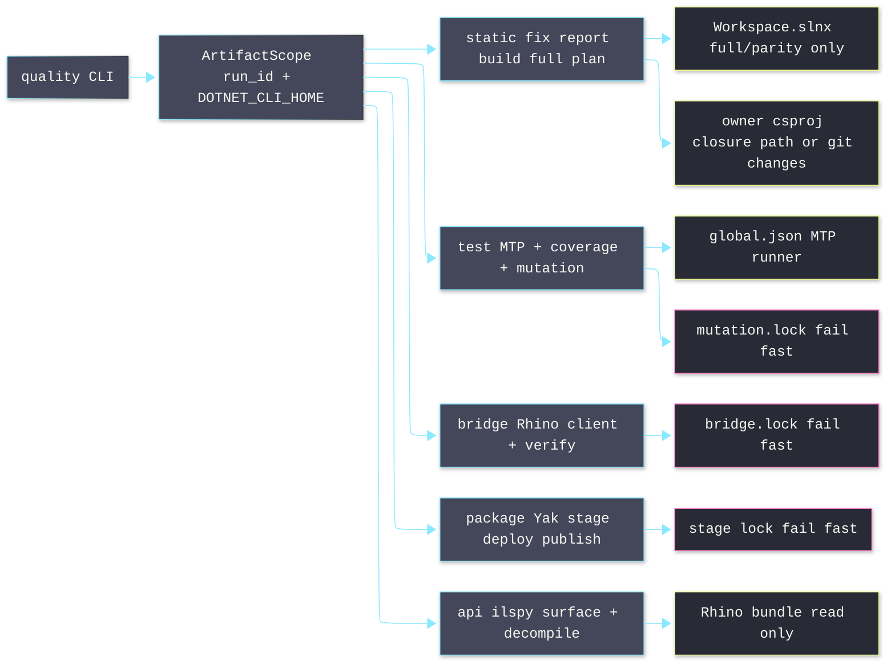

# [QUALITY_OPERATOR]

`tools.quality` is the root quality operator. Run the narrowest rail that owns the claim.

```bash copy-safe
uv run python -m tools.quality <rail> <verb> [args]
```

Rails stay orthogonal: `static` never runs tests, `test` never opens Rhino, `bridge verify` never replaces `static build`, and `api` never launches Rhino.

Output contract: every verb writes exactly one JSON `Envelope` object to stdout with `rail`, `verb`, `status`, `exit_code`, `run_id`, `evidence`, `data`, `error`, `truncated`, and `notes`. Streamed `dotnet` bytes and structlog diagnostics go to stderr only. There is no raw-text passthrough; stdout is always the single Envelope.

## [1][RAIL_MAP]


| [INDEX] | [MODULE]           | [OWNERSHIP]                                      |
| :-----: | ------------------ | ------------------------------------------------ |
|   [1]   | `__main__.py`      | Cyclopts tree, `rail()`, single-Envelope stdout contract. |
|   [2]   | `settings.py`      | `QualitySettings`, root anchor, artifact paths.  |
|   [3]   | `process.py`       | Subprocess, dotnet args, nonblocking leases.     |
|   [4]   | `rails/static.py`  | C# fix/report/build planning.                    |
|   [5]   | `rails/test.py`    | MTP, coverage, explicit Stryker mutation.        |
|   [6]   | `rails/bridge.py`  | Bridge client, verify reports, Rhino lease.      |
|   [7]   | `rails/package.py` | Yak metadata, atomic stage, stage lease.         |
|   [8]   | `rails/api.py`     | Host and NuGet API resolver; ilspy surface + decompile. |

## [2][COMMAND_SURFACE]

Run from any path under the worktree. `QualitySettings.anchor()` walks parents until `Workspace.slnx`.

| [INDEX] | [RAIL]   | [COMMANDS]                                           | [CLAIM]                    |
| :-----: | -------- | ---------------------------------------------------- | -------------------------- |
|   [1]   | `static` | `fix`, `report`, `build`, `full`, `plan`.            | C# cleanup and build proof. |
|   [2]   | `test`   | `run`, `list`, `coverage`.                           | Unit, coverage, mutation.  |
|   [3]   | `bridge` | `build-bridge`, `doctor`.                            | Bridge build and preflight. |
|   [4]   | `bridge` | `launch`, `quit`, `check`, `clean`, `verify`.        | Live Rhino evidence.       |
|   [5]   | `bridge` | `package`, `package plan`, `package list`.           | Yak staging.               |
|   [6]   | `bridge` | `deploy`, `publish`.                                 | Yak install and release.   |
|   [7]   | `api`    | `doctor`, `resolve`, `query`, `show`.                | Host and package API truth. |
|   [8]   | root     | `self-test`.                                         | Tool/path preflight.       |

Use the Python module entrypoint directly. Do not add package-manager aliases for this operator.

## [3][STATIC_RAIL]

> [!CAUTION]
> `static fix` mutates files. `static report`, `static build`, `static full`, and `static plan` do not intentionally mutate tracked source.

| [INDEX] | [MODE]   | [BEHAVIOR]                                                                                 |
| :-----: | -------- | ------------------------------------------------------------------------------------------ |
|   [1]   | `fix`    | Runs one bare `dotnet format <csproj> --include <files> --severity error` per project.     |
|   [2]   | `report` | Runs same bare format pass with `--verify-no-changes` and `--report`.                      |
|   [3]   | `build`  | Restores/builds owner closure in `Debug` under stable per-closure `--artifacts-path`; full-trigger plans build `Workspace.slnx`. |
|   [4]   | `full`   | Verifies `.slnx` parity; restores/builds `Workspace.slnx` in `Debug` and `Release` under the `solution` closure. |
|   [5]   | `plan`   | Emits JSON: inputs, owners, closure, full triggers, exact dotnet commands.                 |

Routing:
- No paths: read unstaged diff, staged diff, and untracked files.
- Paths: route explicit files; expand directories with `fd`.
- Full triggers: `.config/dotnet-tools.json`, `Directory.Build.props`, `Directory.Build.targets`, `Directory.Packages.props`, `Workspace.slnx`, `.editorconfig`, `global.json`, and `tools/cs-analyzer/**`.
- Owner route: nearest `*.csproj`; `.cs` files join format groups; project seeds expand reverse `ProjectReference` closure.
- Orphan `.cs`, `.csproj`, `.props`, or `.targets`: force full scope.

Modern command ladder:

```bash copy-safe
uv run python -m tools.quality static fix libs/csharp/Rasm.Grasshopper
uv run python -m tools.quality static build libs/csharp/Rasm.Grasshopper
uv run python -m tools.quality static full
```

Direct dotnet equivalence:
- Fix: `dotnet format <csproj> --include <files> --severity error`. One bare pass runs whitespace, style, and analyzers together.
- Build: `dotnet restore <csproj> --locked-mode`; then `dotnet build <csproj> -c Debug --no-restore -v:quiet /clp:ErrorsOnly -maxcpucount:<n>`.
- Full: same build shape against `Workspace.slnx` for both configured full configurations.

> [!CAUTION]
> `static fix` and `static report` omit `--no-restore`. Bare `dotnet format` needs a restored compilation; `--no-restore` on a cold per-run project silently skips semantic IDE rules (IDE0001 name simplification, IDE0005). Implicit restore against the warm NuGet cache resolves them. `build` keeps explicit `restore --locked-mode` then `build --no-restore`.

Closure isolation:
- `build` and `full` run under a stable `--artifacts-path .artifacts/quality/build/<closure>`; closure is the first 16 hex of `sha256` over sorted project paths, and `full` resolves to `"solution"`.
- A non-blocking `build-<closure>.lock` lease guards each closure. Busy returns `busy` with owner text and exit `5`; it never hangs.
- Distinct closures build concurrently; the same closure twice returns instant `busy`.

## [4][TEST_RAIL]

MTP source: `global.json` uses `"runner": "Microsoft.Testing.Platform"`.

| [INDEX] | [MODE]     | [BEHAVIOR]                                                    |
| :-----: | ---------- | ------------------------------------------------------------- |
|   [1]   | `run`      | `dotnet test` with `--minimum-expected-tests 1`.              |
|   [2]   | `list`     | MTP `--list-tests`.                                           |
|   [3]   | `coverage` | Coverlet JSON + Cobertura with includes/excludes in `test.py`. |

Targeting:
- Default project: `tests/csharp/libs/Rasm/Rasm.Tests.csproj`.
- `--target <csproj>` replaces default project.
- `--all` runs `Workspace.slnx`.
- `--no-build` adds MTP `--no-build`; use after successful static build.
- `--test-modules "<glob>"` runs built test modules with `--root-directory <repo>`.
- `--all` and `--test-modules` cannot combine.
- `list --format json --limit N --grep PATTERN` emits bounded JSON test discovery for agents.

Mutation:
- Default `--mutation off`; no implicit mutation on `test run`.
- `changed` mutates changed `.cs` files under `libs/csharp/Rasm`.
- `full` mutates `**/*.cs` excluding `bin/` and `obj/`.
- Eligible only for default `Rasm.Tests` plus `libs/csharp/Rasm/Rasm.csproj`.
- Tool: `dotnet-stryker`, MTP runner, thresholds `95/90/85`; version lives in `.config/dotnet-tools.json` as the source of truth.
- Lock: `.artifacts/locks/mutation.lock`; live contention fails fast.

## [5][BRIDGE_PACKAGE_RAIL]

> [!CAUTION]
> Live Rhino and package staging never wait. Contention returns `busy` with owner text and exit `5`.

Bridge commands:
- `build-bridge` builds protocol, plugin, and client under `ArtifactScope`; it does not acquire Rhino lease.
- `doctor`, `launch`, `quit`, `check`, and `clean` acquire `.artifacts/locks/bridge.lock`, build client, then run `dotnet run --no-build`.
- `verify <pattern>` acquires `bridge.lock`, expires old reports, builds client and scenario kit, launches Rhino, runs scenarios, and emits `VerifyReport` JSON.

Verify discovery order:
1. Direct `*.verify.csx` file.
2. Directory containing `*.verify.csx`.
3. Worktree glob; bare names expand as `**/<pattern>`.

Package commands:
- Resolve one `*.csproj` under `apps/` or `tools/` with matching `YakPackageSlug`.
- Validate `.rhp`, target dir, Yak platform `mac`, package glob `*-rh9_*-mac.yak`, and executable `yak`.
- Build artifact, copy manifest/package files, exclude host assemblies, run `yak build`, then replace stage dir under nonblocking stage lease.
- `package` emits a `package` rail Envelope with stage path under `data.artifact_paths.stage`.
- `package plan <slug> <version>` emits package project and evaluated Yak metadata under `Envelope.data` without staging.
- `package list` emits discovered package projects under `Envelope.data` without MSBuild or Yak mutation.
- `deploy` runs `yak install`; `rasm-bridge` also `quit`, `install`, `refresh`.
- `publish` runs deploy path plus `yak push` when `YakPushSource` exists.

Bridge `Envelope.status` → `exit_code`:

| [INDEX] | [STATUS]          | [EXIT] | [INTERPRETATION]                             |
| :-----: | ----------------- | -----: | -------------------------------------------- |
|   [1]   | `ok`, `skip`      |      0 | Valid or intentionally skipped scenario.     |
|   [2]   | `failed`          |      1 | Build, connect, execute, or scenario failure. |
|   [3]   | `unsupported`     |      3 | Build proof valid; no scenario path supplied. |
|   [4]   | `busy`, `timeout` |      5 | Exclusive resource busy or scenario timeout. |

## [6][API_RAIL]

API evidence root: `.artifacts/quality/api/<run-id>/`. Default commands emit compact JSON only. Full raw stdout/stderr, type and namespace surfaces, decompiled source, and `report.json` stay in the run artifact directory.

| [INDEX] | [VERB]    | [CLAIM]                   |
| :-----: | --------- | ------------------------- |
|   [1]   | `doctor`  | Inventory and tool health. |
|   [2]   | `resolve` | Asset path resolution.    |
|   [3]   | `query`   | Surface and source lookup. |
|   [4]   | `show`    | Artifact inspection.      |

Command forms define runnable syntax and return shape:
- `doctor`
    Command: `api doctor [--strict]`
    Returns: host and NuGet inventory plus `ilspycmd`, Rhino, and RhinoCode health.
- `resolve`
    Command: `api resolve <key> [kind]`
    Kinds: `all`, `assembly`, `xml`, `nuspec`, `deps`, and `package-root`.
    Returns: managed, native, build, analyzer, and tool asset paths.
- `query`
    Command: `api query <key> [symbol] [--max-lines N] [--full] [--grep text]`
    Returns: a symbol-shaped result from the ilspy surface.
- `show`
    Command: `api show <artifact-or-symbol> [--lines A:B] [--grep text] [--full] [--latest]`
    Returns: current-run artifact preview or full content inside `Envelope.data`.
    Historical lookup: requires `--latest`.

`query` shapes (discriminated by `symbol`):

| [INDEX] | [SHAPE]     | [TRIGGER]                | [RETURN]                    |
| :-----: | ----------- | ------------------------ | --------------------------- |
|   [1]   | `index`     | Empty `symbol`.          | Namespaces and type count.  |
|   [2]   | `namespace` | Namespace match.         | Types under the namespace.  |
|   [3]   | `type`      | Exact or suffix type FQN. | Signature and bounded body. |
|   [4]   | `member`    | `Type.Member` symbol.    | Signature and body window.  |
|   [5]   | `search`    | No symbol match.         | Ranked surface/XML results. |

The surface engine uses these rules:
- Type resolution ranks exact FQN above suffix match.
- `ilspycmd` runs through `dotnet tool run ilspycmd -- ...`.
- Type and namespace surfaces come from `ilspycmd -l cisde`.
- Surface cache keys include the source key and assembly fingerprint.
- Body lookup uses `ilspycmd -t`.
- XML sidecars enrich docs but are not required.
- One `dotnet tool restore` runs per API scope.

Key resolution uses this order:
1. Host alias.
2. Exact casefold package ID.
3. Unique casefold prefix.
4. Unique substring.
5. Unique token containment.

Ambiguity returns a typed error listing candidates. For example, `languageext` resolves `LanguageExt.Core`, and `avalonia.datagrid` resolves `Avalonia.Controls.DataGrid`.

API `data` payload (nested under the top-level `Envelope.data`):

[IDENTITY_FIELDS]:
- `query`: operation, key, and pattern/type.
- `shape`: `index`, `namespace`, `type`, `member`, or `search`.
- `signature`: resolved type or member signature.
- `doc`: xml-doc prose when a sidecar enriches the shape.
- `source`: key, source kind, selected assembly/XML, package version when relevant, and asset counts.

[OUTPUT_FIELDS]:
- `counts`: matches, types, assemblies, bytes, lines, or paths.
- `artifact_paths`: direct paths for `report`, raw streams, `surface.txt`, `decompile.cs`, or `source.preview.cs`.
- `results`: small ranked preview records; no broad result stream is printed by default.
- `preview`: inline bounded source/artifact text when the command owns a direct inspection surface.

> [!CAUTION]
> Unknown API source keys fail with a typed Envelope error. Valid source keys with no symbol/artifact match return `status: empty` and no raw fallback bytes. `api show --full` keeps full text inside `Envelope.data.content`; stdout still contains exactly one Envelope.

Host keys map to these assemblies and XML sidecars:
- `rhino-common`
    Assembly: `RhinoCommon.dll`
    XML: `RhinoCommon.xml`
- `rhino-ui`
    Assembly: `Rhino.UI.dll`
    XML: `Rhino.UI.xml`
- `rhino-code`
    Assembly: `Rhino.Runtime.Code.dll`
    XML: none
- `rhino-code-remote`
    Assembly: `Rhino.Runtime.Code.Remote.dll`
    XML: none
- `eto`
    Assembly: `Eto.dll`
    XML: `Eto.xml`
- `gh2`
    Assembly: `ManagedPlugIns/Grasshopper2Plugin.rhp/Grasshopper2.dll`
    XML: `ManagedPlugIns/Grasshopper2Plugin.rhp/Grasshopper2.xml`
- `gh2-io`
    Assembly: `ManagedPlugIns/Grasshopper2Plugin.rhp/GrasshopperIO.dll`
    XML: `ManagedPlugIns/Grasshopper2Plugin.rhp/GrasshopperIO.xml`

Package keys resolve from `Directory.Packages.props` and restored assets under `.cache/nuget/packages`, with user NuGet cache as a read-only fallback. First package `query` resolves assets lazily and may run an isolated restore probe under the API artifact directory.

Observed gotchas use these readings:
- `rhino-ui` declares `Rhino.UI.xml`, but the current RhinoWIP bundle lacks that file; `query` builds an XML-free surface, so it resolves types and members without the sidecar.
- GH2 symbols are namespace-sensitive. `query gh2 Document` ranks `Grasshopper2.Doc.Document`; `Grasshopper.Document` is not the current exact type.
- The surface lists arity-free generic names; pin a generic by passing CLR arity, for example `query <key> Type\`1`.
- Multi-assembly packages stay bounded by the preview cap; compact JSON keeps stdout bounded and stores full files on disk.
- A central package with no owning `.csproj` shows in `api doctor` with empty `owners`; treat such an entry as a pre-consumer pin, not active API surface.

## [7][ARTIFACTS_CONCURRENCY]

Artifact scope:
- `rail()` opens `.artifacts/quality/<rail>/<run_id>/` and isolated `DOTNET_CLI_HOME`.
- Dotnet build/test/run verbs receive `--artifacts-path`, `--disable-build-servers`, and `MSBUILDDISABLENODEREUSE=1`.
- Streamed process logs live under `.artifacts/quality/<rail>/<run_id>/process/<command-id>/`.
- Test results live under `.artifacts/test/<slice>/<run_id>/`.
- Mutation output lives under `.artifacts/mutation/<slice>/<run_id>/`.
- Verify reports live under `.artifacts/rhino/verify/<run_id>/` and expire by retention.

Concurrency:
- Parallel: `static fix`, `static report`, `static build`, and `test run` with distinct `run_id`.
- Exclusive fail-fast: mutation, live Rhino bridge commands, `bridge verify`, bridge package live steps, and package staging from cleanup through commit.
- Lease files remain stable and are truncated after release; do not delete lock files as stale cleanup.

## [8][RAIL_SELECTION]

Use:
- `static fix` before `static build` for C# edits.
- `static report` when mutation is disallowed and format diagnostics are needed.
- `static build [paths...]` for compile/analyzer proof on touched project closure.
- `static full` after solution, central package, global runner, `.editorconfig`, or analyzer changes.
- `static plan [paths...]` before costly proof or when routing looks suspicious.
- `test run --no-build` after successful static build.
- `test run --test-modules "<glob>"` for already-built MTP assemblies.
- `bridge verify <pattern>` for Rhino scenario proof.
- `api query` for host SDK and central package API truth.
- `api doctor` before guessing package or tool availability.
- `api show <artifact-or-symbol>` for bounded follow-up inspection without rerunning broad API queries.

Avoid:
- Treating `dotnet format` as compile/analyzer proof.
- Running `.slnx` builds for ordinary leaf edits.
- Running raw `dotnet test --help` as a harmless probe under MTP.
- Running mutation implicitly on every unit test pass.
- Waiting on locks; busy means choose another proof or retry later.

## [9][RUNTIME_REQUIREMENTS]

Required tools: `dotnet`, `fd`, `git`, and `rg`. Local-manifest tools (`ilspycmd`, `dotnet-stryker`, `dotnet-outdated`) live in `.config/dotnet-tools.json` and are invoked through the operator rail that owns them. Required files: `Workspace.slnx`, default test csproj, and `.config/dotnet-tools.json`. Rhino preflight also checks executable `Contents/Resources/bin/yak`.
