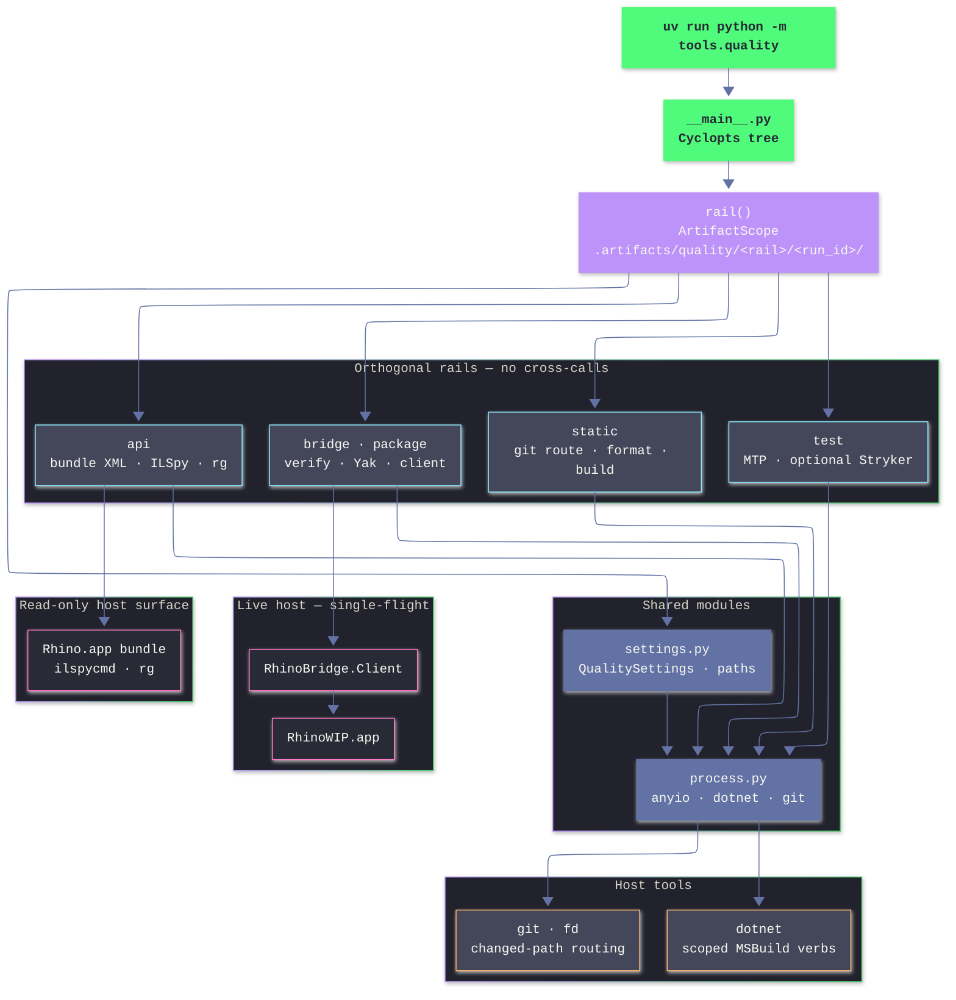

# Quality operator

Typed CLI for three independent gates: **static** (managed C# cleanup and compile proof), **test** (MTP unit tests and optional Stryker), and **bridge** (live RhinoWIP plus Yak packaging). The **api** sub-rail reads host assemblies and XML without launching Rhino.

Run from the directory that contains `Workspace.slnx` (or any subdirectory—the operator walks parents to find it).

```bash
uv run python -m tools.quality <rail> <verb> [args…]
```

Rails do not call each other: `static` never runs tests; `test` never opens Rhino; `bridge verify` does not replace `static build` for compile proof.

---

## Architecture



**Modules** (`rails/` has no `__init__.py`):

- `__main__.py` — Cyclopts tree, `rail()`, stderr logs vs stdout payloads
- `settings.py` — root anchor, `QUALITY_*` env, Rhino bundle, paths
- `process.py` — `anyio` subprocesses, scoped `dotnet`, git index
- `rails/static.py` — changed-path routing, format or build
- `rails/test.py` — MTP, optional Stryker
- `rails/bridge.py` — client, verify, bridge JSON
- `rails/package.py` — Yak stage, install, push
- `rails/api.py` — ILSpy, `rg`, bundle metadata

---

## Commands

### Static

`static check` · `build` · `full` — positional mode (`--mode` in Cyclopts).

### Test

`test run` · `list` · `coverage`

Flags: `--target <csproj>`, `--all`, `--mutation off|changed|full`, optional `--filter-expr`.

`pnpm test:cs` → `test run`.

### Bridge

`build-bridge` · `doctor` · `launch` · `quit` · `check` · `clean` · `verify` · `package` · `deploy` · `publish`

Package verbs take `<slug>` and `<version>`. `pnpm verify:rhino` → `bridge verify` (you still pass a pattern).

### API

`api doctor` · `path` · `xml` · `types` · `decompile`

Flags: `--key`, `--kind`, `--pattern`, `--type-name`.

### Preflight

`self-test` — PATH tools, manifest files, executable `yak`.

**References:** scenario wire contract — `tools/rhino-bridge/README.md`; gate policy — `CLAUDE.md` §5.2.

---

## Configuration

`QualitySettings` is frozen, `QUALITY_*` only (`extra=forbid`). Root: walk parents for `Workspace.slnx`.

Rhino bundle: `RHINO_WIP_APP_PATH` if set, else newest `/Applications/Rhino*.app`, else `QUALITY_RHINO_APP`. Every child `dotnet` gets `RHINO_WIP_APP_PATH` from the resolved bundle.

`TEST_TARGET` and other non-`QUALITY_` names do not set `test_target`.

### Environment

**Worktree**

- `QUALITY_ROOT` — anchored `cwd`

**Build**

- `QUALITY_CONFIGURATION` — `Release` (tests, bridge client, Yak)
- `QUALITY_STATIC_CONFIGURATION` — `Debug` (routed `static build`)
- `QUALITY_DOTNET_MAX_CPU` — `4`
- `QUALITY_CONFIGURATIONS` — unset, or space-separated `Debug` / `Release` for both `static build` and `static full`

**Test / mutation**

- `QUALITY_TEST_TARGET` — `tests/csharp/libs/Rasm/Rasm.Tests.csproj`
- `QUALITY_MUTATION_MAX_CPU` — `2`
- `QUALITY_TEST_TIMEOUT_S` — `300`
- `QUALITY_MUTATION_TIMEOUT_S` — `1200`

**Bridge**

- `QUALITY_RHINO_APP` — bundle override
- `QUALITY_VERIFY_RETENTION_SECONDS` — `300`
- `QUALITY_SCENARIO_TIMEOUT_S` — `180`

**Artifacts**

- `QUALITY_RUN_ID` — UTC timestamp + pid (per-invocation dir name)

### MSBuild scope

`rail()` creates `.artifacts/quality/<rail>/<run_id>/` and isolated `DOTNET_CLI_HOME`.

**Scoped** (`restore`, `build`, `clean`, `msbuild`, `pack`, `publish`, `run`, `test`):

- `static` — `--artifacts-path` only; build servers stay on
- `test`, `bridge`, `api` — also `--disable-build-servers` and `MSBUILDDISABLENODEREUSE=1`

**Not scoped** (`scoped=False`, canonical `bin/`):

- `build_client`, `build_scenario_kit`, Yak `_stage`, all `client_run`
- Ready check: `tools/rhino-bridge/client/bin/<Configuration>/*/Rasm.RhinoBridge.Client.dll`

`build-bridge` uses default `scoped=True` (protocol, plugin, client under the rail artifact path). Do not use it alone to prime `dotnet run --no-build`; use paths that call `build_client` (`doctor`, `check`, `verify`, …).

**Other artifact dirs**

- Tests — `.artifacts/test/<slice>/<run_id>/` (`slice` = project stem or `all`)
- Mutation — `.artifacts/mutation/<slice>/<run_id>/`
- Verify — `.artifacts/rhino/verify/<run_id>/` (TTL prune each run)
- Lock — `.artifacts/locks/mutation.lock` (`flock`, fail if busy)

### I/O

- **stderr** — structlog (`rail`, `phase`, `duration_ms`; verify scenario rows)
- **stdout** — `verify` JSON, `api doctor` JSON, package stage path
- Bridge stdout may forward raw bytes; decoded `BridgeResult.exit_code` wins when JSON is present

---

## Static rail

### Git routing

`Workspace.changed()` = unstaged diff + cached diff + untracked (honours `.gitignore`).

- **Ignore** — `tests/tools/ast-grep/`, `tests/tools/py_analyzer/`
- **Full solution** — `Directory.Build.props`, `Directory.Build.targets`, `Directory.Packages.props`, `Workspace.slnx`, `.editorconfig`, `global.json`, or anything under `tools/cs-analyzer/`
- **Routed project** — suffix in `CS_SUFFIXES` with a resolvable owner (`.cs`, `.csproj`, `.props`, `.targets`, `.json`, `.resx`, `.ico`, `.ghicon`, `.yml`, `.yaml`); `.cs` also queued for whitespace format
- **Full scope** — `.cs` / `.props` / `.targets` with no owning project

Lists live in `settings.py`.

### Project set

- `changed`, no projects → skip, exit `0`
- `changed`, with seeds → transitive `ProjectReference` closure
- `full` → every `fd` `*.csproj` must match `dotnet sln list`

### Modes

**`check`** — `dotnet format whitespace` on changed `.cs` only (`--include`, `--no-restore`, `scoped=False`). No `style` or analyzer format subcommands.

**`build`** — `restore Workspace.slnx --locked-mode`, then build routed projects at `QUALITY_STATIC_CONFIGURATION`. MSBuild analyzers run here.

**`full`** — restore + build `Workspace.slnx`; `Debug` and `Release` unless `QUALITY_CONFIGURATIONS` narrows.

### When to run

- Whitespace on touched C# → `static check`
- Compile proof for touched projects → `static build`
- Central config / solution graph → `static full`
- Comment-only or move-only → skip unless asked

`static check` and `static build` may run in parallel (separate `run_id`).

---

## Test rail

MTP via `global.json` (`"runner": "Microsoft.Testing.Platform"`).

- `run` — `dotnet test`, then optional Stryker
- `list` — `--list-tests`
- `coverage` — coverlet flags in `rails/test.py`

**Targeting**

- Default — `--project <root>/<test_target>`
- `--target` — other csproj; breaks default mutation pair
- `--all` — `--solution Workspace.slnx`

Always `--minimum-expected-tests 1`, `scoped=False`, results under `.artifacts/test/…`.

**Filter** (first match): leading `/` → `--filter-query`; `=` → `--filter-trait`; suffix `Tests` / `Laws` / `Spec` or `+` → `--filter-class`; `.` → `--filter-method`; else wildcard method filter.

**Mutation** (`--mutation off` default)

- Runs only when `test_target` and `mutation_test_project` are the same path (default `Rasm.Tests` + `libs/csharp/Rasm/Rasm.csproj`)
- `changed` — git-changed `.cs` under mutation project; skip if none
- `full` — `**/*.cs`, exclude bin/obj
- Tool — `dotnet-stryker` **4.14.2**, `--test-runner mtp`, thresholds 95 / 90 / 85
- Zero tests discovered — hard fail

---

## Bridge and package

### Commands

**`build-bridge`** — `dotnet_build` protocol, plugin, client; `scoped=True` (artifact path, not client `bin/`).

**`doctor` · `launch` · `quit` · `check` · `clean`** — `build_client` → `client_run`; decode `BridgeResult` from stdout when JSON.

**`verify <pattern>`** — prune old verify dirs → `build_client` → `build_scenario_kit` → `launch` → per-scenario `check` → stdout: one `VerifyReport` JSON.

One live Rhino at a time: do not overlap `verify`, `check`, or `deploy` / `publish`.

**Verify discovery** (first match)

1. File or directory (cwd or `<root>/<pattern>`)
2. `fd` `\.verify\.csx$` in a directory
3. `root.glob(**/<pattern>)` when the pattern has no `/*?[`

**Scenario project** — `tests/csharp/libs/<Name>/…/scenarios/…` → `libs/csharp/<Name>/<Name>.csproj` if it exists, else `Workspace.owner`.

**Verify artifacts** — `<run_id>/<stem>.json`, `summary.json`; exit `0` iff all scenarios ok. Stdout markers: `rasm.rhino-bridge.evidence=facts=`, `rasm.rhino-bridge.capture=` (`bridge.py`; types in `tools/rhino-bridge/protocol`).

**Exit codes** — `ok` / `skipped` → 0; `failed` → 1; `unsupported` → 3; `busy` / `timeout` → 5.

`bridge check <file.cs>` without a scenario often exits **3** after a good build — compile proof, not failure.

### Package

One `.csproj` under `apps/` or `tools/` with matching `YakPackageSlug`.

MSBuild properties → build `.rhp` → stage → `yak build` → atomic dir replace (fcntl).

- `package` — print stage path
- `deploy` — `yak install`; `rasm-bridge` also `quit`, `install`, `refresh` (launch + doctor)
- `publish` — deploy + `yak push` when `YakPushSource` is set

Needs executable `Contents/Resources/bin/yak`, platform `mac`, glob `*-rh9_*-mac.yak`.

---

## API rail

Read-only under `Rhino.app/…/RhCore.framework/…/Resources/`.

- `doctor` — JSON (version, ILSpy, RhinoCode, per-key assembly/XML)
- `path` — one path (`--kind assembly|xml`)
- `xml` — `rg` on XML (`--pattern` required)
- `types` — ILSpy list (`--pattern` optional)
- `decompile` — ILSpy (`--type-name` required)

Keys: `rhino-common`, `rhino-ui`, `rhino-code`, `rhino-code-remote`, `eto`, `gh2`, `gh2-io`.

ILSpy uses `_dotnet_apphost_env` (`dotnet --list-runtimes`, `DOTNET_MULTILEVEL_LOOKUP=0`). `ArtifactScope` supplies `dotnet_env` only; ILSpy and `rg` are not artifact-scoped builds.

---

## Agent routing

**Use**

- `static check` — whitespace on changed C#
- `static build` — compile touched projects
- `static full` — after sln or central config edits
- `test run` — unit tests
- `test coverage` — coverlet via MTP
- `test run --mutation changed` — Stryker (explicit)
- `bridge verify <glob>` — Rhino scenarios
- `bridge check <csproj>` — project diagnostic
- `bridge check <file.cs>` — build proof; exit 3 without scenario is expected
- `api xml` / `api decompile` — host API truth
- `bridge package|deploy|publish` — Yak plugins

**Avoid**

- Analyzers on `static check` only
- `bridge check` as sole compile proof
- `static build` after graph-wide config change
- `bridge verify` for pure unit behaviour
- Raw `dotnet test` without this MTP mapping
- Implicit mutation on every `test run`
- Treating bridge exit 3 on bare `.cs` as failure
- Manual `PlugIns` copy instead of Yak verbs

**Concurrency**

- Parallel: `static check`, `static build`, `test run` (different `run_id`)
- Serialize: bridge verify/check/deploy, mutation lock

---

## Maintainer

Load `.claude/skills/coding-python/SKILL.md` before editing. Rail logic in `rails/<rail>.py`; subprocesses in `process.py`; settings in `settings.py`; CLI in `__main__.py`. Deps from root `pyproject.toml`.

```bash
uv run pytest tests/tools/quality/test_quality.py -q
pnpm check:py
```

Ty: `possibly-missing-attribute` ignored for `rails/package.py` (`fcntl`).

Validate diagram syntax:

```bash
pnpm exec mmdc -i tools/quality/README.md -a .artifacts/mermaid -q
```

---

## Validation ladders

**C#**

```bash
uv run python -m tools.quality static check
uv run python -m tools.quality static build
uv run python -m tools.quality test run
```

**Bridge** — full ladder in `tools/rhino-bridge/AGENTS.md`

```bash
uv run python -m tools.quality self-test
uv run python -m tools.quality bridge doctor
uv run python -m tools.quality bridge verify tests/csharp/libs/<Project>/…/scenarios
```

**New machine**

```bash
uv run python -m tools.quality self-test
```

Requires on PATH: `dotnet`, `fd`, `git`, `ilspycmd`, `rg`. Requires files: `Workspace.slnx`, default test csproj, `.config/dotnet-tools.json`, executable `yak` in the bundle.
