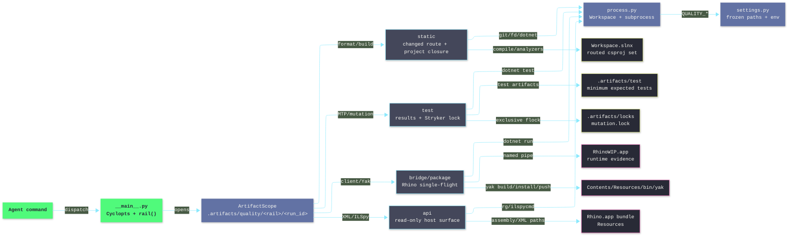

# [H1][QUALITY_OPERATOR]
>**Dictum:** *Independent rails make each quality claim explicit.*

<br>

[IMPORTANT] `tools.quality` is an agent-only CLI contract. Select one rail, run one proof, and report only evidence that rail owns.

Prefix all commands:

```bash
uv run python -m tools.quality <rail> <verb> [args]
```

Rails stay orthogonal: `static` never runs tests, `test` never opens Rhino, `bridge verify` never replaces `static build`, and `api` never launches Rhino.

---
## [1][RAIL_MAP]
>**Dictum:** *Rail ownership prevents false proof claims.*

<br>



<br>

| [INDEX] | [MODULE]           | [OWNERSHIP]                                            |
| :-----: | ------------------ | ------------------------------------------------------ |
|   [1]   | `__main__.py`      | Cyclopts tree, `rail()`, stdout payload/stderr log cut |
|   [2]   | `settings.py`      | `QualitySettings`, root anchor, env, artifact paths    |
|   [3]   | `process.py`       | `anyio` process execution, `dotnet`, `fd`, `git` index |
|   [4]   | `rails/static.py`  | changed-file route, C# whitespace, build proof         |
|   [5]   | `rails/test.py`    | MTP run/list/coverage, explicit Stryker mutation       |
|   [6]   | `rails/bridge.py`  | bridge client, scenario verify, bridge result decoding |
|   [7]   | `rails/package.py` | Yak metadata, atomic stage, deploy, publish            |
|   [8]   | `rails/api.py`     | Rhino bundle path, XML search, ILSpy type/decompile    |

---
## [2][COMMAND_SURFACE]
>**Dictum:** *Command syntax mirrors Cyclopts help output.*

<br>

Run from any path under the worktree. `QualitySettings.anchor()` walks parents until `Workspace.slnx`.

| [INDEX] | [RAIL]   | [COMMANDS]                                                                               | [CLAIM]                           |
| :-----: | -------- | ---------------------------------------------------------------------------------------- | --------------------------------- |
|   [1]   | `static` | `static check`, `static build`, `static full`                                            | Cleanup or compile/analyzer proof |
|   [2]   | `test`   | `test run`, `test list`, `test coverage`                                                 | Unit tests, coverage, mutation    |
|   [3]   | `bridge` | `bridge build-bridge`, `doctor`, `launch`, `quit`, `check`, `clean`, `verify`            | Live Rhino bridge evidence        |
|   [4]   | package  | `bridge package <slug> <version>`, `deploy <slug> <version>`, `publish <slug> <version>` | Yak package lifecycle             |
|   [5]   | `api`    | `api doctor`, `api path`, `api xml`, `api types`, `api decompile`                        | Host bundle metadata              |
|   [6]   | root     | `self-test`                                                                              | Tool/path preflight               |

`static` and `test` take positional `MODE`; Cyclopts also exposes `--mode`. `api` takes positional `OP`; flags are `--key`, `--kind`, `--pattern`, and `--type-name`.

Package scripts:
- `pnpm test:cs` -> `uv run python -m tools.quality test run`.
- `pnpm verify:rhino <pattern>` -> `uv run python -m tools.quality bridge verify <pattern>`.

---
## [3][STATIC_RAIL]
>**Dictum:** *Static rail separates cleanup from proof.*

<br>

[CRITICAL] `static check` runs whitespace format only. Analyzer and compile proof live in `static build` or `static full`.

| [INDEX] | [MODE]  | [BEHAVIOR]                                                                                    |
| :-----: | ------- | --------------------------------------------------------------------------------------------- |
|   [1]   | `check` | `dotnet format whitespace` on changed `.cs` files, grouped by owning project, no restore      |
|   [2]   | `build` | `restore Workspace.slnx --locked-mode`, then build routed project closure in `Debug`          |
|   [3]   | `full`  | Restore/build `Workspace.slnx`; `Debug` and `Release` unless `QUALITY_CONFIGURATIONS` narrows |

Route changed files from unstaged diff, staged diff, and untracked files:
- Ignore non-project fixture changes under `tests/tools/ast-grep/` and `tests/tools/py_analyzer/`.
- Force full scope for `Directory.Build.props`, `Directory.Build.targets`, `Directory.Packages.props`, `Workspace.slnx`, `.editorconfig`, `global.json`, and `tools/cs-analyzer/**`.
- Route `CS_SUFFIXES` by nearest owning `*.csproj`.
- Queue `.cs` files for whitespace format.
- Force full scope for orphan `.cs`, `.props`, and `.targets`.

Project selection:
- `changed` with no C#-relevant changes returns `skip` and exit `0`.
- `changed` with seeds expands reverse `ProjectReference` closure.
- `full` verifies `fd *.csproj` parity against `dotnet sln list`.

Run selection:
- Whitespace-only C# edit: `static check`.
- Semantic C# edit: `static build`.
- Solution, central package, global analyzer, or .NET runner config edit: `static full`.
- Comment-only or move-only edit: skip rails unless requested; prove with `git diff --check` plus movement evidence.

---
## [4][TEST_RAIL]
>**Dictum:** *Unit and mutation evidence stay explicit.*

<br>

MTP source: `global.json` uses `"runner": "Microsoft.Testing.Platform"`.

| [INDEX] | [MODE]     | [BEHAVIOR]                                                    |
| :-----: | ---------- | ------------------------------------------------------------- |
|   [1]   | `run`      | `dotnet test` with `--minimum-expected-tests 1`               |
|   [2]   | `list`     | MTP `--list-tests`                                            |
|   [3]   | `coverage` | Coverlet JSON + Cobertura with includes/excludes in `test.py` |

Targeting:
- Default project: `tests/csharp/libs/Rasm/Rasm.Tests.csproj`.
- `--target <csproj>` replaces `QUALITY_TEST_TARGET`.
- `--all` runs `Workspace.slnx`.
- Results path: `.artifacts/test/<slice>/<run_id>/`.

Filter mapping:
- Leading `/` -> `--filter-query`.
- Contains `=` -> `--filter-trait`.
- Suffix `Tests`, `Laws`, `Spec`, or contains `+` -> `--filter-class`.
- Contains `.` -> `--filter-method`.
- Otherwise -> wildcard method filter.

Mutation:
- Default `--mutation off`; no implicit mutation on `test run`.
- `changed` mutates changed `.cs` files under `libs/csharp/Rasm`.
- `full` mutates `**/*.cs` excluding `bin/` and `obj/`.
- Eligible only for the default `Rasm.Tests` + `libs/csharp/Rasm/Rasm.csproj` pair.
- Tool: `dotnet-stryker` `4.14.2`, MTP runner, thresholds `95/90/85`.
- Lock: `.artifacts/locks/mutation.lock`; live contention fails fast.

---
## [5][BRIDGE_PACKAGE_RAIL]
>**Dictum:** *Runtime proof requires one live Rhino boundary.*

<br>

[CRITICAL] Serialize `bridge verify`, `bridge check`, `bridge deploy`, and `bridge publish`. Static rails and unit tests may run concurrently; live Rhino and mutation must not overlap.

Bridge commands:
- `build-bridge` builds protocol, plugin, and client under `ArtifactScope`; it does not prime client `bin/`.
- `doctor`, `launch`, `quit`, `check`, and `clean` call `build_client` first, then `dotnet run --no-build`.
- `verify <pattern>` expires old reports, builds client, builds scenario kit, launches Rhino, runs each scenario through `check`, and emits one `VerifyReport` JSON.

Verify discovery order:
1. Direct `*.verify.csx` file.
2. Directory containing `*.verify.csx`.
3. Worktree glob; bare names expand as `**/<pattern>`.

Scenario owner rule:
- `tests/csharp/libs/<Name>/.../scenarios/*.verify.csx` maps to `libs/csharp/<Name>/<Name>.csproj` when present.
- Other scenarios use nearest owning project.

Verify artifacts:
- Reports: `.artifacts/rhino/verify/<run_id>/<scenario>.json`.
- Summary: `.artifacts/rhino/verify/<run_id>/summary.json`.
- Stdout JSON: one aggregate `VerifyReport`.
- Evidence markers: `rasm.rhino-bridge.evidence=facts=` and `rasm.rhino-bridge.capture=`.

Bridge exit codes:

| [INDEX] | [STATUS]          | [EXIT] | [INTERPRETATION]                                      |
| :-----: | ----------------- | -----: | ----------------------------------------------------- |
|   [1]   | `ok`, `skipped`   |      0 | Valid or intentionally skipped                        |
|   [2]   | `failed`          |      1 | Build, connect, execute, or scenario failure          |
|   [3]   | `unsupported`     |      3 | Often valid build proof for bare `.cs` without script |
|   [4]   | `busy`, `timeout` |      5 | Live Rhino contention or scenario timeout             |

Package commands:
- Resolve one `*.csproj` under `apps/` or `tools/` with matching `YakPackageSlug`.
- Validate `.rhp`, target dir, Yak platform `mac`, package glob `*-rh9_*-mac.yak`, and executable `yak`.
- Build artifact, copy manifest/package files, exclude host assemblies, run `yak build`, then atomically replace stage dir under `fcntl`.
- `package` prints stage path.
- `deploy` runs `yak install`; `rasm-bridge` also `quit`, `install`, `refresh`.
- `publish` runs deploy path plus `yak push` when `YakPushSource` exists.

---
## [6][API_RAIL]
>**Dictum:** *Host API truth comes from installed Rhino bundle files.*

<br>

API root: `Rhino.app/Contents/Frameworks/RhCore.framework/Versions/Current/Resources`.

| [INDEX] | [COMMAND]       | [BEHAVIOR]                                     |
| :-----: | --------------- | ---------------------------------------------- |
|   [1]   | `api doctor`    | JSON for Rhino version, ILSpy, RhinoCode, refs |
|   [2]   | `api path`      | Resolved assembly or XML path                  |
|   [3]   | `api xml`       | `rg -n -C 2` search over resolved XML          |
|   [4]   | `api types`     | `ilspycmd -l cisde` with optional text filter  |
|   [5]   | `api decompile` | `ilspycmd -t <type>`                           |

Keys:

| [INDEX] | [KEY]               | [ASSEMBLY]                                                | [XML]                                                     |
| :-----: | ------------------- | --------------------------------------------------------- | --------------------------------------------------------- |
|   [1]   | `rhino-common`      | `RhinoCommon.dll`                                         | `RhinoCommon.xml`                                         |
|   [2]   | `rhino-ui`          | `Rhino.UI.dll`                                            | `Rhino.UI.xml`                                            |
|   [3]   | `rhino-code`        | `Rhino.Runtime.Code.dll`                                  | none                                                      |
|   [4]   | `rhino-code-remote` | `Rhino.Runtime.Code.Remote.dll`                           | none                                                      |
|   [5]   | `eto`               | `Eto.dll`                                                 | `Eto.xml`                                                 |
|   [6]   | `gh2`               | `ManagedPlugIns/Grasshopper2Plugin.rhp/Grasshopper2.dll`  | `ManagedPlugIns/Grasshopper2Plugin.rhp/Grasshopper2.xml`  |
|   [7]   | `gh2-io`            | `ManagedPlugIns/Grasshopper2Plugin.rhp/GrasshopperIO.dll` | `ManagedPlugIns/Grasshopper2Plugin.rhp/GrasshopperIO.xml` |

ILSpy uses `_dotnet_apphost_env`: probe `dotnet --list-runtimes`, set `DOTNET_ROOT`, and force `DOTNET_MULTILEVEL_LOOKUP=0`. This is apphost setup, not MSBuild proof.

---
## [7][SETTINGS_ARTIFACTS]
>**Dictum:** *Environment and artifact paths define reproducibility.*

<br>

`QualitySettings` is frozen. It accepts `QUALITY_*` environment variables only. `QUALITY_RHINO_APP` sets the bundle directly; when unset, discovery uses `RHINO_WIP_APP_PATH`, then newest `/Applications/Rhino*.app`.

| [INDEX] | [VARIABLE]                         | [DEFAULT]                                     |
| :-----: | ---------------------------------- | --------------------------------------------- |
|   [1]   | `QUALITY_ROOT`                     | nearest parent containing `Workspace.slnx`    |
|   [2]   | `QUALITY_CONFIGURATION`            | `Release`                                     |
|   [3]   | `QUALITY_STATIC_CONFIGURATION`     | `Debug`                                       |
|   [4]   | `QUALITY_CONFIGURATIONS`           | unset; `build` uses `Debug`, `full` uses both |
|   [5]   | `QUALITY_DOTNET_MAX_CPU`           | `4`                                           |
|   [6]   | `QUALITY_TEST_TARGET`              | `tests/csharp/libs/Rasm/Rasm.Tests.csproj`    |
|   [7]   | `QUALITY_TEST_TIMEOUT_S`           | `300`                                         |
|   [8]   | `QUALITY_MUTATION_TIMEOUT_S`       | `1200`                                        |
|   [9]   | `QUALITY_MUTATION_MAX_CPU`         | `2`                                           |
|  [10]   | `QUALITY_SCENARIO_TIMEOUT_S`       | `180`                                         |
|  [11]   | `QUALITY_VERIFY_RETENTION_SECONDS` | `300`                                         |
|  [12]   | `QUALITY_RHINO_APP`                | newest `/Applications/Rhino*.app`             |
|  [13]   | `QUALITY_RUN_ID`                   | UTC timestamp + pid                           |

Artifact scope:
- `rail()` opens `.artifacts/quality/<rail>/<run_id>/` and isolated `DOTNET_CLI_HOME`.
- Static build verbs receive `--artifacts-path`; build servers remain enabled.
- Non-static build verbs also receive `--disable-build-servers` and `MSBUILDDISABLENODEREUSE=1`.
- Test results live under `.artifacts/test/<slice>/<run_id>/`.
- Mutation output lives under `.artifacts/mutation/<slice>/<run_id>/`.
- Verify reports live under `.artifacts/rhino/verify/<run_id>/` and expire by retention.

Unscoped canonical outputs:
- `build_client`, `build_scenario_kit`, Yak `_stage`, and `client_run` use canonical `bin/`.
- `static check` formatting uses default `bin/` semantics with `--no-restore`.
- `test` uses explicit result directories, not `--artifacts-path`.

I/O contract:
- `stderr`: structlog rows with `rail`, `phase`, `duration_ms`, and scenario summaries.
- `stdout`: machine payloads only: verify JSON, `api doctor` JSON, API text/path output, package stage path.

---
## [8][AGENT_ROUTING]
>**Dictum:** *Route by proof claim, not by habit.*

<br>

Use:
- `static check` for changed C# whitespace cleanup.
- `static build` for compile and analyzer proof on touched project closure.
- `static full` after solution, central package, global runner, `.editorconfig`, or analyzer changes.
- `test run [filter]` for unit proof.
- `test coverage` for coverlet evidence.
- `test run --mutation changed` for explicit mutation proof.
- `bridge verify <pattern>` for Rhino scenario proof.
- `bridge check <target> [scenario]` for live Rhino diagnostics.
- `api xml`, `api types`, or `api decompile` for host SDK truth.
- `bridge package|deploy|publish` for Yak plugin lifecycle.

Avoid:
- Treating `static check` as analyzer proof.
- Treating `bridge check <file.cs>` exit `3` as failure when build phase is valid and no scenario was supplied.
- Running `static build` after full-scope trigger files changed; use `static full`.
- Running `bridge verify` for pure unit behavior.
- Running raw `dotnet test` without the MTP mapping in `test.py`.
- Running mutation implicitly on every unit test pass.
- Copying plugins manually into `PlugIns`; use Yak package verbs.

Concurrency:
- Parallel allowed: `static check`, `static build`, `test run` with distinct `run_id`.
- Serialize: `bridge verify`, `bridge check`, `deploy`, `publish`, and mutation.

---
## [9][MAINTENANCE]
>**Dictum:** *Validation follows edited surface.*

<br>

Load `.claude/skills/coding-python/SKILL.md` before Python edits. Dependencies live in root `pyproject.toml`. Ruff/ty exception: `tools/quality/rails/package.py` ignores `possibly-missing-attribute` for POSIX `fcntl` stubs.

Python edits:

```bash
uv run pytest tests/tools/quality/test_quality.py -q
pnpm check:py
```

README or Mermaid edits:

```bash
git diff --check
pnpm exec mmdc -i tools/quality/README.md -a .artifacts/mermaid -q
```

Preflight:

```bash
uv run python -m tools.quality self-test
```

Required tools: `dotnet`, `fd`, `git`, `ilspycmd`, `rg`. Required files: `Workspace.slnx`, default test csproj, `.config/dotnet-tools.json`, executable `Contents/Resources/bin/yak`.
