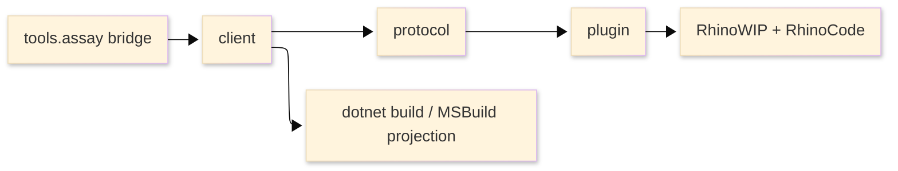

# [RHINO_BRIDGE]

> [!IMPORTANT]
> Use this bridge when static .NET validation is insufficient. It launches or connects to RhinoWIP, executes RhinoCode inside Rhino, and returns structured JSON for build, reference, runtime, host, and diagnostic evidence.

> [!CAUTION]
> Do not treat this bridge as a unit-test framework. Do not create artificial tests to prove code paths. Use it to validate real project files, source files, assemblies, and scripts against the Rhino coding environment.

## [1]-[PURPOSE]

The bridge answers one question: does current code build, reference, and execute correctly in RhinoWIP with RhinoCode, RhinoCommon, Grasshopper2, and repository assemblies resolved as Rhino sees them.

Use it for:
- Real diagnostics on `*.csproj` projects that target Rhino or Grasshopper.
- Source ownership checks for `*.cs` files through evaluated SDK projects.
- Explicit RhinoCode scripts that exercise current code through real Rhino APIs.
- Assembly freshness evidence for plugin and dependency resolution problems.
- Bridge health checks when runtime host facts are required.

Scripts are transient diagnostic entrypoints for current code and real Rhino APIs. They are not test cases, suites, or coverage probes.

Avoid it for:
- Synthetic unit-test suites.
- Mocked Rhino or Grasshopper behavior.
- Managed cleanup already covered by `uv run python -m tools.assay static fix`; compile/analyzer proof belongs to `uv run python -m tools.assay static build`.
- Long-running UI-thread experiments that require server-side cancellation.

## [2]-[ARCHITECTURE]



Text equivalent: `tools.assay bridge` routes commands into `client/`, then through `protocol/`, `plugin/`, and RhinoWIP with RhinoCode; the client also owns `dotnet build` and MSBuild projection.

| [INDEX] | [LAYER]  | [PATH]                      | [ROLE]                                      |
| :-----: | -------- | --------------------------- | ------------------------------------------- |
|   [1]   | Operator | `tools.assay bridge`        | Route commands; build client; stage Yak txn |
|   [2]   | Client   | `client/`                   | Resolve, build, phase JSON, named-pipe I/O  |
|   [3]   | Protocol | `protocol/`                 | Wire DTOs, status vocab, exit-code policy   |
|   [4]   | Plugin   | `plugin/`                   | Named-pipe server; RhinoCode on UI thread   |
|   [5]   | Endpoint | `~/.rasm/rhino-bridge.json` | Pipe, PID, version; not job/scenario data   |

## [3]-[COMMANDS]

Run commands from repository root. Prefix: `uv run python -m tools.assay`.

| [INDEX] | [COMMAND]                              | [INTENT]                                                  |
| :-----: | -------------------------------------- | --------------------------------------------------------- |
|   [1]   | `bridge build`                         | Build protocol, plugin, client (`Release`)                |
|   [2]   | `bridge launch`                        | Idempotent reuse or cold RhinoWIP launch — `[INTENT]` [2] |
|   [3]   | `bridge doctor`                        | Live Rhino, host runtime, scriptEngine, assembly paths    |
|   [4]   | `bridge check`                         | Bridge liveness probe                                     |
|   [5]   | `bridge clean`                         | Remove bridge crash and autosave state                    |
|   [6]   | `bridge quit`                          | Force-close bridge Rhino — `[INTENT]` [6]                 |
|   [7]   | `package stage --slug rasm-bridge --version <version>` | Build `.rhp`; stage local Yak package        |
|   [8]   | `package deploy --slug rasm-bridge --version <version>` | Install staged package; relaunch; health — `[INTENT]` [8] |
|   [9]   | `package publish --slug rasm-bridge --version <version>` | Package, local deploy, push Yak feed      |
|  [10]   | `bridge verify --pattern <scenario-or-glob>` | Scenario verify rail — `[INTENT]` [10]              |
|  [11]   | `api doctor [--strict]`                | RhinoWIP, ILSpy, RhinoCode, host keys, package keys, host and central package source inventory |
|  [12]   | `api resolve <key> [all\|assembly\|xml\|nuspec\|deps\|package-root]` | Resolved managed, native, build, analyzer, and tool assets |
|  [13]   | `api query --key <key> --symbol <symbol>` | Type or member report; bounded preview and full source artifacts |
|  [14]   | `api show <artifact-or-symbol>`        | Saved-artifact preview; `--full` returns content inside `Envelope.data` |

[INTENT]
- [2] Before cold open, clears macOS recovery markers (`.rhl`/doc autosave, `Rhinoceros-*.ips`) so unclean exit never blocks headless launch with a recovery dialog.
- [6] Marks open documents clean; exits without save prompt; escalates `SIGTERM`→`SIGKILL` if unreachable; `ok` when no live endpoint.
- [8] Skips automated quit when no live endpoint; retires stale `~/.rasm/rhino-bridge.json` before relaunch.
- [10] Resolves scenarios and routes execution through the bridge client; report artifacts are emitted through the Assay envelope.

### [3.1]-[PRIMARY_USAGE]

Validate bridge health:

```bash copy-safe
uv run python -m tools.assay bridge doctor
uv run python -m tools.assay bridge check
```

Expected result: one Assay `Envelope` per command with `"status": "ok"` when the live bridge is healthy.

Validate an existing task-relevant RhinoCode scenario:

```bash copy-safe
uv run python -m tools.assay bridge verify --pattern <scenario.verify.csx>
```

Expected result: `"status": "ok"` when each matched scenario compiles against bridge-generated `#r` directives from host-filtered runtime references and exercises real Rhino behavior. Scenarios must not contain `#r`, `#load`, or absolute build-output paths.

Library scenarios live under `tests/csharp/libs/<Project>/<MirrorPath>/scenarios/`. The operator script maps that convention to `libs/csharp/<Project>/<Project>.csproj` without manifests or scenario catalogs.

Verify local API metadata:

```bash copy-safe
uv run python -m tools.assay api doctor
```

Expected result: one Assay `Envelope` with RhinoWIP app version, ILSpy host status, RhinoCode direct and roll-forward status, host keys, package keys, and artifact paths.

Inspect host/package API truth:

```bash copy-safe
uv run python -m tools.assay api doctor
uv run python -m tools.assay api query --key rhino-common --symbol Rhino.Geometry.Mesh
uv run python -m tools.assay api query --key gh2 --symbol Document
```

Expected result: compact JSON with ranked preview records and direct artifact paths. Current RhinoWIP includes RhinoCommon, GH2, and GH2-IO XML. Rhino.UI XML is absent; `api query` decompiles via ILSpy when XML is missing.

Inspect Rhino UI metadata when XML is absent:

```bash copy-safe
uv run python -m tools.assay api resolve rhino-ui assembly
uv run python -m tools.assay api query --key rhino-ui --symbol Rhino.UI.DataSerializer
```

Expected result: compact JSON plus bounded inline preview and `decompile.cs` artifacts from ILSpy using a normalized .NET apphost environment. Use `api show <artifact-or-symbol>` for follow-up inspection.

Default API commands do not print broad query/decompile streams. Inspect `artifact_paths` or run `api show <artifact-or-symbol> --full`; stdout remains one JSON Envelope.

### [3.2]-[OPTIONS]

The client surface is intentionally minimal — defaults are env-driven and constant.

| [INDEX] | [OPTION]          | [USE]                                    |
| :-----: | ----------------- | ---------------------------------------- |
|   [1]   | `--result <path>` | Override auto-generated JSON report path |

Environment overrides:

| [INDEX] | [VARIABLE]                         | [USE]                                                 |
| :-----: | ---------------------------------- | ----------------------------------------------------- |
|   [1]   | `RHINO_WIP_APP_PATH`               | RhinoWIP bundle for launch + MSBuild — `[ENV]` [1]    |
|   [2]   | `CONFIGURATION`                    | Check build config (default `Release`)                |
|   [3]   | `RASM_BRIDGE_CONNECT_TIMEOUT_S`    | Cold connect deadline sec (default `90`)              |
|   [4]   | `RASM_BRIDGE_TRANSPORT_TIMEOUT_S`  | Warm transport deadline sec (default `35`)            |

[ENV]
- [1] Launch fails loud when unset; set this to the RhinoWIP bundle used by MSBuild and the bridge client.

Every bridge timeout follows one env-overridable rule — `RASM_BRIDGE_<NAME>_TIMEOUT_S` (seconds, positive) for `HELLO`, `CONNECT`, `TRANSPORT`, `QUIT_WAIT`, `HANDSHAKE`, and `IDLE_DISPATCH`.

## [4]-[OUTPUT_CONTRACT]

Top-level fields:
- `schema`: wire contract. Current value: `rasm.rhino-bridge.v1`.
- `command`: client command.
- `status`: worst decisive phase status.
- `reportPath`: saved report path when the command writes an artifact.
- `phases`: ordered phase evidence.
- `fault`: top-level failure when authoritative phases fail, time out, are busy, or are unsupported.

`bridge verify <scenario-or-glob>` emits aggregate JSON with `summary`, `report_dir`, `expires_in_seconds`, `first_failure`, and `scenarios`. It does not fail fast; `first_failure` lifts the earliest non-`ok` scenario to the report root while preserving all scenario evidence.

Read order:
1. Inspect top-level `status`.
2. Inspect top-level `fault.category` and `fault.message` when present.
3. Inspect `execute.data.returnValue` when a script emits structured evidence.
4. Inspect failed or unsupported `phases[]`.
5. Inspect `diagnostics`, `outputs[].text`, `outputs[].truncated`, `outputs[].length`, and `outputs[].limit`.

Decisive phase policy:
- Required failures from `resolve`, `build`, `connect`, and applicable `execute` phases drive top-level `status`.
- Skipped `lifecycle` phases document non-applicable work and do not weaken top-level status.
- `check <source.cs>` without a scenario remains top-level `unsupported` after successful ownership and build evidence.

Status policy:

| [INDEX] | [STATUS]      |     [EXIT] | [MEANING]                                         |
| :-----: | ------------- | ---------: | ------------------------------------------------- |
|   [1]   | `ok`          |          0 | Command succeeded                                 |
|   [2]   | `unsupported` |          3 | Valid request; no runtime action                  |
|   [3]   | `busy`        |          5 | Bridge already serves another client              |
|   [4]   | `timeout`     |          5 | Client transport wait expired                     |
|   [5]   | `failed`      |          1 | Build, protocol, execute, or diagnostic failure   |
|   [6]   | `skipped`     | phase-only | Phase did not run; prior state made it irrelevant |

Phase expectations:
- `resolve`: file/project ownership, workspace root, command path validity, MSBuild owner-evaluation evidence.
- `build`: real `dotnet restore`, `dotnet build`, MSBuild projection, target and references.
- `launch`: existing bridge reuse or RhinoWIP launch evidence.
- `connect`: named-pipe hello round trip with endpoint metadata.
- `execute`: RhinoCode execution report, stdout/stderr, diagnostics, Rhino document facts, and optional script return JSON.
- `diagnostics`: RhinoCode compile diagnostics when available.
- `lifecycle`: quit/restart status.

Output blocks include `source`, `text`, `truncated`, `length`, and `limit`. Treat `truncated: true` as machine-actionable loss of detail. Parse `outputs[]` by `source`: `execute` emits `stdout` and `stderr` (the script's console streams) plus `rhino.command` — the Rhino command-window history captured around execution via `RhinoApp.CommandWindowCaptureEnabled` with `CapturedCommandWindowStrings`/`CommandHistoryWindowText`, surfacing native command echoes a script triggers. Process-spawning phases (`resolve`, `build`) emit `process.stdout`/`process.stderr`. Every successful `execute` carries a `rhino.command` block (empty when no command ran).

### [4.1]-[SCRIPT_RETURNS]

Scripts can return structured agent evidence by writing one stdout line:

```csharp conceptual
Console.WriteLine("rasm.rhino-bridge.return=" + JsonSerializer.Serialize(receipt));
```

The plugin preserves raw stdout and parses the last line with this prefix into `execute.data.returnValue`. Missing return lines are valid. Malformed return JSON fails `execute` with `fault.category = "return"`.

Runtime checks force RhinoCode C# `csharp.resolver.isolate = true` and `CachePolicy.NeverCache`. Script references load through RhinoCode's collectible Roslyn context instead of Rhino's default host context, so other installed plugins cannot poison package identity for `LanguageExt`, `Thinktecture`, or rebuilt repo assemblies. Every execute report includes `execute.data.rhinoCode`; project smoke scripts also emit `returnValue.kind = "assemblyFreshness"` with target-location evidence, `dependencyCollisions` for watched packages (`LanguageExt.Core`, `FSharp.Core`, `Thinktecture.Runtime.Extensions`), `collisionDetected`, and `resolverIsolated = true`.

The Rhino-loaded bridge boundary is dependency-free outside RhinoWIP host assemblies and the local protocol DLL. `rasm-bridge.rhp` and `Rasm.RhinoBridge.Protocol.dll` do not package `LanguageExt.Core` or `Thinktecture.Runtime.Extensions`; this prevents Rhino's shared plugin load context from binding other plugins to Rasm's functional-library versions.

### [4.2]-[BRIDGE_MARKERS]

Scenarios and smoke probes emit structured evidence as **bridge markers** — line-oriented stdout records prefixed `rasm.rhino-bridge.`. The plugin captures stdout, leaves raw text in `execute.outputs[].text`, and the canonical parser is `Rasm.RhinoBridge.Protocol.BridgeMarker.Scan(string stdout) -> IReadOnlyList<BridgeMarker>` (in the protocol assembly, also published in the agent reference set).

Marker kinds:

| [INDEX] | [PREFIX]                      | [VARIANT]               | [PAYLOAD]                                    |
| :-----: | ----------------------------- | ----------------------- | -------------------------------------------- |
|   [1]   | `rasm.rhino-bridge.return=`   | `Returned(JsonElement)` | Final return JSON; last wins → `returnValue` |
|   [2]   | `rasm.rhino-bridge.evidence=` | `Evidence(Key, Value)`  | Fact carriers; opaque `Value` per key        |
|   [3]   | `rasm.rhino-bridge.capture=`  | `Capture(Path, W, H)`   | PNG path + dimensions                        |
|   [4]   | `rasm.rhino-bridge.nonce=`    | `Nonce(Value)`          | Smoke-probe handshake nonce                  |

Fact emission contract. `Rasm.TestKit.Scenarios.Scenario.Run(theme, capturePath, body)` emits per scenario:

1. One `scenario={theme}` plain line (no prefix).
2. One `capture={capturePath}` plain line (no prefix).
3. The scenario body populates a `FactBag` via `facts.Add(string key, object value)` (statement form, no return value).
4. On scope exit the harness emits exactly one `facts={json}` plain line **AND** one `rasm.rhino-bridge.evidence=facts={json}` prefixed marker. Both carry the same JSON-serialized `IReadOnlyDictionary<string, object>` payload.

Marker consumption. The prefixed `Evidence("facts", json)` marker is the structured source of truth. The plain `facts={json}` line is human-readable duplicate output. Use `BridgeMarker.Scan(stdout)`, filter on `Evidence` cases, and deserialize `Evidence.Value` as a `Dictionary<string, JsonElement>` for typed fact access.

## [5]-[REFERENCE_POLICY]

Host assemblies (`RhinoCommon`, `Rhino.UI`, `Eto`, `Grasshopper2`, `GrasshopperIO`, `RhinoCodePlatform.Rhino3D`, `Microsoft.macOS`, `System.Drawing.Common`) resolve from the installed RhinoWIP app bundle via `Directory.Build.props` HintPaths under `$(RhinoWipResourcesPath)` with `Private=false` — never from NuGet. The bundle path is the newest installed `/Applications/Rhino*.app` (see `RHINO_WIP_APP_PATH`), so compile and runtime bind the same versions Rhino loads; `bridge doctor` reports the resolved versions and paths.

The client emits runtime reference projections from one evaluated project build, then applies them by prepending `#r` directives to the generated RhinoCode script before submission — references are client-applied, not plugin-applied. References are ordered dependency-first: `FSharp.Core`, `LanguageExt.Core`, `Thinktecture.Runtime.Extensions`, transitive packages, `Rasm.dll`, scenario kit assemblies, then the target assembly last. Scenario scripts also receive a bridge-owned base using-set (`ScenarioBaseUsings`: `LanguageExt`, `static LanguageExt.Prelude`, `Rasm.TestKit.Scenarios`) so authors drop that repeated preamble, plus a LanguageExt `HashMap` bootstrap so trait resolution completes before staged Rasm code touches custom `HashMap` keys under RhinoCode's isolated resolver. **Grasshopper-aware projects** (`IsGrasshopperAwareProject` or a `Grasshopper2.dll` reference) additionally receive bridge-owned `ScenarioHostUsings` (`Eto.Drawing`) after the scenario preamble, and the bridge pre-loads Grasshopper2 (`BridgeWire.GrasshopperPluginId`, via `PlugIn.LoadPlugIn` on the UI thread before execution) into the default ALC so GH2-backed `Rasm.Grasshopper.UI` rails resolve at runtime — host assemblies stay off `#r`. **Drive GH2 through `Rasm.Grasshopper.UI` wrapper types, not raw `Grasshopper2.*` types in scenario bodies**: a direct `using Grasshopper2.*` needs GH2 as a compile reference, and supplying it (`#r "Grasshopper2"`) forces the isolated resolver to bind a *separate* GH2 instance whose editor/canvas singletons differ from the host's, breaking runtime state. Scenarios that must construct raw GH2 input types cannot run under the isolated resolver. **Rasm.Rhino HashMap policy:** use primitive, `string`, `Guid`, `uint`/`ulong`, or built-in value-tuple keys only in bridge-hot assemblies; do not use custom record-struct keys (for example `PreviewFingerprint`) inside `HashMap<,>` — they fail under isolated resolver trait warmup even when reference order is correct. Project/source scenario references are shadow-copied into artifact `refs/<content-hash>/` folders so repeated checks see fresh assembly paths without scenario-owned machine paths. The `#r`-applied set is echoed in `BridgeExecuteRequest.References` and the execute report as provenance metadata; the plugin does not re-resolve that field independently during execution.

API metadata lookup uses local sources in this order:
1. RhinoWIP app-bundle XML when present. RhinoCommon, GH2, and GH2-IO XML are the ordinary XML-backed surfaces; assemblies without XML route through decompile.
2. `api query` decompiles via `ilspycmd` for assemblies without XML, for example `Rhino.UI.dll` and `Eto.dll`.
3. `api doctor` reports `rhinocode` CLI availability as environment evidence only; the in-process `execute` rail, not the CLI, is the runtime authority.

| [INDEX] | [REFERENCE_SET]                   | [USE]                                                                 |
| :-----: | --------------------------------- | --------------------------------------------------------------------- |
|   [1]   | `RuntimeReferences`               | Runtime assets excl. target; smoke loads target from `targetLocation` |
|   [2]   | `HostFilteredRuntimeReferences`   | Project/source scripts; excl. host assemblies already in Rhino        |
|   [3]   | `BridgeExecuteRequest.References` | Execute provenance metadata; not plugin-applied refs                  |

> [!CAUTION]
> Do not document `check <source.cs> <script.csx>` as compile-reference based until the client owns a real compile-reference projection and the plugin applies it authoritatively.

## [6]-[FAILURE_READING]

| [INDEX] | [SIGNAL]                      | [READ_AS]                          | [NEXT_ACTION]                                                        |
| :-----: | ----------------------------- | ---------------------------------- | -------------------------------------------------------------------- |
|   [1]   | `build` failed                | MSBuild/analyzer failure           | Fix C#/project config before Rhino                                   |
|   [2]   | `resolve` owner-eval failure  | MSBuild ownership data missing     | Read `failures[]` (path, command, exit, outputs, fault); fix eval    |
|   [3]   | `connect` failed              | Stale or missing bridge            | `bridge launch`/`doctor`; check `~/.rasm/rhino-bridge.json`          |
|   [4]   | `execute` diagnostics         | RhinoCode compile/runtime failure  | Fix `diagnostics`, `fault.stackTrace`                                |
|   [5]   | external package collision    | Different same-name package loaded | Isolated refs; inspect `execute` if scenario still fails             |
|   [6]   | `loadedLocation=none`         | No path-backed load location       | Expect `targetAssembly.Location`; treat as missing identity evidence |
|   [7]   | `unsupported` source check    | Valid build; no scenario supplied  | Add scenario only when runtime Rhino evidence needed                 |
|   [8]   | `ilspycmd` apphost failure    | Bad `DOTNET_ROOT`/hostfxr          | `api doctor`; fix apphost env — not MSBuild/Rhino refs               |
|   [9]   | `execute` script-engine fault | RhinoCode language start failure   | Check `doctor.hostRuntime`; rebuild plugin for current bundle        |

## [7]-[UPDATE_RULES]

> [!IMPORTANT]
> 1. Preserve architecture: operator script -> client -> protocol -> Rhino plugin.
> 2. Keep protocol DTOs and status policy in `BridgeWire`.
> 3. Keep client output concise; include raw MSBuild item JSON only for parse failures or explicit debug output.
> 4. Keep RhinoCode compile diagnostics sourced from `ExecuteException.TryGetCompileException` and `CompileException.Diagnosis`.
> 5. Keep `--timeout-ms` described as client transport timeout. Rhino UI-thread execution is not server-cancelable.

> [!CAUTION]
> - Never hardcode project discovery for packages. Use evaluated `YakPackageSlug` project metadata.
> - Never put `#r`, `#load`, or absolute build-output paths in scenarios. The bridge owns references.
> - Never imply `check <source.cs>` executes runtime behavior without an explicit scenario.
> - Never treat reported `BridgeExecuteRequest.References` as plugin-applied execution state.
> - Never run bridge RhinoCode checks without isolated C# reference resolution and cache-free execution.
> - Never add temp-only scripts, generated tests, or fake probes as bridge purpose.
- Never automate Rhino settings or templates from this repository.

## [8]-[RUNTIME_BOUNDARIES]

Live Rhino commands, `bridge verify`, package live steps, and package staging are fail-fast exclusive. Never queue live Rhino commands behind each other; a busy lease means retry later or pick another proof.

Focused bridge implementation changes route through the matching runtime owner: reference projection, reference isolation, packaging, or transport. Use the command table above to select the narrow bridge/API/package command that owns the runtime fact.
