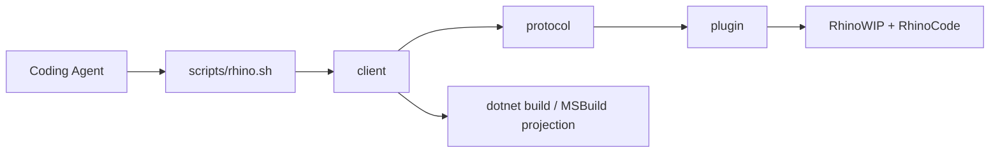

# [H1][RHINO_BRIDGE]
>**Dictum:** *Bridge commands return Rhino-hosted diagnostics for real C# and Grasshopper code.*

<br>

[IMPORTANT] Use this bridge when static .NET validation is insufficient. It launches or connects to RhinoWIP, executes RhinoCode inside Rhino, and returns structured JSON that coding agents can parse for build, load, runtime, host, and diagnostic evidence.

[CRITICAL] Do not treat this bridge as a unit-test framework. Do not create artificial tests to prove code paths. Use it to validate real project files, source files, assemblies, and scripts against the Rhino coding environment.

---
## [1][PURPOSE]
>**Dictum:** *Rhino behavior is authoritative only inside Rhino.*

<br>

The bridge answers one question: does current code build, load, reference, and execute correctly in RhinoWIP with RhinoCode, RhinoCommon, Grasshopper2, and repository assemblies resolved as Rhino sees them.

Use it for:
- Real diagnostics on `*.csproj` projects that target Rhino or Grasshopper.
- Source ownership checks for `*.cs` files through evaluated SDK projects.
- Explicit RhinoCode scripts that exercise current code through real Rhino APIs.
- Assembly load evidence for plugin and dependency resolution problems.
- Bridge health checks when agents need Rhino runtime facts before editing code.

Scripts are transient diagnostic entrypoints for current code and real Rhino APIs. They are not test cases, suites, or coverage probes.

Avoid it for:
- Synthetic unit-test suites.
- Mocked Rhino or Grasshopper behavior.
- Pure C# analyzer failures already covered by `bash scripts/check-cs.sh check`.
- Long-running UI-thread experiments that require server-side cancellation.

---
## [2][ARCHITECTURE]
>**Dictum:** *Each layer owns one boundary.*

<br>



<br>

| [INDEX] | [LAYER] | [OWNER] | [RESPONSIBILITY] |
| :-----: | ------- | ------- | ---------------- |
| **1** | Operator CLI | `scripts/rhino.sh` | Routes bridge/package commands, builds client deterministically, stages Yak packages transactionally. |
| **2** | Client | `tools/rhino-bridge/client` | Resolves projects, builds code, formats phase JSON, talks to Rhino named pipe. |
| **3** | Protocol | `tools/rhino-bridge/protocol` | Defines wire DTOs, status vocabulary, exit-code policy, endpoint metadata. |
| **4** | Plugin | `tools/rhino-bridge/plugin` | Runs in Rhino, owns named pipe server, executes RhinoCode on Rhino UI thread. |
| **5** | Endpoint | `~/.rasm/rhino-bridge.json` | Records live pipe name, Rhino PID, Rhino version, bridge identity; not job or scenario data. |

---
## [3][COMMANDS]
>**Dictum:** *Commands map to diagnostic intent.*

<br>

Run commands from repository root.

| [INDEX] | [COMMAND] | [INTENT] |
| :-----: | --------- | -------- |
| **1** | `scripts/rhino.sh bridge build` | Build protocol, plugin, and client in `Release`. |
| **2** | `scripts/rhino.sh bridge launch` | Open RhinoWIP and verify endpoint round trip. |
| **3** | `scripts/rhino.sh bridge doctor` | Report live Rhino, plugin, required assemblies, and sessions. |
| **4** | `scripts/rhino.sh bridge restart` | Lifecycle diagnostic for safe manual bridge reloads. |
| **5** | `scripts/rhino.sh bridge check <target> [scenario.csx]` | Build or execute the target through the agent-first RhinoCode lane. |
| **6** | `scripts/rhino.sh bridge clean <target>` | Remove generated bridge check reports for one target. |
| **7** | `scripts/rhino.sh bridge load <assembly.dll>` | Diagnostic-only load into a bridge session. |
| **8** | `scripts/rhino.sh bridge load-smoke <assembly.dll>` | Diagnostic-only load in a collectible session and unload it. |
| **9** | `scripts/rhino.sh bridge unload <session-id>` | Diagnostic-only unload for explicit bridge load sessions. |
| **10** | `scripts/rhino.sh bridge quit` | Lifecycle-only safe Rhino exit when open documents have no unsaved changes. |
| **11** | `scripts/rhino.sh package rasm-bridge <version>` | Build bridge `.rhp`, run Yak in staged directory, and create a local package. |
| **12** | `scripts/rhino.sh deploy rasm-bridge <version>` | Install the staged bridge package, refresh RhinoWIP, and verify bridge health. |
| **13** | `scripts/rhino.sh verify <scenario-or-glob>` | Convenience rail for source-only scenarios; resolves owning project, routes through `bridge check`. |
| **13** | `scripts/rhino.sh api doctor` | Report local RhinoWIP API XML, ILSpy, and RhinoCode metadata availability. |
| **14** | `scripts/rhino.sh api path <key> [assembly\|xml]` | Print the resolved assembly or XML path for an API reference key. |
| **15** | `scripts/rhino.sh api xml <key> <pattern>` | Search the resolved XML documentation with `rg`. |
| **16** | `scripts/rhino.sh api types <key> [pattern]` | List assembly types through ILSpy, optionally filtered by pattern. |
| **17** | `scripts/rhino.sh api decompile <key> <type>` | Decompile a type through ILSpy for assemblies without XML. |

### [3.1][PRIMARY_USAGE]

Validate real Grasshopper project:

```bash
scripts/rhino.sh bridge check apps/grasshopper/Radyab/Radyab.csproj
```

Expected result: JSON with top-level `"status": "ok"` and successful `resolve`, `build`, `connect`, and `execute` phases. Treat `rhinoCodeCli` as supplemental environment evidence; in-process `execute` is authoritative Rhino evidence.

Validate source ownership without runtime script:

```bash
scripts/rhino.sh bridge check apps/grasshopper/Radyab/Components/ExtractPoints.cs
```

Expected result: exit code `3`, top-level `"status": "unsupported"`, `build` phase `"ok"`, and message `Source build validated; no runtime script supplied.`

Validate source with an existing task-relevant RhinoCode script:

```bash
scripts/rhino.sh bridge check <real-source.cs> <scenario.verify.csx>
```

Expected result: `"status": "ok"` when the scenario compiles against bridge-generated `#r` directives from host-filtered runtime references and exercises real Rhino behavior. Scenarios must not contain `#r`, `#load`, or absolute build-output paths.

Library scenarios live under `tests/csharp/libs/<Project>/<MirrorPath>/scenarios/`. The operator script maps that convention to `libs/csharp/<Project>/<Project>.csproj` without manifests or scenario catalogs.

Verify local API metadata:

```bash
scripts/rhino.sh api doctor
```

Expected result: tab-separated evidence for RhinoWIP app version, ILSpy host status, RhinoCode direct and roll-forward status, and each API key's assembly/XML state.

Search Grasshopper2 XML:

```bash
scripts/rhino.sh api xml gh2 IDataAccess
```

Expected result: `rg` matches from the resolved `Grasshopper2.xml` path.

Inspect Rhino UI metadata when XML is absent:

```bash
scripts/rhino.sh api decompile rhino-ui Rhino.UI.DataSerializer
```

Expected result: decompiled C# from `Rhino.UI.dll` through ILSpy using a normalized .NET apphost environment.

### [3.2][OPTIONS]

Common client options:

| [INDEX] | [OPTION] | [USE] |
| :-----: | -------- | ----- |
| **1** | `--configuration <name>` | Build configuration used by project checks. |
| **2** | `--worktree <path>` | Repository root for project/source resolution. |
| **3** | `--timeout-ms <ms>` | Client transport timeout; Rhino UI-thread execution is not server-cancelable. |
| **4** | `--result <path>` | Override the automatically generated structured JSON report path. |

Environment overrides:

| [INDEX] | [VARIABLE] | [USE] |
| :-----: | ---------- | ----- |
| **1** | `RHINO_WIP_APP_PATH` | Launch a specific RhinoWIP app bundle. |
| **2** | `RHINO_WIP_BUNDLE_ID` | Launch RhinoWIP by bundle identifier. |

---
## [4][OUTPUT_CONTRACT]
>**Dictum:** *JSON phases are the diagnostic interface.*

<br>

Top-level fields:
- `schema`: wire contract. Current value: `rasm.rhino-bridge.v1`.
- `command`: client command.
- `status`: worst decisive phase status.
- `reportPath`: saved report path when the command writes an artifact.
- `phases`: ordered phase evidence.
- `fault`: top-level failure when authoritative phases fail, time out, are busy, or are unsupported.

Read order:
1. Inspect top-level `status`.
2. Inspect top-level `fault.category` and `fault.message` when present.
3. Inspect `execute.data.returnValue` when a script emits structured evidence.
4. Inspect failed or unsupported `phases[]`.
5. Inspect `diagnostics`, `outputs[].text`, `outputs[].truncated`, `outputs[].length`, and `outputs[].limit`.
6. Treat `rhinoCodeCli` failure as non-authoritative when in-process `execute` succeeds.

Decisive phase policy:
- Required failures from `resolve`, `build`, `connect`, and applicable `execute` phases drive top-level `status`.
- Supplemental `rhinoCodeCli` evidence remains visible but does not override successful in-process `execute`.
- Skipped `load`, `unload`, and `lifecycle` phases document non-applicable work and do not weaken top-level status.
- `check <source.cs>` without a scenario remains top-level `unsupported` after successful ownership and build evidence.

Status policy:

| [INDEX] | [STATUS] | [EXIT] | [MEANING] |
| :-----: | :------: | -----: | --------- |
| **1** | `ok` | 0 | Command completed successfully. |
| **2** | `unsupported` | 3 | Request is valid, but no runtime action applies. |
| **3** | `busy` | 5 | Live bridge already handles another client. |
| **4** | `timeout` | 5 | Client transport wait expired. |
| **5** | `failed` | 1 | Build, protocol, load, execute, or diagnostic failure. |
| **6** | `skipped` | phase-only | Phase intentionally did not run because prior state made it irrelevant. |

Phase expectations:
- `resolve`: file/project ownership, workspace root, command path validity, MSBuild owner-evaluation evidence.
- `build`: real `dotnet restore`, `dotnet build`, MSBuild projection, target and references.
- `launch`: existing bridge reuse or RhinoWIP launch evidence.
- `connect`: named-pipe hello round trip with endpoint metadata.
- `rhinoCodeCli`: supplemental external `rhinocode list --json` probe; `DOTNET_ROLL_FORWARD=Major` fallback is intentional.
- `load`: collectible load session only for explicit load commands.
- `execute`: RhinoCode execution report, stdout/stderr, diagnostics, Rhino document facts, and optional script return JSON.
- `diagnostics`: RhinoCode compile diagnostics when available.
- `unload`: collectible session unload evidence.
- `lifecycle`: quit/restart status.

Output blocks include `source`, `text`, `truncated`, `length`, and `limit`. Treat `truncated: true` as machine-actionable loss of detail.

### [4.1][SCRIPT_RETURNS]

Scripts can return structured agent evidence by writing one stdout line:

```csharp
Console.WriteLine("rasm.rhino-bridge.return=" + JsonSerializer.Serialize(receipt));
```

The plugin preserves raw stdout and parses the last line with this prefix into `execute.data.returnValue`. Missing return lines are valid. Malformed return JSON fails `execute` with `fault.category = "return"`.

Runtime checks force RhinoCode C# `csharp.resolver.isolate = true` and `CachePolicy.NeverCache`. Script references load through RhinoCode's collectible Roslyn context instead of Rhino's default host context, so other installed plugins cannot poison package identity for `LanguageExt`, `Thinktecture`, or rebuilt repo assemblies. Every execute report includes `execute.data.rhinoCode`; project smoke scripts also emit `returnValue.kind = "assemblyFreshness"` with exact target-location evidence and `resolverIsolated = true`.

---
## [5][REFERENCE_POLICY]
>**Dictum:** *Reference sets differ by execution mode.*

<br>

The client emits runtime reference projections from one evaluated project build. Generated RhinoCode scripts apply references by prepending `#r` directives before submission. Project/source scenario references are shadow-copied into artifact `refs/<content-hash>/` folders so repeated checks see fresh assembly paths without scenario-owned machine paths. `BridgeExecuteRequest.References` is reported metadata today; the plugin does not independently apply that field during execution.

API metadata lookup uses local sources in this order:
1. RhinoWIP app-bundle XML for `RhinoCommon`, `Grasshopper2`, and `GrasshopperIO`.
2. Repo NuGet cache XML only when app-bundle XML is missing, especially `Eto.xml`.
3. ILSpy metadata/decompilation for assemblies without XML, especially `Rhino.UI.dll`.
4. RhinoCode CLI only as supplemental environment evidence; in-process bridge execution remains runtime authority.

| [INDEX] | [REFERENCE_SET] | [USE] |
| :-----: | --------------- | ----- |
| **1** | `RuntimeReferences` | Runtime assets excluding target assembly; smoke scripts load target directly from `targetLocation`. |
| **2** | `HostFilteredRuntimeReferences` | Project smoke and source scripts; excludes Rhino, Grasshopper, and bridge host assemblies already present in Rhino. |
| **3** | `BridgeExecuteRequest.References` | Execution provenance/report metadata; not a plugin-applied reference mechanism. |

[CRITICAL] Do not document `check <source.cs> <script.csx>` as compile-reference based until the client owns a real compile-reference projection and the plugin applies it authoritatively.

---
## [6][FAILURE_READING]
>**Dictum:** *Failures identify the boundary that produced evidence.*

<br>

| [INDEX] | [SIGNAL] | [READ_AS] | [NEXT_ACTION] |
| :-----: | -------- | --------- | ------------- |
| **1** | `build` failed | Managed compile/analyzer/MSBuild failure. | Fix C# or project configuration before Rhino work. |
| **2** | `resolve` owner-evaluation failure | A tracked project could not produce MSBuild ownership data. | Inspect `failures[].projectPath`, `failures[].command`, `exitCode`, `outputs`, and `fault`; fix evaluation before trusting ownership. |
| **3** | `connect` failed | RhinoWIP bridge unavailable or stale endpoint. | Run `bridge launch` or `bridge doctor`; inspect `~/.rasm/rhino-bridge.json`. |
| **4** | `rhinoCodeCli` failed | Supplemental RhinoCode CLI probe unavailable or roll-forward failure. | Inspect the phase, but trust successful in-process `execute` as authoritative. |
| **5** | `execute` diagnostics | RhinoCode compile/runtime failure inside Rhino. | Use `diagnostics` and `fault.stackTrace`; fix real code. |
| **6** | external package collision | Another Rhino plugin has loaded a different same-name package. | `check` uses isolated RhinoCode references; inspect `execute` only if a real scenario still fails. |
| **7** | `loadedLocation=none` | Target assembly loaded without a path-backed location. | Treat as missing post-load identity evidence; normal fresh loads report `targetAssembly.Location`. |
| **8** | `unsupported` source check | Source build is valid, but no runtime scenario was supplied. | Add a scenario path only when runtime behavior needs Rhino evidence. |
| **9** | `ilspycmd` apphost failure | Effective `DOTNET_ROOT` does not point at a hostfxr/runtime root. | Use `api doctor`; fix apphost environment, not `Directory.Build.props` or Rhino references. |

---
## [7][UPDATE_RULES]
>**Dictum:** *Bridge changes preserve diagnostic truth before convenience.*

<br>

[IMPORTANT]:
1. Preserve architecture: operator script -> client -> protocol -> Rhino plugin.
2. Keep protocol DTOs and status policy in `BridgeWire`.
3. Keep client output concise; include raw MSBuild item JSON only for parse failures or explicit debug output.
4. Keep RhinoCode compile diagnostics sourced from `ExecuteException.TryGetCompileException` and `CompileException.Diagnosis`.
5. Keep `--timeout-ms` described as client transport timeout. Rhino UI-thread execution is not server-cancelable.

[CRITICAL]:
- Never hardcode project discovery for packages. Use evaluated `YakPackageSlug` project metadata.
- Never put `#r`, `#load`, or absolute build-output paths in scenarios. The bridge owns references.
- Never imply `check <source.cs>` executes runtime behavior without an explicit scenario.
- Never treat reported `BridgeExecuteRequest.References` as plugin-applied execution state.
- Never run bridge RhinoCode checks without isolated C# reference resolution and cache-free execution.
- Never add temp-only scripts, generated tests, or fake probes as bridge purpose.
- Never automate Rhino settings or templates from this repository.

---
## [8][VALIDATION]
>**Dictum:** *Validation requires static gates plus live Rhino evidence.*

<br>

Run after bridge changes. Run gates serially in listed order. Never parallelize bridge build/check/package commands, `bash scripts/check-cs.sh check`, or live Rhino commands; they share build caches, lock directories, and one live Rhino endpoint.

```bash
bash -n scripts/rhino.sh
shellcheck scripts/rhino.sh
scripts/rhino.sh --self-test
git diff --check -- scripts/rhino.sh tools/rhino-bridge
scripts/rhino.sh api doctor
scripts/rhino.sh api path rhino-common xml
scripts/rhino.sh api xml gh2 IDataAccess
scripts/rhino.sh api types rhino-ui Panels
scripts/rhino.sh api decompile rhino-ui Rhino.UI.DataSerializer
scripts/rhino.sh bridge build
bash scripts/check-cs.sh check
scripts/rhino.sh bridge doctor
scripts/rhino.sh bridge check apps/grasshopper/Radyab/Radyab.csproj
rc=0
scripts/rhino.sh bridge check apps/grasshopper/Radyab/Components/ExtractPoints.cs || rc=$?
[[ "${rc}" == 3 ]]
scripts/rhino.sh bridge clean apps/grasshopper/Radyab/Radyab.csproj
```

Add focused live checks for bridge implementation changes:
- Reference projection changes: run `check <source.cs> <scenario.verify.csx>` that imports affected assemblies.
- Assembly load policy changes: verify known same-name package collisions do not poison isolated RhinoCode checks.
- Packaging changes: run `scripts/rhino.sh package rasm-bridge <version>`, then `scripts/rhino.sh deploy rasm-bridge <version>` to validate the staged `.yak`.
- Transport changes: run `bridge doctor`, `bridge check <source.cs> <scenario.verify.csx>`, and `bridge load-smoke`.
