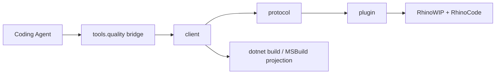

# [H1][RHINO_BRIDGE]
>**Dictum:** *Bridge commands return Rhino-hosted diagnostics for real C# and Grasshopper code.*

<br>

[IMPORTANT] Use this bridge when static .NET validation is insufficient. It launches or connects to RhinoWIP, executes RhinoCode inside Rhino, and returns structured JSON that coding agents can parse for build, reference, runtime, host, and diagnostic evidence.

[CRITICAL] Do not treat this bridge as a unit-test framework. Do not create artificial tests to prove code paths. Use it to validate real project files, source files, assemblies, and scripts against the Rhino coding environment.

---
## [1][PURPOSE]
>**Dictum:** *Rhino behavior is authoritative only inside Rhino.*

<br>

The bridge answers one question: does current code build, reference, and execute correctly in RhinoWIP with RhinoCode, RhinoCommon, Grasshopper2, and repository assemblies resolved as Rhino sees them.

Use it for:
- Real diagnostics on `*.csproj` projects that target Rhino or Grasshopper.
- Source ownership checks for `*.cs` files through evaluated SDK projects.
- Explicit RhinoCode scripts that exercise current code through real Rhino APIs.
- Assembly freshness evidence for plugin and dependency resolution problems.
- Bridge health checks when agents need Rhino runtime facts before editing code.

Scripts are transient diagnostic entrypoints for current code and real Rhino APIs. They are not test cases, suites, or coverage probes.

Avoid it for:
- Synthetic unit-test suites.
- Mocked Rhino or Grasshopper behavior.
- Pure C# analyzer failures already covered by `uv run python -m tools.quality static check`.
- Long-running UI-thread experiments that require server-side cancellation.

---
## [2][ARCHITECTURE]
>**Dictum:** *Each layer owns one boundary.*

<br>



<br>

| [INDEX] | [LAYER] | [OWNER] | [RESPONSIBILITY] |
| :-----: | ------- | ------- | ---------------- |
| **1** | Operator CLI | `uv run python -m tools.quality bridge` | Routes bridge/package commands, builds client deterministically, stages Yak packages transactionally. |
| **2** | Client | `tools/rhino-bridge/client` | Resolves projects, builds code, formats phase JSON, talks to Rhino named pipe. |
| **3** | Protocol | `tools/rhino-bridge/protocol` | Defines wire DTOs, status vocabulary, exit-code policy, endpoint metadata. |
| **4** | Plugin | `tools/rhino-bridge/plugin` | Runs in Rhino, owns named pipe server, executes RhinoCode on Rhino UI thread. |
| **5** | Endpoint | `~/.rasm/rhino-bridge.json` | Records live pipe name, Rhino PID, Rhino version, bridge identity; not job or scenario data. |

---
## [3][COMMANDS]
>**Dictum:** *Commands map to diagnostic intent.*

<br>

Run commands from repository root.

| [INDEX] | [COMMAND] | [INTENT] |
| :-----: | --------- | -------- |
| **1** | `uv run python -m tools.quality bridge build-bridge` | Build protocol, plugin, and client in `Release`. |
| **2** | `uv run python -m tools.quality bridge launch` | Idempotent: reuses an existing endpoint or opens RhinoWIP and verifies endpoint round trip. Before a cold open it clears RhinoWIP's macOS recovery markers (autosave `.rhl`/doc, `Rhinoceros-*.ips` crash reports) so a prior unclean exit never blocks the headless launch with a "did not shut down correctly" dialog. |
| **3** | `uv run python -m tools.quality bridge doctor` | Report live Rhino name/version, .NET `hostRuntime`, RhinoCode `scriptEngine` readiness, plugin identity, and required host assemblies with versions and resolved bundle paths. |
| **4** | `uv run python -m tools.quality bridge check <target> [scenario.csx]` | Build or execute the target through the agent-first RhinoCode lane. |
| **5** | `uv run python -m tools.quality bridge clean <target>` | Remove generated bridge check reports for one target. |
| **6** | `uv run python -m tools.quality bridge quit` | Force-close the disposable bridge Rhino: marks open documents clean and exits without a save prompt; escalates to `SIGTERM` then `SIGKILL` if the bridge is unreachable, and reports `ok` when no live endpoint exists. |
| **7** | `uv run python -m tools.quality bridge package rasm-bridge <version>` | Build bridge `.rhp`, run Yak in staged directory, and create a local package. |
| **8** | `uv run python -m tools.quality bridge deploy rasm-bridge <version>` | Install the staged bridge package, refresh RhinoWIP via idempotent launch, and verify bridge health. Skips automated quit when no live bridge endpoint exists (Rhino already closed); retires stale `~/.rasm/rhino-bridge.json` before relaunch. |
| **9** | `uv run python -m tools.quality bridge publish rasm-bridge <version>` | Build, install locally, then push to the configured Yak feed in one shot. |
| **10** | `uv run python -m tools.quality bridge verify <scenario-or-glob>` | Convenience rail for source-only scenarios; resolves owning project, routes through `bridge check`, writes JSON/PNG evidence under `.artifacts/rhino/verify/<run-id>`, and prunes prior verify bundles older than the retention window. |
| **11** | `uv run python -m tools.quality api doctor` | Report local RhinoWIP API XML, ILSpy, and RhinoCode metadata availability. |
| **12** | `uv run python -m tools.quality api path <key> [assembly\|xml]` | Print the resolved assembly or XML path for an API reference key. |
| **13** | `uv run python -m tools.quality api xml <key> <pattern>` | Search the resolved XML documentation with `rg`. |
| **14** | `uv run python -m tools.quality api types <key> [pattern]` | List assembly types through ILSpy, optionally filtered by pattern. |
| **15** | `uv run python -m tools.quality api decompile <key> <type>` | Decompile a type through ILSpy for assemblies without XML. |

### [3.1][PRIMARY_USAGE]

Validate real Grasshopper project:

```bash
uv run python -m tools.quality bridge check apps/grasshopper/Radyab/Radyab.csproj
```

Expected result: JSON with top-level `"status": "ok"` and successful `resolve`, `build`, `connect`, and `execute` phases. The in-process `execute` phase is the authoritative Rhino evidence.

Validate source ownership without runtime script:

```bash
uv run python -m tools.quality bridge check apps/grasshopper/Radyab/Components/ExtractPoints.cs
```

Expected result: exit code `3`, top-level `"status": "unsupported"`, `build` phase `"ok"`, and message `Source build validated; no runtime script supplied.`

Validate source with an existing task-relevant RhinoCode script:

```bash
uv run python -m tools.quality bridge check <real-source.cs> <scenario.verify.csx>
```

Expected result: `"status": "ok"` when the scenario compiles against bridge-generated `#r` directives from host-filtered runtime references and exercises real Rhino behavior. Scenarios must not contain `#r`, `#load`, or absolute build-output paths.

Library scenarios live under `tests/csharp/libs/<Project>/<MirrorPath>/scenarios/`. The operator script maps that convention to `libs/csharp/<Project>/<Project>.csproj` without manifests or scenario catalogs.

Verify local API metadata:

```bash
uv run python -m tools.quality api doctor
```

Expected result: tab-separated evidence for RhinoWIP app version, ILSpy host status, RhinoCode direct and roll-forward status, and each API key's assembly/XML state.

Search RhinoCommon XML (the only bundle-shipped XML):

```bash
uv run python -m tools.quality api xml rhino-common Mesh
```

Expected result: `rg` matches from the resolved `RhinoCommon.xml` path. `Eto`, `Grasshopper2`, and `GrasshopperIO` carry no bundle XML — use `api types` or `api decompile` for those.

Inspect Rhino UI metadata when XML is absent:

```bash
uv run python -m tools.quality api decompile rhino-ui Rhino.UI.DataSerializer
```

Expected result: decompiled C# from `Rhino.UI.dll` through ILSpy using a normalized .NET apphost environment.

### [3.2][OPTIONS]

The client surface is intentionally minimal — defaults are env-driven and constant.

| [INDEX] | [OPTION] | [USE] |
| :-----: | -------- | ----- |
| **1** | `--result <path>` | Override the automatically generated structured JSON report path. |

Environment overrides:

| [INDEX] | [VARIABLE] | [USE] |
| :-----: | ---------- | ----- |
| **1** | `RHINO_WIP_APP_PATH` | Target a specific RhinoWIP bundle for launch and MSBuild reference resolution. The operator always exports it from the resolved bundle; launch fails loud when it is unset. Unset at the operator: resolves the newest installed `/Applications/Rhino*.app` by `CFBundleVersion` (WIP-preferred). |
| **2** | `QUALITY_RHINO_APP` | Operator-level RhinoWIP path; exported to the client and MSBuild as `RHINO_WIP_APP_PATH`. |
| **3** | `CONFIGURATION` | Build configuration for project checks (default `Release`). |
| **4** | `QUALITY_VERIFY_RETENTION_SECONDS` | Verify report/capture retention window in seconds (default `300`); the operator prunes stale verify bundles on each verify run. |
| **5** | `RASM_BRIDGE_CONNECT_TIMEOUT_S` | Cold-launch connect deadline in seconds (default `90`). |
| **6** | `RASM_BRIDGE_TRANSPORT_TIMEOUT_S` | Warm request/transport deadline in seconds (default `35`). |

Every bridge timeout follows one env-overridable rule — `RASM_BRIDGE_<NAME>_TIMEOUT_S` (seconds, positive) for `HELLO`, `CONNECT`, `TRANSPORT`, `QUIT_WAIT`, `HANDSHAKE`, and `IDLE_DISPATCH`.

---
## [4][OUTPUT_CONTRACT]
>**Dictum:** *JSON phases are the diagnostic interface.*

<br>

Top-level fields:
- `schema`: wire contract. Current value: `rasm.rhino-bridge.v1`.
- `command`: client command.
- `status`: worst decisive phase status.
- `reportPath`: saved report path when the command writes an artifact.
- `phases`: ordered phase evidence.
- `fault`: top-level failure when authoritative phases fail, time out, are busy, or are unsupported.

Read order:
1. Inspect top-level `status`.
2. Inspect top-level `fault.category` and `fault.message` when present.
3. Inspect `execute.data.returnValue` when a script emits structured evidence.
4. Inspect failed or unsupported `phases[]`.
5. Inspect `diagnostics`, `outputs[].text`, `outputs[].truncated`, `outputs[].length`, and `outputs[].limit`.

Decisive phase policy:
- Required failures from `resolve`, `build`, `connect`, and applicable `execute` phases drive top-level `status`.
- Skipped `lifecycle` phases document non-applicable work and do not weaken top-level status.
- `check <source.cs>` without a scenario remains top-level `unsupported` after successful ownership and build evidence.

Status policy:

| [INDEX] | [STATUS] | [EXIT] | [MEANING] |
| :-----: | :------: | -----: | --------- |
| **1** | `ok` | 0 | Command completed successfully. |
| **2** | `unsupported` | 3 | Request is valid, but no runtime action applies. |
| **3** | `busy` | 5 | Live bridge already handles another client. |
| **4** | `timeout` | 5 | Client transport wait expired. |
| **5** | `failed` | 1 | Build, protocol, execute, or diagnostic failure. |
| **6** | `skipped` | phase-only | Phase intentionally did not run because prior state made it irrelevant. |

Phase expectations:
- `resolve`: file/project ownership, workspace root, command path validity, MSBuild owner-evaluation evidence.
- `build`: real `dotnet restore`, `dotnet build`, MSBuild projection, target and references.
- `launch`: existing bridge reuse or RhinoWIP launch evidence.
- `connect`: named-pipe hello round trip with endpoint metadata.
- `execute`: RhinoCode execution report, stdout/stderr, diagnostics, Rhino document facts, and optional script return JSON.
- `diagnostics`: RhinoCode compile diagnostics when available.
- `lifecycle`: quit/restart status.

Output blocks include `source`, `text`, `truncated`, `length`, and `limit`. Treat `truncated: true` as machine-actionable loss of detail. Parse `outputs[]` by `source`: `execute` emits `stdout` and `stderr` (the script's console streams) plus `rhino.command` — the Rhino command-window history captured around execution via `RhinoApp.CommandWindowCaptureEnabled` with `CapturedCommandWindowStrings`/`CommandHistoryWindowText`, surfacing native command echoes a script triggers. Process-spawning phases (`resolve`, `build`) emit `process.stdout`/`process.stderr`. Every successful `execute` carries a `rhino.command` block (empty when no command ran).

### [4.1][SCRIPT_RETURNS]

Scripts can return structured agent evidence by writing one stdout line:

```csharp
Console.WriteLine("rasm.rhino-bridge.return=" + JsonSerializer.Serialize(receipt));
```

The plugin preserves raw stdout and parses the last line with this prefix into `execute.data.returnValue`. Missing return lines are valid. Malformed return JSON fails `execute` with `fault.category = "return"`.

Runtime checks force RhinoCode C# `csharp.resolver.isolate = true` and `CachePolicy.NeverCache`. Script references load through RhinoCode's collectible Roslyn context instead of Rhino's default host context, so other installed plugins cannot poison package identity for `LanguageExt`, `Thinktecture`, or rebuilt repo assemblies. Every execute report includes `execute.data.rhinoCode`; project smoke scripts also emit `returnValue.kind = "assemblyFreshness"` with target-location evidence, `dependencyCollisions` for watched packages (`LanguageExt.Core`, `FSharp.Core`, `Thinktecture.Runtime.Extensions`), `collisionDetected`, and `resolverIsolated = true`.

The Rhino-loaded bridge boundary is dependency-free outside RhinoWIP host assemblies and the local protocol DLL. `rasm-bridge.rhp` and `Rasm.RhinoBridge.Protocol.dll` do not package `LanguageExt.Core` or `Thinktecture.Runtime.Extensions`; this prevents Rhino's shared plugin load context from binding other plugins to Rasm's functional-library versions.

### [4.2][BRIDGE_MARKERS]

Scenarios and smoke probes emit structured evidence as **bridge markers** — line-oriented stdout records prefixed `rasm.rhino-bridge.`. The plugin captures stdout, leaves raw text in `execute.outputs[].text`, and the canonical parser is `Rasm.RhinoBridge.Protocol.BridgeMarker.Scan(string stdout) -> IReadOnlyList<BridgeMarker>` (in the protocol assembly, also published in the agent reference set).

Marker kinds:

| [INDEX] | [PREFIX] | [VARIANT] | [PAYLOAD] |
| :-----: | -------- | --------- | --------- |
| **1** | `rasm.rhino-bridge.return=` | `Returned(JsonElement Value)` | Final return JSON; only the last occurrence wins; consumed into `execute.data.returnValue`. |
| **2** | `rasm.rhino-bridge.evidence=` | `Evidence(string Key, string Value)` | Structured fact carriers; `Value` is opaque to the parser (recipients deserialize per-key). |
| **3** | `rasm.rhino-bridge.capture=` | `Capture(string Path, int Width, int Height)` | PNG capture metadata (path + dimensions). |
| **4** | `rasm.rhino-bridge.nonce=` | `Nonce(string Value)` | Smoke-probe handshake nonce. |

**Fact emission contract (current).** `Rasm.TestKit.Scenarios.Scenario.Run(theme, capturePath, body)` emits per scenario:

1. One `scenario={theme}` plain line (no prefix).
2. One `capture={capturePath}` plain line (no prefix).
3. The scenario body populates a `FactBag` via `facts.Add(string key, object value)` (statement form, no return value).
4. On scope exit the harness emits exactly one `facts={json}` plain line **AND** one `rasm.rhino-bridge.evidence=facts={json}` prefixed marker. Both carry the same JSON-serialized `IReadOnlyDictionary<string, object>` payload.

**Agent guidance.** Parse the prefixed `Evidence("facts", json)` marker — it is the structured, canonical, single source of truth. The plain `facts={json}` line is for human-readable agent logs only and is redundant with the marker. Do **not** parse individual `key=value` plain lines: that legacy emission style is removed. Use `BridgeMarker.Scan(stdout)` and filter on `Evidence` cases; deserialize `Evidence.Value` as a `Dictionary<string, JsonElement>` for typed fact access.

**Wire format migration.** Before this revision, scenarios emitted N × `key=value` plain lines per scenario (one per fact). Agents parsing line-by-line for `key=` would see N entries. After the migration, scenarios emit **one** `facts={json}` plain line + **one** `rasm.rhino-bridge.evidence=facts={json}` marker carrying the full dictionary. Agents must switch to JSON parsing — there are no per-fact plain lines anymore.

---
## [5][REFERENCE_POLICY]
>**Dictum:** *Reference sets differ by execution mode.*

<br>

Host assemblies (`RhinoCommon`, `Rhino.UI`, `Eto`, `Grasshopper2`, `GrasshopperIO`, `RhinoCodePlatform.Rhino3D`, `Microsoft.macOS`, `System.Drawing.Common`) resolve from the installed RhinoWIP app bundle via `Directory.Build.props` HintPaths under `$(RhinoWipResourcesPath)` with `Private=false` — never from NuGet. The bundle path is the newest installed `/Applications/Rhino*.app` (see `RHINO_WIP_APP_PATH`), so compile and runtime bind the same versions Rhino loads; `bridge doctor` reports the resolved versions and paths.

The client emits runtime reference projections from one evaluated project build, then applies them by prepending `#r` directives to the generated RhinoCode script before submission — references are client-applied, not plugin-applied. References are ordered dependency-first: `FSharp.Core`, `LanguageExt.Core`, `Thinktecture.Runtime.Extensions`, transitive packages, `Rasm.dll`, scenario kit assemblies, then the target assembly last. Scenario scripts also receive a bridge-owned base using-set (`ScenarioBaseUsings`: `LanguageExt`, `static LanguageExt.Prelude`, `Rasm.TestKit.Scenarios`) so authors drop that repeated preamble, plus a LanguageExt `HashMap` bootstrap so trait resolution completes before staged Rasm code touches custom `HashMap` keys under RhinoCode's isolated resolver. **Grasshopper-aware projects** (`IsGrasshopperAwareProject` or a `Grasshopper2.dll` reference) additionally receive bridge-owned `ScenarioHostUsings` (`Eto.Drawing`) after the scenario preamble, and the bridge pre-loads Grasshopper2 (`BridgeWire.GrasshopperPluginId`, via `PlugIn.LoadPlugIn` on the UI thread before execution) into the default ALC so GH2-backed `Rasm.Grasshopper.UI` rails resolve at runtime — host assemblies stay off `#r`. **Drive GH2 through `Rasm.Grasshopper.UI` wrapper types, not raw `Grasshopper2.*` types in scenario bodies**: a direct `using Grasshopper2.*` needs GH2 as a compile reference, and supplying it (`#r "Grasshopper2"`) forces the isolated resolver to bind a *separate* GH2 instance whose editor/canvas singletons differ from the host's, breaking runtime state. Scenarios that must construct raw GH2 input types cannot run under the isolated resolver. **Rasm.Rhino HashMap policy:** use primitive, `string`, `Guid`, `uint`/`ulong`, or built-in value-tuple keys only in bridge-hot assemblies; do not use custom record-struct keys (for example `PreviewFingerprint`) inside `HashMap<,>` — they fail under isolated resolver trait warmup even when reference order is correct. Project/source scenario references are shadow-copied into artifact `refs/<content-hash>/` folders so repeated checks see fresh assembly paths without scenario-owned machine paths. The `#r`-applied set is echoed in `BridgeExecuteRequest.References` and the execute report as provenance metadata; the plugin does not re-resolve that field independently during execution.

API metadata lookup uses local sources in this order:
1. RhinoWIP app-bundle XML when present — today only `RhinoCommon.xml` ships; `Eto`, `Grasshopper2`, `GrasshopperIO`, and `Rhino.UI` carry no bundle XML, so XML lookups for those report `missing`.
2. ILSpy `types`/`decompile` for assemblies without XML, for example `Rhino.UI.dll`, `Eto.dll`, and `Grasshopper2.dll`.
3. `api doctor` reports `rhinocode` CLI availability as environment evidence only; the in-process `execute` rail, not the CLI, is the runtime authority.

| [INDEX] | [REFERENCE_SET] | [USE] |
| :-----: | --------------- | ----- |
| **1** | `RuntimeReferences` | Runtime assets excluding target assembly; smoke scripts load target directly from `targetLocation`. |
| **2** | `HostFilteredRuntimeReferences` | Project smoke and source scripts; excludes Rhino, Grasshopper, and bridge host assemblies already present in Rhino. |
| **3** | `BridgeExecuteRequest.References` | Execution provenance/report metadata; not a plugin-applied reference mechanism. |

[CRITICAL] Do not document `check <source.cs> <script.csx>` as compile-reference based until the client owns a real compile-reference projection and the plugin applies it authoritatively.

---
## [6][FAILURE_READING]
>**Dictum:** *Failures identify the boundary that produced evidence.*

<br>

| [INDEX] | [SIGNAL] | [READ_AS] | [NEXT_ACTION] |
| :-----: | -------- | --------- | ------------- |
| **1** | `build` failed | Managed compile/analyzer/MSBuild failure. | Fix C# or project configuration before Rhino work. |
| **2** | `resolve` owner-evaluation failure | A tracked project could not produce MSBuild ownership data. | Inspect `failures[].projectPath`, `failures[].command`, `exitCode`, `outputs`, and `fault`; fix evaluation before trusting ownership. |
| **3** | `connect` failed | RhinoWIP bridge unavailable or stale endpoint. | Run `bridge launch` or `bridge doctor`; inspect `~/.rasm/rhino-bridge.json`. |
| **4** | `execute` diagnostics | RhinoCode compile/runtime failure inside Rhino. | Use `diagnostics` and `fault.stackTrace`; fix real code. |
| **5** | external package collision | Another Rhino plugin has loaded a different same-name package. | `check` uses isolated RhinoCode references; inspect `execute` only if a real scenario still fails. |
| **6** | `loadedLocation=none` | Target assembly loaded without a path-backed location. | Treat as missing post-load identity evidence; normal fresh loads report `targetAssembly.Location`. |
| **7** | `unsupported` source check | Source build is valid, but no runtime scenario was supplied. | Add a scenario path only when runtime behavior needs Rhino evidence. |
| **8** | `ilspycmd` apphost failure | Effective `DOTNET_ROOT` does not point at a hostfxr/runtime root. | Use `api doctor`; fix apphost environment, not `Directory.Build.props` or Rhino references. |
| **9** | `execute` script-engine fault | `doctor.scriptEngine` non-null or `execute` fault from RhinoCode language start. | A RhinoWIP runtime/runtimeconfig mismatch; confirm `doctor.hostRuntime` and rebuild the plugin against the current bundle. |

---
## [7][UPDATE_RULES]
>**Dictum:** *Bridge changes preserve diagnostic truth before convenience.*

<br>

[IMPORTANT]:
1. Preserve architecture: operator script -> client -> protocol -> Rhino plugin.
2. Keep protocol DTOs and status policy in `BridgeWire`.
3. Keep client output concise; include raw MSBuild item JSON only for parse failures or explicit debug output.
4. Keep RhinoCode compile diagnostics sourced from `ExecuteException.TryGetCompileException` and `CompileException.Diagnosis`.
5. Keep `--timeout-ms` described as client transport timeout. Rhino UI-thread execution is not server-cancelable.

[CRITICAL]:
- Never hardcode project discovery for packages. Use evaluated `YakPackageSlug` project metadata.
- Never put `#r`, `#load`, or absolute build-output paths in scenarios. The bridge owns references.
- Never imply `check <source.cs>` executes runtime behavior without an explicit scenario.
- Never treat reported `BridgeExecuteRequest.References` as plugin-applied execution state.
- Never run bridge RhinoCode checks without isolated C# reference resolution and cache-free execution.
- Never add temp-only scripts, generated tests, or fake probes as bridge purpose.
- Never automate Rhino settings or templates from this repository.

---
## [8][VALIDATION]
>**Dictum:** *Validation requires static gates plus live Rhino evidence.*

<br>

Run after bridge changes. Run the validation ladder serially in listed order.

| [INDEX] | [RAIL] | [PARALLELISM] |
| :-----: | ------ | ------------- |
| **1** | `uv run python -m tools.quality static check`, focused `--target` test runs | Safe concurrently — each invocation isolates MSBuild output under `.artifacts/agents/<pid>/`. |
| **2** | `uv run python -m tools.quality bridge build-bridge`, `bridge check`, `verify`, `package`, `deploy`, `publish` | Serial — one live Rhino endpoint; Yak packaging writes project `bin/` outputs. |
| **3** | Default `uv run python -m tools.quality test run` (managed `Rasm` target) | VSTest then Stryker in one invocation — do not parallelize two default test runs with other dotnet gates. |

Never parallelize bridge commands or live Rhino sessions with each other.

```bash
uv run python -m tools.quality self-test
pnpm check:py
uv run pytest tests/tools/quality/test_quality.py -q
git diff --check -- tools/rhino-bridge
uv run python -m tools.quality api doctor
uv run python -m tools.quality api path rhino-common xml
uv run python -m tools.quality api xml rhino-common Mesh
uv run python -m tools.quality api types rhino-ui Panels
uv run python -m tools.quality api decompile rhino-ui Rhino.UI.DataSerializer
uv run python -m tools.quality bridge build-bridge
uv run python -m tools.quality static check
uv run python -m tools.quality bridge doctor
uv run python -m tools.quality bridge check apps/grasshopper/Radyab/Radyab.csproj
rc=0
uv run python -m tools.quality bridge check apps/grasshopper/Radyab/Components/ExtractPoints.cs || rc=$?
[[ "${rc}" == 3 ]]
uv run python -m tools.quality bridge clean apps/grasshopper/Radyab/Radyab.csproj
```

Add focused live checks for bridge implementation changes:
- Reference projection changes: run `check <source.cs> <scenario.verify.csx>` that imports affected assemblies.
- Reference isolation policy changes: verify known same-name package collisions do not poison isolated RhinoCode checks (use `bridge check <project.csproj>` without scenario — the internal smoke probe reports `returnValue.kind = "assemblyFreshness"`).
- Packaging changes: run `uv run python -m tools.quality bridge package rasm-bridge <version>`, then `uv run python -m tools.quality bridge deploy rasm-bridge <version>` to validate the staged `.yak`.
- Transport changes: run `bridge doctor` and `bridge check <source.cs> <scenario.verify.csx>`.
