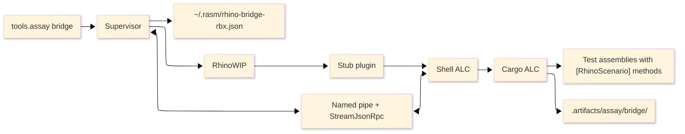

# [RHINO_BRIDGE]

`tools/rhino-bridge` is the host-bound RhinoWIP runtime bridge for typed scenario verification. Assay is the operator boundary; the bridge supervisor owns host launch, endpoint admission, JSON-RPC connection, cargo staging, scenario execution, document cleanup, quit, and one terminal `SessionEnvelope`.

## [1]-[REQUIREMENTS]

- macOS with RhinoWIP installed under `/Applications`, or `RHINO_WIP_APP_PATH` set to one Rhino `.app` bundle.
- Restored .NET project graph for the bridge projects and test projects that own typed scenarios.
- Assay invocation from the repository root.
- One live RhinoWIP bridge session per machine. Assay serializes bridge, verify, and package lifecycle work through the shared `bridge` lease.
- Bridge artifacts route under `.artifacts/assay/bridge/<runId>/`; endpoint and lease state route under `~/.rasm/`.

## [2]-[FIRST_PATH]

```bash copy-safe
uv run python -m tools.assay bridge build
uv run python -m tools.assay bridge status
```

Expected signal: each command returns one Assay envelope, and the status receipt carries `bridge.reportDir=<path>` when the supervisor emitted a `SessionEnvelope`.

## [3]-[VERIFY]

```bash copy-safe
uv run python -m tools.assay bridge verify
uv run python -m tools.assay bridge verify blocks
uv run python -m tools.assay bridge verify blocks,ui
uv run python -m tools.assay bridge verify CoreRail
uv run python -m tools.assay bridge verify 'blocks.*'
uv run python -m tools.assay bridge verify tests/csharp/libs/Rasm.Rhino/Blocks/Scenarios
```

Selection rules:
- Empty, `all`, or `*` selects every typed scenario corpus.
- A theme token selects every scenario in that theme.
- A full scenario name, bare scenario method name, or glob selects matching scenario names.
- A scenario owner path, project path, or theme-local `Scenarios/` path selects that corpus.
- Script-file scenario discovery is absent. Test-owned typed `[RhinoScenario]` sources own scenario discovery and emit `bridge-closure.json`.

## [4]-[COMMAND_SURFACE]

Public Assay bridge verbs map to these effects.

| [INDEX] | [COMMAND]                 | [EFFECT]                                                                         |
| :-----: | :------------------------ | :------------------------------------------------------------------------------- |
|   [1]   | `bridge build`            | Compile bridge projects and test-owned typed scenario closures.                  |
|   [2]   | `bridge verify [PATTERN]` | Build, stage, run, unload, prepare quit, and fold selected typed scenarios.      |
|   [3]   | `bridge status`           | Launch or reuse RhinoWIP; return endpoint, host, RPC, MCP, and capability facts. |
|   [4]   | `bridge quit`             | Prepare Rhino/GH2 documents, then run the quit ladder.                           |

The direct supervisor accepts `status`, `quit`, `redeploy <package>`, and `verify <selection-json> <closure-manifest>`. `redeploy` returns `RedeployIncomplete`; Assay owns stable operator spelling, build closure preparation, artifact routing, and the outer lease.

## [5]-[MACHINE_CONTRACT]

[STDOUT]:
- Supervisor stdout carries exactly one `SessionEnvelope` JSON document.
- Assay decodes that document and projects status, first fault, notes, and artifacts into its envelope.

[STDERR]:
- Supervisor stderr carries structured diagnostic JSON lines such as `session.terminal`.
- Stderr does not replace the stdout envelope.

[STATUS]:
- `ok` and `skipped` exit `0`.
- `unsupported` exits `3`.
- `failed` exits `1`.
- `timeout` and `busy` exit `5`.
- Supervisor usage errors exit `2`.

[READ_ORDER]:
1. Read top-level `status`.
2. Read `firstFaultPhase` and `firstFailure`.
3. Read `fault.prescription` when `fault` is present.
4. Read `scenarios[]` for per-scenario verdicts.
5. Read `evidence[]` for fact and capture events.
6. Read `reportDir` for JSONL spool files, PNG captures, references, and forensic artifacts.

[ARTIFACTS]:
- `SessionEnvelope.reportDir`: `.artifacts/assay/bridge/<runId>/`.
- Scenario spool: `<reportDir>/<scenario>.jsonl`.
- Probe spool: `<reportDir>/probe.jsonl`.
- Reference stage: `<reportDir>/refs/<contentHash>/`.
- Captures: `<reportDir>/*.png`.
- Unload leak dump: `<reportDir>/<pid>.gcdump` when available.
- Endpoint: `~/.rasm/rhino-bridge-rbx.json`.
- Lease: `~/.rasm/rhino-bridge-rbx.lease`.
- Quit journal: `~/.rasm/rhino-bridge-quits.jsonl`.

## [6]-[ARCHITECTURE]



Text equivalent: Assay calls the supervisor; the supervisor reconciles host state, launches or reuses RhinoWIP, reads the endpoint, connects to the shell over a named pipe, loads staged cargo into a collectible ALC, runs typed scenarios, and folds shell events plus spool evidence into one `SessionEnvelope`.

[OWNER_MAP]:
- `Supervisor`: process boundary, lease, bundle discovery, reconcile, launch, pipe client, staging, quit ladder, session fold.
- `Stub`: dependency-zero Rhino plugin loaded by Rhino's shared plugin context.
- `Shell`: in-host RPC target, endpoint writer, UI-thread marshal, busy admission, host-plugin preload, GH2/Rhino document cleanup.
- `Cargo`: hot-swapped scenario runner, capability probes, JSONL spool, capture writer, GH2 render lane.
- `Contract`: JSON-RPC interfaces, wire records, status algebra, faults, events, selections, and `SessionEnvelope`.
- `Gate`: fault-injection executable for supervisor kernels and optional live-host rows.

## [7]-[FILES]

[ROOT]:
- `tools/rhino-bridge/README.md`

[CARGO]:
- `tools/rhino-bridge/Cargo/Cargo.csproj`
- `tools/rhino-bridge/Cargo/CargoHost.cs`
- `tools/rhino-bridge/Cargo/Gh2Lane.cs`
- `tools/rhino-bridge/Cargo/Spool.cs`
- `tools/rhino-bridge/Cargo/packages.lock.json`

[CONTRACT]:
- `tools/rhino-bridge/Contract/Contract.csproj`
- `tools/rhino-bridge/Contract/Rpc.cs`
- `tools/rhino-bridge/Contract/Wire.cs`
- `tools/rhino-bridge/Contract/packages.lock.json`

[GATE]:
- `tools/rhino-bridge/Gate/Gate.csproj`
- `tools/rhino-bridge/Gate/Program.cs`
- `tools/rhino-bridge/Gate/packages.lock.json`

[SHELL]:
- `tools/rhino-bridge/Shell/CargoGate.cs`
- `tools/rhino-bridge/Shell/IdlePump.cs`
- `tools/rhino-bridge/Shell/Shell.csproj`
- `tools/rhino-bridge/Shell/ShellHost.cs`
- `tools/rhino-bridge/Shell/packages.lock.json`

[STUB]:
- `tools/rhino-bridge/Stub/Stub.cs`
- `tools/rhino-bridge/Stub/Stub.csproj`
- `tools/rhino-bridge/Stub/packages.lock.json`

[SUPERVISOR]:
- `tools/rhino-bridge/Supervisor/Evidence.cs`
- `tools/rhino-bridge/Supervisor/HostControl.cs`
- `tools/rhino-bridge/Supervisor/Program.cs`
- `tools/rhino-bridge/Supervisor/Session.cs`
- `tools/rhino-bridge/Supervisor/Supervisor.csproj`
- `tools/rhino-bridge/Supervisor/packages.lock.json`

## [8]-[FAILURE_READING]

Terminal signals map to one first repair surface. Read `fault`, `probeReceipt`, `reportDir`, and spool artifacts from the same `SessionEnvelope`; when relayed events and durable spool counts diverge, the spool owns evidence through the last decoded JSONL line.

[REPAIR_SURFACES]:
- Lease: inspect or release `~/.rasm/rhino-bridge-rbx.lease`.
- Package: read `fault`, then rebuild or redeploy `rasm-bridge`.
- Launch: check launch, endpoint liveness, and shell load evidence.
- Contract: redeploy `rasm-bridge`, then rerun `bridge status`.
- Capability: read `probeReceipt`, then change the scenario requirement or host lane.
- Host: rebuild closures against the active RhinoWIP bundle.
- UI: read spool tail, captures, and host exceptions under `reportDir`.
- Crash: read `.ips` summary, spool JSONL, and captured artifacts.
- Evidence: use the spool as the durable source.

| [INDEX] | [SIGNAL]              | [READ_AS]                | [SURFACE]  |
| :-----: | :-------------------- | :----------------------- | :--------- |
|   [1]   | `busy`                | leased host              | Lease      |
|   [2]   | `poisoned endpoint`   | startup before endpoint  | Package    |
|   [3]   | `connect-failed`      | pipe admission           | Launch     |
|   [4]   | `shell-skew`          | shell contract skew      | Contract   |
|   [5]   | `capability-absent`   | failed required probe    | Capability |
|   [6]   | `host-drift`          | host API drift           | Host       |
|   [7]   | `ui-wedged`           | UI progress stall        | UI         |
|   [8]   | `rhino-crash`         | host exit                | Crash      |
|   [9]   | `evidence.divergence` | relay and spool mismatch | Evidence   |

## [9]-[SCENARIO_CONTRACT]

Typed scenario entrypoints carry `[RhinoScenario("<theme>")]` and accept one `ScenarioContext`. The entrypoint returns `Fin<Unit>`, emits facts through `ScenarioContext.Fact`, asserts through `Require` or `Expect`, and obtains captures through `Capture.Snapshot`.

Capability requirements live on the attribute as `Requires`. Cargo probes `cargo.hotswap`, `eventpipe`, `exception.tap`, `gh2.dataflow`, and `gh2.render`, then rejects scenarios whose required capability is not `ok`.

Scenario code does not write `#r`, `#load`, absolute build-output paths, or local report paths. Assay builds the test projects that own typed scenarios, reads each `bridge-closure.json`, aggregates selected closures, and hands the manifest to the supervisor.

## [10]-[INTEGRATIONS]

[RHINO_WIP]:
- Bundle discovery uses `RHINO_WIP_APP_PATH` when set; otherwise it admits the newest `/Applications/Rhino*.app` by `CFBundleVersion`.
- Launch sets `RHINO_MCP_AUTOSTART_PORT=0`.
- Reconcile clears only recovery markers that match supervised quit-journal windows; foreign Rhino state is reported and left intact.
- The launch-edge recovery clear runs only when the supervisor actually launches (never on host reuse) and force-clears the recovery-dialog blockers — the `.rhl` recovery file and `Rhinoceros-*.ips` startup crash sentinels — independent of journal windows, so an unclean prior exit cannot wedge a headless launch behind a recovery prompt; foreign documents stay untouched.

[STREAM_JSON_RPC]:
- The shell exposes `IBridgeShell` over a named pipe with `SystemTextJsonFormatter`.
- The supervisor exposes one `IBridgeEvents.PublishAsync` sink for fact, capture, phase, progress, and host-exception events.

[PACKAGE_RAIL]:
- The `rasm-bridge` package slug uses the same bridge lease.
- Deploy and publish paths cycle the live host through quit and refresh steps.

[MCP]:

The bridge starts no MCP listener of its own. MCP tooling runs through McNeel's Rhino MCP platform, registered out-of-band with the agent. Assay is NOT an MCP server: it is the deterministic typed-verification boundary, and the McNeel platform is the interactive conversational host. The two are orthogonal capabilities that share one live RhinoWIP session.

[INSTALL]:
- Add McNeel `Rhino-MCP-Platform` 0.1.5 to the Rhino 9.0 package store via the Rhino PackageManager (Yak).
- The package provides the `rhino-mcp-router` stdio server; the bridge does not bundle, launch, or supervise it.

[REGISTER]:
- Declare `rhino-mcp-router` to Claude Code at USER scope in `~/.claude.json` as a `type: stdio` server.
- Never commit a project-scope `.mcp.json` for it. The platform is a per-operator host capability, not a checked-in workspace dependency, so a repo-scoped registration is rejected.

[HEALTH]:
- `bridge status` surfaces `mcp.platform.version` and `mcp.listener` as capability facts read from the loaded host state.
- A present `mcp.platform.version` with an active `mcp.listener` confirms the McNeel platform loaded into the same host the bridge supervises.

[CROSS_SESSION_DRIFT]:
- The `delta` rail folds `mcp.platform.version`, `mcp.listener`, `rhinoVersion`, and `rpc.streamjsonrpc` into per-session fact rows.
- Any cross-session change to one of those facts surfaces as a `RunDelta.drift` row, so host and platform drift is auto-tracked across sessions without manual diffing.

[RUN_CSHARP_CONSTRAINT]:
- The McNeel platform's `run_csharp` tool evaluates a statement body, not an expression: a trailing `return <expr>;` is rejected at the top level. Emit results through `Console.WriteLine(...)` or assign to the ambient `__rhino_doc__`/document handle, then read stdout. Treat the snippet as a script body, never an expression-returning lambda.

[VERIFY_IDLE_RULE]:
- Keep MCP idle during a formal `bridge verify`. The platform's `run_csharp`, `run_python`, and command tools drive `RhinoApp` command history; an interactive probe interleaved with a verify run injects foreign lines into the same `command.history.tail`/`command.capture.tail` evidence the cargo runner spools, contaminating the per-scenario command-window evidence. Run interactive MCP exploration before or after a verify, never concurrently inside one live session.
- The same contamination rule binds any `Rasm.AppHost` MCP tool that drives a live Rhino host: a host-neutral capability projection stays outside this hazard, but the moment an AppHost tool's `ComputeIntent` reaches `RhinoApp` command history it inherits the idle-during-lease discipline and must not run concurrently with a bridge session.

[VERDICT]:
- The relationship is `additive_external`. The McNeel platform is interactive and conversational; the bridge is deterministic typed verification.
- Neither replaces the other: the platform drives exploratory host interaction, the bridge drives reproducible `[RhinoScenario]` closure, and `bridge status` is the single seam that reports both as capability facts.

## [11]-[BOUNDARIES]

- Keep `Contract` additive: existing fields, union discriminators, status ranks, and exit codes are not renamed or reused.
- Keep `Stub` dependency-zero outside Rhino host assemblies.
- Keep host assemblies in the host/default ALC and bridge RPC assemblies in the shell ALC.
- Keep cargo references collectible and per-swap; cargo unload leaks are supervisor decisions, not shell exceptions.
- Keep Rhino and GH2 document cleanup inside `PrepareQuitAsync` before the quit ladder runs.
- Keep the quit ladder to Apple Event terminate, Cocoa force terminate, then `kill(2)` SIGKILL.
- Keep generated evidence under `.artifacts/assay/bridge/<runId>/` or `~/.rasm/`; no bridge command writes root scratch files.
