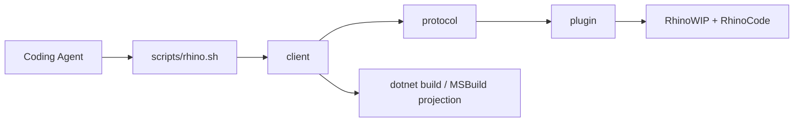

# [H1][RHINO_BRIDGE]
>**Dictum:** *Bridge commands return Rhino-hosted diagnostics for real C# and Grasshopper code.*

<br>

[IMPORTANT] Use this bridge when static .NET validation is insufficient. It launches or connects to RhinoWIP, executes RhinoCode inside Rhino, and returns structured JSON that coding agents can parse for build, load, runtime, host, and diagnostic evidence.

[CRITICAL] Do not treat this bridge as a unit-test framework. Do not create artificial tests to prove code paths. Use it to validate real project files, source files, assemblies, and scripts against the Rhino coding environment.

---
## [1][PURPOSE]
>**Dictum:** *Rhino behavior is authoritative only inside Rhino.*

<br>

The bridge answers one question: does current code build, load, reference, and execute correctly in RhinoWIP with RhinoCode, RhinoCommon, Grasshopper2, and repository assemblies resolved as Rhino sees them.

Use it for:
- Real diagnostics on `*.csproj` projects that target Rhino or Grasshopper.
- Source ownership checks for `*.cs` files through evaluated SDK projects.
- Explicit RhinoCode scripts that exercise current code through real Rhino APIs.
- Assembly load evidence for plugin and dependency resolution problems.
- Bridge health checks when agents need Rhino runtime facts before editing code.

Scripts are transient diagnostic entrypoints for current code and real Rhino APIs. They are not test cases, suites, or coverage probes.

Avoid it for:
- Synthetic unit-test suites.
- Mocked Rhino or Grasshopper behavior.
- Pure C# analyzer failures already covered by `pnpm check:cs`.
- Long-running UI-thread experiments that require server-side cancellation.

---
## [2][ARCHITECTURE]
>**Dictum:** *Each layer owns one boundary.*

<br>



<br>

| [INDEX] | [LAYER] | [OWNER] | [RESPONSIBILITY] |
| :-----: | ------- | ------- | ---------------- |
| **1** | Operator CLI | `scripts/rhino.sh` | Routes bridge/package commands, builds client deterministically, stages Yak packages transactionally. |
| **2** | Client | `tools/rhino-bridge/client` | Resolves projects, builds code, formats phase JSON, talks to Rhino named pipe. |
| **3** | Protocol | `tools/rhino-bridge/protocol` | Defines wire DTOs, status vocabulary, exit-code policy, endpoint metadata. |
| **4** | Plugin | `tools/rhino-bridge/plugin` | Runs in Rhino, owns named pipe server, executes RhinoCode on Rhino UI thread. |
| **5** | Endpoint | `~/.rasm/rhino-bridge.json` | Records live pipe name, Rhino PID, Rhino version, bridge identity. |

---
## [3][COMMANDS]
>**Dictum:** *Commands map to diagnostic intent.*

<br>

Run commands from repository root.

| [INDEX] | [COMMAND] | [INTENT] |
| :-----: | --------- | -------- |
| **1** | `scripts/rhino.sh bridge build` | Build protocol, plugin, and client in `Release`. |
| **2** | `scripts/rhino.sh bridge launch` | Open RhinoWIP and verify bridge handshake. |
| **3** | `scripts/rhino.sh bridge doctor` | Report live Rhino, plugin, required assemblies, and sessions. |
| **4** | `scripts/rhino.sh bridge restart` | Quit safe Rhino session, relaunch RhinoWIP, and reconnect. |
| **5** | `scripts/rhino.sh bridge check <project.csproj>` | Build project and execute RhinoCode smoke in Rhino. |
| **6** | `scripts/rhino.sh bridge check-source <source.cs>` | Resolve owning project and validate source build. |
| **7** | `scripts/rhino.sh bridge check-source <source.cs> --script <script.csx>` | Build owner and execute supplied RhinoCode script with compile references. |
| **8** | `scripts/rhino.sh bridge script <script.csx>` | Execute explicit RhinoCode script in Rhino. |
| **9** | `scripts/rhino.sh bridge load <assembly.dll>` | Load assembly into Rhino bridge session for explicit session diagnostics. |
| **10** | `scripts/rhino.sh bridge load-smoke <assembly.dll>` | Load assembly in collectible session and unload it. |
| **11** | `scripts/rhino.sh bridge unload <session-id>` | Unload explicit bridge load session. |
| **12** | `scripts/rhino.sh bridge quit` | Ask Rhino to exit only when open documents have no unsaved changes. |
| **13** | `scripts/rhino.sh bridge package <version>` | Build bridge `.rhp`, run Yak in staged directory, publish complete package. |
| **14** | `scripts/rhino.sh bridge install <package.yak>` | Install bridge package, restart or launch RhinoWIP, then verify live version. |

### [3.1][PRIMARY_USAGE]

Validate real Grasshopper project:

```bash
scripts/rhino.sh bridge check apps/grasshopper/Radyab/Radyab.csproj
```

Expected result: JSON with top-level `"status": "ok"` and successful `resolve`, `build`, `connect`, and `execute` phases. Treat `rhinoCodeCli` as supplemental environment evidence; in-process `execute` is authoritative Rhino evidence.

Validate source ownership without runtime script:

```bash
scripts/rhino.sh bridge check-source apps/grasshopper/Radyab/Components/ExtractPoints.cs
```

Expected result: exit code `3`, top-level `"status": "unsupported"`, `build` phase `"ok"`, and message `Source build validated; no runtime script supplied.`

Validate source with an existing task-relevant RhinoCode script:

```bash
scripts/rhino.sh bridge check-source <real-source.cs> --script <real-diagnostic-script.csx>
```

Expected result: `"status": "ok"` when the script compiles against `CompileReferences` and exercises real Rhino behavior. Do not create throwaway proof scripts except when changing bridge reference projection itself.

---
## [4][OUTPUT_CONTRACT]
>**Dictum:** *JSON phases are the diagnostic interface.*

<br>

Top-level fields:
- `schema`: wire contract. Current value: `rasm.rhino-bridge.v1`.
- `command`: client command.
- `status`: worst meaningful phase status.
- `phases`: ordered phase evidence.
- `fault`: top-level failure when authoritative phases fail, time out, are busy, or are unsupported.

Read order:
1. Inspect top-level `status`.
2. Inspect top-level `fault.category` and `fault.message` when present.
3. Inspect failed or unsupported `phases[]`.
4. Inspect `diagnostics`, `outputs[].text`, `outputs[].truncated`, `outputs[].length`, and `outputs[].limit`.
5. Treat `rhinoCodeCli` failure as non-authoritative when in-process `execute` succeeds.

Status policy:

| [INDEX] | [STATUS] | [EXIT] | [MEANING] |
| :-----: | :------: | -----: | --------- |
| **1** | `ok` | 0 | Command completed successfully. |
| **2** | `unsupported` | 3 | Request is valid, but no runtime action applies. |
| **3** | `busy` | 5 | Live bridge already handles another client. |
| **4** | `timeout` | 5 | Client transport wait expired. |
| **5** | `failed` | 1 | Build, protocol, load, execute, or diagnostic failure. |
| **6** | `skipped` | phase-only | Phase intentionally did not run because prior state made it irrelevant. |

Phase expectations:
- `resolve`: file/project ownership, workspace root, command path validity.
- `build`: real `dotnet restore`, `dotnet build`, MSBuild projection, target and references.
- `launch`: existing bridge reuse or RhinoWIP launch evidence.
- `connect`: named-pipe handshake with endpoint metadata.
- `rhinoCodeCli`: supplemental external `rhinocode list --json` probe; `DOTNET_ROLL_FORWARD=Major` fallback is intentional.
- `load`: collectible load session only for explicit load commands.
- `execute`: RhinoCode execution report, stdout/stderr, diagnostics, and Rhino document facts.
- `diagnostics`: RhinoCode compile diagnostics when available.
- `unload`: collectible session unload evidence.
- `lifecycle`: quit/restart status.

Output blocks include `source`, `text`, `truncated`, `length`, and `limit`. Treat `truncated: true` as machine-actionable loss of detail.

---
## [5][REFERENCE_POLICY]
>**Dictum:** *Reference sets differ by execution mode.*

<br>

The client emits three reference projections from one evaluated project build:

| [INDEX] | [REFERENCE_SET] | [USE] |
| :-----: | --------------- | ----- |
| **1** | `CompileReferences` | Source scripts that need full compile closure, including bridge/protocol assemblies. |
| **2** | `RuntimeReferences` | Runtime assets excluding target assembly; smoke scripts load target directly from `targetLocation`. |
| **3** | `HostFilteredRuntimeReferences` | Project smoke scripts; excludes Rhino, Grasshopper, and bridge host assemblies already present in Rhino. |

[CRITICAL] Use `CompileReferences` for `check-source --script`. Filtering bridge/protocol references breaks scripts that intentionally compile against bridge DTOs.

---
## [6][FAILURE_READING]
>**Dictum:** *Failures identify the boundary that produced evidence.*

<br>

| [INDEX] | [SIGNAL] | [READ_AS] | [NEXT_ACTION] |
| :-----: | -------- | --------- | ------------- |
| **1** | `build` failed | Managed compile/analyzer/MSBuild failure. | Fix C# or project configuration before Rhino work. |
| **2** | `connect` failed | RhinoWIP bridge unavailable or stale endpoint. | Run `bridge launch` or `bridge doctor`; inspect `~/.rasm/rhino-bridge.json`. |
| **3** | `rhinoCodeCli` failed | External RhinoCode CLI unavailable or roll-forward failure. | Verify RhinoWIP app path and local RhinoWIP install. |
| **4** | `execute` diagnostics | RhinoCode compile/runtime failure inside Rhino. | Use `diagnostics` and `fault.stackTrace`; fix real code. |
| **5** | already-loaded mismatch | Rhino has simple-name assembly loaded from different path or assembly version. | Restart Rhino or change target identity; do not accept stale success. |
| **6** | `unsupported` source check | Source build is valid, but no runtime script was supplied. | Add `--script` only when runtime behavior needs Rhino evidence. |

---
## [7][UPDATE_RULES]
>**Dictum:** *Bridge changes preserve diagnostic truth before convenience.*

<br>

[IMPORTANT]:
1. Preserve architecture: operator script -> client -> protocol -> Rhino plugin.
2. Keep protocol DTOs and status policy in `BridgeWire`.
3. Keep client output concise; include raw MSBuild item JSON only for parse failures or explicit debug output.
4. Keep RhinoCode compile diagnostics sourced from `ExecuteException.TryGetCompileException` and `CompileException.Diagnosis`.
5. Keep `--timeout-ms` described as client transport timeout. Rhino UI-thread execution is not server-cancelable.

[CRITICAL]:
- Never hardcode project discovery for packages. Extend `PACKAGE_PROJECTS` deliberately.
- Never filter compile references used by `check-source --script`.
- Never silently pass an already-loaded assembly whose simple name matches but location or assembly version differs.
- Never add temp-only scripts, generated tests, or fake probes as bridge purpose.
- Never automate Rhino settings or templates from this repository.

---
## [8][VALIDATION]
>**Dictum:** *Validation requires static gates plus live Rhino evidence.*

<br>

Run after bridge changes. Run gates serially in listed order. Never parallelize bridge build/check/package commands, `pnpm check:cs`, or live Rhino commands; they share build caches, lock directories, and one live Rhino endpoint.

```bash
bash -n scripts/rhino.sh
shellcheck scripts/rhino.sh
scripts/rhino.sh --self-test
git diff --check -- scripts/rhino.sh tools/rhino-bridge
scripts/rhino.sh bridge build
pnpm check:cs
scripts/rhino.sh bridge doctor
scripts/rhino.sh bridge check apps/grasshopper/Radyab/Radyab.csproj
rc=0
scripts/rhino.sh bridge check-source apps/grasshopper/Radyab/Components/ExtractPoints.cs || rc=$?
[[ "${rc}" == 3 ]]
```

Add focused live checks for bridge implementation changes:
- Reference projection changes: run `check-source <source.cs> --script <script.csx>` that imports affected assemblies.
- Assembly load policy changes: run same-simple-name stale assembly scenario and verify mismatch fails.
- Packaging changes: run `scripts/rhino.sh bridge package <version>` and validate one staged `.yak`.
- Transport changes: run `bridge doctor`, `bridge script`, and `bridge load-smoke`.
