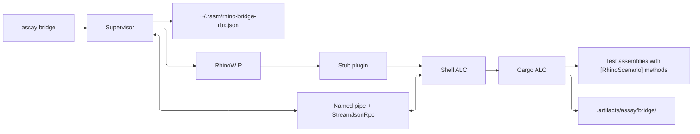

# [RHINO_BRIDGE]

`tools/rhino-bridge` is the host-bound RhinoWIP runtime bridge for typed scenario verification. Assay is the operator boundary; the bridge supervisor owns host launch, endpoint admission, JSON-RPC connection, cargo staging, scenario execution, document cleanup, quit, and one terminal `SessionEnvelope`.

## [01]-[REQUIREMENTS]

- macOS with RhinoWIP installed under `/Applications`, or `RHINO_WIP_APP_PATH` set to one Rhino `.app` bundle.
- Restored .NET project graph for the bridge projects and test projects that own typed scenarios.
- Assay invocation from the repository root.
- One live RhinoWIP bridge session per machine. Assay serializes bridge, verify, and package lifecycle work through the shared `bridge` lease.
- Bridge artifacts route under `.artifacts/assay/bridge/<runId>/`; endpoint and lease state route under `~/.rasm/`.

## [02]-[FIRST_PATH]

```bash
uv run assay bridge build
uv run assay bridge status
```

Expected signal: each command returns one Assay envelope, and the status envelope notes `bridge.reportDir=<path>` when the supervisor emitted a `SessionEnvelope`.

## [03]-[VERIFY]

```bash
uv run assay bridge verify
uv run assay bridge verify blocks
uv run assay bridge verify blocks,ui
uv run assay bridge verify CoreRail
uv run assay bridge verify 'blocks.*'
uv run assay bridge verify tests/dotnet/libs/Rasm.Rhino/Blocks/Scenarios
uv run assay bridge verify --evidence author blocks
```

Selection rules:
- Empty, `all`, or `*` selects every typed scenario corpus.
- Theme tokens select every scenario in their theme and admit `*`/`?` globs.
- Full scenario names, bare method names, and `*`/`?` globs match scenario names ordinal case-sensitive.
- Scenario owner, project, and theme-local `Scenarios/` paths each select that corpus.
- Script-file scenario discovery is absent. Test-owned typed `[RhinoScenario]` sources own scenario discovery and emit `bridge-closure.json`.
- `verify` is the default mode, demanding a valid `EvidenceCertificate` and reviewed evidence; `--evidence author` emits candidates, never proof.

## [04]-[COMMAND_SURFACE]

Public Assay bridge verbs map to these effects.

| [INDEX] | [COMMAND]                 | [EFFECT]                                                                         |
| :-----: | :------------------------ | :------------------------------------------------------------------------------- |
|  [01]   | `bridge build`            | Compile bridge projects and test-owned typed scenario closures.                  |
|  [02]   | `bridge verify [PATTERN]` | Build, stage, run, unload, prepare quit, and fold selected typed scenarios.      |
|  [03]   | `bridge status`           | Launch or reuse RhinoWIP; return endpoint, host, RPC, MCP, and capability facts. |
|  [04]   | `bridge quit`             | Prepare Rhino/GH2 documents, then run the quit ladder.                           |

Direct supervisor calls accept `status`, `quit`, `redeploy <package>`, and `verify <selection-json> <closure-manifest> [verify|author]`; `redeploy` reports itself unsupported, and Assay owns stable operator spelling, build closure preparation, artifact routing, and the outer lease.

## [05]-[MACHINE_CONTRACT]

[STDOUT]:
- Supervisor stdout carries exactly one `SessionEnvelope` JSON document.
- Assay decodes that document and projects status, first fault, notes, and artifacts into its envelope.

[STDERR]:
- Supervisor stderr carries structured diagnostic JSON lines such as `session.terminal`.
- Stderr does not replace the stdout envelope.

[STATUS]:
- Status tokens project to exit codes through the Assay wire contract; `tools/assay/README.md` routes to its owner.
- Supervisor usage errors exit `2`.

[READ_ORDER]:
1. Read top-level `status`.
2. Read `scenarioStatus` and `sessionStatus`.
3. Read `firstScenarioFailure` and `firstSessionFault`.
4. Read `fault.prescription` when `fault` is present.
5. Read `certificatePath`, then `bridge-certificate.json`.
6. Read `scenarios[]` for per-scenario verdicts.
7. Read `artifactRefs[]`, `referenceResults[]`, and `evidenceCounts`.
8. Read `reportDir` only through certificate-listed artifacts.

[ARTIFACTS]:
- `SessionEnvelope.reportDir`: `.artifacts/assay/bridge/<runId>/`.
- Certificate: `<reportDir>/bridge-certificate.json`.
- Scenario spool: `<reportDir>/events/<scenario>.jsonl`.
- Probe spool: `<reportDir>/events/probe.jsonl`.
- View captures: `<reportDir>/captures/<scenario>/<sequence>-<label>.png`.
- GH2 captures: `<reportDir>/gh2/<scenario>/<sequence>-<label>.png`.
- Manifests: `<reportDir>/manifests/<scenario>.*.json`.
- Reference results: `<reportDir>/references/<scenario>.reference-result.json`.
- Scratch manifest: `<reportDir>/scratch/<scenario>/scratch.manifest.json`.
- Reference stage: `<reportDir>/refs/<contentHash>/`.
- Unload leak dump: `<reportDir>/<pid>.gcdump` when available.
- Endpoint: `~/.rasm/rhino-bridge-rbx.json`.
- Lease: `~/.rasm/rhino-bridge-rbx.lease`.
- Quit journal: `~/.rasm/rhino-bridge-quits.jsonl`.

## [06]-[ARCHITECTURE]


```mermaid
---
config:
  layout: elk
  flowchart:
    curve: linear
    padding: 25
---
flowchart LR
    accTitle: Bridge session architecture
    accDescr: Assay drives the supervisor, which launches or reuses RhinoWIP, connects to the shell ALC over a named pipe, loads cargo, and folds scenario evidence into the run report directory.
    Assay["assay bridge"] --> Supervisor["Supervisor"]
    Supervisor --> Endpoint["~/.rasm/rhino-bridge-rbx.json"]
    Supervisor --> Rhino["RhinoWIP"]
    Rhino --> Stub["Stub plugin"]
    Stub --> Shell["Shell ALC"]
    Supervisor <--> Pipe["Named pipe + StreamJsonRpc"]
    Pipe <--> Shell
    Shell --> Cargo["Cargo ALC"]
    Cargo --> Scenarios["Test assemblies with [RhinoScenario] methods"]
    Cargo --> ReportDir[".artifacts/assay/bridge/<runId>"]
```

Text equivalent: Assay calls the supervisor; the supervisor reconciles host state, launches or reuses RhinoWIP, reads the endpoint, connects to the shell over a named pipe, loads staged cargo into a collectible ALC, runs typed scenarios, and folds shell events and spool evidence into one `SessionEnvelope`.

[OWNER_MAP]:
- `Supervisor`: process boundary, lease, bundle discovery, reconcile, launch, pipe client, staging, quit ladder, session fold.
- `Stub`: dependency-zero Rhino plugin loaded by Rhino's shared plugin context.
- `Shell`: in-host RPC target, endpoint writer, UI-thread marshal, busy admission, host-plugin preload, GH2/Rhino document cleanup.
- `Cargo`: hot-swapped scenario runner, capability probes, JSONL spool, capture writer, GH2 render lane.
- `Contract`: JSON-RPC interfaces, wire records, status algebra, faults, events, selections, and `SessionEnvelope`.
- `Gate`: fault-injection executable for supervisor kernels and optional live-host rows.

[PACKAGES]:
- `Contract`: `StreamJsonRpc` carries the RPC interfaces, and Thinktecture generates the wire vocabulary beside its JSON converters.
- `Shell`: `StreamJsonRpc` serves the named pipe; `Thinktecture.Runtime.Extensions` generates the shell-local vocabulary.
- `Supervisor`: `StreamJsonRpc` drives the pipe client, `XxHash3` keys the staged closure into the reference stage, `dotnet-gcdump` reads leaks.
- `Cargo`, `Gate`, and `Stub` reference no package: Cargo composes `Rasm.ScenarioKit` and the Contract closure, Gate rides the Supervisor closure.

## [07]-[FAILURE_READING]

Terminal signals map to one first repair surface. Read `fault.detail`, `reportDir`, and spool artifacts from the same `SessionEnvelope`; when relayed events and durable spool counts diverge, the spool owns evidence through the last decoded JSONL line.

[REPAIR_SURFACES]:
- Lease: inspect or release `~/.rasm/rhino-bridge-rbx.lease`.
- Package: read `fault`, then rebuild or redeploy `rasm-bridge`.
- Launch: check launch, endpoint liveness, and shell load evidence.
- Contract: redeploy `rasm-bridge`, then rerun `bridge status`.
- Capability: read `fault.detail` for `capability-absent`, then change the scenario requirement or host lane.
- Host: rebuild closures against the active RhinoWIP bundle.
- UI: read spool tail, captures, and host exceptions under `reportDir`.
- Crash: read `.ips` summary, spool JSONL, and captured artifacts.
- Evidence: use the spool as the durable source.

| [INDEX] | [SIGNAL]              | [READ_AS]                | [SURFACE]  |
| :-----: | :-------------------- | :----------------------- | :--------- |
|  [01]   | `busy`                | leased host              | Lease      |
|  [02]   | `poisoned endpoint`   | startup before endpoint  | Package    |
|  [03]   | `connect-failed`      | pipe admission           | Launch     |
|  [04]   | `shell-skew`          | shell contract skew      | Contract   |
|  [05]   | `capability-absent`   | failed required probe    | Capability |
|  [06]   | `host-drift`          | host API drift           | Host       |
|  [07]   | `ui-wedged`           | UI progress stall        | UI         |
|  [08]   | `rhino-crash`         | host exit                | Crash      |
|  [09]   | `evidence.divergence` | relay and spool mismatch | Evidence   |

## [08]-[SCENARIO_CONTRACT]

Typed scenario entrypoints carry `[RhinoScenario("<theme>")]` and accept one `ScenarioContext`. That entrypoint returns `Fin<Unit>`, emits facts through `ScenarioContext.Fact`/`Note`, asserts through `Require` or `Expect`, certifies reference facts through `Certify`, and obtains bridge-indexed captures through `Capture.Snapshot`.

Capability requirements live on the attribute as `Requires`. `CargoHost`'s capability statics are the register Cargo probes; a scenario whose required capability is not `ok` is rejected.

Scenario code does not write `#r`, `#load`, absolute build-output paths, local report paths, direct MCP calls, or direct bitmap/capture files. Assay builds the test projects that own typed scenarios, reads each `bridge-closure.json`, aggregates selected closures, and hands the manifest to the supervisor.

`ReferenceEvidence` lives beside the scenario owner under `Scenarios/_references/<theme>/<method>.reference.json`. Its lifecycle: an `--evidence author` run writes `<theme>/<method>.candidate.reference.json` under the reference root; a human review sets `admission` to `reviewed` and renames the file to `<method>.reference.json`; verify mode then matches within declared tolerances.

Verify over a root with no reviewed corpus reports `unpromoted` and degrades; a promoted root with a missing or mismatched reference fails. PNGs are forensic artifacts by default; stable object, geometry, viewport, GH2 canvas, scratch, and normalized visual metadata are the reference surface.

## [09]-[INTEGRATIONS]

[RHINO_WIP]:
- Bundle discovery uses `RHINO_WIP_APP_PATH` when set; otherwise it admits the newest `/Applications/Rhino*.app` by `CFBundleVersion`.
- Launch sets `RHINO_MCP_AUTOSTART_PORT=0`.
- Reconcile clears only recovery markers that match supervised quit-journal windows; foreign Rhino state is reported and left intact.
- Launch-edge clearing runs on supervisor launch alone, force-clearing the `.rhl` file and `Rhinoceros-*.ips` sentinels so no headless launch wedges.

[STREAM_JSON_RPC]:
- Shell exposes `IBridgeShell` over a named pipe with `SystemTextJsonFormatter`.
- Supervisor exposes one `IBridgeEvents.PublishAsync` sink for fact, capture, phase, progress, and host-exception events.

[PACKAGE_RAIL]:
- Package slug `rasm-bridge` uses the same bridge lease.
- Deploy and publish paths cycle the live host through quit and refresh steps.

[MCP]:

Bridge starts no MCP listener of its own. MCP tooling runs through McNeel's Rhino MCP platform, registered out-of-band with the agent. Assay is NOT an MCP server: it is the deterministic typed-verification boundary, and the McNeel platform is the interactive conversational host. Both are orthogonal capabilities sharing one live RhinoWIP session.

[INSTALL]:
- Add the newest McNeel `Rhino-MCP-Platform` to the Rhino package store via the Rhino PackageManager (Yak).
- That package ships the `rhino-mcp-router` stdio server; the bridge never bundles, launches, or supervises it.

[REGISTER]:
- Declare `rhino-mcp-router` to Claude Code at USER scope in `~/.claude.json` as a `type: stdio` server.
- `rhino-mcp-router` is a per-operator host capability, so a project-scope `.mcp.json` registration rejects.

[HEALTH]:
- `bridge status` surfaces `mcp.platform.version` and `mcp.listener` as capability facts read from the loaded host state.
- `mcp.platform.version` beside an active `mcp.listener` confirms the McNeel platform loaded into the host the bridge supervises.

[CROSS_SESSION_DRIFT]:
- Rail `delta` folds `mcp.platform.version`, `mcp.listener`, `rhinoVersion`, and `rpc.streamjsonrpc` into per-session fact rows.
- Cross-session change on one of those facts surfaces as a `RunDelta.drift` row, so host and platform drift tracks itself.

[RUN_CSHARP_CONSTRAINT]:
- `run_csharp` evaluates a statement body and rejects a top-level `return <expr>;`, so results emit through `Console.WriteLine` and read off stdout.

[BRIDGE_IDLE_RULE]:
- MCP stays idle through every bridge-held lifecycle: its tools drive `RhinoApp` command history, injecting foreign lines into what cargo spools.
- Promotion path: MCP observation -> typed `[RhinoScenario]` -> authoring certificate -> reviewed `ReferenceEvidence` -> `bridge verify`.
- `Rasm.AppHost` tools reaching `RhinoApp` command history inherit that idle discipline; a host-neutral capability projection stands outside it.

[VERDICT]:
- Their relationship is `additive_external`. McNeel's platform is interactive and conversational; the bridge is deterministic typed verification.
- `bridge status` is the one seam reporting both as capability facts.

## [10]-[BOUNDARIES]

- Keep `Contract` additive: existing fields, union discriminators, status ranks, and exit codes are not renamed or reused.
- Keep `Stub` dependency-zero outside Rhino host assemblies.
- Keep host assemblies in the host/default ALC and bridge RPC assemblies in the shell ALC.
- Keep cargo references collectible and per-swap; cargo unload leaks are supervisor decisions, not shell exceptions.
- Keep Rhino and GH2 document cleanup inside `PrepareQuitAsync` before the quit ladder runs.
- Keep the quit ladder to Apple Event terminate, Cocoa force terminate, then `kill(2)` SIGKILL.
- Keep generated evidence under `.artifacts/assay/bridge/<runId>/` or `~/.rasm/`; no bridge command writes root scratch files.
