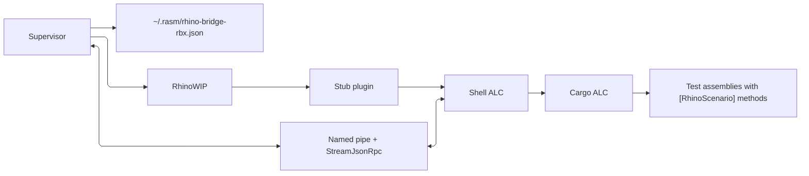

# [RHINO_BRIDGE]

## [01]-[REQUIREMENTS]

- macOS with RhinoWIP installed under `/Applications`, or `RHINO_WIP_APP_PATH` set to one Rhino `.app` bundle.
- Restored .NET project graph for the bridge projects and test projects that own typed scenarios.

## [02]-[COMMAND_SURFACE]

| [INDEX] | [COMMAND]                 | [EFFECT]                                                                         |
| :-----: | :------------------------ | :------------------------------------------------------------------------------- |
|  [01]   | `bridge build`            | Compile bridge projects and test-owned typed scenario closures.                  |
|  [02]   | `bridge verify [PATTERN]` | Build, stage, run, unload, prepare quit, and fold selected typed scenarios.      |
|  [03]   | `bridge status`           | Launch or reuse RhinoWIP; return endpoint, host, RPC, MCP, and capability facts. |
|  [04]   | `bridge quit`             | Prepare Rhino/GH2 documents, then run the quit ladder.                           |

## [03]-[MACHINE_CONTRACT]

[STDOUT]:
- Supervisor stdout carries exactly one `SessionEnvelope` JSON document.

[STDERR]:
- Supervisor stderr carries structured diagnostic JSON lines such as `session.terminal`.
- Stderr does not replace the stdout envelope.

[STATUS]:
- Supervisor usage errors exit `2`.

[READ_ORDER]:
1. Read top-level `status`.
2. Read `scenarioStatus` and `sessionStatus`.
3. Read `firstScenarioFailure` and `firstSessionFault`.
4. Read `fault.prescription` when `fault` is present.
5. Read `certificatePath`, then `bridge-certificate.json`.
6. Read `scenarios[]` for per-scenario verdicts.
7. Read `artifactRefs[]`, `referenceResults[]`, and `evidenceCounts`.
8. Read `reportDir` only through certificate-listed artifacts.

[ARTIFACTS]:
- Certificate: `<reportDir>/bridge-certificate.json`.
- Scenario spool: `<reportDir>/events/<scenario>.jsonl`.
- Probe spool: `<reportDir>/events/probe.jsonl`.
- View captures: `<reportDir>/captures/<scenario>/<sequence>-<label>.png`.
- GH2 captures: `<reportDir>/gh2/<scenario>/<sequence>-<label>.png`.
- Manifests: `<reportDir>/manifests/<scenario>.*.json`.
- Scratch manifest: `<reportDir>/scratch/<scenario>/scratch.manifest.json`.
- Reference stage: `<reportDir>/refs/<contentHash>/`.
- Unload leak dump: `<reportDir>/<pid>.gcdump` when available.
- Endpoint: `~/.rasm/rhino-bridge-rbx.json`.
- Lease: `~/.rasm/rhino-bridge-rbx.lease`.
- Quit journal: `~/.rasm/rhino-bridge-quits.jsonl`.

## [04]-[ARCHITECTURE]

```mermaid
---
config:
  layout: elk
  flowchart:
    curve: linear
    padding: 25
---
flowchart LR
    accTitle: Bridge session architecture
    Supervisor --> Endpoint["~/.rasm/rhino-bridge-rbx.json"]
    Supervisor --> Rhino["RhinoWIP"]
    Rhino --> Stub["Stub plugin"]
    Stub --> Shell["Shell ALC"]
    Supervisor <--> Pipe["Named pipe + StreamJsonRpc"]
    Pipe <--> Shell
    Shell --> Cargo["Cargo ALC"]
    Cargo --> Scenarios["Test assemblies with [RhinoScenario] methods"]
```

[OWNER_MAP]:
- `Supervisor`: process boundary, lease, bundle discovery, reconcile, launch, pipe client, staging, quit ladder, session fold.
- `Stub`: dependency-zero Rhino plugin loaded by Rhino's shared plugin context.
- `Shell`: in-host RPC target, endpoint writer, UI-thread marshal, busy admission, host-plugin preload, GH2/Rhino document cleanup.
- `Cargo`: hot-swapped scenario runner, capability probes, JSONL spool, capture writer, GH2 render lane.
- `Contract`: JSON-RPC interfaces, wire records, status algebra, faults, events, selections, and `SessionEnvelope`.
- `Gate`: fault-injection executable for supervisor kernels and optional live-host rows.

[PACKAGES]:
- `Contract`: `StreamJsonRpc` carries the RPC interfaces, and Thinktecture generates the wire vocabulary beside its JSON converters.
- `Shell`: `StreamJsonRpc` serves the named pipe; `Thinktecture.Runtime.Extensions` generates the shell-local vocabulary.
- `Supervisor`: `StreamJsonRpc` drives the pipe client, `XxHash3` keys the staged closure into the reference stage, `dotnet-gcdump` reads leaks.
- `Cargo`, `Gate`, and `Stub` reference no package: Cargo composes `Rasm.ScenarioKit` and the Contract closure, Gate rides the Supervisor closure.

## [05]-[FAILURE_READING]

Terminal signals map to one first repair surface. Read `fault.detail`, `reportDir`, and spool artifacts from the same `SessionEnvelope`; when relayed events and durable spool counts diverge, the spool owns evidence through the last decoded JSONL line.

[REPAIR_SURFACES]:
- Lease: inspect or release `~/.rasm/rhino-bridge-rbx.lease`.
- Launch: check launch, endpoint liveness, and shell load evidence.
- Capability: read `fault.detail` for `capability-absent`, then change the scenario requirement or host lane.
- Host: rebuild closures against the active RhinoWIP bundle.
- UI: read spool tail, captures, and host exceptions under `reportDir`.
- Crash: read `.ips` summary, spool JSONL, and captured artifacts.
- Evidence: use the spool as the durable source.

| [INDEX] | [SIGNAL]              | [READ_AS]                | [SURFACE]  |
| :-----: | :-------------------- | :----------------------- | :--------- |
|  [01]   | `busy`                | leased host              | Lease      |
|  [02]   | `poisoned endpoint`   | startup before endpoint  | Package    |
|  [03]   | `connect-failed`      | pipe admission           | Launch     |
|  [04]   | `shell-skew`          | shell contract skew      | Contract   |
|  [05]   | `capability-absent`   | failed required probe    | Capability |
|  [06]   | `host-drift`          | host API drift           | Host       |
|  [07]   | `ui-wedged`           | UI progress stall        | UI         |
|  [08]   | `rhino-crash`         | host exit                | Crash      |
|  [09]   | `evidence.divergence` | relay and spool mismatch | Evidence   |

## [06]-[SCENARIO_CONTRACT]

Typed scenario entrypoints carry `[RhinoScenario("<theme>")]` and accept one `ScenarioContext`. That entrypoint returns `Fin<Unit>`, emits facts through `ScenarioContext.Fact`/`Note`, asserts through `Require` or `Expect`, certifies reference facts through `Certify`, and obtains bridge-indexed captures through `Capture.Snapshot`.

Capability requirements live on the attribute as `Requires`. `CargoHost`'s capability statics are the register Cargo probes; a scenario whose required capability is not `ok` is rejected.

Verify over a root with no reviewed corpus reports `unpromoted` and degrades; a promoted root with a missing or mismatched reference fails. PNGs are forensic artifacts by default; stable object, geometry, viewport, GH2 canvas, scratch, and normalized visual metadata are the reference surface.

## [07]-[BOUNDARIES]

- Keep `Contract` additive: existing fields, union discriminators, status ranks, and exit codes are not renamed or reused.
- Keep `Stub` dependency-zero outside Rhino host assemblies.
- Keep host assemblies in the host/default ALC and bridge RPC assemblies in the shell ALC.
- Keep cargo references collectible and per-swap; cargo unload leaks are supervisor decisions, not shell exceptions.
- Keep Rhino and GH2 document cleanup inside `PrepareQuitAsync` before the quit ladder runs.
- Keep the quit ladder to Apple Event terminate, Cocoa force terminate, then `kill(2)` SIGKILL.
